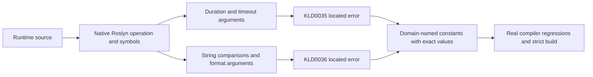

# ADR-111: Semantic rules for magic runtime values

Status: Accepted (implementation and verification pending)
Date: 2026-10-05

The owner authorizes code-quality rules in KeyLoad.Analyzers and requires named
constants for magic strings and numbers. CodeQuality REQ-CQ-011 / AC-CQ-029..032
defines the exact supported contexts, positive/negative/edge/error flows and task
graph. Existing KLD0001 and the root const policy stay mandatory.

Use bound native Roslyn operations and exact framework symbols to distinguish
duration/timeout policy, string discrimination and format tokens from unrelated
caller data. KLD0035 and KLD0036 are enabled Errors in runtime-facing KeyLoad
assemblies, including infrastructure and benchmark code. Compiler fixture/test
data assemblies do not define runtime policy for these new rules. Generated code
uses the native exclusion API. Existing diagnostics keep their IDs and severity.

A blanket syntax ban introduces thousands of findings, including data and
structural arithmetic. An arbitrary global allowance for zero/one would hide real
timeout policies. The selected semantic contexts give actionable diagnostics and
require a preserving migration in the same stage. The root policy still applies
to uncovered contexts. A broader complete migration needs an explicit contract
extension; do not silently add a suppression baseline or change analyzer severity.

Ordered implementation: TASK-CQ-LITERALS-001 read-only inventory; 002 lead-owned
semantic rules/shared docs/configuration; 003 disjoint new compiler regressions;
004 diagnostic-driven migrations and lead-owned final integration. Lead planning
freezes scope before write workers begin, reviews every diff and runs all gates.
No runtime public signature, dependency, format, trust or topology change occurs.
Rollout is a coherent rebuild. Rollback reverts these new rules and preserving
constant extractions together; it never removes existing rules or persisted data.

Tests compile against real pinned SDK and framework metadata before diagnostic
assertions. Verify exact spans, named constants, direct/nested arguments, aliases,
overloads, generated paths and unrelated methods. Source-bound coverage inventory
includes every new executable helper and both pipelines with unchanged80/70/90
thresholds. Use only the Aspire-owned test entry, then formatter and final strict
solution Release build. Complete existing unit/scalar/recovery/RF3 gates remain
mandatory. Baseline and new failures stay distinct and honest; no passing scoped
check establishes complete-source or Linux qualification.
