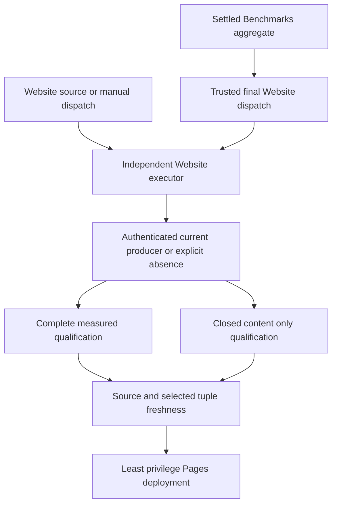

# ADR-112: Independent Website publication with optional benchmarks

Status: Accepted; content-only qualification and Pages passed; complete measured qualification pending.
Feature: BenchmarkComparisons, REQ/AC-BC-WEB-001..007.

## Qualified current content publication (2026-10-06)

Exact source ec2c70f11efb0092b842458240e0f047a3735f77 passed the Linux full
solution build/format in Benchmarks run37492665238/job112369117434, 0 warnings/errors.
Its Docker-image gate failed and aggregation skipped; final Trigger Website
job112374043959 succeeded, creating the separate manual Website run37494106149.
That consumer's authenticated completion wait passed; remaining qualification
was still running at recording, so its Pages result is not inferred.

Independent push Website run37492665298 completed Check website job112369118969
and Publish website job112377731260 successfully. Original Aspire receipts prove
startup6/6, selection30/30, analyzers388/388 and content Site5/5, zero skipped.
Native Node/Chrome coverage passed unchanged80/70/90 thresholds: lines93, branches78,
critical builder96 and bootstrap92. Original qualification artifact11426727717
SHA2560e1bfc93b669224799803b219b5b7be6f131be3d7cda6fab651918c521220c4e was verified.

Predeploy source/absence freshness passed at2026-10-06T16:30:19Z. Original
publication artifact11426714932, SHA2560325a5af84eb1f467ecebd8d9b4b58c5315ec950842022bfb796f695b056207a,
records actual Pages success. Public https://www.keyload.cloud/ HTML matched the
qualified original byte for byte, SHA2563f1b719e86f1a700b016367881f1cc597af2acb7a07f167d01b24737ea08fff6.
Its schema3 publication receipt records website/control ec2c70f1, measured:null,
benchmarks:null and content scope; SHA2567637a00e70384b7cdfba1ad24cae9d98af8537b5c22028bd4111a7129152904a.
This qualifies current content-only pipeline delivery. Complete current measured
cohort and global database recovery/RF3/endurance gates retain their actual status.
Keep Accepted until every required measured gate also passes.

## Decision and trust boundary

Website/website.yml owns website source qualification and Pages publication.
Its executor accepts trusted own-main push and workflow_dispatch. Build and Tests
retains every build/analyzer/unit/scalar/recovery/RF3 gate independently.
Benchmarks owns native measurements and the final settled aggregate; its final
website-trigger job dispatches Website on main after success or failure, using
always() && !cancelled() and exact trusted repository/event admission. Only that
job has actions:write; database jobs remain read-only. Trigger failure is visible.

Optional benchmark_run_id authenticates the original own-repository main run,
Benchmarks workflow name/path, event and source, then waits at most five minutes
for completion. It does not select authoritative metrics or bypass freshness.
Empty input skips waiting. Invalid metadata, API failure and timeout fail closed.

Select the newest authenticated completed own-main producer with a successful
aggregate and the complete current 100K/1M cohort contract. Historical originals
remain immutable and unavailable as current metrics; unknown malformed evidence
cannot masquerade as absence. A failed/cancelled/in-progress run supplies no
measurements. A selected corrupt, expired or missing archive fails without an
older fallback. If no current producer is ready, emit no metrics and a static
empty state with benchmarks:null in the publication receipt.

## Qualification and acceptance

Measured publication requires complete original archive/provenance/source,
coverage, browser and source/selected-tuple freshness gates. Content-only
publication has its own closed SiteContent TUnit selection through the same
Aspire site entry and proves every emitted/executed asset, browser action/result
and source path with applicable coverage thresholds, including critical90.
Measurement/archive numeric proof is N/A for an artifact that contains no metrics;
content-only success cannot be advertised as measured qualification. Native TRX
has no skipped cases, owned resources settle, and fresh source/control identities
and selected tuple (including null) are checked again before deployment.
Pages/OIDC writes are confined to the needs-gated deploy job.

## Ordered implementation and delivery

1. TASK-WEB-SEPARATE-001 / TASK-WEB-TRIGGER-001: lead freezes REQ/AC, policies,
   exact workflows/events, task graph and private disjoint ownership before code.
2. Selection contributor owns site-isolated-github capture/runs/contract; builder
   contributor owns site/Features/BenchmarkComparisons/build-site.mjs. Preserve
   exact original artifacts, bounded native calls and source closure.
   TASK-CURRENT-WEBSITE-EVENT-071 limits capture to current executor and REST
   selection/wait inputs. It removes event-file parsing and its exclusive probe,
   cap and fixtures, preserving REST workflow_runs and artifact.workflow_run
   provenance, actual authenticated capture and latest-selection operation flows.
3. Qualification contributor owns SiteContent cases/helpers/contracts and current
   coverage/source inventory joins. Native file/Node/Chrome flows prove successful
   admission, absence, foreign executor, corrupt evidence and healthy follow-up.
   Workflow-shape review uses actionlint/YAML and is not product runtime proof.
4. Lead joins workflows/composites, native dispatch/admission/wait, tests, inventories
   and docs; verifies build/format/governance, Aspire cases and actual exact-source
   Linux Website/Pages/freshness evidence. Release context consumes Build and Tests
   with its actual four job labels and all source/attempt/success protections.
5. All REQ/AC-WEB gates retain original failing and passing results. Commit/push
   the full owner-requested active-branch checkpoint; a commit or successful
   trigger alone does not qualify Website publication or the database.

Dependencies are official Pages actions, GitHub REST, Node, Chrome, TUnit/MTP and
Aspire. No database/package/DNS change. Rollout joins producer/consumer/builder/
tests/docs in one source checkpoint. Rollback preserves the independent Website,
final dispatch, every required gate and immutable measured originals. Keep Accepted
until actual measured and content-only qualification, freshness and Pages proof exist.
