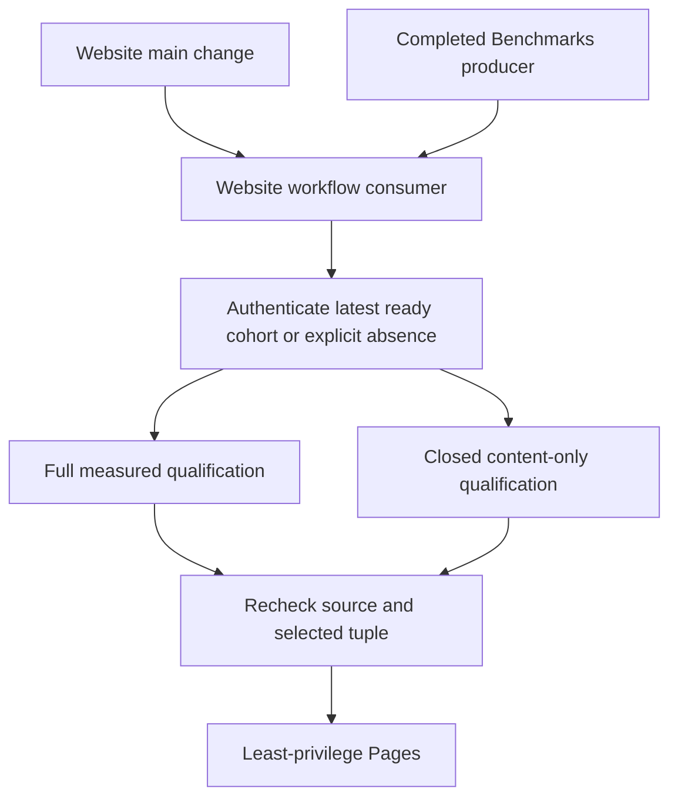

# ADR-112: Independent website publication with optional benchmarks

Status: Accepted
Date: 2026-10-06
Feature: BenchmarkComparisons, REQ/AC-BC-WEB-001..006

## Decision and boundaries

The separate Website workflow publishes website source changes independently of Benchmarks. Select the
newest authenticated completed own-main producer with a successful aggregate.
A failed/cancelled/in-progress producer or no successful aggregate supplies no
website measurements. If there is no ready producer, publish a qualified product
website with no metric artifacts, a static empty state and benchmarks:null in its
publication receipt. Never translate API/authentication/validation errors into
absence. The newest ready corrupt/expired/missing archive fails without older
fallback. Actual Benchmarks completion automatically starts a fresh Website consumer.

The existing full measured qualification path remains mandatory whenever metrics
are included. Content-only qualification is a distinct closed SiteContent TUnit
selection through the same Aspire-owned site entry; it verifies all emitted and
executed assets/browser/source paths and retains applicable coverage thresholds.
Measurement-only numeric/archive qualification is N/A because this artifact
contains no metrics; it cannot be labeled as full measured qualification. Exact
website/control identities, latest-ready tuple (including null), joined shutdown,
no-skip TRX and least-privilege needs-gated Pages remain mandatory.

## Implementation contract

1. Root updates policy and the feature's REQ/AC/test/ordered task graph first.
2. Disjoint selection worker adds explicit optional selection/capture state to
   scripts/Features/BenchmarkComparisons/site-isolated-github-{capture,runs,contract}.mjs
   and native absence freshness handling; existing archive proof remains intact.
3. Builder worker owns site/Features/BenchmarkComparisons/build-site.mjs and
   explicit no-metrics emitted HTML/assets. No synthetic aggregate or parallel
   replacement builder. Root owns closure/inventory integration.
4. Qualification worker owns new SiteContent Cases/Helpers/Contracts and only
   SiteCoverageGate/source inventory scoping in tests/KeyLoad.SiteTests; real
   file/Node/Chrome success/failure/safety coverage, no alternate test runner.
5. Root integrates Website/composites, source closure, workflow regressions and shared
   docs. Build/format/governance, actual Aspire tests, exact Linux CI and provider
   evidence map to the feature acceptance matrix. Commit only scoped relevant
   changes on the current branch, preserve concurrent work and protections.

Dependencies: existing official Pages actions, TUnit/MTP, Aspire entry, actual
GitHub REST evidence, Node and Chrome. No package or persisted-format change.
Rollout producer/consumer/builder/tests atomically. Root owns integration/join
points and deployment; workers do not commit or mutate other scopes. Rollback
reverts this coherent slice to metric-required publication, honestly restoring
its availability limitation, without changing original reports or live database.
Remain Accepted until both measured and no-data qualification/freshness and
actual Pages proof exist. Initial historical artifact-completeness failure is
recorded in the feature baseline; it remains unavailable rather than rewritten.

## Standalone workflow correction, 2026-10-06

REQ/AC-BC-WEB-006 changes the workflow boundary: Website is a fourth standalone
workflow at `.github/workflows/website.yml`; `.github/workflows/ci.yml` is named
Build and Tests and contains no website jobs or Benchmarks completion trigger.
This explicit owner direction supersedes the earlier three-workflow inventory.
Build and Tests retains every full-solution, analyzer, unit, scalar, process
recovery and Aspire RF3 gate. Website retains the existing qualify/deploy actions,
trusted-main admission, optional authenticated data, source freshness and Pages
permissions. No package, database, release or DNS contract changes.

Ordered integration graph: TASK-WEB-SEPARATE-001 lead owns this contract, root and
local policy; TASK-WEB-SEPARATE-002 lead extracts the existing website graph,
updates its native executor identity and source closure; TASK-WEB-SEPARATE-003
bounded test worker reviews/updates real native context tests and rejects CI as a
website executor; TASK-WEB-SEPARATE-004 read-only reviewer checks active references
and trust boundaries; TASK-WEB-SEPARATE-005 lead joins all changes and runs
workflow lint, governance, native context/content tests, canonical build/format
and actual trusted-main Website/Pages publication. Tests/review depend on the
frozen Website name/path; commits and delivery remain lead-owned. Rollback reverts
this coherent boundary change without changing original measured artifacts.

Workflow graph assertions are static infrastructure review, not product tests.
Use actionlint plus parsed YAML graph inspection; actual native Node context
operations cover Website admission and foreign executor rejection through TUnit.
Provider qualification requires the genuine standalone GitHub run and Pages URL.
Existing source/build failures stay explicit and are not bypassed.

The original screenshot failure is optional selection of authenticated producer
37328642737/1, source `ce2eace916b3660a4c7fe2976a012637600c3b28`, aggregate
job111915038450. Its exact five-step old aggregate format matches the already
frozen unsupported c16 generation and lacks current scale accounting/receipt.
Recognize only this additional exact source with the same successful native and
owned step contract as unavailable; do not admit its metrics or relax validation
for unknown generations. This is AC-BC-WEB-002 absence handling, not benchmark
qualification or permission to consume malformed evidence.

The same boundary change updates the prepared Release context validator's current
workflow name to Build and Tests and its four actual readable job labels. It
retains ci.yml, the complete exact-source/current-attempt/success requirement,
unique jobs and immutable release protections. Static contract/AST review is the
allowed preparation evidence; no product Release is dispatched to verify it.

## Final Benchmarks dispatch, owner clarification 2026-10-06

REQ/AC-BC-WEB-007 supersedes the `workflow_run` subscription. Benchmarks' final
`website-trigger` job depends on the settled `comparison-aggregate` join and uses
`always() && !cancelled()` plus trusted own-main repository/event admission.
Its only effect is dispatching the separate Website workflow on main; all site
source, tests, builds and Pages remain Website-owned. Confine `actions: write` to
that trigger job, keep every database job read-only, and dispatch after successful
or failed benchmark work. Trigger failure remains visible and is never fabricated
as publication success. Build and Tests gains no Website dependency.

The dispatch passes optional `benchmark_run_id` only to resolve the brief race
before its producer workflow becomes completed. Website authenticates that run
against original GitHub metadata (own repository/id, main, Benchmarks name/path,
push/manual event and valid source) and waits at most five minutes before existing
newest-ready selection. Failure/cancellation does not supply metrics; invalid
metadata, API errors and timeout fail closed. Empty manual input skips waiting.
The run input neither selects authoritative metrics nor bypasses archive or
source/tuple freshness. Current executor events are push and workflow_dispatch;
retired workflow_run admission is rejected while immutable event validation
fixtures remain history.

TASK-WEB-TRIGGER-001 lead updates root/local policy and this REQ/AC contract first.
TASK-WEB-TRIGGER-002 lead owns benchmarks.yml final dispatch, website.yml input,
bounded admission/wait and native executor-event contract; tests cover manual
admission/retired event rejection using unchanged controlled objects and a healthy
follow-up through the actual context API. TASK-WEB-TRIGGER-003 read-only reviewer
audits the trust/permission/race contract; lead joins static actionlint/YAML graph,
Aspire regressions, canonical build/format and genuine final dispatch plus separate
Website/Pages evidence. Preserve unrelated checkout work. No package/data change;
rollback reverts this coherent dispatch contract to the earlier completion hook
without rewriting evidence or metric archives. Remain Accepted until original
required qualification/provider gates have passed.

## Original provider join and qualification failures (2026-10-06)

The original cfe3833c Benchmarks run 37486656353 failed its Docker-image gate and
skipped aggregation. Its final Trigger Website job 112353758570 nevertheless
succeeded using only actions:write and created the separate Website
workflow_dispatch run 37488242682 on the same source. This is actual dispatch
proof, not Website/Pages publication proof.

The preceding b58fab11 Website run 37484236243 passed source/tool, startup,
optional-selection, analyzer and format/governance gates. Its original full
Site TRX records 203/220 passed, 17 failed, 0 skipped, 0 timeouts; native coverage
failed unchanged critical90 thresholds. Retain that failure. TASK-WEB-SEPARATE-005
must align the instrumented native capture with the production optional-ready
selector and the archive positive control with the actual generation-aware
provider inventory, preserving original ZIP hashes, negative assertions and
all required qualification gates. The original native keyboard receipt shows
Linux Chrome opened the select popup on the first ArrowUp while retaining value3;
use an additional native ArrowUp only after that observed popup state, then Enter,
and retain the exact value2/row assertions. No scripted select/change replacement.
Other failures and current composite coverage
remain unqualified until authentic evidence supports their complete repair.

### Current-compatible readiness

Apply the existing QualifySite and BuildIsolatedSite current-cohort and
no-historical-publication-fallback boundaries. The frozen intensive historical
sources have original 4,096-document/10,000-operation controls and cannot supply
the active 100k/1m composite cohort. Optional live selection MUST authenticate
their native run, attempt, repository, workflow, successful aggregate and exact
source-bound steps, then return unavailable for that source. Strict historical
selection/archives and explicit validate mode remain intact. Older ready
current-composite cohorts remain eligible. Never skip unknown malformed selected
evidence, waive critical90, rewrite an archive or manufacture current measurements.

REQ/AC-BC-WEB-002 covers this compatible-absence route: add actual production
selector regression controls containing the unchanged retained native objects,
prove live historical-unavailable plus explicit historical-selected behavior,
and preserve every existing controlled rejection and current step contract.
TASK-WEB-SEPARATE-005 joins source checks, Aspire unit regressions, canonical
build/format and genuine content-only Website/Pages/freshness evidence. The
current-composite measured gates remain mandatory and explicitly unqualified
until their real producer evidence and full suite pass.

The complete original pre-#53 job-page audit found two additional successful
seven-step historical producers: run 37179484718/job 111384783112/source
`0d78eb43dceac2f386dca7bbccb11f9d1e3d43a3` and run 37166698745/job
111347065594/source `fabff69193f41c784f0b36b85c1f34d82fa9903d`.
Retain exact native run/job fixtures and classify only these source-bound,
successful native-wrapper/seven-owned-step generations unavailable. Do not
extend the frozen historical archive parser or admit their metrics. Other
pre-#53 producers have no successful aggregate; the existing aa49 historical
generation stays under its exact existing contract. Unknown step/source changes
continue to reject rather than masquerade as absent data.

The final compatible-readiness development checkpoint passed30/30 native
Aspire-owned preparation cases, 0 skipped; original TRX SHA256
`36890550e4196c227cf359a692ec142a9c4f1b1d91d5e98e8f0cf9f7652303f6`. Scoped Unit/AppHost build and Unit/Site
format verification passed. The full shared solution attempt failed unrelated
concurrent StorageRecovery recovery/RF3 references; no legacy implementation
was restored. Exact committed-source Linux build, Website freshness/coverage
and Pages remain pending and are not inferred from this development checkpoint.
