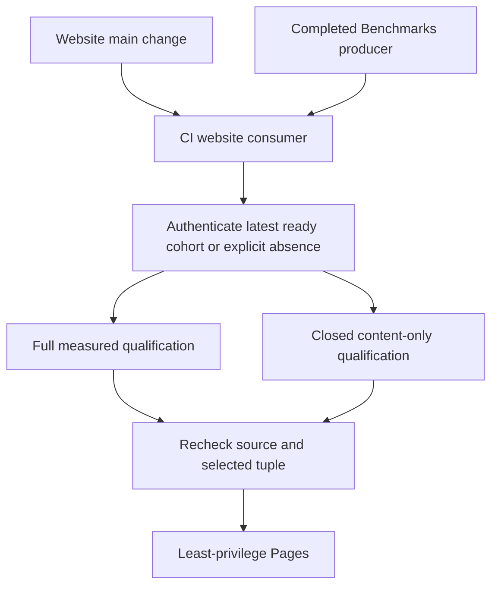

# ADR-112: Independent website publication with optional benchmarks

Status: Accepted
Date: 2026-10-06
Feature: BenchmarkComparisons, REQ/AC-BC-WEB-001..005

## Decision and boundaries

CI publishes website source changes independently of Benchmarks. Select the
newest authenticated completed own-main producer with a successful aggregate.
A failed/cancelled/in-progress producer or no successful aggregate supplies no
website measurements. If there is no ready producer, publish a qualified product
website with no metric artifacts, a static empty state and benchmarks:null in its
publication receipt. Never translate API/authentication/validation errors into
absence. The newest ready corrupt/expired/missing archive fails without older
fallback. Actual Benchmarks completion automatically starts a fresh CI consumer.

The existing full measured qualification path remains mandatory whenever metrics
are included. Content-only qualification is a distinct closed SiteContent TUnit
selection through the same Aspire-owned site entry; it verifies all emitted and
executed assets/browser/source paths and retains applicable coverage thresholds.
Measurement-only numeric/archive qualification is N/A because this artifact
contains no metrics; it cannot be labeled as full measured qualification. Exact
website/control identities, latest-ready tuple (including null), joined shutdown,
no-skip TRX and least-privilege needs-gated Pages remain mandatory.

## Implementation contract

1. Root updates policy and the feature's REQ/AC/test/ordered task graph first.
2. Disjoint selection worker adds explicit optional selection/capture state to
   scripts/Features/BenchmarkComparisons/site-isolated-github-{capture,runs,contract}.mjs
   and native absence freshness handling; existing archive proof remains intact.
3. Builder worker owns site/Features/BenchmarkComparisons/build-site.mjs and
   explicit no-metrics emitted HTML/assets. No synthetic aggregate or parallel
   replacement builder. Root owns closure/inventory integration.
4. Qualification worker owns new SiteContent Cases/Helpers/Contracts and only
   SiteCoverageGate/source inventory scoping in tests/KeyLoad.SiteTests; real
   file/Node/Chrome success/failure/safety coverage, no alternate test runner.
5. Root integrates CI/composites, source closure, workflow regressions and shared
   docs. Build/format/governance, actual Aspire tests, exact Linux CI and provider
   evidence map to the feature acceptance matrix. Commit only scoped relevant
   changes on the current branch, preserve concurrent work and protections.

Dependencies: existing official Pages actions, TUnit/MTP, Aspire entry, actual
GitHub REST evidence, Node and Chrome. No new package/version/storage migration.
Rollout producer/consumer/builder/tests atomically. Root owns integration/join
points and deployment; workers do not commit or mutate other scopes. Rollback
reverts this coherent slice to metric-required publication, honestly restoring
its availability limitation, without changing original reports or live database.
Remain Accepted until both measured and no-data qualification/freshness and
actual Pages proof exist. Initial historical artifact-completeness failure is
recorded in the feature baseline; it remains unavailable rather than rewritten.

