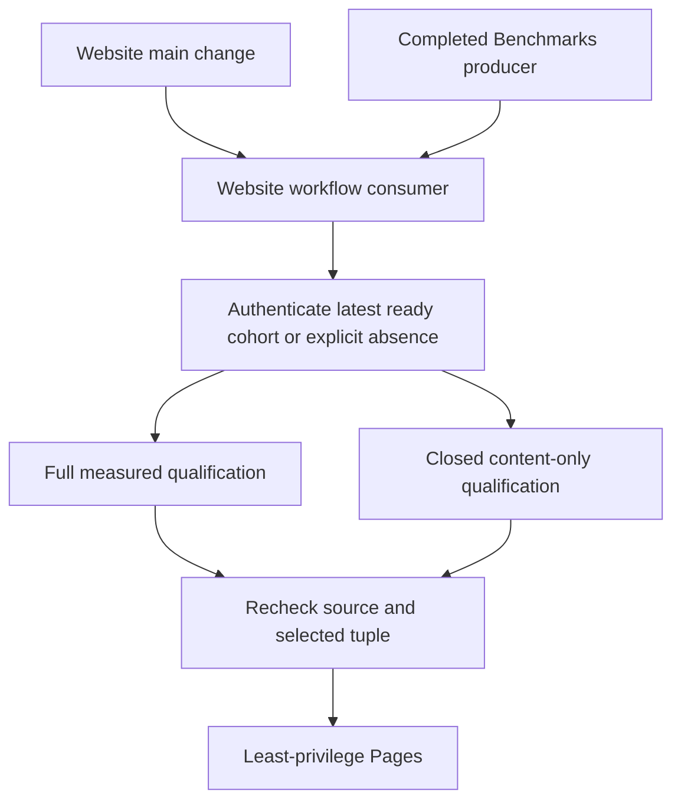

# ADR-112: Independent website publication with optional benchmarks

Status: Accepted
Date: 2026-10-06
Feature: BenchmarkComparisons, REQ/AC-BC-WEB-001..006

## Decision and boundaries

The separate Website workflow publishes website source changes independently of Benchmarks. Select the
newest authenticated completed own-main producer with a successful aggregate.
A failed/cancelled/in-progress producer or no successful aggregate supplies no
website measurements. If there is no ready producer, publish a qualified product
website with no metric artifacts, a static empty state and benchmarks:null in its
publication receipt. Never translate API/authentication/validation errors into
absence. The newest ready corrupt/expired/missing archive fails without older
fallback. Actual Benchmarks completion automatically starts a fresh Website consumer.

The existing full measured qualification path remains mandatory whenever metrics
are included. Content-only qualification is a distinct closed SiteContent TUnit
selection through the same Aspire-owned site entry; it verifies all emitted and
executed assets/browser/source paths and retains applicable coverage thresholds.
Measurement-only numeric/archive qualification is N/A because this artifact
contains no metrics; it cannot be labeled as full measured qualification. Exact
website/control identities, latest-ready tuple (including null), joined shutdown,
no-skip TRX and least-privilege needs-gated Pages remain mandatory.

## Implementation contract

1. Root updates policy and the feature's REQ/AC/test/ordered task graph first.
2. Disjoint selection worker adds explicit optional selection/capture state to
   scripts/Features/BenchmarkComparisons/site-isolated-github-{capture,runs,contract}.mjs
   and native absence freshness handling; existing archive proof remains intact.
3. Builder worker owns site/Features/BenchmarkComparisons/build-site.mjs and
   explicit no-metrics emitted HTML/assets. No synthetic aggregate or parallel
   replacement builder. Root owns closure/inventory integration.
4. Qualification worker owns new SiteContent Cases/Helpers/Contracts and only
   SiteCoverageGate/source inventory scoping in tests/KeyLoad.SiteTests; real
   file/Node/Chrome success/failure/safety coverage, no alternate test runner.
5. Root integrates Website/composites, source closure, workflow regressions and shared
   docs. Build/format/governance, actual Aspire tests, exact Linux CI and provider
   evidence map to the feature acceptance matrix. Commit only scoped relevant
   changes on the current branch, preserve concurrent work and protections.

Dependencies: existing official Pages actions, TUnit/MTP, Aspire entry, actual
GitHub REST evidence, Node and Chrome. No new package/version/storage migration.
Rollout producer/consumer/builder/tests atomically. Root owns integration/join
points and deployment; workers do not commit or mutate other scopes. Rollback
reverts this coherent slice to metric-required publication, honestly restoring
its availability limitation, without changing original reports or live database.
Remain Accepted until both measured and no-data qualification/freshness and
actual Pages proof exist. Initial historical artifact-completeness failure is
recorded in the feature baseline; it remains unavailable rather than rewritten.

## Standalone workflow correction, 2026-10-06

REQ/AC-BC-WEB-006 changes the workflow boundary: Website is a fourth standalone
workflow at `.github/workflows/website.yml`; `.github/workflows/ci.yml` is named
Build and Tests and contains no website jobs or Benchmarks completion trigger.
This explicit owner direction supersedes the earlier three-workflow inventory.
Build and Tests retains every full-solution, analyzer, unit, scalar, process
recovery and Aspire RF3 gate. Website retains the existing qualify/deploy actions,
trusted-main admission, optional authenticated data, source freshness and Pages
permissions. No package, database, release or DNS contract changes.

Ordered integration graph: TASK-WEB-SEPARATE-001 lead owns this contract, root and
local policy; TASK-WEB-SEPARATE-002 lead extracts the existing website graph,
updates its native executor identity and source closure; TASK-WEB-SEPARATE-003
bounded test worker reviews/updates real native context tests and rejects CI as a
website executor; TASK-WEB-SEPARATE-004 read-only reviewer checks active references
and trust boundaries; TASK-WEB-SEPARATE-005 lead joins all changes and runs
workflow lint, governance, native context/content tests, canonical build/format
and actual trusted-main Website/Pages publication. Tests/review depend on the
frozen Website name/path; commits and delivery remain lead-owned. Rollback reverts
this coherent boundary change without changing original measured artifacts.

Workflow graph assertions are static infrastructure review, not product tests.
Use actionlint plus parsed YAML graph inspection; actual native Node context
operations cover Website admission and foreign executor rejection through TUnit.
Provider qualification requires the genuine standalone GitHub run and Pages URL.
Existing source/build failures stay explicit and are not bypassed.

The original screenshot failure is optional selection of authenticated producer
37328642737/1, source `ce2eace916b3660a4c7fe2976a012637600c3b28`, aggregate
job111915038450. Its exact five-step old aggregate format matches the already
frozen unsupported c16 generation and lacks current scale accounting/receipt.
Recognize only this additional exact source with the same successful native and
owned step contract as unavailable; do not admit its metrics or relax validation
for unknown generations. This is AC-BC-WEB-002 absence handling, not benchmark
qualification or permission to consume malformed evidence.

The same boundary change updates the prepared Release context validator's current
workflow name to Build and Tests and its four actual readable job labels. It
retains ci.yml, the complete exact-source/current-attempt/success requirement,
unique jobs and immutable release protections. Static contract/AST review is the
allowed preparation evidence; no product Release is dispatched to verify it.
