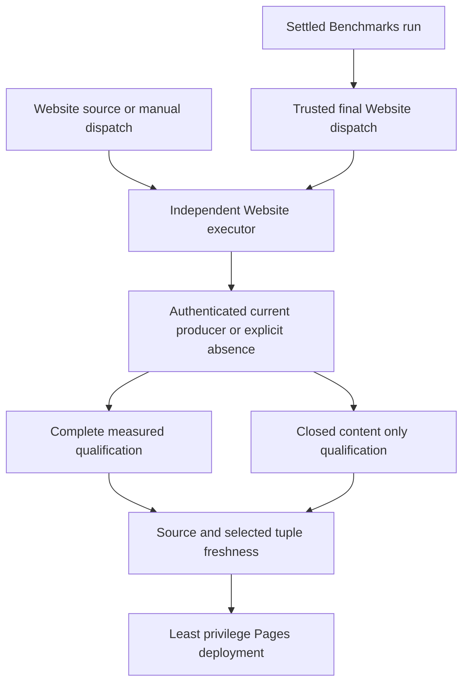

# ADR-112: Independent Website publication with optional benchmarks

Status: Accepted; complete measured qualification pending.
Feature: BenchmarkComparisons, REQ/AC-BC-WEB-001..007.

## Decision and trust boundary

Website/website.yml owns website source qualification and Pages publication.
Its executor accepts trusted own-main push and workflow_dispatch. Build and Tests
retains every build/analyzer/unit/scalar/recovery/cluster gate independently.
Benchmarks owns measurements and the final settled aggregate. Its final
website-trigger job dispatches Website on main after all dependencies settle,
including a run with failed or skipped database/aggregation jobs. Cancellation
still stops dispatch. Exact trusted repository/event admission is required.
Only that job has actions:write; database jobs remain read-only.
Trigger failure is visible. Website's push trigger is filtered to `site/**`, its
site tests, site-specific scripts/composites and shared build inputs; there
is no `workflow_run` subscription, alternate executor or measurement bypass.

Optional benchmark_run_id authenticates the original own-repository main run,
Benchmarks workflow name/path, event and source, then waits at most five minutes
for completion and accepts terminal `success` or `failure` before qualification. It does not select authoritative metrics or bypass freshness.
Empty input skips waiting. Invalid metadata, API failure and timeout fail closed.

Select the newest authenticated completed own-main producer with original
successful session jobs and artifacts. Its overall conclusion may be success or
failure. Website collects and validates those original worker/runtime ZIPs through
the shared collector and aggregator; a combined-results artifact is not required.
Each included session retains the full original TRX, source/runtime/resource and
correctness contract. Every planned database/topology row remains visible; missing
or failed sessions have null metrics displayed as an em dash. Selected corrupt,
expired, foreign or mixed evidence is rejected. A cancelled or in-progress producer
supplies no figures. If no producer has eligible sessions, emit no metrics and a
static empty state with benchmarks:null in the publication receipt.

## Qualification and acceptance

Measured publication requires complete original archive/provenance/source,
coverage, browser and source/selected-tuple freshness gates. Content-only
publication has its own closed SiteContent TUnit selection through the same
Aspire site entry and proves every emitted/executed asset, browser action/result
and source path with applicable coverage thresholds, including critical90.
Measurement/archive numeric proof is N/A for an artifact that contains no metrics;
content-only success cannot be advertised as measured qualification. TRX
has no skipped cases, owned resources settle, and fresh source/control identities
and selected tuple (including null) are checked again before deployment.
Pages/OIDC writes are confined to the needs-gated deploy job.

```mermaid
flowchart TD
    Push[Website source or manual dispatch] --> Website[Independent Website executor]
    Benchmarks[Settled Benchmarks run] --> Trigger[Trusted final Website dispatch]
    Trigger --> Website
    Website --> Select[Authenticated current producer or explicit absence]
    Select --> Measured[Complete measured qualification]
    Select --> Empty[Closed content only qualification]
    Measured --> Fresh[Source and selected tuple freshness]
    Empty --> Fresh
    Fresh --> Pages[Least privilege Pages deployment]
```

## Ordered implementation and delivery

1. REQ/AC, policies, exact workflows/events and the ownership split are frozen before code.
2. Selection owns site-isolated-github capture/runs/contract; the builder owns site/Features/BenchmarkComparisons/build-site.mjs. Preserve exact original artifacts, bounded calls and source closure. Capture is limited to the current executor and REST selection/wait inputs; it has no event-file parsing, preserving REST workflow_runs and artifact.workflow_run provenance, actual authenticated capture and latest-selection operation flows.
3. Qualification owns SiteContent cases/helpers/contracts and the current coverage/source inventory joins. file/Node/Chrome flows prove successful admission, absence, foreign executor, corrupt evidence and healthy follow-up. Workflow-shape review uses actionlint/YAML and is not product runtime proof.
4. Workflows/composites, dispatch/admission/wait, tests, inventories and docs join once; verify build/format/governance, Aspire cases and actual exact-source Linux Website/Pages/freshness evidence. Release context consumes Build and Tests with its actual four job labels and all source/attempt/success protections.
5. All REQ/AC-WEB gates retain original failing and passing results. A commit or successful trigger alone does not qualify Website publication or the database.

Dependencies are official Pages actions, GitHub REST, Node, Chrome, TUnit/MTP and
Aspire. No database/package/DNS change. Rollout joins producer/consumer/builder/
tests/docs in one source checkpoint. Rollback preserves the independent Website,
final dispatch, every required gate and immutable measured originals. Keep Accepted
until actual measured and content-only qualification, freshness and Pages proof exist.

## Trigger scope, navigation and diagnostics requirements

REQ/AC-BC-WEB-008: Website's push trigger and Benchmarks' final dispatch follow the decision above. Verification: push path matches and dependency outcome rejection are source checks; GitHub scheduling, dispatch after a failed producer and acceptance only of its independently verified successful sessions in actual Linux execution are required provider evidence, not claims from static inspection. Independent site changes can still publish without benchmark figures when no authenticated producer is ready. Rollback preserves the independent Website executor and all source/metric/coverage/browser/freshness/permission checks.

REQ/AC-BC-WEB-003: the menu action and restored fragment finish their actual CSS-adjusted target scroll, clamped to the document's real scroll range, before subsequent hero navigation. The actual Chrome/CDP caller clicks the observed visible menu toggle and link centers through mouse press/release rather than DOM `.click()`. Test helpers own bounded observation of location and geometry; they cannot force renderer state or focus, accept paused output, increase timeouts or lower coverage. Popover closure, repeated opening/viewport closure, scene lifecycle and joined child cleanup remain mandatory. `SiteContentBrowserTests` retains the full action chain with genuine pointer inputs; failure diagnostics additionally retain active-element tag/id and real scroll bounds, never credentials or user payload. No new dependency or provider boundary.

REQ/AC-BC-EXECUTION-FAILURE-DIAGNOSTICS-001: capture retains bounded process diagnostics after joined cleanup, with credential exclusion and unchanged safe public envelopes. This refines the current capture ownership and fail-closed contract and adds no provider, retry or fallback decision.
