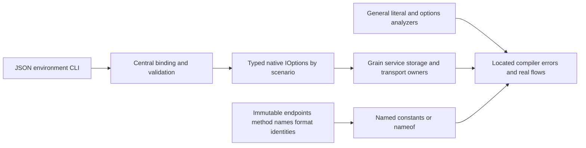

# ADR-113: General runtime literals and centralized typed options

Status: Accepted (implementation and verification pending)
Date: 2026-10-06

The owner explicitly requires complete runtime literal migration, including
endpoint/method tokens, and rejects per-class timeout constants. CodeQuality
REQ-CQ-012/013 and AC-CQ-033..038 supersede the selected-context scope in ADR-111.
Immutable identities use feature-owned constants/nameof. Operational policy uses
centrally bound and validated native IOptions<T>, consumed by its execution owner.

Keep scenario options in their owning Features/<Slice>/Configuration role; register
them through the server/AppHost composition boundary. Defaults retain current
values and live only in these canonical definitions. Group settings by actual
ownership; do not build a universal untyped dictionary or a giant options bag.
Mark actual configuration options/binding boundaries with KeyLoad-owned metadata
so semantic compiler rules can distinguish them from public request DTOs. The
marker is descriptive: it never replaces actual registration, validation or tests.

Existing NodeOptions binds under its unchanged KeyLoad section, with existing
strict section validation before native options execution. Feature constructors
receive IOptions<NodeOptions> and retain one validated snapshot. AppHost must bind
and validate its typed selection options before building the resource graph; its
native options factory/DI lifecycle is owned and disposed, and no raw provider
escapes to feature execution. CLI/env names and malformed/unknown-setting failure
contracts remain exact. Persisted authorization and RF3 membership cannot be
configured away. Preserve serializer Id/Alias, native bytes and canonical digests.

DueCoordination first removes DispatchDeadlineSeconds/DispatchDeadline and the
service PollInterval from arbitrary classes. A feature-owned options type supplies
both grain and grain service via silo DI; central registration binds defaults and
overrides and validates ranges on startup. Capture configured values per operation;
do not introduce live policy mutation mid-dispatch or alter joined shutdown.

TASK-CQ-GENERAL-001..005 and exact disjoint ownership are frozen in the feature
contract. Lead owns markers/shared package references, central registration,
AppHost configuration, all shared docs/configuration and final joins. Worker002
owns analyzer/tests/tooling;003 owns core/storage/replication;004 owns server and
Orleans execution plus clients/benchmarks, excluding lead's central binding files.
No delegated boundary implementation starts before this contract is available.

Dependencies use centrally pinned native Microsoft.Extensions.Options/Binder
packages already present or explicitly added in the canonical package manifest;
do not copy framework or ManagedCode implementations. Native Options.Create is
permitted for explicitly validated standalone/test caller composition, not a fake
options implementation or a hidden fallback replacing central server DI.

Rollout is one coherent source rebuild. Preserve defaults/sections and fail invalid
configuration before readiness/admission. Constructor/configuration ownership
changes update every actual call site and real regression in the same stage. No
compatibility constructor silently restores hardcoded policy. Rollback reverts the
coherent ownership/rule migration while preserving persisted data and all earlier
gates. Do not mark this decision Implemented until complete build, formatter,
Aspire full analyzer/unit/scalar/recovery/RF3, coverage and exact-source evidence
exist. Local compiler previews and passing focused tests remain development proof.
