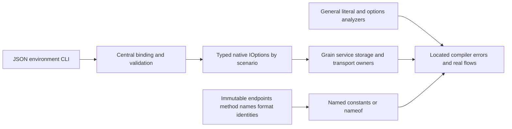

# ADR-113: General runtime literals and centralized typed options

Status: Accepted (implementation and verification pending)
Date: 2026-10-06

The owner explicitly requires complete runtime literal migration, including
endpoint/method tokens, and rejects per-class timeout constants. CodeQuality
REQ-CQ-012/013 and AC-CQ-033..038 supersede the selected-context scope in ADR-111.
Immutable identities use feature-owned constants/nameof. Operational policy uses
centrally bound and validated native IOptions<T>, consumed by its execution owner.

Keep scenario options in their owning Features/<Slice>/Configuration role; register
them through the server/AppHost composition boundary. Defaults retain current
values and live only in these canonical definitions. Group settings by actual
ownership; do not build a universal untyped dictionary or a giant options bag.
Mark actual configuration options/binding boundaries with KeyLoad-owned metadata
so semantic compiler rules can distinguish them from public request DTOs. The
marker is descriptive: it never replaces actual registration, validation or tests.

Existing NodeOptions binds under its unchanged KeyLoad section, with existing
strict section validation before native options execution. Feature constructors
receive IOptions<NodeOptions> and retain one validated snapshot. AppHost must bind
and validate its typed selection options before building the resource graph; its
native options factory/DI lifecycle is owned and disposed, and no raw provider
escapes to feature execution. CLI/env names and malformed/unknown-setting failure
contracts remain exact. Persisted authorization and RF3 membership cannot be
configured away. Preserve serializer Id/Alias, native bytes and canonical digests.

Persisted user policies (queue/subscription/retention) and explicit caller request
parameters are domain data, not server execution configuration. Their stable
public/serialized default values remain feature-owned named protocol constants;
keep native generated Alias/Id contracts and bytes. Do not inject IOptions into
payloads or mark arbitrary execution helpers as policy definitions. Host limits,
implicit execution defaults and timing/admission/cache budgets still require their
actual native options owner. Immutable RF3 membership cardinality and required
qualification sample counts remain contract identities.

Fixed temporal corpus data uses named constants in genuine static readonly native
TimeSpan fields marked with the field-only `ImmutableTemporalDataAttribute` owned
by KeyLoad.Abstractions. KLD0037 permits only the native TimeSpan construction in
that exact immutable declaration, with constant arguments; it does not exempt a
class, method, mutable field, counterfeit marker or execution owner. Policy sinks
such as Task.Delay, CancellationTokenSource, HTTP timeouts and semaphore waits
still inspect the initializer recursively and reject the same field as hardcoded
execution policy. Corpus bucket widths and timestamp offsets keep their original
digest bytes and remain distinct from the native execution deadline options.

Public JSON report and manifest records retain their existing option metadata as
data. The property-only `SerializedOptionsSnapshotAttribute` identifies an actual
immutable record's automatic get/init snapshot property; the analyzer validates
the genuine owning attribute and declaration shape and permits only that property
and its matching positional data parameter. Mutable properties, ordinary service
classes and counterfeit markers still fail. This boundary does not excuse raw
configuration reads, policy sinks or execution owner injection, and adds no JSON
field or serializer behavior. Calculated workload selections instead expose the
actual native factory's IOptions.Value; their execution path consumes that wrapper.

Benchmark composition also binds the isolated HTTP admission scenario and its
native replay pools before container creation. The same configured HTTP scenario
values are forwarded to the runner and derived into node and observer options;
replay pools are bound independently from ordinary production defaults. Existing
32-slot/2-GiB HTTP and 835,584-nonce RF3 defaults remain unchanged. Actual configured
values must reach the generated resource environments and matching runtime
observers; the real admission/replay regressions cover rejection and cleanup.

AppHost resource observation binds native ScaleServerResourceOptions before graph
composition and shares the same wrapper through collector/process/helper joins.
Configured sampling, cleanup, file/output and work budgets must retain their actual
values in observation evidence. Frozen native provenance options are populated only
from original environment values at the central boundary; execution classes cannot
read environment directly. Preserve original source/run/attempt/job authentication
and never refresh published measurements from this refactor.

DueCoordination first removes DispatchDeadlineSeconds/DispatchDeadline and the
service PollInterval from arbitrary classes. A feature-owned options type supplies
both grain and grain service via silo DI; central registration binds defaults and
overrides and validates ranges on startup. Capture configured values per operation;
do not introduce live policy mutation mid-dispatch or alter joined shutdown.

TASK-CQ-GENERAL-001..005 and exact disjoint ownership are frozen in the feature
contract. Lead owns markers/shared package references, central registration,
AppHost configuration, all shared docs/configuration and final joins. Worker002
owns analyzer/tests/tooling;003 owns core/storage/replication;004 owns server and
Orleans execution plus clients/benchmarks, excluding lead's central binding files.
No delegated boundary implementation starts before this contract is available.

The integrated ownership extends002 to shared UnitTests API joins,003 to the
Comparison library's immutable identities and adapter policies, and lead to the
ComparisonHost startup/native-option factories and IntegrationTests joins.004
retains Server/Orleans/Client/CLI/BenchmarkScenarios. These are disjoint portions
of the same general migration; they do not add database features.

The native registries group actual owners: Core database/due-work/messaging/query/
graph/change-feed/time-series/search/cache execution; Server node-derived authority,
replica/discovery/transport/membership/routing/admission/MCP/probe/text/upgrade/admin
execution; AppHost startup/selectors/test/process/image/profile/RF3 composition/
benchmark deployment and observation. CLI and comparison hosts use native
OptionsFactory/OptionsManager before client or file construction. Strict immutable
comparison connection/identity snapshots use the native factory's CreateInstance
hook with the existing validating parser, preserving unknown-input diagnostics and
secrets. No temporary provider or Options.Create fallback supplies runtime defaults.

AppHost's native bootstrap selectors are admitted before dashboard selection.
Private-profile byte/path/buffer/depth options reach reads, parsing and writes;
oversized writes fail before creating a staged file. Source/run/attempt/job identity
remains original environment provenance. Resource observation emits version2 with
the actual primitive policy; aggregation validates it, enforces its sample/mount
ceilings and rejects different policies within a comparable cohort. Existing
version1 evidence remains historical input. This metadata schema change does not
change persisted database formats or qualify new performance measurements.

RF3 published host ports consume `ClusterDeploymentOptions.FirstPublicPort`,
centrally bound from `KeyLoad:FirstPublicPort` with the preserved default5101.
Validate the complete fixed-three-voter range against native `IPEndPoint` bounds
before profile-directory or Aspire-resource creation. Ordinary composition uses
the captured value plus voter index; ephemeral composition still delegates port
assignment to Aspire. Internal container HTTP/silo ports remain frozen image
identities. `ClusterPublishedPortPolicyTests` verifies native binding, all three
actual endpoint annotations, snapshot lifetime, the inclusive upper range and
rejection before resource/file ownership (AC-CQ-034/035).

Verification order is a real full Release build, scoped native formatting and a
final full build, then Aspire-owned analyzers/unit/scalar/recovery/RF3 plus the
existing coverage/architecture gates. Configured behavior tests include
CentralAppHostOptionsTests, PhysicalShardProfileBoundedReadTests, native resource
policy/mismatch cases in ScaleServerResourceEvidenceParserTests, and the real
DueCoordination/ReplicaExecution/ZoneTreeStorage execution regressions. Each suite
must retain its original native outcome and exact source; compiler previews remain
diagnostic tools only.

Native comparison CSV character buffers, report/proof/control file buffers and
vector cancellation/yield cadences also belong to the centrally validated native
execution group. Preserve their original defaults and inclusive ceilings, exact
report bytes, corpus hashes and qualification criteria. Semantic enforcement
includes actual framework file-buffer properties and constructor parameters;
same-named source types must not impersonate those framework symbols.

The final sink audit also moves grain reply initial reservation, administrator
failure-log retention and Mongo/KeyLoad/Redis/OpenSearch seed batches into their
existing native options groups. Preserve defaults 4096/50/256/100/256/64 and their
inclusive ceilings. Actual allocation and chunking owners consume the snapshot;
unused former cleanup constants are removed. Command inbox scheduling uses its
own nonserialized `KeyLoad:CommandInboxExecution` group, with configurable
MaximumControlBurst 1..8 and the original default 8. Keep the immutable fairness
ceiling 8 and every existing admission Id/JSON contract; central server binding,
borrowed silo registration and physical coordinator construction share the same
validated wrapper. Configured lower-burst tests verify actual dequeue ordering.

MongoDB replica-probe and seeded-copy verification consume the same centrally
bound NativeComparisonExecutionOptions.OperationTimeout as their native target;
probe deletion has its independent CleanupTimeout. Frozen scaled-profile timeout
metadata cannot supply either execution deadline. The native Mongo connection
pool also consumes MongoPoolSessionMargin 1..4 and MongoPoolMinimumSize 1..16 from
that group, retaining defaults 4/16 and the original Max(concurrency + margin,
minimum) formula. Validate those options before client creation and preserve the
actual native majority/journal concerns. NativeComparisonMongoPolicyTests maps
these configured-owner and invalid-policy checks to AC-CQ-034; genuine replicated
Mongo execution remains an exact-source comparison qualification requirement.

The existing selected RF3 coverage fixture must receive all12 validated native
coverage-option values from the owning AppHost, using its actual environment
handoff and invariant numeric/TimeSpan representations. Its feature-local native
binding boundary validates the complete selected group before IO; ClusterFixture
retains one original `IOptions<NativeCoverageExecutionOptions>` and passes it to
source/run/context readers, streaming hashes and receipt writers. Reject any
mismatch against the admitted run policy. Preserve the existing source64MiB,
run/receipt4MiB and native-output64KiB format fences, exact schemas, original
process settlement and disabled ordinary-RF3 selection. Forward the existing
fixture-mode/source aliases coherently; this repairs the typed consumer join,
without introducing a coverage architecture or qualifying collector execution.

Keep the typed join maintainable under the unchanged200-type/50-unit limits:
`ClusterFixture` retains common actual RF3 orchestration; its existing graph
admission/logging/topology configuration moves to the feature-local
`ClusterFixtureComposition`. Optional collector ownership belongs to
`NativeCoverageRf3FixtureOwner`, which atomically retains admitted context, source
image, original native options, started-node identity and the bounded selected
case ledger. It controls selected image verification and receipt publication only
after original stop/reader/cleanup settlement succeeds. Cleanup uses the captured
native options deadline; failures retain their original order/type, ordinary RF3
selection stays disabled without configuration, and unsuccessful settlement keeps
the original evidence/root. These cohesive responsibilities preserve exact
resource membership, image/schema/source trust, filesystem and lifecycle order.

`ClusterFixtureApplicationShutdown` owns the transferred actual AppHost's ordered
stop, optional original-node settlement proof and joined disposal. The fixture
retains diagnostics/root/receipt ordering and combines failures only after that
original application owner settles; this boundary does not create or replace a
resource, detach work, alter a timeout, or delete unsuccessful evidence.

SQL trivia parsing receives a required explicit configured work chunk. Query and
Server consume QueryExecutionOptions.SqlBudgetCheckInterval; SDK conservative
prefix inspection consumes KeyLoadClientExecutionOptions.SqlBudgetCheckInterval
1..256 with default 256 for both trivia and keyword boundaries. SQL comment pairs
have immutable atomic width two, so a configured one-character interval permits
that minimum grammatical atom while retaining bounded positive progress. Preserve
original default known-read/unknown-write cancellation outcomes and first-token
offsets; SqlTriviaExecutionPolicyTests joins AC-CQ-034/035 to real parser/SDK owners.

TimeSeries chunk encoding requires the centrally registered native
TimeSeriesExecutionOptions wrapper at its codec entry. HashChunkBytes 1..65536,
default 65536, controls checksum and UTF8/UTF16 cancellation slices; text sizing
uses a distinct TextCancellationCheckIntervalCodeUnits 1..16383/default 16383.
Preserve atomic UTF16 code-unit/surrogate widths, all native envelopes, checksum
bytes and independent goldens. Explicit benchmark/test caller composition uses
the same actual typed factory, with no codec fallback. These are execution
cadences, while frozen chunk wire/version/record-size ceilings stay identities.
SampleChunkExecutionPolicyTests maps configured roundtrip/cancellation and reject
before work to AC-CQ-034 without claiming performance or live storage adoption.

Native KeyLoad and Redis corpus readback sessions consume the target's existing
NativeComparisonExecutionOptions.ReadbackBatchCapacity instead of separate fixed
256-record pages. Preserve default paging, exact corpus order/bytes, cancellation,
native continuation and SCAN/MGET validation. Configured lower-cap regression
uses the genuine already selected Aspire comparison topology and observes actual
native requests/pages; a total-only assertion cannot prove the policy join.

The separate NativeComparisonDiagnosticOptions group (NativeComparisonDiagnostics)
owns native comparison diagnostic policy without expanding the workload options
type beyond its aggregate type-size gate. It is bound/validated once by the real
host and standalone native fixture factories and passed as a required native
wrapper through KeyLoad/Redis/Kurrent target and cleanup/failure owners:
Kurrent setup cause/frame/identifier ceilings 3/8/64 and initial builder reservation
4096; cleanup exception traversal/output ceilings 8/4096; Redis replica projection
ceiling4096; KeyLoad outbox output/consumer ceilings512/64. Lower overrides must
remain positive and fit each immutable overflow/unavailable projection. Required
native wrappers flow from actual target/cleanup/failure owners to the projections;
preserve default output, redaction whitelists and protocol identities. Builder
reservation is not a new output truncation guarantee. Native diagnostic projection
regressions map AC-CQ-034 to exact independent golden and lower-cap/invalid-policy
oracles; preserve whole-line and privacy assertions.

Blob offline restore and initial catalog proof use a nonserialized feature-local
BlobExecutionOptions group: MetadataPageSize 1..128/default128,
InitialCatalogProofRecords 1..10000/default10000, RestorePageBytes 1..4194304/default
4194304. Server central binding and physical-owner preflight validate the wrapper;
DatabaseEngine captures it and supplies resource configuration/proof and restore
page owners. Immutable BlobLimits, quota/lease data, native Alias/Id and keys stay
unchanged. A valid single record exceeding a configured work budget reports
BudgetExceeded and retains the restore fence/cursor; malformed metadata still
reports Corruption. Genuine ZoneTree restore/proof regressions map AC-CQ-034 to
configured pages and fail-before-effects, with original restore qualification.

Scaled raw ZoneTree's existing ScaledStorageExecutionOptions owns
MutableSegmentSlackRecords 1..2/default2. Actual native mutable segment sizing
uses the validated snapshot with the original minimum-capacity formula and
checked arithmetic; corpus identity, complete retained-record verification and
native durability choices stay unchanged.

Process-wide static JSON/native serializer owners share one lazily bound native
SerializationExecutionOptions wrapper at the marked process-composition boundary.
The sole source for this group is the native environment provider with prefix
KEYLOAD_SERIALIZATION__; startup preflights and borrows that same wrapper, while
standalone first use validates the same real OptionsFactory/OptionsManager path.
No raw source read escapes to execution, no Options.Create fallback or per-call
production pool is introduced. Defaults live in the canonical options type:
JsonTextMaximumRetainedArrayBytes 1..262144/default262144,
JsonTextMaximumArraysPerBucket 1..2/default2, FingerprintChunkCharacters
2..4096/default4096 and DomChunkCharacters 2..4096/default4096. Independent native
factory composition may construct a standalone owner for configured regressions;
it does not mutate the process wrapper. Preserve cryptographic buffer zeroing,
single production pool lifetime, surrogate-atomic positive progress, exact
fingerprints/native envelopes and frozen JsonDefaults.Options web/case/depth
semantics. SerializationExecutionPolicyTests maps these real configured owners
and invalid binding checks to AC-CQ-034/035; source/configuration does not qualify
allocation, memory or performance claims.

Storage stream buffering is distinct from transfer/chunk buffering. The native
storage options group owns StreamBufferBytes 1..4096, default 4096, for metadata,
backup and checkpoint FileStream owners, including former implicit OpenRead
buffers. Preserve existing 65536-byte transfer/chunk defaults, original frame and
manifest bytes, recovery validation and synchronous Flush(true) barriers.

Native text file providers apply the bound FileBufferBytes ceiling to actual
ZoneTree stream creation, including calls that omit the native interface's
optional buffer parameter. Preserve smaller caller buffers and native unbuffered
requests; reject invalid configured ceilings before taking file ownership. Real
unflushed-file observations verify that lower configuration reaches the IO sink.

Executable ComparisonTests native lifecycle helpers consume the same central
binding contract through `NativeExecutionPolicyFixture.Harness()` and a typed
`KeyLoad:NativeComparisonHarness` section. Ownership is feature-local
Configuration/NativeComparisonHarnessOptions, the fixture composition entry,
and the actual PostgreSQL/Redis/Kurrent/teardown helper sinks. Preserve default
native budgets, exact fixture isolation, independent assertions and original-task
failure identity; do not turn their mutable timeouts/buffers/workers into protocol
constants. Integration and Recovery API/ownership joins use the same actual
rebuilt contracts and retain their original RF3/restart assertions.

Dependencies use centrally pinned native Microsoft.Extensions.Options/Binder
packages already present or explicitly added in the canonical package manifest;
do not copy framework or ManagedCode implementations. Native Options.Create is
permitted for explicitly validated standalone/test caller composition, not a fake
options implementation or a hidden fallback replacing central server DI.

Projection of environment settings into a native configuration provider omits
absent variables rather than supplying null-valued keys which overwrite typed
defaults. Explicit supplied values retain validation. Configuration validation
runs at composition before dataset allocation; invalid standalone wrappers fail
with the canonical Validate exception. After valid configuration, target
validation still precedes corpus construction. Private request-probe mode
validation precedes unrelated suite selectors in the central AppHost factory.

The CLI explicitly references the already centrally pinned native environment
configuration provider for KEYLOAD_STORAGE__ and KEYLOAD_POINTCACHE__. Omitted
variables preserve canonical typed defaults; supplied budgets are validated before
opening any storage files. No nullable-key inventory or parallel options defaults
substitute for native binding. Actual CLI backup/reject/restore flows cover this
composition repair under TASK-CQ-CLI-BACKUP-FLOW-001.

Rollout is one coherent source rebuild. Preserve defaults/sections and fail invalid
configuration before readiness/admission. Constructor/configuration ownership
changes update every actual call site and real regression in the same stage. No
compatibility constructor silently restores hardcoded policy. Rollback reverts the
coherent ownership/rule migration while preserving persisted data and all earlier
gates. Do not mark this decision Implemented until complete build, formatter,
Aspire full analyzer/unit/scalar/recovery/RF3, coverage and exact-source evidence
exist. Local compiler previews and passing focused tests remain development proof.

TASK-CQ-GENERAL-OPTIONS-001 also covers the CLI archive policy. A cohesive
`CliBackupExecutionOptions` is natively bound at `CliStorageConfiguration` from
`KEYLOAD_BACKUP__`, eagerly validated before file ownership and passed as the same
`IOptions<T>` to `CliBackupRestore`. `PieceBytes` defaults to 268435456 and accepts
1024 through the existing archive format ceiling of 1073741824. The archive API
requires its explicit piece-size operand; it must not restore an implicit static
default. Actual CLI process tests use 1024-byte pieces, independently verify all
piece counts and exact extracted backup bytes, and prove invalid settings reject
before archive creation while a following configured invocation remains healthy.

The required full-suite regression join preserves the replica worker's original
terminal failure during owned shutdown. `ReplicaMaterializer.ApplyWorkerAsync`
stores a known apply failure for the existing recovery fence and rethrows the same
exception, so `ReplicaMaterializerShutdown` joins and reports it while disposing
its owned lifetime/apply gate and retaining the borrowed protocol gate. No quorum,
durable index, storage format, cancellation policy or error classification changes.
Existing `RecurringDueWaitTests` and `ReplicaAppliedPositionWaitTests` must keep
the exact durable effects, recovery fence and original disposal-failure assertions.
Their real store fixture initializes the mandatory physical shard catalog; direct
wait cancellation asserts the native exact `TaskCanceledException` and original
token, while the due helper retains its owned linked-token cancellation semantics.
This is a coherent source repair under REQ-CQ-008/012, AC-CQ-017/033 and the
GENERAL-OPTIONS implementation stage, verified by full Aspire unit/recovery/RF3
and a final solution build before any qualification claim.

The raw storage slack regression observes the genuine initialized native ZoneTree
owner through a narrow internal forwarding of `Maintenance.CloneOptions()` at
the pinned ZoneTree1.9.8 source, then verifies the actual mutable-segment capacity,
real loaded/read values and residence under default/lower slack. The diagnostic
clone contains native configuration and does not replace storage, recalculate an
expected capacity or change the public benchmark receipt/schema. Invalid native
options must reject before owner file IO; no performance claim follows from it.

The required scoped-outcome join preserves an already selected canonical outcome
on rejected replay. REQ/AC-DSTORE-009 and ADR002/011 require conflicting or
reauthorization-failed retries to retain exact prior outcome/locator/domain bytes
and the local committed cut. `AtomicCommandCommit` therefore disables publication
after failure against a selected existing outcome; the no-publication branch still
writes the positive replicated apply watermark, but must not rewrite a business
clock or publish a replacement outcome. New authorized domain failures retain
their existing durable-result behavior. Corruption/format/recovery exceptions
remain exact thrown failures that abort commit. Genuine existing scoped-outcome
cases retain exact cuts/bytes and denied authorization controls. AC-DSTORE-005
counts the extra bounded retained-legacy authority lookup required by AC-DSTORE-009
separately from the six original metadata points and three placement points;
transaction-scoped document images and paired-size payload work remain unchanged.

The full-suite OpenLoop fixture retains bounded actual stage evidence after its
original child exit and both stream readers settle. Seed, rejection intake/extra,
accepted aggregation and reuse stages record genuine duration, exit/result,
captured-output lengths/digests and existing bounded captured failure output in a
test-owned evidence file outside the cohort inventory. Evidence IO failures join
the original failure chain and cannot replace or hide it. This diagnostic join
does not change the20-second native child deadline, assertions, plan workload,
source-freeze validation, process-tree cleanup or production scheduling. The
observed timeout's cause remains unqualified until actual stage evidence exists.

The final completeness audit under TASK-CQ-GENERAL-OPTIONS-001 also migrates
remaining serialization reservations. `SerializationExecutionOptions` owns the
canonical JSON pending-byte flush cadence (default65536, positive and no larger
than the existing default) and bounded digest UTF-8 stack scratch (default256,
positive and no larger than256). Existing static entry points borrow the same
preflighted process-native wrapper; configured regression entry points capture a
validated native wrapper before hashing or writing. JSON spelling/order, digest
framing and exact hashes remain unchanged at every valid setting. Stack scratch
above its configured threshold follows the existing bounded native pool route.

`AnnSeedOptions` owns the allocated hash scratch (default4096). Its lower bound
must hold the largest already-valid identifier's strict UTF-8 encoding and at
least one complete integer/float component. The collector passes that captured
setting to `AnnSeedBuffer`; fixed/owned/peak admission accounting includes the
actual configured allocation. Never admit a smaller scratch that rejects valid
canonical identity text or stalls float-block progress. Existing corpus digest,
authorization, read cuts, work accounting and cancellation remain authoritative.

A cohesive native comparison serialization options group owns SurrealDB SQL
builder reservations for batch records (default12000 characters per record) and
vector components (default12 characters per component), each positive and no
larger than its existing reservation. Native comparison composition binds and
validates this required group before target ownership, and the SurrealDB target
captures the same native wrapper. Actual native protocol builders consume the
settings; syntax, finite-vector validation, canonical workload/index parameters,
HTTP limits and evidence provenance stay unchanged. Independently constructed
SQL and digest goldens, configured lower reservations and invalid-policy
pre-ownership rejection regressions verify these joins. Root owns the required
source-controlled configuration, composition joins, final build and Aspire gates.

The same comparison serialization group owns PostgreSQL vector text reservation
(default14 characters per component, inclusive1 through14); both vector target
owners record their actual settings in the existing index-parameter dictionary.
The ordinary KeyLoad time-series adapter also consumes centrally bound
`KeyLoadTimeSeriesReadLimit` (default1000, inclusive1 through1000) from the existing
native adapter options. Its original request cap must not be replaced with the
unrelated default256 readback page size. Required options are validated before
client/target ownership; a real SDK regression verifies the sent request, exact
returned sample content, cancellation and a following healthy call. Existing
corpus, time-window/error contracts, native transport and RF3 qualification remain.

The shared native signed-claim decoder's implicit8192-character policy is also
operational admission. A nonserialized `NativeClaimsExecutionOptions` under the
InternalSerialization configuration responsibility owns
`MaximumTokenCharacters` (default8192, inclusive1 through8192). Server and genuine
embedded/test composition bind and validate a required native wrapper before
physical ownership; DatabaseEngine captures it and its one-argument Verify entry
uses that captured cap. The explicit maximum-character operand entry remains
available for already bounded remote-transfer calls and preserves their existing
MaxBatchBytes contract. No timeout/default parameter or format helper may silently
restore8192. All actual constructors join the same required dependency. Persisted
signing authority, KLT2 prefix, native claim bytes, MAC, aliases/field IDs and
reauthorization stay unchanged. Real signed-claim and leased-message regressions
prove lower-policy rejection retains exact state and a following valid configured
operation succeeds; invalid options reject before store IO. Root owns the engine
signature, composition/helper joins and final verification; the decoder worker
owns the cohesive options, Verify dispatch and focused regressions.

The final CodeQuality RF3 IO audit requires the already central native
NativeCoverageExecutionOptions.ReadBufferBytes to reach source-manifest reads,
invocation/base-image receipts and run-manifest writes. A path-format ceiling is
not an IO buffer default. Bind that native wrapper before startup control
selection and share it through the actual selected settings, preparation and
cleanup owners, together with the original native TestExecutionOptions wrapper;
do not reconstruct Options.Create around captured snapshots. Each IO entry
validates its required wrapper before work, then passes the captured scalar to
the actual FileStream. Preserve CreateNew, write-through, explicit durable flush,
original source/image trust, cleanup and all schemas. The frozen source64MiB and
run4MiB evidence admission fences remain distinct from the context-manifest
MaximumManifestBytes setting. This joins AC-CQ-034 to the actual native coverage
consumer without implementing a new coverage architecture or claiming coverage
qualification. The lead owns shared registration/settings/prerequisite joins;
the comparison worker owns the six RF3 reader/writer/protocol/selection files.
