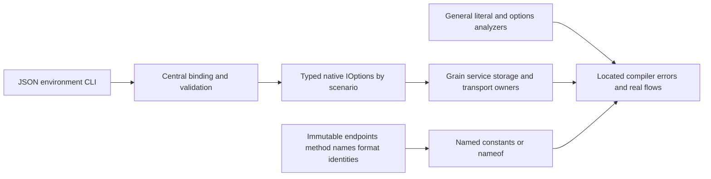

# ADR-113: General runtime literals and centralized typed options

Status: Accepted (implementation and verification pending)
Date: 2026-10-06

The owner explicitly requires complete runtime literal migration, including
endpoint/method tokens, and rejects per-class timeout constants. CodeQuality
REQ-CQ-012/013 and AC-CQ-033..038 supersede the selected-context scope in ADR-111.
Immutable identities use feature-owned constants/nameof. Operational policy uses
centrally bound and validated native IOptions<T>, consumed by its execution owner.

Keep scenario options in their owning Features/<Slice>/Configuration role; register
them through the server/AppHost composition boundary. Defaults retain current
values and live only in these canonical definitions. Group settings by actual
ownership; do not build a universal untyped dictionary or a giant options bag.
Mark actual configuration options/binding boundaries with KeyLoad-owned metadata
so semantic compiler rules can distinguish them from public request DTOs. The
marker is descriptive: it never replaces actual registration, validation or tests.

Existing NodeOptions binds under its unchanged KeyLoad section, with existing
strict section validation before native options execution. Feature constructors
receive IOptions<NodeOptions> and retain one validated snapshot. AppHost must bind
and validate its typed selection options before building the resource graph; its
native options factory/DI lifecycle is owned and disposed, and no raw provider
escapes to feature execution. CLI/env names and malformed/unknown-setting failure
contracts remain exact. Persisted authorization and RF3 membership cannot be
configured away. Preserve serializer Id/Alias, native bytes and canonical digests.

Persisted user policies (queue/subscription/retention) and explicit caller request
parameters are domain data, not server execution configuration. Their stable
public/serialized default values remain feature-owned named protocol constants;
keep native generated Alias/Id contracts and bytes. Do not inject IOptions into
payloads or mark arbitrary execution helpers as policy definitions. Host limits,
implicit execution defaults and timing/admission/cache budgets still require their
actual native options owner. Immutable RF3 membership cardinality and required
qualification sample counts remain contract identities.

Fixed temporal corpus data uses named constants in genuine static readonly native
TimeSpan fields marked with the field-only `ImmutableTemporalDataAttribute` owned
by KeyLoad.Abstractions. KLD0037 permits only the native TimeSpan construction in
that exact immutable declaration, with constant arguments; it does not exempt a
class, method, mutable field, counterfeit marker or execution owner. Policy sinks
such as Task.Delay, CancellationTokenSource, HTTP timeouts and semaphore waits
still inspect the initializer recursively and reject the same field as hardcoded
execution policy. Corpus bucket widths and timestamp offsets keep their original
digest bytes and remain distinct from the native execution deadline options.

Public JSON report and manifest records retain their existing option metadata as
data. The property-only `SerializedOptionsSnapshotAttribute` identifies an actual
immutable record's automatic get/init snapshot property; the analyzer validates
the genuine owning attribute and declaration shape and permits only that property
and its matching positional data parameter. Mutable properties, ordinary service
classes and counterfeit markers still fail. This boundary does not excuse raw
configuration reads, policy sinks or execution owner injection, and adds no JSON
field or serializer behavior. Calculated workload selections instead expose the
actual native factory's IOptions.Value; their execution path consumes that wrapper.

Benchmark composition also binds the isolated HTTP admission scenario and its
native replay pools before container creation. The same configured HTTP scenario
values are forwarded to the runner and derived into node and observer options;
replay pools are bound independently from ordinary production defaults. Existing
32-slot/2-GiB HTTP and 835,584-nonce RF3 defaults remain unchanged. Actual configured
values must reach the generated resource environments and matching runtime
observers; the real admission/replay regressions cover rejection and cleanup.

AppHost resource observation binds native ScaleServerResourceOptions before graph
composition and shares the same wrapper through collector/process/helper joins.
Configured sampling, cleanup, file/output and work budgets must retain their actual
values in observation evidence. Frozen native provenance options are populated only
from original environment values at the central boundary; execution classes cannot
read environment directly. Preserve original source/run/attempt/job authentication
and never refresh published measurements from this refactor.

DueCoordination first removes DispatchDeadlineSeconds/DispatchDeadline and the
service PollInterval from arbitrary classes. A feature-owned options type supplies
both grain and grain service via silo DI; central registration binds defaults and
overrides and validates ranges on startup. Capture configured values per operation;
do not introduce live policy mutation mid-dispatch or alter joined shutdown.

TASK-CQ-GENERAL-001..005 and exact disjoint ownership are frozen in the feature
contract. Lead owns markers/shared package references, central registration,
AppHost configuration, all shared docs/configuration and final joins. Worker002
owns analyzer/tests/tooling;003 owns core/storage/replication;004 owns server and
Orleans execution plus clients/benchmarks, excluding lead's central binding files.
No delegated boundary implementation starts before this contract is available.

The integrated ownership extends002 to shared UnitTests API joins,003 to the
Comparison library's immutable identities and adapter policies, and lead to the
ComparisonHost startup/native-option factories and IntegrationTests joins.004
retains Server/Orleans/Client/CLI/BenchmarkScenarios. These are disjoint portions
of the same general migration; they do not add database features.

The native registries group actual owners: Core database/due-work/messaging/query/
graph/change-feed/time-series/search/cache execution; Server node-derived authority,
replica/discovery/transport/membership/routing/admission/MCP/probe/text/upgrade/admin
execution; AppHost startup/selectors/test/process/image/profile/RF3 composition/
benchmark deployment and observation. CLI and comparison hosts use native
OptionsFactory/OptionsManager before client or file construction. Strict immutable
comparison connection/identity snapshots use the native factory's CreateInstance
hook with the existing validating parser, preserving unknown-input diagnostics and
secrets. No temporary provider or Options.Create fallback supplies runtime defaults.

AppHost's native bootstrap selectors are admitted before dashboard selection.
Private-profile byte/path/buffer/depth options reach reads, parsing and writes;
oversized writes fail before creating a staged file. Source/run/attempt/job identity
remains original environment provenance. Resource observation emits version2 with
the actual primitive policy; aggregation validates it, enforces its sample/mount
ceilings and rejects different policies within a comparable cohort. Existing
version1 evidence remains historical input. This metadata schema change does not
change persisted database formats or qualify new performance measurements.

Verification order is a real full Release build, scoped native formatting and a
final full build, then Aspire-owned analyzers/unit/scalar/recovery/RF3 plus the
existing coverage/architecture gates. Configured behavior tests include
CentralAppHostOptionsTests, PhysicalShardProfileBoundedReadTests, native resource
policy/mismatch cases in ScaleServerResourceEvidenceParserTests, and the real
DueCoordination/ReplicaExecution/ZoneTreeStorage execution regressions. Each suite
must retain its original native outcome and exact source; compiler previews remain
diagnostic tools only.

Native comparison CSV character buffers, report/proof/control file buffers and
vector cancellation/yield cadences also belong to the centrally validated native
execution group. Preserve their original defaults and inclusive ceilings, exact
report bytes, corpus hashes and qualification criteria. Semantic enforcement
includes actual framework file-buffer properties and constructor parameters;
same-named source types must not impersonate those framework symbols.

The final sink audit also moves grain reply initial reservation, administrator
failure-log retention and Mongo/KeyLoad/Redis/OpenSearch seed batches into their
existing native options groups. Preserve defaults 4096/50/256/100/256/64 and their
inclusive ceilings. Actual allocation and chunking owners consume the snapshot;
unused former cleanup constants are removed. Command inbox scheduling uses its
own nonserialized `KeyLoad:CommandInboxExecution` group, with configurable
MaximumControlBurst 1..8 and the original default 8. Keep the immutable fairness
ceiling 8 and every existing admission Id/JSON contract; central server binding,
borrowed silo registration and physical coordinator construction share the same
validated wrapper. Configured lower-burst tests verify actual dequeue ordering.

MongoDB replica-probe and seeded-copy verification consume the same centrally
bound NativeComparisonExecutionOptions.OperationTimeout as their native target;
probe deletion has its independent CleanupTimeout. Frozen scaled-profile timeout
metadata cannot supply either execution deadline. The native Mongo connection
pool also consumes MongoPoolSessionMargin 1..4 and MongoPoolMinimumSize 1..16 from
that group, retaining defaults 4/16 and the original Max(concurrency + margin,
minimum) formula. Validate those options before client creation and preserve the
actual native majority/journal concerns. NativeComparisonMongoPolicyTests maps
these configured-owner and invalid-policy checks to AC-CQ-034; genuine replicated
Mongo execution remains an exact-source comparison qualification requirement.

Native KeyLoad and Redis corpus readback sessions consume the target's existing
NativeComparisonExecutionOptions.ReadbackBatchCapacity instead of separate fixed
256-record pages. Preserve default paging, exact corpus order/bytes, cancellation,
native continuation and SCAN/MGET validation. Configured lower-cap regression
uses the genuine already selected Aspire comparison topology and observes actual
native requests/pages; a total-only assertion cannot prove the policy join.

Storage stream buffering is distinct from transfer/chunk buffering. The native
storage options group owns StreamBufferBytes 1..4096, default 4096, for metadata,
backup and checkpoint FileStream owners, including former implicit OpenRead
buffers. Preserve existing 65536-byte transfer/chunk defaults, original frame and
manifest bytes, recovery validation and synchronous Flush(true) barriers.

Native text file providers apply the bound FileBufferBytes ceiling to actual
ZoneTree stream creation, including calls that omit the native interface's
optional buffer parameter. Preserve smaller caller buffers and native unbuffered
requests; reject invalid configured ceilings before taking file ownership. Real
unflushed-file observations verify that lower configuration reaches the IO sink.

Executable ComparisonTests native lifecycle helpers consume the same central
binding contract through `NativeExecutionPolicyFixture.Harness()` and a typed
`KeyLoad:NativeComparisonHarness` section. Ownership is feature-local
Configuration/NativeComparisonHarnessOptions, the fixture composition entry,
and the actual PostgreSQL/Redis/Kurrent/teardown helper sinks. Preserve default
native budgets, exact fixture isolation, independent assertions and original-task
failure identity; do not turn their mutable timeouts/buffers/workers into protocol
constants. Integration and Recovery API/ownership joins use the same actual
rebuilt contracts and retain their original RF3/restart assertions.

Dependencies use centrally pinned native Microsoft.Extensions.Options/Binder
packages already present or explicitly added in the canonical package manifest;
do not copy framework or ManagedCode implementations. Native Options.Create is
permitted for explicitly validated standalone/test caller composition, not a fake
options implementation or a hidden fallback replacing central server DI.

Projection of environment settings into a native configuration provider omits
absent variables rather than supplying null-valued keys which overwrite typed
defaults. Explicit supplied values retain validation. Configuration validation
runs at composition before dataset allocation; invalid standalone wrappers fail
with the canonical Validate exception. After valid configuration, target
validation still precedes corpus construction. Private request-probe mode
validation precedes unrelated suite selectors in the central AppHost factory.

The CLI explicitly references the already centrally pinned native environment
configuration provider for KEYLOAD_STORAGE__ and KEYLOAD_POINTCACHE__. Omitted
variables preserve canonical typed defaults; supplied budgets are validated before
opening any storage files. No nullable-key inventory or parallel options defaults
substitute for native binding. Actual CLI backup/reject/restore flows cover this
composition repair under TASK-CQ-CLI-BACKUP-FLOW-001.

Rollout is one coherent source rebuild. Preserve defaults/sections and fail invalid
configuration before readiness/admission. Constructor/configuration ownership
changes update every actual call site and real regression in the same stage. No
compatibility constructor silently restores hardcoded policy. Rollback reverts the
coherent ownership/rule migration while preserving persisted data and all earlier
gates. Do not mark this decision Implemented until complete build, formatter,
Aspire full analyzer/unit/scalar/recovery/RF3, coverage and exact-source evidence
exist. Local compiler previews and passing focused tests remain development proof.
