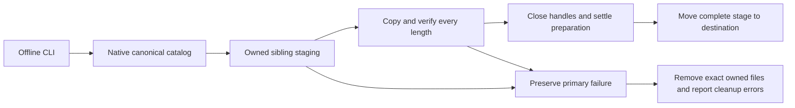

# ADR-114: verified backup artifact publication

Status: Accepted; implementation and runtime qualification pending.
Related: REQ-BACKUP-002/006 and AC-BACKUP-002/006 in
[BackupRestore](../Features/BackupRestore.md), AC-CQ-039/040/045 in
[CodeQuality](../Features/CodeQuality.md).

## Problem and scope

The current two-argument `BackupArtifact.Unpack` writes canonical payload files
into the caller destination before checking native Cartograph's returned length.
A last-entry rejection can therefore occur after all canonical payloads were
written. This is a confirmed source-ordering hazard; the actual failed-output
restore result remains unverified. Keep that distinction in final evidence.
The existing real CLI regression already attempts both failed-output restores
and a healthy original-archive restore. Local compilation has been interrupted
by unrelated shared source changes, not by an established regression result.

The scope is offline artifact extraction and failure-safe publication. Preserve
the public two-argument method, Cartograph format/catalog/piece ordering,
`FileMode.CreateNew`, private Unix permissions and synchronous file flushes.
No dependency, codec, cancellation overload, CLI transport, database authority,
replication journal or cluster-cut contract changes. Process or filesystem
publication proof does not establish power-loss durability.

## Decision and boundaries

Stream native Cartograph payloads into an operation-owned sibling staging
directory on the destination volume. Validate the complete canonical layout and
every returned payload length; close every payload and archive handle before
publishing the stage. A rejected extraction must not put its payload files in
the public destination. Remove the replaced direct-destination write path.

Claim staging with an exclusive create-new sibling marker; a non-exclusive
`Directory.CreateDirectory` call alone is not an ownership claim. Reject an
already occupied stage name. Track exact created payload files. Cleanup removes
only those files and empty owned directories, never a recursive foreign tree.
Unexpected entries and cleanup failures remain visible. Reuse native Cartograph
and `System.IO`; Artifacts must not depend on Server or duplicate storage code.

The destination is caller-owned and offline. An absent destination is published
with same-volume `Directory.Move`, which must not overwrite a racing path.
An initially empty destination remains untouched during validation. At publish,
recheck that it is still a regular empty directory; preserve its empty state
and Unix permissions if publication fails. A bounded temporary rename may
preserve the original empty directory during preparation. Finish all removable
marker/empty-directory cleanup before the final stage move, so successful
publication has no remaining fallible cleanup that could turn it into a failed
unpack with usable output. Preserve every primary, rollback and cleanup error.

There is no portable atomic exchange promise for an existing empty directory.
Do not overwrite an independent actor's path during rollback. If a racer prevents
restoring the original directory at its name, retain any owned empty rollback
directory and report that conflict with the primary failure. Concurrent foreign
path mutations are external state, not effects attributed to this operation.
Do not claim recovery of interrupted publication or directory metadata beyond
the stated empty-state/private-permission contract.

## Ordered implementation and ownership

1. TASK-BACKUP-UNPACK-PUBLICATION-001: root freezes this contract and the feature
   criterion; preserves original native build/test evidence and distinguishes
   the source hazard from runtime proof. The owner's coherent-implementation
   before-runtime rule permits proceeding while a shared compilation drift is
   repaired; no failed build or source inspection qualifies an acceptance gate.
2. One Luna worker authors a private guarded packet for
   `src/KeyLoad.Artifacts/Features/BackupRestore/Execution/BackupArtifact.cs`
   and cohesive populated `Staging/` and, if needed, `Execution/` helpers.
   Each file/type/method obeys the existing 400/200/50/3 limits. The worker
   owns no shared contracts, docs, configuration, builds or live checkout writes.
3. The same bounded packet updates only
   `tests/KeyLoad.UnitTests/Features/BackupRestore/Cases/CliBackupRestoreLengthMismatchTests.cs`.
   The first-entry case uses an absent destination and the last-entry case an
   initially empty destination. Both real rejected-output restore attempts,
   actual process/pipe settlement, original byte-preservation checks and the
   healthy restore/reopened data/new incarnation/paused dispatch remain mandatory.
   Replace the diagnostic partial-file oracle with absent/preserved-empty state;
   do not merely remove the failed-restore operation or weaken its result.
4. Root reviews every diff, ownership claim, publication/rollback edge, failure
   aggregation and allocation/streaming behavior, then joins the guarded packet.
   No payload materialization, cap change, mock, fallback or codec duplication.
5. Root runs canonical format and solution Release build, the mapped complete
   BackupRestore flows through Aspire unit/scalar with retained native coverage,
   and all required recovery/RF3/Linux delivered-source gates. Retain original
   reports and method/source coverage; unmeasured branches and CRAP stay unmeasured.

## Migration, rollback and evidence

No archive format or persisted-data migration exists. The same public method
uses the verified publication path for new calls. Owned staging is disposable
only after the invocation settles; it is not an authority or recovery journal.
Rollback is the scoped source/test change before delivery, not reactivation of
the unsafe path as a runtime fallback. Existing archive transfer, invalid catalog,
nonempty destination, checksum restore, process-recovery and RF3 gates remain.

Required proof includes native first/last length rejection, absent and initially
empty targets, no usable failed output, unchanged source/archive/backup bytes,
healthy follow-up, private permissions, and original child/resource cleanup.
Unexercised filesystem race/cleanup faults must be reported as pending with
their actual evidence boundary; source review cannot label them passed.
This ADR remains Accepted until implementation, traceability and required
verification are complete.
