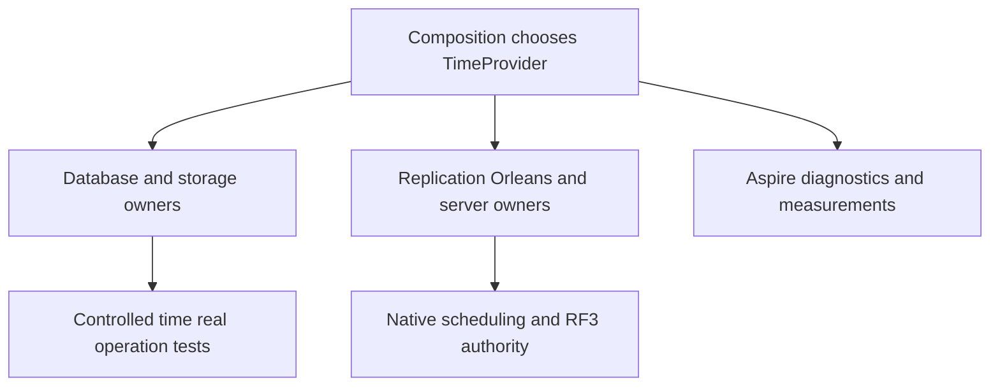

# ADR-115: TimeProvider ownership

Status: Accepted (implementation and qualification pending).
Date: 2026-10-06.

## Decision

Use native .NET TimeProvider throughout KeyLoad-owned C# clock access. Execution owners borrow an injected or explicitly passed provider. Constructor defaults and process/DI composition roots may choose TimeProvider.System. UTC time uses GetUtcNow; durations use matching GetTimestamp/GetElapsedTime and TimestampFrequency. Relative delays and deadline cancellation use native provider overloads; linked tokens retain cancellation and dispose every owned timer. Orleans timers/jobs stay under native Orleans scheduling and persisted RF3 authority.

A controlled test clock is authorized by the owner for real operation tests; storage, authorization and transports remain real. No new dependency is required. Do not derive durations from UTC subtraction, change persisted timestamp formats, turn expiry into a caller-authorized effect, or claim a performance improvement from mechanical source refactoring.

## Implementation contract

[ResourceExecution TimeProvider](../Features/ResourceExecution/TimeProvider.md) owns REQ-TIME-001..005, AC-TIME-001..005, TASK-TIME-001..006, the exact source/test ownership, ordered stages, worker roles and integration points. Lead integrates public constructor/call-site additions without changing serialization identities or signed payload bytes. Optional provider parameters preserve current System defaults; injected clocks are borrowed, never disposed by a consumer. The current persisted format remains fixed. Rollout follows required gates; rollback restores a coherent current-format source checkpoint while retaining persisted data and RF3 journals. Review native timer cancellation, registration and joined shutdown before accepting runtime changes.

## Verification

Canonical Release solution build and dotnet format; real TUnit analyzer/engine workflows through Aspire; required unit, process recovery and Docker RF3 via real SDK/official MCP clients. Benchmark measurements remain original authenticated GitHub evidence. Source review is additional evidence, never a passing runtime gate. Status remains Accepted until required evidence exists.

