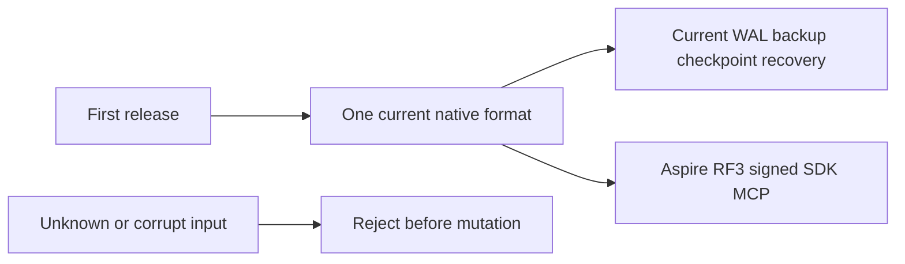

# ADR-116: one current format before the first release

Status: Accepted, 2026-10-06. Owner: root integration. Related task: KL-043;
requirements and measurable acceptance:
[StorageRecovery CurrentFormat](../Features/StorageRecovery/CurrentFormat.md).

## Decision

Deliver and qualify one current native database contract for the first release.
The root [owner super rule](../../AGENTS.md#super-rule-owner-only-migration-and-legacy-authorization)
controls any separately requested migration or legacy scope. Product completion
does not authorize adding such a path.

Deliver one strict current native format. Remove obsolete old-format execution,
tests, preparation resources, settings, routes and active documentation together.
Keep current identity epoch7/WAL4/checkpoint5 bytes and native Orleans serialization
unchanged. Preserve node-local ownership, current backup/restore, corrupt-format
rejection, signed-purpose fencing, process recovery and genuine Aspire RF3 SDK/MCP.
Current stores are created with reader capability1 and magic `0x364449444C4B`;
reject an absent/zero/unknown capability and remove unmarked-store conversion.
Keep current outcome-v2 identity and locator integrity without old-key/old-frame
fallbacks. Remove configuration migration commands and prior-KeyLoad binary/image
compatibility fixtures; preserve external SQL protocol and actual current RF3
failure/authorization/lifetime operations. Qualification must bind current source,
runtime and original operation reports.

The linked feature is the implementation contract: ordered stages, exact module
ownership, consumer audit, bounded whole-operation tests and root join points.
Root owns shared contracts, workflows, registry/coverage maps and final review.
Luna workers prepare disjoint guarded source/test/doc packets only after their
exact ownership and acceptance mappings are frozen.

Current node-root admission is REQ/AC-NATIVE-007 and TASK-SR-CURRENT-LAYOUT-044.
The linked feature freezes exact optional current entries, pre-mutation rejection,
exclusive ownership and the second admission check before provider opens, with
real rejection/preservation/healthy-follow-up operations. TASK-SR-CURRENT-MISSING-043
retains the actual generated-native omission and every authenticated peer cohort
path under AC-NATIVE-002/003; source inspection does not qualify their behavior.

TASK-NATIVE-CURRENT-PEER-049 applies the single current-reader contract to
ordinary, direct-resolution and cached cohort admission. The linked contract
preserves majority availability for an existing catalog and the existing all-voter
fresh-bootstrap gate; current capability failure cannot be retried as readiness.
Keep server-owned paired-store evidence and original authenticated bytes. Signed
socket unit controls and actual RF3 positive observations are distinct evidence;
the omitted-native-field RF3 negative remains open until its fault boundary is
specified and executed without an alternate peer or signing bypass.

Rollout uses the current unreleased source on the intended current RF3 topology.
No user stores are converted or deleted. Rollback restores a coherent source
checkpoint; it never opens current data with an unsupported reader. Future
released-format migration requires separate owner direction and an explicit ADR.

TASK-CURRENT-SNAPSHOT-NATIVE-FILE-067 preserves the complete current native-file
no-mutation oracle under AC-NATIVE-002/006. The test controls its live owner;
the internal Storage.IO observation handle is read-only, validates regular-file
identity and never acquires or releases the owner's advisory lock. It uses the
validated storage buffer and reads all actual file bytes. The linked feature
freezes this deterministic test boundary, original lock checks and full healthy
follow-up. Concurrent-writer snapshot semantics and production lock bypasses are
outside this contract. Root reviews and joins the API/platform change before
enabled build/format and the actual Aspire whole-operation regression.

Required verification is the enabled full Release build, formatter, governance,
native analyzers, actual Aspire normal/scalar and real process recovery, followed
by exact-source Linux Docker/Aspire RF3 and functional coverage. This ADR remains
Accepted until implementation, all mapped tests and delivery evidence exist.

## TASK-KL009-NATIVE-APPLY-SCOPE-001 (follower-owner implementation contract, 2026-10-07)

REQ-REP-APPLY-SCOPE-001 / AC-REP-APPLY-SCOPE-001 binds original KL009 to a genuine node-local canonical apply owner and real independent replica-network progress. Preserve native ZoneTree, original ordered commit/apply gates, deterministic replay, bounded admission, RF3 acknowledgements and separate authenticated request grains. This is authored acceptance infrastructure; Linux/native execution and original task closure are not claimed.

Docs-first current private-format boundary: all RequestCqrsProbe owner/arm/release/marker producers/readers select version2 and reject version1 without fallback, migration or mixed records. Original request/read phases retain exact original semantics with nullable new arm fields all null and marker EntryIndex/EntryTerm null. CanonicalJournalFlushed is Hold-only and requires complete four-scalar Partition, nonempty SourceRequestId, distinct nonempty SourceArmId and exact TargetVoter. CanonicalOutboundObserved, CanonicalIndependentAppendCompleted and CanonicalOwnerDisposed are unarmable observation-only phases. Canonical markers contain positive real entry index/term and the genuine original request actor ID. Release still addresses the exact arm/request identity. Keep original 32-arm, 400-file, 8-marker, 8192-record-byte, 1048576-aggregate-byte and depth4 ceilings, original component/principal byte bounds, hold/poll/admission/shutdown deadlines and validated configurable lower bounds. No status/receipt is invented.

Identity bridge is bounded test control, never authority: the original real BeforeSubmit Hold publishes its actual signed-voter request actor marker. While held, the fixture writes a distinct canonical arm referencing that source BeforeSubmit arm, principal, stable Batch CommandId, observed actor ID, complete partition and an explicitly observed nonleader voter. Both arms retain their original immutable bytes until joined shutdown. The actual Channel worker opens its own synchronous scope from the genuine ReplicaEntry Id/index/term and exact physical voter plus active source arm. No request ExecutionContext/AsyncLocal propagation across Channel is assumed and no synthetic actor ID is created. Actual Database.Apply retains original persisted authorization, identity/fingerprint/replay and strict clock validation; only its construction-owned native JournalFlushed FaultObserver may hold that owner. Unmatched bootstrap/recovery/job/store work has no hold and the replica store gets no callback.

Independent network evidence is produced only by actual PartitionReplicaGrainService.ExchangeAsync after peer request authentication, original readiness/admission/native endpoint validation and successful signed reply construction. Begin captures the same currently held follower owner; completion decodes only already-admitted request/result bytes and requires an accepted empty native Append, exact term and matched/next position, with prior/committed cuts covering the held genuine entry. Completion must still see that exact held scope. Failed/cancelled/rejected exchanges do not qualify. It emits one bounded presence marker, never credentials, payloads or invented counts. Actual ReplicaGrainServiceClient.InvokeAsync separately observes any external invocation originating in the explicit canonical apply scope; any such marker fails acceptance. The real native RPC boundary is used, not HTTP discovery or a replacement transport.

The leader-owned draft cannot qualify this operation: ReplicaLeader owns rounds through WaitForApplyAsync, and that waiter synchronously reads canonical LastApplied. The accepted proof therefore holds a follower, leaves leader semaphores/cancellation untouched, and avoids node Status/State calls while held (they may read LastApplied under ProtocolGate). Discovery/leader identity is captured before the hold. Original health/readiness routes remain unchanged.

Lifetime: the physical host owns bridge, real materializer worker, storage callback and DI observer. Real GrainService construction resolves the observer before accepting replica RPC, including followers without a local public request. One exact scope owns hold, origin observation and callback admission, restores its prior execution context, writes canonical-owner disposal and joins original callback lifecycle. Synchronous apply errors and scope cleanup errors both propagate, preserving original failures; no second commit, retry, lock change, cancellation clamp or timeout increase. Existing host stop cancels hold and joins callbacks/materializer before store disposal. The fixture releases both arms, joins the actual SDK operation and original request producer plus canonical owner before deleting owned controls/resources.

Whole flow: actual Aspire current-image RF3, persisted non-admin principal and document+queue scope, original SDK atomic Batch, original signed BeforeSubmit marker, native follower JournalFlushed marker carrying real entry index/term, accepted authenticated Append settlement while held, and absent canonical-origin outbound evidence. Original leader SDK receipt must be successful under unchanged deadlines. Release the exact canonical arm and join its owner; verify independent literal complete document (reference/revision/JSON/redaction/empty fields) and queue inspection metadata/body/headers through SDK and official MCP. Assert exact receipt effects and native-byte same-ID SDK/MCP replay, changed-payload conflict with unchanged public state, then distinct healthy queue continuation. This proves the full scoped public projections, not a complete raw-store image or power-loss durability.

Owned paths: Replication ClusterReplication real ApplyBatch/worker scope; Orleans ClusterReplication real GrainService incoming/outgoing transport; Server ClusterRouting existing private control codecs/lifecycle and observer composition; Server StorageRecovery physical host/native storage callback; AppHost ClusterRouting strict current owner reader; IntegrationTests ClusterRouting actual Aspire wave/probe/SDK/MCP helpers; UnitTests ClusterRouting bounded private codec-negative control. That unit codec case is supporting infrastructure, not a product coverage contributor. Root-only format/full build, genuine new census/source-image binding, focused native codec in normal/scalar, existing probe request/read/fault flows, new current-image RF3 operation and mandatory full normal/scalar/recovery/RF3 gates remain required. No numeric coverage or successful native execution is claimed. Rollback removes the same-current private diagnostics coherently; persisted database, replication/native binary/public JSON formats and authorities are unchanged.

## TASK-KL043-CURRENT-FENCE-REPAIR-001 — exact current identity repair and cold continuation

REQ-STORAGE-021 / AC-NATIVE-002 and REQ-STORAGE-007 / AC-NATIVE-001, under ADR-116: extend existing RuntimeJournalReaderFenceTests.AcNative002ZeroOrUnknownCapabilityRejectsWithoutFileMutation (both original capability arguments) and AcNative002UnsupportedIdentityMagicRejectsWithoutChangingNativeFiles. Preserve their exact FormatUnsupported refusal and complete original file inventory byte equality. Capture actual current StoreIdentity, committed position and original identity file before changing the capability/magic. After the rejected owner has disposed, restore only those exact fixture-owned original identity bytes; require byte identity, original NodeId/incarnation/signing/durability/pause/read-generation/key-codec/format/current reader capability, exact original position and original runtime record, and absence of the followup. Commit the actual independent followup through the same native ZoneTree owner; require one exact native position increment, close/reopen, and both original/followup literal values plus unchanged full authority. No promotion, new identity, adopted reader, legacy fixture or alternate format.

Ownership: existing Unit StorageRecovery Cases/RuntimeJournalReaderFenceTests.cs and new Helpers/RuntimeJournalReaderRepairContinuation.cs only, with this feature and ADR116 append. Existing omitted-wire, lifecycle, snapshot, WAL rejection, process recovery and RF3 controls are retained. Production source, serialized fields/aliases/signatures, options/limits/timeouts, public routes, strict selectors/status/UIDs unchanged. Rollback removes this test-only continuation; immutable originals remain. Root alone joins/builds and executes native normal/scalar plus original mandatory recovery/RF3/Linux gates. This supporting node-local operation does not qualify omitted-field signed RF3 or paired-store preflight; those require their actual native boundaries and evidence. No runtime/UID/PASS claim.

# TASK-KL043-PAIRED-CURRENT-PREFLIGHT-002 — boundary proposal before implementation

REQ-STORAGE-021/024 and AC-NATIVE-002/003: CurrentFormat explicitly leaves paired-store preflight/no-mutation open. Native PartitionStores constructor admits actual node root, acquires original node.owner.lock, repeats root admission, then opens canonical completely before replica. ZoneTreeStoreInitializer.Open acquires store owner, reads actual identity, opens journal, validates prefix, opens provider, recovers/truncates valid incomplete tail and reclaims checkpoint files. RuntimeJournalStorePreparation.Prepare only checks identities after both providers open. Therefore canonical recovery effects may precede strict second-store identity refusal. This is a source-derived mechanism, not an executed failure/PASS.

## Proposed smallest owning boundary

Existing public ZoneTreeStore gains one thin void ValidateIdentityBeforeOpen(ZoneTreeStoreOptions options, IOptions<ZoneTreeStorageExecutionOptions> executionOptions), delegating a StorageRecovery-owned read-only helper. Resolve/validate SAME centrally supplied storage execution options and owner-configured incarnation/signing bytes; no fresh Options wrapper/default snapshot. Reuse actual bounded ZoneTreeIdentityFile.Read and Validate for present current identity, preserving original FormatUnsupported/Corruption/TokenInvalidated code/detail/precedence. Do not expose decoded signing bytes or a trusted capability/result. No runtime codec copy or new friend.

For absent directories, pure validation returns without creation. For an existing identity-less directory, preserve original strict fresh/partial owner semantics: only empty directory or regular zero-length canonical owner.lock may be admitted as fresh. Factor the original ownership-independent empty-directory validation from RequireEmptyOwnedDirectory rather than introducing a second inventory/validator; actual live owner-handle validation remains mandatory on real creation. Missing identity with tree/journal/foreign/tmp inputs remains original FormatUnsupported. Unknown root entries/links retain earlier PartitionRootAdmission refusal. Existing identity metadata read retains existing no-link/byte/frame/native envelope/checksum/capability guards. No repair/adoption/write/recovery/truncation/chmod/publication during this method.

PartitionStores invokes canonical then replica preflight after SAME node ownership and original second root admission, BEFORE chmod/provider opening/recovery. It supplies SAME actual per-store incarnation/signing configuration used by Open and SAME original centrally bound execution options. Reuse one feature-local store-options builder for preflight and Open; no configuration drift or new owner. Original providers still repeat native checks and acquire their original store locks. This does not promise protection against arbitrary foreign concurrent filesystem replacement. Preserve failure ledger/node ownership release and ordinary complete provider shutdown.

## Finite native whole operations

Create current canonical+replica stores using actual existing PartitionHostRecoveryFixture/HostReplicaStores (native storage/log/owner) and current production PartitionHost. Seed literal canonical data and real replica native term/log metadata, close all owners. Retain both exact identities and native positions. Append a genuinely encoded valid current successor frame only partially to canonical using existing actual native serializer/frame fixture, independently retaining complete acknowledged prefix. Change replica capability to zero/unknown or physically omit its current field using existing verified omission producer. Observe production host refusal; complete recursive pair/root inventory/bytes/modes/cuts unchanged, owner handles released. Restore ONLY exact original replica identity bytes, reopen SAME production host and require original normal canonical tail recovery, complete native replica cut/identity, real healthy command/write, close/reopen full literal values and signing/incarnation/policy authority.

Add converse canonical-invalid case with valid replica; preserve original first-store exception and no mutation of either. Cover actual current fresh/valid partial layout with existing PartitionRootAdmission and lifecycle operations, not record getters. No bogus peer/signed endpoint or RF3 claim. Omitted-native-capability signed RF3 negative remains separate OPEN: existing socket tests publish server-signed records but do not prove physically omitted field from a real current six-owner discovery producer. Any future RF3 seam needs exact original producer/MAC-bound borrowed bytes and actual native endpoint with unchanged authentication, no alternate peer/re-signing authority.

## Ownership and delivery

Potential production paths: existing Storage.ZoneTree/ZoneTreeStore.cs thin delegate; owning StorageRecovery/Storage/ZoneTreeIdentityFile.cs factored original validator; new StorageRecovery/Validation/ZoneTreeIdentityPreflight.cs; Server/StorageRecovery/Storage/PartitionStores.cs and cohesive options helper only if required. Tests: new Unit StorageRecovery Cases/PartitionPairedIdentityPreflightTests.cs and Helpers/PartitionPairedIdentityPreflightTrial.cs; existing original fixture reused. Docs CurrentFormat/ADR116 append contract before source. No KL042, connection, exception/analyzer, public protocol, serializer aliases/IDs, status/strict native UID/count changes.

Root reviews new owner API/ordering before implementation, joins guarded private packet, builds/discovers/executes native normal/scalar, full recovery and actual current-image RF3. Rollback restores source coherently and leaves actual store bytes untouched. No source-only acceptance claim.

Root approved this exact owning paired boundary after review. Final public signature: public static void ValidateIdentityBeforeOpen(ZoneTreeStoreOptions options, IOptions<ZoneTreeStorageExecutionOptions> executionOptions). Thin delegate performs no creation/provider open; Storage-owned helper resolves original central policy and invokes existing identity reader/validator. New Unit source cases exercise zero/unknown replica and zero canonical with actual valid current canonical incomplete successor, original node lock retained and whole recursive paired bytes/modes inventory. No test execution/PASS claim.
