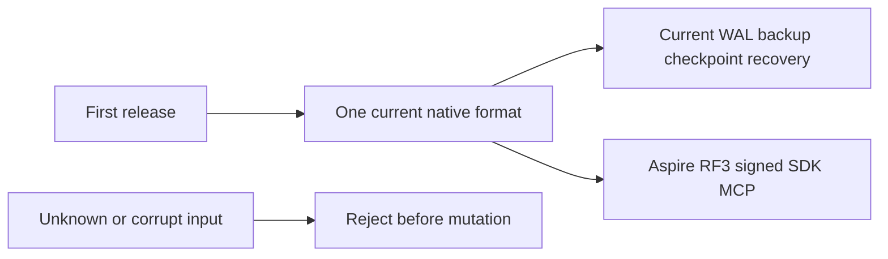

# ADR-116: one current format before the first release

Status: Accepted, 2026-10-06. Owner: root integration. Related task: KL-043;
requirements and measurable acceptance:
[StorageRecovery CurrentFormat](../Features/StorageRecovery/CurrentFormat.md).

## Decision

Deliver and qualify one current native database contract for the first release.
The root [owner super rule](../../AGENTS.md#super-rule-owner-only-migration-and-legacy-authorization)
controls any separately requested migration or legacy scope. Product completion
does not authorize adding such a path.

Deliver one strict current native format. Remove obsolete old-format execution,
tests, preparation resources, settings, routes and active documentation together.
Keep current identity epoch7/WAL4/checkpoint5 bytes and native Orleans serialization
unchanged. Preserve node-local ownership, current backup/restore, corrupt-format
rejection, signed-purpose fencing, process recovery and genuine Aspire RF3 SDK/MCP.
Current stores are created with reader capability1 and magic `0x364449444C4B`;
reject an absent/zero/unknown capability and remove unmarked-store conversion.
Keep current outcome-v2 identity and locator integrity without old-key/old-frame
fallbacks. Remove configuration migration commands and prior-KeyLoad binary/image
compatibility fixtures; preserve external SQL protocol and actual current RF3
failure/authorization/lifetime operations. Qualification must bind current source,
runtime and original operation reports.

The linked feature is the implementation contract: ordered stages, exact module
ownership, consumer audit, bounded whole-operation tests and root join points.
Root owns shared contracts, workflows, registry/coverage maps and final review.
Luna workers prepare disjoint guarded source/test/doc packets only after their
exact ownership and acceptance mappings are frozen.

Current node-root admission is REQ/AC-NATIVE-007 and TASK-SR-CURRENT-LAYOUT-044.
The linked feature freezes exact optional current entries, pre-mutation rejection,
exclusive ownership and the second admission check before provider opens, with
real rejection/preservation/healthy-follow-up operations. TASK-SR-CURRENT-MISSING-043
retains the actual generated-native omission and every authenticated peer cohort
path under AC-NATIVE-002/003; source inspection does not qualify their behavior.

TASK-NATIVE-CURRENT-PEER-049 applies the single current-reader contract to
ordinary, direct-resolution and cached cohort admission. The linked contract
preserves majority availability for an existing catalog and the existing all-voter
fresh-bootstrap gate; current capability failure cannot be retried as readiness.
Keep server-owned paired-store evidence and original authenticated bytes. Signed
socket unit controls and actual RF3 positive observations are distinct evidence;
the omitted-native-field RF3 negative remains open until its fault boundary is
specified and executed without an alternate peer or signing bypass.

Rollout uses the current unreleased source on the intended current RF3 topology.
No user stores are converted or deleted. Rollback restores a coherent source
checkpoint; it never opens current data with an unsupported reader. Future
released-format migration requires separate owner direction and an explicit ADR.

TASK-CURRENT-SNAPSHOT-NATIVE-FILE-067 preserves the complete current native-file
no-mutation oracle under AC-NATIVE-002/006. The test controls its live owner;
the internal Storage.IO observation handle is read-only, validates regular-file
identity and never acquires or releases the owner's advisory lock. It uses the
validated storage buffer and reads all actual file bytes. The linked feature
freezes this deterministic test boundary, original lock checks and full healthy
follow-up. Concurrent-writer snapshot semantics and production lock bypasses are
outside this contract. Root reviews and joins the API/platform change before
enabled build/format and the actual Aspire whole-operation regression.

Required verification is the enabled full Release build, formatter, governance,
native analyzers, actual Aspire normal/scalar and real process recovery, followed
by exact-source Linux Docker/Aspire RF3 and functional coverage. This ADR remains
Accepted until implementation, all mapped tests and delivery evidence exist.

