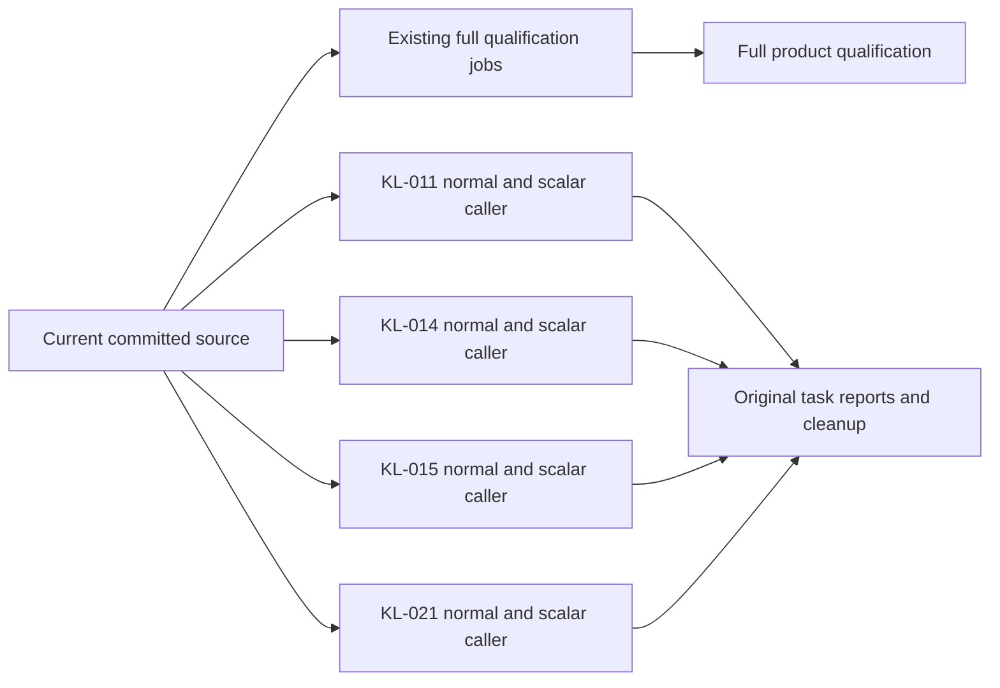
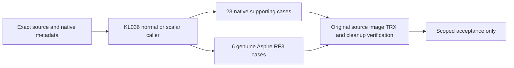
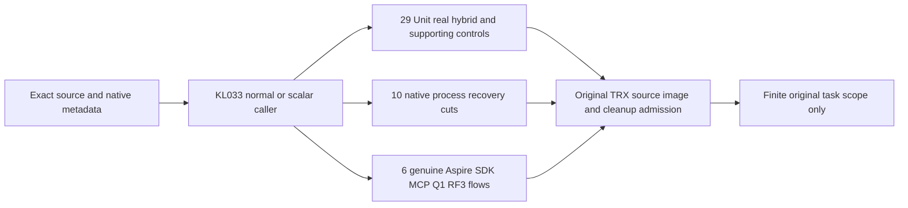
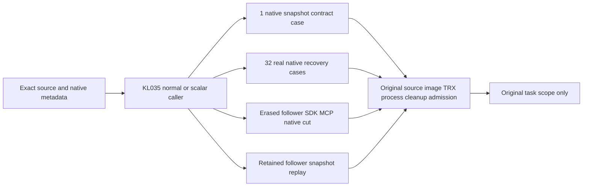

# ADR-117: Native TUnit CI entry

Status: Accepted; compilation and static verification passed, runtime qualification pending.

## Isolated measurements and heavy load scheduling (2026-10-09)

Owner clarification binds REQ/AC-TUNIT-ENTRY-013/014 in [NativeTUnitEntry](../Features/TestInfrastructure/NativeTUnitEntry.md). The latest explicit owner selection sets the ordinary independent native default to 50 slots. Retain the original20-slot results for real duration/resource comparison; configuration alone does not prove50-case overlap. Comparison selections require one native test at a time and reject greater concurrency before startup; concurrent workload clients remain independently configured. Independent benchmark jobs keep their genuinely isolated Linux native topology and resources. Heavy functional ingestion/mixed-operation scenarios require a separate exclusive selection and no coverage contribution.

TASK-TUNIT-ISOLATED-MEASUREMENTS-013 freezes this policy before source edits: scheduling worker updates the Node selector and typed AppHost selection with real selection regressions; root owns direct ComparisonHost container/process one-test arguments, docs, final review, canonical build/format and original native regression outcomes. Read-only inventory review verifies native measurement workers and workflow isolation. No client workload, deadline, database format, API or provider change belongs to this scheduling stage. Rollback removes the source delta only; prior qualification gates and this owner requirement remain. Native 1/10/500-client million-record and mixed-load complete-flow qualification remains open until implemented and executed.

Owner correction 2026-10-07 supersedes ADR-074's outer AppHost test-runner entry. CI starts native TUnit after build. TUnit fixtures use DistributedApplicationTestingBuilder, await readiness, execute real C# SDK/official MCP/native comparison clients and dispose the owned Aspire applications. Unit and recovery suites do not acquire an unnecessary RF3 topology. Benchmarks remain in their separate pipeline. Native --output Detailed exposes original results during execution; no console-log file bridge or custom outcome counter is needed.

REQ-TUNIT-ENTRY-001: every CI suite and isolated benchmark workload invokes TUnit directly; infrastructure remains Aspire-owned within tests. AC-TUNIT-ENTRY-001: native command selections preserve project, filter, scalar environment, bounded parallelism, original TRX/coverage output and nonzero exit codes. AC-TUNIT-ENTRY-002: RF3 coverage preparation executes as a TUnit session lifecycle using the existing Aspire preparation resource, propagates its verified original manifest and policy, joins output and cleanup, and does not recursively launch a test runner. Existing real fixture and workload tests remain mandatory Linux acceptance evidence.

Stages: TASK-TUNIT-ENTRY-001 records this correction; TASK-TUNIT-ENTRY-002 updates scripts/Features/TestInfrastructure native selection and CI callers; TASK-TUNIT-ENTRY-003 moves RF3 coverage preparation into IntegrationTests Features/CodeQuality/Lifecycle and verifies compilation and command syntax. Root owns all joins; no delegated roles. Feature specification: [NativeTUnitEntry](../Features/TestInfrastructure/NativeTUnitEntry.md), ../Features/TestInfrastructure.md and ../Features/BenchmarkComparisons.md.

No package, storage, serialization, authentication, membership or workload contract changes. Existing AppHost model seams remain available to tests; their old CLI caller instructions are superseded. Rollback requires owner review because reinstating the outer caller contradicts the correction. Runtime tests and infrastructure must not be launched during this editing task at the owner's direction; static checks cannot establish runtime qualification.

TASK-TUNIT-ENTRY-004 replaces ComparisonHost's standalone Program with a native TUnit workload case and its existing C# client library. Aspire still owns the pinned load-generator container and WaitFor dependencies; the container runs TUnit with Detailed output and copies its bounded original TRX into the existing cell qualification artifact before deleting temporary report roots. Keep native TRX separate from website measurement JSON archives. This retains the isolated load-generator network/resource contract, rather than moving client execution onto a different machine. TUnit cancellation joins the existing bounded workload lifetime. Host process contract regressions pass their workload settings through configuration environment and retain native failure outcomes.

Current stage evidence: [NativeTUnitVerification](../Features/TestInfrastructure/NativeTUnitVerification.md). The existing status.json runtime gates remain unqualified; this editing stage cannot mark them passed.

TASK-TUNIT-ENTRY-005 implements REQ/AC-TUNIT-ENTRY-004 from NativeTUnitEntry by changing only the bounded aggregate `docker-rf3` job timeout from 60 to 180 minutes in `.github/workflows/build-and-tests.yml`. The complete same-image coverage cohort requires two full uninstrumented unit censuses, ten positive instrumented groups, native recovery/RF3 and strict descriptor/product admission, alongside the required RF3 suite and build. The observed unchanged local full unit census lasted 19 minutes 28 seconds; that failed development run informs scheduling and provides no acceptance or coverage evidence.

Stages are: freeze the linked requirement; join the workflow together with its source-bound native coverage producer and qualified unit inventory; parse the actual YAML/PowerShell; execute the original complete Linux job; retain all original exits, TRX, source/image hashes and coverage admission receipts. Root owns final integration and the agent's private workflow overlay. Every individual native deadline, bounded operation, coverage threshold, no-skip and fail-closed publication contract remains unchanged. Rollback removes the scheduling amendment and its overlay without admitting partial evidence. This amendment is Accepted, with complete Linux runtime qualification pending.

[ADR-119](ADR-119-tunit-owned-local-membership-image.md) defines the Accepted
REQ/AC-TUNIT-ENTRY-005 local membership prerequisite refinement. Native selection
passes arguments only; the TUnit case removes the recursive runner, executes the
existing Aspire image prerequisite, passes typed identity without environment
mutation, and joins final exact-tag cleanup after the actual six-silo wave. Root
freezes/joins; Luna prepares guarded source. Implementation and runtime pending.

TASK-TUNIT-EARLY-RF3-DIAGNOSTICS-008 implements REQ/AC-TUNIT-ENTRY-008 from NativeTUnitEntry. The original ordinary RF3 test step has a stable `rf3-required` identity. After its native process and fixture cleanup return with success or failure, portable native `find` checks the actual result directory without following links and requires an existing nonempty TRX; missing reports fail that check before upload. Authenticated Linux run37835972588 retained the original 130-case partial TRX but its prior `rg` check exited127 because that executable was absent. Replace that check without changing test outcomes. The existing pinned artifact action uploads unchanged `TestResults/rf3-required/**` plus the original prepared source/image receipts to a separately named `docker-rf3-original-diagnostics` artifact before covered discovery/execution starts. Root owns docs-first workflow integration and actual GitHub provenance verification; agents may diagnose their real failed cases from that authenticated original archive.

The diagnostic archive does not replace or admit the final `docker-rf3-qualification` artifact. Existing full suites, collector ownership, final source/image verification, descriptor/product admission, thresholds, deadlines, outcome/cleanup behavior and permissions remain unchanged. No report transformation, extra test runner or synthesized status is introduced. Rollout is the next normal workflow source revision; rollback removes only the diagnostic upload. Native workflow/source syntax review and original successful upload with exact API/archive digest verification are required evidence. Status remains Accepted with current Linux verification pending.

TASK-TUNIT-COVERED-SHUTDOWN-IDENTITY-009 implements NativeTUnitEntry REQ/AC-TUNIT-ENTRY-009 and existing REQ/AC-TEST-010/014/015 and REQ/AC-CQ-039/040/042. Before shutdown, IntegrationTests Features/CodeQuality/Lifecycle/NativeCoverageRf3FixtureOwner retains a bounded copy of the actual fixture-selected three container names alongside successfully verified running container/image identities. Features/ClusterReplication/Lifecycle/ClusterFixtureApplicationShutdown stops the actual application, then calls that same coverage owner without resolving services from the stopped application. The owner inspects the retained original names and exact original started identities under the existing absolute cleanup deadline. No alternative names, new process, duplicate application owner, ignored disposal error or inferred collector flush is admitted.

Ordered stages are the docs-first lifecycle contract, the two owning source changes, native solution build/format and current-source full covered RF3 verification with original artifacts. Root is the integration/compiler/Git owner; independent agents continue their feature scopes. The existing complete Q2 relational join and three join-budget SDK/official-MCP flows are the regressions, followed by unchanged full contributor/collector/descriptor/product merge gates. Original Linux run37821315110/attempt1/source3458 retains four failures from an IServiceProvider lookup after Stop. Rollout uses the next normal source/image cohort; rollback removes this paired lifecycle amendment, without any persisted-data or provider migration. Accepted; runtime qualification remains pending until genuine covered RF3 and exact-source checks pass.

TASK-TUNIT-PARALLEL-TASK-ACCEPTANCE-010 implements NativeTUnitEntry REQ/AC-TUNIT-ENTRY-010 after the owner's 2026-10-09 direction to run independent acceptance on GitHub concurrently. Add eight isolated Linux task/profile cells to the existing Build and Tests workflow, with no cross-task/full-suite dependency, no arbitrary concurrency cap and fail-fast disabled. Keep every existing full build, analyzer, unit/scalar, recovery, RF3 and coverage job. The exact KL-011/014/015/021 method/parameterized-case contract lives in `scripts/Features/CodeQuality/task-acceptance.contract.json`; these scoped artifacts cannot admit numeric product coverage or replace any complete suite.

Ordered stages: freeze this contract and the linked feature criteria; root prepares the canonical task inventory/workflow; session and security agents implement disjoint private native selection/discovery and original report admission files; root reviews and joins them, parses real YAML/PowerShell, commits the complete wave and pushes main; then owners authenticate and repair their exact-source Linux outcomes. Every cell prepares only the current genuine server image, compiles Release once, captures actual source/DLL/PDB identity, discovers its exact native selectors, executes complete native TUnit operations with Detailed output, verifies source/image after all children settle and joins its own image/fixture cleanup. Failed independent selectors do not suppress later selectors or become successful diagnostics; no retries, synthetic outcomes or skipped cases. Retain unchanged original census/process/TRX and image receipts with current GitHub run/attempt/SHA and pinned artifact uploads.

Keep existing 180-minute aggregate and 30/60-minute native selection budgets, actual fixture bounds and least privileges. Selected scopes are sequential, with 20 native TUnit slots for independently owned cases inside each scope under the owner's subsequent correction. True shared-resource exclusions require an invariant audit before removal. RF3 scalar cells cover the caller runtime only because the actual Docker server resources do not propagate `DOTNET_EnableHWIntrinsic`; never infer scalar server qualification. Dependencies are the existing native entry, actual test methods, current source/image producers and original native report contracts. Integration points are the root-owned task contract/workflow plus session-owned `task-acceptance.ps1` and security-owned `task-acceptance.verify.ps1`. Tests/evidence are every declared complete operation, exact discovery/TRX union, no skips, unchanged native identity and joined cleanup on the real committed Linux source. Rollout uses normal main push; rollback removes only additive task jobs/tooling, with no persisted-data migration or product contract change. Accepted; GitHub qualification pending.

The owner's subsequent 2026-10-09 clarification authorizes selected task-only iterations. A closed manual `task` input defaults to `all`; selecting KL-011, KL-014, KL-015 or KL-021 executes standard repository governance plus only that task's two cells. Default push/PR/manual-all preserves every full mandatory job and the full eight-cell task matrix. The workflow's actual executor input determines its scope; a focused green workflow cannot become full product or coverage evidence. No required final gate is bypassed. Root owns the bounded input/conditional join and source-bound review; task owners authenticate only their declared original outputs.

The native process helper's optional `ForwardToConsole=false` seam forwards each original admitted stdout/stderr chunk during execution from the existing owning reader, after capture under the same shared bound. Task selection enables it and removes post-exit duplicate writes; default callers remain unchanged. Console writer exceptions retain the original failure and enter existing tree/process/reader settlement. Session authors its guarded private `functional-coverage.native-merge.process.ps1` amendment; root joins after review and verifies real native output/exit/reader settlement. No parallel reader, custom counter, output rewrite or log-file polling bridge is introduced.

Before joining that helper, freeze its observed failure-settlement repair under the same REQ/AC-TUNIT-ENTRY-010: native tree termination precedes closing pending readers, by swapping only those existing owner actions. The genuine original overflow retained returned Dispose and Kill calls but a faulted stderr task and unjoined native exit; both original controls and initiating failures remain evidence. Repaired overflow and native-deadline flows must retain failed native exits and initiating errors, join and dispose every original owner, and complete a healthy Unicode stdout/stderr continuation using the same helper under unchanged bounds. Root reviews Session's actual before/after process originals; no internal runtime cause beyond observed states is asserted. Rollback of this amendment restores those two actions and forwarding behavior together; no product data or API changes.

Root also joins the source-provenance amendment to the four existing CodeQuality owners: shared, inventory, production-source-manifest and native-merge.files. A single closed case-sensitive predicate admits precisely the two task PowerShell files and their JSON contract; any other task-acceptance-prefixed name fails. Both native script producers and original-manifest admission reuse it, retaining the functional-coverage roster, `.dockerignore`, unchanged schema and all confinement/hash/reparse/output bounds. Security prepares the guarded private patch; root reviews and verifies actual source prepare/verify after the complete tooling join and before delivery. Task artifacts remain outside numeric coverage/product admission.

TASK-TUNIT-EMPTY-ORIGINAL-010 and TASK-TUNIT-ORIGINAL-REPRESENTATION-010 implement the original-admission contract under the same REQ/AC-TUNIT-ENTRY-010 and REQ/AC-CQ-039/040. Ordered stages: preserve the authentic fe8 failed jobs and original bytes; freeze the exact stream, environment and native-census versus TRX representations in NativeTUnitEntry; Security prepares a guarded private amendment to task-acceptance.ps1, task-acceptance.verify.ps1 and the existing functional-coverage.native-merge.trx.ps1; root reviews and joins those owners; exercise unchanged originals, strict altered-copy denials and healthy re-admission, then compile and deliver the coherent source for fresh Linux task execution. Zero-byte streams retain a non-null zero-length byte array, single results retain array cardinality, canonical class/method and exact instance bind separately, and both TRX definition/result displays must match the declared instance. Normal caller environment is truly absent, scalar is exactly 0, and the exact inherited state is restored. All bounds, source/image/UID/hash and complete case/outcome/counter/cleanup checks remain unchanged. No old job becomes passing through reinterpretation; the actual two failed scalar operations remain rejected. These are repairs to the existing tooling contract, with no new product boundary, persisted format, dependency or topology; rollback removes this coherent amendment without admitting partial evidence. Accepted; fresh exact-source Linux qualification remains required.

TASK-TUNIT-NATIVE-PARALLELISM-011 implements NativeTUnitEntry REQ/AC-TUNIT-ENTRY-011 after the owner's explicit request for 20 simultaneous tests inside TUnit. Root changes the native selector and centrally validated typed TestExecutionOptions default from8 to20, updates the existing whole selector operation regression, binds its actual unchanged case identities to the new source/PDB census and runs a coherent build plus focused independent operation batch with original timestamps. Task adapters pass20 rather than1. No native outcomes or concurrency percentages are synthesized. Original TRX start/end overlap demonstrates actual scheduling only for the executed independent batch; shared fixture/fault/global exporter invariants remain mandatory and blanket native exclusions need explicit source-backed audit. The existing64 supported ceiling and explicit invalid-limit rejection remain unchanged. Rollout is normal source delivery; rollback of the owner-required default needs explicit owner direction. No persisted-data, provider or product API changes. Accepted; exact native execution and Linux proof pending.

### TASK-TUNIT-KL021-ACCEPTANCE-012: complete current read authority scopes

REQ/AC-TUNIT-ENTRY-010/011 adds KL-021 to the closed adapter/verifier contract and manual task choice. Default push/PR/manual-all retains every full mandatory job and all eight isolated task/profile cells; manual KL-021 retains governance and its two normal/scalar-caller cells only. Existing task cases, strict native-null/scalar-0 environment restoration, original stream/TRX representations, source/DLL/PDB/current-image binding, native 20, original outcome/no-skip and joined cleanup gates remain unchanged.

Traceability is architecture KL-021, REQ/AC-SESSIONREAD-001..004 and REQ/AC-FOLLOWERREAD-001..005 in DocumentStorage, ClientApi and ClusterReplication; TASK-ISO-021/REQ/AC-REP-006 owns signed read/control separation, REQ/AC-REP-004 the existing bounded native read deadline, REQ/AC-REP-001/002 terminal endpoint admission and REQ/AC-CRS-002/005 compatible-majority admission. ADR-017/036/082 retain their existing read/token/identity/cohort contracts; ADR-117 owns only this additive acceptance orchestration.

The exact contract contains twelve selectors and 113 cases per caller profile: 57 Unit (54 existing functional and 3 required ordinary controls),26 independently stored native quorum/protocol cases in the Recovery project, and30 genuine Aspire RF3 cases. Unit scopes retain 6 session-cut cases, 17 functional follower document flows, 2 ordinary follower schema controls, 29 signed probe/header/control cases including 1 ordinary stable-ordinal control, the configured read deadline, closed endpoint ReadBarrier refusal and stopped-socket majority refusal followed by healthy re-admission. The stored 26 cover actual elected 1/2/3-voter data/control cuts, malformed native authority and cancellation; they do not claim process-crash recovery. RF3 retains the full failover/minimum/invalid-token/persisted-deny-restoration flow and reachable former-leader null/original/new-minimum refusal matrix, plus all 28 follower cases across direct SDK, official MCP, Q1 SDK and Q1 official MCP. Five complete follower method selectors preserve held literal cuts, fresh credential/grant/field authority, lag/cancellation and actual lost-quorum restoration under unchanged 60-minute selection deadlines.

Root grants an immutable coherent DLL/PDB image for original native discovery; exact canonical class, native constructor display, method, parameterized instance, parameter types, UID and source range bind every declared case. Authored counts and source review are not operation outcomes. Preserve the existing 180-minute job bound, native 30/60-minute selection deadlines, original fixture bounds and genuine shared-resource exclusions. Scalar qualifies caller/in-process execution only, not unchanged Docker server intrinsics. Initial follower-document qualification leaves Q1 SELECT/AST and broader model/projection stale reads explicitly open.

Ordered stages: freeze this trace; privately compose the six owning docs/ADR/workflow/adapter/verifier/contract paths from the current guarded base, preserving pending owner joins; bind fresh native discovery and source/image receipts; root reviews syntax and unchanged full jobs, joins and commits/pushes; the task owner authenticates the two fresh Linux artifacts and repairs actual complete-flow failures. Retain original failed cohorts. No report rewriting, retry, deadline increase, classification/group change, product coverage promotion or production-readiness claim. Rollback removes only this additive KL-021 scope and its two cells; no persisted-data, public API, storage, package or production topology change. Status: Accepted implementation contract; exact-source Linux qualification pending.

## Exact storage and vector task lanes

TASK-KL008-EXACT-NATIVE-ACCEPTANCE-003 / AC-KL008-NATIVE-001 and TASK-KL027-EXACT-NATIVE-ACCEPTANCE-001 / AC-KL027-NATIVE-001/002 extend the existing exact-source native task matrix with two additional closed task identities. Root freezes their feature maps, derives case/parameter/source identities from actual unfiltered built metadata, joins the bounded adapter/verifier allowlist and existing workflow, verifies native discovery and the complete original source/receipt/exit/reader/disposal flows, then commits/pushes for Linux qualification. All existing four task lanes, full suites, error/cleanup/source/byte admission and limits remain mandatory. Each normal/scalar cell uses its own runner and TUnit limit20, without max-parallel serialization. KL008's27 unit operations need genuine local storage/CrashHost but no Docker image/topology; only that explicitly unit-only cell skips Docker check/image/configuration, preserving independent full RF3 jobs. KL027 retains27 units plus four SDK/MCP/shared-SQL RF3 flows with fresh owned image/readiness/registry cleanup; scalar describes its actual caller environment. Original artifacts remain independently verified and source-bound. No database format, new transport, topology weakening or qualification bypass belongs to this addition. Rollback restores the coherent six-task adapter/verifier/contract/workflow inventory while retaining every original result; an unqualified lane remains open in status.

## Native MCP initialization observation (2026-10-09)

TASK-MCP-INIT-OBSERVATION-001 / REQ-MCP-INIT-OBSERVATION-001 / AC-MCP-INIT-OBSERVATION-001 retain an original failed official SDK Initialize and its unchanged pinned2026-07-28 protocol, token and deadlines. ClientApi Integration Helpers/McpOfficialClient and McpCallerHttp own a passive DelegatingHandler over the same public default IHttpMessageHandlerFactory chain and HttpClientFactoryOptions.HttpClientActions in native order used by Aspire CreateHttpClient, with the actual Aspire GetEndpoint discovery. Diagnostics/McpInitializeHttpObservation owns at most eight closed HTTP observations during Initialize only: HTTP method category, actual numeric response status, send/response completion and cancellation flags, and safe exception category. It reads no headers, request/response content, caller values or inventories; responses and tokens pass unchanged. The caller emits the bounded original sequence through Console.Error plus ServerFailureObserver before rethrow, retaining diagnostic and cleanup failures. Native owned resource evidence retains topology identity; this record maps only known node names or Other. No retry, version fallback, timeout increase, product transport or storage change is authorized.

Ordered implementation is this contract, the passive HTTP/helper delta, root native build/format, existing AcMcp003UnsupportedOfficialProtocolRejectsThenCurrentCallerExecutes failed-initialize followed by two healthy native MCP executions, AcMcp005CancelledNativeReadDoesNotPreventTheNextRealCall and the original failing HeldPrivateDocumentRechecksPersistedAuthorityThenRestoredCallerResumes whole flow and fresh Linux RF3 original reports. Source ownership remains private until guarded root join; root alone compiles and delivers. Rollback removes this observation delta with no data migration. Exact023 failure remains unqualified: its SDK discarded the initiating RPC/HTTP/probe exception. Status observations cannot independently classify JSON-RPC error versus successful-status discover-probe timeout without payload access, which remains prohibited. Success disables recording; later calls are unchanged. No synthetic/parser-only cases replace real caller flows, no coverage promotion.

## Scoped KL-036 native Linux acceptance lane (2026-10-09)

TASK-KL036-EXACT-NATIVE-ACCEPTANCE-001 / REQ-KL036-NATIVE-ACCEPTANCE-001 / AC-KL036-NATIVE-ACCEPTANCE-001 add KL-036 to the same closed native task matrix and manual selector. This is scoped public-parent/supporting acceptance, never whole KL-036/product/fullsuite/coverage qualification. Existing task identities KL008/011/014/015/021/027, default full suites, scalar/recovery/RF3 and all artifact/provenance/image/cleanup gates remain mandatory. Five selections contain29 declared cases per profile:20 existing source-mapped supporting instances,3 complete native encoded type-frame flows, and6 genuine Aspire-owned public-parent RF3 flows across PublicParentFlowTests(1), ExpiredRetireCancellationRf3Tests(4), ParentCapacityRf3Tests(1). The UTF8/UTF16 native fingerprint method retains its three actual Int32 boundary instances0/1/2. Framing is supporting registered generated-command/counter framing, malformed native-version refusal then exact healthy complete-payload continuation and concurrent native sessions/canceled admission; it is not a separate product capability.

Root must supply fresh original native filtered metadata and PE/PDB/source bindings before final contract admission. Class/method/parameter/native display/instance/UID/source identity, exact union/no skip/no duplicate/no extra, unmodified original TRX and counters, original source/image before-after and settled native process/registry/resource cleanup remain unchanged. Source-declared counts are not executed or discovered evidence. Linux normal/scalar cells use separate GitHub runners and the existing server-only image producer, exact source/run/attempt/image receipt, native MaximumParallelTests20 and preserved NotInParallel shared-resource protections. Scalar describes only the caller environment; no scalar server assumption is invented. Existing unit30m/RF3 selection60m and180m job limits are unchanged. Failure retains authentic reports and blocks qualification; no omission, retry, fallback, custom runner or extra workflow is introduced.

Supporting cases retain real persisted caller-stamped/wrong-stage denials, cold unknown/prepared-winner cancellation, raw scope/read reservations and release/deadline isolation, authenticated Capture/fullmodel/receipt cold replay, native canonical fingerprint and actual Orleans context restoration/concurrency/disposal. Public RF3 preserves linked models and SDK/official MCP/Q1 receipts across two genuine RF3 owners/cold replay; original cancellation own-outcome/lost-reply/unknown charged refusal/distinct cleanup generation; same-token sealed expiry only Cancelled/no-effect; actual cold-corrupt disposition refusal followed by exact fixture-owned database+replica restoration and healthy continuation; configured capture-shape/grant bound denial and restoration. Independent same-seal MissingAuthority remains OPEN, as do native future embedded SafeDetail upper-bound and exact operational pre-admission+1 criteria. No selected flow can close those unqualified gates or substitute fixture reset for production recovery/power-loss proof.

Traceability preserves existing PartitionTransfer/ADR106 public-parent/cancellation/disposition contracts and ResourceExecution scoped-grant requirements; this additive execution orchestration uses ADR117 and REQ/AC-TUNIT-ENTRY-010. Ordered stages: docs-first scope, private exact contract/validator/workflow change, root fresh build/native discovery identity comparison, unchanged source/image/process checks, commit/push and authenticate each task-acceptance-KL-036-normal/scalar original artifact source/run/attempt/API+ZIP digest before any acceptance claim. Root owns live docs/workflow/compiler/Git joins; security owner repairs scoped infrastructure and harvests these dedicated original outcomes, Movement/Session own whole parent implementation. Rollback removes only the additive KL036 dispatch/contract entry while retaining originals and all prior lanes; there is no data/protocol migration.

### TASK-SDK-KESTREL-FAILURE-OBSERVATION-001
REQ-TUNIT-KESTREL-OBSERVATION-001 / AC-TUNIT-KESTREL-OBSERVATION-001 under ADR-117 and existing ClientApi transport requirements freeze test-only bounded observations for the authentic eb0 five failures: KeyLoadClientNullReadTests.AllNativeAbsentReadsRemainSuccessfulBeforeUnavailableStatusAndFullHealthyContinuation (two existing arguments), KeyLoadClientNullWriteTests.UnavailableSuccessfulWriteBodyRetainsUnknownOutcomeStableRetryAndNullableReads (two existing arguments), and KeyLoadClientTransportTests.MidBodyCancellationMapsReadFailureAndClientCanSendNextRequest. Actual Kestrel start/send/handler/response completion/cancellation records carry only closed stages/status/category and actual monotonic elapsed, ThreadPool available worker/IO threads, pending work and native thread count. At most64 records, saturation explicit. No URL/path/header/body/credential/payload/caller value is inspected or emitted.
The existing ephemeral loopback Kestrel/default native HTTP handler chain, actual client/request tokens, five-second bounds, full original negative-to-healthy assertions and cleanup remain unchanged. The optional observation is passed only by these flows; no extra request, warmup, retry, timer, NotInParallel or product/config change. On actual failure only, emit closed JSON to original native stderr before rethrowing the initiating exception; diagnostic-output failures join that same ordered ledger. Success emits nothing. This reveals observed stages only; it cannot infer thread-pool starvation or socket/JIT causation. Root owns guarded join/build and exact Linux normal/scalar original TRX/output qualification. No helper-only test or synthetic outcome qualifies the contract.

### TASK-KL033-NATIVE-TASK-ACCEPTANCE-001

Accepted additive execution scope under existing REQ/AC-TUNIT-ENTRY-010: [Search](../Features/Search.md#task-kl033-native-task-acceptance-001-original-finite-hybrid-rank-and-explain) freezes all three original finite KL033 predicates and [TestInfrastructure](../Features/TestInfrastructure.md#task-kl033-native-task-acceptance-001) owns unchanged native admission. Actual R863 filtered native metadata binds29 Unit,10 supporting process Recovery and6 genuine RF3 cases per profile. Exact raw class/method/instance/parameter/source identities enter the canonical contract, with original native UID/location/source/assembly observations retained as evidence; source declarations alone are never native case proof.

No topology, provider, ranking, authentication, storage, wire, deadline or parallelism change: retain native20, independent Linux normal/scalar cells, caller-only scalar RF3, existing source/image/TRX/no-skip/no-extra/process/cleanup guards and all prior task/full mandatory jobs. Root owns shared seven-path docs/contract/selectors/workflow join and verification; security owner privately maps actual identities and owns dedicated original artifact harvest. No dependency/KL074/global ANN/performance/full-product closure follows. ADR018 remains Proposed for broader global ranking. Rollback removes only additive dispatch scope; originals and existing lanes remain. Linux source-bound operation qualification is pending.

### TASK-KL035-NATIVE-TASK-ACCEPTANCE-001

Accepted additive native orchestration under unchanged REQ/AC-TUNIT-ENTRY-010: [ClusterReplication](../Features/ClusterReplication.md#task-kl035-native-task-acceptance-001-complete-original-snapshot-installation) retains every original KL035 predicate and [TestInfrastructure](../Features/TestInfrastructure.md#task-kl035-native-task-acceptance-001) owns admission. Root's four actual R863 native censuses bind1 Unit,32 Recovery and2 genuine RF3 cases per profile, with raw UIDs/displays/typed parameters/source locations/process/source-image identity preserved. Canonical contract does not fabricate an instance or outcome from authored arguments.

Append KL035 to existing independent normal/scalar Linux task cells/manual choice while preserving all eight prior tasks including KL033/KL036 and complete mandatory suites. Unchanged native20/deadlines/source-image/original TRX/process/cleanup checks apply. Actual empty follower SDK/official MCP state and stopped native checksum/hardstate/tail are independent of retained-follower operation. Source metadata and local supporting execution do not prove Linux RF3. Scalar RF3 remains caller-only.

Root owns seven shared docs/contract/selectors/workflow paths, build/format/Git and final original evidence review; security owner prepares guarded exact binding and dedicated artifact harvest. Original replica/storage/lifecycle ADR035/036/017/041/061 contracts stay authoritative. No protocol/data/provider/topology migration or requirement weakening. Rollback removes only additive lane and keeps immutable evidence/prior tasks. Process kill is not power-loss/endurance/performance or full-product closure. Delivered-source Linux acceptance remains pending.

### TASK-KL029-NATIVE-TASK-ACCEPTANCE-001

REQ/AC-TUNIT-ENTRY-010 and REQ/AC-FTS-001–007,
REQ/AC-FTS-INCREMENTAL-001–005/007 and REQ/AC-FTS-INC-009–017
retain the original KL029 architecture predicates: projection deletion plus
canonical replay returns literal results, checkpoint crashes cannot conceal
updates, and stale revisions cannot resurrect. Add only KL-029 normal and
scalar-caller cells to the closed native task matrix/manual choice. Preserve
all nine prior tasks, full mandatory build/rules/unit normal/scalar/recovery/RF3
coverage gates, original source-image identity/admission, native20 slots,
Detailed live output, strict caller environment, retained failure/no-skip checks
and genuine joined Aspire cleanup. Scoped task receipts never replace full
suites or supply coverage/provider/performance/endurance/power-loss evidence.

Three exact closed selectors cover the source-authored58 Unit instances
(including damaged durable original intent and natural original-token expiry),
18 genuine process Recovery instances (ten full-generation and eight incremental,
including all seven required cuts plus retained generic posting control), and
nine genuine RF3 instances (SDK, official MCP and Q1 maintenance paths, persisted
row/field/revocation/read-cut, leader loss/restart, cancellation and healthy
continuation). Source counts/displays/constructor expectations are not native
discovery proof. Root must freshly bind every exact UID, method, instance, typed
parameter, primary-constructor reported class, source span/hash and assembly/PDB
against the final coherent image before the canonical contract is admitted.

The natural expiry flow retains unchanged default five-minute lifetime and
original cancellation, actual signed ExpiresAt, original durable intent/failed
ACK and canonical pin/outbox/documents, then genuine Release and distinct fresh
consumer/native generation Build with full literal bilingual/cold continuation.
Keep thirty-minute Unit/Recovery and sixty-minute RF3 native deadlines unchanged;
scalar means actual caller DOTNET_EnableHWIntrinsic=0, never unproved server mode.

Ordered stages: freeze this complete source scope; prepare guarded additive
contract/closed enums/workflow; root coherent build and actual selected metadata;
strict bind/reseal, root join/commit/push; authenticate both original Linux task
artifacts API/ZIP/source/run/attempt/native TRX/images/environment/readers/cleanup
and every final verifier conclusion. Missing/failed/skipped/changed originals
retain failure. Root owns live source, discovery/build/workflow/Git; Session owns
whole KL029 operation review and dedicated original evidence. Rollback removes
only the additive KL029 lane, preserving every prior task and immutable report.
No data, serializer, public transport, provider or topology migration occurs.

Actual R875 coherent-image metadata originals now contain exactly 58 Unit,
18 Recovery and nine RF3 cases for these three closed selectors. The owning
receipt and eleven-task census plan retain original native process/source/PE/PDB
before-after evidence. Strict native case admission remains required; metadata
is not an execution, coverage, Linux RF3 or task-acceptance result.

## TASK-KL036-NATIVE-SUPPORT-LANE-034 — additive exact two-flow selection

REQ/AC-TUNIT-ENTRY-010 and existing REQ/AC-MOVE-PARENT-LATE-NATIVE-001 plus signed native heartbeat requirements map two actual native-discovered supporting cases to additive KL036 selections. Preserve every entire original task object, all six original KL036 selections and their32 cases. Add `native-owner-late-retire-support` (Integration assembly, suite rf3, one case) and `unit-signed-heartbeat-support` (Unit assembly, one case), giving eight selections/34 cases per normal/scalar profile. The former uses actual six in-process native production owners/SAME factory-sealed operation/ApplyEmbedded; the suite token chooses its existing Integration assembly and never claims Docker RF3 quorum qualification. The latter uses actual persisted native store and signed production client/HTTP/endpoint/table flow, not a six-owner topology. Every mandatory full Unit normal/scalar, recovery/analyzer and genuine Docker/Aspire SDK/MCP RF3 gate remains independent and unchanged.

Exact native originals are r872 late-native (one discovered case) and heartbeat (three discovered cases, selecting ONLY the signed flow). Late UID is `KeyLoad.IntegrationTests.Features.ClusterRouting.PartitionMovementLateNativeOwnerTests.1.1.SameFactorySealedExpiredRetireColdRecordsMissingAuthorityThenSameMoveAndOriginalReceiptAreHealthy.1.1.0`; signed heartbeat UID is `KeyLoad.UnitTests.Features.ClusterRouting.ReplicaMembershipAuthorityHeartbeatFlowTests.1.1.NativeSignedHeartbeatPreservesFullRowRejectsWrongCallerThenHealthyContinuation.1.1.0`. Both parameterTypeFullNames arrays are empty and instance display equals exact method. Original census stdout hashes are54ad9b1baf368fe4d7a9a613007380c03fda010c6119f2ad0bb52dbfec4f7d7e anddeb40e1edee7b1d4e85c80a56cdb7d21c9dda23c5cbedc9b318492574b58961e. These are metadata originals, not runtime outcomes or current rebuilt image authority. Contract metadata retains the existing closed schema; native UID/image/source/PDB rebind remains required after full C# joins.

Both filters use exactly one four-segment native TUnit path; alternatives are never additional path segments. No verifier/key/default/parallel/child/deadline change: native20 cap, workflow180 minutes, discovery1800 seconds, Integration3600-second child bounds, actual supporting parent12-minute case deadline and original90s process/30s cleanup/60s grant contracts remain intact. HistoricalR875 actual eleven-task plan and distinct input-plan hashes are never interchanged or rewritten as proof for these additions. Ordered delivery: docs/traceability freeze→exact additive contract+private original metadata map→root source review/join/fullbuild/native census/strict rebind→actual normal/scalar operations→authenticate originals. No PASS/coverage/product readiness claim from selection or discovery.

## TASK-KL035-COMPLETE-SNAPSHOT-ADMISSION-002

REQ/AC-REP-004 and REQ/AC-TUNIT-ENTRY-010 preserve every original KL035 criterion and all35 prior native case objects. Actual root R883 metadata (native0,14 cases,5742 source inputs/437 image inputs, zero drift; stdout SHA02891a853fc6bda7bf31d7d500de9b8b38587360689e895268de85d3c9066fd2) identifies two distinct omitted classes: ReplicaSnapshotRecoveryTests in ReplicaPersistenceTests.cs and ReplicaSnapshotProcessRecoveryTests in ReplicaProcessRecoveryTests.cs. Their14 exact typed native identities are added to the existing Recovery selection. The complete lane is49/profile:1 Unit+46 Recovery+2 actual Aspire Docker RF3. This is metadata admission, never an outcome claim. Existing historical35 binding and every other task/full suite remain unchanged. The neighboring class names in the earlier table did not admit these separate classes.

AC-KL035-PUBLISHED-REPAIR-001 strengthens the SAME four PublishedImageDamageFailsClosedAndPreservesNewerCanonicalState native process rows (SnapshotVerified/Installed × missing/corrupt): retain the genuine published immutable image within the stopped trial, preserve exact original missing/corrupt failure and newer native canonical cut/NodeId/read generation/full receipt. After the original node is disposed, restore only that exact image, cold recover original snapshot4+tail5 and stable original receipts, submit an independently literal new revision5/cut6 native command through the real log/materializer, require its full original receipt and exact retry without another store position, then cold reopen and verify healthy result/old outcomes again. No fabricated receipt, replacement snapshot, recovery fallback, token/deadline change or product behavior. The helper owns assertions for this actual case, not a standalone test.

AC-KL035-PUBLISHED-REPAIR-001 maps to those four existing cases and feature-local ReplicaSnapshotDamageRecovery. Existing node/materializer observed-owner helpers join primary and cleanup failures before trial files are removed. Fixture exact-image repair is not production repair from missing/corrupt bytes. Root must compile, refresh changed-source native metadata/PDB binding, execute actual operations and authenticate delivered-source Linux normal/scalar exact49 union/source-image/TRX/cleanup before acceptance. Original full-suite556 rows and R883 metadata are retained independently; no current PASS, power-loss, endurance, coverage or whole-product promotion.

## TASK-KL036-COMPLETE-SOURCE-ADMISSION-001 — native Linux expectations

The KL-036 selected scope preserves every original34 case declaration and adds the real operational capacity, retained native-page failure and original Close/SourceBeginAbort whole flows, for37 source-declared cases per profile. ADR-106 owns their REQ/AC and execution contracts; ADR-117 owns native invocation and original-report reconciliation. This is an admission expectation, not discovered UID/count or a passing result. Exact-source Linux native discovery, normal/scalar execution and all mandatory full suites remain open. The other nine task objects and all original selectors/case declarations remain intact.

## TASK-KL015-C1-NATIVE-CAUSE-001 — bounded original failure classification

REQ-C1-OUTCOME-NATIVE-CAUSE-001: the original C1 inspector must retain its first OpenStore failure and identify known native database, serializer and runtime causes using only closed enum labels and already allowed numeric codes. AC-C1-OUTCOME-NATIVE-CAUSE-001: unwrap only original AggregateException first members and TypeInitializationException/TargetInvocationException inner causes, within the unchanged16-level ceiling; preserve original phase, primary failure, native exit, all resource joins and the256-byte canonical stderr contract. Emit no exception message, stack, path, class-name string, caller data or credential. Unknown causes remain Other and remain failures.

AC-C1-OUTCOME-NATIVE-CAUSE-002: the existing real child-process wrong-node/wrong-incarnation flow must return OpenStore/KeyLoad/TokenInvalidated, release the original owner and then read the original literal outcome through the healthy child. All existing malformed-input, scoped-outcome, disposal and RF3 persisted-revocation whole flows remain mandatory. New labels are diagnostic evidence only, never proof of an absent outcome or a reason to accept failed inspection. ADR-117 owns native execution/report evidence; AC-CRS-005 retains request isolation and persisted authorization. No public/persisted/storage/package/topology boundary changes; no additional ADR is required. Rollback removes the added classification/assertions only. Fresh current-source Linux build, normal/scalar process and real RF3 results remain OPEN.

## KL-001 source identity and platform receipt

TASK-KL001-IDENTITY-001..005 in [PlatformIdentity](../Features/TestInfrastructure/PlatformIdentity.md) binds REQ/AC-KL001-001..005 to existing REQ/AC-TEST-004. Root joins the docs first, captures a clean source-bound Linux x64 restore and enabled complete solution build with all actual graph/archive/source/license/native witnesses, then authenticates relevant existing scalar and distribution artifacts. Preserve native TUnit/Aspire execution, owner-selected ordinary50, original failures, no skips, source/image identities and resource cleanup. No new task lane, provider, API, trust, persistence, package or topology decision is introduced. MacOS/Windows are unqualified development targets, not redundant required CI jobs or inferred incompatible platforms. Whole-product endurance is separate from this foundation acceptance; all mandatory final qualification remains. Rollback removes this documentation amendment only. Accepted; current clean task-wide Linux receipt remains pending.

## TASK-TUNIT-WHOLE-034-042-NATIVE-ADMISSION-015 — source candidates precede exact native identities

REQ/AC-TUNIT-ENTRY-010 and Search REQ/AC-SEARCH-WAIT-001–003, REQ/AC-SEARCH-ANN-WAIT-001–003, BackupRestore REQ/AC-BACKUP-CLUSTER-001–006 and original KL034/KL042 predicates require additive independent Linux normal/scalar lanes. Current source candidates are24 Unit plus2 genuine RF3 for KL034, and39 supporting Unit plus11 Integration for KL042 (three whole cluster restore cases, seven actual native CLI interruption stages and the existing administrator backup parity case). These source counts, attributes and type names are not native UID, display, compiled-count or execution proof. The CLI process cuts execute within the original RF3 fixture; they do not invent a standalone Recovery suite or replace mandatory full recovery. Existing KL036 strict37 remains intact; its fourteen additional source candidates await a separate actual native binding (proposed51 source union).

The canonical contract adds only KL034/KL042 source-census selections, with exact source class/method/parameter declarations, source argument cardinality and source path; it contains no inferred native instance display or UID. Until authenticated native binding replaces censusSelections with the existing strict cases/selections schema, these cells perform only original bounded native JSON discovery against the prepared complete Release/PDB/source image. Check exact source method/typed-parameter union, source cardinality, unique real native UID, original assembly/source ranges and unchanged prepared/before/after images. Do not parse argument displays into authority. Actual native displays/UIDs remain original observations. A census-only manifest explicitly blocks execution and acceptance, exits failed after source verification and is retained by the existing always-upload step. No acceptance receipt is published. Missing, unexpected, duplicate or changed census also fails with all originals retained.

After root authenticates the source/run/attempt/profile/API/archive and original census, bind every actual display/UID/parameter/constructor source/span/image against the declared source and replace only those new census task entries with the original strict native cases schema. The unchanged execution/TRX/no-skip/source/process verifier then qualifies actual full flows. No automatic conversion, guessed enum/bool display or census-only PASS is permitted. Configured ordinary50, preserved heavy shared-resource exclusions/exclusive1, native discovery1800 seconds, Unit/Recovery30 minutes, RF3 child60 minutes and job180 minutes remain unchanged. Scalar means caller only; real persisted authentication, SDK/official MCP/Q1, native RF3, complete original deadlines/failures and fixture/image/registry cleanup remain required.

Ordered ownership: this feature and ADR117 precede the two additive task objects, producer fail-closed census branch, closed verifier/manual/workflow selectors. Root alone joins live files, builds/pushes and captures Linux originals. Existing ten task objects, strict37, strict113, all full suites and coverage obligations remain unchanged. Qualification regression is the real native census refusal followed by exact authenticated binding and complete healthy Linux operation execution; no getter/property or synthetic runner proves it. Rollback removes only the two additive lanes and census branch, preserving all originals. No product API/trust/storage/schema/provider/topology/dependency change. Source-only; native outcomes, full product, coverage, endurance and power-loss gates remain OPEN.

## TASK-TUNIT-KL036-ADDITIONAL-NATIVE-CENSUS-016 — bind the complete movement additions

REQ/AC-TUNIT-ENTRY-010 and original KL036 ClusterRouting acceptance retain the exact existing strict37 task object. The eight additional native case classes are ReceiverIssueFailover, ActiveAdjunct, FinalInstallFrame, FrameObservationScope, CleanupMatrix, ObservedFailureCold, PolicyBusyCold and PolicyEpochCold. Their current attributes declare fourteen additional source instances; proposed51 is source inventory only, with no inferred compiled count, display, constructor identity or UID.

The additive top-level additionalCensuses contract owns exact class/method/source-path/typed-parameter/source-argument declarations for KL036 only. The producer's explicit AdditionalCensus switch chooses this independent census without modifying any of the twelve original task objects. Its fresh kl-036-{profile}-additional-census evidence root retains the original bounded Integration JSON discovery, process/reader settlement, prepared/before/after source/DLL/PDB identity and final source verification. Native50 and heavy shared-resource exclusive1, discovery1800 seconds, settlement30 seconds and all existing operation/job deadlines remain unchanged. The strict verifier reuses owning exact-key/path validators for the additional group, each selection and each candidate; it requires exactly eight distinct canonical RF3 classes/selections, canonical source paths, typed source-argument shapes and fourteen declared source instances. Original native UID/assembly/source-span/image validation remains solely the existing actual discovery validator. Every original strict task/manifest/outcome predicate is retained. No operation executes in this lane; it always refuses acceptance after retaining its original manifest, even when complete discovery succeeds.

The existing KL036 normal/scalar jobs attempt this independently conditioned census after the original strict37 step. Actual complete build and source-preparation success are required; a failed original strict flow does not suppress the additional discovery. All original strict failures remain failures. The existing always-upload and image/registry cleanup own these originals. Missing, duplicate, unexpected or changed native descriptors/image/source fail closed. Root authenticates exact source/run/attempt/profile/API/archive, then binds the actual14 identities against existing37 before a separate strict51 expansion; source arithmetic or successful discovery cannot authorize that expansion or a PASS.

Ordered implementation and ownership: this feature plus ADR117 first; additive contract, exact verifier root-key/descriptor schema, restricted producer switch and independent existing-job step next; root alone joins/builds/commits/pushes/captures original Linux evidence. Verification is actual census refusal followed by authenticated descriptor/source binding and complete original SDK/official MCP/Q1/RF3 flows. No new public/trust/persistence/provider/topology/package seam, fake operation or synthetic getter case. Rollback removes only additionalCensuses, its exact verifier schema, switch and step coherently; all twelve original task objects, prior evidence and required full suites remain. Qualification remains OPEN.

## TASK-TUNIT-WHOLE-034-042-STRICT-NATIVE-BINDING-017 — original Linux census admits execution

REQ/AC-TUNIT-ENTRY-010, Search REQ/AC-SEARCH-WAIT-001–003 and REQ/AC-SEARCH-ANN-WAIT-001–003, BackupRestore REQ/AC-BACKUP-CLUSTER-001–006 and every original KL034/KL042 predicate continue TASK-TUNIT-WHOLE-034-042-NATIVE-ADMISSION-015. Authenticated Linux Build and Tests run37977314792/attempt1 at source d2323ed056153ae8bd2ec833fc316ac5863903a4 supplies both independent normal/scalar original censuses. Each profile actually discovered the same complete26 KL034 identities (24 Unit,2 RF3;11 selectors) and50 KL042 identities (39 Unit,11 RF3;15 selectors), including original parameterized native displays and typed constructor/source identities. These are original native observations, not counts inferred from declarations.

Original job/artifact bindings are KL034 normal113978740486/11639990404, scalar113978740434/11640305082; KL042 normal113978740338/11639129382, scalar113978740660/11640130291. API-authenticated archive digests are respectively bc93a9072e1c876b845c01d7ebde6940070d967aa186aa012bcc20b32ac8bbaa, f4eb890fcccdc26bc4e696f2df2c49141013920803935e427e90714ab9750229, 4f310b085a4efa45cdf48db5e74fad0878000410a803ba89173d54b140d5e2c8 and49507fc48213003256198031b0e2857fbdf9bc6c56f977a108647bf58a0df852. Every original discovery and source-verification process exited0 with joined exit/stdout/stderr/disposal and no retained failure; prepared/before/after images are identical. Native PDB-document hashes match the authenticated source tree. Native DLL/PDB SHA, MVID, CodeView identity and embedded compilation receipts are retained metadata; the archives contain no DLL/PDB bytes for independent binary rehash. No native execution/TRX/outcome or acceptance receipt exists for these census-only cohorts. Their deliberate binding-required failure remains original.

Ordered implementation: freeze this trace in TestInfrastructure and ADR117; replace only KL034/KL042 censusSelections with the existing strict selections/cases schema using those exact original arrays; root guards/joins/builds/commits/pushes; freshly discover and execute both complete Linux normal/scalar scopes through the unchanged canonical Aspire/TUnit entry; authenticate every source/image/UID/TRX/outcome/environment/process/resource-cleanup gate. The strict producer independently rebinds the actual new compiled image before execution. Existing ten task objects and ordinal raw arrays, KL036 strict37 and its separate eight-selection/fourteen-source-instance additional census, all twelve task identities, ordinary50/heavy exclusive1 and every original timeout/auth/RF3/SDK/official MCP/Q1 requirement stay exact. No producer/verifier/workflow bypass, synthesized UID/display, timeout change or classification promotion is introduced.

Root owns live integration and Git/Linux delivery; the qualification owner retains both-profile original API/archive/native-identity ledgers and repairs actual complete-flow failures. Rollback restores only these two original census task objects and this additive trace, retaining immutable originals and every other object. No product/persistence/trust/provider/topology boundary changes. Strict execution admission is prepared; complete current-source operation acceptance, required full suites, coverage, endurance and power-loss gates remain OPEN.

### TASK-TUNIT-ENTRY-018: authenticated KL036 native census graduation

REQ/AC-TUNIT-ENTRY-010 and the original KL036 ClusterRouting criteria now admit the complete exact native scope from Build and Tests run37977314792/attempt1/source d2323ed056153ae8bd2ec833fc316ac5863903a4. Both original normal/scalar cohorts actually discovered identical37 original identities (24 Unit/13 RF3) and fourteen disjoint additional RF3 identities, yielding a verified51-identity union across eighteen selectors. Counts derive from retained native metadata, not declarations or arithmetic admission. Literal native displays, constructor/type identities, parameter types, source locations and UIDs are preserved in immutable private ledgers; the contract uses their original strict case arrays, and fresh compiled discovery independently rebinds each new image.

Normal job113978740483/artifact11641550309 has archive SHA57d89c5f0a763463775a0337d7c5b6e1554a250fbd41751192984fa73255e111,8567955 bytes. Scalar job113978740282/artifact11640899867 has SHAeea1cc771f8df9bb0f831531d88c660f8d02144401acc9ff2084b8cf3dfbb8ac,8603148 bytes. Authenticated API source/run/artifact data, unchanged prepared/before/after images, complete native PDB/source binding and joined discovery/source-verification processes are retained. The archives carry authenticated DLL/PDB SHA/MVID/CodeView and compilation metadata, not binary bytes for independent DLL/PDB rehash. The additional census intentionally refused acceptance after discovery. Seven original strict selection flows failed in each profile; successful census cannot relabel them as passing.

Ordered lifecycle: freeze this trace and ADR117 first; append only the fourteen original bound cases/eight selections after all ten original strict selection byte sequences; preserve all eleven other task objects and twelve task identities; retire the now-duplicate additionalCensuses descriptor, AdditionalCensus producer switch, its exclusive descriptor validators and its independent intentionally failing workflow step. Preserve the active strict producer/verifier's source/image/UID/type/location/TRX/outcome/environment/process/resource-cleanup predicates. Original immutable census evidence remains history; there is no old-descriptor reader or fallback. Ordinary50/heavy exclusive1, native fixture-owned Aspire RF3, actual SDK/official MCP/Q1 clients, persisted authorization and every original operation/discovery/settlement/job deadline remain unchanged.

Root owns guarded integration, build/format/commit/push and fresh Linux delivery. The qualification owner retains both-profile API/ZIP/native ledgers and follows the complete newly admitted51-case executions, including genuine failures and healthy/cold continuation. Rollback restores only the original strict37 task/adjoining additional-census plumbing coherently from the guarded predecessor; originals stay immutable. This is compiled discovery admission, not source capability, execution success, complete task acceptance, coverage, endurance or power-loss qualification. All genuine runtime gates remain OPEN.

## KL079 source-candidate admission and authenticated binding (2026-10-10)

Related REQ/AC-FEED-001..006 and original KL079 acceptance retain the complete source-linked operation map in [ChangeFeeds](../Features/ChangeFeeds.md#task-kl079-native-task-qualification-006). This is an additive tooling admission contract, not a product/transport/storage change.

Order and ownership: feature/TestInfrastructure/this appendix first; scripts/CodeQuality appends only KL079 census descriptors and the existing allowlist; workflow appends only isolated Linux task dispatch for normal/scalar; root compiles and prepares original source/DLL/PDB/images. Existing native census validates actual class/method/typed parameters/source range/assembly/image and retains every process/output/cleanup original. It always refuses execution/acceptance pending authenticated exact case binding. Preserve all twelve original task objects/strict arrays byte-for-byte, native50 ordinary/existing exclusive-heavy resource ownership, every timeout/full suite/coverage gate, fixture-owned Aspire RF3 and separate Benchmarks/Website.

Integration: both normal/scalar original GitHub API/run/attempt/source/job/artifact/ZIP digests and complete native metadata must agree with prepared/before/after image identities before a separately guarded strict KL079 case union is reviewed. Then the unchanged strict producer/verifier must discover and execute every mapped original case, retain exact TRX outcomes and joined cleanup, reject missing/extra/duplicate/mixed-source evidence, and obtain actual functional-coverage inventory/contributor binding plus covered execution/final verification. Source descriptors are never native UID or PASS. Original Unit cancel/deadline controls, projection process stages and public SDK/official MCP/both Q1 RF3 cursor/live/follower/cold cases remain mandatory. Scalar caller environment does not prove scalar Docker server execution.

No migration or compatibility path is added. Rollback removes only this additive task entry/allowlist/workflow dispatch and linked appendices, preserving twelve original contracts and immutable originals. Root alone joins/builds/tests/pushes; KL079 owner retains end-to-end artifact binding and actual failure repair responsibility. No implemented/qualified ADR status is inferred from this source packet.

## TASK-KL079-AUTHENTIC-NATIVE-BINDING-GRADUATION-007

REQ/AC-FEED-001..006 retain TASK-KL079-NATIVE-TASK-QUALIFICATION-006. Its READY7 source census lane is the explicit predecessor, not execution/acceptance. Only after both genuine original Linux census artifacts are authenticated via GitHub run/attempt/source/job/artifact metadata and original ZIP digests may the feature-local proposal binder consume them. The binder is not an authentication endpoint: supplied files never authenticate GitHub. Root/owner retains API/ZIP provenance and review authority separately.

Ordered stages/owners: this TestInfrastructure/ADR117 appendix before the new scripts/CodeQuality task-acceptance.kl079-binding.ps1; reuse the existing native bounded JSON, unique-property, candidate/source/typed-parameter/image and process-settlement validators; require census-only pending state on every selection, no execution results, exact contract/source revision, successful source verification, prepared/before/after compiled images and complete native source binding. Current case source hashes must match original PDB/source images. Normal/scalar native case unions and DLL/PDB/source/build inputs must agree. Exact native identities are ordinal-sorted; duplicate method/display identities or UIDs fail. No synthetic display, parameter, UID, case total or passing outcome is created.

The create-only private outputs are the exact observed KL079 strict-task object, full native UID/source-span observations, coverage/contributor candidates with the reviewed criterion map and missing observed-work Unit inventory rows. Conservative executable-module mapping records Core and the source-linked live Query owners; actual covered execution must establish final module evidence. They are proposals, not live writes or acceptance/coverage receipts. Preserve every older strict task object, contributor/inventory row, group and threshold. A reviewed successor replaces only the new KL079 census object with strict native cases, appends genuinely missing native-bound functional cases, adds their exact keys/class to the existing unit-functional-02 group, and regenerates its selector using Get-FcNativeExactUnitSelector. No sixth group, dummy case, exclusion or source-count relaxation. Existing functional row range reconciliation remains owned by the canonical native rebind mechanism.

Then root joins/rebuilds/pushes the exact-source proposals and the original normal/scalar task execution runs every declared Unit, process and fixture-owned Aspire RF3 SDK/official MCP/both Q1 operation. Full functional coverage runs with native contributors/collector and unchanged final verifier. Case execution alone cannot promote coverage. Missing native current census, partial scalar results, missing RF3 pages/receipts/cold results or failed/unsettled observations keep closure OPEN. Native50 ordinary/exclusive-heavy ownership and original timeouts/Args/authorization/bounds/cleanup stay exact.

No public/persisted/product protocol or migration change is added. Root alone writes live sources/builds/tests/Git. Rollback removes only this proposal helper and appendices; native original archives/receipts and every existing strict contract remain immutable. This source packet is parser/preview/reconstruction only, with no compiler/runtime/coverage PASS.

## TASK-KL029-NATIVE-LOCAL-RF3-ADMISSION-008

REQ/AC-FTS-001..007 and the original KL029 projection/rebuild acceptance retain all mapped Unit/process and nine RF3 operation instances. The isolated native compiled discovery actually observes nine original cases, including four ProtectedNativeTextMaintenanceReplaysBilingualUpdateDeleteAcrossAllPublicPaths arguments (Sdk/Mcp/SdkSql/McpSql); discovery is development evidence and cannot qualify Linux runtime or coverage.

Ordered stages and ownership: this TestInfrastructure/ADR117 contract precedes the exact selected-filter append in scripts/TestInfrastructure/run-tests.mjs and Integration ClusterReplication/LocalRf3ImageSelection. Admit ONLY the existing canonical KL029 complete filter:

`/*/*/(NativeTextAsyncRf3Tests)|(NativeTextMaintenanceRf3Tests)|(NativeTextRf3LeaderLossTests)|(NativeTextRf3Tests)|(NativeTextWaitRf3Tests)/*`

Keep every earlier selector and its rejection flow. The original NativeTUnitSelectionTests RF3 parameter now exercises this exact positive native argument/environment composition and all original ambient GitHub/image/coverage/benchmark/suite/missing/unsupported-filter refusals, plus explicit partial/wildcard/additional-class/trailing-space refusals. Its original native Node process and cleanup remain joined. No synthesized case, changed UID/Args or blanket Search filter.

The original LocalRf3ImageTestSession still owns actual AppHost image preparation, bounded receipt/config/input verification, exact image identity on all three started containers, genuine RF3 startup/readiness, discovered SDK/official MCP/Q1 callers, original cancellation and shutdown, output tasks and exact-tag cleanup only after genuine settlement. AppHost LocalRf3ImageRequest already requires a nonempty explicit filter; no third product/transport policy changes. No ambient fake GitHub identity, unrelated image, provider or topology, increased deadline/budget, registry-receipt fallback or benchmark execution. Native50 ordinary and existing exclusive-heavy ownership stay unchanged.

Root joins guarded source and original mapped positive/rejection tests; the KL029 owner then runs the same nine real operation cases in normal/scalar isolated local images, preserving initiating/cleanup failures and full original results/receipts/cold oracles. Exact-source Linux normal/scalar Unit/recovery/RF3, source/DLL/PDB/image/UID/process/cleanup and coverage remain mandatory and OPEN. Local scalar caller configuration is not proof of scalar Docker-server intrinsics. Rollback removes only this exact filter admission and its test additions/appendices; all prior selectors, original failures and native evidence remain immutable. No public/persisted/product contract changes.

## TASK-KL094-NATIVE-LOCAL-DISTINCT-OWNER-ADMISSION-010

REQ/AC-XFER-001..005 retain all original cross-owner, durable receipt, authorization, bounded retry, recovery and public-caller gates. This additive TestInfrastructure/ADR117 contract admits only the complete authored native case filter:

`/*/*/RemoteTransferDistinctOwnerTests/ActualDistinctOwnersRetainAcceptReceiptAcrossTwoColdRestartsAndBDoesNotResurrectAcknowledgedMessage`

Ownership/order: these appendices precede the closed filter addition in scripts/Features/TestInfrastructure/run-tests.mjs and Integration ClusterReplication/Helpers/LocalRf3ImageSelection.cs. The existing NativeTUnitSelectionTests native RF3 argument verifies original Node selection, native argument/environment composition, every ambient GitHub/image/coverage/benchmark/suite/missing-filter refusal, and four distinct-owner partial/class-wildcard/additional-class/trailing-space refusals. Preserve all existing cases, Args, filters, counts and native50 ordinary admission. This is exact local development admission, not broad Messaging or wildcard catalog selection.

The existing LocalRf3ImageTestSession owns genuine fixture AppHost image preparation, current immutable LocalRf3ImageIdentity/source digest/config/invocation/receipt validation, original linked cancellation and joined output/shutdown/exact-tag cleanup. The protected two-RF3 fixture borrows its actual prepared Selection for the same original six containers, owner roots/options/ports/current persisted subjects, real SDK/official MCP/Q1 operations and two joined same-volume cold restarts. All six image identities must validate against the same original prepared receipt. No old image, manual Docker, fabricated environment/GitHub identity, retry, clock/deadline/default/capacity change or new dispatcher.

The original GitHub strict image/provenance branch is unchanged. Root integrates guarded source; private source/image builds and focused positive/negative native tests are development evidence only. Original exact-source Linux normal/scalar Unit/process/RF3, native discovery/UID/source/DLL/PDB/image/cleanup and complete qualification remain mandatory and OPEN. This authored filter is not a native UID or passing operation. Rollback removes only this closed admission, additive regression checks and appendices, retaining all earlier selectors/evidence and original failures.

## KL079 authenticated strict execution and completed binder retirement

TASK-KL079-STRICT-ORIGINAL-EXECUTION-008 and TASK-CQ-KL079-STRICT-SOURCE-ADMISSION-082 freeze the exact original run38046690429/attempt1/sourcec67d4dac normal/scalar provider archives, identical48 native instances and private canonical binding proof before implementation. Root replaces only the final KL079 census object with its exact strict proposal, preserves all12 prior objects, removes its census-only admission, and retires the completed one-shot binder together with the shared three-name source registry and its independent native literal oracle. Unknown source names remain rejected. Actual current-image preparation/tamper/refusal/restoration/healthy native flows, exact-source Linux strict48 normal/scalar execution, full source/DLL/PDB/UID/process/resource settlement and full functional coverage remain required; this appendix is not an Implemented or qualified status. Existing189 Query paths,50 ordinary slots, exclusive heavy ownership, timeouts, authorization, atomic cuts, original results, RF3 topology, collector thresholds and source completeness remain unchanged. Root joins/builds/tests/pushes while feature owners continue disjoint work. No runtime compatibility/migration or fallback path is introduced; rollout and rollback keep the strict task/source-admission/oracle coherent and preserve all immutable original evidence.

## TASK-KL029-EXACT-NATIVE-SDK-INITIATING-SELECTION-011

REQ/AC-FTS-001..007 preserve TASK-KL029-NATIVE-LOCAL-RF3-ADMISSION-008 and its full nine mapped RF3 instances. An authenticated private native discovery observed the original ProtectedNativeTextMaintenanceReplaysBilingualUpdateDeleteAcrossAllPublicPaths(Sdk) instance. Add only FilterUid for that exact observed native UID under the existing complete KL029 local-image filter; missing preparation, another UID, another suite/filter, coverage, benchmark settings and all original ambient identity failures refuse. The canonical run-tests.mjs remains the sole caller; no executable-argument replacement outside it.

Ordered ownership: this appendix and ADR117 precede the scripts/TestInfrastructure selection addition and the existing NativeTestSelectionProcess/NativeTUnitSelectionTests complete real Node composition/refusal regression. All original five parameterized cases and earlier selectors remain. The retained image environment remains the original three canonical full-nine preparation arguments. The execution arguments use native --filter-uid and --minimum-expected-tests 1, omit --treenode-filter and retain native50, original timeout, reporting, cancellation and resource ownership. UID selection does not change prepared image scope, admission or topology.

Before execution the owner must discover the current Integration image and verify this exact native UID/type/method/argument identity against original discovery and current source/DLL/PDB; a missing or changed identity refuses. Record prepared9 and executed1 separately with original source/input/image/receipt/TRX/caller/cleanup provenance. One successful initiating SDK instance is local development proof, never nine-case or Linux acceptance. After its complete original receipt/checkpoint/healthy Release/joined cleanup succeeds, the complete original nine normal/scalar flows and all Unit/process/Linux/coverage gates remain mandatory and OPEN. No product, public transport, persisted ID, default, deadline, quota, protocol fallback or benchmark workload changes.

Rollback removes only this narrow caller option and additive regression/appendices; original admission, failures, discovery and image receipts stay immutable. Source preview and real Node composition are distinct from compiled TUnit and operation qualification.

## TASK-FEED-COLD-VOTER-START-001

REQ/AC-FEED-005 and REQ/AC-TEST-007 retain the original cursor/live-cold requirements in [ChangeFeeds](../Features/ChangeFeeds.md#task-feed-cold-voter-start-001) and the matching TestInfrastructure appendix. This test-owned lifecycle refinement addresses native all-three-killed ordering: accept Start for all three original replacements before asking the first to become fully healthy. Use the original ContainerRestartOwnership through BeginContainerRestartAsync, then reuse it through RestartContainerAsync; the original receiver, source/image/receipt checks, health predicate, failure ledger, cancellation and joined shutdown remain unchanged.

Ordered implementation contract: feature/infrastructure/this ADR first; root native-preview/applies only IntegrationTests/ChangeFeeds/Helpers/FeedLiveRf3Cold.cs; compile the actual affected image; execute both original complete FeedLiveRf3Tests identities under the unchanged two-minute operation bound and actual fixture Aspire RF3/SDK/official MCP/Q1 callers; retain source/PE/PDB/image/UID/TRX, full cold/page/policy/replay/healthy and resource settlement proof; commit/push and authenticate current-source Linux gates. Other task owners keep independent slices. This is not an Implemented or qualified ADR status. No production contract, storage, provider or topology changes require a migration. Reversal removes only this undelivered ordering repair and appendices; original failed evidence and every mandatory full suite/coverage gate remain.

## TASK-KL029-LOCAL-RESTART-IDENTITY-005

The original full-nine RF3 local-image selection retains genuine Aspire kill/restart, full update/delete/projection results and original receipt assertions. At the existing completed SourceReceipt stage, the verified local image invocation binds actual immutable build inputs, image configuration and before/after runtime image identities. `SourceSha` is null for this local development branch; `LocalBuildInputDigest`, `LocalImageInvocationId` and `LocalImageConfigId` identify the separate actual local producer. A build-input digest is never a Git SHA. Current input changes or mismatched image identity refuse; there is no newest-file lookup, git-error fallback or copied Git history. Ordinary nonlocal execution retains original Git SHA acquisition, errors and every GitHub source/run/attempt/PDB/DLL/image/UID/cleanup gate.

Implementation order: LocalRf3ImageIdentity retains the verifier's already-validated input digest; ContainerRuntimeReceiptStore composes typed source identity; ContainerRuntimeControl records it only after original Start/health/runtime inspection; ContainerRuntimeReceipts appends nullable local diagnostic fields. The same original leader-loss whole operation is the regression, under unchanged normal/scalar full-nine filters, budgets and deadlines. Original initiating/save/cleanup failures remain retained. Local evidence is development-only; Linux functional coverage and RF3 qualification remain open. No database/public protocol/serializer IDs or production contract changes; rollback removes only the additive local diagnostic branch and fields.

# KL029 fixture-owned local restart provenance correction

Source evidence: actual full9 normal RF3 completed4PASS/5FAIL; leader-loss reached genuine Kill/Restart then ReadSourceShaAsync unconditionally invoked git rev-parse HEAD against the authorized no-.git private source snapshot. Four maintenance UnknownWriteOutcome failures are separate unproven causes. No fallback, Git copying, fake Git SHA or image receipt is permitted.

Ordered stages: retain original Kill/Start/health/actual runtime inspection; at original SourceReceipt stage acquire current verified LocalRf3ImageIdentity using the actual selected local invocation. Verify its current input digest via unchanged native local image verifier and exact before/after image reference/config identity. Local development records SourceSha=null and separately named LocalBuildInputDigest, LocalImageInvocationId and LocalImageConfigId. Ordinary nonlocal path retains original native git rev-parse HEAD behavior, exact source SHA and exceptions, with local identity fields absent/null. No GitHub binder/source/run/attempt contract changes.

Minimal native owners: LocalRf3ImageIdentity.Identity retains actual verifier InputDigest instead of discarding it; ContainerRuntimeReceiptStore composes typed internal SourceIdentity through verified local selection or original Git owner; ContainerRuntimeControl uses that typed identity only at existing completed SourceReceipt stage; ContainerRuntimeRestartReceipt appends nullable local identity fields, preserving every original full runtime/kill/start receipt value. All current signed/public/persisted database IDs unchanged; these are test-only JSON diagnostics, no serializer alias/field IDs or provider API.

Read-only identity acquisition uses same original cancellation and current context; no new timeout/retry/caller role/endpoint. An invalid/changed local image refuses; no directory/newest receipt scan or git-error fallback. Failure diagnostics retain original initiating exception and current original save/cleanup ledger. Existing original leader-loss case is the full regression: actual acknowledged update/delete/native projection, genuine owned kill/restart, current read/full receipt, joined shutdown. The original full9 normal/scalar filters, source/PDB/DLL image receipts and Linux qualification remain mandatory; local successes are development-only.

## R2 genuine R4 lifetime correction, frozen before source

Actual R4 normal/scalar full9 both4PASS/5FAIL remain immutable. The existing ClusterFixture owns localImageSession.Selection and explicitly supplies it to original startup verification; ContainerRuntimeControl was constructed without that selection. ReadSourceIdentityAsync reread the restored ambient selection, received null and invoked the unchanged Git branch. This is a source-proven local fixture provenance defect, not a consensus/index/receipt-success claim.

Pass SAME retained session Selection to the existing controller at its original construction. At original SourceReceipt stage, existing ReadVerifiedAsync(root, retainedSelection, token) revalidates exact ready receipt, immutable build-input digest, invocation, root and native image. Both before/after native ConfigImage and ImageId must match. Missing/corrupt/substituted receipt or image refuses; no ambient reread may decide local authority and no fallback for a selected local image. Other controller callers remain unchanged until they explicitly own this same verified lifetime. Default null selection follows original strict Git source branch, retaining exact Git JSON shape (new local fields omitted when null). Local SourceSha remains null; input digest is separately named and never masquerades as Git SHA.

Existing leader-loss case is mandatory genuine proof: acknowledged update/delete, real owned kill/start/current native generation and full independent SDK/MCP results plus complete restart metadata, joined app/image cleanup. No constructor/property test substitutes. The original full9 both profiles, exact source/PDB/DLL and actual owned image/receipt metadata remain required. Root-only live join; private original R1/R4 evidence retained.

## TASK-KL029-RUN-OWNED-DIAGNOSTICS-001 — original native runner evidence

REQ/AC-TEST-004, REQ/AC-TUNIT-ENTRY-010 and REQ/AC-FTS-001..007 retain each original native runner/profile failure under its actual TUnit ResultsDirectory. Existing ClusterFailureReceipts lazily freezes that actual root plus a fixture-owned opaque directory under its original short write gate; a foreign root on the same owner refuses. Ordinary ClusterFixtureDiagnostics and ContainerRestartFailureCapture use that original receipt owner. Explicit immutable/owned captures remain unchanged. Separate normal/scalar runs and fixtures cannot replace earlier original readiness/discovery/server/restart files. Existing filenames, latest view,32 receipt ceiling,80 lines/8192 UTF8 bytes, privacy clipping, original tokens and initiating/cleanup failures remain unchanged.

The existing receipt operation regression performs two real report-root captures, preserves complete independent first/latest file bytes, rejects a foreign-root reuse without effects, then captures healthy same-owner output and verifies both runs' originals. File writes/read operations and final scoped test cleanup are joined; this sink test is not Aspire RF3 acceptance. No new public telemetry, logger, environment/configuration authority, protocol/provider, retry, timeout, quota or database behavior. Native runner results live outside the deleted application root and are retained by existing GitHub TestResults uploads.

Original private R12 normal cancellation and scalar pre-body startup evidence stays immutable and distinct; lost normal server files cannot be reconstructed or assigned scalar evidence. Source/build/sink proof does not prove their cause. The canonical narrowed SDK normal reproduction must preserve prepared9/executed1 native UID, actual fixture-owned Aspire/image/startup/readiness/discovered callers/shutdown, original deadlines and source/DLL/PDB/image/result receipts. Full exact-source Linux normal/scalar9 RF3, Unit/process, cleanup and coverage remain OPEN. Ordered stages: native API/callers/privacy proof -> contract -> guarded existing-owner correction -> sink operation -> genuine SDK reproduction. Root owns live joins/Git; rollback removes this output selection and regression only, retaining immutable originals.

# KL029 original local verifier cancellation phase

REQ/AC-TUNIT-ENTRY-010 and REQ/AC-FTS-005/006; existing ADR-117 native entry and ADR-078 projection qualification. R13 original SDK UID1 failed before body: prerequisite Finished/exit0; CallerCancelled=False/HostStopping=False; original RunVerifier linked30-second token cancelled. Inner phase remains unknown; this contract establishes observation only.

The original verify action owns one closed enum: Unobserved, DockerContext, DockerEndpoint, DockerOs, Receipt, BuildInputs, ImageInspect, Identity, Complete. Set it immediately before that actual native step. Emit exactly one fixed enum marker only on original SIGTERM; no success phase output, raw Docker output, payload, identities, paths or environment. The original same process signal handling and bounded readers remain authoritative.

After actual TerminateAndJoin, the same RunVerifier catch reads only a successfully joined original stderr task, accepts exactly one allowlisted marker, and appends it to the existing same-owner preparation ledger; absence/invalid/duplicate stays Unobserved. Same initiating OCE is rethrown with original stack. Diagnostic failures join original cleanup ledger. No timeout/deadline, stdout schema, public/persisted/transport/protocol fields, services, policies, quotas, source identity, auth or success checks change. Other verifier callers have no observer by default.

Ordered owner stages: script closed phase → original child cancellation → actual process/readers settlement → same ledger record → same original rethrow → existing preparation SaveFailure → ordinary fixture cleanup. No Store/read gate or public database operation changes. Positive support operation uses real child stream/cancellation/join then fresh successful child verification; it does not qualify maintenance RF3. Original SDK1 must subsequently run only after the observation's measured owner cause is addressed, with source/image/TRX/UID identity and complete receipts/literals/Release; full nine normal/scalar remain mandatory.

Owners: scripts/Features/TestInfrastructure/local-server-image.mjs; Integration ClusterReplication LocalRf3ImageIdentity and LocalRf3ImageTestSession; existing preparation ledger; closed phase model; existing process fixture controls. Docs appended before source. Root joins live; private exact guards/native previews/reconstruction. Rollback removes only observation plumbing; historical R13/R12 and sealed cold6/diagnostics6 remain immutable.

The one closed stage belongs in the existing failure header before bounded queued preparation records, so original 80-line truncation cannot hide it. Store a single enum in the same owner only after original joined verifier completion; all other resource records/128 ceiling/80-line/8192-byte output bounds remain exact.

## TASK-KL015-GUARD-CASE-PARITY-001 — retain the complete original guard flow

REQ/AC-TUNIT-ENTRY-010 and existing KL015 authorization/diagnostic criteria require the complete native rf3-authority-core union. Authenticated Build and Tests run38063879768/attempt1/source e92ca583a359e84b4a083912efe89c16eeee49eb discovered nine identical cases in both profiles against an eight-case contract. The additional original RequestCqrsRf3McpGuardEvidenceTests.OriginalGuardFailureSurvivesSuccessfulWaveJoinWithNativeEvidenceBeforeRootDeletion was correctly refused before execution; those original failed artifacts remain failed.

Add only that observed class, method, display, source and empty parameter list to the existing exact case array. Preserve all eight prior rows, the same native selector, all other tasks and strict discovery/execution/TRX/source/image/UID/cleanup checks. The operation starts the real Aspire RF3 wave, seeds the workload, performs healthy calls and the original failing official MCP request, verifies its original exception and warning, joins owners, removes the application root and retains the original evidence. No property-only test or fabricated native identity substitutes.

Ordered stages: retain authenticated original archives/metadata; freeze this contract under ADR117; join only the missing case row; build the coherent current solution; acquire current genuine native discovery and source/PE/PDB binding; exercise unchanged admission against exact originals and altered-copy refusals; commit/push for fresh Linux normal/scalar complete execution. Root owns this contract repair while independent feature owners continue. Existing native50 and all deadlines/resource bounds remain unchanged. Source/census admission is not an operation outcome, product coverage or whole-task qualification. Rollback removes only this added row and appendix; immutable original failures remain.
