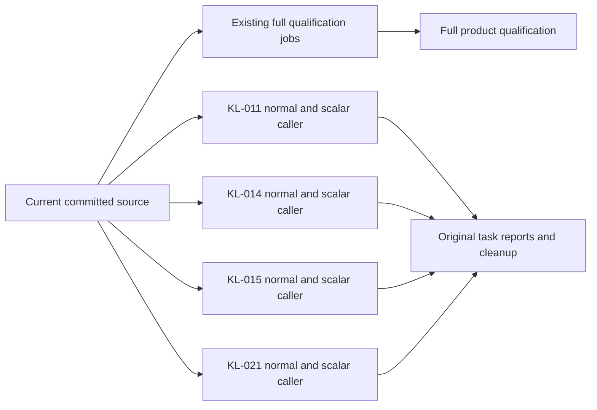
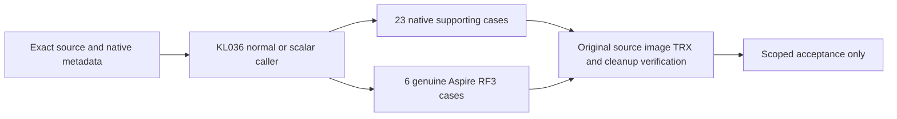
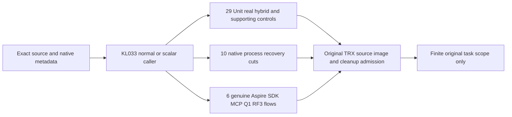
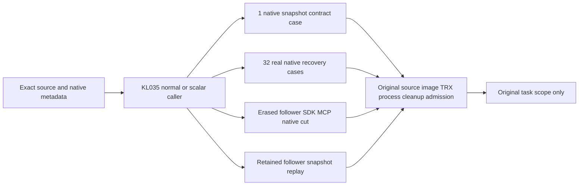

# ADR-117: Native TUnit CI entry

Status: Accepted; compilation and static verification passed, runtime qualification pending.

## Isolated measurements and heavy load scheduling (2026-10-09)

Owner clarification binds REQ/AC-TUNIT-ENTRY-013/014 in [NativeTUnitEntry](../Features/TestInfrastructure/NativeTUnitEntry.md). Ordinary independent cases retain the native 20-slot default and measured tuning up to 50. Comparison selections require one native test at a time and reject greater concurrency before startup; concurrent workload clients remain independently configured. Independent benchmark jobs keep their genuinely isolated Linux native topology and resources. Heavy functional ingestion/mixed-operation scenarios require a separate exclusive selection and no coverage contribution.

TASK-TUNIT-ISOLATED-MEASUREMENTS-013 freezes this policy before source edits: scheduling worker updates the Node selector and typed AppHost selection with real selection regressions; root owns direct ComparisonHost container/process one-test arguments, docs, final review, canonical build/format and original native regression outcomes. Read-only inventory review verifies native measurement workers and workflow isolation. No client workload, deadline, database format, API or provider change belongs to this scheduling stage. Rollback removes the source delta only; prior qualification gates and this owner requirement remain. Native 1/10/500-client million-record and mixed-load complete-flow qualification remains open until implemented and executed.

Owner correction 2026-10-07 supersedes ADR-074's outer AppHost test-runner entry. CI starts native TUnit after build. TUnit fixtures use DistributedApplicationTestingBuilder, await readiness, execute real C# SDK/official MCP/native comparison clients and dispose the owned Aspire applications. Unit and recovery suites do not acquire an unnecessary RF3 topology. Benchmarks remain in their separate pipeline. Native --output Detailed exposes original results during execution; no console-log file bridge or custom outcome counter is needed.

REQ-TUNIT-ENTRY-001: every CI suite and isolated benchmark workload invokes TUnit directly; infrastructure remains Aspire-owned within tests. AC-TUNIT-ENTRY-001: native command selections preserve project, filter, scalar environment, bounded parallelism, original TRX/coverage output and nonzero exit codes. AC-TUNIT-ENTRY-002: RF3 coverage preparation executes as a TUnit session lifecycle using the existing Aspire preparation resource, propagates its verified original manifest and policy, joins output and cleanup, and does not recursively launch a test runner. Existing real fixture and workload tests remain mandatory Linux acceptance evidence.

Stages: TASK-TUNIT-ENTRY-001 records this correction; TASK-TUNIT-ENTRY-002 updates scripts/Features/TestInfrastructure native selection and CI callers; TASK-TUNIT-ENTRY-003 moves RF3 coverage preparation into IntegrationTests Features/CodeQuality/Lifecycle and verifies compilation and command syntax. Root owns all joins; no delegated roles. Feature specification: [NativeTUnitEntry](../Features/TestInfrastructure/NativeTUnitEntry.md), ../Features/TestInfrastructure.md and ../Features/BenchmarkComparisons.md.

No package, storage, serialization, authentication, membership or workload contract changes. Existing AppHost model seams remain available to tests; their old CLI caller instructions are superseded. Rollback requires owner review because reinstating the outer caller contradicts the correction. Runtime tests and infrastructure must not be launched during this editing task at the owner's direction; static checks cannot establish runtime qualification.

TASK-TUNIT-ENTRY-004 replaces ComparisonHost's standalone Program with a native TUnit workload case and its existing C# client library. Aspire still owns the pinned load-generator container and WaitFor dependencies; the container runs TUnit with Detailed output and copies its bounded original TRX into the existing cell qualification artifact before deleting temporary report roots. Keep native TRX separate from website measurement JSON archives. This retains the isolated load-generator network/resource contract, rather than moving client execution onto a different machine. TUnit cancellation joins the existing bounded workload lifetime. Host process contract regressions pass their workload settings through configuration environment and retain native failure outcomes.

Current stage evidence: [NativeTUnitVerification](../Features/TestInfrastructure/NativeTUnitVerification.md). The existing status.json runtime gates remain unqualified; this editing stage cannot mark them passed.

TASK-TUNIT-ENTRY-005 implements REQ/AC-TUNIT-ENTRY-004 from NativeTUnitEntry by changing only the bounded aggregate `docker-rf3` job timeout from 60 to 180 minutes in `.github/workflows/build-and-tests.yml`. The complete same-image coverage cohort requires two full uninstrumented unit censuses, ten positive instrumented groups, native recovery/RF3 and strict descriptor/product admission, alongside the required RF3 suite and build. The observed unchanged local full unit census lasted 19 minutes 28 seconds; that failed development run informs scheduling and provides no acceptance or coverage evidence.

Stages are: freeze the linked requirement; join the workflow together with its source-bound native coverage producer and qualified unit inventory; parse the actual YAML/PowerShell; execute the original complete Linux job; retain all original exits, TRX, source/image hashes and coverage admission receipts. Root owns final integration and the agent's private workflow overlay. Every individual native deadline, bounded operation, coverage threshold, no-skip and fail-closed publication contract remains unchanged. Rollback removes the scheduling amendment and its overlay without admitting partial evidence. This amendment is Accepted, with complete Linux runtime qualification pending.

[ADR-119](ADR-119-tunit-owned-local-membership-image.md) defines the Accepted
REQ/AC-TUNIT-ENTRY-005 local membership prerequisite refinement. Native selection
passes arguments only; the TUnit case removes the recursive runner, executes the
existing Aspire image prerequisite, passes typed identity without environment
mutation, and joins final exact-tag cleanup after the actual six-silo wave. Root
freezes/joins; Luna prepares guarded source. Implementation and runtime pending.

TASK-TUNIT-EARLY-RF3-DIAGNOSTICS-008 implements REQ/AC-TUNIT-ENTRY-008 from NativeTUnitEntry. The original ordinary RF3 test step has a stable `rf3-required` identity. After its native process and fixture cleanup return with success or failure, portable native `find` checks the actual result directory without following links and requires an existing nonempty TRX; missing reports fail that check before upload. Authenticated Linux run37835972588 retained the original 130-case partial TRX but its prior `rg` check exited127 because that executable was absent. Replace that check without changing test outcomes. The existing pinned artifact action uploads unchanged `TestResults/rf3-required/**` plus the original prepared source/image receipts to a separately named `docker-rf3-original-diagnostics` artifact before covered discovery/execution starts. Root owns docs-first workflow integration and actual GitHub provenance verification; agents may diagnose their real failed cases from that authenticated original archive.

The diagnostic archive does not replace or admit the final `docker-rf3-qualification` artifact. Existing full suites, collector ownership, final source/image verification, descriptor/product admission, thresholds, deadlines, outcome/cleanup behavior and permissions remain unchanged. No report transformation, extra test runner or synthesized status is introduced. Rollout is the next normal workflow source revision; rollback removes only the diagnostic upload. Native workflow/source syntax review and original successful upload with exact API/archive digest verification are required evidence. Status remains Accepted with current Linux verification pending.

TASK-TUNIT-COVERED-SHUTDOWN-IDENTITY-009 implements NativeTUnitEntry REQ/AC-TUNIT-ENTRY-009 and existing REQ/AC-TEST-010/014/015 and REQ/AC-CQ-039/040/042. Before shutdown, IntegrationTests Features/CodeQuality/Lifecycle/NativeCoverageRf3FixtureOwner retains a bounded copy of the actual fixture-selected three container names alongside successfully verified running container/image identities. Features/ClusterReplication/Lifecycle/ClusterFixtureApplicationShutdown stops the actual application, then calls that same coverage owner without resolving services from the stopped application. The owner inspects the retained original names and exact original started identities under the existing absolute cleanup deadline. No alternative names, new process, duplicate application owner, ignored disposal error or inferred collector flush is admitted.

Ordered stages are the docs-first lifecycle contract, the two owning source changes, native solution build/format and current-source full covered RF3 verification with original artifacts. Root is the integration/compiler/Git owner; independent agents continue their feature scopes. The existing complete Q2 relational join and three join-budget SDK/official-MCP flows are the regressions, followed by unchanged full contributor/collector/descriptor/product merge gates. Original Linux run37821315110/attempt1/source3458 retains four failures from an IServiceProvider lookup after Stop. Rollout uses the next normal source/image cohort; rollback removes this paired lifecycle amendment, without any persisted-data or provider migration. Accepted; runtime qualification remains pending until genuine covered RF3 and exact-source checks pass.

TASK-TUNIT-PARALLEL-TASK-ACCEPTANCE-010 implements NativeTUnitEntry REQ/AC-TUNIT-ENTRY-010 after the owner's 2026-10-09 direction to run independent acceptance on GitHub concurrently. Add eight isolated Linux task/profile cells to the existing Build and Tests workflow, with no cross-task/full-suite dependency, no arbitrary concurrency cap and fail-fast disabled. Keep every existing full build, analyzer, unit/scalar, recovery, RF3 and coverage job. The exact KL-011/014/015/021 method/parameterized-case contract lives in `scripts/Features/CodeQuality/task-acceptance.contract.json`; these scoped artifacts cannot admit numeric product coverage or replace any complete suite.

Ordered stages: freeze this contract and the linked feature criteria; root prepares the canonical task inventory/workflow; session and security agents implement disjoint private native selection/discovery and original report admission files; root reviews and joins them, parses real YAML/PowerShell, commits the complete wave and pushes main; then owners authenticate and repair their exact-source Linux outcomes. Every cell prepares only the current genuine server image, compiles Release once, captures actual source/DLL/PDB identity, discovers its exact native selectors, executes complete native TUnit operations with Detailed output, verifies source/image after all children settle and joins its own image/fixture cleanup. Failed independent selectors do not suppress later selectors or become successful diagnostics; no retries, synthetic outcomes or skipped cases. Retain unchanged original census/process/TRX and image receipts with current GitHub run/attempt/SHA and pinned artifact uploads.

Keep existing 180-minute aggregate and 30/60-minute native selection budgets, actual fixture bounds and least privileges. Selected scopes are sequential, with 20 native TUnit slots for independently owned cases inside each scope under the owner's subsequent correction. True shared-resource exclusions require an invariant audit before removal. RF3 scalar cells cover the caller runtime only because the actual Docker server resources do not propagate `DOTNET_EnableHWIntrinsic`; never infer scalar server qualification. Dependencies are the existing native entry, actual test methods, current source/image producers and original native report contracts. Integration points are the root-owned task contract/workflow plus session-owned `task-acceptance.ps1` and security-owned `task-acceptance.verify.ps1`. Tests/evidence are every declared complete operation, exact discovery/TRX union, no skips, unchanged native identity and joined cleanup on the real committed Linux source. Rollout uses normal main push; rollback removes only additive task jobs/tooling, with no persisted-data migration or product contract change. Accepted; GitHub qualification pending.

The owner's subsequent 2026-10-09 clarification authorizes selected task-only iterations. A closed manual `task` input defaults to `all`; selecting KL-011, KL-014, KL-015 or KL-021 executes standard repository governance plus only that task's two cells. Default push/PR/manual-all preserves every full mandatory job and the full eight-cell task matrix. The workflow's actual executor input determines its scope; a focused green workflow cannot become full product or coverage evidence. No required final gate is bypassed. Root owns the bounded input/conditional join and source-bound review; task owners authenticate only their declared original outputs.

The native process helper's optional `ForwardToConsole=false` seam forwards each original admitted stdout/stderr chunk during execution from the existing owning reader, after capture under the same shared bound. Task selection enables it and removes post-exit duplicate writes; default callers remain unchanged. Console writer exceptions retain the original failure and enter existing tree/process/reader settlement. Session authors its guarded private `functional-coverage.native-merge.process.ps1` amendment; root joins after review and verifies real native output/exit/reader settlement. No parallel reader, custom counter, output rewrite or log-file polling bridge is introduced.

Before joining that helper, freeze its observed failure-settlement repair under the same REQ/AC-TUNIT-ENTRY-010: native tree termination precedes closing pending readers, by swapping only those existing owner actions. The genuine original overflow retained returned Dispose and Kill calls but a faulted stderr task and unjoined native exit; both original controls and initiating failures remain evidence. Repaired overflow and native-deadline flows must retain failed native exits and initiating errors, join and dispose every original owner, and complete a healthy Unicode stdout/stderr continuation using the same helper under unchanged bounds. Root reviews Session's actual before/after process originals; no internal runtime cause beyond observed states is asserted. Rollback of this amendment restores those two actions and forwarding behavior together; no product data or API changes.

Root also joins the source-provenance amendment to the four existing CodeQuality owners: shared, inventory, production-source-manifest and native-merge.files. A single closed case-sensitive predicate admits precisely the two task PowerShell files and their JSON contract; any other task-acceptance-prefixed name fails. Both native script producers and original-manifest admission reuse it, retaining the functional-coverage roster, `.dockerignore`, unchanged schema and all confinement/hash/reparse/output bounds. Security prepares the guarded private patch; root reviews and verifies actual source prepare/verify after the complete tooling join and before delivery. Task artifacts remain outside numeric coverage/product admission.

TASK-TUNIT-EMPTY-ORIGINAL-010 and TASK-TUNIT-ORIGINAL-REPRESENTATION-010 implement the original-admission contract under the same REQ/AC-TUNIT-ENTRY-010 and REQ/AC-CQ-039/040. Ordered stages: preserve the authentic fe8 failed jobs and original bytes; freeze the exact stream, environment and native-census versus TRX representations in NativeTUnitEntry; Security prepares a guarded private amendment to task-acceptance.ps1, task-acceptance.verify.ps1 and the existing functional-coverage.native-merge.trx.ps1; root reviews and joins those owners; exercise unchanged originals, strict altered-copy denials and healthy re-admission, then compile and deliver the coherent source for fresh Linux task execution. Zero-byte streams retain a non-null zero-length byte array, single results retain array cardinality, canonical class/method and exact instance bind separately, and both TRX definition/result displays must match the declared instance. Normal caller environment is truly absent, scalar is exactly 0, and the exact inherited state is restored. All bounds, source/image/UID/hash and complete case/outcome/counter/cleanup checks remain unchanged. No old job becomes passing through reinterpretation; the actual two failed scalar operations remain rejected. These are repairs to the existing tooling contract, with no new product boundary, persisted format, dependency or topology; rollback removes this coherent amendment without admitting partial evidence. Accepted; fresh exact-source Linux qualification remains required.

TASK-TUNIT-NATIVE-PARALLELISM-011 implements NativeTUnitEntry REQ/AC-TUNIT-ENTRY-011 after the owner's explicit request for 20 simultaneous tests inside TUnit. Root changes the native selector and centrally validated typed TestExecutionOptions default from8 to20, updates the existing whole selector operation regression, binds its actual unchanged case identities to the new source/PDB census and runs a coherent build plus focused independent operation batch with original timestamps. Task adapters pass20 rather than1. No native outcomes or concurrency percentages are synthesized. Original TRX start/end overlap demonstrates actual scheduling only for the executed independent batch; shared fixture/fault/global exporter invariants remain mandatory and blanket native exclusions need explicit source-backed audit. The existing64 supported ceiling and explicit invalid-limit rejection remain unchanged. Rollout is normal source delivery; rollback of the owner-required default needs explicit owner direction. No persisted-data, provider or product API changes. Accepted; exact native execution and Linux proof pending.

### TASK-TUNIT-KL021-ACCEPTANCE-012: complete current read authority scopes

REQ/AC-TUNIT-ENTRY-010/011 adds KL-021 to the closed adapter/verifier contract and manual task choice. Default push/PR/manual-all retains every full mandatory job and all eight isolated task/profile cells; manual KL-021 retains governance and its two normal/scalar-caller cells only. Existing task cases, strict native-null/scalar-0 environment restoration, original stream/TRX representations, source/DLL/PDB/current-image binding, native 20, original outcome/no-skip and joined cleanup gates remain unchanged.

Traceability is architecture KL-021, REQ/AC-SESSIONREAD-001..004 and REQ/AC-FOLLOWERREAD-001..005 in DocumentStorage, ClientApi and ClusterReplication; TASK-ISO-021/REQ/AC-REP-006 owns signed read/control separation, REQ/AC-REP-004 the existing bounded native read deadline, REQ/AC-REP-001/002 terminal endpoint admission and REQ/AC-CRS-002/005 compatible-majority admission. ADR-017/036/082 retain their existing read/token/identity/cohort contracts; ADR-117 owns only this additive acceptance orchestration.

The exact contract contains twelve selectors and 113 cases per caller profile: 57 Unit (54 existing functional and 3 required ordinary controls),26 independently stored native quorum/protocol cases in the Recovery project, and30 genuine Aspire RF3 cases. Unit scopes retain 6 session-cut cases, 17 functional follower document flows, 2 ordinary follower schema controls, 29 signed probe/header/control cases including 1 ordinary stable-ordinal control, the configured read deadline, closed endpoint ReadBarrier refusal and stopped-socket majority refusal followed by healthy re-admission. The stored 26 cover actual elected 1/2/3-voter data/control cuts, malformed native authority and cancellation; they do not claim process-crash recovery. RF3 retains the full failover/minimum/invalid-token/persisted-deny-restoration flow and reachable former-leader null/original/new-minimum refusal matrix, plus all 28 follower cases across direct SDK, official MCP, Q1 SDK and Q1 official MCP. Five complete follower method selectors preserve held literal cuts, fresh credential/grant/field authority, lag/cancellation and actual lost-quorum restoration under unchanged 60-minute selection deadlines.

Root grants an immutable coherent DLL/PDB image for original native discovery; exact canonical class, native constructor display, method, parameterized instance, parameter types, UID and source range bind every declared case. Authored counts and source review are not operation outcomes. Preserve the existing 180-minute job bound, native 30/60-minute selection deadlines, original fixture bounds and genuine shared-resource exclusions. Scalar qualifies caller/in-process execution only, not unchanged Docker server intrinsics. Initial follower-document qualification leaves Q1 SELECT/AST and broader model/projection stale reads explicitly open.

Ordered stages: freeze this trace; privately compose the six owning docs/ADR/workflow/adapter/verifier/contract paths from the current guarded base, preserving pending owner joins; bind fresh native discovery and source/image receipts; root reviews syntax and unchanged full jobs, joins and commits/pushes; the task owner authenticates the two fresh Linux artifacts and repairs actual complete-flow failures. Retain original failed cohorts. No report rewriting, retry, deadline increase, classification/group change, product coverage promotion or production-readiness claim. Rollback removes only this additive KL-021 scope and its two cells; no persisted-data, public API, storage, package or production topology change. Status: Accepted implementation contract; exact-source Linux qualification pending.

## Exact storage and vector task lanes

TASK-KL008-EXACT-NATIVE-ACCEPTANCE-003 / AC-KL008-NATIVE-001 and TASK-KL027-EXACT-NATIVE-ACCEPTANCE-001 / AC-KL027-NATIVE-001/002 extend the existing exact-source native task matrix with two additional closed task identities. Root freezes their feature maps, derives case/parameter/source identities from actual unfiltered built metadata, joins the bounded adapter/verifier allowlist and existing workflow, verifies native discovery and the complete original source/receipt/exit/reader/disposal flows, then commits/pushes for Linux qualification. All existing four task lanes, full suites, error/cleanup/source/byte admission and limits remain mandatory. Each normal/scalar cell uses its own runner and TUnit limit20, without max-parallel serialization. KL008's27 unit operations need genuine local storage/CrashHost but no Docker image/topology; only that explicitly unit-only cell skips Docker check/image/configuration, preserving independent full RF3 jobs. KL027 retains27 units plus four SDK/MCP/shared-SQL RF3 flows with fresh owned image/readiness/registry cleanup; scalar describes its actual caller environment. Original artifacts remain independently verified and source-bound. No database format, new transport, topology weakening or qualification bypass belongs to this addition. Rollback restores the coherent six-task adapter/verifier/contract/workflow inventory while retaining every original result; an unqualified lane remains open in status.

## Native MCP initialization observation (2026-10-09)

TASK-MCP-INIT-OBSERVATION-001 / REQ-MCP-INIT-OBSERVATION-001 / AC-MCP-INIT-OBSERVATION-001 retain an original failed official SDK Initialize and its unchanged pinned2026-07-28 protocol, token and deadlines. ClientApi Integration Helpers/McpOfficialClient and McpCallerHttp own a passive DelegatingHandler over the same public default IHttpMessageHandlerFactory chain and HttpClientFactoryOptions.HttpClientActions in native order used by Aspire CreateHttpClient, with the actual Aspire GetEndpoint discovery. Diagnostics/McpInitializeHttpObservation owns at most eight closed HTTP observations during Initialize only: HTTP method category, actual numeric response status, send/response completion and cancellation flags, and safe exception category. It reads no headers, request/response content, caller values or inventories; responses and tokens pass unchanged. The caller emits the bounded original sequence through Console.Error plus ServerFailureObserver before rethrow, retaining diagnostic and cleanup failures. Native owned resource evidence retains topology identity; this record maps only known node names or Other. No retry, version fallback, timeout increase, product transport or storage change is authorized.

Ordered implementation is this contract, the passive HTTP/helper delta, root native build/format, existing AcMcp003UnsupportedOfficialProtocolRejectsThenCurrentCallerExecutes failed-initialize followed by two healthy native MCP executions, AcMcp005CancelledNativeReadDoesNotPreventTheNextRealCall and the original failing HeldPrivateDocumentRechecksPersistedAuthorityThenRestoredCallerResumes whole flow and fresh Linux RF3 original reports. Source ownership remains private until guarded root join; root alone compiles and delivers. Rollback removes this observation delta with no data migration. Exact023 failure remains unqualified: its SDK discarded the initiating RPC/HTTP/probe exception. Status observations cannot independently classify JSON-RPC error versus successful-status discover-probe timeout without payload access, which remains prohibited. Success disables recording; later calls are unchanged. No synthetic/parser-only cases replace real caller flows, no coverage promotion.

## Scoped KL-036 native Linux acceptance lane (2026-10-09)

TASK-KL036-EXACT-NATIVE-ACCEPTANCE-001 / REQ-KL036-NATIVE-ACCEPTANCE-001 / AC-KL036-NATIVE-ACCEPTANCE-001 add KL-036 to the same closed native task matrix and manual selector. This is scoped public-parent/supporting acceptance, never whole KL-036/product/fullsuite/coverage qualification. Existing task identities KL008/011/014/015/021/027, default full suites, scalar/recovery/RF3 and all artifact/provenance/image/cleanup gates remain mandatory. Five selections contain29 declared cases per profile:20 existing source-mapped supporting instances,3 complete native encoded type-frame flows, and6 genuine Aspire-owned public-parent RF3 flows across PublicParentFlowTests(1), ExpiredRetireCancellationRf3Tests(4), ParentCapacityRf3Tests(1). The UTF8/UTF16 native fingerprint method retains its three actual Int32 boundary instances0/1/2. Framing is supporting registered generated-command/counter framing, malformed native-version refusal then exact healthy complete-payload continuation and concurrent native sessions/canceled admission; it is not a separate product capability.

Root must supply fresh original native filtered metadata and PE/PDB/source bindings before final contract admission. Class/method/parameter/native display/instance/UID/source identity, exact union/no skip/no duplicate/no extra, unmodified original TRX and counters, original source/image before-after and settled native process/registry/resource cleanup remain unchanged. Source-declared counts are not executed or discovered evidence. Linux normal/scalar cells use separate GitHub runners and the existing server-only image producer, exact source/run/attempt/image receipt, native MaximumParallelTests20 and preserved NotInParallel shared-resource protections. Scalar describes only the caller environment; no scalar server assumption is invented. Existing unit30m/RF3 selection60m and180m job limits are unchanged. Failure retains authentic reports and blocks qualification; no omission, retry, fallback, custom runner or extra workflow is introduced.

Supporting cases retain real persisted caller-stamped/wrong-stage denials, cold unknown/prepared-winner cancellation, raw scope/read reservations and release/deadline isolation, authenticated Capture/fullmodel/receipt cold replay, native canonical fingerprint and actual Orleans context restoration/concurrency/disposal. Public RF3 preserves linked models and SDK/official MCP/Q1 receipts across two genuine RF3 owners/cold replay; original cancellation own-outcome/lost-reply/unknown charged refusal/distinct cleanup generation; same-token sealed expiry only Cancelled/no-effect; actual cold-corrupt disposition refusal followed by exact fixture-owned database+replica restoration and healthy continuation; configured capture-shape/grant bound denial and restoration. Independent same-seal MissingAuthority remains OPEN, as do native future embedded SafeDetail upper-bound and exact operational pre-admission+1 criteria. No selected flow can close those unqualified gates or substitute fixture reset for production recovery/power-loss proof.

Traceability preserves existing PartitionTransfer/ADR106 public-parent/cancellation/disposition contracts and ResourceExecution scoped-grant requirements; this additive execution orchestration uses ADR117 and REQ/AC-TUNIT-ENTRY-010. Ordered stages: docs-first scope, private exact contract/validator/workflow change, root fresh build/native discovery identity comparison, unchanged source/image/process checks, commit/push and authenticate each task-acceptance-KL-036-normal/scalar original artifact source/run/attempt/API+ZIP digest before any acceptance claim. Root owns live docs/workflow/compiler/Git joins; security owner repairs scoped infrastructure and harvests these dedicated original outcomes, Movement/Session own whole parent implementation. Rollback removes only the additive KL036 dispatch/contract entry while retaining originals and all prior lanes; there is no data/protocol migration.

### TASK-SDK-KESTREL-FAILURE-OBSERVATION-001
REQ-TUNIT-KESTREL-OBSERVATION-001 / AC-TUNIT-KESTREL-OBSERVATION-001 under ADR-117 and existing ClientApi transport requirements freeze test-only bounded observations for the authentic eb0 five failures: KeyLoadClientNullReadTests.AllNativeAbsentReadsRemainSuccessfulBeforeUnavailableStatusAndFullHealthyContinuation (two existing arguments), KeyLoadClientNullWriteTests.UnavailableSuccessfulWriteBodyRetainsUnknownOutcomeStableRetryAndNullableReads (two existing arguments), and KeyLoadClientTransportTests.MidBodyCancellationMapsReadFailureAndClientCanSendNextRequest. Actual Kestrel start/send/handler/response completion/cancellation records carry only closed stages/status/category and actual monotonic elapsed, ThreadPool available worker/IO threads, pending work and native thread count. At most64 records, saturation explicit. No URL/path/header/body/credential/payload/caller value is inspected or emitted.
The existing ephemeral loopback Kestrel/default native HTTP handler chain, actual client/request tokens, five-second bounds, full original negative-to-healthy assertions and cleanup remain unchanged. The optional observation is passed only by these flows; no extra request, warmup, retry, timer, NotInParallel or product/config change. On actual failure only, emit closed JSON to original native stderr before rethrowing the initiating exception; diagnostic-output failures join that same ordered ledger. Success emits nothing. This reveals observed stages only; it cannot infer thread-pool starvation or socket/JIT causation. Root owns guarded join/build and exact Linux normal/scalar original TRX/output qualification. No helper-only test or synthetic outcome qualifies the contract.

### TASK-KL033-NATIVE-TASK-ACCEPTANCE-001

Accepted additive execution scope under existing REQ/AC-TUNIT-ENTRY-010: [Search](../Features/Search.md#task-kl033-native-task-acceptance-001-original-finite-hybrid-rank-and-explain) freezes all three original finite KL033 predicates and [TestInfrastructure](../Features/TestInfrastructure.md#task-kl033-native-task-acceptance-001) owns unchanged native admission. Actual R863 filtered native metadata binds29 Unit,10 supporting process Recovery and6 genuine RF3 cases per profile. Exact raw class/method/instance/parameter/source identities enter the canonical contract, with original native UID/location/source/assembly observations retained as evidence; source declarations alone are never native case proof.

No topology, provider, ranking, authentication, storage, wire, deadline or parallelism change: retain native20, independent Linux normal/scalar cells, caller-only scalar RF3, existing source/image/TRX/no-skip/no-extra/process/cleanup guards and all prior task/full mandatory jobs. Root owns shared seven-path docs/contract/selectors/workflow join and verification; security owner privately maps actual identities and owns dedicated original artifact harvest. No dependency/KL074/global ANN/performance/full-product closure follows. ADR018 remains Proposed for broader global ranking. Rollback removes only additive dispatch scope; originals and existing lanes remain. Linux source-bound operation qualification is pending.

### TASK-KL035-NATIVE-TASK-ACCEPTANCE-001

Accepted additive native orchestration under unchanged REQ/AC-TUNIT-ENTRY-010: [ClusterReplication](../Features/ClusterReplication.md#task-kl035-native-task-acceptance-001-complete-original-snapshot-installation) retains every original KL035 predicate and [TestInfrastructure](../Features/TestInfrastructure.md#task-kl035-native-task-acceptance-001) owns admission. Root's four actual R863 native censuses bind1 Unit,32 Recovery and2 genuine RF3 cases per profile, with raw UIDs/displays/typed parameters/source locations/process/source-image identity preserved. Canonical contract does not fabricate an instance or outcome from authored arguments.

Append KL035 to existing independent normal/scalar Linux task cells/manual choice while preserving all eight prior tasks including KL033/KL036 and complete mandatory suites. Unchanged native20/deadlines/source-image/original TRX/process/cleanup checks apply. Actual empty follower SDK/official MCP state and stopped native checksum/hardstate/tail are independent of retained-follower operation. Source metadata and local supporting execution do not prove Linux RF3. Scalar RF3 remains caller-only.

Root owns seven shared docs/contract/selectors/workflow paths, build/format/Git and final original evidence review; security owner prepares guarded exact binding and dedicated artifact harvest. Original replica/storage/lifecycle ADR035/036/017/041/061 contracts stay authoritative. No protocol/data/provider/topology migration or requirement weakening. Rollback removes only additive lane and keeps immutable evidence/prior tasks. Process kill is not power-loss/endurance/performance or full-product closure. Delivered-source Linux acceptance remains pending.

### TASK-KL029-NATIVE-TASK-ACCEPTANCE-001

REQ/AC-TUNIT-ENTRY-010 and REQ/AC-FTS-001–007,
REQ/AC-FTS-INCREMENTAL-001–005/007 and REQ/AC-FTS-INC-009–017
retain the original KL029 architecture predicates: projection deletion plus
canonical replay returns literal results, checkpoint crashes cannot conceal
updates, and stale revisions cannot resurrect. Add only KL-029 normal and
scalar-caller cells to the closed native task matrix/manual choice. Preserve
all nine prior tasks, full mandatory build/rules/unit normal/scalar/recovery/RF3
coverage gates, original source-image identity/admission, native20 slots,
Detailed live output, strict caller environment, retained failure/no-skip checks
and genuine joined Aspire cleanup. Scoped task receipts never replace full
suites or supply coverage/provider/performance/endurance/power-loss evidence.

Three exact closed selectors cover the source-authored58 Unit instances
(including damaged durable original intent and natural original-token expiry),
18 genuine process Recovery instances (ten full-generation and eight incremental,
including all seven required cuts plus retained generic posting control), and
nine genuine RF3 instances (SDK, official MCP and Q1 maintenance paths, persisted
row/field/revocation/read-cut, leader loss/restart, cancellation and healthy
continuation). Source counts/displays/constructor expectations are not native
discovery proof. Root must freshly bind every exact UID, method, instance, typed
parameter, primary-constructor reported class, source span/hash and assembly/PDB
against the final coherent image before the canonical contract is admitted.

The natural expiry flow retains unchanged default five-minute lifetime and
original cancellation, actual signed ExpiresAt, original durable intent/failed
ACK and canonical pin/outbox/documents, then genuine Release and distinct fresh
consumer/native generation Build with full literal bilingual/cold continuation.
Keep thirty-minute Unit/Recovery and sixty-minute RF3 native deadlines unchanged;
scalar means actual caller DOTNET_EnableHWIntrinsic=0, never unproved server mode.

Ordered stages: freeze this complete source scope; prepare guarded additive
contract/closed enums/workflow; root coherent build and actual selected metadata;
strict bind/reseal, root join/commit/push; authenticate both original Linux task
artifacts API/ZIP/source/run/attempt/native TRX/images/environment/readers/cleanup
and every final verifier conclusion. Missing/failed/skipped/changed originals
retain failure. Root owns live source, discovery/build/workflow/Git; Session owns
whole KL029 operation review and dedicated original evidence. Rollback removes
only the additive KL029 lane, preserving every prior task and immutable report.
No data, serializer, public transport, provider or topology migration occurs.

Actual R875 coherent-image metadata originals now contain exactly 58 Unit,
18 Recovery and nine RF3 cases for these three closed selectors. The owning
receipt and eleven-task census plan retain original native process/source/PE/PDB
before-after evidence. Strict native case admission remains required; metadata
is not an execution, coverage, Linux RF3 or task-acceptance result.

## TASK-KL036-NATIVE-SUPPORT-LANE-034 — additive exact two-flow selection

REQ/AC-TUNIT-ENTRY-010 and existing REQ/AC-MOVE-PARENT-LATE-NATIVE-001 plus signed native heartbeat requirements map two actual native-discovered supporting cases to additive KL036 selections. Preserve every entire original task object, all six original KL036 selections and their32 cases. Add `native-owner-late-retire-support` (Integration assembly, suite rf3, one case) and `unit-signed-heartbeat-support` (Unit assembly, one case), giving eight selections/34 cases per normal/scalar profile. The former uses actual six in-process native production owners/SAME factory-sealed operation/ApplyEmbedded; the suite token chooses its existing Integration assembly and never claims Docker RF3 quorum qualification. The latter uses actual persisted native store and signed production client/HTTP/endpoint/table flow, not a six-owner topology. Every mandatory full Unit normal/scalar, recovery/analyzer and genuine Docker/Aspire SDK/MCP RF3 gate remains independent and unchanged.

Exact native originals are r872 late-native (one discovered case) and heartbeat (three discovered cases, selecting ONLY the signed flow). Late UID is `KeyLoad.IntegrationTests.Features.ClusterRouting.PartitionMovementLateNativeOwnerTests.1.1.SameFactorySealedExpiredRetireColdRecordsMissingAuthorityThenSameMoveAndOriginalReceiptAreHealthy.1.1.0`; signed heartbeat UID is `KeyLoad.UnitTests.Features.ClusterRouting.ReplicaMembershipAuthorityHeartbeatFlowTests.1.1.NativeSignedHeartbeatPreservesFullRowRejectsWrongCallerThenHealthyContinuation.1.1.0`. Both parameterTypeFullNames arrays are empty and instance display equals exact method. Original census stdout hashes are54ad9b1baf368fe4d7a9a613007380c03fda010c6119f2ad0bb52dbfec4f7d7e anddeb40e1edee7b1d4e85c80a56cdb7d21c9dda23c5cbedc9b318492574b58961e. These are metadata originals, not runtime outcomes or current rebuilt image authority. Contract metadata retains the existing closed schema; native UID/image/source/PDB rebind remains required after full C# joins.

Both filters use exactly one four-segment native TUnit path; alternatives are never additional path segments. No verifier/key/default/parallel/child/deadline change: native20 cap, workflow180 minutes, discovery1800 seconds, Integration3600-second child bounds, actual supporting parent12-minute case deadline and original90s process/30s cleanup/60s grant contracts remain intact. HistoricalR875 actual eleven-task plan and distinct input-plan hashes are never interchanged or rewritten as proof for these additions. Ordered delivery: docs/traceability freeze→exact additive contract+private original metadata map→root source review/join/fullbuild/native census/strict rebind→actual normal/scalar operations→authenticate originals. No PASS/coverage/product readiness claim from selection or discovery.

## TASK-KL035-COMPLETE-SNAPSHOT-ADMISSION-002

REQ/AC-REP-004 and REQ/AC-TUNIT-ENTRY-010 preserve every original KL035 criterion and all35 prior native case objects. Actual root R883 metadata (native0,14 cases,5742 source inputs/437 image inputs, zero drift; stdout SHA02891a853fc6bda7bf31d7d500de9b8b38587360689e895268de85d3c9066fd2) identifies two distinct omitted classes: ReplicaSnapshotRecoveryTests in ReplicaPersistenceTests.cs and ReplicaSnapshotProcessRecoveryTests in ReplicaProcessRecoveryTests.cs. Their14 exact typed native identities are added to the existing Recovery selection. The complete lane is49/profile:1 Unit+46 Recovery+2 actual Aspire Docker RF3. This is metadata admission, never an outcome claim. Existing historical35 binding and every other task/full suite remain unchanged. The neighboring class names in the earlier table did not admit these separate classes.

AC-KL035-PUBLISHED-REPAIR-001 strengthens the SAME four PublishedImageDamageFailsClosedAndPreservesNewerCanonicalState native process rows (SnapshotVerified/Installed × missing/corrupt): retain the genuine published immutable image within the stopped trial, preserve exact original missing/corrupt failure and newer native canonical cut/NodeId/read generation/full receipt. After the original node is disposed, restore only that exact image, cold recover original snapshot4+tail5 and stable original receipts, submit an independently literal new revision5/cut6 native command through the real log/materializer, require its full original receipt and exact retry without another store position, then cold reopen and verify healthy result/old outcomes again. No fabricated receipt, replacement snapshot, recovery fallback, token/deadline change or product behavior. The helper owns assertions for this actual case, not a standalone test.

AC-KL035-PUBLISHED-REPAIR-001 maps to those four existing cases and feature-local ReplicaSnapshotDamageRecovery. Existing node/materializer observed-owner helpers join primary and cleanup failures before trial files are removed. Fixture exact-image repair is not production repair from missing/corrupt bytes. Root must compile, refresh changed-source native metadata/PDB binding, execute actual operations and authenticate delivered-source Linux normal/scalar exact49 union/source-image/TRX/cleanup before acceptance. Original full-suite556 rows and R883 metadata are retained independently; no current PASS, power-loss, endurance, coverage or whole-product promotion.

## TASK-KL036-COMPLETE-SOURCE-ADMISSION-001 — native Linux expectations

The KL-036 selected scope preserves every original34 case declaration and adds the real operational capacity, retained native-page failure and original Close/SourceBeginAbort whole flows, for37 source-declared cases per profile. ADR-106 owns their REQ/AC and execution contracts; ADR-117 owns native invocation and original-report reconciliation. This is an admission expectation, not discovered UID/count or a passing result. Exact-source Linux native discovery, normal/scalar execution and all mandatory full suites remain open. The other nine task objects and all original selectors/case declarations remain intact.
