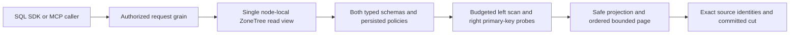

# ADR-118: bounded typed-row INNER JOIN

Status: Source joined with local native operation evidence; public RF3, complete negative inventory and original Linux qualification pending. Date: 2026-10-07. Owner: QueryExecution integration owner. This is a first operator slice under existing REQ-REL-004 and REQ-QUERY-007; it does not close either requirement or the full SQL workstream.

## Product boundary

Implement one read-only SQL INNER JOIN for two typed relational Collection resources inside the single PartitionRef already present in a query request. The left relation is an explicitly opted-in bounded collection scan. For each visible left row, the executor probes the right relation by its declared non-null Text primary key through the existing canonical document key. The left join column must also be declared Text. The right source column in ON must be exactly the right table's declared primary-key column. This is a primary-key indexed nested-loop join; it does not require a new secondary index encoding or another storage engine.

Accepted exact form (aliases and projected names are identifiers, values are data, and this first form has no WHERE):

    SELECT l.order_id AS order_id, r.id AS customer_id, l.total AS total
    FROM orders AS l INNER JOIN customers AS r ON l.customer_id = r.id
    ORDER BY l.order_id ASC LIMIT 100

The left ORDER BY path must equal the left schema primary key and be ascending. The executor orders the bounded result with ordinal string comparison on that key; it MUST NOT assume ZoneTree/KeyCodec byte order equals SQL string order. Since each left primary key is unique and each right primary-key probe returns at most one visible row, the ordering has no ties. LIMIT uses the existing query limit validation/default and is applied after deterministic ordering. AllowFullScan=true is mandatory because the left source is scanned. Existing MaxScanRecords, MaxQueryReadBytes, QueryDeadlineSeconds, MaxResults, MaxBatchBytes, MaxQueryBytes, token/depth, and concurrent-query admission remain the only knobs; add no join-specific default/cap.

Only two different collection names, two distinct identifier aliases, one INNER JOIN, one equality predicate, explicit non-star projection, unique output aliases, one primary-key ascending order term and the existing bounded limit are admitted. Projection is top-level declared relational columns only. Join key values compare only as exact text: no cast, collation override, normalization, expression, or implicit coercion. A missing/null left join key and an unmatched key produce no pair, as required for an inner equality join. Tombstoned or row-denied records never produce output. Reject LEFT/RIGHT/FULL/CROSS, comma joins, self-join, multiple joins, WHERE, GROUP BY, aggregation, subquery, USING/NATURAL, non-PK right key, non-text key, SELECT *, duplicate aliases, descending/non-PK ordering, EXPLAIN, model/event/queue sources, and any cursor explicitly before storage scanning. Rejection is a fixed safe UnsupportedCapability or Validation outcome according to the existing parser/validation category; never fall back to client evaluation or a broader scan.

## Versioned request, AST, and result shape

Keep unified SQL envelope SqlOperationProtocol.Version=1, existing Q1 scalar SQL, AST1, routes, operation names, and all existing field numbers/aliases intact. Add explicit query-language selection:

- Append QueryDialectVersion (native field ID 5, default 1) to QueryRequest; value 1 preserves Q1 and value 2 opts into the closed Q2 subset.
- Append QueryDialectVersion (native field ID 6, default 1) to SqlOperationRequest; its existing outer envelope Version field ID 5 remains 1. The server SQL compiler forwards this value to the canonical QueryRequest.
- Add the optional typed InnerJoin member as native field ID 8 on SelectQuery. Q1/AST1 require it to be absent. Q2 join AST requests use AstVersion=2; AST1 remains unchanged and rejects join metadata. Q2 is the explicit superset for Q1 plus this single operator, not a promise of complete SQL.
- Add source-alias fields only additively: Selection.SourceAlias at ID 2; the join clause stores right collection/right alias/left key path/right key path. Existing selection IDs 0–1, SelectQuery IDs 0–7, and all existing serialized contracts stay unchanged. Add a stable alias for the new join contract in NativeContractAliases; never repurpose or renumber an alias/field.
- Add QueryDialectVersion=2 / a stable Q2.InnerJoin.v1 capability profile to the existing capability manifest. Existing Q1 adapters and every prior capability stay present. Capability/schema tests prove Q1 is unchanged, Q2 is explicit, and unsupported version/shape fails closed.
- Preserve QueryPage and QueryRow existing fields/IDs. Append QueryRow.Sources at native field ID 5, null/omitted on every existing Q1 row. Add a generated aliased QueryRowSource value containing exact source alias, entity ID, and revision. A Q2 pair row keeps EntityId and Revision as the left row's identity and includes exactly two Sources entries in declaration order (l, then r) so the pair is unambiguous. Json is a flat JSON object containing only explicitly projected output aliases; duplicate aliases reject before scan. Redacted is true if either source projection redacted fields; RedactedFields uses source-qualified paths such as l.ssn and r.ssn. QueryPage.CutPosition is the cut captured inside the owning view; AccessPath is a stable bounded-primary-key-join profile; Cursor is always null and any supplied cursor rejects.

The exact current HTTP/SDK query response and official MCP keyload_query_execute / keyload_sql_execute result must serialize the same QueryPage/QueryRow shape. No new route, dispatcher, grain, caller role, SQL protocol claim, or private extension result is introduced.

## Read, authority, execution, and resource contract

QueryEngine continues to admit the operation once through its existing query concurrency governor and construct one ReadExecutionBudget from the request cancellation token and existing DatabaseLimits. It calls existing DatabaseEngine.WithQueryView for the left collection; inside that single Store.Read view it loads the persisted principal and left resource, then requires Capability.Query | Capability.DocumentsRead for the right collection and resolves it with DatabaseEngine.Resource(view, partition, name, ResourceKind.Collection). Both resource resolutions validate transaction-domain equality. Both persisted relational schemas and the typed key declarations, all query-field-use requirements (including both join keys and the order field), and input/projection aliases are validated before the first document scan or point read. Client-supplied roles have no effect.

The executor scans only the canonical left collection prefix from DocumentStorageKeys.Prefix through the existing view and shared read budget. It counts every delivered left storage record (including deleted/row-hidden records) as scan work. For each live row that passes Authorization.CanReadRow, it charges one additional join-probe work unit before the right primary-key lookup. Total delivered left records plus attempted right probes cannot exceed configured MaxScanRecords; range lookahead is separately byte-charged by the native view and any HasMore beyond the allowed left scan rejects with BudgetExceeded. Each right read uses DocumentStorageKeys.RecordKey plus ReadExecutionBudget.ReadRecord<DocumentRecord> so bytes are charged before decode. No result is disclosed unless both left and right records pass their persisted row ACLs.

Both rows are projected using the existing DatabaseEngine.Project(principal, resource, row) on that same view before the selected values are assembled. This preserves per-resource field redaction and canonical JSON; the output assembler qualifies redaction metadata by alias and never returns a raw unprojected row. Sorting stores at most the configured scan/work maximum in memory, compares left primary-key strings ordinally, and checks cancellation/deadline at each scan/probe/sort/projection phase. Exact serialized page bytes, including source identities and redaction metadata, are checked with existing ReadExecutionBudget.CheckResult / MaxBatchBytes; raw store bytes are charged against MaxQueryReadBytes. No streaming/materialization beyond the existing bounded page, no hidden retry, no second read cut, and no work after the read callback.

The page cut is captured from database.Store.Position inside the same WithQueryView callback before reads; because all rows and resource metadata are read under one native Store.Read gate, the result is one local committed cut. This does not claim a cross-node global snapshot or power-loss durability. The normal replication/read actor continues to own placement and RF3 acknowledgements; the join adds no cross-partition reads and does not bypass one grain per request.

## Stable criteria under existing requirements

These are subcriteria for existing REQs, not new product REQs:

- AC-REL-004-JOIN-001: exact Q2/AST2 positive shape compiles; Q1/AST1 and all unsupported join variants preserve their existing behavior and reject unsupported inputs before storage access.
- AC-REL-004-JOIN-002: same-partition typed-row join returns only exact text-key matches, ordered by ordinal left primary key, with explicit output aliases and exact Sources identity metadata; null/missing/unmatched, deleted, and row-denied cases emit no pair.
- AC-REL-004-JOIN-003: persisted Query/DocumentRead, both resource transaction domains, both row ACLs, both join-key field-use policies, safe projection/redaction, and no-disclosure error behavior are demonstrated with real persisted policy.
- AC-REL-004-JOIN-004: cumulative scan/probe, raw-byte, deadline/cancellation, result count, and serialized result-byte ceilings fail closed at boundary and boundary+1 using the already validated configuration; no new defaults or unbounded candidate retention.
- AC-REL-004-JOIN-005: SQL/AST capability manifests, native serialization, HTTP SDK, and official MCP expose the same explicit versioned result and keep every Q1 contract/output unchanged.
- AC-REL-004-JOIN-006: actual whole-operation RF3 SDK + official MCP read-after-write flow, denial/error with unchanged persisted rows, successful healthy follow-up, and recovery/reopen result are verified. Exact-source Linux qualification remains pending until authentic artifacts exist.
- AC-QUERY-007-JOIN-001: declares the supported Q2/AST2 operator and exact unsupported cases; no silent client evaluation, partial/cross-shard execution, cursor, or global snapshot claim.
- AC-QUERY-007-JOIN-002: real QueryEngine and public callers prove the single persisted authorized read cut, deterministic pair order, exact source identity/redaction, cancellation, work/byte/result bounds, and safe failure behavior.

An integration test must seed both schemas and rows through real SDK commits, read through SDK plus official MCP, compare exact Rows, Sources, AccessPath and JSON, and assert each cut is at/after the seed commit. A deterministic concurrent RF3 scenario uses one atomic command to move a left reference and update the matched right generation; every observed join must show one consistent generation pair. Persisted identities lacking right Query/DocumentRead or field-use permission must be rejected without disclosing values, and an administrator query afterward must return the original expected rows. Unit cases use real ZoneTree and test actual store close/reopen; the RF3 suite reopens by its owning test fixture/process recovery flow only if that exact scenario is supported by existing harness, otherwise keep reopen evidence in the real ZoneTree unit flow and report RF3 process restart as a separate gate. Negative budget, denial, malformed-input and cancellation flows are read-only, assert exact existing error categories and no persisted state change, then run a healthy query.

## Deliberately open scope

This stage does not implement or qualify arbitrary/multiple joins, self-joins, non-primary right indexes, cross-partition or federated joins, outer/cross joins, filters on joined sources, derived tables/subqueries, aggregate/group/window expressions, DML, foreign keys, checks, defaults, cascades, constraint deferral, distributed snapshots, resumable join cursors, generalized typed AST predicates over source aliases, full SQL grammar, PostgreSQL wire protocol, or a standard SQL client connection protocol. These remain required product work; they need their own bounded contracts/ADRs and measurements. REQ-REL-004, REQ-QUERY-007, full SQL syntax and native protocol remain open after this slice. Do not update status to Implemented or advertise full SQL.

## Ordered implementation ownership

1. TASK-REL-004-INNER-JOIN-001 — freeze this ADR and update only current owning RelationalStorage.md / QueryExecution.md requirement mappings. Root owns shared public/transport joins.
2. TASK-REL-004-INNER-JOIN-002 — Abstractions owns src/KeyLoad.Abstractions/Features/QueryExecution/Contracts/QueryAst.cs, new InnerJoinClause.cs, QueryRequest.cs, SqlOperationContracts.cs, QueryRow.cs, new QueryRowSource.cs, NativeContractAliases.cs, and Query capability manifest contracts. It appends field IDs only, with Q1/AST1 golden serialization tests.
3. TASK-REL-004-INNER-JOIN-003 — Query owns src/KeyLoad.Query/Features/QueryExecution/Execution/SqlParser.cs, SqlSyntax.cs, SqlTokenizer.cs only if needed, Validation/QueryValidation.cs, Validation/QueryFieldAuthorization.cs, Contracts/QueryCapabilityCatalog.cs, Queries/QueryEngine.cs, and new Queries/RelationalInnerJoinExecutor.cs plus Execution/RelationalJoinProjection.cs. Core remains the only storage/index authority; call its existing DatabaseEngine.Resource, Authorization, Project, ReadExecutionBudget, and canonical DocumentStorageKeys APIs. No Core storage mutation or copied key codec/index writer.
4. TASK-REL-004-INNER-JOIN-004 — Server/API owner updates src/KeyLoad.Server/Features/QueryExecution/Queries/SqlOperationCompiler.cs to forward dialect version. Existing QueryApi, GrainQueryReadCapabilities, route, SDK send path, MCP query operation and official SDK registration remain the same unless source review proves an actual typed route join is needed; any expansion requires exact new guards before coding.
5. TASK-REL-004-INNER-JOIN-005 — Unit owner adds tests/KeyLoad.UnitTests/Features/QueryExecution/Cases/SqlInnerJoinContractTests.cs, SqlInnerJoinExecutionTests.cs, and a feature-local fixture only if the existing TestDatabase cannot express real store reopen. Keep each type within local policy and use real ZoneTree/persisted authorization.
6. TASK-REL-004-INNER-JOIN-006 — Integration owner adds tests/KeyLoad.IntegrationTests/Features/RelationalStorage/Cases/RelationalSqlRf3JoinTests.cs and, only if necessary, a cohesive helper/fixture under Helpers/. Use existing ClusterFixture, SDK, and official MCP APIs; no fake nodes, application-side join or manually started containers.
7. Root joins, reviews stable serializer/schema and all budgets, runs canonical build/format/unit/recovery/RF3 SDK+MCP gates, and records exact source-bound artifacts. Failed/missing gates remain open; local source review does not qualify product behavior.

## Required operation-level tests

Unit, real ZoneTree:
- exact 2-table match and multiple left rows that point to one or more right PKs; verify exact ordinal pair order, aliases, source IDs/revisions, cut and explicit projection; insert in reverse/random order to prove result order is SQL ordinal, not native byte order.
- null/missing/unmatched left key, deleted row, denied left and denied right row; each omits output. A nullable/redacted column remains safe in JSON and RedactedFields is correctly alias-qualified.
- both resource permissions, both join-field-use permissions, missing/wrong-kind/untyped resource, cross-domain resource, wrong join type/right non-PK, missing full-scan consent, duplicate aliases, star, invalid versions, all unsupported join forms, supplied cursor; each rejects before scanning where applicable and never returns raw payload.
- exact MaxScanRecords and +1 across delivered-left plus probe work, right lookup bytes, total query read bytes, result rows and serialized page bytes; operation deadline/cancellation, and an actual successful query after each rejected/canceled call.
- concurrent atomic writer toggling paired generation values while queries execute; every returned pair shows the same generation. Close/reopen a real store and repeat the exact expected join and identities.

Real RF3, existing AppHost-owned fixture:
- configure both typed schemas and seed cross-table rows with authenticated SDK command operations; query through KeyLoadClient.QueryAsync and official MCP keyload_query_execute (and unified SQL MCP adapter if existing wrapper is the intended target) with dialect 2; assert same complete page, row JSON, pair identities, access path and cuts after the seed commit.
- use a persisted principal with left-only and then missing join-key field use; SDK and official MCP receive safe PermissionDenied, no source values leak, all seeded state stays unchanged, then admin reruns and gets exact expected result.
- concurrently commit an atomic generation/reference update on one request while RF3 reads execute; only whole old or whole new joined generation is allowed. Assert normal RF3 membership/acknowledgement via existing fixture; no new topology or durability claim.
- cancellation and work/byte-limit rejection are visible as typed safe errors, settled through the existing SDK/MCP path, and followed by a successful admin read. Actual recovery/reopen flow stays with the existing process-recovery/AppHost fixture; do not claim a test fixture rebuild is a process restart.

The integration owner freezes the exact additive request/result shape before scoped source work. Root retains source review, shared joins and every native/delivery gate. This stage leaves the parent relational/full SQL requirements open.

## Root implementation refinements frozen before source work

Current Q1/AST1 operation semantics, field IDs and aliases remain active. Q2 is an
explicit SELECT opt-in and AST2 accepts current valid AST1 operations as well as
this closed join shape. With no join, source-alias metadata must be absent and
normal Q1 execution still applies. Join SQL selected as Q1 and join metadata in
AST1 reject before scan. Unknown versions reject before operation execution.
The unified CALL path accepts only the default query dialect selector 1; a
nondefault selector on CALL is explicitly unsupported rather than ignored.

The current capability manifest's singular protocol/AST/dialect fields remain
its existing defaults. Append explicit `SupportedAstVersions` at native ID16 and
`SupportedQueryDialectVersions` at ID17 with exact inventories [1,2]; append the
Q2.InnerJoin.v1 read profile. Do not silently redefine a default field as the
latest supported version. Add no capability beyond this qualified operator.

Use `JsonIgnore(Condition = WhenWritingNull)` on QueryRow.Sources and other new
optional join members so current non-join row bodies omit new null metadata.
The common typed public SDK/MCP schema intentionally adds the optional join
metadata; existing schema properties, required members, type sets and hints stay
current. Native schema oracles must include the exact optional extension and its
two-source bounded item shape, based on actual official SDK output. Q1 result
bodies and operations remain unchanged; do not claim the common typed schema is
byte-identical after adding a public member. Preserve every current generated
serializer alias/field ID and add only new explicit aliases.

Require field-use authority for both join keys and the left ordering key before
scanning. Project selected values through existing field-read/redaction rules;
a projected-only field does not gain a new unconditional field-use requirement.
Validate declared columns and unique aliases first. Do not expose a right probe
or projected source unless both row ACLs permit it. Define a redacted projected
value using the current safe omission/null semantics and qualify its metadata by
source alias without returning raw source JSON.

Retained candidates, including strings/projection/identity metadata, must stay
bounded by the existing scan/work and charged byte budgets; prefer retaining
only the requested deterministic LIMIT candidates where possible. Never assume
native key order equals SQL ordinal text order. Cancellation/deadline checks
must preserve their original typed error even if sorting callbacks throw; do
not allow a library wrapper exception to become a fabricated Validation result.
The complete returned page is byte-checked after LIMIT, including identities and
redaction metadata; LIMIT is ordinary SQL truncation and not a continuation.

The exact source map permits cohesive feature-local files prefixed SqlInnerJoin,
RelationalInnerJoin or RelationalJoin under the declared roles when required by
200-type/64-method limits; no partial-type bypass or repository-wide layer.
Existing current conformance cases which use version2 as the formerly unknown
control must move that negative control to unknown version3 while preserving
their complete-operation assertions. QueryApi/SDK/Orleans transport stays shared;
only exact optional-schema conformance assertions in the existing Integration
QueryExecution/ClientApi slices may join the additive metadata changes. All
other expansion requires root source-map review before code.

Rollout is one homogeneous current-source RF3 image and the existing public
routes, with explicit language/AST selection. Rollback removes this operator,
new optional members/profiles and matching tests together; no persisted data,
replication/atomic journal format or deployment topology changes. No old-format
reader, migration, compatibility fallback, FK promise, full SQL or native SQL
client protocol qualification is introduced. Root owns build/format/unit/scalar,
real process recovery, actual Aspire RF3 SDK/MCP, original Linux artifacts and
stage commit/push. Luna owns the guarded implementation packet only.

## RF3 budget fixture contract frozen before implementation

TASK-REL-004-INNER-JOIN-007 completes the public-caller part of
AC-REL-004-JOIN-004/006 and AC-QUERY-007-JOIN-002. The existing RF3 fixture has
no database-limit selector. Add a test-only `ClusterFixture(DatabaseLimits)`
constructor and validate that immutable typed value before creating any Aspire
builder or resource. A missing override preserves the standard fixture. Map
all twenty current `DatabaseLimits` properties, with invariant numeric encoding,
to each named RF3 container's `KeyLoad__DatabaseLimits__<Property>` environment
configuration before `BuildAsync`. Reuse the server's current typed options
binding and startup validation. This is Aspire resource configuration; do not
write the test process environment, change production defaults, introduce a
join-specific setting, or add a server test hook.

The root integration owner owns shared changes to
`tests/KeyLoad.IntegrationTests/ClusterFixture.cs`,
`Features/ClusterReplication/Contracts/ClusterFixtureProtocol.cs` and
`Features/ClusterReplication/Helpers/ClusterFixtureComposition.cs` under that
project. A cohesive `ClusterFixtureDatabaseLimits` helper in the same Helpers
folder may own the complete typed mapping if needed for the existing type
limits. Luna owns a guarded private implementation packet and separate
`RelationalSqlRf3Join*BudgetTests` cases plus cohesive helpers under
`Features/RelationalStorage/`. No other fixture or production path changes.

Use three separately owned, nonparallel native TUnit flows: cumulative left
scan/right probe work; combined raw query-read bytes; complete serialized joined
page bytes. Each flow starts the genuine Aspire RF3 fixture, seeds declared
schemas and exact rows with SDK commits, and sends the over-budget Q2 query
through both the SDK and official MCP on discovered endpoints. Both callers
must return the existing safe `BudgetExceeded` category. Read all seeded source
rows back through the real SDK and compare exact identity, JSON and revision;
no failure query may mutate them. Then query a separate small healthy partition
through both callers on the same live fixture and compare its complete expected
page and ordered source identities. Keep each individually read-back source
within its applicable budget and each seed/configuration command below the
unchanged write admission limits. A combined read/page may exceed a limit even
when its individual seed/read operations fit; never lower a fixture limit so
setup or the state oracle becomes the rejected operation.

Native unit cases retain exact measured boundary/boundary+1 arithmetic. These
RF3 cases prove real typed configuration propagation and SDK/MCP failure plus
healthy follow-up, not an inferred exact native byte count. Preserve membership,
read cuts, signed image/source qualification, existing deadlines and joined
fixture shutdown. Root reviews every diff, runs the native build and owning
unit/scalar/RF3 gates, and retains original Linux evidence before acceptance.
Frontend, public contracts, storage format and production configuration changes
are N/A: this stage only exercises existing current operation limits.

## Native R270 corrections before the next source join

The first owning native cohort executed 605 cases: 574 passed and 31 failed.
Four failures are new Q2 fixture/oracle defects; the remaining failures cascade
from schema export of the newly appended capability arrays. These observations
are failed local development evidence, not acceptance.

TASK-REL-004-INNER-JOIN-008 repairs AC-REL-004-JOIN-001/003/004/005 without
changing storage, authority or Q1 error contracts. The two newly appended
`QueryCapabilityManifest` version arrays at native IDs 16 and 17 are required
initialized constructor arguments. They have no optional `default` struct value
for the native JSON Schema exporter to serialize. Existing fields, aliases and
the actual populated Q1/Q2 capability result remain unchanged. Luna owns only
the guarded Abstractions contract correction and its source review; root owns
all native serialization, catalog/compiler and real caller verification.

The unit owner repairs only `SqlInnerJoinExecutionTests` and
`SqlInnerJoinBudgetTests`, with a cohesive native-byte measurement helper if
the existing type limit requires it. AST join keys use canonical JSON pointers;
the work fixture declares its intentionally null/missing foreign key nullable.
Every persisted principal update must advance its policy epoch and consume a
successful typed operation result before the next query. Preserve both resource
and field-use denials, unchanged-state checks and exact redaction assertions.

A syntactically valid SQL LIMIT above MaxResults retains the existing parser's
Validation result, for both Q1 and Q2. The same over-limit typed AST must fail
BudgetExceeded in canonical normalization. Strengthen the existing result-count
flow to prove both outcomes, unchanged persisted state and the exact successful
boundary query afterward; do not change production parsing merely to satisfy an
incorrect new oracle. Root joins the guarded repairs, repeats the complete
owning normal/scalar cohort and recovery, then retains original Linux/RF3 and
schema evidence. No failed assertion, safety bound, check or criterion is waived.

The root review additionally permits one cohesive
`UnitTests/Features/QueryExecution/Assertions/SqlInnerJoinPageAssertions.cs`
extraction of the existing complete pair-row oracle. Preserve every source,
revision, JSON and redaction assertion exactly. Keep vocabulary declarations on
separate readable lines; combining declarations cannot serve as a code-size
bypass. Root owns this guarded extraction and the final type-limit/native gate.

## Native R272 fixture and schema corrections

The next owning cohort executed 605 cases: 602 passed and three failed. Extend
TASK-REL-004-INNER-JOIN-008 only to repair these observed fixture/oracle defects
under AC-REL-004-JOIN-003/005 and AC-QUERY-007-JOIN-002. No production admission,
authorization, projection, readiness, or error contract changes are permitted.

The unit MCP catalog oracle must enumerate the exact new optional InnerJoin,
Selection.SourceAlias, and QueryRow.Sources schema members and their native
nullable types, nested fields and unchanged required-member lists. Keep the
existing tool hints, Q1 caller operation and page oracle. Ownership is
`UnitTests/Features/QueryExecution/ClientApi/Assertions/PartitionQueryMcpCatalogAssertions.cs`,
the matching `Contracts/PartitionQueryMcpProtocol.cs`, and one cohesive
`PartitionQueryMcpInnerJoinSchemaAssertions.cs` helper in that Assertions folder
if required by type/method limits. Reuse the owning schema inspection API; do
not ignore unexpected fields or replace native schema export.

`SqlInnerJoinExecutionTests` must explicitly give raw-read grants for both join
columns while independently testing their field-use grants. The final reader
still lacks the projected name's raw-read grant, so the exact redacted-field
oracle remains only `r.name`, with a null projected value and no private name
disclosure. Retain persisted policy-epoch advancement, both resource/field-use
denials, unchanged store positions and the successful administrator query.

`SqlInnerJoinLifecycleTests` must keep all 32 actual joins and 32 atomic paired
generation commits, but bound the simultaneous reader workers by the existing
configured MaxConcurrentQueries. The read-cut test must not accidentally become
an over-admission test. Join every original reader and writer task before
asserting every returned pair's consistent generation and source revisions;
no retry, dropped operation, raised production default or detached work is
allowed. The real close/reopen operation remains intact. A final healthy query
after the writer settles must observe its final paired generation.

Three Luna owners prepare separately guarded private packets for these exact
files. Root reviews and joins them, then performs a fresh complete Release
build, normal/scalar owning cohorts, real process recovery and formatter checks.
Record the failed R272 receipt and successful follow-up separately. Authentic
RF3 and Linux gates remain mandatory before acceptance.

The original R275 normal cohort passed 603/605. Its remaining Q2 catalog failure
is an exact type assertion on the native nullable object schema after successful
nullable-type validation. TASK-REL-004-INNER-JOIN-008 additionally owns the unit
`PartitionQueryMcpInnerJoinSchemaAssertions.cs` and the matching integration
helper/`PartitionQueryMcpSchemaAssertions.cs` correction for this actual native
shape. Preserve the original schema, exact nullable type inventory, all nested
properties, required fields, hints and real Q1 operation/page. A nullable object
shape must be checked as the already admitted object/null union, rather than
incorrectly required to be a separate nonnullable branch. Do not relax other
objects, admit an extra branch or modify the exporter/public contracts. The
independent serialization allocation failure belongs to its owning existing
InternalSerialization performance criterion and is not a join behavior defect.

The parallel R277/R278 follow-up cohorts each passed 604/605; their sole failure
is the new unit source-revision assertion. Native JSON Schema exports a `long`
using the existing integer/string representation admitted by the integration
schema oracle. The unit join helper must reuse that exact current primitive
inventory: integer alone or exactly integer plus string, without null, duplicate
types or additional alternatives. Every string/object/array assertion remains
strict. This corrects the oracle for the existing official serializer options;
it adds no public representation, fallback or schema normalization. The actual
catalog/query flow and complete normal/scalar follow-up remain required.

TASK-REL-004-INNER-JOIN-009 repairs a source-review finding under the unchanged
AC-REL-004-JOIN-001/002/005 and AC-QUERY-007-JOIN-001/002. Q2 projections bind
declared relational column paths directly after removing the source alias.
`id` is admitted only as the declared primary key; `revision` and non-primary
`id` remain reserved by the existing typed-row schema. Only Q1 retains its
existing metadata-path binding. Root owns the one-line `SqlJoinSyntax` join and
the new `SqlInnerJoinDeclaredProjectionTests` whole-operation regression. The
case seeds real ZoneTree schemas and rows, executes this ADR's exact accepted
SQL and admitted declared values distinct from left-row metadata, compares complete SQL/AST
pages, checks every literal projection and Sources/cut, preserves committed
position and performs a healthy Q1 metadata read. Add its exact normal/scalar
identities to the contributor registry and native selectors. No language form,
wire/storage format, production limit, authority or topology changes. Root
builds, runs owning normal/scalar and recovery, then retains original Linux
and SDK/official-MCP RF3 evidence. Source review and a local pass cannot close
the remaining negative-form, admitted RF3 cancellation or full SQL gates.

The original R287/R288 normal/scalar cohorts each passed 605/606. The added
fixture had ignored failed ConfigureResource results and attempted reserved
columns; it never reached the join. Keep both original failures. The fixture
must consume both actual successful configuration results, preserve the exact
accepted `r.id` query, and use admitted `source_revision` data for the distinct
declared-value oracle. Production schema validation remains unchanged.

Final Stage VII development evidence is R290 full Release with 4,174 inputs,
zero drift/warnings/errors, R294 native formatter, R291/R292 owning normal/scalar
each 606/606 and R293 indexed/idempotency real process recovery 2/2, with zero
source/DLL/PDB drift or skipped cases. Exact original log/TRX hashes and all
failed observations remain in `docs/implementation/status.json`. The whole
declared-column operation now executes and passes. The reviewed private 52-flow
unsupported inventory is a following source stage; it is not executed evidence.
New Q2 SDK/official-MCP RF3 and current-source Linux gates remain open. The
latest original 4c48909 Linux cohort predates Q2 and fails 7 of 158 RF3 operations;
it cannot qualify these additions. This ADR is not marked Implemented.

TASK-REL-004-INNER-JOIN-010 completes the closed unsupported-input inventory
under AC-REL-004-JOIN-001/003 and AC-QUERY-007-JOIN-001. Root joins the reviewed
52 whole-operation cases in QueryExecution `Cases/SqlInnerJoinSyntaxRejectionTests.cs`
and `Cases/SqlInnerJoinSourceRejectionTests.cs`, with the cohesive
`Fixtures/SqlInnerJoinRejectionFixture.cs`. Each operation configures admitted
typed rows in real ZoneTree, reads a complete healthy Q2 page, requires the exact
safe rejection, proves unchanged committed position and zero additional native
range bytes, then reads the identical complete page through the same engine.
The inventory contains 26 SQL forms, 24 AST/source/schema forms and two SQL
dialect selectors. Seed setup must consume successful configuration and commit
results and use the actual WorkQueue resource kind. Preserve original Q1/Q2
contracts, all existing validation categories, source identities, authority and
bounds. Execute every parameterized case in normal and scalar native TUnit;
retain actual instance identities and original results before using them as
coverage contributors. This inventory is source work until those runs pass;
public RF3 and original Linux qualification remain separate required gates.

TASK-REL-004-INNER-JOIN-011 corrects actual RF3 setup under existing AC-REL-004-JOIN-001..006 and AC-QUERY-007-JOIN-001. Authentic Linux run37612238705 attempt1 / SHA24c0ac47 retains seven Q2 failed operations: six report Validation at the added typed-resource Configure CALL, while JoinedPageByteBudgetReturnsSafeErrorsAndPreservesStateBeforeHealthyFollowUp separately fails node2 startup. Do not relabel the startup failure as a schema failure or claim this source change fixes it.

Freeze before implementation: every ResourcesConfigure SQL CALL is a canonical header command whose parameter envelope must contain exactly request and a nonempty caller-owned commandId. The five new configure helper/case call sites omitted commandId, unlike the existing RelationalSqlRf3Scenario configuration. SqlOperationCompiler forwards that envelope to McpArgumentDecoder.HeaderCommand; ValidateKeys rejects its one-field shape with Validation and “The tool arguments do not match the canonical operation contract.” before request/schema decoding or any dispatch. The original reports expose Validation only; this precise detail/path is a source finding, not invented runtime observation. Current RelationalSchemaRules explicitly permits id when it is the primary key, so no schema admission rule changes.

Each affected configure CALL must supply one fresh Guid.NewGuid() as its original stable outer commandId argument, using the existing SqlRf3Protocol.Call composition. Preserve all typed columns, schemas, seed/source/literal pages, cumulative budget numbers, read-cut writers and every original awaited SDK/official MCP authorization/cancellation/no-effect/healthy-followup oracle. No production fallback/generated server identity, retry, tolerance or topology change is allowed. Integration RelationalStorage owns the five exact files RelationalSqlRf3JoinBudgetData.cs, RelationalSqlRf3JoinTests.cs, RelationalSqlRf3JoinAuthorizationTests.cs, RelationalSqlRf3JoinCancellationTests.cs and RelationalSqlRf3JoinReadCutTests.cs. Root joins guarded source, compiles and executes the seven owning native cases plus unchanged qualification gates; source correction alone is unexecuted and cannot close public RF3 or Linux acceptance. Rollback restores only these caller arguments; no wire/storage migration or new dependency.

## Explicit public Q2 rejection RF3 selection

TASK-REL-004-INNER-JOIN-PUBLIC-012-SELECTOR maps AC-REL-004-JOIN-001/003/005
and AC-QUERY-007-JOIN-001 to REQ/AC-TEST-015 and REQ/AC-TUNIT-ENTRY-006 under
ADR-118/119. Native local-image selection additionally admits exactly:

    /*/*/RelationalSqlRf3JoinRejectionTests/*

This selects the existing12 Arguments of
RejectedJoinOnFourPublicPathsPreservesRowsAndCompleteHealthyPage. Preserve the
byte-exact standard8 and six-silo1 selectors. Wildcard class names, method-only
subsets, combined classes, unsupported/mixed/inherited image configuration and
GitHub provenance reject; no default selector or tool catalog expands. Both the
native selector and fixture's closed argument reader must admit this exact
additional selector before preparation. The existing actual Node selection
workflow tests positive original TUnit/filter/environment propagation and every
existing rejection for all three selectors, plus four public12 near-miss filters
with the exact safe local-selection error. This is infrastructure evidence only.

Sol owns selector/argument admission and native selection regressions; SolNative
owns the independent public12 helper commandId correction. Every SQL CALL
configuration command carries its required outer canonical commandId for
that operation under the existing stable command identity contract.
Root joins the canonical independent R3 public12 packet and this selector and
runs all12 complete rejection operations through real SDK query/SQL and official
MCP query/SQL on the same existing owned RF3 fixture, preserving literal full
row identity/JSON/revision, no disclosure and complete healthy follow-up. Keep
original image/source verification, readiness, cancellation, process/reader
joining, locks and exact-tag cleanup. No provider, public API, storage format,
SQL language claim, default policy or qualification gate changes. Native
normal/scalar selection proof, actual12 RF3 reports and original Linux delivery
remain pending until executed; neither this selector nor source review closes
full SQL or SQL-client protocol conformance. Rollback removes this additional
selector and its assertions as one unit.

## Independent query output ceiling, TASK-QUERY-RESULT-CAP-001

REQ-QUERY-007 / AC-QUERY-007-JOIN-001 and AC-REL-004-JOIN-004/006 require the literal4096 complete joined-result rejection without disabling native RF3 startup. Authentic run37612238705 attempt1 SHA24c0ac47 job112762012221 retains node1/node2/node3 native startup failures: RuntimeJournalClient.ValidateOptions rejects default MaximumJournalBytes2097152 against MaxBatchBytes4096 minus required EnvelopeMetadataBytes65536. Even a minimum journal cannot fit a negative capacity. These are actual original log diagnostics; no bind or image mismatch is established. Raising4096 or reducing invalid journal quotas is inadmissible.

Freeze before implementation: add nullable positive QueryExecutionOptions.MaximumResultBytes; null applies the existing MaxBatchBytes ceiling, explicit values add a ceiling min(configured, native MaxBatchBytes), never expand it. This is server-owned typed query/read output configuration, not a caller request field, native command budget or persisted format. Existing Core ReadExecutionBudget adds a monotonic result-byte constraint over its original captured limits, cancellation and deadline. It changes only bounded exact UTF8 output counting; it does not restart a clock, native read/work grant, admission lease, authorization or read cut. Default null preserves original calls and clock checks. Callback/page state and complete response accounting remain shared across SQL/AST/SDK/official MCP execution.

Map every existing output owner before implementation: QueryEngine scalar/Q2/model/explain and GraphPath SQL, live-query snapshot/delta, partition query plan/leaf retained grants/merge/public mapping, SearchEngine text/vector/hybrid/graph results and SQL graph search consume the same bound. Existing cumulative selected-result/retained byte checks use the constrained budget; native store scanned-byte/record limits remain unchanged. Exact final serializer accounting includes response metadata and must throw existing BudgetExceeded without a successful partial result. No serialization alias/field IDs, policy/authority, cursors, native journal limits, HTTP input admission or database MaxBatchBytes changes. Existing server native QueryExecutionOptions binding/Validate remains configuration authority.

Ownership: Core ReadExecutionBudget owns monotonic counter constraint; Query QueryExecution/Validation/QueryResultBudgetPolicy.cs resolves/composes the typed ceiling; existing feature execution owners consume it. Integration ClusterFixture gets an explicitly validated query-options overload and feature-local ClusterReplication helper applies only the explicit MaximumResultBytes environment setting to every owned Aspire node before Build. Existing twenty DatabaseLimits properties are unchanged. Result-budget RF3 case keeps4096 and all original source/payload/no-effect/error/healthy SDK/official MCP assertions, configuring only the independent query cap with default valid native batch/journal limits. Existing work/read-byte cases remain unchanged.

Native QueryExecution QueryResultByteLimitTests must execute real scalar and Q2 SQL/AST large-page rejection at4096, default successful baseline, complete persisted-source equivalence and a complete healthy smaller projection with unchanged position; null/default and explicit larger cap cannot expand native MaxBatchBytes. Shared constraint uses original token/deadline and no reset. Root owns guarded join/fresh strict build/native normal/scalar/current RF3 and original Linux gates; this private source stage is unexecuted. Original151/165 report and all node diagnostics remain immutable. No performance/SIMD/durability/readiness claim. Rollback removes this query configuration and its consumer composition, never changes stored bytes, native admission or old outcomes.

TASK-QUERY-RESULT-CAP-002 composition amendment (source-stage; unqualified): REQ-QUERY-007 and AC-QUERY-007-GRAPH-002 require SQL graph parsing, graph owner admission, native graph reachability, selected document/context projection and final protocol serialization to share the original ReadExecutionBudget. QueryEngine may receive a SearchEngine with different frozen options: effective output/retained cap is the monotonic minimum of the original native ceiling, SQL owner configured cap and SearchEngine configured cap. No new clock/start, token, examined-record/read-byte grants or task boundary may replace that parser budget. The public SearchEngine GraphSearchAsync entry still creates its original budget, then delegates to one feature-local internal owned-budget overload; that overload constrains its own frozen output policy, admits with the original initiating token, awaits the original worker, and disposes its actual admission. SQL delegates to that same overload and retains existing final checks. No duplicated dispatcher or worker exists.

AC-QUERY-007-GRAPH-002 maps to SqlGraphSearchResultCompositionTests: actual persisted ZoneTree documents and graph, mismatched caps in both directions, exact projected-search cumulative BudgetExceeded diagnostic before final graph serialization, no returned partial result, complete ordered raw native record bytes and commit position unchanged, then literal healthy graph hit/entity/revision/JSON/rank/empty-expansion oracle under the same owners. This specifically distinguishes early retained projection enforcement from post-allocation wrapper rejection. Root must run native full normal/scalar, focused graph cases and RF3 gates; this amendment does not claim runtime qualification. Rollback removes the shared-budget composition and regression coherently with its accepted query-cap contract; native journal/auth/storage/SQL dialect contracts remain unchanged.

## Live delta retained output composition, TASK-QUERY-RESULT-CAP-LIVE-002

REQ-QUERY-001/003, AC-MP-003/012 and REQ/AC-FEED-002/003 under ADR-004/010/013/022/118 require the existing constrained result budget to admit each retained selected live delta before retention. Core keeps its existing public ReadChangeFeedView signature and adds an internal synchronous before-retain overload, invoked only after original request.MaxBytes admits the change and before changes.Add/checkpoint advancement. LiveQueryResultByteAdmission uses exact original budget.MeasureResult and cumulative MaximumResultBytes; overflow is existing QueryEngine.ResultLimitExceeded BudgetExceeded, not partial success. Full wrapper serializer check remains. No operation clock/token/read grants/admission/read cut reset or new request/serialization/persistence field. Install this additional callback only for an explicit configured result cap; null/default preserves old feed behavior.

LiveQueryResultCompositionTests use actual ZoneTree Start->multirow mutation->Read, individually fitting changes whose combined output exceeds4096, exact terminal error/noPartial/fullnative store bytes and position invariance, healthy smaller literal projection and complete checkpoint/cut/receipt/row metadata. A separate original request.MaxBytes page/resume flow proves candidates excluded by original pagination are not charged against retained query cap. Root owns discovery/native normal/scalar/full RF3 proof; source-only packet is unexecuted. Rollback removes internal callback, live admission helper and matching cases together; R2 default cap/native journal/auth contracts remain unchanged.

## TASK-KL045-Q2-OPERATOR-MATRIX-001 — preserved versioned whole-operation fixtures

REQ-KL045-Q2-001 maps original KL045 public operator semantics/cost/permission and preserved AST fixtures to existing REQ-QUERY-007, AC-QUERY-007-JOIN-001/002 and ADR118. Scope is only existing declared Q2.InnerJoin.v1, not every manifest profile.

| Existing Q2 operator | Semantics | Bounded cost class | Required persisted authority |
|---|---|---|---|
| INNER JOIN Text foreign field to right Text primary key | Same atomic partition, distinct aliases/typed collections; null/missing/unmatched foreign key yields no pair; sources retain original entity IDs/revisions | Bounded left native scan plus right primary-key probes; cumulative native read/retained/output grants | Query and DocumentsRead on both resources; current row/field policy filtering before result |
| Explicit source-qualified projection | Declared selected fields/aliases with immutable source references | Selected JSON retained/output byte budget | Current field read/redaction policy on both source resources |
| Left declared primary-key ASC ordering plus LIMIT | Deterministic ordinal left entity order, bounded one page, no continuation/EXPLAIN/filter profile | Bounded scan/results limit, no unrestricted sort/pagination promise | Same current authorized cut as join/projection |
| AST2/SQL dialect2 admission | Preserved version2 typed fixture can be JSON and native-generated-binary roundtripped, then actual evaluator must return identical complete page | Request structure/byte/depth validation before native query access | Version fixture grants no identity; engine uses current persisted principal |

AC-KL045-Q2-001: Q2CapabilityWholeFlowTests roundtrips a complete typed AST2 fixture through actual public JSON and generated native binary codecs, executes each on genuine seeded ZoneTree, and compares complete pages against real SQL dialect2 plus literal source IDs/revisions/name/total. Snapshot whole store/position unchanged. Six roundtripped unsupported fixtures (AST1, unknown AST3, predicate, EXPLAIN, alias collision, self-source) must return exact UnsupportedCapability/safe detail before ANY native point/range work on that same owner, retain complete store/position, and a following roundtripped healthy AST2 must still produce complete literal page and SQL parity. Metadata catalog/getter checks alone are not acceptance.

Ownership UnitTests QueryExecution Cases/Helpers using existing typed relational fixtures and QueryEngine; no production/public contract/dependency change. Freeze contract then author tests; root joins guarded source, formats/builds, genuine postjoin inventory and normal/scalar execution plus existing recovery/RF3/Linux gates. Original failures remain. Rollback only test/spec appendix. Original KL045 remains open for modelViews/GraphSearch/Path/change-feed/live-query full operator inventory and qualification.
