# ADR-119: TUnit-owned local membership image

Status: Accepted; implementation and native runtime qualification pending.

Feature contracts: TestInfrastructure REQ/AC-TEST-015, NativeTUnitEntry
REQ/AC-TUNIT-ENTRY-005/006/007 and ClusterRouting/PartitionTransfer
AC-MEMBERSHIP-001/002/006. This refines ADR-074/117 prerequisite ownership and
ADR-106 six-silo membership. No public database, dependency, persistence or
membership protocol changes are authorized.

```mermaid
flowchart LR
    Case[TUnit selected case] --> Prepare[Image prerequisite AppHost]
    Prepare --> Producer[Original immutable image producer and readers]
    Producer --> Topology[RF3 or six-silo Aspire topology]
    Topology --> Proof[Actual container and image identities]
    Proof --> Clients[Real SDK and official MCP operations]
    Clients --> Shutdown[Joined nodes and application shutdown]
    Shutdown --> Locks[Every owned store lock released]
    Locks --> Cleanup[Exact owned tag cleanup]
```

The native caller selects `Suite=rf3`, a nonblank bounded filter and
`LocalRf3Image:Enabled=true`. Initially the only supported owned-image filter is
`/*/*/TwoRf3MembershipProfileTests/*`; reject other filters instead of silently
running an unowned local topology. `scripts/Features/TestInfrastructure/run-tests.mjs`
only validates selection and passes bounded JSON through
`KEYLOAD_TUNIT_LOCAL_RF3_IMAGE_ARGUMENTS`. It never starts Aspire or Docker.
Reject mixed native coverage/comparison/protocol selectors and GitHub receipt,
revision or actions identity; do not erase provenance to admit local mode.

The membership TUnit case owns a `LocalRf3ImageTestSession` followed by a
`TwoRf3MembershipWave`, in that disposal order. The session reads the explicit
native preparation arguments and creates the existing testing builder for the
RF3 suite/filter/local-image prerequisite. Read the original validated runner
configuration, remove the recursive runner before building or starting, and run
only `LocalRf3ImagePrerequisite` to its original successful exit. Reuse
`LocalRf3ImageExecution`, the original source snapshot producer/verifier and
`LocalRf3ImageCleanup`; do not create another image implementation. Capture the
canonical reference/tag/receipt as a typed selection, verify its actual current
receipt/config ID, and pass it explicitly to the wave. Never mutate process-global
environment or fabricate a registry digest for a Docker config ID.

With no owned-local selection, preserve the existing authenticated GitHub image
path. A selected malformed local identity fails before cluster startup without a
GitHub fallback. AppHost's `TwoRf3ClusterResources` uses the existing
`LocalDevelopmentContainerImage` branch for all six fixed names and preserves
all current ephemeral/no-benchmark/no-probe/no-cohort gates. Every child builder
receives only the original validated local selector arguments. The existing
strict GitHub digest oracle remains unchanged.

Extend `LocalRf3ImageIdentity` with explicit expected-name overloads, preserving
ordinary three-node wrappers. Validate the exact distinct nonempty expected set,
all matching model nodes and repository/tag/no-digest annotations before start.
After the unchanged six-node healthy barrier, inspect the actual six
`ContainerNameAnnotation` names through the existing native Docker helper and
require the exact receipt-owned image config ID and configured reference on each.
Preserve the existing six-member Orleans view, two three-voter groups and actual
SDK/official MCP no-dispatch operations through nodes 1 and 4.

Stages and ownership:
1. Root freezes this contract and its feature/ADR links before source work.
2. Luna unpack_atomicity prepares guarded source under AppHost
   Features/ClusterRouting/Resources/TwoRf3ClusterResources.cs; IntegrationTests
   Features/ClusterReplication/Fixtures/LocalRf3ImageTestSession.cs and cohesive
   feature-local helpers as needed, Helpers/LocalRf3ImageSelection.cs and
   LocalRf3ImageIdentity.cs; ClusterRouting/Helpers/TwoRf3MembershipWave.cs,
   Cases/TwoRf3MembershipProfileTests.cs and applicable model negatives; and the
   native selection script plus UnitTests/TestInfrastructure native selection
   whole-process regressions. Root owns shared composition and final joins.
3. Root reviews every source/contract guard, compiles with published packages,
   and runs native positive and negative selections. Actual local preparation,
   six started containers, membership, SDK/MCP rejection and full cleanup must be
   observed in the original TUnit case. Model-only checks cannot qualify runtime.
4. Commit/push and retain exact-source original Linux qualification separately.

Keep the existing 15-minute case/start deadline, 60-second wave cleanup, producer
snapshot admission of 20,000 files/512 MiB and existing image cleanup policy.
Join preparation output readers and application stop/disposal. After wave stop,
application disposal and all 18 exclusive lock checks, invoke exact-tag image
cleanup and settle its original process/readers. Preserve primary and cleanup
failures together. Never force-remove/prune images, delete another invocation,
skip lock errors or weaken the SDK/MCP no-effect oracle.

AC-TUNIT-ENTRY-005 maps to the actual membership case plus native selection and
model admission regressions: accepted selection executes the complete flow;
missing/partial/mixed/GitHub selectors and unsupported filters fail closed before
startup; changed source/image identity fails without fallback; original cleanup
refuses a still-referenced image and removes only its own unused tag. Existing
canonical producer/cleanup whole-operation tests remain mandatory. No new test
may merely inspect a field/getter or duplicate source logic.

Frontend: N/A, test orchestration only. Public contracts: N/A, no server API
change. The image and receipt are disposable local development artifacts. A
failed stage retains original evidence and removes only successfully settled
owned resources. Rollback is an ordinary source revert of this explicit local
refinement, preserving ADR-117 direct TUnit and the strict GitHub route. No data
migration, legacy support, widened deadline or qualification bypass is introduced.

## Standard RF3 owned-image extension frozen 2026-10-07

TASK-TUNIT-LOCAL-RF3-IMAGE-006 additionally implements REQ/AC-TUNIT-ENTRY-006
and existing REQ/AC-TEST-015. Admit exactly the existing six-silo selector above
and this standard RF3 selector:

    /*/*/(PartitionQueryMcpSchemaTests|RelationalSqlRf3JoinTests|RelationalSqlRf3JoinAuthorizationTests|RelationalSqlRf3JoinBudgetTests|RelationalSqlRf3JoinCancellationTests|RelationalSqlRf3JoinReadCutTests)/*

The standard `ClusterFixture`, including its typed database-limit overload, owns
the same explicit image session before its Aspire builder/start and disposes the
session only after joined three-node shutdown, store-lock checks and application
disposal. Preserve all existing physical node/membership constants and SDK/MCP
operations. Use the exact standard expected-name set from current fixture APIs
for modeled and actual image proof. A database-limit selection changes resource
configuration only; it cannot change image/source identity or global environment.
The selected TUnit case/session remains the infrastructure owner. No outer runner
AppHost, hand-started containers or already-running foreign image can substitute
for the original owned preparation/start/verify/client/stop/cleanup flow.

The Sol worker owns a freshly guarded private packet for the original stage map
plus `IntegrationTests/ClusterFixture.cs`, its existing ClusterReplication
composition/lifecycle helpers, and necessary cohesive local-session helpers in
that slice. Root owns shared composition joins. Existing R3 private source may
inform the implementation but must be rebound to current source/contract hashes;
it is not live or runtime-qualified. Keep the native Aspire environment API's
actual enumerable key/value contract, original producer/readers and cleanup.

Native TUnit selection whole-process regressions must prove both exact accepted
selectors and unchanged missing/partial/mixed/GitHub/unsupported denials. Actual
RF3 proof must run the eight selected schema/join operations on the current
owned image, retain original reports and complete cleanup; six-silo membership
is its own case and gate. Keep every original per-case/start/cleanup timeout,
source snapshot bound, tag ownership rule and safe failure. No selected case,
resource, assertion, receipt or qualification gate may be silently dropped.

## Original Docker child ownership correction

TASK-TUNIT-DOCKER-JOIN-007 implements REQ/AC-TUNIT-ENTRY-007 within the existing
RF3 image proof. Source review found `ContainerRuntimeDocker.RunAsync` could
leave its started Docker child and original readers unjoined when its caller
token cancels. Root freezes this repair before implementation. The Sol owner
may change only that helper and necessary cohesive ClusterReplication
`Processes/` helpers, reusing the existing owned-process lifetime/failure
observer instead of duplicating their implementation. Preserve original
Docker arguments, exit/result shapes, inspector validation, physical membership,
polling/start/cleanup thresholds and the current caller-token semantics.

Create the real child and all reader/exit tasks inside one observed ownership
scope. On cancellation, reader failure or setup failure after start, retain
the initiating exception, terminate only that owned child tree and join the
actual original exit/readers before disposal; retain independent cleanup
failures. Never synthesize successful output, swallow cleanup failure or detach
the original task behind a timeout. Reuse existing finite process-output and
settlement bounds; an absent applicable bound requires a concrete amendment
before introducing a new default. Process-helper tests exercise actual owned
children and are infrastructure evidence, not database coverage.

Root owns integration and the real native Docker/Aspire validation: unchanged
schema/join and six-silo selections must pass with actual image/container
identity and settled resources, followed by a healthy inspection. A dedicated
Docker cancellation scenario requires an existing deterministic native-child
observation boundary or an explicitly frozen test-owned composition refinement;
no fake Docker provider, production test hook or new implicitly admitted RF3
selector. Keep that fault branch unqualified until genuine runtime evidence
exists. Frontend, public APIs, persisted data and database authority are N/A.
Rollback removes this helper repair only; original strict image cleanup and
all Linux/fault qualification gates remain required.

The TASK-TUNIT-DOCKER-JOIN-007 bound amendment explicitly adopts the existing
16,384-character native-verifier ceiling separately for Docker stdout and
stderr. Each reader must fail on the first extra character; successful output
must never be truncated before inspector validation. Preserve every caller
deadline. Reuse the existing one-second TERM grace and five-second settlement
observation/escalation policy: the latter records failure and escalates while
ownership continues until actual exit and readers settle; it is not permission
to abandon work after five seconds. The existing lifetime helper may accept
nullable original tasks for a setup failure after Process.Start, observing only
tasks actually created and the real process state. Never substitute completed
placeholder tasks for missing original exit/readers. Exact owners are
ContainerRuntimeDocker.cs and LocalImageOwnedProcessLifetime.cs with necessary
cohesive Processes helpers only. The native verifier's existing caller/output
behavior remains unchanged. The dedicated real-Docker cancellation fault branch
remains unqualified until its genuine observation/composition seam is frozen
and executed; source repair and real Node process tests do not certify it.

## Owned preparation failure diagnostics

TASK-TUNIT-LOCAL-PREPARATION-DIAGNOSTICS-008 refines REQ/AC-TEST-007/010/014/015
and REQ/AC-TUNIT-ENTRY-006 after R312 failed eight selected cases during
preparation startup. Before Build, the session registers a passive native host
logger retaining only closed category/severity/event ID/exception kind; it
never formats messages, exception text, properties, environments or endpoints.
Observe actual prerequisite notifications before Start, retain at most128
records, and emit an80-line/8192-byte failure receipt before teardown. Include
caller-token and ApplicationStopping states and actual prerequisite state/exit.
These identify cancellation provenance; an absent original cause remains
unobserved. Prime the original TestSuiteOutput subscription from actual current
resource state, then keep its existing native stream and joined cleanup. The
producer retains its original bounded build-output sidecar under its existing
contract; neither an absent stream nor a host-stop flag proves a Docker cause.
Preserve primary, diagnostic and cleanup failures together. No deadline,
selector, topology, native provider, success predicate or qualification gate
changes. Sol owns private cohesive ClusterReplication diagnostics/session and
AppHost TestInfrastructure output priming; root owns joins and native validation.

Verification requires the original failed preparation receipt and resource logs,
unchanged failure/cleanup settlement, followed by the same eight actual RF3
SDK/MCP workflows on the current owned image with complete cleanup. Source
lifetime/privacy review supplements environmental failure evidence; no fake
provider or synthetic hook qualifies startup. A successful rerun cannot erase
R312 or establish why it stopped. Runtime qualification remains pending.

## Fixture-owned preparation composition owner

TASK-TUNIT-LOCAL-PREPARATION-OWNER-009 implements REQ/AC-TEST-010/014/015 and
REQ/AC-TUNIT-ENTRY-006. The fixture uses pinned Aspire13.6's existing public
direct testing builder Create rather than the entrypoint-suspending CreateAsync.
An AppHost-owned non-inlined composition bridge ensures native stack-based DCP
metadata discovery selects KeyLoad.AppHost, then invokes unchanged AddKeyLoad.
The session records the actual native builder immediately, extracts the original
validated runner configuration, removes the recursive runner and verifies its
one-prerequisite/no-container model before Build/start. No original standalone
Program/TestSuiteApplication is resumed to wait on the removed tests-rf3 resource.
The session is the sole prerequisite execution owner. Native direct builder
disposal owns the built application after Stop and original output joining;
do not separately dispose that same application first. Keep every original
primary/cleanup failure, selector, policy, producer, receipt and tag gate.
Standalone suite behavior and the authenticated default image path are unchanged.

The pinned [native implementation](https://github.com/dotnet/aspire/blob/v13.6.0/src/Aspire.Hosting.Testing/DistributedApplicationTestingBuilder.cs)
defines direct creation, stack DCP discovery, Build and builder disposal; the
suspended factory instead resumes the original entrypoint. Root integrates and
qualifies this private AppHost Hosting bridge/session join; rollback restores
only this composition path, with no data/dependency/public API migration.
Verification must retain the unchanged R312 failure and run the same eight
actual standard RF3 SDK/MCP operations on its freshly owned image, proving
original producer exit, exact model/container identity, three-node readiness and
complete stop/reader/lock/tag cleanup. Six-silo membership and Linux gates remain
separate. This repairs a concrete competing source owner; it does not assert
R312's original stopping cause or claim an unexecuted green result.

## Explicit public Q2 rejection RF3 selection

TASK-REL-004-INNER-JOIN-PUBLIC-012-SELECTOR maps AC-REL-004-JOIN-001/003/005
and AC-QUERY-007-JOIN-001 to REQ/AC-TEST-015 and REQ/AC-TUNIT-ENTRY-006 under
ADR-118/119. Native local-image selection additionally admits exactly:

    /*/*/RelationalSqlRf3JoinRejectionTests/*

This selects the existing12 Arguments of
RejectedJoinOnFourPublicPathsPreservesRowsAndCompleteHealthyPage. Preserve the
byte-exact standard8 and six-silo1 selectors. Wildcard class names, method-only
subsets, combined classes, unsupported/mixed/inherited image configuration and
GitHub provenance reject; no default selector or tool catalog expands. Both the
native selector and fixture's closed argument reader must admit this exact
additional selector before preparation. The existing actual Node selection
workflow tests positive original TUnit/filter/environment propagation and every
existing rejection for all three selectors, plus four public12 near-miss filters
with the exact safe local-selection error. This is infrastructure evidence only.

Sol owns selector/argument admission and native selection regressions; SolNative
owns the independent public12 helper commandId correction. Every SQL CALL
configuration command carries its required outer canonical commandId for
that operation under the existing stable command identity contract.
Root joins the canonical independent R3 public12 packet and this selector and
runs all12 complete rejection operations through real SDK query/SQL and official
MCP query/SQL on the same existing owned RF3 fixture, preserving literal full
row identity/JSON/revision, no disclosure and complete healthy follow-up. Keep
original image/source verification, readiness, cancellation, process/reader
joining, locks and exact-tag cleanup. No provider, public API, storage format,
SQL language claim, default policy or qualification gate changes. Native
normal/scalar selection proof, actual12 RF3 reports and original Linux delivery
remain pending until executed; neither this selector nor source review closes
full SQL or SQL-client protocol conformance. Rollback removes this additional
selector and its assertions as one unit.
