# ADR-120: bounded persisted time-series rollups

Status: Accepted; implementation and qualification pending.

## TASK-KL026-BOUNDED-ROLLUP-001 — persisted explicit buckets

This bounded stage implements the missing original KL-026 sum/count/min/max bucket and explicit correction path. It does not close KL-026 or supply an automatic retention scheduler, chunk/sketch encoding, performance or RF3 qualification. Original REQ-SERIES-006 and AC-SERIES-006 remain mandatory. ADR-120 is Accepted before implementation.

| Requirement | Exact acceptance and whole-operation tests |
|---|---|
| REQ-SERIES-021: bounded canonical persisted bucket | AC-SERIES-021: explicit nonempty half-open UTC [From,UntilExclusive) bucket, UTC-equivalent offsets share one key; no floor-rounding or tick addition/overflow; native published ManagedCode.TimeSeries accumulator folds ordered raw UTC/sequence values into persisted finite sum/count/min/max and raw sequence/retention watermark; average is reconstructed by the same owned accumulator from sum/count; empty uses zero/null. SampleRollupWholeFlowTests and real SDK/MCP/SQL parity. |
| REQ-SERIES-022: revision, late correction, retention and lifecycle | AC-SERIES-022: ExpectedRevision0 creates; negative or long.MaxValue revisions reject Validation before increment, avoiding overflow; exact current revision corrects after any raw-sequence or exclusive-retention-floor change; stale snapshot read fails HistoryUnavailable until correction; From below floor rejects, equal floor allowed. Drop creates a monotone revision tombstone with no retained statistics, read returns that revision plus absent bucket, and recreate requires tombstone revision (no ABA). Matching original stable command replay returns the exact original receipt without new effects. Native reopen preserves stats/revision/watermark/tombstone; actual store read leases precede commit publication. |
| REQ-SERIES-023: authority and complete bounds | AC-SERIES-023: refresh requires current SeriesManage and SeriesRead; drop current SeriesManage; read current SeriesRead at the same node-local scoped cut. MaxSamples must be positive and <=existing MaxScanRecords; charged overflow lookahead fails the complete atomic batch. Selected state/watermark/raw reads obey existing MaxQueryReadBytes, generated native final frame/outcome limits, and centrally typed MaximumRollupBuckets bounds lifetime bucket identities including tombstones. Nonfinite aggregate/unknown or corrupt typed state fails closed. Read shares original token/deadline/raw/result budget; failed read changes no bytes/position and healthy follow-up succeeds. Replicated apply remains deterministic and finishes the existing admitted atomic log entry; it cannot introduce wall-clock mid-apply failures or rollback claims after submission. |
| REQ-SERIES-024: one native public execution path | AC-SERIES-024: RefreshSampleRollup and DropSampleRollup are actual typed Batch mutations through existing SDK CommitAsync, official MCP keyload_documents_commit and SQL dialect1 CALL of that canonical commit tool. ReadSampleRollupRequest maps one added native GrainReadKind through the existing separate request/read grain, typed SDK/HTTP/official MCP/on-demand schema/hints and shared SQL dialect1 CALL keyload_series_read_rollup. Raw samples/IDs/sequence/floor remain authoritative and unchanged by refresh/drop. Genuine RF3 SDK/MCP complete result parity, stable command replay, persisted-policy denial, late correction and healthy continuation are required. Full SQL/TIME_SERIES SELECT syntax and protocol claims remain open. |

Public typed contract: RefreshSampleRollup(SeriesSet,SeriesId,From,UntilExclusive,ExpectedRevision,MaxSamples); DropSampleRollup(SeriesSet,SeriesId,From,UntilExclusive,ExpectedRevision); ReadSampleRollupRequest(Partition,Set,SeriesId,From,UntilExclusive). SampleRollupResult exposes Revision and nullable Bucket so tombstones remain explicit. Bucket exposes normalized UTC endpoints, source sequence, nullable exclusive retention floor and SampleAggregate. No stored average or user tag/document/header content is persisted in rollup state. Each explicit bucket is one interval; adjacent intervals share no end sample, and no arbitrary width or implicit dense bucket allocation is accepted.

Append after the snapshot (including a late sample) changes the canonical per-series sequence and conservatively invalidates every snapshot of that series, even an unrelated interval. Identical retained IDs do not advance sequence and leave the snapshot current. Expiry-floor movement also invalidates snapshots without returning expired history. Raw values are never inferred from old snapshots. Correction recomputes the complete admitted range against actual native raw records under the ordered atomic transaction; deterministic ordinal native numerical semantics and finite overflow rejection remain unchanged. Wrong revision rejects the whole batch; original stable command receipts are subject to existing fresh authorization/incarnation/fingerprint checks.

Persistent current-format state has a version discriminator, permanent generated Orleans alias and stable field IDs, normalized endpoints, monotone revision, dropped flag, raw sequence/floor watermark and count/sum/min/max. Validate shape/key/ranges/count/extrema/finite values before use; unsupported version is FormatUnsupported and malformed state is Corruption. One new partition record family participates in the existing roster/transfer inventory. No runtime JSON fallback, old-format reader, raw rewrite or separate provider is introduced. MaximumRollupBuckets is centrally bound through existing TimeSeriesExecutionOptions; tombstones count against the limit and are not silently purged. Reader lease ownership remains the existing real node-local store read/commit gate; no grain owns an open storage handle.

```mermaid
flowchart LR
  Caller[SDK official MCP shared SQL] --> Request[Separate native request grain]
  Request --> Apply[Ordered RF3 node local atomic commit]
  Apply --> Raw[Canonical bounded ordered raw scan]
  Raw --> Native[Published ManagedCode native accumulator]
  Native --> Bucket[Typed stats revision and watermark]
  Bucket --> Read[Current authorized scoped point read]
  Read --> Mean[Same accumulator sum divided by count]
```

Ownership and stages: root freezes this feature and ADR120; private feature worker owns Abstractions/TimeSeries contracts, Core/TimeSeries command/records/read helpers and mirrored TUnit unit/RF3 whole flows. Root alone joins shared mutation/authorization/normalization/record-family/native-read-kind/HTTP/MCP catalog and current SQL conformance appendices, preserves KL087 overlapping source and runs format/build/genuine native discovery. Actual tests must seed two boundaries and empty window, literal stats, late stale/error and expected-revision correction, exact stable replay/full-store/position, denial/revocation, overcap and cancellation/no partial/no effects, native reopen and healthy operation. Required Linux full normal/scalar/recovery/RF3/coverage gates and original failed receipts stay distinct. This private authored packet claims no native inventory/PASS/coverage or task closure.

Current ManagedCode.TimeSeries central pin is 10.1.1; use its existing native DoubleTimeSeriesSummer path through SampleAggregateAccumulator without package changes or inferred old-version qualification. An owning dependency defect requires the mandatory sibling repair/release/feed process. Rollout adds only the current typed model/API; rollback requires a coherent reviewed deployment removing routes/mutations and rebuilding or discarding only explicitly disposable derived bucket state while retaining every raw sample/ID/sequence/floor. No automatic destructive rollback, compatibility shim or raw-format migration. Frontend N/A: a bounded database operation has no dedicated UI.

## TASK-KL026-AFTER-NATIVE-WORK-002

REQ-SERIES-023 / AC-SERIES-023 under ADR120: original caller cancellation and elapsed deadline are tested only after actual owning ZoneTree borrowed point diagnostics advance through the admitted scoped read. The permitted owning TimeProvider inspects the same real store counters at native budget checks; it cancels the original token or advances only its own elapsed timestamp beyond the unchanged centrally typed cap. It cannot provide values, authorization, storage or successful results. Complete canonical bytes and position remain equal, original token or exact BudgetExceeded/detail is required, no partial SampleRollupResult exists, and a fresh budget on the same store returns the literal current bucket. Native query/storage providers remain genuine. No sleep, polling timeout, cap widening, parallel dispatcher or product test hook is introduced.

These authored tests do not claim observed native execution, and do not supply concurrent lease-blocked drop timing evidence. The current ordinary read/commit gate remains the authority; its private pending-writer state is not inferred from scheduling or a pre-call signal. KL026 remains open.

REQ-SERIES-024 / AC-SERIES-024 additionally exercises the unchanged original generated CommandRequest via genuine Q1 `CALL keyload_documents_commit(@arguments)` on SDK and official MCP, then canonical official MCP and SDK replay. Every returned CommitReceipt must serialize to the original native bytes including position/mutation identities/revisions; independent literal complete raw SampleRecord arrays and subsequent literal rollup watermark/revision establish no duplicate effects. This uses the factory's embedded CommandRequest.commandId, never a fresh command ID or retry loop. Original native execution and RF3 qualification remain pending.

TASK-KL026-BOUNDED-ROLLUP-001 / REQ-SERIES-024 / AC-SERIES-024 and existing REQ-PMOVE-001 / AC-PMOVE-001: new native `sample-rollup-v1` records, including CAS tombstones, belong to the same four-component canonical partition family inventory. The independent literal PartitionRecordInventoryTests matrix must include this family in ordinal order (58 authored families), then actually seed and read every native family through the existing complete native page fixture. This is contract source maintenance, not a discovered test count, installed transfer protocol or runtime qualification. Raw samples and their original families remain intact.

## TASK-KL026-REAL-LEASE-DROP-003

REQ-SERIES-022 / AC-SERIES-022 and new REQ-STORAGE-GATE-001 / AC-STORAGE-GATE-001 freeze a native per-open-store gate diagnostic before implementation. ZoneTreeGateSnapshot carries only the existing ephemeral read SessionId and the native ReaderWriterLockSlim.WaitingWriteCount as WaitingWriters. The scalar counts all pending write-gate users, not only commits; it is not a receipt, readiness/authority token, consistent multi-field cut or durability proof. No key, principal, credential, path, payload, callback, event handler, exported metric label or unbounded history exists. Sampling acquires no store gate, scans no records, mutates no storage and allocates no retained collection; the owner must remain open through sampling and cleanup. No HTTP/SDK/MCP diagnostic route is added. Native storage owns this observation; Orleans still owns actual requests and node-local storage/commit authority.

Actual whole flow: seed and refresh a literal real bucket; hold its existing authorized budgeted SampleRollupReader inside the actual store Read callback, and retain only a detached literal result. Submit exactly one actual stable-ID Drop on a joined native worker. Under the unchanged original five-second scope bound, observe same-session WaitingWriters>0 while the first actual read gate remains held; only then release and join the actual reader and writer. Verify first complete literal bucket, exact native drop receipt kind/revision, raw/ID/sequence/floor authority unchanged, revision tombstone, stable-ID replay full bytes/position unchanged, and a genuine CAS recreate/read healthy continuation. The condition is actual native queued writer work, not Task.IsCompleted, a pre-call signal or a scheduling delay. Full bytes inside the held real gate remain equal to the pre-drop cut. Native observations and controller/worker errors must settle before owned store disposal; primary and cleanup failures are retained. No runtime proof or KL026 closure is claimed from authored source.

### TASK-KL026-ROLLUP-PROCESS-001: original process cuts

REQ-SERIES-022 / AC-SERIES-022 under ADR-120: distinguish graceful reopen from actual process termination. The existing CrashHost, original CanonicalCrashBoundary and bounded joined child owner must exercise both RefreshSampleRollup and DropSampleRollup. Each case kills one child after its acknowledged revision-one refresh and a second child at the next canonical JournalFlushed before apply. Original samples/IDs/sequence/exclusive retention floor remain byte-identical. Independent literal parent assertions require all four original samples, exact half-open bucket count3/sum12/min2/max6/average4, sourceSequence4 and retention floor at From; inflight refresh recovers revision2 statistics and inflight drop revision2 tombstone. Exact original acknowledged receipt and recovered stable-ID receipt replay without new bytes/position; changed payload is Conflict with no bucket/raw effects, its original failed replay has no effects. Healthy refresh/drop/recreate reaches revision5 and a fourth distinct child reopens that complete state. Preserve native current format, aliases/field IDs, original child/output/timeout bounds and primary plus cleanup failures. No production hook, migration, power-loss or qualification claim. Root owns native full recovery and exact-source Linux execution before original KL026 closeout.

Ownership: CrashHost Features/TimeSeries Contracts/Helpers hold only test scenario protocol and actual native operations; RecoveryTests Features/TimeSeries Cases/Helpers/Assertions own child lifetimes and independent literal oracle. Existing shared DocumentStorage CommandIdempotencyProcessChild/Cleanup and StorageRecovery trial/readiness facilities retain their original ownership and limits.
