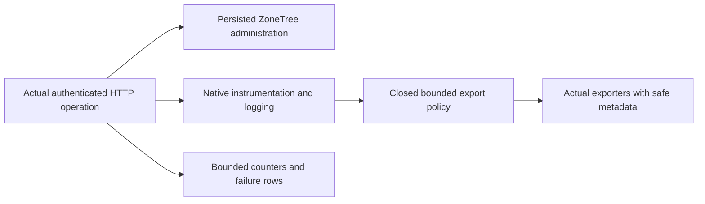

# ADR-121: exported telemetry privacy at the shared service boundary

Status: Accepted; implementation and native normal/scalar local gate delivered; required exact-source Linux RF3 acceptance pending. Date: 2026-10-08. Related: KL-015, REQ/AC-AUTH-KL015-002, REQ/AC-AUTH-009, REQ/AC-AD-003/008; ADR-014/015/022/029/051/113/117.

## Decision

Keep native OpenTelemetry tracing, metrics and logs/exporters enabled. Existing Orleans source privacy remains its unchanged owner. Add Authorization-owned privacy to the shared ASP.NET/HTTP-client and log export boundary. HTTP server/client spans preserve trace/parent IDs, kind, timestamps, duration and status with fixed operation/display names and closed normalized method, numeric response status and HTTP protocol-version tags. Remove URL/host/path/query/header/custom tags, trace state and bounded baggage; inherited parent baggage which cannot be removed without mutating its owner suppresses the child span; suppress spans containing immutable untrusted events, links outside the closed native connection-context shape below, or excess state rather than export that state. Metrics retain actual values/counts/durations and remove caller-derived dimensions from ASP.NET and HTTP-client instruments. Native Orleans metric policy remains unchanged.

Logs retain timestamps, severity, numeric event ID, normalized closed component category and trace correlation. Replace body/format with fixed runtime event text; clear attributes/exception/trace state and never capture scopes at composition. This is metadata observability, not disabled logging. No production canary comparisons, arbitrary category/path label, formatted state traversal or trusted caller fields are admitted. Typed validated options own bounded span work, including at most 32 local Activity parent links before inherited-baggage enumeration. Deeper local ancestry suppresses the child without mutating ancestor state; HTTP duration measurements and the subsequent normal authorized request remain observable.

## Ordered implementation and ownership

1. Root reviews this exact contract and reserves ADR number/composition join. Feature owner saves docs-first private source; no live shared changes.
2. Feature owner writes actual Kestrel/native ZoneTree operation and real exporter regression, covering denied/missing state, secret-bearing URL/header/body/log scope/error and full literal healthy catalog. Observe safe telemetry exists and current leaked canaries when the unsanitized baseline is executed; retain the original failing report.
3. ServiceDefaults Authorization Configuration/Contracts/Diagnostics own options/policy/span+log processors. Extensions.cs owns registration before exporters; preserve health/service discovery and Orleans configuration. UnitTests Authorization Fixtures/Diagnostics/Assertions/Cases own lifecycle/capture/complete flow. Dashboard source remains unchanged unless a concrete defect appears.
4. Root joins guarded source after review, including architecture/ADR index/status references. Source freezes once; build/analyzers/format then native normal/scalar/RF3 cases execute against unchanged source/image. Failure belongs to this owner; preserve original results, cleanup and canary-safe artifacts. Required actual coverage gates remain mandatory, CRAP unmeasured until matching coverage exists.
5. Linux exact-source workflow/attempt/job/original artifacts close original KL-015 only when all three original acceptance predicates pass. Wider lineage/administrator UI/production/endurance gates stay separate. Rollback removes these processors/options/registration and regression/docs together, never weakens database authority or silently restores permissive export.

No package/schema/wire/storage/consensus migration or fallback. Existing invalid-body and query-budget wholeflows map to the bounded-input acceptance and must be natively verified rather than duplicated. Root owns central packages/status/workflows/Git; other task owners retain movement/read/token paths. This ADR remains Accepted after review until actual evidence exists.

## Native HTTP connection context boundary (R777 diagnosis)

.NET 10 natively adds a connection-setup ActivityLink to `System.Net.Http.HttpRequestOut`; both actual baseline requests had exactly one tagless link with null TraceState and no events. [The native activity contract](https://learn.microsoft.com/en-us/dotnet/core/diagnostics/distributed-tracing-builtin-activities#http-connection-setup-experimental) documents this correlation. Treat only a single context-only link on that exact source/operation with Client kind as safe: non-default trace/span IDs, local context, null TraceState, no link tags and only the defined None/Recorded trace flags. Zero links remains valid. Inspect at most two links and one tag per link. For each examined link, check unsafe context/tags before the count bound: a tagged/state-bearing/invalid second link emits unsafe_state; two safe context-only links emit state_limit. This fixed reason priority is part of the acceptance contract. Any event, server link, different operation/kind, invalid/remote context, TraceState, tag or unknown flag remains fail-closed through native Recorded suppression. Preserve the original Activity, span/parent IDs and exact safe link context; never reconstruct a replacement or disable instrumentation. This is a closed metadata shape, not attribution of arbitrary links to a trusted producer.

REQ/AC-AUTH-KL015-002 maps to the real denied-to-healthy HTTP flow: compare every exported span ID/parent ID with preprivacy native observations, retain literal catalog/state, complete client/server exports, native logs/duration metrics and all canary assertions. Export capture records complete link context/tags, not just link presence. Additional actual HTTP client event/tagged-link/TraceState-link/extra-link cases must suppress only the unsafe request and export its healthy continuation. For a native safe link plus an added tagged link, require the actual preprivacy two-link shape and exactly unsafe_state with no state_limit; removing the tag guard must change the real counter to state_limit and fail this oracle. Two safe links instead require exactly state_limit. A native ConnectionSetup listener independently exercises one state-bearing tagless link; existing server and bounded ancestry negatives remain mandatory. R777 original baseline is a retained failed development diagnostic, not qualification: native exit 2, one executed failure, source/assembly drift zero. Root joins the reviewed docs/policy/regressions, builds one coherent image, then owner runs normal/scalar; exact-source Linux RF3 remains required.

R783 bounded preprivacy observation confirms the production inherited-baggage guard correctly suppresses HttpClient children of TUnit's native `test body`/`test case` activities: exactly one `tunit.test.id` baggage item remains inherited, three local parents and six/seven tags are within the resolved 32/8/32 bounds. The positive fixture must establish its owned caller using the actual ambient native trace/span/flags as explicit parent context before Start. This retains ambient trace/parent identity and native Activity.Current restoration without inheriting the test framework's object baggage; native HttpClient.Parent remains that actual owned caller. Additional owned caller activities still form the original local chain, so inherited-canary and excessive-depth negatives exercise unchanged production fail-closed behavior. Do not mutate TUnit/ancestor state, whitelist test keys, detach/reconstruct native HTTP spans, change sampling/bounds or weaken exporter assertions. Native exported IDs remain compared to the actual preprivacy snapshots.

## Local development verification (2026-10-08)

The coherent R785 complete Release solution build passed with zero warnings/errors and source drift. Native TUnit `AuthorizationTelemetryWholeFlowTests`, `AuthorizationTelemetryClientWholeFlowTests` and `OrleansRuntimeTelemetryTests` executed 12/12 PASS in both normal and `DOTNET_EnableHWIntrinsic=0` scalar modes; native exit 0 and source/assembly drift zero for each. These actual fullflows include real persisted-key denial → unchanged native store/read cut → complete healthy catalog, native client/server/log/duration exports, original IDs, exact bounded suppression reason priority, one native state-bearing connection link, client events, server immutable state and intentional inherited/deep ancestry. Native fixtures joined producers, flushed/snapshotted and stopped/disposed before test completion.

Original R769/R772 missing-client failures, R777 immutable-link diagnosis, R781 follow-up failures and R783 inherited-TUnit-baggage diagnosis remain retained as original failures. R785 receipts and original Detailed/TRX reports use `/private/tmp/keyload-r785-kl015-native-normal-20261008` and `-scalar-20261008`; exact native case IDs/hashes are retained in `/private/tmp/keyload-r785-kl015-native-telemetry-evidence-ledger-20261008.json`. This is local development evidence, not Linux RF3 qualification. The ADR remains Accepted and KL-015 remains in progress until current-source Linux cross-tenant/admission/query and C1 SDK/official MCP held-write/guard gates have authentic required outcomes; original 0f9 or Build-only model/logger results cannot close those current gates.

## Current Linux export verification (run 37821315110)

[Build and Tests run 37821315110](https://github.com/managedcode/KeyLoad/actions/runs/37821315110), attempt 1, source `3458f6111f94e93d40334bc2cdaae008dac58a01`, has authenticated original normal and scalar TRX: all 12 native HTTP/Orleans telemetry cases passed in each mode with no skipped case. Original `test-results-ubuntu-latest` artifact 11571092813 API digest and downloaded ZIP SHA-256 both equal `8bad806f9cd83bedfb95d799eeb3103233cb9cab65d9b27e3208384493c13591`; original normal TRX SHA-256 is `66e51f7e1ea73b92315258f4cac7aa34c53ae6ea93ea08a953f0cda5b059f63d`, scalar is `824159a1e86d9d27902cb4f0073df9d4d79549e1166d4a48c7000d5583987a47`. Original source manifest identifies this exact SHA, native unit image receipt is retained, and the after-suite source/image verification step completed successfully. The exact case IDs and receipt hashes are retained in `/private/tmp/keyload-kl015-current-linux-37821315110-original-telemetry-trx-ledger-20261008.json`.

This qualifies the current Linux export cases only: complete unit suites each executed 3087 cases with 3068 passed and 19 failures belonging to the separate KL-036 workstream. Current RF3 cross-tenant, bounded-input/query and C1 held-write/guard outcomes remain required. This ADR remains Accepted and KL-015 remains in progress; no full-suite, RF3, production or endurance pass is inferred.
