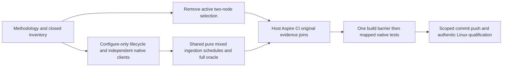

# ADR-122: native single and three-node comparable benchmark methodology

Status: Accepted, 2026-10-09. Owner: KeyLoad creator. Implementation: in progress. Canonical slice: BenchmarkComparisons.

TASK-METH-STRESS admission hardening owns feature-local typed HeavyLoad options, native argument validation and negative controls under integration DocumentStorage. Validate enabled, exact class filter, serial execution and absence of coverage before fixture startup; reject an ordinary broad filter without changing its task-acceptance identity. The native selector rejects an exact heavy filter without opt-in. Rollback reverts this source-bound admission stage without promoting earlier unqualified outputs; original heavy RF3 and full GitHub gates remain required.

## Context and decision

The owner requires meaningful pure/mixed measurements, actual one-million-record ingestion with 1/10/500 independent clients and only native one-node/three-node comparison topologies. Existing setup seeding and shared client wrappers cannot prove these ingestion claims. Follow the primary-source-backed [Methodology](../Features/BenchmarkComparisons/Methodology.md), REQ/AC-METH-001..005 and REQ/AC-SCALE-024..029. This supersedes two-node active inventory in ADR-034/056/103/109 without changing RF3 majority ACKs, production placement, persisted state or immutable historical outputs.

## Implementation contract and ordered stages

1. TASK-METH-TOPOLOGY: scripts/Features/BenchmarkComparisons and site/Features/BenchmarkComparisons inventory/provenance owner changes current 1/3 plans, derived counts and strict aggregate/source admission together. C# topology owner changes ComparisonTopologies/contract readers/native topology branches, AppHost selection and mapped admission tests. Reject 2 before allocation; no legacy reader is introduced. Keep original historical byte/hash fixtures immutable and exclude them from current positive qualification.
2. TASK-METH-DOCUMENTS and TASK-METH-INGESTION: benchmark library owner implements `Documents/<Role>/` contracts, lazy schedules, shared execution, histograms and final actual readback, reusing `IComparisonTarget`/`IComparisonSession` and native adapters. Target lifecycle adds explicit configure-only mode and real owned per-session clients; final readers enumerate actual stored identities rather than assuming initial size. No dependency or replacement database is introduced.
3. TASK-METH-EVIDENCE: lead owns the single machine inventory, ComparisonHost selection/report writing, AppHost forwarding, named database CI group integration and source/run/attempt/job-bound artifacts. Current failed/null authenticity and downstream gates stay mandatory. New family evidence cannot silently populate an old control profile.
4. TASK-METH-STRESS: lead integrates a separate exclusive Aspire RF3 functional case exercising real SDK and official MCP operations during ingestion, with final state verification, original-operation settlement and owned cleanup. It is not a measurement or coverage substitute. Before qualifying the document cohort, its collector and aggregate authenticate the same-source completed functional job, original artifact/archive, exact native passed-test TRX and matching image receipts. Preserve and revalidate original bytes; missing, failed, skipped, changed or mismatched evidence blocks qualification. This join applies to the new document cohort and does not silently change historical/control publication policy.
5. Freeze source/image mutations across all agents. Lead builds full Release solution once, fixes compile errors with owning agents, runs format/governance and mapped native TUnit contract/native flows; independent resource lanes may overlap only when their resources are isolated. Preserve original failures and report unexecuted full gates. Scoped completed stages are committed/pushed to main under standing authorization; exact-source Linux workflow records close actual scale/correctness qualification.

## Agent roles and joins

TASK-SCALE-NATIVE-PIPE-025 repairs the existing REQ/AC-SCALE-016 native
process observation within this wave. First extend ScalingQualification's
settlement contract, then change only AppHost's ScaleServerResourceProcess
observer and ComparisonTests' real Linux pipe-bound controls. Each original
pipe fault must trigger termination before the other pipe reaches EOF; retain
all original exit/reader joins and first-failure plus cleanup evidence. Real
stdout and stderr overflow and healthy follow-up flows must retain original
normal/scalar GitHub reports. No schema, topology, grant, cleanup duration or
qualification relaxation is introduced. Rollback reverts this coherent source
stage without counting interrupted suites or promoting prior outputs.

Lead: docs/inventory, host/AppHost/CI, integration, build barrier, original evidence and delivery. Planner agent: JS/site plans/admission and mapped TUnit tests. Native topology agent: C# native 1/3 selection and resource/admission regression tests. Native workload agent: shared lazy document runner, adapter lifecycle/client/readback ownership and mapped regression tests. File ownership must be explicit; coordinate edits to shared contract/target files before writing. Agents must not run concurrent compilers or modify frozen images.

## Rollout and rollback

This first-release active contract accepts only the current canonical inventory. Deploy new source, host, planner and validator together; old cohorts remain history and are not accepted as current measurements. No storage migration or compatibility reader is required. Rollback is a normal reviewed source revert of the coherent benchmark wave, preserving original evidence and all product RF3 gates. If a native operation/topology is unavailable, emit the declared unavailable disposition; never substitute a fake cluster or fabricate a number.

## Validation and limits

Methodology AC tables map positive, negative, cancellation/error and edge flows to tasks. Exact required evidence is canonical build/format/governance, original focused TUnit reports, genuine Aspire native client flows and complete source-bound Linux scale outputs. Owner correction on 2026-10-09 requires all further benchmark-stage verification in GitHub Actions; earlier local failures are retained as history. Current unit/process recovery and product RF3 gates are retained; selected tests prove only selected scopes. Do not mark this ADR Implemented until every required implementation, join, test and original evidence exists.
