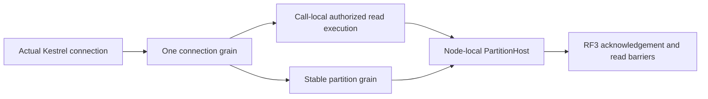
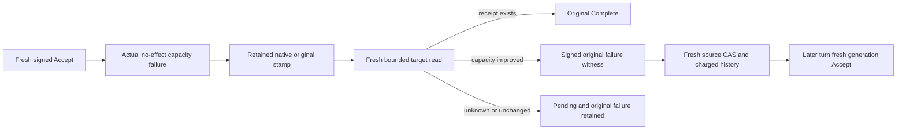

# ADR-125: Connection-owned Orleans execution

Status: Accepted; implementation and qualification in progress.

Current owner-selected verification stage (2026-10-09): finish the real local
KeyLoad functional smoke through SDK and the official MCP client against
fixture-owned Aspire Docker RF3. Exercise stored read/write outcomes, one physical
connection with concurrent independent commands, fresh authorization, cancellation
and actual connection cleanup. Do not start unrelated full test suites or further
GitHub performance runs in this iteration. Existing Linux performance qualification
remains open; local functional evidence does not establish a performance gain.

Owner: KeyLoad root integration owner. Decision: owner clarification 2026-10-09.

## Purpose and decision

One accepted physical Kestrel connection owns one lazily activated Orleans
ConnectionGrain. Reusing a connection never creates a request or read grain for
each operation. This owner decision supersedes the former separately activated
request/read boundary, including ADR-065 and ExecutionPrimitives descriptions.
Each operation still has a unique signed request GUID, stable command receipt ID,
fresh persisted authorization, bounded native context and original work cleanup.
ZoneTree handles, partition commits, replication and read cuts keep their existing
node-local ownership and genuine RF3 contracts.

## Frozen implementation contract

- The physical connection middleware issues one opaque GUID in a typed connection
  feature. HTTP features inherit it from Kestrel. No client header, principal,
  HttpClient instance or MCP session ID can choose this owner. Current MCP remains
  stateless and this change does not deliver native SQL session interoperability.
- Native GrainRequestContextState gains a stable field 2 for ConnectionId. The
  signed envelope binds request identity, subject, operation and expiration;
  server-owned context separately binds the execution owner. It does not confer
  authorization. ConnectionGrain validates both before executing an operation.
  Downstream capability and partition calls retain original request identity.
- IConnectionGrain uses the existing native streaming contract for independent
  operations. Operation state remains local to the enumerator. Native stream
  extensions interleave, so admission/close invariants use a bounded joined owner;
  no blanket Reentrant attribute or commit-order change is permitted.
- CloseAsync is AlwaysInterleave and accepts a dedicated generated signed control
  containing purpose, incarnation, owner ID and expiration. Control cannot execute
  a database effect. It closes admission, cancels and joins original operations,
  then requests DeactivateOnIdle. Sibling operation cancellation affects only that
  operation. ProducerDisposed observations still follow original disposal.
- Defaults: at most 4096 admitted transport connections per node, 8 operations per
  connection, no queued operation admission, and a two-minute idle transport expiry
  when no operation is active. Typed validated options own these limits. Existing
  silo producer/frame caps remain 64/128; comparison must not widen them.
- The middleware uses ConnectionClosed and its original finally for disconnect;
  RequestAborted belongs to one operation. Idle expiry aborts the actual transport.
  Host shutdown closes connection admission and joins connections before stopping
  the silo/storage. Reconnect obtains a fresh owner ID. Silo/process loss discards
  disposable owners; receipt retry and uncertain writes keep existing semantics.
  Transport cleanup must cancel and join the original native caller enumerators
  and their producer disposal before the signed grain close/deactivation. Pinned
  [Orleans 10.4 native caller disposal](https://raw.githubusercontent.com/dotnet/orleans/v10.4.0/src/Orleans.Core.Abstractions/Runtime/AsyncEnumerableRequest.cs)
  sends its final DisposeAsync RPC even after enumeration terminated. Deactivating
  first can let that late RPC activate an empty owner again. Native fixture close
  must follow the same ServerConnectionFeature order, retaining all original task,
  producer-disposal and zero-activation assertions. The first repaired local eight
  cases passed seven; its close case exposed this fixture ordering error. Original
  RPC evidence shows close completed in12.67ms and deactivated before the late
  DisposeAsync. Corrected-source native and actual RF3 evidence are still pending.
- Background/provider/startup work uses one explicitly registered bounded owner
  per silo service lifetime. Coordinator and nested effects reuse their existing
  bounded owner/context, never generate a new execution owner per operation.
  Authenticated peer transport may use its actual accepted connection feature.
- Read capability behavior is extracted into call-local execution on the same
  connection grain. Preserve barriers, policy reload, scoped cuts, expiry,
  cancellation, remote reads, work leases and fault observations. There is no
  independently keyed DatabaseReadGrain or rejected production fallback.
- First release uses one homogeneous current contract. Change internal RPC alias
  to keyload.connection.v1 and version 5, context alias to keyload.request.context.v2;
  do not retain old production contracts. No persisted storage/public JSON format
  or canonical identity digest changes are part of this decision.

## Requirements, stages and ownership

Related: REQ/AC-CLIENT-CONNECTION-001/002 and REQ/AC-ORL-013. Task:
TASK-CLIENT-CONNECTION, with TASK-ORL-REQUEST-LIFETIME now connection call cleanup.

1. Root freezes this contract and owns shared contracts/context/control codec,
   typed options, Server ClientApi connection lifecycle, authentication/gateway,
   OrleansNode execution and host shutdown, feature docs and status.
2. Connection runtime owner implements ClusterRouting Grains/ConnectionGrain,
   Queries connection read execution, Streaming joined operation ownership, and
   Orleans background/nested call routing. It preserves concurrent feature work.
3. Test owner adapts native fixture scopes and writes complete connection operation,
   isolation, authorization, capacity, lifecycle and RF3 SDK/official MCP cases.
   Native IManagementGrain inventories prove actual activation reuse/removal.
4. GitHub evidence owner recovers the exact immutable baseline Benchmarks run and
   collects original artifacts. Root joins all source writers at one barrier,
   builds once, runs mapped native TUnit scopes, reviews quality, commits/pushes
   the coherent completed stage, and observes delivered-source Linux gates.
5. Compare matching isolated Linux canonical workload cells at 100k/1m actual
   records and at least 100k operations. Record p50/p95/p99, completed throughput,
   errors, stored correctness, CPU/RAM and available allocations separately.
   Existing AllocatedBytes is client-only; missing server allocation/activation
   sampling remains unmeasured. No local benchmark or special benchmark mode.

## Rollout, rollback and evidence

Deploy only a homogeneous verified RF3 cohort. Failed qualification blocks the
performance claim and delivery gate, without weakening authorization or cleanup.
Before initial release rollback means reverting the whole stage at source and
redeploying a homogeneous previously qualified build; there is no runtime legacy
fallback or data migration. Retain exact source/run/attempt and original failures.

Implementation is in progress. A documentation commit, callback or configured cap
does not prove connection reuse, native deactivation, server RAM recovery or a
performance improvement. Unit/development proof cannot substitute for RF3 and
original Linux GitHub performance qualification.

## Explicit HTTP/2 transport implementation contract

HTTP/2 multiplexing is the public transport for proving concurrent operations on
one actual accepted TCP connection. ClientApi ServerExecutionOptions owns
EnableHttp2 (false until explicitly enabled) and Http2Port (default 8081, accepted
range 1..65535). ServerConnectionTransportComposition.Configure registers the
native Kestrel option/configuration loader composition before host construction.
It preserves existing Kestrel endpoint definitions. When no endpoint definitions
exist, it retains the effective original urls setting, or HTTP_PORTS/HTTPS_PORTS
settings, as equivalent configured endpoints before adding the dedicated http2
endpoint. An unconfigured original listener keeps Kestrel's localhost:5000 default.
Existing endpoint protocol defaults, certificate configuration, body bounds and
server-owned connection middleware apply through the same native loader. The
dedicated listener binds all IPv4 interfaces and uses HttpProtocols.Http2; its
cleartext callers must explicitly select HTTP/2 prior knowledge. No protocol
negotiation on the existing cleartext HTTP/1.1 listener is implied. The native
configuration behavior is documented by [Microsoft's Kestrel endpoint contract](https://learn.microsoft.com/en-us/aspnet/core/fundamentals/servers/kestrel/endpoints?view=aspnetcore-10.0).
The existing HTTP/1.1 transport executes sequential requests on one physical
connection. Genuine overlapping public calls use the configured HTTP/2 listener;
native grain overlap and bounded independent operation admission remain mandatory.

AppHost ClusterReplication resources add a direct, unproxied named http2 endpoint
on container target port 8081 for each actual RF3 node, and configure
KeyLoad__ServerExecution__EnableHttp2=true and
KeyLoad__ServerExecution__Http2Port=8081. The original http endpoint, target port
8080, peer addresses, persisted identity and readiness remain unchanged. The
container endpoints are discovered through Aspire, including the six-node
two-RF3 topology where applicable; clients do not construct substitute addresses.

The shared SDK ClientApi transport copies the supplied HttpClient's
DefaultRequestVersion and DefaultVersionPolicy into every created
HttpRequestMessage. Official MCP SDK 2.2 creates explicit HTTP/1.1 requests;
its real persistent HTTP/1.1 flow verifies reuse and authorization. Actual SDK
HTTP/2 overlap acceptance uses SocketsHttpHandler with MaxConnectionsPerServer=1,
EnableMultipleHttp2Connections=false, HTTP version 2.0 and RequestVersionExact,
then proves independent signed operations and commands overlap on the same
server-issued connection owner while selected cancellation leaves its sibling
successful. Disconnect/idle/shutdown must join original operations on this same
listener. Original HTTP/1.1 caller flows and RF3 receipts remain mandatory. This
is transport correctness evidence, not a benchmark result or performance claim.

Owned files: Server Features/ClientApi/Configuration/ServerExecutionOptions.cs;
Hosting/ServerConnectionTransportComposition.cs; AppHost feature-local connection
endpoint composition and ClusterReplication/ClusterRouting resource joins;
Client Features/ClientApi/Transport request creation. Root wires ServerConfiguration
and owns the joined verification barrier; the test owner supplies actual SDK and
official MCP acceptance through the discovered endpoint.

## Native failure serialization contract, 2026-10-09

REQ/AC-CLIENT-CONNECTION-002 and REQ/AC-ORL-013 require native admission and
signed-close rejection to retain the actual KeyLoadException domain code, HTTP
status and safe message across the original Orleans RPC. First native execution
passed five cases and failed two. Its original RPC spans for AC-CRS-053
StartEnumeration and AC-CRS-054 CloseAsync contain CodecNotFoundException:
`Could not find a codec for type KeyLoad.KeyLoadException.` The server-side
wrong-owner close span contains the original domain rejection. This confirms
missing KeyLoad-owned exception serialization; fixture cleanup additionally
obscured that primary failure and must preserve both original and cleanup faults.

Root owns the existing shared KeyLoadException declaration in
Abstractions/Contracts.cs. Before the next native run, add GenerateSerializer,
the stable alias `keyload.error.v1`, and member IDs 0 for Code and 1 for
StatusCode. Its Exception base uses the native Orleans base codec for message,
inner cause and native exception state. Preserve public constructors, domain
codes and HTTP/JSON problem shape. This is a new internal RPC type contract for
the homogeneous current deployment, with no persisted-format migration.
Do not add a fallback serializer, widen exception namespace admission or replace
typed failures with generic errors.

The test owner preserves primary failures before scenario disposal and cancels,
joins and observes the original caller/producer tasks. AC-CRS-053/054 remain
real negative RPC regressions with the original domain-code assertions. A focused
native serializer roundtrip also checks a nondefault Code/StatusCode, safe message
and existing inner cause. Joined unit and RF3 verification, followed by exact-source
Linux delivery, are required; source attributes alone do not qualify this repair.

## Connection execution RF3 local-image cohort, 2026-10-09

ADR-125's REQ/AC-CLIENT-CONNECTION-001/002 and REQ/AC-ORL-013 reuse the
existing ADR-119 TUnit-owned actual-image preparation and explicit child identity.
The additional exact selector is:

    /*/*/(ConnectionRf3SequentialTests|ConnectionRf3OverlapTests|ConnectionRf3AuthorizationTests)/*

It owns all five expanded native SDK/official MCP instances, including actual
HTTP/2 same-connection overlap. No wildcard/subset/mixed-image or GitHub identity
exception is added. ConnectionRf3Scenario starts LocalRf3ImageTestSession,
passes its explicit Selection through RequestCqrsRf3ImageProof and wave startup,
verifies the three modeled tags and actual image IDs, and joins the original
wave before exact-tag cleanup. Existing caller defaults remain unchanged when
this selector is absent. Native arguments propagate explicitly without ambient
image mutation. The established closed private CQRS probe profile remains
required for bounded actual operation/activation witnesses. Native-image
preparation and source receipt verification precede RF3 startup; no stale image,
manually started nodes or local benchmark execution is admitted. All measured
qualification remains original Linux GitHub evidence. Complete existing positive/
negative native selection tests remain mandatory alongside actual five RF3 flows;
adding selector code alone does not pass either gate.

## Local functional execution evidence, 2026-10-09

The owner-selected local development stage completed eight native Orleans
connection flows (8 passed, 0 failed/skipped, 5.374s) and the five actual
SDK/official MCP Aspire Docker RF3 flows (5 passed, 0 failed/skipped,
native exit0, 8m33s985ms). The latter ran from22:26:51Z to22:35:24Z.
The original report is
`TestResults/connection-rf3-local-catalog-repaired/KeyLoad.IntegrationTests_net10.0_arm64.trx`,
SHA256 `3b58cab7c1d33a5a655f9e60656557eba0da9dadfdee1877d68478ab37b4769e`.

AC-CRS-057 passed for both SDK and official MCP: actual persistent transport
reuse, committed create/read/update, stable-ID replay, failure followed by a
healthy operation, and joined disconnect. AC-CRS-058 passed on the actual SDK
HTTP/2 connection: a held command allowed an independent command and read to
complete, selected cancellation preserved the sibling, and native closure removed
the activation before reconnect/healthy continuation. AC-CRS-059 passed for both
clients: persisted authorization revocation did not leak across operations.
The exact custom120-second idle timer was not independently distinguished from
native keepalive; observed connection closure is functional lifecycle evidence.

Each case owned its fresh three-node deployment and unique native image invocation.
All five receipts have the same actual server input digest
`sha256:077cbb309ca1a6fe147086d10dbc2071868377468b7dfaebec3ec80b060be414`.
The strict original fixture retained image/model proof, discovered endpoints,
actual SDK/official MCP clients, full operation assertions and joined cleanup.
The caller used the exact five-instance selector above with scoped
`TMPDIR=/private/tmp`, preserving the no-symlink guard. No broader test suite or
additional GitHub performance activity was selected.

The local full-solution Release checkpoint at22:05Z passed with0warnings/errors.
A later integration-reference build encountered two CS0103 findings for
SampleChunkSnapshotFile during concurrent TimeSeries work. The unchanged selected
connection runner was already compiled; each smoke case freshly built the real
server image. Server startup additionally required the existing sample-chunk tool's
missing explicit description, documented under TASK-CLIENT-NATIVE-CATALOG-079 in
ClientApi/ADR-039. The original startup and fixture-order failures remain history.

These are local macOS/arm64 development results from the shared working checkout.
Complete exact-source Linux suites, fault/endurance gates, comparative100k/1m
workloads, server allocations/RAM and performance activation sampling remain open.
Runtime/performance qualification and full-task completion are not promoted.

### KL039 call-local original posting observation
TASK-KL039-PUBLIC-RETAINED-READER in [OnlineGenerationLifetime](../Features/Search/OnlineGenerationLifetime.md) uses the actual reused ConnectionGrain/call-local ConnectionReadExecution and original independently signed operation identity/context. The existing Query.ExecuteAsync branch installs an armed, bounded AsyncLocal observation scope only for that call; the SAME actual selected FTS iterator invokes appended closed NativeTextOriginalPostingRead after snapshot join. Original codec verifies current identity/context and joins the callback task/cancellation before native reader disposal. Scope restoration is exact; ordinary unarmed calls retain no observer, identity, completion history or new activation. Public SDK/MCP/Q1 original hold→completed swap→result/refusal→producer join→healthy/replay/cold source tests map this seam without asserting a fabricated activation count or native PASS.

### KL039 original posting observer arm admission closure

The `NativeTextOriginalPostingRead` fixture phase is admitted only for the actual public `GrainReadKind.Search`, `Hold` action and empty command identity. The existing generic read/empty-command invariant remains mandatory. Every other kind/action must refuse before claiming an arm. This closed fixture-only validation preserves the original connection-owned Query call, signed identity, current persisted authorization, original reader/task joins and all resource/deadline limits. It does not introduce another reader, execution or diagnostic payload. The public retained-reader SDK/MCP/Q1 positive/cancel operation regressions provide the genuine admitted flow; native Linux compiler/discovery/runtime and refused-arm qualification remain open. This appendix depends on the exact prior 46-path retained-reader successor, whose immutable bytes remain unchanged.

## Same-owner MultiLane child execution, 2026-10-10

TASK-MSG-CONNECTION-CHILD-001; REQ-MSG-007 / AC-MSG-007; ADR-125.
REQ-CLIENT-CONNECTION-CHILD-001: an already running connection parent borrows that actual owner's existing ExecuteStreamAsync method for each signed MultiLane leaf, instead of invoking an outgoing RPC to itself. The callable is passed privately by the actual owner; it is not DI, a caller credential, a public interface, a new dispatcher or an authorization capability.
AC-CLIENT-CONNECTION-CHILD-001: two genuine queue claims use the same observed native GrainId/ActivationId as their parent, unique operation identities, actual signed Receive commands, complete deliveries and canonical outcomes. All three producers settle. Exact original-leaf replay leaves the complete canonical image and position unchanged; original delivery ACKs and a following document operation succeed on that same activation; signed close joins and removes it. Existing 14 MultiLane whole cases and three public RF3 cases remain mandatory for denial, invalid groups, expiry, unknown replies, cancellation and healthy continuation.

Ordered implementation: preserve actual parent validation and fresh persisted principal; create the original native child identity scope and signed envelope; call the borrowed method with the original cancellation token; use unchanged bounded native stream admission, VerifyRequest/ValidateConnection, partition routing, Graph-authorized partition call and native work leases; drain and join the actual producer before exact parent context restoration. Keep all catch filters, partial outcome meanings, pending/unknown contracts, quotas and deadlines. The only changed invocation is self-RPC to private method-group. No public/serializer/persistence identity changes.

Ownership: ConnectionGrain, MultiLaneReceiveExecution, existing test ConnectionOperationObservation plus a Messaging same-owner complete-operation case/trial. ConnectionGrain preimage is the exact approved KL039 post-Capture proposed file, including its OnlineText GrainContext argument. Preserve that independently owned path. Audit confirms analogous self-RPC in Ann/Text/Online children; those are explicitly separate scope and not repaired by this packet.

Rollback is the two invocation changes together; tests/docs remain accurate. No dependency repair is claimed: pinned Graph intentionally refuses unqualified self-transitions. R32 mixed-binary Event3 is retained as history, not proof of cause or qualification. Root-only clean normal/scalar14, new native case and genuine Docker/Aspire SDK/MCP/Q1 cases are pending; no UID/count/PASS edits.

## Same-owner search parent children, 2026-10-10

TASK-SEARCH-CONNECTION-CHILD-001; REQ-CLIENT-CONNECTION-001/002 and AC-CLIENT-CONNECTION-001/002; ADR-125. Related existing REQ/AC-ANN-007, FTS-003/004/005 and ONLINE-001..005 retain all native generation, receipt, authority and recovery gates.

REQ-SEARCH-CONNECTION-CHILD-001: Ann, Text and OnlineText connection parents execute their separately signed child capabilities by borrowing the SAME actual ConnectionGrain.ExecuteStreamAsync implementation, never an outgoing RPC to that same activation. The actual private owner supplies the delegate. No public caller/DI observer can supply execution authority; this introduces no activation, dispatcher, scheduling attribute or Graph transition change.

AC-SEARCH-CONNECTION-CHILD-001: original native and Docker/Aspire SDK, official MCP and both SQL caller operation flows retain owner-mismatch refusal with full unchanged source corpus, genuine maintenance build/restore/publication, exact original receipt replay, bilingual update/delete complete literals, native lease/cancellation/unknown and joined Abort semantics, and same-root cold recovery. Existing tests are the regression flows, with their exact Args/complete assertions unchanged; do not substitute setter/parser/validation tests.

Stages: the actual ConnectionGrain method-group is passed to each existing parent and child-call owner. Keep parent scope validation, identity validation, fresh persisted principal/Admin check, actual child RequestId/CommandId, native signed envelope and original expiry. Create the same native identity scope; call the borrowed existing ExecuteStreamAsync inside the original Drain producer; retain its bounded owner/work admission, signature and connection verification and original child cancellation. Partition commands still invoke the actual Graph-authorized CommandPartitionGrain path. Drain/dispose the actual producer before identity scope restoration. Preserve unknown-write mapping and nonfatal/fatal behavior, every Abort primary/cleanup ledger and original native session. OnlineText keeps frames.ObserveChild over that exact borrowed stream, original parent expiry and post-Capture observer's actual GrainContext.

Exact ownership: ConnectionGrain plus AnnMaintenanceExecution/ChildCalls, TextMaintenanceExecution/ChildCalls, OnlineTextExecution/ChildCalls. No leaf/public/persisted/wire schema, alias/Id, placement, generation, native storage, quota, timing or default change. All seven source edits are delegate type/parameter forwarding and the existing stream creation call only. Parent flow algorithms remain untouched.

Dependencies: ConnectionGrain starts at immutable MultiLane8 proposed postimage (itself includes KL039 post-Capture14); OnlineTextExecution/ChildCalls and OnlineGenerationLifetime start at the exact immutable KL039 post-Capture14 proposed postimages. ClientApi/ADR125 start at immutable MultiLane8 docs. Preserve native context observer and every existing appendix by explicit composition. Other files use exact current live bytes. Roll back only this invocation chain, together, without changing persisted/native authorities.

The clean original R32 MultiLane14 failed 14/14 with source and binaries coherent. Its Event3 CapabilityExecution/Unexpected/UnknownWriteOutcome is not an exception-chain proof of this self-RPC cause. Source establishes the invalid outgoing self-boundary against pinned Graph's same-ID contract; root must run original clean normal/scalar and the complete related native/recovery/RF3 cases after this repair. No runtime/PASS, native UID/count/selector or dependency release claim.

## TASK-CRS-NATIVE-STARTUP-CALLER-JOIN-001

REQ-CLIENT-CONNECTION-001/002 and AC-CRS-050..056/060 under ADR-125: the genuine native Connection fixture startup belongs to the SAME original operation caller and must settle before its disposal starts. Its existing 30-second startup deadline and the original 20-second whole-operation caller deadline remain unchanged. Link both tokens into actual TestCluster.DeployAsync and await that original task directly; do not detach deployment with WaitAsync. Ordinary shared IAsyncInitializer startup delegates with CancellationToken.None and retains its original bounded behavior. Native host/client initialization, original fatal/nonfatal startup plus cleanup ledger, actual stop/disposal/owner release remain unchanged.

Authentic source059/run38019624472 has RequestCqrs shared67, NativeCqrs6, Connection9 normal/8 scalar cancellation failures. Those are three distinct original stacks. This source repair establishes an actual caller/deployment lifetime defect, not the unproven historical cause: the ZIP has no native silo startup logs, and client First-stage or membership cancellation is insufficient to infer resource contention, port collision or dependency failure. Keep every original failed artifact.

Implementation ownership: Unit ClusterRouting Fixtures/RequestCqrsFixture.cs and ConnectionNativeScenario.cs only; no production, Graph, scheduling, slots, topology, policy, signature, identity, storage, clock, limits or test argument changes. Existing AcCrs050..056/060 whole operations retain all exact receipt/model/replay/revoke/cancel/capacity/management-removal assertions. Root must run original normal/scalar fixtures plus all required suites on coherent binaries, with detailed original startup logging before any startup-cause claim. Source preview/reconstruction is not runtime PASS.

## TASK-KL094-ACCEPT-CAPACITY-ATTEMPT-002 — finite native capacity repair

REQ-XFER-002/003/004/005 → AC-XFER-F2-001/002/003 → ADR-088/094/125. This source stage is the approved finite target Accept capacity retry boundary, not universal automatic transfer recovery. `DatabaseLimits.MaxQueueTransferAcceptAttempts` is nullable, native Id20, default null, centrally validated positive and <=MaxScanRecords. A newly created source intent reserves its immutable ceiling/generation1 and retained history; original intents with null state remain unchanged. Actual source history count and native serialized bytes stay charged under current MaxScanRecords/MaxBatchBytes. No GC, arbitrary retry, clock, default, role, timeout or capacity changes.

- REQ-XFER-F2-001 / AC-XFER-F2-001: only a genuine single Accept's ordinary no-effect ResourceExhausted from owning queue storage or transfer retention can retain nullable original authority in StoredOutcome Id9. Capture follows fresh original authorization/fences/clock and precedes actual Execute; original Reset remains authoritative. Unknown, early authorization errors, unclassified/transitive failures, success/replay have no eligible stamp. One charged same-native-view target read freshly validates the subject and original signed intent, successful receipt FIRST, original scoped outcome/stamp/native raw-byte digest/current dependency/owner cut. Directional capacity repair is required; no witness or Advance is produced by an unrelated commit/read cut.
- REQ-XFER-F2-002 / AC-XFER-F2-002: source authorized Batch `AdvanceQueueTransferAttempt` uses alias `keyload.queue-transfer.advance-attempt.v1`, discriminator `advanceQueueTransferAttempt`, derived Id0 SourceQueue/1 TransferId/2 ExpectedGeneration/3 FailureWitness. Source verifies the actual target signature and exact immutable intent/accept tuple; one same-transaction CAS appends one history reference, increments generation, charges one record plus exact native bytes. Ceiling/current limits, history/signatures and stale generation refuse without business effects. Original successful target receipt always wins; no ACKed target is recreated. New private read QueueTransferCoordination=72 follows actual live0..68 and separately reserved Streams69..71, with no dummy members or renumbering.
- REQ-XFER-F2-003 / AC-XFER-F2-003: generation1 Accept and every Complete retain exact F1 IDs. New Accept changes only source-committed generation. Advance ID derives from immutable tuple, expected generation and authenticated ORIGINAL outcome digest; refreshed witness/native read position never creates new IDs. A failed source Advance keeps that same ID and requires explicit authorized public operator repair. The existing serialized service dispatches at most one Advance per turn; a later turn rereads source state before a new Accept. No recursive loop, dispatcher, new activation or service-created principal.

Automated source bindings: Unit `RemoteTransferAttemptColdTests.GenuineTargetCapacityFailureRequiresRepairBeforeBoundedAttemptAndTwoColdReceiptReplays` uses actual native queue filling, failed original Apply, unchanged refusal, original raw StoredOutcome bytes, unknown/malformed/stale no-effects, genuine ACK repair, source CAS, new Accept/Complete, ACK with no resurrection and two real same-root reopen cuts. RF3 `RemoteTransferAttemptRf3Tests.GenuineCapacityRepairUsesBoundedCommittedAttemptOrOriginalManualRepairAcrossTwoColdCuts(int ceiling)` has typed arguments1/2: the one-attempt case requires the existing fresh operator Accept; the two-attempt case must reconcile the exact generation2 native receipt. Both use actual Aspire Docker resources, original SDK/official MCP/both Q1, exact persisted subject, full literal message/source/receipt assertions and two same-volume cold process cuts. Existing native cases/Args and ordinary50 slots remain unchanged.

This stage is PRIVATE SOURCE ONLY until root join/build and original Linux discovery/runtime. Mandatory native normal/scalar/full recovery/Docker RF3 gates remain open; UID/count contracts unchanged. Separate precise source-Advance/target-receipt unknown-at-commit crash cuts, independently placed physical groups, full negative boundary matrix, automatic Complete/policy/auth failures and AC-XFER-005 overall remain OPEN. No primitive or full SQL/protocol qualification is inferred from this finite stage.

Ordered ownership: Core Messaging owns stamp/read/history/CAS helpers; shared AtomicCommandCommit and generated native StoredOutcome append only9; Abstractions owns mutation/config append only; existing Orleans service/connection-native CQRS reuses fresh scope and joined lifetimes; test fixture only passes the explicit validated attempts selection to its original resources. Rollback disables optional advancement; retained generation/history/outcomes must remain validated and cannot be silently erased. Root composes actual DeadlineR2/F1 and Streams ordinal ancestors, then runs native discovery and exact-source Linux. See the immutable exact field/alias freeze in the reviewed implementation contract; no copied codec or signing material is exposed.

## TASK-KL094-DISTINCT-OWNER-TRANSFER-004: native peer/Core finite implementation

REQ-XFER-001..005 / AC-XFER-001..005 → ADR-088/094/125. Root reviewed exact contract0418f8f4, identity clarificationd5cd4cac, composition76ae9a78. Finite distinct-owner routing and independent receipt reconciliation, not remote automatic F2/F3A retry or full AC-XFER-005 closure. All existing default local shapes/IDs/current scopes and whole tests remain.

# TASK-KL094-DISTINCT-OWNER-TRANSFER-004 — composition/lifecycle freeze

Ancestor exact contract0418f8f +identity d5cd4cac, root-approved finite basic tranche. No remote F2/F3A retry qualification. This freeze precedes source.

The actual RemoteDocumentRuntime owns one feature-local verifier registration per local PartitionHost.Database. Only Proxy mode + original RemoteDocumentReads + nonempty selected RemoteTransferPrincipalId enroll. Ordinary null configuration has no owner, callback or authority. Runtime constructs one existing RemoteDocumentMac from actual validated MembershipAuthority.AuthorityPeerSecret; it borrows no caller-selected key. The registration retains immutable configured local/source receiver tuples and a typed verifier delegate, owns no storage and cannot Apply. Core's constructor-private admitted value is created solely after complete encoded variant/MAC/nonce/expiry/body/owner checks, fresh persisted technical principal and current destination resource/placement. Owner tuples in configuration select permitted pair; actual current native directory/placement/read-quorum checks still authorize each operation.

The Core registration is singular under an existing native Lock: a second active owner refuses; registration close atomically closes admission. RemoteDocumentRuntime first closes/drains its ORIGINAL RemoteDocumentWorkOwner and all original connection/CQRS tasks, then detaches the exact registration and disposes its original MAC. No delegate can observe a disposed secret; failed join retains the owner/MAC/root rather than declaring disposal. Endpoint owns original nonce cache/address pins, context RequestAborted+execution expiry+shutdown; no new nonce cache/clock/budget or per-operation registration. Existing joined error ledger retains initial+cleanup errors on constructor/start/stop. Target native apply repeats the stored proof binding under its real owner; the callback verifies only, never constructs technical principal/roles or native authority.

Explicit state propagation uses the existing ReplicatedOperation already passed by ApplyMutations to ApplyNonDocumentMutation. Only an original native signed Batch with the reviewed nonempty transfer proof selects the remote Accept helper; ordinary local Accept follows its unchanged local-token validator. No AsyncLocal/process-global proof or alternate dispatcher. StoredOutcome10 capture occurs only after actual genuine admitted pre-effect validation and successful effect; transaction reset/final frame refusal clears it. Replay validates original native technical subject/epoch/incarnation/scoped fingerprint plus immutable logical stamp; receipt reconciliation independently validates original retained intent creator/owners using fresh current auth and does not update old stamps or require obsolete logical policy epoch.

Source A's actual ingress envelope expiry is the sole delegation deadline. Before-send A denial is unchanged PermissionDenied/no effect. After-send possible or acknowledged B child + A fresh denial becomes original write UnknownWriteOutcome with initiating auth exception retained in ledger; no receipt/payload is released. Same-ID authorized receipt inspection can recover actual B receipt and independently mint A wrapper retaining the original B token/cut; A source Complete creates its own native commit and never validates B cut as local. Both successful B target receipt and ACKed delivery are immutable/no resurrection.

Exact integration paths: Core Messaging admission/validation/remote target atomic helper/receipt inspection; InternalSerialization native proof hash and stored authority; RemoteDocumentRuntime owns registration and disposal; existing RemoteDocumentEndpoint full-MAC/nonce/pins branch; Server Messaging exchange/source router; Orleans existing codec/Batch verified branch/read72. Existing native ConnectionGrain unchanged. No new public route/provider/friend/dependency/enum. Root serializes live join and required native build/process/six-owner SDK/MCP/Q1/cold execution.

# KL094 F3B — exact peer/Core admission proposal

REVIEW ONLY, before source/schema. REQ-XFER-001..005 / AC-XFER-001..005 → ADR-088/094/125 → TASK-KL094-DISTINCT-OWNER-TRANSFER-004. F1/F2/F3A originals and immutable packets remain unchanged. No runtime, UID, full retry or acceptance credit.

## Proven native gap
The current Core verifies intent/receipt with its own store signing key and incarnation; source Complete additionally validates B's destination CommitToken as if it were local. Genuine distinct A/B stores cannot satisfy that contract. Ordinary Batch CQRS calls SubmitNativeAsync and runs the normal Core factory again. Merely sending a pre-issued operation through that ordinary branch loses its special admission. Movement's verified branch has a real movement-specific publication/grant, which a transfer does not possess. Neither branch may be bypassed.

The existing RemoteDocumentEndpoint verifies the complete bounded request MAC before decoding, then owns replay nonce, address pins, original expiry/work/shutdown. Its request/reply MAC domains, native codec, HTTP path, configured secrets, discovery and storage ownership are reused. There is no additional transport/provider/codec/dispatcher, or new public endpoint. Core already exposes internals to Server and Orleans; no new friend is needed.

## Ownership and admitted-call boundary
A is the configured Authority owner of the logical namespace/catalog and source intent. It reloads the real persisted logical principal and authorizes the complete original single Accept (Query/Inspect for observation), destination resource and every payload/header field at a quorum/canonical cut BEFORE delegation. Create and Complete stay A-native. After each real reply A reloads the same principal and rechecks the original epoch/resource policy/current configured physical placement. Revoke during the await can deny the caller after B actually committed; that child outcome/proof is retained and must be reconciled, never rolled back or relabeled no-effect.

B is the configured Proxy/actual registered destination physical owner. Its nullable host-selected RemoteTransferPrincipalId names an EXISTING persisted technical principal, default null/unavailable. It must freshly satisfy the existing transfer administrator + exact destination QueuePublish/Inspect/field/header permissions; no root fallback/bootstrap. B does not clone A's logical user catalog or accept caller roles. A's finite authenticated delegation carries logical subject/epoch/policy digest as identity/provenance, while B's current technical policy and actual local resource/placement remain independent enforcement.

Proposed Core-owned internal admission owner is composed ONCE by the actual PartitionHost/OrleansNode using validated original options and the EXISTING RemoteDocumentMac verifier. It stores a bounded feature-specific peer-verification delegate/configured-owner snapshot; it is not passed by a public operation or serialized. The default owner is absent/closed. The delegate only invokes the actual existing MAC implementation plus configured tuple validation; it cannot issue database authority, choose a principal, apply, or supply roles. This additional internal owner composition is a REQUIRED reviewed boundary; there is no assumption that a caller-supplied blob is admitted.

`AdmitRemoteTransferPeerCall(originalEncodedEnvelope, originalSignature, decodedCall, originalWork)` is internal Core; it repeats complete MAC verification through that composed owner, compares the decoded call to the exact encoded mutually exclusive variant, checks version/nonce/source/target/current owner/incarnation/expiry/native count+bytes and fresh B principal/resource. It returns a private-constructor, nonserialized `AdmittedRemoteTransferCall`. No public flag or caller constructor. Only that Core object enters `CreateVerifiedRemoteTransferOperation(commandId, admitted, originalWork)`, which emits the exact one-mutation Batch through the ORIGINAL private IssueNativeOperation.

## Exact proposed append sites (not reserved until review)
- Existing RemoteDocumentTransportEnvelope 0 Document/1 Controlled/2 ControlledBlob unchanged; append nullable 3 QueueTransfer. Existing reply0..9 unchanged; append nullable10 QueueTransfer. All request/reply verifiers require exactly one matching variant; old calls reject this field and mixed forms. Existing full-envelope MAC domains remain unchanged.
- `RemoteQueueTransferPeerStage`: Accept=0, Receipt=1, Outcome=2. Only Accept can effect. Others are fresh-authorized observation and cannot infer absence from timeout. No new OperationKind/GrainReadKind/Batch mutation discriminator.
- `RemoteQueueTransferPeerCall`, alias `keyload.queue-transfer.peer-call.v1`: fields0 Version(int),1 RequestId(Guid),2 Nonce(string),3 ExpiresAt(DateTimeOffset),4 CallerVoter(string),5 CallerSiloAddress(string),6 SourceOwner(RegisteredPhysicalOwnerV1),7 DestinationOwner(RegisteredPhysicalOwnerV1),8 Stage(enum),9 OriginalCommandId(Guid),10 LogicalPrincipalId(string),11 LogicalPolicyEpoch(long),12 FieldHeaderDigest(string),13 IntentToken(string),14 IntentClaims(RemoteTransferIntentClaims),15 MaximumReplyBytes(int),16 SourceCut(CommitToken). Source Core authenticates its ORIGINAL intent before constructing this owned call; B receives the exact MAC-bound decoded claims, never accepts a free-standing claims object.
- Core native payload optional TransferProof Id6; native authority TransferProofHash Id10. Actual IssueNativeOperation hashes the complete owned proof; VerifyOperationAuthority and borrowed native authority verification compare it. Existing Value/Error/Detail/RetryDecisions and all old IDs/aliases remain byte-behavior unchanged. Ordinary native operations require empty proof. Proof binds original encoded envelope/signature, admitted call/body digest, actual technical principal+epoch, original expiry and configured receiver tuple. All native frame/batch bounds include proof bytes.
- Existing signed grain envelope fields stay unchanged. Add ONE closed private purpose `keyload-grain-queue-transfer-v1`, command Batch or read QueueTransferCoordination72 only. `CreateVerifiedRemoteTransferCommand` accepts an already Core-verified operation with nonempty transfer proof; payload is that exact operation. Route derives the exact native CommandRequest.Partition; executor reloads current principal/context/physical owner and invokes existing SubmitVerifiedAsync. Every other purpose/kind rejects this shape. Ordinary Batch still uses original SubmitNativeAsync; public JSON cannot select the private purpose or construct the proof. Read72 under this private purpose carries the admitted observation call and remains read-only under the existing charged wrapper. No dummy enum members, scheduling attributes, new activation or new dispatcher.
- Nullable StoredOutcome TransferAuthority Id10; alias `keyload.core.queue-transfer.outcome-authority.v1`, fields0 LogicalPrincipalId,1 LogicalPolicyEpoch,2 FieldHeaderDigest,3 SourceOwner,4 DestinationOwner,5 TechnicalPrincipalId,6 TechnicalPolicyEpoch,7 ProofDigest. Retained only from the actual verified pre-effect admission, failed no-effect marker has no stamp. Cached external results require fresh technical auth plus exact newly admitted logical identity/epoch/body; an unchanged technical epoch cannot hide changed A policy. Original native outcome scope/fingerprint/receipt remain complete.
- Intent appends nullable RemoteTarget Id17 AFTER F3A Repairs16; alias `keyload.core.queue-transfer.remote-target.v1`, fields0 original DestinationOwner,1 maximum reserved receipt bytes. TargetReceiptRecord appends nullable RemoteOrigin Id17, alias `keyload.core.queue-transfer.remote-origin.v1`, fields0 SourceOwner,1 original logical subject,2 original intent digest. Existing same-group records/null paths unchanged, no new family/index/map/GC.
- A-issued external receipt alias `keyload.queue-transfer.external-receipt.v1`, purpose `keyload-queue-transfer-external-receipt-v1`: fields0 Purpose,1 SourceOwner,2 DestinationOwner,3 Source,4 Destination,5 TransferId,6 LogicalPrincipalId,7 Fingerprint,8 OriginalTargetReceiptToken,9 TargetCommit,10 SourceCut,11 OriginalTargetReceiptDigest. This is minted ONLY after the same actual MAC-bound B receipt and complete identity/current-owner checks. It preserves B's original proof/cut; it never makes B's cut an A local cut. Complete verifies this A-owned wrapper against the retained original target owner and intent, freshly authorizes A, then atomically marks Delivered and retains its exact token. A preexisting same-group token still goes through its unchanged strict local validation.

## Linearization, identity and capacity
A's delegation expires at the original ingress expiry, never a fresh window. B checks that expiry before native issuance and actual apply; cancellation/shutdown cannot authorize an expired payload. B commits its real Enqueue+target receipt+outcome atomically under current local gates. The logical caller is provenance; the actual effect principal is B's persisted technical principal. TargetReceiptKey uses the original source/transfer/destination tuple; successful receipt always wins, including after ACK. Changed body/intent/owner conflicts; no re-enqueue of ACKed output.

F1 gen1 Accept/Complete, every F2 capacity ID and F3A policy/Complete ID remain EXACT. Unknown reconciles the same original ID by actual B scoped-outcome and target-receipt observation, never a random/cut-derived attempt. No result from missing/unauthenticated/early transport failure may become a successful lookup. F2/F3A remote failure advancement requires separately proven external original-failure authority; it is NOT claimed from this F3B routing tranche.

Create reserves the external receipt bound using the existing native generated receipt/token schema and actual captured owner/ref/subject bytes, maximum legal native scalar/cut widths and fixed native HMAC framing. Sizing is not a B signature/proof or effect. The wrapper bound is derived from that native bound, not MaxBatchBytes-as-an-arbitrary-receipt allowance. Actual wrapper bytes are rechecked and charged; original source count/bytes/MaxBatchBytes, target queue quota, target receipt bytes and native proof/reply/scan/work/frame limits remain independent. No copied codec, payload truncation, option mutation or new limit/default. Target record origin bytes are charged with actual serialized record; source replacement cannot exceed the pre-reserved bound.

## Whole source/test scope and integration
Core Messaging owns admitted-call/claims/validation/identity/source wrapper and actual target atomic helper; InternalSerialization owns the two native proof slots and StoredOutcome stamp. Server Messaging owns exchange/receiver/peer admission adapter, using existing DocumentStorage transport/MAC/work/pins/replay. Orleans Messaging owns existing signed execution routing; narrow ClusterRouting scope/codec/executor checks select the private verified purpose. Existing shared ConnectionGrain and all current owners remain unchanged. Current live preimages plus F3A69 proposed ancestry must be explicitly composed before final guard seal.

Unit real Kestrel+actual peer MAC and native stores: A logical authorize/B technical authorize, native factory/codec/SubmitVerified, receipt/body/lane/counters/full raw original outcome; malformed MAC/nonce/mixed variant/wrong source/target/incarnation/expiry/missing principal/denied field/header/changed body refuse, exact repair then healthy; selected caller cancellation retains actual outcome. No fake peer or free-standing proof.
Process cuts: actual B native header/flushed/apply and A source Complete cuts, same original operation/unknown reconciliation, full pre/post paired histories/counters, original denied result, actual receipt, exact replay and two same-root cold opens. Not power-loss evidence.
Six-owner Aspire RF3: actual registered A/B physical groups, SDK/official MCP/both Q1 Create/Accept/Inspect/Complete, source acknowledged before B send; B real effect ACK before A observation; A completion ACK; one/all B loss and same-volume restart under original lifetime; fresh persisted revoke/restore at A and B, failure ledger, ACK/no resurrection, source Pending→Delivered, complete literal body/headers and original receipt/outcome bytes; two all-six cold cuts and independent current owner/placement authority. A post-result denial MUST retain a genuinely committed B child, not assert no-effect. All current whole flows/Args/native50 and mandatory suites retained. Native Source/PDB/UID and fresh Linux runtime/performance/retention/endurance gates remain OPEN.

Rollback disables only nullable technical selection/new private admission; retained remote proof/outcomes are never rewritten or treated as legacy local tokens. No migration/default fallback or fake full AC-XFER005 closure.

# F3B native identity and receipt clarification — review only

Parent contract: peer-core-exact-contract-r1, SHA0418f8f49d539717439e6bced40e85a5e31ecbcf526f62211afba0d5c3f5da39. No source/schema reservation or implementation.

## Closed subject invariant
A retains the actual intent creator as logical principal. A freshly checks that same persisted subject, policy epoch and complete source/destination publisher/field/header authority before delegation and after result. B independently loads the configured persisted technical subject and authorizes its actual destination effect. The two subjects may differ; MAC authentication neither equates them nor grants caller roles. B native operation/outcome key, fingerprint and PolicyEpoch remain those of the actual technical command. Logical A identity and proof are additional verified bindings, never substitutions for those native fields.

Existing ValidateIntentClaims explicitly requires claims.PrincipalId==executing principal and claims.Incarnation==local Store incarnation. Therefore it cannot be called with A claims under B subject/incarnation unchanged. The admitted remote branch must separately validate the actual A authenticated proof and retain logical claims while B Enqueue receives only its freshly loaded technical subject. Ordinary local validation remains unchanged.

## Original outcome trust
ResolveOutcomeCore freshly authenticates and authorizes the actual operation, selects principal/id/scoped key, checks exact current technical PolicyEpoch, local incarnation, original command fingerprint and selected scope, then validates cached result. F3B must retain every one of these checks. StoredOutcome10 may additionally attest logical A identity/epoch/header digest and actual source/destination/proof only from genuine admitted pre-effect execution. No MAC-only result can construct that stamp. A changed logical policy cannot be hidden by unchanged B technical policy.

A no-effect failed outcome with absent transfer stamp is not public logical replay authority. Actual native failed result may be reconciled internally under exact original technical principal/id/fingerprint/scope and current auth, but cannot authorize effects, disclose old success, fabricate a missing logical stamp or advance F2/F3A attempts. An absent, unknown or contradictory stamp is closed, not an empty-success lookup.

## Receipt hierarchy
Current ValidateReceipt and ValidateReceiptClaims require the local Store incarnation and ValidateCommitToken in the destination partition. Genuine B receipt cannot pass these as A-local native data. B retains and validates its original B-signed receipt and actual B CommitToken. A verifies the complete authenticated response, retained target owner/incarnation, exact source/destination/transfer/logical subject/intent fingerprint and original receipt digest, then issues only its distinct proposed external wrapper. Its embedded B token remains B-owned. Source Complete verifies A wrapper against retained remote-target selection and original intent, preserving B cut separately; actual source Complete has an independent A-native commit/outcome. Local receipt path remains byte-identical and strict. Target successful receipt wins over any failure history and never permits ACKed message resurrection.

## Post-result authorization fence
GrainReplyFactory currently maps KeyLoadException to its original code; it does not infer a committed child from PermissionDenied. A post-result fresh authorization refusal after genuine B effect ACK must not be reported or counted as B no-effect failure. Proposed F3B router explicitly reports closed UnknownWriteOutcome for its original write when a genuine committed/possibly committed child is retained, stores original authorization failure in the shared primary/cleanup ledger, releases no unauthorized receipt/payload, and preserves original B outcome for later independently authorized same-ID reconciliation. Before send, fresh denial remains exact PermissionDenied with no B effect. This is a proposed owning repair, not existing automatic mapper behavior. Unknown cancellation/transport stays same-ID observation; no new identity or rollback claim.

## Required negative and healthy operations
Nontrusted MAC, expiry, wrong owner/incarnation, logical subject mismatch, absent technical subject/no root fallback, current A/B policy refusal, forged/conflicting receipt/stamp and duplicate replay must be complete native endpoint/SDK/MCP/Q1 operations. All preserve original business/counters/receipts/outcomes, retained known child on post-auth denial, joined producers and same-volume cold healthy continuation. No marker alone qualifies. Root review and original Linux Source/PDB/UID execution remain open.

### Exact native proof and result schema freeze

RemoteTransferNativeProof alias keyload.core.queue-transfer.native-proof.v1 has Id0 exact original encoded envelope, Id1 original signature, Id2 typed call, Id3 actual technical principal ID, Id4 actual technical policy epoch. Peer result alias keyload.queue-transfer.peer-result.v1 has Id0 closed Stage, Id1 genuine receipt inspection, Id2 exact original StoredOutcome. Accept/Outcome require only original outcome; Receipt permits only actual retained receipt inspection (null represents native absence, not timeout or authority). All complete encoded envelope/decoded call equality/MAC/recipient/bounds/current persisted auth remain mandatory. No synthesized outcome/stamp, truncated payload or metadata-only grant. StoredOutcome10 retains the original genuinely admitted logical stamp while existing native technical subject/policy/incarnation/scoped fingerprint checks remain. Receipt inspection uses fresh current A/B auth and retained original creator/intent/owners; it never requires obsolete A logical policy epoch or rewrites the original stamp.

Native payload proof6 and authority proof-hash10 must flow through the existing ReplicaNativeCommandInspectionCodec and ReplicaNativeOperationAdmission borrowed verification, not only generated normal serialization. Existing field0..5 and hashes0..9 keep their meanings. Same original replica admission/byte/count/checksum/journal/source identity remains; no copied codec or inspection exemption.

Fresh ingress uses original expiry and current native clock. Ordered apply/recovery validates immutable signed EvaluatedAt within original admitted expiry, never rejects admitted historical WAL because current wall clock advanced. Every actual apply/outcome still has its current persisted technical authority and unchanged native ordering/replay checks. Before-send A denial is PermissionDenied/no B effect; post-send genuine possible/committed B child plus A post-await denial yields original-write UnknownWriteOutcome, retains original auth failure and actual child state, reveals no unauthorized receipt/payload, then permits independent freshly authorized same-ID receipt reconciliation. A wrapper preserves B commit separately from A source completion outcome. No rollback, empty-lookup inference or root principal fallback.

Required complete native/Kestrel/process/six-owner SDK/MCP/Q1 scenarios: malformed/signature/expiry/mixed variant/recipient/incarnation/logical mismatch/technical missing or revoked/field-header denial/conflicting body, exact refusal/no effects then genuine repair/healthy; original failed outcome and all complete state/raw receipts/counters/body/headers; real B/A commit cuts, target ACK then loss and no resurrection, fresh receipt reconciliation after A revoke/restore, two same-root all-owner cold cuts. Source/PDB/UID and original Linux build/normal/scalar/recovery/RF3/endurance/performance remain OPEN. Source-only append is not execution or acceptance evidence.

# F3B recovery-time verification ownership refinement

Related: approved F3B composition76ae9a78, REQ/AC-XFER and ADR088/125. Source-only proposal; no runtime qualification.

## Native ordering evidence
PartitionHost constructor currently calls OpenCanonicalDatabase, constructs the native replica log, then ReplicaSnapshotStore.Recover, before RemoteDocumentRuntime is created. A verifier registered only by that later runtime cannot validate retained genuine remote native proofs during ordered snapshot/tail recovery. No missing-verifier bypass is acceptable.

## Exact revised ownership
A feature-owned RemoteTransferPeerVerificationOwner is created by PartitionHost immediately after the existing Database creation and before constructing/recovering the replica log. It owns one actual peer MAC verifier and one exact Core registration, configured from the already centrally validated original node/replica settings and existing PhysicalOwnerConfiguredTuples. Null technical selection remains unavailable/default closed; no root principal is created. Runtime borrows that same host owner and never registers a duplicate. Constructor failure retains its original failure together with registration/MAC cleanup failures.

Ordinary node drain remains unchanged: RemoteDocuments disposal and IsJoined, existing requestWork drain/IsJoined, silo shutdown precede host disposal. Host closes its registration only after actual Materializer disposal task settlement and native remote/CQRS drain proof. Failed join retains registration/MAC/owner and the owned storage rather than dropping verification beneath active work. An exception does not prove an unjoined task completed. Only genuine completed owner shutdown allows detach followed by original MAC disposal. No extra deadline, waiter, provider or dispatcher. Existing constructor and shutdown errors retain original identity/order through ServerFailureObserver.

## Scope and integration
StorageRecovery/Hosting/PartitionHost.cs only receives the feature-owned owner lifecycle calls; feature behavior stays Server/Features/Messaging/Lifecycle. RemoteDocumentRuntime borrows it through the existing PartitionHost. Core registration remains internal and closed. No public API/enum/serialized fields beyond already approved proof Id5. No new friend. Before source integration, inspect constructor failure and no-runtime-start cleanup so closed native owner does not leak secrets or detach from unjoined work.

## Required whole tests
Genuine B accepted effect then killed before A completion, same native B volumes restore via snapshot/ordered tail, exact original technical subject/policy/incarnation/proof/evaluatedAt/outcome authority survives, fresh A/B inspection returns original genuine receipt, source Complete preserves A-local and B-native cuts separately. Invalid MAC/proof/principal/owner/expiry fails closed without effects. Failed remote/CQRS/materializer shutdown retains owner and original failures. Linux native/Kestrel/process and six-owner SDK/MCP/Q1 gates remain unqualified.
