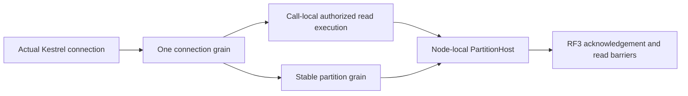

# ADR-125: Connection-owned Orleans execution

Status: Accepted; implementation and qualification in progress.

Current owner-selected verification stage (2026-10-09): finish the real local
KeyLoad functional smoke through SDK and the official MCP client against
fixture-owned Aspire Docker RF3. Exercise stored read/write outcomes, one physical
connection with concurrent independent commands, fresh authorization, cancellation
and actual connection cleanup. Do not start unrelated full test suites or further
GitHub performance runs in this iteration. Existing Linux performance qualification
remains open; local functional evidence does not establish a performance gain.

Owner: KeyLoad root integration owner. Decision: owner clarification 2026-10-09.

## Purpose and decision

One accepted physical Kestrel connection owns one lazily activated Orleans
ConnectionGrain. Reusing a connection never creates a request or read grain for
each operation. This owner decision supersedes the former separately activated
request/read boundary, including ADR-065 and ExecutionPrimitives descriptions.
Each operation still has a unique signed request GUID, stable command receipt ID,
fresh persisted authorization, bounded native context and original work cleanup.
ZoneTree handles, partition commits, replication and read cuts keep their existing
node-local ownership and genuine RF3 contracts.

## Frozen implementation contract

- The physical connection middleware issues one opaque GUID in a typed connection
  feature. HTTP features inherit it from Kestrel. No client header, principal,
  HttpClient instance or MCP session ID can choose this owner. Current MCP remains
  stateless and this change does not deliver native SQL session interoperability.
- Native GrainRequestContextState gains a stable field 2 for ConnectionId. The
  signed envelope binds request identity, subject, operation and expiration;
  server-owned context separately binds the execution owner. It does not confer
  authorization. ConnectionGrain validates both before executing an operation.
  Downstream capability and partition calls retain original request identity.
- IConnectionGrain uses the existing native streaming contract for independent
  operations. Operation state remains local to the enumerator. Native stream
  extensions interleave, so admission/close invariants use a bounded joined owner;
  no blanket Reentrant attribute or commit-order change is permitted.
- CloseAsync is AlwaysInterleave and accepts a dedicated generated signed control
  containing purpose, incarnation, owner ID and expiration. Control cannot execute
  a database effect. It closes admission, cancels and joins original operations,
  then requests DeactivateOnIdle. Sibling operation cancellation affects only that
  operation. ProducerDisposed observations still follow original disposal.
- Defaults: at most 4096 admitted transport connections per node, 8 operations per
  connection, no queued operation admission, and a two-minute idle transport expiry
  when no operation is active. Typed validated options own these limits. Existing
  silo producer/frame caps remain 64/128; comparison must not widen them.
- The middleware uses ConnectionClosed and its original finally for disconnect;
  RequestAborted belongs to one operation. Idle expiry aborts the actual transport.
  Host shutdown closes connection admission and joins connections before stopping
  the silo/storage. Reconnect obtains a fresh owner ID. Silo/process loss discards
  disposable owners; receipt retry and uncertain writes keep existing semantics.
  Transport cleanup must cancel and join the original native caller enumerators
  and their producer disposal before the signed grain close/deactivation. Pinned
  [Orleans 10.4 native caller disposal](https://raw.githubusercontent.com/dotnet/orleans/v10.4.0/src/Orleans.Core.Abstractions/Runtime/AsyncEnumerableRequest.cs)
  sends its final DisposeAsync RPC even after enumeration terminated. Deactivating
  first can let that late RPC activate an empty owner again. Native fixture close
  must follow the same ServerConnectionFeature order, retaining all original task,
  producer-disposal and zero-activation assertions. The first repaired local eight
  cases passed seven; its close case exposed this fixture ordering error. Original
  RPC evidence shows close completed in12.67ms and deactivated before the late
  DisposeAsync. Corrected-source native and actual RF3 evidence are still pending.
- Background/provider/startup work uses one explicitly registered bounded owner
  per silo service lifetime. Coordinator and nested effects reuse their existing
  bounded owner/context, never generate a new execution owner per operation.
  Authenticated peer transport may use its actual accepted connection feature.
- Read capability behavior is extracted into call-local execution on the same
  connection grain. Preserve barriers, policy reload, scoped cuts, expiry,
  cancellation, remote reads, work leases and fault observations. There is no
  independently keyed DatabaseReadGrain or rejected production fallback.
- First release uses one homogeneous current contract. Change internal RPC alias
  to keyload.connection.v1 and version 5, context alias to keyload.request.context.v2;
  do not retain old production contracts. No persisted storage/public JSON format
  or canonical identity digest changes are part of this decision.

## Requirements, stages and ownership

Related: REQ/AC-CLIENT-CONNECTION-001/002 and REQ/AC-ORL-013. Task:
TASK-CLIENT-CONNECTION, with TASK-ORL-REQUEST-LIFETIME now connection call cleanup.

1. Root freezes this contract and owns shared contracts/context/control codec,
   typed options, Server ClientApi connection lifecycle, authentication/gateway,
   OrleansNode execution and host shutdown, feature docs and status.
2. Connection runtime owner implements ClusterRouting Grains/ConnectionGrain,
   Queries connection read execution, Streaming joined operation ownership, and
   Orleans background/nested call routing. It preserves concurrent feature work.
3. Test owner adapts native fixture scopes and writes complete connection operation,
   isolation, authorization, capacity, lifecycle and RF3 SDK/official MCP cases.
   Native IManagementGrain inventories prove actual activation reuse/removal.
4. GitHub evidence owner recovers the exact immutable baseline Benchmarks run and
   collects original artifacts. Root joins all source writers at one barrier,
   builds once, runs mapped native TUnit scopes, reviews quality, commits/pushes
   the coherent completed stage, and observes delivered-source Linux gates.
5. Compare matching isolated Linux canonical workload cells at 100k/1m actual
   records and at least 100k operations. Record p50/p95/p99, completed throughput,
   errors, stored correctness, CPU/RAM and available allocations separately.
   Existing AllocatedBytes is client-only; missing server allocation/activation
   sampling remains unmeasured. No local benchmark or special benchmark mode.

## Rollout, rollback and evidence

Deploy only a homogeneous verified RF3 cohort. Failed qualification blocks the
performance claim and delivery gate, without weakening authorization or cleanup.
Before initial release rollback means reverting the whole stage at source and
redeploying a homogeneous previously qualified build; there is no runtime legacy
fallback or data migration. Retain exact source/run/attempt and original failures.

Implementation is in progress. A documentation commit, callback or configured cap
does not prove connection reuse, native deactivation, server RAM recovery or a
performance improvement. Unit/development proof cannot substitute for RF3 and
original Linux GitHub performance qualification.

## Explicit HTTP/2 transport implementation contract

HTTP/2 multiplexing is the public transport for proving concurrent operations on
one actual accepted TCP connection. ClientApi ServerExecutionOptions owns
EnableHttp2 (false until explicitly enabled) and Http2Port (default 8081, accepted
range 1..65535). ServerConnectionTransportComposition.Configure registers the
native Kestrel option/configuration loader composition before host construction.
It preserves existing Kestrel endpoint definitions. When no endpoint definitions
exist, it retains the effective original urls setting, or HTTP_PORTS/HTTPS_PORTS
settings, as equivalent configured endpoints before adding the dedicated http2
endpoint. An unconfigured original listener keeps Kestrel's localhost:5000 default.
Existing endpoint protocol defaults, certificate configuration, body bounds and
server-owned connection middleware apply through the same native loader. The
dedicated listener binds all IPv4 interfaces and uses HttpProtocols.Http2; its
cleartext callers must explicitly select HTTP/2 prior knowledge. No protocol
negotiation on the existing cleartext HTTP/1.1 listener is implied. The native
configuration behavior is documented by [Microsoft's Kestrel endpoint contract](https://learn.microsoft.com/en-us/aspnet/core/fundamentals/servers/kestrel/endpoints?view=aspnetcore-10.0).
The existing HTTP/1.1 transport executes sequential requests on one physical
connection. Genuine overlapping public calls use the configured HTTP/2 listener;
native grain overlap and bounded independent operation admission remain mandatory.

AppHost ClusterReplication resources add a direct, unproxied named http2 endpoint
on container target port 8081 for each actual RF3 node, and configure
KeyLoad__ServerExecution__EnableHttp2=true and
KeyLoad__ServerExecution__Http2Port=8081. The original http endpoint, target port
8080, peer addresses, persisted identity and readiness remain unchanged. The
container endpoints are discovered through Aspire, including the six-node
two-RF3 topology where applicable; clients do not construct substitute addresses.

The shared SDK ClientApi transport copies the supplied HttpClient's
DefaultRequestVersion and DefaultVersionPolicy into every created
HttpRequestMessage. Official MCP SDK 2.2 creates explicit HTTP/1.1 requests;
its real persistent HTTP/1.1 flow verifies reuse and authorization. Actual SDK
HTTP/2 overlap acceptance uses SocketsHttpHandler with MaxConnectionsPerServer=1,
EnableMultipleHttp2Connections=false, HTTP version 2.0 and RequestVersionExact,
then proves independent signed operations and commands overlap on the same
server-issued connection owner while selected cancellation leaves its sibling
successful. Disconnect/idle/shutdown must join original operations on this same
listener. Original HTTP/1.1 caller flows and RF3 receipts remain mandatory. This
is transport correctness evidence, not a benchmark result or performance claim.

Owned files: Server Features/ClientApi/Configuration/ServerExecutionOptions.cs;
Hosting/ServerConnectionTransportComposition.cs; AppHost feature-local connection
endpoint composition and ClusterReplication/ClusterRouting resource joins;
Client Features/ClientApi/Transport request creation. Root wires ServerConfiguration
and owns the joined verification barrier; the test owner supplies actual SDK and
official MCP acceptance through the discovered endpoint.

## Native failure serialization contract, 2026-10-09

REQ/AC-CLIENT-CONNECTION-002 and REQ/AC-ORL-013 require native admission and
signed-close rejection to retain the actual KeyLoadException domain code, HTTP
status and safe message across the original Orleans RPC. First native execution
passed five cases and failed two. Its original RPC spans for AC-CRS-053
StartEnumeration and AC-CRS-054 CloseAsync contain CodecNotFoundException:
`Could not find a codec for type KeyLoad.KeyLoadException.` The server-side
wrong-owner close span contains the original domain rejection. This confirms
missing KeyLoad-owned exception serialization; fixture cleanup additionally
obscured that primary failure and must preserve both original and cleanup faults.

Root owns the existing shared KeyLoadException declaration in
Abstractions/Contracts.cs. Before the next native run, add GenerateSerializer,
the stable alias `keyload.error.v1`, and member IDs 0 for Code and 1 for
StatusCode. Its Exception base uses the native Orleans base codec for message,
inner cause and native exception state. Preserve public constructors, domain
codes and HTTP/JSON problem shape. This is a new internal RPC type contract for
the homogeneous current deployment, with no persisted-format migration.
Do not add a fallback serializer, widen exception namespace admission or replace
typed failures with generic errors.

The test owner preserves primary failures before scenario disposal and cancels,
joins and observes the original caller/producer tasks. AC-CRS-053/054 remain
real negative RPC regressions with the original domain-code assertions. A focused
native serializer roundtrip also checks a nondefault Code/StatusCode, safe message
and existing inner cause. Joined unit and RF3 verification, followed by exact-source
Linux delivery, are required; source attributes alone do not qualify this repair.

## Connection execution RF3 local-image cohort, 2026-10-09

ADR-125's REQ/AC-CLIENT-CONNECTION-001/002 and REQ/AC-ORL-013 reuse the
existing ADR-119 TUnit-owned actual-image preparation and explicit child identity.
The additional exact selector is:

    /*/*/(ConnectionRf3SequentialTests|ConnectionRf3OverlapTests|ConnectionRf3AuthorizationTests)/*

It owns all five expanded native SDK/official MCP instances, including actual
HTTP/2 same-connection overlap. No wildcard/subset/mixed-image or GitHub identity
exception is added. ConnectionRf3Scenario starts LocalRf3ImageTestSession,
passes its explicit Selection through RequestCqrsRf3ImageProof and wave startup,
verifies the three modeled tags and actual image IDs, and joins the original
wave before exact-tag cleanup. Existing caller defaults remain unchanged when
this selector is absent. Native arguments propagate explicitly without ambient
image mutation. The established closed private CQRS probe profile remains
required for bounded actual operation/activation witnesses. Native-image
preparation and source receipt verification precede RF3 startup; no stale image,
manually started nodes or local benchmark execution is admitted. All measured
qualification remains original Linux GitHub evidence. Complete existing positive/
negative native selection tests remain mandatory alongside actual five RF3 flows;
adding selector code alone does not pass either gate.

## Local functional execution evidence, 2026-10-09

The owner-selected local development stage completed eight native Orleans
connection flows (8 passed, 0 failed/skipped, 5.374s) and the five actual
SDK/official MCP Aspire Docker RF3 flows (5 passed, 0 failed/skipped,
native exit0, 8m33s985ms). The latter ran from22:26:51Z to22:35:24Z.
The original report is
`TestResults/connection-rf3-local-catalog-repaired/KeyLoad.IntegrationTests_net10.0_arm64.trx`,
SHA256 `3b58cab7c1d33a5a655f9e60656557eba0da9dadfdee1877d68478ab37b4769e`.

AC-CRS-057 passed for both SDK and official MCP: actual persistent transport
reuse, committed create/read/update, stable-ID replay, failure followed by a
healthy operation, and joined disconnect. AC-CRS-058 passed on the actual SDK
HTTP/2 connection: a held command allowed an independent command and read to
complete, selected cancellation preserved the sibling, and native closure removed
the activation before reconnect/healthy continuation. AC-CRS-059 passed for both
clients: persisted authorization revocation did not leak across operations.
The exact custom120-second idle timer was not independently distinguished from
native keepalive; observed connection closure is functional lifecycle evidence.

Each case owned its fresh three-node deployment and unique native image invocation.
All five receipts have the same actual server input digest
`sha256:077cbb309ca1a6fe147086d10dbc2071868377468b7dfaebec3ec80b060be414`.
The strict original fixture retained image/model proof, discovered endpoints,
actual SDK/official MCP clients, full operation assertions and joined cleanup.
The caller used the exact five-instance selector above with scoped
`TMPDIR=/private/tmp`, preserving the no-symlink guard. No broader test suite or
additional GitHub performance activity was selected.

The local full-solution Release checkpoint at22:05Z passed with0warnings/errors.
A later integration-reference build encountered two CS0103 findings for
SampleChunkSnapshotFile during concurrent TimeSeries work. The unchanged selected
connection runner was already compiled; each smoke case freshly built the real
server image. Server startup additionally required the existing sample-chunk tool's
missing explicit description, documented under TASK-CLIENT-NATIVE-CATALOG-079 in
ClientApi/ADR-039. The original startup and fixture-order failures remain history.

These are local macOS/arm64 development results from the shared working checkout.
Complete exact-source Linux suites, fault/endurance gates, comparative100k/1m
workloads, server allocations/RAM and performance activation sampling remain open.
Runtime/performance qualification and full-task completion are not promoted.

### KL039 call-local original posting observation
TASK-KL039-PUBLIC-RETAINED-READER in [OnlineGenerationLifetime](../Features/Search/OnlineGenerationLifetime.md) uses the actual reused ConnectionGrain/call-local ConnectionReadExecution and original independently signed operation identity/context. The existing Query.ExecuteAsync branch installs an armed, bounded AsyncLocal observation scope only for that call; the SAME actual selected FTS iterator invokes appended closed NativeTextOriginalPostingRead after snapshot join. Original codec verifies current identity/context and joins the callback task/cancellation before native reader disposal. Scope restoration is exact; ordinary unarmed calls retain no observer, identity, completion history or new activation. Public SDK/MCP/Q1 original hold→completed swap→result/refusal→producer join→healthy/replay/cold source tests map this seam without asserting a fabricated activation count or native PASS.

### KL039 original posting observer arm admission closure

The `NativeTextOriginalPostingRead` fixture phase is admitted only for the actual public `GrainReadKind.Search`, `Hold` action and empty command identity. The existing generic read/empty-command invariant remains mandatory. Every other kind/action must refuse before claiming an arm. This closed fixture-only validation preserves the original connection-owned Query call, signed identity, current persisted authorization, original reader/task joins and all resource/deadline limits. It does not introduce another reader, execution or diagnostic payload. The public retained-reader SDK/MCP/Q1 positive/cancel operation regressions provide the genuine admitted flow; native Linux compiler/discovery/runtime and refused-arm qualification remain open. This appendix depends on the exact prior 46-path retained-reader successor, whose immutable bytes remain unchanged.

## Same-owner MultiLane child execution, 2026-10-10

TASK-MSG-CONNECTION-CHILD-001; REQ-MSG-007 / AC-MSG-007; ADR-125.
REQ-CLIENT-CONNECTION-CHILD-001: an already running connection parent borrows that actual owner's existing ExecuteStreamAsync method for each signed MultiLane leaf, instead of invoking an outgoing RPC to itself. The callable is passed privately by the actual owner; it is not DI, a caller credential, a public interface, a new dispatcher or an authorization capability.
AC-CLIENT-CONNECTION-CHILD-001: two genuine queue claims use the same observed native GrainId/ActivationId as their parent, unique operation identities, actual signed Receive commands, complete deliveries and canonical outcomes. All three producers settle. Exact original-leaf replay leaves the complete canonical image and position unchanged; original delivery ACKs and a following document operation succeed on that same activation; signed close joins and removes it. Existing 14 MultiLane whole cases and three public RF3 cases remain mandatory for denial, invalid groups, expiry, unknown replies, cancellation and healthy continuation.

Ordered implementation: preserve actual parent validation and fresh persisted principal; create the original native child identity scope and signed envelope; call the borrowed method with the original cancellation token; use unchanged bounded native stream admission, VerifyRequest/ValidateConnection, partition routing, Graph-authorized partition call and native work leases; drain and join the actual producer before exact parent context restoration. Keep all catch filters, partial outcome meanings, pending/unknown contracts, quotas and deadlines. The only changed invocation is self-RPC to private method-group. No public/serializer/persistence identity changes.

Ownership: ConnectionGrain, MultiLaneReceiveExecution, existing test ConnectionOperationObservation plus a Messaging same-owner complete-operation case/trial. ConnectionGrain preimage is the exact approved KL039 post-Capture proposed file, including its OnlineText GrainContext argument. Preserve that independently owned path. Audit confirms analogous self-RPC in Ann/Text/Online children; those are explicitly separate scope and not repaired by this packet.

Rollback is the two invocation changes together; tests/docs remain accurate. No dependency repair is claimed: pinned Graph intentionally refuses unqualified self-transitions. R32 mixed-binary Event3 is retained as history, not proof of cause or qualification. Root-only clean normal/scalar14, new native case and genuine Docker/Aspire SDK/MCP/Q1 cases are pending; no UID/count/PASS edits.

## Same-owner search parent children, 2026-10-10

TASK-SEARCH-CONNECTION-CHILD-001; REQ-CLIENT-CONNECTION-001/002 and AC-CLIENT-CONNECTION-001/002; ADR-125. Related existing REQ/AC-ANN-007, FTS-003/004/005 and ONLINE-001..005 retain all native generation, receipt, authority and recovery gates.

REQ-SEARCH-CONNECTION-CHILD-001: Ann, Text and OnlineText connection parents execute their separately signed child capabilities by borrowing the SAME actual ConnectionGrain.ExecuteStreamAsync implementation, never an outgoing RPC to that same activation. The actual private owner supplies the delegate. No public caller/DI observer can supply execution authority; this introduces no activation, dispatcher, scheduling attribute or Graph transition change.

AC-SEARCH-CONNECTION-CHILD-001: original native and Docker/Aspire SDK, official MCP and both SQL caller operation flows retain owner-mismatch refusal with full unchanged source corpus, genuine maintenance build/restore/publication, exact original receipt replay, bilingual update/delete complete literals, native lease/cancellation/unknown and joined Abort semantics, and same-root cold recovery. Existing tests are the regression flows, with their exact Args/complete assertions unchanged; do not substitute setter/parser/validation tests.

Stages: the actual ConnectionGrain method-group is passed to each existing parent and child-call owner. Keep parent scope validation, identity validation, fresh persisted principal/Admin check, actual child RequestId/CommandId, native signed envelope and original expiry. Create the same native identity scope; call the borrowed existing ExecuteStreamAsync inside the original Drain producer; retain its bounded owner/work admission, signature and connection verification and original child cancellation. Partition commands still invoke the actual Graph-authorized CommandPartitionGrain path. Drain/dispose the actual producer before identity scope restoration. Preserve unknown-write mapping and nonfatal/fatal behavior, every Abort primary/cleanup ledger and original native session. OnlineText keeps frames.ObserveChild over that exact borrowed stream, original parent expiry and post-Capture observer's actual GrainContext.

Exact ownership: ConnectionGrain plus AnnMaintenanceExecution/ChildCalls, TextMaintenanceExecution/ChildCalls, OnlineTextExecution/ChildCalls. No leaf/public/persisted/wire schema, alias/Id, placement, generation, native storage, quota, timing or default change. All seven source edits are delegate type/parameter forwarding and the existing stream creation call only. Parent flow algorithms remain untouched.

Dependencies: ConnectionGrain starts at immutable MultiLane8 proposed postimage (itself includes KL039 post-Capture14); OnlineTextExecution/ChildCalls and OnlineGenerationLifetime start at the exact immutable KL039 post-Capture14 proposed postimages. ClientApi/ADR125 start at immutable MultiLane8 docs. Preserve native context observer and every existing appendix by explicit composition. Other files use exact current live bytes. Roll back only this invocation chain, together, without changing persisted/native authorities.

The clean original R32 MultiLane14 failed 14/14 with source and binaries coherent. Its Event3 CapabilityExecution/Unexpected/UnknownWriteOutcome is not an exception-chain proof of this self-RPC cause. Source establishes the invalid outgoing self-boundary against pinned Graph's same-ID contract; root must run original clean normal/scalar and the complete related native/recovery/RF3 cases after this repair. No runtime/PASS, native UID/count/selector or dependency release claim.

## TASK-CRS-NATIVE-STARTUP-CALLER-JOIN-001

REQ-CLIENT-CONNECTION-001/002 and AC-CRS-050..056/060 under ADR-125: the genuine native Connection fixture startup belongs to the SAME original operation caller and must settle before its disposal starts. Its existing 30-second startup deadline and the original 20-second whole-operation caller deadline remain unchanged. Link both tokens into actual TestCluster.DeployAsync and await that original task directly; do not detach deployment with WaitAsync. Ordinary shared IAsyncInitializer startup delegates with CancellationToken.None and retains its original bounded behavior. Native host/client initialization, original fatal/nonfatal startup plus cleanup ledger, actual stop/disposal/owner release remain unchanged.

Authentic source059/run38019624472 has RequestCqrs shared67, NativeCqrs6, Connection9 normal/8 scalar cancellation failures. Those are three distinct original stacks. This source repair establishes an actual caller/deployment lifetime defect, not the unproven historical cause: the ZIP has no native silo startup logs, and client First-stage or membership cancellation is insufficient to infer resource contention, port collision or dependency failure. Keep every original failed artifact.

Implementation ownership: Unit ClusterRouting Fixtures/RequestCqrsFixture.cs and ConnectionNativeScenario.cs only; no production, Graph, scheduling, slots, topology, policy, signature, identity, storage, clock, limits or test argument changes. Existing AcCrs050..056/060 whole operations retain all exact receipt/model/replay/revoke/cancel/capacity/management-removal assertions. Root must run original normal/scalar fixtures plus all required suites on coherent binaries, with detailed original startup logging before any startup-cause claim. Source preview/reconstruction is not runtime PASS.
