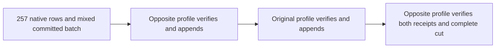

# ADR-126: Current native ZoneTree checksum profile

Status: Accepted; implementation and runtime qualification pending.
Date: 2026-10-10.
Features: StorageRecovery, BackupRestore and ClusterReplication.
Related: REQ-STORAGE-004/007/010, REQ-NATIVE-WAL-PROFILE-001..003,
AC-NATIVE-WAL-PROFILE-001..003, ADR-071, ADR-105 and ADR-116.
Tasks: KL-035 and KL-043; no task closes from a package pin.

## Problem and decision

The original Linux [KL-035 scalar run](https://github.com/managedcode/KeyLoad/actions/runs/38026072274)
for source64154088b8d9b51620dd78c977bf6a79c76b7799 rejected every inspected
native WAL record with a checksum error after a current RF3 snapshot operation.
The pinned ZoneTree1.9.9 selected CPU-dependent CRC implementations. Its real
cross-profile reproduction is recorded in [upstream issue182](https://github.com/ZoneTree/ZoneTree/issues/182).
The maintainer closed that issue after [PR184](https://github.com/ZoneTree/ZoneTree/pull/184)
and published [ZoneTree2.0.0](https://github.com/ZoneTree/ZoneTree/releases/tag/release-v2.0.0).

Select the actually published ZoneTree2.0.0 as the current native provider and
centrally pin its System.IO.Hashing10.0.12 dependency. Keep the selected
ZoneTree.FullTextSearch1.0.9; its published dependency minimum1.8.7 admits this
resolution, but only real indexing/search/reopen tests establish compatibility.
The original NuGet package was downloaded from its declared feed URL; its SHA-512
matches the NuGet catalog and SHA-256 is
f15bc8fc307f7ea7e123a42f8dfe788cbb02673c84c2bd9008fe7ac37ad81301.
Its repository metadata binds source5d24bf5f46772facbe4e40e355b2ed1aa6e66c9b.

The native provider now computes the low32 bits of XXH3-64 over its explicit
little-endian WAL header and exact key/value bytes. Use the published provider
unchanged. KeyLoad owns no substitute checksum implementation or alternate
reader. Its own current identity epoch7, atomic WAL4, checkpoint5, generated
aliases/field IDs, native raw-byte serializers, Sync WAL, uncompressed provider,
node-local locks/apply ownership, replication journals and RF3 ACK barriers remain
the existing contract. New qualification creates current stores and reopens those
same stores with the same published dependency cohort. An earlier development
cohort is not converted or presented as this current-format evidence.

## Requirements and measurable acceptance

- REQ-NATIVE-WAL-PROFILE-001 -> AC-NATIVE-WAL-PROFILE-001: a genuinely committed
  mixed document/event/queue cut plus257 variable-length UTF8 native records
  survives four actual graceful-close child processes: enabled seed, disabled
  verify/append, enabled verify/append, disabled final verify, and the reverse.
  Both append operations have distinct full receipts and exact document effects.
  Require actual hardware eligibility for enabled children and disabled
  intrinsics for scalar children before storage opens. Before replay, compare
  every bounded native key/value row and every original corpus record,
  exact position, node/incarnation and current generation; afterwards verify
  full original/fresh receipts, changed-body Conflict and cold healthy effects.
  NativeChecksumProfileRecoveryTests owns these whole operations.
- REQ-NATIVE-WAL-PROFILE-002 -> AC-NATIVE-WAL-PROFILE-002: current Sync WAL,
  ordinary/scalar operation suites, real process recovery and genuine Aspire RF3
  snapshot install/ordered tail/public SDK and official MCP replay/cold gates
  pass with original source/DLL/PDB/package/image identities. Native checksum
  controls cannot substitute for those RF3 or corruption gates.
- REQ-NATIVE-WAL-PROFILE-003 -> AC-NATIVE-WAL-PROFILE-003: solution restore/build,
  analyzer/formatter and real full-text indexing/search/rebuild/reopen flows pass
  without a package downgrade or consumer implementation. Keep the original
  failed run and new qualifying run separate. No power-loss, performance,
  coverage percentage or production readiness claim follows from this upgrade.

## Ordered implementation and ownership

1. Root verifies official issue/release/feed/source and package hash, records this
   contract and the owning StorageRecovery criteria before changing central pins.
   Directory.Packages.props and this ADR/index are root-owned.
2. CrashHost StorageRecovery Contracts/Helpers/Assertions and RecoveryTests
   StorageRecovery Cases/Processes strengthen the bounded current-only profile operation
   through the existing child/StorageTrialLease/failure/cleanup owners.
   Existing budgets, 50 native TUnit slots and test-owned Aspire remain unchanged.
   The regression worker owns only NativeChecksumProfile helpers/contracts/cases;
   root owns dependency pins, shared documentation and integrated verification.
3. Root restores the actual NuGet closure, builds the complete Release solution,
   runs canonical formatter and targeted normal/scalar/process regressions,
   retaining original native UID/TRX/source/package/profile and cleanup evidence.
   Independent agents continue private source work while root serializes writers.
4. Commit/push the scoped dependency and regression stage, preserving unrelated
   working-tree changes. Original Linux CI then
   exercises all required normal/scalar/recovery/RF3 and full-text gates. Update
   canonical task qualification only from those exact original artifacts.

Integration joins: the closed CrashHost mode dispatch, original native child pipe
owner, central transitive dependency resolution, full current-image Docker build
and existing snapshot/backup/restore qualification. No new application endpoint,
server SIMD setting, database policy or storage authority is introduced.

The 2026-10-10 public NuGet audit covers every central package and native coverage
tool plus Aspire.AppHost.Sdk and the local Roslynk tool (already current 2.1.0).
Update only available published versions:
ManagedCode.Orleans.Graph10.4.4, native dotnet-coverage18.12.0 (matching the MTP
coverage extension), and Aspire.AppHost.Sdk13.6.1. The other central packages are
already current; alpha-only dependencies retain their selected published profile.
No dependency fork, new package or .NET target change is selected.

## Local development verification, 2026-10-10

The published dependency closure restores successfully. Focused canonical formatting
passes for the changed checksum fixtures. The complete R76 Release build passed
with zero warnings and errors. After the approved `AdvanceQueueDeadline.Kind`
JSON collision repair (`deadlineKind`, preserving the discriminator and Orleans
field IDs), the fresh RecoveryTests Release build also passed with zero warnings
and errors. The four-process regression now passes both directions: 2/2 cases,
zero failures and skips, on local macOS arm64. Each case verifies all 257 native
rows, both independent appends, complete original receipts and the final native cut.
Evidence: `TestResults/zonetree182/checksum/KeyLoad.RecoveryTests_net10.0_arm64.trx`.

The analyzer test suite passed 391/391 with no skips. Selected native-storage tests
passed 32/32 in both normal and scalar profiles with an owned non-symlinked root;
the earlier backup-path refusal came from the macOS default temporary-directory
symlink, and its policy remains unchanged. Complete formatting verification still
reports 281 diagnostics in unrelated current-checkout files, with none in the
checksum fixtures. A fresh complete build after the JSON repair, public JSON/MCP
round trips, Linux, complete recovery, RF3 and full-text qualification remain open.

## Failure, rollout and rollback

This is the first-release current provider profile under ADR-116. Missing,
corrupt or unsupported required current data remains a genuine refusal with the
original state and failure evidence preserved. An unknown receipt remains
unknown. No conversion command, old-cohort reader or checksum retry is selected.
If the new provider fails any required gate, qualification remains open and the
defect is reported to its actual upstream owner. Source rollback before delivery
can restore the selected pins coherently, using fresh owned test roots; it never
rewrites an existing WAL or labels another dependency cohort as equivalent.
