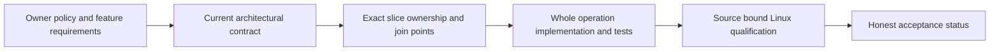

# Каталог архітектурних рішень

KeyLoad — одна composable база для AI agents: документи, таблиці, графи,
пошук, time series, blobs, черги та події поєднуються через авторизовані SQL,
SDK і MCP операції. Orleans виконує кожен запит через окремий request grain;
node-local PartitionHost володіє ZoneTree, журналами та ordered apply gate.
Початкова production topology — RF3, orchestration і тести належать Aspire.

[ADR-116](ADR-116-first-release-current-format.md) і
[CurrentFormat](../Features/StorageRecovery/CurrentFormat.md) визначають єдиний
поточний формат. [ADR-011](ADR-011-current-native-format.md) зберігає повний
контракт його recovery, backup та restore.
[ADR-017](ADR-017-ownership-session-tokens.md) визначає session tokens і
native ownership movement. Невідомі або пошкоджені формати відхиляються до ефектів.

Поточні shared contracts: [Orleans primitives](ADR-110-native-orleans-execution-primitives.md),
[typed runtime options](ADR-113-centralized-runtime-options.md),
[TimeProvider](ADR-115-time-provider.md),
[functional coverage](ADR-033-code-quality.md),
[MCP discovery](ADR-104-mcp-gateway-tool-discovery.md) та
[independent Website publication](ADR-112-independent-website-publication.md).
Build and Tests, Benchmarks, Website і Release мають окремі workflows.

`Accepted` означає прийнятий контракт, а не виконані acceptance-критерії.
`Proposed` означає невирішений вибір, який не можна рекламувати як готову capability.
Кожен ADR містить REQ/AC, ownership, ordered implementation, tests і verification;
[feature specifications](../README.md) та
[implementation status](../implementation/status.json) містять повну traceability.
Номери рішень стабільні; каталог містить лише наявні активні ADR.

## Активні рішення

| Рішення | Статус контракту |
|---|---|
| [ADR-001: Atomic partition identity and affinity](ADR-001-partition-identity-affinity.md) | Accepted |
| [ADR-002: Command identity and persisted idempotency](ADR-002-command-idempotency.md) | Accepted |
| [ADR-003: Durability profile and acknowledgement barrier](ADR-003-durability-ack-barrier.md) | Accepted |
| [ADR-004: Committed read views and pagination cuts](ADR-004-committed-read-views.md) | Accepted |
| [ADR-005: Canonical namespaces and ordered key codec](ADR-005-canonical-keyspace-codec.md) | Accepted |
| [ADR-006: Strict synchronous indexes and derived projections](ADR-006-strict-derived-indexes.md) | Accepted |
| [ADR-007: Orleans replica consensus and metadata bootstrap](ADR-007-replica-consensus-bootstrap.md) | Accepted |
| [ADR-008: Backup cuts and independent log retention](ADR-008-backup-log-retention.md) | Accepted |
| [ADR-009: Search provider and projection boundaries](ADR-009-search-provider-boundaries.md) | Accepted |
| [ADR-010: Bounded query execution and security barriers](ADR-010-query-budgets-security.md) | Accepted |
| [ADR-011: Current native format and restore authority](ADR-011-current-native-format.md) | Accepted |
| [ADR-012: Versioned KeyLoad SQL subset](ADR-012-sql-dialect.md) | Accepted |
| [ADR-013: One authorized query AST across interfaces](ADR-013-authorized-query-ast.md) | Accepted |
| [ADR-014: Persisted principals, scoped RBAC, and row policy](ADR-014-principals-rbac-row-policy.md) | Accepted |
| [ADR-015: Sensitive-data omission, use, and lineage](ADR-015-sensitive-data-lineage.md) | Accepted |
| [ADR-016: Atomic partitions packed into physical shards](ADR-016-atomic-physical-placement.md) | Accepted |
| [ADR-017: Commit and session tokens across ownership movement](ADR-017-ownership-session-tokens.md) | Accepted |
| [ADR-018: Global per-modality windows and weighted rank fusion](ADR-018-global-rank-fusion.md) | Proposed |
| [ADR-019: Managed-first ANN provider qualification](ADR-019-managed-ann.md) | Accepted |
| [ADR-020: Independent bounded query contexts](ADR-020-independent-query-contexts.md) | Accepted |
| [ADR-021: Comparable PostgreSQL performance baseline](ADR-021-comparable-postgres-baseline.md) | Accepted |
| [ADR-022: Policy epoch reauthorization at request and page boundaries](ADR-022-policy-epoch-revocation.md) | Accepted |
| [ADR-023: Separate lifecycle and authority for journals, events, CDC, and queues](ADR-023-journal-authority.md) | Accepted |
| [ADR-024: Catalog-bound shared TransactionDomain](ADR-024-transaction-domain-binding.md) | Accepted |
| [ADR-025: Stream revisions and stable per-atomic event-feed positions](ADR-025-event-revision-feed-positions.md) | Accepted |
| [ADR-026: At-least-once delivery with fenced leases and inbox effects](ADR-026-fenced-delivery-inbox.md) | Accepted |
| [ADR-027: Durable consumer groups with contiguous checkpoints](ADR-027-contiguous-subscription-checkpoints.md) | Accepted |
| [ADR-028: Persisted scheduling with logged evaluation time](ADR-028-persisted-scheduling-time.md) | Accepted |
| [ADR-029: Event and message classification with safe diagnostics](ADR-029-event-message-classification.md) | Accepted |
| [ADR-030: Retention pins and paused restore of an older cut](ADR-030-retention-paused-restore.md) | Accepted |
| [ADR-031: Modular all-in-one deployment with reserved control resources](ADR-031-modular-all-in-one-resource-isolation.md) | Accepted |
| [ADR-032: Preserve existing policy while adopting MCAF](ADR-032-mcaf-governance.md) | Accepted |
| [ADR-033: source-owned code quality and evidence gates](ADR-033-code-quality.md) | Accepted |
| [ADR-034: Reproducible Docker cluster comparisons and GitHub result graphs](ADR-034-cluster-comparisons.md) | Accepted |
| [ADR-035: bounded operation work and resource lifetime](ADR-035-memory-performance.md) | Accepted |
| [ADR-036: Orleans foundation and client-driven qualification](ADR-036-orleans-foundation.md) | Accepted |
| [ADR-037: Повний каталог функцій і архітектурних рішень](ADR-037-documentation-coverage.md) | Accepted |
| [ADR-038: Canonical chunked BlobStorage and bounded reads](ADR-038-chunked-blob-storage.md) | Accepted |
| [ADR-039: Official MCP SDK і agent access до canonical operations](ADR-039-official-mcp-agent-api.md) | Accepted |
| [ADR-040: Static product website, conceptual Three.js and qualified evidence](ADR-040-static-site-threejs-evidence.md) | Implemented |
| [ADR-041: read-only public collections with stable wire bytes](ADR-041-read-only-public-collections.md) | Accepted |
| [ADR-042: explicit command admission and inbox resource ownership](ADR-042-admission-resource-ownership.md) | Accepted |
| [ADR-043: comparative harness library and executable host](ADR-043-comparison-library-host.md) | Accepted |
| [ADR-044: immutable comparative harness contracts](ADR-044-benchmark-immutable-contracts.md) | Accepted |
| [ADR-045: Owned PostgreSQL comparison schemas and constant commands](ADR-045-postgres-schema-ownership.md) | Accepted |
| [ADR-046: Cohesive node-local storage owners under numeric gates](ADR-046-storage-private-owners.md) | Accepted |
| [ADR-047: public embedded benchmark scenarios and typed executable](ADR-047-embedded-benchmark-host.md) | Accepted |
| [ADR-048: bounded owned storage metadata](ADR-048-bounded-storage-metadata.md) | Accepted |
| [ADR-049: Genuine Neo4j harness and acknowledged cleanup ownership](ADR-049-genuine-neo4j-harness.md) | Accepted |
| [ADR-050: Isolated TimeSeries and Timescale comparison profile](ADR-050-timeseries-timescale-comparison.md) | Accepted |
| [ADR-051: same-origin read-only administration console](ADR-051-admin-dashboard.md) | Accepted |
| [ADR-052: bounded TimeSeries latest and raw aggregates](ADR-052-timeseries-bounded-aggregates.md) | Accepted |
| [ADR-053: one light KeyLoad visual identity for the console and the site](ADR-053-unified-visual-identity.md) | Accepted |
| [ADR-054: Central SQL over canonical database operations](ADR-054-central-sql.md) | Accepted |
| [ADR-055: Typed relational rows in canonical entity storage](ADR-055-typed-relational-rows.md) | Accepted |
| [ADR-056: Isolated Linux comparison cells and complete evidence aggregation](ADR-056-isolated-linux-comparison-cells.md) | Accepted |
| [ADR-057: Native Orleans binary atomic WAL](ADR-057-orleans-atomic-wal.md) | Accepted |
| [ADR-058: Orleans-coordinated disposable cache memory](ADR-058-orleans-coordinated-cache-memory.md) | Accepted |
| [ADR-059: separate native intensive TimeSeries family](ADR-059-isolated-intensive-timeseries.md) | Accepted |
| [ADR-060: generated native internal serialization](ADR-060-native-internal-serialization.md) | Accepted |
| [ADR-061: bounded node-owned replica term metadata](ADR-061-bounded-replica-term-metadata.md) | Accepted |
| [ADR-062: Workflow responsibility and qualification boundaries](ADR-062-workflow-separation.md) | Accepted |
| [ADR-063: bounded callback-free database phase profiling](ADR-063-bounded-database-phase-profiling.md) | Accepted |
| [ADR-064: Four workflows and source-bound release delivery](ADR-064-workflow-release-delivery.md) | Accepted |
| [ADR-065: Full SQL syntax and client protocol](ADR-065-full-sql-client-compatibility.md) | Accepted |
| [ADR-067: One composable database for AI agents](ADR-067-composable-agent-database.md) | Accepted |
| [ADR-068: Native benchmark gate repair](ADR-068-native-benchmark-gate-repair.md) | Accepted |
| [ADR-069: Representative scaled workload qualification](ADR-069-representative-scaled-workloads.md) | Accepted |
| [ADR-071: Canonical ZoneTree storage and full-text providers](ADR-071-canonical-zonetree-providers.md) | Accepted |
| [ADR-072: Authorized SQL event and queue read views](ADR-072-authorized-sql-model-views.md) | Accepted |
| [ADR-073: Logged bounded time-series retention](ADR-073-logged-series-retention.md) | Accepted |
| [ADR-074: One Aspire-owned test entry point](ADR-074-aspire-owned-test-entry.md) | Accepted |
| [ADR-075: Bounded aggregate snapshots and pure replay](ADR-075-bounded-aggregate-snapshot-replay.md) | Accepted |
| [ADR-076: Publish only the complete current comparison cohort](ADR-076-current-cohort-publication.md) | Accepted |
| [ADR-078: Bounded native full-text candidate generations](ADR-078-native-full-text-projection.md) | Accepted |
| [ADR-079 — Bounded lossless time-series chunk codec qualification](ADR-079-lossless-series-chunk-codecs.md) | Accepted |
| [ADR-080: Isolate benchmark failures during publication](ADR-080-benchmark-failure-isolation.md) | Accepted |
| [ADR-081 — Awaited bounded native search execution](ADR-081-awaited-native-search-execution.md) | Accepted |
| [ADR-082 — Native Orleans CQRS streams](ADR-082-native-cqrs-streams.md) | Accepted |
| [ADR-083 — Bounded native CQRS HTTP consumption](ADR-083-cqrs-http-transport-bounds.md) | Accepted |
| [ADR-085: Visible bounded native benchmark progress](ADR-085-live-benchmark-progress.md) | Accepted |
| [ADR-086: Stop owned test workloads on terminal Aspire failure](ADR-086-aspire-terminal-failure.md) | Accepted |
| [ADR-087: Filtered retrieval in the authorized search cut](ADR-087-filtered-retrieval.md) | Accepted |
| [ADR-088: Durable remote queue intent and receipt](ADR-088-remote-queue-transfers.md) | Accepted |
| [ADR-089: Canonical guarded vector projection lineage](ADR-089-event-projection-lineage.md) | Accepted |
| [ADR-090: Same-cut graph scope, retrieval and expansion](ADR-090-graph-search.md) | Accepted |
| [ADR-092: Logged-time recurring occurrences and saga timeout CAS](ADR-092-recurring-saga.md) | Accepted |
| [ADR-093: Compare-and-set resource field policies](ADR-093-resource-policy-updates.md) | Accepted |
| [ADR-094: Orleans coordination of canonical recurring and saga due work](ADR-094-orleans-due-coordination.md) | Accepted |
| [ADR-095: Bounded native index generation leases and retirement](ADR-095-online-generation-leases.md) | Accepted |
| [ADR-096: Bounded comparable global modality windows before fusion](ADR-096-global-branch-windows.md) | Accepted |
| [ADR-097: Provider-owned native read-cut leases](ADR-097-native-read-cut-leases.md) | Accepted |
| [ADR-098: Bounded authorized shortest paths](ADR-098-bounded-graph-paths.md) | Accepted |
| [ADR-099: RF3 physical shard catalog foundation](ADR-099-physical-shard-catalog.md) | Accepted |
| [ADR-100: Internal bounded Q1 merge across local atomic partitions](ADR-100-local-partition-query-merge.md) | Accepted |
| [ADR-101: Explicit atomic-partition placement directory](ADR-101-explicit-atomic-partition-placement.md) | See decision |
| [ADR-102: Same-owner cross-partition graph edge delivery](ADR-102-cross-partition-graph-edges.md) | Accepted |
| [ADR-103: Bounded scaled database comparison stage](ADR-103-scaled-fair-comparisons.md) | Accepted |
| [ADR-104: Native ManagedCode gateway and graph-based MCP discovery](ADR-104-mcp-gateway-tool-discovery.md) | Accepted |
| [ADR-105: Published NuGet dependency refresh](ADR-105-published-nuget-upgrade.md) | Accepted |
| [ADR-106: Fenced movement of a complete atomic partition between physical owners](ADR-106-partition-owner-movement.md) | Accepted |
| [ADR-107: Elastic License 2.0](ADR-107-elastic-license.md) | Accepted |
| [ADR-108: Typed synchronization and Orleans state ownership](ADR-108-typed-synchronization.md) | Accepted |
| [ADR-109: Native vector qualification and additional comparison databases](ADR-109-native-vector-comparisons.md) | Accepted |
| [ADR-110: native Orleans execution and scheduling primitives](ADR-110-native-orleans-execution-primitives.md) | Accepted |
| [ADR-111: Semantic rules for magic runtime values](ADR-111-magic-runtime-values.md) | Accepted |
| [ADR-112: Independent Website publication with optional benchmarks](ADR-112-independent-website-publication.md) | Accepted |
| [ADR-113: General runtime literals and centralized typed options](ADR-113-centralized-runtime-options.md) | Accepted |
| [ADR-114: verified backup artifact publication](ADR-114-verified-artifact-publication.md) | Accepted |
| [ADR-115: TimeProvider ownership](ADR-115-time-provider.md) | Accepted |
| [ADR-116: one current format before the first release](ADR-116-first-release-current-format.md) | Accepted |
| [ADR-117: native TUnit CI entry](ADR-117-native-tunit-ci-entry.md) | Accepted |
| [ADR-118: bounded typed-row INNER JOIN](ADR-118-bounded-relational-inner-join.md) | Accepted |
| [ADR-119: TUnit-owned local membership image](ADR-119-tunit-owned-local-membership-image.md) | Accepted |

| [ADR-122: Native comparable benchmark methodology](ADR-122-native-benchmark-methodology.md) | Accepted |
