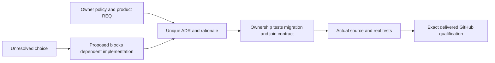

# Каталог архітектурних рішень

[ADR-067: One composable database for AI agents](ADR-067-composable-agent-database.md)
фіксує головну ідею: всі моделі співіснують, посилаються одна на одну і
поєднуються через SQL в одному bounded запиті. Перший executable stage читає
чергу й будує граф або читає граф і створює queued actions в одній atomic partition;
повний declarative SQL та qualification залишаються окремими обов'язковими gates.

Номери ADR стабільні. `Accepted` фіксує нормативний direction/contract, а не готовність source; `Proposed` залишає unresolved choices явними. Жоден новий запис не стає `Implemented` через створення документа. Всі related REQ/AC та implementation/test/rollout contracts знаходяться в owning ADR і [Feature](../README.md).

## Decision inventory

| ID / рішення | Статус рішення | Основний Feature |
|---|---|---|
| [ADR-001 partition identity/affinity](ADR-001-partition-identity-affinity.md) | Accepted | DocumentStorage, ClusterRouting |
| [ADR-002 command/idempotency](ADR-002-command-idempotency.md) | Accepted | DocumentStorage, ClientApi |
| [ADR-003 durability/ACK barrier](ADR-003-durability-ack-barrier.md) | Accepted | StorageRecovery, ClusterReplication |
| [ADR-004 committed read views](ADR-004-committed-read-views.md) | Accepted | StorageRecovery, QueryExecution |
| [ADR-005 canonical keyspace/codec](ADR-005-canonical-keyspace-codec.md) | Accepted | StorageRecovery, persisted models |
| [ADR-006 strict/derived indexes](ADR-006-strict-derived-indexes.md) | Accepted | DocumentStorage, Search, ChangeFeeds |
| [ADR-007 replica/bootstrap](ADR-007-replica-consensus-bootstrap.md) | Accepted | ClusterReplication, ClusterRouting |
| [ADR-008 backup/log retention](ADR-008-backup-log-retention.md) | Accepted | BackupRestore, StorageRecovery |
| [ADR-009 search providers](ADR-009-search-provider-boundaries.md) | Proposed | Search |
| [ADR-010 budgets/security](ADR-010-query-budgets-security.md) | Accepted | QueryExecution, Authorization, ResourceExecution |
| [ADR-011 format upgrades](ADR-011-format-upgrades.md) | Proposed | StorageRecovery, BackupRestore |
| [ADR-012 SQL dialect](ADR-012-sql-dialect.md) | Accepted | QueryExecution |
| [ADR-013 authorized AST](ADR-013-authorized-query-ast.md) | Accepted | QueryExecution, ClientApi |
| [ADR-014 principals/RBAC/rows](ADR-014-principals-rbac-row-policy.md) | Accepted | Authorization |
| [ADR-015 sensitive lineage](ADR-015-sensitive-data-lineage.md) | Accepted | Authorization, Search, ChangeFeeds |
| [ADR-016 atomic/physical placement](ADR-016-atomic-physical-placement.md) | Accepted | ClusterRouting, DocumentStorage |
| [ADR-017 migration tokens](ADR-017-migration-tokens.md) | Proposed | ClusterRouting, ClusterReplication |
| [ADR-018 global rank fusion](ADR-018-global-rank-fusion.md) | Proposed | Search |
| [ADR-019 managed ANN](ADR-019-managed-ann.md) | Proposed | Search |
| [ADR-020 independent contexts](ADR-020-independent-query-contexts.md) | Accepted | ClientApi, QueryExecution, ClusterRouting |
| [ADR-021 comparable PostgreSQL baseline](ADR-021-comparable-postgres-baseline.md) | Accepted | BenchmarkComparisons |
| [ADR-022 policy epoch/revocation](ADR-022-policy-epoch-revocation.md) | Accepted | Authorization, QueryExecution, ChangeFeeds |
| [ADR-023 journal authority](ADR-023-journal-authority.md) | Accepted | EventStreams, Messaging, ChangeFeeds, StorageRecovery |
| [ADR-024 transaction domains](ADR-024-transaction-domain-binding.md) | Accepted | DocumentStorage, EventStreams, Messaging |
| [ADR-025 event/feed positions](ADR-025-event-revision-feed-positions.md) | Accepted | EventStreams, ChangeFeeds |
| [ADR-026 fenced delivery/inbox](ADR-026-fenced-delivery-inbox.md) | Accepted | Messaging |
| [ADR-027 contiguous group checkpoints](ADR-027-contiguous-subscription-checkpoints.md) | Accepted | Messaging |
| [ADR-028 persisted scheduling time](ADR-028-persisted-scheduling-time.md) | Accepted | Messaging, ResourceExecution |
| [ADR-029 event/message classification](ADR-029-event-message-classification.md) | Accepted | Authorization, EventStreams, Messaging |
| [ADR-030 retention/paused restore](ADR-030-retention-paused-restore.md) | Accepted | BackupRestore, EventStreams, Messaging, ChangeFeeds |
| [ADR-031 modular control resources](ADR-031-modular-all-in-one-resource-isolation.md) | Accepted | ResourceExecution, ClientApi, TestInfrastructure |
| [ADR-032 MCAF/layout migration](ADR-032-mcaf-governance.md) | Accepted | RepositoryGovernance |
| [ADR-033 CodeQuality](ADR-033-code-quality.md) | Accepted | CodeQuality |
| [ADR-034 Docker comparisons/GitHub graphs](ADR-034-cluster-comparisons.md) | Accepted | BenchmarkComparisons |
| [ADR-035 resource/lifetime repair](ADR-035-memory-performance.md) | Accepted | ResourceExecution and affected features |
| [ADR-036 Orleans foundation](ADR-036-orleans-foundation.md) | Accepted | ClusterReplication, ClusterRouting, TestInfrastructure |
| [ADR-037 documentation coverage](ADR-037-documentation-coverage.md) | Accepted | RepositoryGovernance |
| [ADR-038 chunked blobs/partial reads](ADR-038-chunked-blob-storage.md) | Proposed | BlobStorage |
| [ADR-039 official MCP/agent mapping](ADR-039-official-mcp-agent-api.md) | Proposed | ClientApi |
| [ADR-041 read-only public collections](ADR-041-read-only-public-collections.md) | Accepted | ResourceExecution and affected contracts |
| [ADR-042 admission resource ownership](ADR-042-admission-resource-ownership.md) | Accepted | ResourceExecution |
| [ADR-043 comparative library and host](ADR-043-comparison-library-host.md) | Accepted, implementation pending | BenchmarkComparisons |
| [ADR-044 immutable harness contracts](ADR-044-benchmark-immutable-contracts.md) | Accepted, implementation pending | BenchmarkComparisons |
| [ADR-045 PostgreSQL schema ownership](ADR-045-postgres-schema-ownership.md) | Accepted, implementation pending | BenchmarkComparisons |
| [ADR-046 private storage owners](ADR-046-storage-private-owners.md) | Accepted, implementation pending | StorageRecovery, BackupRestore |
| [ADR-047 embedded benchmark library and host](ADR-047-embedded-benchmark-host.md) | Accepted, source integration and qualification pending | BenchmarkComparisons |
| [ADR-048 bounded owned storage metadata](ADR-048-bounded-storage-metadata.md) | Accepted, implementation and qualification pending | StorageRecovery, BackupRestore |
| [ADR-049 genuine Neo4j harness and cleanup](ADR-049-genuine-neo4j-harness.md) | Accepted, implementation and qualification pending | BenchmarkComparisons |
| [ADR-040 static website/Three.js evidence](ADR-040-static-site-threejs-evidence.md) | Accepted, implementation in progress | BenchmarkComparisons |
| [ADR-050 TimeSeries and Timescale comparison](ADR-050-timeseries-timescale-comparison.md) | Accepted, implementation and qualification pending | TimeSeries, BenchmarkComparisons |
| [ADR-051 read-only administration console](ADR-051-admin-dashboard.md) | Accepted, source implemented; GitHub qualification pending | AdminDashboard |
| [ADR-052 bounded TimeSeries latest and aggregates](ADR-052-timeseries-bounded-aggregates.md) | Accepted, implementation and qualification pending | TimeSeries, StorageRecovery, ResourceExecution |
| [ADR-054 central SQL](ADR-054-central-sql.md) | Accepted, source implemented; complete qualification pending | QueryExecution |
| [ADR-055 typed relational rows](ADR-055-typed-relational-rows.md) | Accepted, source implemented; complete qualification pending | RelationalStorage |
| [ADR-056 isolated Linux comparison cells](ADR-056-isolated-linux-comparison-cells.md) | Accepted, implementation and qualification pending | BenchmarkComparisons, ClusterReplication |
| [ADR-059 intensive native TimeSeries family](ADR-059-isolated-intensive-timeseries.md) | Accepted staged contract; implementation and native qualification pending | BenchmarkComparisons |
| [ADR-060 native internal serialization](ADR-060-native-internal-serialization.md) | Accepted; format installation/rollout approval and native qualification pending | InternalSerialization |

| [ADR-062 workflow separation](ADR-062-workflow-separation.md) | Placement superseded by ADR-064; authentic historical proof retained | RepositoryGovernance, BenchmarkComparisons |
| [ADR-064 three-pipeline release delivery](ADR-064-three-pipeline-release-delivery.md) | Accepted; exact-SHA CI/site/release qualification pending | RepositoryGovernance, BenchmarkComparisons, ReleaseDelivery |
| [ADR-065 full SQL and client protocol](ADR-065-full-sql-client-compatibility.md) | Accepted staged lexical contract; full execution/native qualification pending | QueryExecution, ClientApi, RelationalStorage, Search |
| [ADR-067 composable agent database](ADR-067-composable-agent-database.md) | Accepted; bounded atomic composition source, full SQL and exact-SHA qualification pending | DatabaseComposition, QueryExecution, ClientApi |

| [ADR-068 native benchmark gate repair](ADR-068-native-benchmark-gate-repair.md) | Accepted bounded current-job capture; native and complete cohort qualification pending | BenchmarkComparisons |

## Ідентичність і пріоритет

Owner-directed unified AI database continuation:

- [ADR-054 central SQL](ADR-054-central-sql.md): Accepted versioned SELECT/CALL
  over the existing authorized operation catalog; exact qualification pending.
- [ADR-055 typed relational rows](ADR-055-typed-relational-rows.md): Accepted
  schema-constrained canonical entities/native indexes; JOIN/FK and qualification
  remain separate pending stages.

ADR-001–031 materialize перелік продуктової специфікації; unresolved provider/algorithm/upgrade/token choices лишаються Proposed. Старий optional request-facade/DotNext direction не переважає current mandatory root policy: Orleans only, окремий grain для кожного request, distributed directory/migration, node-local storage owner, Docker/Aspire RF3 і TUnit/SDK/MCP gates.

Identity correction 2026-10-02: два незафіксовані ADR мали номер 034. Comparisons зберігає ADR-034 та шлях, бо на нього вже посилаються mandatory local policies. Foundation отримує ADR-036; його decision/body/requirements збережені, dependent doc links оновлені. Це виправлення дубля, не зміна product architecture і не repeated/reused decision identity.

Preserved policy conflict: root AGENTS.md досі містить історичне “ADR-034 evidence” для двох experimental Orleans API calls. [ADR-036](ADR-036-orleans-foundation.md) і [ADR-034](ADR-034-cluster-comparisons.md) явно зв'язують це посилання з foundation evidence. Правило, compiler scope і заборона global suppression збережені; policy text не переписано приховано.

Full coverage/verification: [catalog](../implementation/documentation-coverage.json), [RepositoryGovernance](../Features/RepositoryGovernance.md), [documentation plan](../../documentation-coverage.plan.md). Product tracker залишається canonical status authority. Passed doc links/render чи наявні test methods не виконують product AC; current qualification, power-loss/endurance та advanced capability gaps мають explicit pending evidence.

[ADR-047](ADR-047-embedded-benchmark-host.md) accepts the public embedded scenario
library and existing typed executable boundary required by BenchmarkDotNet's real
generated external consumer. REQ-BC-022/AC-EM-001..004 include complete source/lifetime
and GitHub TUnit/Dry qualification; implementation and exact-SHA proof are pending.

[ADR-053](ADR-053-unified-visual-identity.md) accepts one light KeyLoad identity shared by the `/admin` console and the public site:
- a canonical `brand.css` and `logo.svg` with byte-identical site mirrors and a SiteTests drift gate;
- a bounded server failed-request log;
- configured voter membership for the console's node view.

REQ/AC-AD-008..010 and REQ/AC-BC-029 apply. Exact-SHA qualification is pending.

[ADR-057](ADR-057-orleans-atomic-wal.md) accepts private Orleans binary atomic WAL payloads with format3 fencing and offline checkpoint-only upgrades; source and exact-SHA qualification pending.

[ADR-058](ADR-058-orleans-coordinated-cache-memory.md) accepts staged disposable
cache memory and authenticated Orleans coordination. The shared retained pool
and explicitly configured embedded point cache are implemented in source; RF3
server admission remains cold pending authenticated cluster control. Native
cache correctness, coverage and matched performance qualification remain open.

[ADR-063](ADR-063-bounded-database-phase-profiling.md) accepts optional BCL-only
fixed phase diagnostics, preserving actual quorum/gate/tail/WAL ownership.
Shared schema is registered; bank, producer joins, private native capture and
measured overhead remain open. Tests owns runtime qualification; Benchmarks
owns matched performance comparisons under the separate ADR-062 workflow map.

[ADR-066](ADR-066-garnet-storage-evaluation.md) accepts isolated public raw
Tsavorite versus ZoneTree cache diagnostics before full Garnet service/fault
experiments. It does not change product storage or establish a performance
winner; source and exact-SHA native qualification are pending.
