# KeyLoad architecture and ownership map

[ResourceExecution TimeProvider](Features/ResourceExecution/TimeProvider.md) and
[ADR-115](ADR/ADR-115-time-provider.md) require explicitly owned clocks for UTC
timestamps, monotonic budgets, delays and timers. Composition selects the native
system provider; tests may control the same native API while retaining real
database/storage/replication operations. Implementation verification is pending.

[ADR-113](ADR/ADR-113-centralized-runtime-options.md) requires the complete runtime
literal migration and centralized validated native IOptions for operational policy.
Immutable endpoint/method/format identities use constants/nameof; timeout and
resource policies flow to their actual execution owners through typed options.

[ADR-111](ADR/ADR-111-magic-runtime-values.md) extends the source-owned CodeQuality
rules with enabled errors for native runtime durations, timeout arguments, string
comparisons and format tokens. Domain-named constants preserve the exact values;
broader literal-policy and whole-solution qualification remain separately tracked.

[ADR-108](ADR/ADR-108-typed-synchronization.md) and CodeQuality REQ-CQ-010 require
native Orleans turn scheduling for activation state and System.Threading.Lock for
necessary synchronous node-local/service gates. Awaited exclusion uses
SemaphoreSlim.WaitAsync. Compiler rule KLD0034 rejects object/Monitor gates;
storage/apply ownership and RF3 durability contracts remain unchanged.

Owner clarification 2026-10-03 makes composition the core product:
**one database for AI agents**, where documents, typed tables, graphs, blobs,
queues, events, vectors/search and time series coexist and reference one another.
SQL is the familiar shared language for combining those models in one request.
The motivating flows are queue messages -> referenced entities -> knowledge graph,
and graph relationships -> queued actions. Logical resources organize one database.
[DatabaseComposition](Features/DatabaseComposition.md) and
[ADR-067](ADR/ADR-067-composable-agent-database.md) own the first bounded server
derivation stage through the existing atomic command and SQL CALL. Full
declarative SQL and client protocol remain mandatory under ADR-065.

Current parallel implementation contracts are [DueCoordination](Features/Messaging/DueCoordination.md)
under ADR-094 (leader hints through fresh authorized Orleans CQRS requests),
[OnlineGenerationLifetime](Features/Search/OnlineGenerationLifetime.md) under
ADR-095 (bounded native index leases and retirement, original KL-039), and
[GlobalBranchWindows](Features/Search/GlobalBranchWindows.md) under ADR-096
(bounded per-modality merge before RRF, original KL-057). Each remains open until
its mapped acceptance evidence exists. [NativeReadCuts](Features/StorageRecovery/NativeReadCuts.md)
under ADR-097 supplies the next provider-owned L2-A snapshot lifetime primitive;
delta retention/catalog cutover and actual multi-shard fan-out remain required.

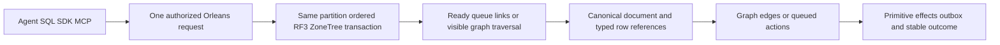

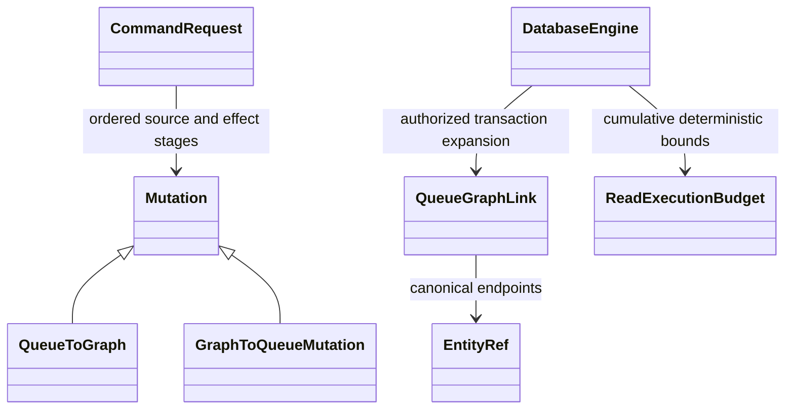

Owner clarification2026-10-02: KeyLoad is one server/database for AI agents with
linked documents, relational rows, graph, vectors/text search, events, queues,
time series and files/blobs. SQL is the central versioned language. The first
unified invocation/typed-row stage is specified by [ADR-054](ADR/ADR-054-central-sql.md)
and [ADR-055](ADR/ADR-055-typed-relational-rows.md); qualification remains pending.
Typed rows reuse Collection entity storage so graph/vector references retain one
identity. [RelationalStorage](Features/RelationalStorage.md) defines schemas and
native constraints; QueryExecution owns the SQL adapter over canonical operations.

Owner clarification2026-10-03 requires full SQL and a client connection protocol.
[ADR-065](ADR/ADR-065-full-sql-client-compatibility.md) extends the existing stages
with explicit typed execution/native-client gates and
[versioned conformance inventory](implementation/sql-client-conformance.json).
The first lexical repair shares an internal bounded trivia reader between Query,
Server and SDK; quoted content, authority, envelope1 and storage remain exact.
Full PostgreSQL-compatible execution and native transport are pending. The selected text index is ZoneTree.FullTextSearch, using its centrally pinned
native APIs under node-local ownership. [NativeFullTextProjection](Features/Search/NativeFullTextProjection.md)
defines the integration, correctness, recovery, resource and performance gates.
Provider selection is fixed; acceleration requires comparable measurements.

[ADR-068](ADR/ADR-068-native-benchmark-gate-repair.md) preserves isolated benchmark
startup authority: original bounded job discovery joins authenticated metadata for
the same job ID before native allocation. Still-queued metadata has three bounded
captures; identity/state failures remain failures. Kurrent metadata/leader gates
and complete native cohort/site qualification remain open.

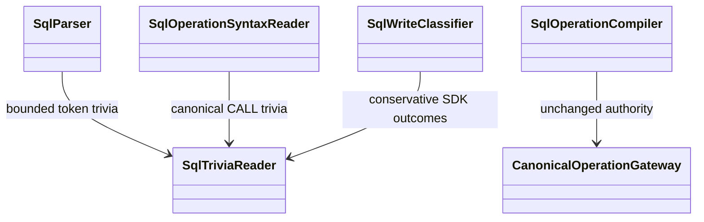

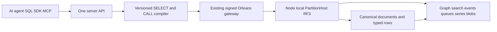

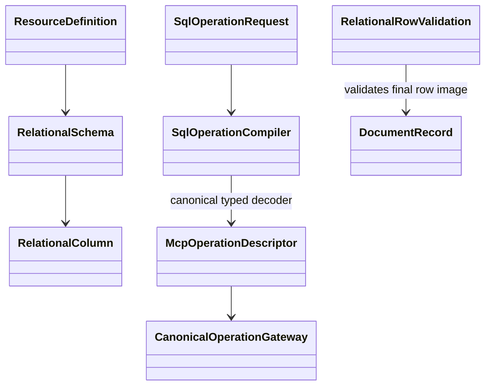

The additive [AdminDashboard](Features/AdminDashboard.md) slice under [ADR-051](ADR/ADR-051-admin-dashboard.md) hosts the runtime read-only console in `src/KeyLoad.Server/Features/AdminDashboard/Assets/`, with shared Abstractions DTOs, Core catalog/queue readers, matching Client SDK and UnitTests/IntegrationTests slices. It borrows the existing unique Orleans request/read actors and node-local administration; physical observations are explicitly per node. The public benchmark `site/` remains its own surface. Both surfaces share one light visual identity under [ADR-053](ADR/ADR-053-unified-visual-identity.md): the console owns the canonical `brand.css`/`logo.svg`, and the site keeps byte-identical mirrors checked by SiteTests. Exact-SHA dashboard unit/RF3/native browser cases pass and retained desktop/mobile images are visually reviewed; complete recovery/comparison and numeric coverage qualification remains open.

[SiteMetadata](Features/BenchmarkComparisons/SiteMetadata.md) extends that identity
with mirrored PNG/ICO exports, static landing SEO/OG/Twitter/JSON-LD and an authored
share card. The existing static builder owns root delivery and crawl files; the
console's finite embedded shell owns only its exact icon routes and noindex.
Source assets and local rendering do not establish indexing or publication.

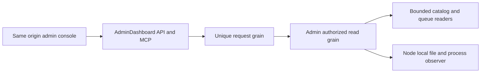

Read the root and nearest project-local AGENTS.md before changing this solution. The product specification is [architecture v0.3](design/architecture-v0.3.uk.md). This document is a navigation map, not a replacement specification or a readiness claim.

The [documentation index](README.md) is the complete entry point for 25 canonical Feature specifications. Each owning Feature defines stable REQ/AC, callers, boundaries, flows, existing or planned tests and a Mermaid diagram. The [ADR catalog](ADR/README.md) records decisions with status and implementation contracts. The [coverage catalog](implementation/documentation-coverage.json) maps the canonical KL tasks; [status.json](implementation/status.json) remains the single implementation-status authority.

Current mandatory policy requires an Orleans RF3 database, node-local PartitionHost storage ownership, separate request grains, distributed grain directory and activation migration, TUnit tests, Docker/Aspire RF3 execution and real .NET SDK plus official MCP SDK callers. Atomic partitions remain separate from physical replica placement. Credentials and trusted authorization are persisted server-side.

Native Orleans execution/scheduling choices are mapped per grain and method in
[ClusterRouting ExecutionPrimitives](Features/ClusterRouting/ExecutionPrimitives.md)
and [ADR-110](ADR/ADR-110-native-orleans-execution-primitives.md). Bounded
interchangeable workers, advisory OneWay hints, selective operation-control
interleaving and persistent one-time jobs are candidate joins; existing unique
request grains and reliable serial partition/due paths remain the current source.
Runtime/provider/fault and matched performance evidence are pending.
The owner's broad [Orleans capability review](Features/ClusterRouting/CapabilityReview.md)
maps Streams/pub-sub, native transactional storage, durable state/jobs, per-silo
services/lifecycle and operational controls against current source. Native
messaging remains a candidate post-commit delivery path; native transactions need
an explicit ZoneTree/RF3 prepare/commit/read-visibility adapter contract.

Owner direction2026-10-05 accepts [ClientApi ToolDiscovery](Features/ClientApi/ToolDiscovery.md)
under [ADR-104](ADR/ADR-104-mcp-gateway-tool-discovery.md). The official MCP host
will expose three bounded search/route/invoke tools, backed by native
ManagedCode.MCPGateway and ManagedCode.MarkdownLd.Kb tool metadata graphs.
Fresh persisted authentication and the existing typed signed Orleans execution
remain authoritative. The graph contains public operation documentation only;
KeyLoad data continues using node-local ZoneTree RF3 owners. Source and actual
caller qualification are pending.

The owner also requires ManagedCode.Communication native CQRS IAsyncEnumerable
results and long operations through Orleans. [NativeCqrs](Features/ClusterRouting/NativeCqrs.md)
and [ADR-082](ADR/ADR-082-native-cqrs-streams.md) first qualify the actual Graph
filter/enumerator context and cleanup join. Current request RPCv1 returns bounded
Task replies; the stream RPC/transport and durable-operation contracts remain
pending. Native enumeration does not transfer node-owned storage or supply
persisted authority, retry receipts or durability.

[ResourcePolicyUpdates](Features/Authorization/ResourcePolicyUpdates.md) and
[ADR-093](ADR/ADR-093-resource-policy-updates.md) freeze policy-only CAS through
the existing RF3 metadata ConfigureResource path. Advancing its resource version
invalidates existing read/index fences; physical schema and placement remain
separate migrations. Implementation and public qualification are in progress.

[ADR-052](ADR/ADR-052-timeseries-bounded-aggregates.md) accepts the additive
[TimeSeries](Features/TimeSeries.md) latest/aggregate/window slice. New typed
Abstractions DTOs mirror Client/Server/Core TimeSeries owners and real matching
UnitTests/IntegrationTests. Core uses the published ManagedCode.TimeSeries library
inside one budgeted storage cut; shared StorageRecovery reverse visitors support
bounded latest. Orleans request routing and node-local storage ownership remain.
The additive source and real SDK/MCP regression paths are present; this contract
remains Accepted while exact-SHA full qualification and broader product gates are
retained separately in implementation status.

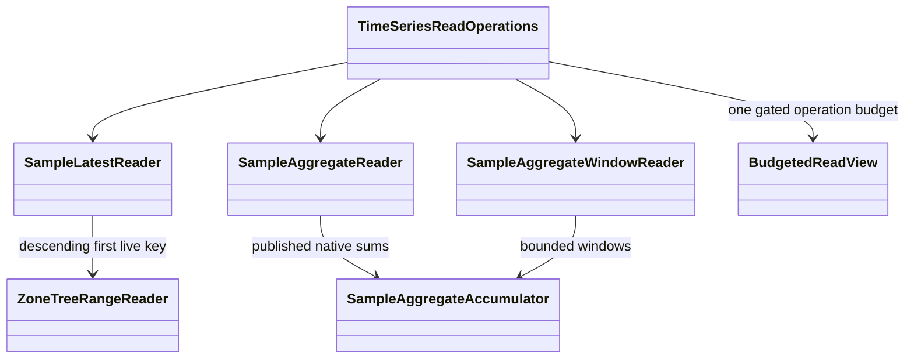

## Complete repository boundary

The optional bounded diagnostic workstream is accepted in
[ADR-063](ADR/ADR-063-bounded-database-phase-profiling.md). The fixed bank and
17 actual public/request/replication/provider phase joins are implemented in source. Process
mode remains disabled by default; the remaining15 joins, private capture and
native phase/resource measurements remain open.

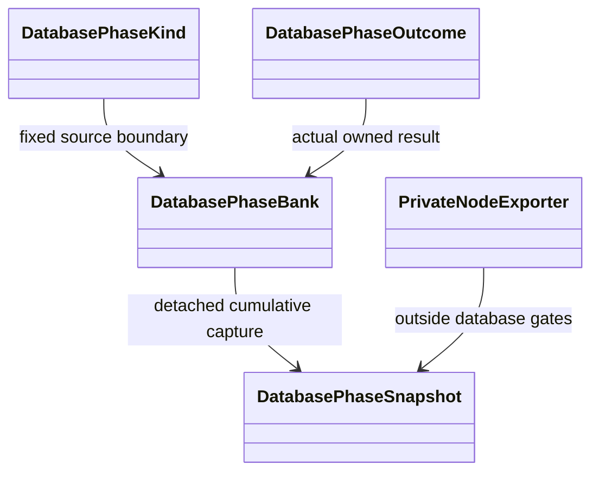

All KeyLoad-owned backend, clients, contracts, frontend, tests, infrastructure and docs live here and are versioned together. Independently owned ManagedCode dependencies remain in their owning repositories; repair/release/verified NuGet publication follows root policy.

| Project/module | Purpose and entry points | Canonical slices / protected boundary |
|---|---|---|
| src/KeyLoad.Abstractions | Contracts.cs, Features/<SliceName>/Contracts/, Storage/StorageContracts.cs; Features/BackupRestore/Contracts/AtomicPartitionCatalogEntry.cs | Shared public/storage contracts; DocumentStorage, EventStreams, Messaging, Authorization, Search, GraphTraversal and the generated BackupRestore roster entry. |
| src/KeyLoad.Core | DatabaseEngine.cs, Features/DocumentStorage/Execution/Documents.cs, Features/EventStreams/Execution/Events.cs, Features/Messaging/Execution/Messaging.cs, Features/GraphTraversal/, Features/TimeSeries/, Features/Search/; Features/BackupRestore/Execution/AtomicPartitionRosterTransaction.cs | Node-local engine and atomic transactions; model effects and first-write logical partition registration share the ordered native commit. Complete current roster capture and cluster backup qualification remain required. |
| src/KeyLoad.Diagnostics | Features/ResourceExecution/Models/DatabasePhaseKind.cs, Features/ResourceExecution/Models/DatabasePhaseSnapshot.cs and fixed bank | ResourceExecution; ADR-063 BCL-only callback-free scalar phase observations. No database state, public control endpoint or framework dependency; source integration and genuine native profiling pending. |
| src/KeyLoad.Storage.ZoneTree | ZoneTreeStore.cs; Features/StorageRecovery/Execution/ZoneTreeStoreRuntime.cs and Features/StorageRecovery/Recovery/ZoneTreeCheckpointManager.cs | StorageRecovery and BackupRestore; file/WAL/checkpoint ownership stays node-local. |
| src/KeyLoad.Storage.IO | Features/StorageRecovery/Storage/OfflineRegularFile.cs | StorageRecovery; shared internal public-OS-ABI regular-file opening for current native storage and scoped owner inspection. No engine, database state or replication dependency; ADR-011/116 and CurrentFormat. |
| src/KeyLoad.Security | Features/Authorization/Execution/AuthorizationPolicy.cs | Authorization; trusted principal and row/field policy enforcement. |
| src/KeyLoad.Query | Features/QueryExecution/Queries/QueryEngine.cs, Features/QueryExecution/Execution/SqlParser.cs, Features/Search/Queries/SearchEngine.cs; Features/ChangeFeeds/Queries/LiveQueryExecutor.cs behind Features/ChangeFeeds/Execution/LiveQueries.cs facade | QueryExecution, Search, ChangeFeeds; one authorized typed AST and bounded read cut. |
| src/KeyLoad.Artifacts | Features/BackupRestore/Execution/ArtifactTransfer.cs, Features/BackupRestore/Execution/BackupArtifact.cs | BackupRestore; verified artifact transport and format ownership. |
| src/KeyLoad.Replication | Features/ClusterReplication/Execution/ClusterCoordinator.cs, Features/ClusterReplication/Storage/DurableReplicaLog.cs, Features/ClusterReplication/Execution/ReplicaMaterializer.cs | ClusterReplication, StorageRecovery; ordered durable apply and quorum authority behind the active Orleans server composition; delivered-SHA RF3 qualification pending. |
| src/KeyLoad.Orleans | Features/ClusterRouting/Grains/{RequestGrain,DatabaseReadGrain,CommandPartitionGrain}.cs; Topology/ReplicaMembershipTable.cs | ClusterRouting; active server composition routes through grains while node-local hosts own storage; forced activation-migration qualification pending. |
| src/KeyLoad.Server | Program.cs, NodeOptions.cs, Features/ClientApi/, Features/ClusterRouting/Hosting/OrleansNode.cs and feature API files | Composition root and public API; caller identity never supplies trusted roles. |
| src/KeyLoad.Client | KeyLoadClient.cs, Features/QueryExecution/Queries/KeyLoadQuery.cs | ClientApi shared transport; business operations mirror the same canonical slices as core/contracts/API/tests. |
| src/KeyLoad.Cli | Program.cs, Features/ClientApi/Hosting/KeyLoadCliApplication.cs, Features/ClientApi/Transport/CliClientApi.cs and Features/BackupRestore/Commands/CliBackupRestore.cs | Composition-only administrative entry point and typed ClientApi/BackupRestore feature owners. |
| src/KeyLoad.ServiceDefaults | Extensions.cs | Shared telemetry, service discovery and resilience composition. |
| src/KeyLoad.AppHost | Program.cs, Features/BenchmarkComparisons/Resources/BenchmarkResources.cs | ClusterReplication, ClusterRouting, TestInfrastructure, BenchmarkComparisons and CodeQuality test-only collector preparation; Aspire owns resource lifecycle. |
| tests/KeyLoad.UnitTests | TestDatabase.cs and focused test files | Matching product slices; pure contract/engine regression evidence. |
| tests/KeyLoad.RecoveryTests | Features/StorageRecovery/Cases/RecoveryTests.cs, Features/ClusterReplication/Cases/ReplicaPersistenceTests.cs, Features/ClusterReplication/Cases/ReplicaProcessRecoveryTests.cs, Features/ClusterRouting/ | StorageRecovery, ClusterReplication, ClusterRouting; actual child-process recovery and current outcome-v2 scoped-locator integrity; current source qualification pending. |
| tests/KeyLoad.CrashHost | Program.cs, Features/ClusterReplication/Helpers/ReplicaCrashScenario.cs | Shared real-process recovery harness, never a product replacement. |
| tests/KeyLoad.IntegrationTests | ClusterFixture.cs, Features/ClusterReplication/Cases/ClusterTests.cs, Features/ResourceExecution/Cases/AdmissionClusterTests.cs | ClusterReplication and ClientApi shared fixtures; CodeQuality scopes actual server collector export; business cases mirror their owning canonical slices with real RF3/.NET and required MCP flows. |
| tests/KeyLoad.ComparisonTests | Features/BenchmarkComparisons/ | BenchmarkComparisons; real engine/container correctness and measurements, including the separate TimeSeries profile under ADR-050. |
| benchmarks/KeyLoad.Benchmarks | Program.cs | BenchmarkComparisons; embedded microbenchmark development, no public CI claim without CI evidence. |
| benchmarks/KeyLoad.BenchmarkScenarios | Features/BenchmarkComparisons/Benchmarks/EmbeddedBenchmarks.cs | BenchmarkComparisons; ADR-047 public fixture library for external generated consumer, source joined with a clean enabled host build; real GitHub Dry execution pending. |
| benchmarks/KeyLoad.Comparisons | Features/BenchmarkComparisons/Contracts/Contracts.cs, Features/BenchmarkComparisons/Corpus/BenchmarkDataset.cs, Features/BenchmarkComparisons/Execution/ComparisonRunner.cs; Features/BenchmarkComparisons/Targets/ | BenchmarkComparisons; public library with shared workload/oracle and official engine clients. |
| benchmarks/KeyLoad.ComparisonHost | Program.cs and Features/BenchmarkComparisons/ | BenchmarkComparisons; sole CLI composition/lifetime under ADR-043, source-joined with actual build and GitHub qualification pending. |
| site | Features/BenchmarkComparisons/index.html, bootstrap.mjs, measurement-loader.mjs; scripts/build.mjs | BenchmarkComparisons; product introduction, conceptual Three.js RF3 view and public views of qualified GitHub JSON; website workflow is separate from benchmark execution. |
| tests/KeyLoad.SiteTests | KeyLoad.SiteTests.csproj, Features/BenchmarkComparisons/ | BenchmarkComparisons; independently buildable TUnit suite invokes actual Node modules and authentic GitHub report files. |
| .github/workflows | build-and-tests.yml, benchmarks.yml, release.yml, website.yml | RepositoryGovernance, BenchmarkComparisons, ReleaseDelivery; separate build/test, benchmark, release, and website workflows. |
| scripts/Features/BenchmarkComparisons | github-evidence-contracts/runs/proof.mjs, github-evidence.mjs | BenchmarkComparisons; ADR-040/BC028 authenticated-metadata and same-ZIP proof tooling, implementation pending. |
| docs | design/, implementation/, Features/, ADR/ | Product specification, evidence and canonical slice/decision records. |

[ADR-049](ADR/ADR-049-genuine-neo4j-harness.md) accepts genuine harness regressions
inside the existing comparison Aspire lifecycle and confirmed Neo4j cleanup
authority. Its exact acknowledgement/parser contract review, implementation and
GitHub qualification are pending; the accepted schema3/nine-engine graph remains.

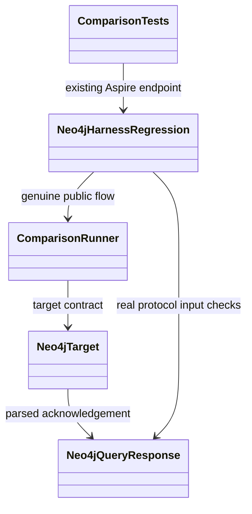
| scripts | Features/RepositoryGovernance/verify.mjs | RepositoryGovernance; real-repository static verification with Node built-ins. |
| src/KeyLoad.Analyzers | KeyLoad.Analyzers.csproj, Features/CodeQuality/ | CodeQuality; source-owned Roslyn diagnostics attached to compilation, never runtime storage/routing. |
| tests/KeyLoad.Analyzers.Tests | KeyLoad.Analyzers.Tests.csproj, Features/CodeQuality/ | CodeQuality; real Roslyn/Orleans metadata regressions, TUnit and CI-only execution. |

## Feature ownership convention

Each vertical slice groups actual responsibilities in populated local role folders;
`Features/<SliceName>/` is an ownership boundary, not a flat file collection.
KeyLoad.Orleans now separates routing grains, commands, queries, models, contracts,
streaming, identity, serialization, diagnostics and topology. Its replication slice
separates grain services, discovery, transport, authentication, replay and wire models;
ResourceExecution separates cache-control models, contracts, serialization,
authentication and validation. AdminDashboard and BlobStorage own query capabilities
in `Queries/`. The structure preserves namespaces, aliases/Ids and runtime behavior.
The owner contract and checks are in [RepositoryGovernance](Features/RepositoryGovernance.md)
and [ADR-032](ADR/ADR-032-mcaf-governance.md).

Canonical slice names use PascalCase consistently: RepositoryGovernance, BenchmarkComparisons, DocumentStorage, RelationalStorage, EventStreams, Messaging, GraphTraversal, TimeSeries, Search, QueryExecution, Authorization, ChangeFeeds, StorageRecovery, ClusterReplication, ClusterRouting, ClientApi, BackupRestore, BlobStorage, ResourceExecution, CodeQuality and TestInfrastructure. Their owning contracts and navigation are in the [Feature index](README.md).

The embedded microbenchmark boundary follows Accepted ADR-047; it is peripheral
runner qualification and does not replace the first product server's RF3 topology.
The real generated child requires an externally visible unsealed library fixture:

[ADR-071](ADR/ADR-071-canonical-zonetree-providers.md) fixes ZoneTree storage
and ZoneTree.FullTextSearch derived text indexes. Candidate engine code and
discarded evaluation plans are removed; native WAL, node-local ownership, RF3
and all correctness/resource/qualification contracts remain mandatory.
The independent [ScaledWorkloads](Features/BenchmarkComparisons/ScaledWorkloads.md)
under [ADR-069](ADR/ADR-069-representative-scaled-workloads.md) adds actual
exactly 100,000 and 1,000,000 actual full-keyspace records, with at least
100,000 measured operations per applicable workload cell and explicit resource,
value, durability and provider gates. Mandatory public index, complex-query and
native topology/RF3 stages remain open. Tiny hot-key controls remain labelled
microbenchmarks and cannot qualify the required scales.
Local ZoneTree microbenchmarks use the actual generated consumer for development.
Full native database comparisons retain isolated Linux runners and the required
resource, correctness, recovery and multi-node qualification gates.

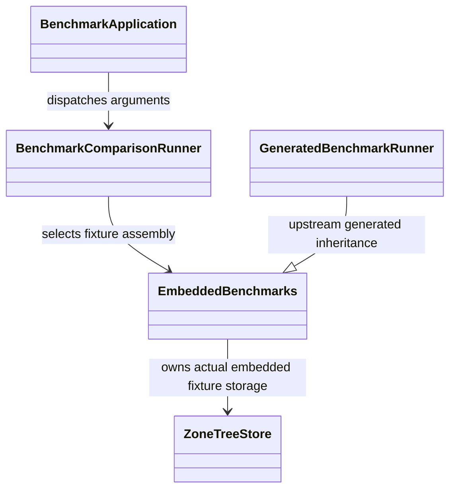

Target feature-owned paths are `<project-or-module>/Features/<SliceName>/`; tests mirror that name under their project roots; feature docs are `docs/Features/<SliceName>.md`. Shared entry points, composition roots, truly shared contracts and global infrastructure may remain outside feature folders. A non-applicable surface must be recorded as N/A with its reason in the feature spec.

[CodeQuality](Features/CodeQuality.md) is a compile-time slice defined by [ADR-033](ADR/ADR-033-code-quality.md). Central SDK/style analysis and source-owned Roslyn rules produce compiler/IDE findings and per-project SARIF reports. This build infrastructure has no database runtime or persistence surface.

[ADR-043](ADR/ADR-043-comparison-library-host.md) owns the preserving comparative
library/sole-CLI split. Tests retain the same public harness assembly/API and Aspire
retains its comparisons resource/configuration; source is joined but combined build
and qualification remain pending. [ADR-044](ADR/ADR-044-benchmark-immutable-contracts.md)
now accepts the separate immutable harness collection and CLR naming migration,
with valid JSON/configuration values and all real engine gates preserved.

[ADR-045](ADR/ADR-045-postgres-schema-ownership.md) accepts owned transient
PostgreSQL benchmark schemas and constant commands. Existing public target calls
retain exact workloads; typed context and a matching owner marker guard cleanup.
Real regression helpers share the existing Aspire PG container after measurement;
implementation and GitHub qualification remain pending.

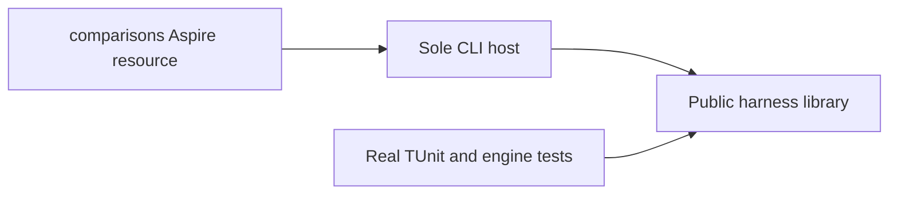

[ResourceExecution](Features/ResourceExecution.md) and [ADR-035](ADR/ADR-035-memory-performance.md)
define the current memory/performance repair contract. Common budgets belong to
shared node-local building blocks; operation behavior stays in its canonical
feature slice. [ClientApi](Features/ClientApi.md) owns HTTP response streaming.
Scoped document/vector visitors feed QueryExecution and Search without raw pages;
GraphTraversal retains cut-scoped visibility decisions. The shared canonical JSON
writer streams fingerprints to a hash and preserves exact signatures. The located
[repair inventory](implementation/memory-performance.md) records every open join.
Implementation and real qualification are in progress; read-only findings do not
establish measured speed, bounded process RSS or production readiness.

Shared atomic commit/outcome dispatch remains outside feature folders because it
joins multiple mutation families. Document CRUD handlers and transaction-scoped
image carriers now belong to `Core/Features/DocumentStorage/`; admission/inbox
ownership belongs to `Core/Features/ResourceExecution/` under [ADR-042](ADR/ADR-042-admission-resource-ownership.md).
The existing oversized aggregate DatabaseEngine partial type remains the explicit,
time-bounded ADR-041 handler-extraction deviation; splitting files alone does not
satisfy the type limit.

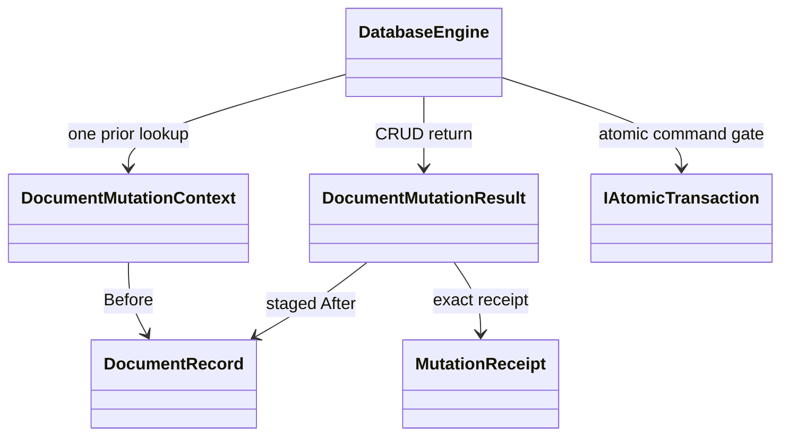

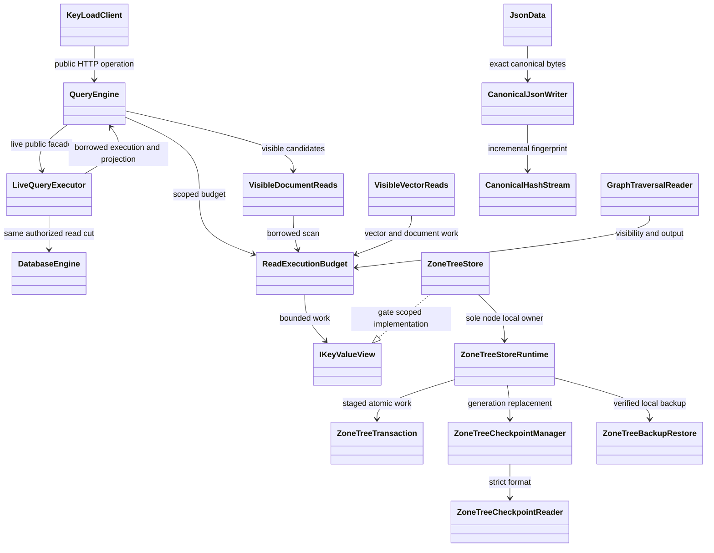

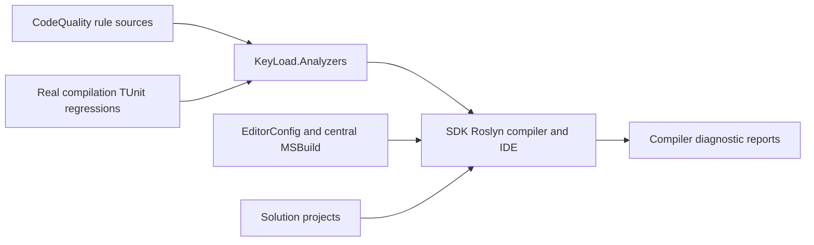

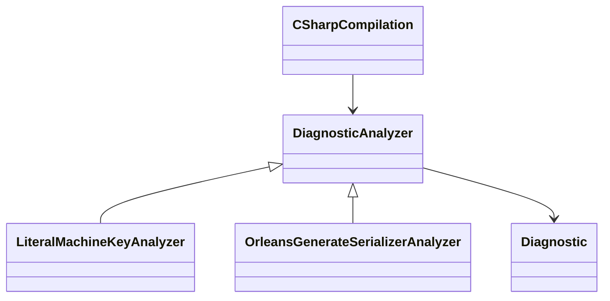

The existing flat/layered feature files are migration debt, not compliant target structure. [ADR-032](ADR/ADR-032-mcaf-governance.md) records actual paths, owners, target layout, verification and removal date. New feature-owned work must use the target convention. No runtime code is moved by the governance bootstrap.

The owner's SIMD clarification maps to Search's Accepted ADR-035 validation-only
stage: portable .NET JIT intrinsic finite-value checks, unchanged metric grouping,
scalar tails and same-source hardware-disabled GitHub proof. ZoneTree remains the
node-local native storage engine; Orleans remains the routing/isolation and bounded
independent-work parallelism foundation. No Rust/FFI or unmeasured numerical/atomic
parallel reduction is introduced. [Search](Features/Search.md) and
[BenchmarkComparisons](Features/BenchmarkComparisons.md) keep source, correctness
and measured performance evidence distinct.

Public chunked blobs and partial reads have canonical source implementations under [BlobStorage](Features/BlobStorage.md) and Accepted [ADR-038](ADR/ADR-038-chunked-blob-storage.md). Official MCP and simple agent adapters belong to [ClientApi](Features/ClientApi.md) and Accepted [ADR-039](ADR/ADR-039-official-mcp-agent-api.md); business operations retain their existing Feature owners. The typed .NET blob lifecycle/range adapter and SQL CALL join are specified in [central SQL evidence](implementation/central-sql.md). Exact delivered-SHA qualification remains required; private snapshot chunks and backup archive pieces are separate storage protocols.

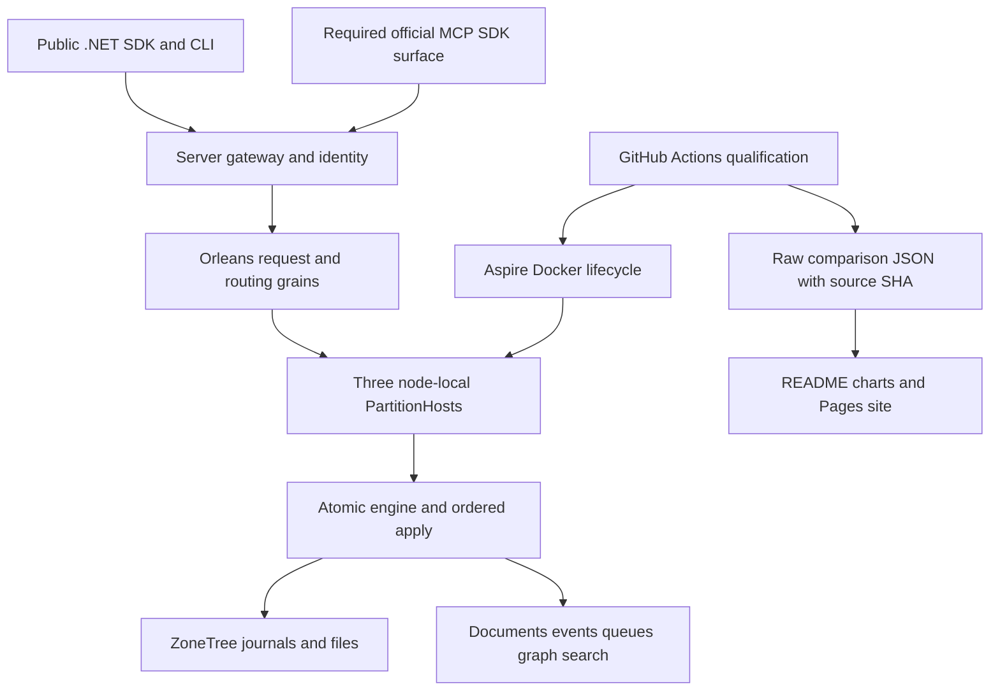

## Fresh website evidence boundary (BC028)

The separate Pages consumer uses trusted control-workflow source, authentic
successful exact-attempt comparison execution and one digest-verified archive.
Publication qualifies current trusted-main website source independently from the
separate inspected measured-source checkout; candidate validation cannot deploy.
Unrelated database-workflow failure is outside the site-only boundary. Complete
site qualification and repeated website/evidence freshness proof precede Pages.
See [BenchmarkComparisons](Features/BenchmarkComparisons.md),
[ADR-040](ADR/ADR-040-static-site-threejs-evidence.md) and publication acceptance.

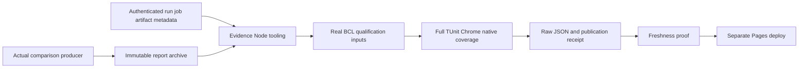

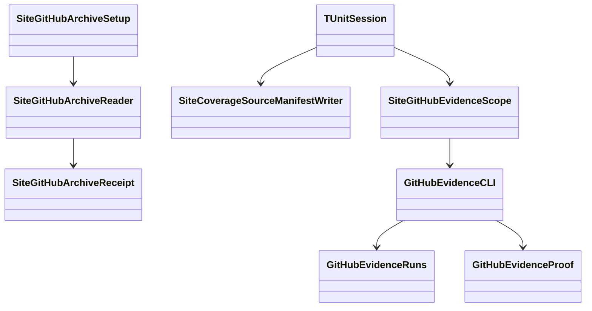

## Shared request contracts

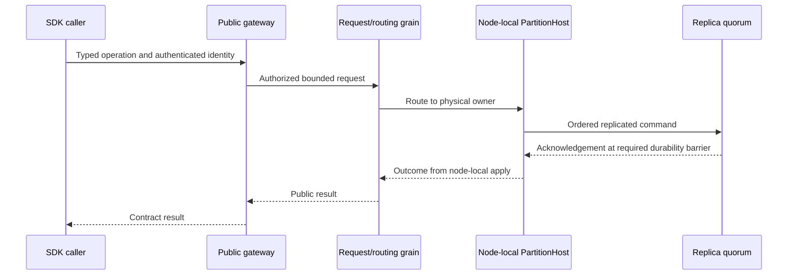

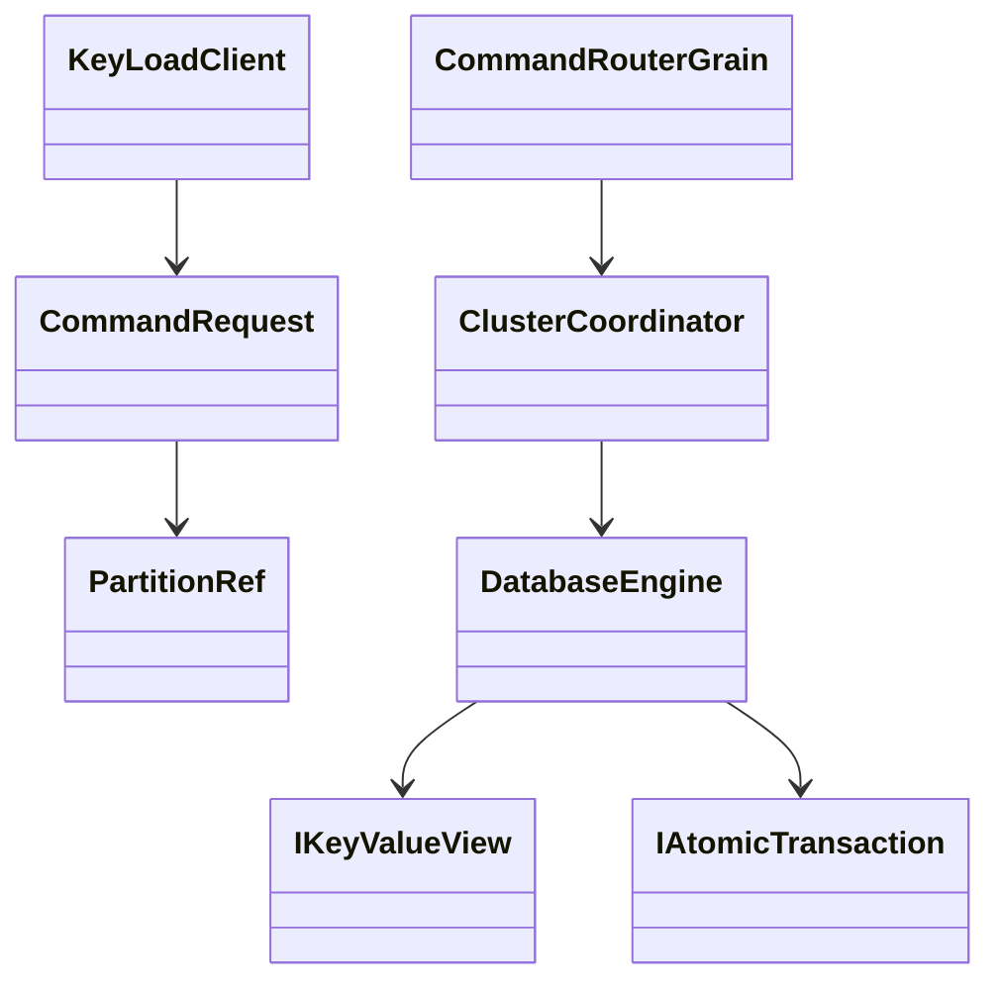

## Current implementation and qualification gaps

The product design retains historical DotNext-candidate and standalone-first text beneath the current owner clarification. Current AGENTS policy supersedes those choices. The current server source composes a node-local PartitionHost with the Orleans silo, distributed grain directory, activation repartitioner and separate request grains under [ADR-036](ADR/ADR-036-orleans-foundation.md). The three-node Aspire graph is present. No current integration case forces activation migration and verifies node-local storage ownership afterward; delivered-source GitHub qualification is pending. TUnit package/test migration and persisted principal/API-key verifier, grant, feed and paused local restore behavior are source-present. Public BlobStorage and official MCP/agent contracts are Accepted and source-present, with exact delivered-SHA qualification pending. The diagrams show mandatory ownership and delivery boundaries; they do not claim every target is implemented. Current build/formatter prerequisites and their exact historical source cuts are recorded in [CodeQuality evidence](implementation/code-quality.md); full solution and delivered-SHA qualification remain open.

The successful [GitHub CI baseline 36926803549](https://github.com/managedcode/KeyLoad/actions/runs/36926803549) measured commit 9c570f8c33a7a9667507a8e1c0ca68860de3be45. It does not qualify later uncommitted work, power-loss durability, endurance or production readiness. See [implementation status](implementation/status.json), [durability audit](implementation/durability-audit.md), [comparative benchmark contract](implementation/comparative-benchmarks.md), [RepositoryGovernance](Features/RepositoryGovernance.md) and [ADR-032](ADR/ADR-032-mcaf-governance.md).

## TimeSeries comparison boundary

The Accepted [ADR-034 caller-composition continuation](ADR/ADR-034-cluster-comparisons.md)
repairs three actual RF3 endpoint bindings, authenticated Rabbit management client
ownership and PostgreSQL public event readback. The existing nine-engine,
Single/Replicated, Docker load-generator and six-profile contracts remain open;
retained failed-run raw timings do not establish a performance winner. The
[owning feature](Features/BenchmarkComparisons.md) contains exact disjoint tasks,
criteria, native evidence and integration boundaries.

[ADR-050](ADR/ADR-050-timeseries-timescale-comparison.md) adds a separate profile
using the real KeyLoad RF3 SDK, digest-pinned TimescaleDB, and
ManagedCode.TimeSeries as an explicitly in-memory aggregation library. It keeps
schema3 engine counts intact and reports each arm's storage and acknowledgement
guarantees separately. Implementation and exact-SHA CI proof are pending.

```mermaid
flowchart LR
    Corpus[Deterministic UTC samples] --> RF3[KeyLoad RF3 via SDK]
    Corpus --> Timescale[TimescaleDB via Npgsql]
    Corpus --> MCTS[ManagedCode.TimeSeries memory aggregation]
    RF3 --> Oracle[Separate result and guarantees]
    Timescale --> Oracle
    MCTS --> Oracle
```

## Isolated Linux comparison execution

[ADR-056](ADR/ADR-056-isolated-linux-comparison-cells.md) and the canonical
[BenchmarkComparisons](Features/BenchmarkComparisons.md) contract add one native
engine/node-count/scenario per independent GitHub Linux runner. The closed plan,
common corpus/options, strict worker envelope and complete aggregate are owned
by the same slice across library, host, AppHost, scripts, tests and site.
Production starts RF3; explicit benchmark startup alone enables fixed RF1/RF2.
The first intensive cohort has270 planned cells; this is a plan count, not evidence
that any measurement passed. TimeSeries keeps a distinct workload and needs the
same isolation before it joins publication.

```mermaid
flowchart LR
    Contract[Canonical isolated contract] --> Selection[ComparisonWorkerSelection]
    Selection --> Aspire[Selected native resources only]
    Aspire --> Target[One native adapter]
    Target --> Runner[One selected scenario and common oracle]
    Runner --> Envelope[Current raw worker schema5]
    Envelope --> Aggregate[Complete authenticated cohort]
    Aggregate --> Site[Independent site generation]
```

```mermaid
classDiagram
    ComparisonWorkerSelection --> ComparisonOptions
    ComparisonRunner --> BenchmarkDataset
    ComparisonRunner --> IComparisonTarget
    ComparisonRunner --> ComparisonFailureDiagnostics
    ComparisonFailureDiagnostics --> IComparisonFailureDiagnostics
    KeyLoadTarget ..|> IComparisonFailureDiagnostics
    KeyLoadTarget --> KeyLoadOutboxDiagnosticLine
    IComparisonTarget --> IComparisonSession
    IsolatedComparisonReport --> IsolatedComparisonWorker
    IsolatedComparisonReport --> ComparisonReport
```

[ADR-068 stageE](ADR/ADR-068-native-benchmark-gate-repair.md) adds a private
failure-only diagnostic boundary after case/session settlement and outside the
measurement clock. The KeyLoad adapter performs one bounded authorized outbox
status read; only numeric context is logged and the original case is preserved.
It changes no limits, retention, operations or public transport, and remains
runtime-unqualified until authentic failed native originals join.

Source stages remain unqualified until exact-SHA real native correctness/fault,
intensive cohort, aggregate, site and publication gates pass.

The additive TimeSeries selection and physical-resource model below preserves
the separate270 route and productionRF3. These classes are source-present;
native dispatch, membership/ACK/copy verification and the6/30 evidence join
remain open under ADR059.

```mermaid
classDiagram
    TimeSeriesIntensiveSelection --> IsolatedTimeSeriesResourceContext
    TimeSeriesIntensiveFamilyContract --> TimeSeriesIntensiveFamilyPlan
    TimeSeriesIntensiveFamilyPlan --> TimeSeriesIntensiveSelection
    TimeSeriesIntensiveRunResult --> TimeSeriesIntensiveRunJson
    TimeSeriesIntensiveRunJson --> TimeSeriesIntensiveRunJsonValidation
    TimeSeriesIntensiveRunJson --> Utf8JsonWriter : borrows caller writer
    IsolatedTimeSeriesResourceContext --> IsolatedTimeSeriesKeyLoadResources
    IsolatedTimeSeriesResourceContext --> IsolatedTimeSeriesTimescaleResources
    IsolatedTimeSeriesKeyLoadResources --> ClusterResources
    IsolatedTimeSeriesTimescaleResources --> IsolatedPostgresBootstrap
```

[ADR-059](ADR/ADR-059-isolated-intensive-timeseries.md) specifies a separate
30-cell intensive TimeSeries family using the same canonical BenchmarkComparisons
slice. KeyLoad and TimescaleDB each have native1/2/3-node preflights and five
operation scenarios, with common4096 samples, actual persisted sequence order,
bounded output lifetime and separate latency/validation-inclusive wall throughput.
Exact target/SQL/provider packets and native pinned-image feasibility precede
their staged implementation. The historical TimeSeries and270-cell protocols
remain independent; source, measured results and publication gates stay explicit.

```mermaid
classDiagram
    TimeSeriesIntensiveSelection --> TimeSeriesIntensiveWorkload
    TimeSeriesIntensiveRunner --> ITimeSeriesIntensiveTarget
    TimeSeriesIntensiveRunner --> TimeSeriesIntensiveOracle
    ITimeSeriesIntensiveTarget <|.. KeyLoadTimeSeriesIntensiveTarget
    ITimeSeriesIntensiveTarget <|.. TimescaleTimeSeriesIntensiveTarget
    TimeSeriesIntensiveRunner --> TimeSeriesIntensiveReport
```

## Atomic WAL binary serialization

[ADR-007](ADR/ADR-007-replica-consensus-bootstrap.md) and REQ/AC-REP-051 refine
ClusterReplication checkpoint publication: one physical DurableReplicaLog owns the
protocol gate shared by term/suffix planning and metadata publication. Its
materializer borrows that gate, owns ordered apply and canonical image IO, and
drains before the log owner closes the gate. Canonical snapshot IO stays outside
the protocol gate; no storage ownership moves with Orleans activations. Source
regressions use actual ZoneTree Create/Complete and node lifecycle; repaired-SHA
native recovery/RF3/intensive qualification remains required.

```mermaid
classDiagram
    IDurableReplicaLog <|.. DurableReplicaLog
    DurableReplicaLog *-- SemaphoreSlim : owns ProtocolGate
    ReplicaMaterializer --> IDurableReplicaLog : borrows gate
    ReplicaState --> ReplicaMaterializer : protocol planning
    ReplicaSnapshotStore --> IDurableReplicaLog : publishes verified metadata
    ReplicaMaterializer --> ReplicaSnapshotStore : canonical IO under apply ownership
```

[ADR-057](ADR/ADR-057-orleans-atomic-wal.md) records an earlier WAL-only source qualified by mandatory native gates at cf630751/run37084177131. Its journal3/identity4/checkpoint2 values and promotion behavior describe that historical source only; they are not supported current formats or a conversion path. Current storage accepts the formats in [CurrentFormat](Features/StorageRecovery/CurrentFormat.md), preserves native raw-byte ZoneTree WAL and node-local physical ownership, and rejects unsupported versions before effects. The whole isolated comparison cohort also retains failed preflight gates; the historical result does not qualify current source.

The staged [ADR-058](ADR/ADR-058-orleans-coordinated-cache-memory.md) keeps RAM
acceleration under the canonical ResourceExecution slice across shared contracts,
Core, provider, Orleans/Server composition and tests. The common retained pool
and explicitly configured embedded positive point-value cache are implemented
in source, with coherence fences and real-file regression cases. Server RF3
composition remains cold while the authenticated cluster-control contract and
implementation remain open. ADR-058 R69 approves only a local opened-store
factory, exact accepted-receipt validation and finite binding prerequisites.
R81 adds a zero-wait actual canonical owner/health observation returning only
NodeId/incarnation/control RuntimeId. It cannot certify full silo readiness or a
lease; native poison and physical storage ownership remain authoritative.
The accepted [R82 v1 contract](Features/ResourceExecution/CacheControlV1.md)
adds only unused immutable generated metadata and bounded shape/transcript/
authentication/correlation primitives under Orleans/Features/ResourceExecution.
Dedicated bytes and exact original-request binding preserve existing database
and replica formats; final integrated source and native qualification are pending.
Positive point-value caches remain disposable provider state; logical policy grains and actual
per-silo services must authenticate physical host IDs and leases before cluster
admission. They never move files/handles or replace current authorization/read
barriers. Cluster-control source, native cache correctness, coverage and matched
performance qualification remain open; development builds do not close those gates.

```mermaid
classDiagram
    class ICacheMemoryBudget {
        TryReserve(bytes, entries)
        GetSnapshot()
    }
    class ICacheMemoryReservation {
        Bytes
        Entries
        Dispose()
    }
    class CacheMemoryBudget
    class CacheMemoryLimits
    CacheMemoryBudget ..|> ICacheMemoryBudget
    ICacheMemoryBudget --> ICacheMemoryReservation
    CacheMemoryBudget --> CacheMemoryLimits
    class ICacheReadPermit {
        IsCurrentAcceptance(receipt)
    }
    class ZoneTreePointCacheControl {
        TryReadOwnerIdentity(identity)
        TryApply(receipt)
        Retire(withdrawnRevision)
        CloseAdmission()
    }
    ZoneTreeStore --> ZoneTreeStoreRuntime
    ZoneTreeStoreRuntime --> ZoneTreePointCacheLifecycle
    ZoneTreePointCacheLifecycle --> ZoneTreePointCacheControl
    ZoneTreePointCacheControl --> ZoneTreePointCacheControlState
    ZoneTreePointCacheControl --> ZoneTreePointCacheOwnerObservation
    ZoneTreePointCacheOwnerObservation --> ZoneTreePointCacheOwnerIdentity
    ZoneTreePointCacheOwnerObservation --> ZoneTreeStoreRuntime : actual reader and health
    ZoneTreePointCacheControlState --> ICacheReadPermit
    ZoneTreePointCacheControlState --> ZoneTreePointCacheBinding
    ZoneTreePointCacheBinding --> ZoneTreePointCache
    ZoneTreePointCache --> ICacheMemoryBudget
```

```mermaid
classDiagram
    class CacheControlWire {
        TryEncodeSigned(message)
        TryEncodeForSigning(message)
    }
    class CacheControlAuthenticator {
        TrySign(message)
        TryAuthenticate(message)
        Dispose()
    }
    class CacheControlCorrelation {
        TryCreate(request)
        TryMatch(request, reply)
    }
    CacheControlWire --> CacheControlShape : complete preflight
    CacheControlWire --> CacheControlDigest : canonical raw bytes
    CacheControlAuthenticator --> CacheControlWire : dedicated transcripts
    CacheControlAuthenticator --> CacheReadyProof : nested authentication
    CacheControlCorrelation --> CacheControlHeaderComparison : exact echo
    CacheControlCorrelation --> CachePhysicalBinding : own physical target
    CacheGrantRequest --> CacheReadyProof : fixed three slots
    CacheGrantReply --> CacheReplyCorrelation : original signed request digest
```

These unused wire helpers have no receiver or server caller. The class map records
source ownership; it does not establish a lease, RF3 cache admission or performance.

```mermaid
classDiagram
    ZoneTreeTransaction --> ZoneTreeJournalCodec : prepares binary payload
    ZoneTreeJournalPublication --> ZoneTreeJournalCodec : validated payload
    ZoneTreeJournalRecovery --> ZoneTreeJournalCodec : complete checked decode
    ZoneTreeJournalCodec --> ZoneTreeJournalMutation : stable generated fields
    ZoneTreeStoreInitializer --> ZoneTreeIdentityFile : format4 writer fence
```

The isolated CI cell setup/teardown are colocated executable infrastructure under
`.github/workflows/Features/BenchmarkComparisons/`, each with local policy.
They import the common native image and retain authenticated job/image evidence;
only the caller's real TUnit cell runs database operations. Complete raw workers
stay in immutable GitHub artifacts; Pages receives a bounded derived projection
and exact original manifest after all270 raw reports validate.

```mermaid
flowchart LR
    Build[Source-bound native image roundtrip] --> Preflight[27 separate Linux jobs]
    Preflight --> CRUD[108 separate CRUD jobs]
    CRUD --> Specialized[162 separate specialized jobs]
    Specialized --> Capture[Authenticated jobs and artifacts]
    Capture --> Raw[Complete raw aggregate]
    Raw --> Compact[Bounded derived website projection]
```

## Native internal serialization

[ADR-060](ADR/ADR-060-native-internal-serialization.md) and
[InternalSerialization](Features/InternalSerialization.md) require native generated
Orleans payloads with stable aliases and field IDs across owned persistence,
replication, grain requests/replies, membership and signed claims. The owner-directed resumption installs the reviewed native source after rebasing
against current work. Shared collection/reference/depth/graph/DOM validation and
missing-identity/backup-cut regressions are being integrated before exact-source
GitHub qualification. Historical isolated compilation and WAL-only qualification
do not establish expanded runtime, fault or performance results.

Public HTTP/MCP JSON, exact user content, frozen canonical fingerprint identities,
sortable keys, raw ZoneTree values, fixed checksum/HMAC framing and blob bytes
retain their concrete protocols. Native generated bytes are not canonical hashes
for unordered values. The current data epoch is 7, journal version 4,
checkpoint version 5 and backup version 2. Current homogeneous native payloads,
KLT2 and replica2 retain their explicit format fences. Readers reject unsupported
formats before effects; Compact preserves opaque current records.
[CurrentFormat](Features/StorageRecovery/CurrentFormat.md) and
[ADR-011](ADR/ADR-011-current-native-format.md) define strict admission,
read-only identity and capability validation, ordered current journal recovery,
backup validation and bounded restore. New-incarnation blob restore normalizes
only current authority metadata, with persisted accounting and phase fences.
Current process recovery and genuine Docker/Aspire RF3 qualification remain
required at the delivered source. The owner contract is
[ADR-116](ADR/ADR-116-first-release-current-format.md).

```mermaid
flowchart LR
    Public[Public JSON protocol] --> Typed[Attributed owned DTOs]
    Typed --> Native[Cached Orleans codecs and pooled sessions]
    Native --> Records[Typed records and versioned metadata]
    Native --> Peers[Grain and replica binary payloads]
    Native --> Claims[Signed native claims]
    Records --> Files[Node local ZoneTree and atomic WAL]
    Peers --> Admission[Signature scope and bounded native inspection]
    Typed --> Identity[Frozen canonical fingerprint material]
```

```mermaid
classDiagram
    NativeSerialization --> NativePayload : versioned generated root
    NativeSerialization --> NativeSerializerProviders : cached official providers
    NativePayload --> NativeJsonValue : structural DOM surrogate
    ZoneTreeIdentityFile --> ZoneTreeMetadataBinary : explicit format fence
    ReplicaProtocolCodec --> ReplicaEntryBatch : exact encoded byte accounting
    GrainRequestEnvelope --> GrainValue : attributed native boundary
```

## Isolated read/control admission integration

[ADR-036](ADR/ADR-036-orleans-foundation.md) TASK-ISO-021 separates signed
application ReadProbe/ReadBarrier admission from trusted native membership
ControlReadBarrier and heartbeat reserve. ClusterReplication owns real consensus
rounds/strict new-method guards; Orleans ClusterReplication owns signed
classification/replay snapshots, and ClusterRouting owns the same node-owned
consensus membership read. Production RF3, request-grain isolation, persisted
authorization, ordered apply and node-local ZoneTree ownership remain required.

```mermaid
flowchart LR
  Request[Authorized request grain] --> AppRead[Application read barrier]
  AppRead --> Probe[Signed empty ReadProbe]
  Probe --> ReadPool[Bounded ReadBarrier pool]
  Membership[Native membership table] --> Control[Trusted control read]
  Control --> Heartbeat[Signed control barrier and empty Append]
  Heartbeat --> Critical[Reserved Critical pool]
  ReadPool --> Receiver[Node owned consensus and apply]
  Critical --> Receiver
  Receiver --> Store[Committed ZoneTree read cut]
```

Numeric quota/configuration logs retain actual pool evidence; they cannot alone
prove successful control execution under pressure. Native Linux1/2/3 and genuine
Docker/Aspire RF3/fault gates remain required before performance/publication.


TimeSeries intensive runner remains a distinct internal BenchmarkComparisons
surface under ADR059 TASK-ISO-TS007B. Its16 bounded loops release each decoded
response after synchronous verification and retain only50000 compact value
records; wall throughput includes validation. Real target adapters own transport
drain, the host owns namespace/resources and the original cell lifetime. The
source stage does not establish the separate6/30 native family or site evidence.


```mermaid
classDiagram
    class ITimeSeriesIntensiveTarget
    class TimeSeriesIntensiveRunner
    class TimeSeriesIntensivePhaseExecutor
    class TimeSeriesIntensiveAttemptLedger
    class TimeSeriesIntensiveRunResult
    TimeSeriesIntensiveRunner --> ITimeSeriesIntensiveTarget : borrows
    TimeSeriesIntensiveRunner --> TimeSeriesIntensivePhaseExecutor : five repetitions
    TimeSeriesIntensivePhaseExecutor --> TimeSeriesIntensiveAttemptLedger : sixteen loops
    TimeSeriesIntensiveAttemptLedger --> TimeSeriesIntensiveRunResult : compact attempts
```

## Database term-read hot path

The accepted [ClusterReplication term metadata contract](Features/ClusterReplication/ReplicaTermMetadata.md)
and [ADR-061](ADR/ADR-061-bounded-replica-term-metadata.md) retain both public
authorized quorum cuts, the fixed RF3/node-local storage boundary and every ACK,
WAL, snapshot and strict error rule. Only one physical-log scalar term observation
is reused at the same gated provider position/authority. Source discovery does
not establish the contribution of any stage to native latency.

```mermaid
flowchart LR
    SDK[Public SDK or MCP] --> Auth[Fresh authentication request grain]
    Auth --> AuthCut[Authorized RF3 quorum cut]
    AuthCut --> Credentials[Persisted credential and principal]
    Credentials --> Request[Fresh operation request grain]
    Request --> OperationCut[Authorized RF3 operation cut]
    OperationCut --> Host[Node local PartitionHost]
    Host --> Log[Physical replica log]
    Log --> Store[Actual ZoneTree read gate and health]
    Store --> Term[One scalar term observation at exact authority and cut]
```

```mermaid
classDiagram
    class PartitionHost
    class DurableReplicaLog
    class ReplicaTermObservation
    class IAtomicStore
    class ZoneTreeStore
    PartitionHost --> DurableReplicaLog : physical owner
    DurableReplicaLog --> ReplicaTermObservation : one scalar cell under typed Lock
    DurableReplicaLog --> IAtomicStore : gated read and durable commit
    ZoneTreeStore ..|> IAtomicStore
```

Implementation/new real-store term regressions, delivered-SHA native full gates
and matched performance/server profiles remain pending. Per-request Orleans
actors never own the cell or files. No distributed data-cache enablement is
inferred from this separate private log optimization.

## Intensive TimeSeries executable input ownership

The staged [ADR059 input contract](ADR/ADR-059-isolated-intensive-timeseries.md)
links the closed6-preflight/30-cell family plan to one native engine/group and
private host settings. AppHost owns selected resource composition, Host owns
validated input/lifetime, Comparisons owns common corpus/oracles/attempts, and
ComparisonTests owns later actual member/copy/SDK/MCP qualification. Existing
productionRF3 and270 comparison contracts remain. Input source/model readiness
does not establish native copies, completed measurements or publication.

```mermaid
flowchart LR
    Configuration[Selected family configuration] --> Plan[FamilyPlan and original contract hash]
    Plan --> Resources[AppHost native group and one runner]
    Plan --> Settings[ComparisonHost validated private settings]
    Resources --> Native[Pending actual member ACK and copy checks]
    Settings --> Native
    Native --> Raw[Original settled run JSON]
    Raw --> Cohort[Pending authenticated complete family and site]
```

```mermaid
classDiagram
    class TimeSeriesIntensiveFamilyPlan
    class IsolatedTimeSeriesBenchmarkResources
    class TimeSeriesIntensiveHostSettings
    class TimeSeriesIntensiveHostNativeSettings
    class ComparisonExecutionIdentity
    TimeSeriesIntensiveFamilyPlan --> IsolatedTimeSeriesBenchmarkResources
    TimeSeriesIntensiveFamilyPlan --> TimeSeriesIntensiveHostSettings
    TimeSeriesIntensiveHostSettings --> TimeSeriesIntensiveHostNativeSettings
    TimeSeriesIntensiveHostSettings --> ComparisonExecutionIdentity
```


SG009P adds a private real-process qualification boundary for the original-store
inspection guard (ADR-059 / REQ-STORAGE-015 / AC-SG009P-001..004). Root owns the
facade/friends/dispatch; child owns guarded original handles, parent owns existing
outer lock and original process/pipe settlement. Native benchmark control and
physical business-copy verification remain separate undelivered joins.

```mermaid
flowchart LR
    Unit[Real file TUnit fixture] --> Parent[Existing outer lock and process owner]
    Parent --> Protocol[Bounded private input]
    Protocol --> Crash[Original Release CrashHost inspector]
    Crash --> Guard[Original store guard]
    Guard --> Facts[Safe actual identity data errors]
    Facts --> Join[Actual exit and both readers]
    Join --> Reopen[Release then normal reopen]
```

```mermaid
classDiagram
    class ExistingStoreInspectorProcess
    class ExistingStoreInspector
    class ExistingStoreInspectorProtocol
    class ZoneTreeExistingStore
    ExistingStoreInspectorProcess --> ExistingStoreInspectorProtocol : bounded stdin
    ExistingStoreInspector --> ExistingStoreInspectorProtocol : safe receipt
    ExistingStoreInspector --> ZoneTreeExistingStore : owns guarded runtime
    ExistingStoreInspectorProcess --> ExistingStoreInspector : original child lifetime
```

## Delivery workflows

[ADR-064](ADR/ADR-064-workflow-release-delivery.md) and
[ADR-062](ADR/ADR-062-workflow-separation.md) define exactly four workflows.
`build-and-tests.yml` (`Build and Tests`) owns PR/main/manual build, format, rules, analyzers,
normal/scalar units, current process recovery and genuine Docker/Aspire RF3
SDK/MCP qualification. `benchmarks.yml` (`Benchmarks`) owns the complete isolated
Linux database groups and authenticated aggregation. Its settled final dispatch
triggers `website.yml` (`Website`), which owns its own main/manual triggers,
content/browser/source/coverage gates and Pages publication. Website metrics
require a complete comparable authenticated cohort; unavailable measurements
remain explicit. `release.yml` (`Release`) owns the separate release contract.

[ReleaseDelivery](Features/ReleaseDelivery.md) owns `release.yml` (`Release`): an
immutable UTC version reservation `vM.m.yyMMdd.N`, full build/packages, self-contained
Linux server/CLI RF3 distribution and actual versioned Docker exports. Publication
requires successful exact-source CI, verifies asset hashes, and creates immutable
tag, GHCR images and GitHub Release. Packaging does not establish runtime/endurance
qualification. Provider and exact-SHA proof remain separate from source integration.

```mermaid
flowchart LR
    Source[PR or main source] --> CI[Build and Tests]
    Main[Main source] --> Benchmarks[All isolated native benchmarks]
    Benchmarks --> Aggregate[Complete authenticated JSON]
    Aggregate --> Dispatch[Settled final Website dispatch]
    Dispatch --> Site[Website gates and Pages publication]
    Main --> Site
    Manual[Manual main release] --> Reserve[UTC date and daily number]
    Reserve --> Build[Packages database distribution images]
    CI --> Gate[Successful exact source proof]
    Build --> Publish[Immutable tag GHCR and GitHub Release]
    Gate --> Publish
```

## Awaited native search execution

Native Search scheduling follows [ADR-081](ADR/ADR-081-awaited-native-search-execution.md):
one analytical reservation spans the complete awaited default-scheduler read and
native settlement while the Orleans request grain yields. Physical handles,
committed state and authorization remain node-local/canonical. Genuine RF3
liveness qualification is required before claiming the scheduler repair delivered.

## Managed ANN computational candidate

[ADR-019](ADR/ADR-019-managed-ann.md) and [ManagedAnn](Features/Search/ManagedAnn.md)
define the immutable Query/Search computational candidate. A private builder
copies bounded canonical vector input into owned packed arrays. Each search uses
its own admitted scratch and the existing exact metric implementation. This
candidate is not connected to public search; node-local projection persistence,
source-cut replay and authorized public approximation require their separate
accepted contracts and actual qualification.

[ManagedAnnSeed](Features/Search/ManagedAnnSeed.md) freezes the R2A input boundary:
Core/Search captures persisted authority, copied full-space visible vectors and
scalar source/applied/outbox witnesses inside one node-local read cut. Its private
ordinal sort and exact-bit hash run after releasing the storage gate, under finite
owned/peak/work limits. No signing key, full document, view or store handle escapes.
This local seed is historical input, not current authorization, pinned replay or
a published ANN generation. Orleans projection coordination and public native
CQRS/identity integration require their subsequent accepted contracts and gates.
The R2A local development checkpoint passed 34/34 actual Aspire normal and scalar
cases after full Release/formatter/governance checks; source/runtime inventory
proof and retained originals are linked from the seed spec. Persistent projection,
current public authorization and delivered-source Linux/RF3 acceptance stay open.

```mermaid
classDiagram
    AnnSeedCollector --> ReadExecutionBudget : one charged canonical cut
    AnnSeedCollector --> AnnSeed : owned historical input
    AnnSeed --> PackedAnnBuilder : later explicit integration
    AnnWorkBudget --> ReadExecutionBudget : work and elapsed checks
    PackedAnnBuilder --> PackedAnnGraph : actual level offsets
    PackedAnnBuilder --> PackedAnnVectors : owned bounded blocks
    PackedAnnBuilder --> PackedAnnIndex : complete immutable state
    PackedAnnIndex --> AnnWorkBudget : per call admission
    PackedAnnIndex --> PreparedSimilarity : unchanged scores
    PackedAnnIndex --> AnnSearchResult : candidates mode and counters
```

## Independent benchmark failure publication

[ADR-080](ADR/ADR-080-benchmark-failure-isolation.md) and
[BenchmarkComparisons](Features/BenchmarkComparisons.md) preserve the full native
planned-cell inventory while allowing terminal workload failures to coexist with
successful measurements. The original GitHub job/step remains failed, its bounded
worker envelope has a null report, and the site has no numeric result for that
cell. The aggregate and site jobs explicitly wait for all matrices and run after
failures; image authority, authenticated artifacts, fairness, full website
qualification and freshness remain mandatory. KeyLoad engine repair is separate.

```mermaid
flowchart LR
  Job[Independent native Aspire cell] --> Result[Measured or failed null report]
  GitHub[Actual job steps and immutable artifact] --> Proof[Same source run attempt validation]
  Result --> Proof
  Proof --> Aggregate[Complete planned-cell aggregate]
  Aggregate --> Qualification[Site tests browser coverage freshness]
  Qualification --> Site[Values or no data and original job links]
```

## Independent optional benchmark website publication

[ADR-112](ADR/ADR-112-independent-website-publication.md) and
[REQ/AC-BC-WEB-001..007](Features/BenchmarkComparisons.md) let Website publish website
source independently. The latest ready authenticated benchmark aggregate enriches
the website when available; absence emits no metric catalog or figures. Content
and measured artifacts have distinct complete applicable qualification, and
predeploy rechecks actual website/control source plus ready-data identity or null.
The final own-main Benchmarks job only dispatches the independent Website workflow;
Website authenticates and awaits that run's completion before selecting ready data.

```mermaid
flowchart LR
  Source[Website source] --> Website[Separate Website qualification]
  Producer[Ready Benchmarks JSON] --> Website
  Website --> Content[Product site without metrics]
  Website --> Measured[Product site with authenticated metrics]
  Content --> Fresh[Recheck source and available data]
  Measured --> Fresh
  Fresh --> Pages[Pages]
```

Source implementation and actual qualification/publication evidence are tracked
in the feature specification. This architecture contract alone is not deployment
proof. Existing benchmark/db/RF3 gates remain separate and mandatory.

Build and Tests (`build-and-tests.yml`) retains solution build and ordinary tests. Website
(`website.yml`) has no build/test workflow dependency; Benchmarks produces JSON
and Release remains manual. This four-workflow correction supersedes the earlier
three-workflow map without changing database qualification.

Owner correction 2026-10-06: benchmark unit contracts and their exclusive helpers
are owned by `tests/KeyLoad.ComparisonTests/Features/BenchmarkComparisons/UnitContracts/`
and run only in Benchmarks. `KeyLoad.UnitTests` owns functional database tests.
Build and Tests compiles the complete solution and runs functional
analyzer/unit/scalar/recovery/RF3 gates; RF3 prepares only the server image.
See TestInfrastructure REQ/AC-TEST-PIPELINE-001 and ADR-074.
