# KeyLoad architecture and ownership map

Read the root and nearest project-local AGENTS.md before changing this solution. The product specification is [architecture v0.3](design/architecture-v0.3.uk.md). This document is a navigation map, not a replacement specification or a readiness claim.

The [documentation index](README.md) is the complete entry point for 20 canonical Feature specifications. Each owning Feature defines stable REQ/AC, callers, boundaries, flows, existing or planned tests and a Mermaid diagram. The [ADR catalog](ADR/README.md) contains all 50 decisions with status and implementation contracts. The [coverage catalog](implementation/documentation-coverage.json) maps all 104 KL tasks; [status.json](implementation/status.json) remains the single implementation-status authority.

Current mandatory policy requires an Orleans RF3 database, node-local PartitionHost storage ownership, separate request grains, distributed grain directory and activation migration, TUnit tests, Docker/Aspire RF3 execution and real .NET SDK plus official MCP SDK callers. Atomic partitions remain separate from physical replica placement. Credentials and trusted authorization are persisted server-side.

## Complete repository boundary

All KeyLoad-owned backend, clients, contracts, frontend, tests, infrastructure and docs live here and are versioned together. Independently owned ManagedCode dependencies remain in their owning repositories; repair/release/verified NuGet publication follows root policy.

| Project/module | Purpose and entry points | Canonical slices / protected boundary |
|---|---|---|
| src/KeyLoad.Abstractions | Contracts.cs, Queries.cs, Storage/StorageContracts.cs | Shared public/storage contracts; DocumentStorage, EventStreams, Messaging, Authorization, Search, GraphTraversal. |
| src/KeyLoad.Core | DatabaseEngine.cs, Documents.cs, Events.cs, Messaging.cs, GraphAndSeries.cs | Node-local engine and atomic transactions; document/event/queue/graph/time-series behavior. |
| src/KeyLoad.Storage.ZoneTree | ZoneTreeStore.cs; Features/StorageRecovery/ZoneTreeStoreRuntime.cs and ZoneTreeCheckpointManager.cs | StorageRecovery and BackupRestore; file/WAL/checkpoint ownership stays node-local. |
| src/KeyLoad.Security | AuthorizationPolicy.cs | Authorization; trusted principal and row/field policy enforcement. |
| src/KeyLoad.Query | QueryEngine.cs, SqlParser.cs, SearchEngine.cs; Features/ChangeFeeds/LiveQueryExecutor.cs behind LiveQueries.cs facade | QueryExecution, Search, ChangeFeeds; one authorized typed AST and bounded read cut. |
| src/KeyLoad.Artifacts | Features/BackupRestore/ArtifactTransfer.cs, BackupArtifact.cs | BackupRestore; verified artifact transport and format ownership. |
| src/KeyLoad.Replication | Features/ClusterReplication/ClusterCoordinator.cs, DurableReplicaLog.cs, ReplicaMaterializer.cs | ClusterReplication, StorageRecovery; ordered durable apply and quorum authority behind the active Orleans server composition; delivered-SHA RF3 qualification pending. |
| src/KeyLoad.Orleans | Features/ClusterRouting/RequestGrain.cs, DatabaseReadGrain.cs, CommandPartitionGrain.cs, ReplicaMembershipTable.cs | ClusterRouting; active server composition routes through grains while node-local hosts own storage; forced activation-migration qualification pending. |
| src/KeyLoad.Server | Program.cs, NodeOptions.cs, Features/ClientApi/, Features/ClusterRouting/OrleansNode.cs and feature API files | Composition root and public API; caller identity never supplies trusted roles. |
| src/KeyLoad.Client | KeyLoadClient.cs, KeyLoadQuery.cs | ClientApi shared transport; business operations mirror the same canonical slices as core/contracts/API/tests. |
| src/KeyLoad.Cli | Program.cs, Hosting/KeyLoadCliApplication.cs, Features/ClientApi/CliClientApi.cs and Features/BackupRestore/CliBackupRestore.cs | Composition-only administrative entry point and typed ClientApi/BackupRestore feature owners. |
| src/KeyLoad.ServiceDefaults | Extensions.cs | Shared telemetry, service discovery and resilience composition. |
| src/KeyLoad.AppHost | Program.cs, BenchmarkResources.cs | ClusterReplication, BenchmarkComparisons; Aspire owns resource lifecycle. |
| tests/KeyLoad.UnitTests | TestDatabase.cs and focused test files | Matching product slices; pure contract/engine regression evidence. |
| tests/KeyLoad.RecoveryTests | RecoveryTests.cs, Features/ClusterReplication/ReplicaPersistenceTests.cs, ReplicaProcessRecoveryTests.cs | StorageRecovery, ClusterReplication; authored actual child-process interruption/restart; current source qualification pending. |
| tests/KeyLoad.CrashHost | Program.cs, Features/ClusterReplication/ReplicaCrashScenario.cs | Shared real-process recovery harness, never a product replacement. |
| tests/KeyLoad.IntegrationTests | ClusterFixture.cs, ClusterTests.cs, AdmissionClusterTests.cs | ClusterReplication and ClientApi shared fixtures; business cases mirror their owning canonical slices with real RF3/.NET and required MCP flows. |
| tests/KeyLoad.ComparisonTests | Features/BenchmarkComparisons/ | BenchmarkComparisons; real engine/container correctness and measurements, including the separate TimeSeries profile under ADR-050. |
| benchmarks/KeyLoad.Benchmarks | Program.cs | BenchmarkComparisons; embedded microbenchmark development, no public CI claim without CI evidence. |
| benchmarks/KeyLoad.BenchmarkScenarios | Features/BenchmarkComparisons/EmbeddedBenchmarks.cs | BenchmarkComparisons; ADR-047 public fixture library for external generated consumer, source joined with a clean enabled host build; real GitHub Dry execution pending. |
| benchmarks/KeyLoad.Comparisons | Features/BenchmarkComparisons/Contracts.cs, BenchmarkDataset.cs, ComparisonRunner.cs; Targets/ | BenchmarkComparisons; public library with shared workload/oracle and official engine clients. |
| benchmarks/KeyLoad.ComparisonHost | Program.cs and Features/BenchmarkComparisons/ | BenchmarkComparisons; sole CLI composition/lifetime under ADR-043, source-joined with actual build and GitHub qualification pending. |
| site | Features/BenchmarkComparisons/index.html, bootstrap.mjs, measurement-loader.mjs; scripts/build.mjs | BenchmarkComparisons; product introduction, conceptual Three.js RF3 view and public views of qualified GitHub JSON; ADR-040 migration in progress. |
| tests/KeyLoad.SiteTests | KeyLoad.SiteTests.csproj, Features/BenchmarkComparisons/ | BenchmarkComparisons; independently buildable TUnit suite invokes actual Node modules and authentic GitHub report files. |
| .github/workflows | ci.yml, pages.yml | RepositoryGovernance, BenchmarkComparisons; verification and publication boundary. |
| scripts/Features/BenchmarkComparisons | github-evidence-contracts/runs/proof.mjs, github-evidence.mjs | BenchmarkComparisons; ADR-040/BC028 authenticated-metadata and same-ZIP proof tooling, implementation pending. |
| docs | design/, implementation/, Features/, ADR/ | Product specification, evidence and canonical slice/decision records. |

[ADR-049](ADR/ADR-049-genuine-neo4j-harness.md) accepts genuine harness regressions
inside the existing comparison Aspire lifecycle and confirmed Neo4j cleanup
authority. Its exact acknowledgement/parser contract review, implementation and
GitHub qualification are pending; the accepted schema3/nine-engine graph remains.

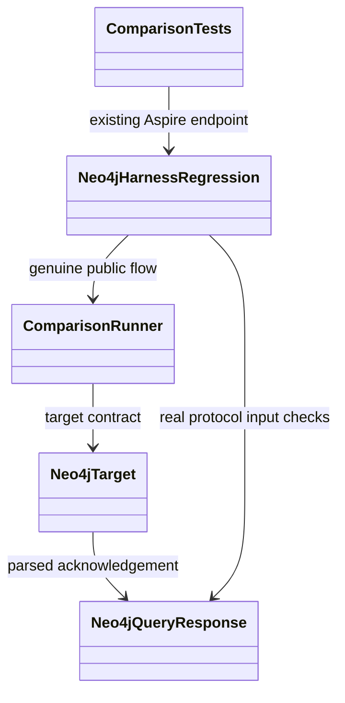
| scripts | Features/RepositoryGovernance/verify.mjs | RepositoryGovernance; real-repository static verification with Node built-ins. |
| src/KeyLoad.Analyzers | KeyLoad.Analyzers.csproj, Features/CodeQuality/ | CodeQuality; source-owned Roslyn diagnostics attached to compilation, never runtime storage/routing. |
| tests/KeyLoad.Analyzers.Tests | KeyLoad.Analyzers.Tests.csproj, Features/CodeQuality/ | CodeQuality; real Roslyn/Orleans metadata regressions, TUnit and CI-only execution. |

## Feature convention and migration

Canonical slice names use PascalCase consistently: RepositoryGovernance, BenchmarkComparisons, DocumentStorage, EventStreams, Messaging, GraphTraversal, TimeSeries, Search, QueryExecution, Authorization, ChangeFeeds, StorageRecovery, ClusterReplication, ClusterRouting, ClientApi, BackupRestore, BlobStorage, ResourceExecution, CodeQuality and TestInfrastructure. Their owning contracts and navigation are in the [Feature index](README.md).

The embedded microbenchmark boundary follows Accepted ADR-047; it is peripheral
runner qualification and does not replace the first product server's RF3 topology.
The real generated child requires an externally visible unsealed library fixture:

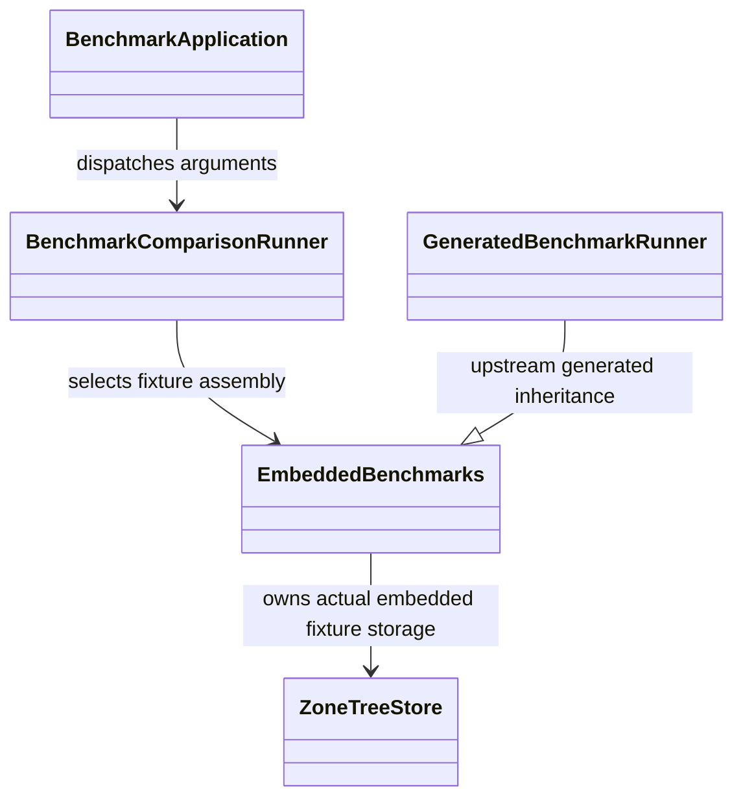

Target feature-owned paths are `<project-or-module>/Features/<SliceName>/`; tests mirror that name under their project roots; feature docs are `docs/Features/<SliceName>.md`. Shared entry points, composition roots, truly shared contracts and global infrastructure may remain outside feature folders. A non-applicable surface must be recorded as N/A with its reason in the feature spec.

[CodeQuality](Features/CodeQuality.md) is a compile-time slice defined by [ADR-033](ADR/ADR-033-code-quality.md). Central SDK/style analysis and source-owned Roslyn rules produce compiler/IDE findings and per-project SARIF reports. This build infrastructure has no database runtime or persistence surface.

[ADR-043](ADR/ADR-043-comparison-library-host.md) owns the preserving comparative
library/sole-CLI split. Tests retain the same public harness assembly/API and Aspire
retains its comparisons resource/configuration; source is joined but combined build
and qualification remain pending. [ADR-044](ADR/ADR-044-benchmark-immutable-contracts.md)
now accepts the separate immutable harness collection and CLR naming migration,
with valid JSON/configuration values and all real engine gates preserved.

[ADR-045](ADR/ADR-045-postgres-schema-ownership.md) accepts owned transient
PostgreSQL benchmark schemas and constant commands. Existing public target calls
retain exact workloads; typed context and a matching owner marker guard cleanup.
Real regression helpers share the existing Aspire PG container after measurement;
implementation and GitHub qualification remain pending.

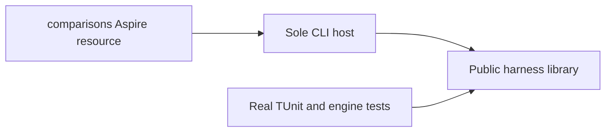

[ResourceExecution](Features/ResourceExecution.md) and [ADR-035](ADR/ADR-035-memory-performance.md)
define the current memory/performance repair contract. Common budgets belong to
shared node-local building blocks; operation behavior stays in its canonical
feature slice. [ClientApi](Features/ClientApi.md) owns HTTP response streaming.
Scoped document/vector visitors feed QueryExecution and Search without raw pages;
GraphTraversal retains cut-scoped visibility decisions. The shared canonical JSON
writer streams fingerprints to a hash and preserves exact signatures. The located
[repair inventory](implementation/memory-performance.md) records every open join.
Implementation and real qualification are in progress; read-only findings do not
establish measured speed, bounded process RSS or production readiness.

Shared atomic commit/outcome dispatch remains outside feature folders because it
joins multiple mutation families. Document CRUD handlers and transaction-scoped
image carriers now belong to `Core/Features/DocumentStorage/`; admission/inbox
ownership belongs to `Core/Features/ResourceExecution/` under [ADR-042](ADR/ADR-042-admission-resource-ownership.md).
The existing oversized aggregate DatabaseEngine partial type remains the explicit,
time-bounded ADR-041 handler-extraction deviation; splitting files alone does not
satisfy the type limit.

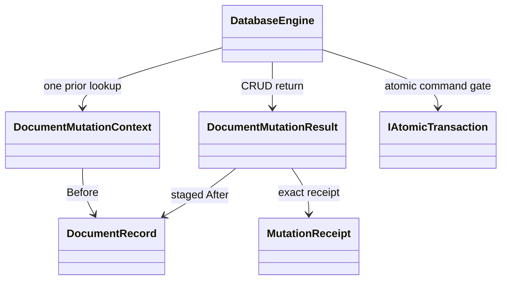

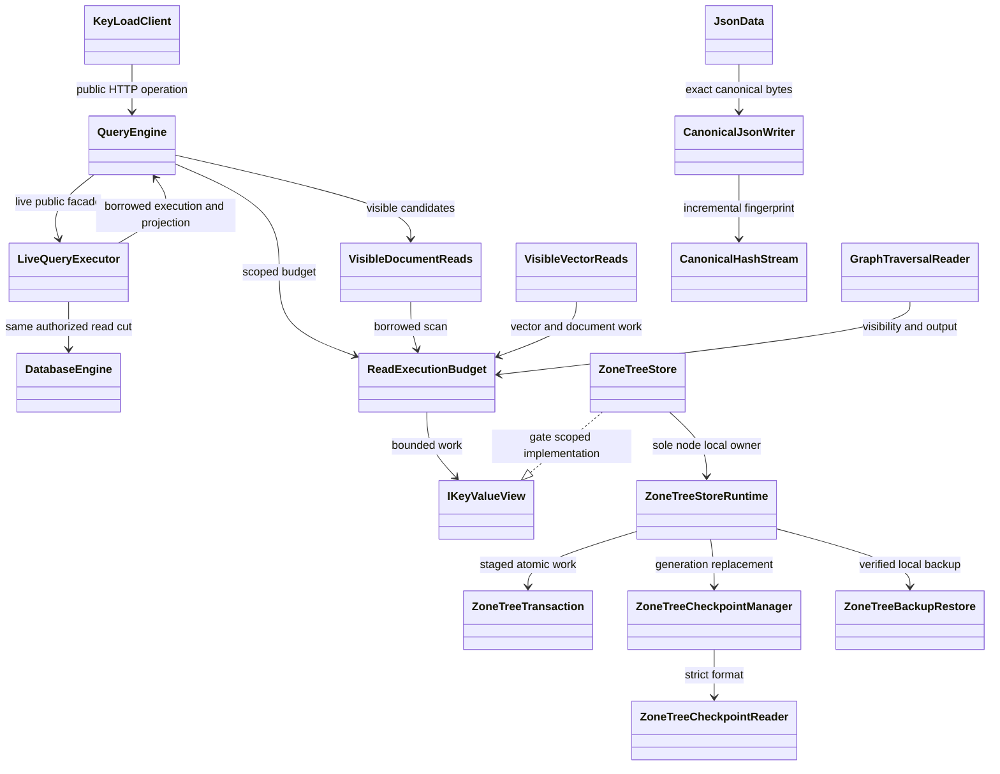

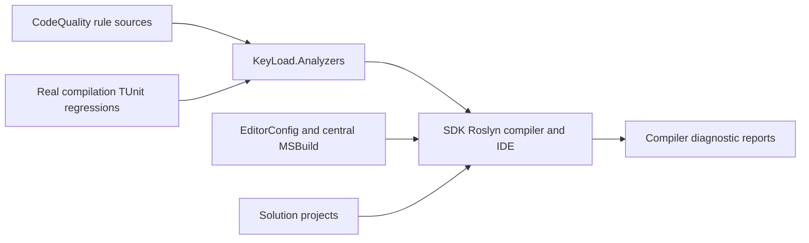

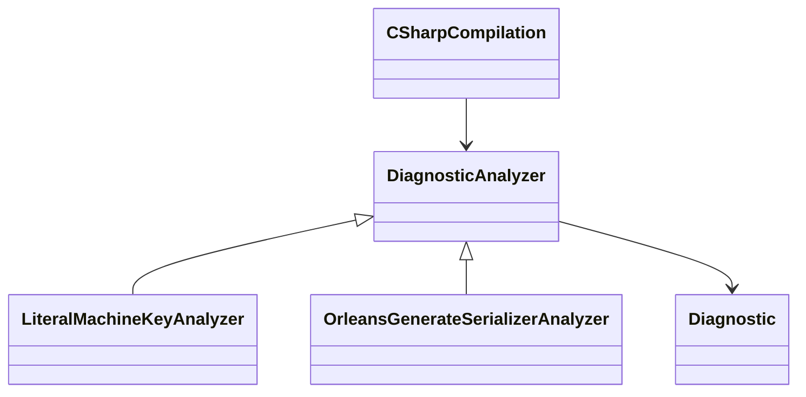

The existing flat/layered feature files are migration debt, not compliant target structure. [ADR-032](ADR/ADR-032-mcaf-governance.md) records actual paths, owners, target layout, verification and removal date. New feature-owned work must use the target convention. No runtime code is moved by the governance bootstrap.

Public chunked blobs and partial reads are required in [BlobStorage](Features/BlobStorage.md), with unresolved contracts in Proposed [ADR-038](ADR/ADR-038-chunked-blob-storage.md). Required official MCP and simple agent adapters belong to [ClientApi](Features/ClientApi.md) and Proposed [ADR-039](ADR/ADR-039-official-mcp-agent-api.md); business operations retain their existing Feature owners. Private snapshot chunks and backup archive pieces do not implement public BlobStorage.

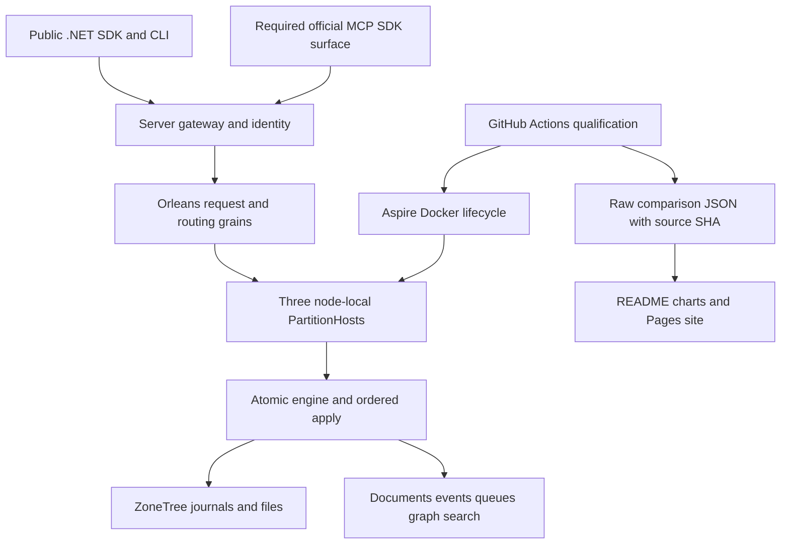

## Fresh website evidence boundary (BC028)

The separate Pages consumer uses trusted control-workflow source, authentic
successful exact-attempt comparison execution and one digest-verified archive.
Publication qualifies current trusted-main website source independently from the
separate inspected measured-source checkout; candidate validation cannot deploy.
Unrelated database-workflow failure is outside the site-only boundary. Complete
site qualification and repeated website/evidence freshness proof precede Pages.
See [BenchmarkComparisons](Features/BenchmarkComparisons.md),
[ADR-040](ADR/ADR-040-static-site-threejs-evidence.md) and publication acceptance.

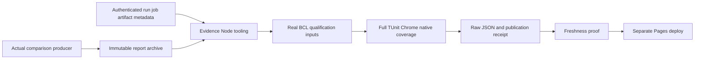

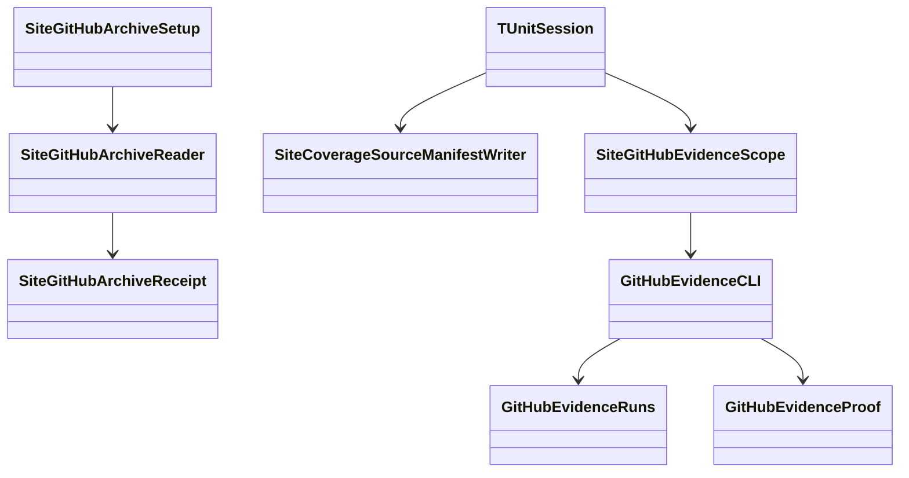

## Shared request contracts

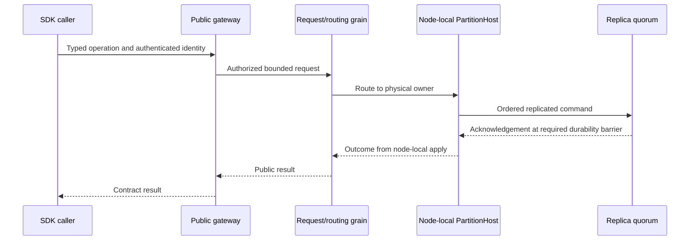

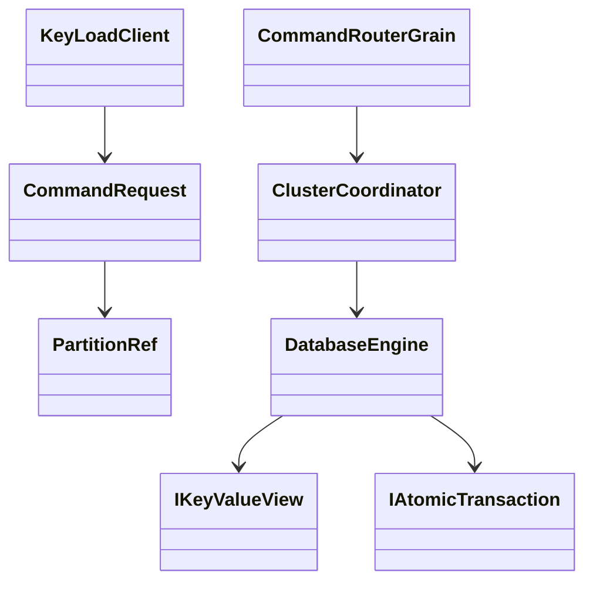

## Current implementation and qualification gaps

The product design still contains earlier DotNext-candidate and standalone-first text. Current AGENTS policy supersedes those choices. The current server source composes a node-local PartitionHost with the Orleans silo, distributed grain directory, activation repartitioner and separate request grains under [ADR-036](ADR/ADR-036-orleans-foundation.md). The three-node Aspire graph is present. No current integration case forces activation migration and verifies node-local storage ownership afterward; delivered-source GitHub qualification is pending. TUnit package/test migration and persisted principal/API-key verifier, grant, feed and paused local restore behavior are source-present. Public BlobStorage and official MCP/agent protocol mapping remain Proposed. The diagrams show mandatory ownership and delivery boundaries; they do not claim every target is implemented. Current build/formatter prerequisites and their exact historical source cuts are recorded in [CodeQuality evidence](implementation/code-quality.md); full solution and delivered-SHA qualification remain open.

The successful [GitHub CI baseline 36926803549](https://github.com/managedcode/KeyLoad/actions/runs/36926803549) measured commit 9c570f8c33a7a9667507a8e1c0ca68860de3be45. It does not qualify later uncommitted work, power-loss durability, endurance or production readiness. See [implementation status](implementation/status.json), [durability audit](implementation/durability-audit.md), [comparative benchmark contract](implementation/comparative-benchmarks.md), [RepositoryGovernance](Features/RepositoryGovernance.md) and [ADR-032](ADR/ADR-032-mcaf-governance.md).

## TimeSeries comparison boundary

[ADR-050](ADR/ADR-050-timeseries-timescale-comparison.md) adds a separate profile
using the real KeyLoad RF3 SDK, digest-pinned TimescaleDB, and
ManagedCode.TimeSeries as an explicitly in-memory aggregation library. It keeps
schema3 engine counts intact and reports each arm's storage and acknowledgement
guarantees separately. Implementation and exact-SHA CI proof are pending.

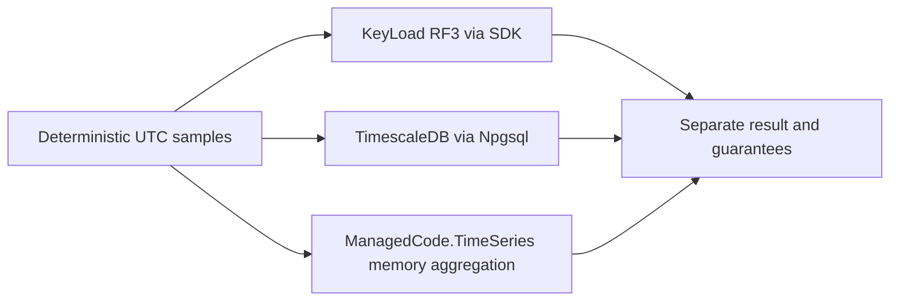
