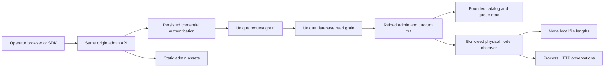

# AdminDashboard

Status: Accepted implementation contract, source and exact-SHA qualification pending. Owner: KeyLoad lead. User request: attractive runtime administration with sizes, throughput, tables/collections, queues and files.

Canonical criteria and testing methodology: [acceptance](../../admin-dashboard.acceptance.md); task graph/ordered evidence: [plan](../../admin-dashboard.plan.md); architecture: [ADR-051](../ADR/ADR-051-admin-dashboard.md). These documents define one contract, not independent competing status claims.

| Requirement | Acceptance | Intended automated proof |
|---|---|---|
| REQ-AD-001 persisted administrator authorization and grain isolation | AC-AD-001 | AdminDashboardAuthorizationTests, AdminDashboardRf3Tests |
| REQ-AD-002 honest bounded physical storage observation | AC-AD-002 | AdminStorageObservationTests, AdminDashboardRf3Tests |
| REQ-AD-003 actual process HTTP throughput/duration counters | AC-AD-003 | AdminHttpMetricsTests, AdminDashboardBrowserTests |
| REQ-AD-004 bounded metadata/catalog and authorized document/blob browsing | AC-AD-004 | AdminCatalogTests, AdminDashboardRf3Tests, browser |
| REQ-AD-005 non-consuming queue counters/metadata | AC-AD-005 | AdminQueueTests, AdminDashboardRf3Tests |
| REQ-AD-006 accessible responsive usable administration console | AC-AD-006 | AdminDashboardBrowserTests and explicit subjective screenshot review |
| REQ-AD-007 integrated .NET/official MCP callers and honest qualification | AC-AD-007 | MCP inventory and RF3 tests; canonical GitHub gates |

## Canonical slice map

- Public DTO/protocol: `src/KeyLoad.Abstractions/Features/AdminDashboard/`.
- Gated catalog/queue behavior: `src/KeyLoad.Core/Features/AdminDashboard/`.
- Grain composition: existing ClusterRouting read enum, unique request/read actors and borrowed INodeAdministration; no new durable grain state or grain-owned filesystem.
- API, observations, exact static hosting and frontend: `src/KeyLoad.Server/Features/AdminDashboard/`, with frontend `Assets/` fully colocated executable artifacts. Existing shared server configuration is composition only.
- .NET SDK: `src/KeyLoad.Client/Features/AdminDashboard/`; official MCP/agent declarations consume these same typed capabilities.
- Tests: `tests/KeyLoad.UnitTests/Features/AdminDashboard/`, `tests/KeyLoad.IntegrationTests/Features/AdminDashboard/`.
- Infrastructure: existing canonical `ci.yml` RF3/unit/recovery gates; public `site/` and Pages publication N/A because operational administration is hosted by the database server, not the public benchmark site.
- Persisted schema/migrations N/A: observation uses existing records and writes no new database state. Benchmark workload N/A: observation does not establish performance superiority. SMID/Orleans Streams N/A to implementation; their priority/qualification remain separately tracked.

Empty/loading/error, stale/disconnected observations, unauthorized/revoked callers, invalid scope/limits, bounded pagination, due-but-unswept queues, changed files, cancellation and reconnect resets are required flows. Physical bytes have separate canonical/replica/backups categories; published blob lengths are logical metadata. No sum across RF3 replicas is labelled unique database size. Runtime values are actual current observations, independent of benchmark GitHub evidence.
