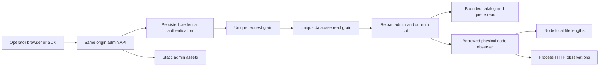

# AdminDashboard

Status: source implemented and desktop/mobile design manually inspected; exact-SHA GitHub runtime/browser/coverage qualification pending. ADR-051 remains Accepted. Owner: KeyLoad lead. User request: attractive runtime administration with sizes, throughput, tables/collections, queues and files.

This is the durable requirements and acceptance contract. Architecture and the ordered agent implementation contract are in [ADR-051](../ADR/ADR-051-admin-dashboard.md). Root-level brainstorm, acceptance and plan files are local task scaffolding under the repository ignore policy; delivery evidence belongs here and in `docs/implementation/status.json`.

| Requirement | Acceptance | Intended automated proof |
|---|---|---|
| REQ-AD-001 persisted administrator authorization and grain isolation | AC-AD-001 | AdminCatalogTests, AdminDashboardRf3Tests |
| REQ-AD-002 honest bounded physical storage observation | AC-AD-002 | AdminStorageObservationTests, AdminDashboardRf3Tests |
| REQ-AD-003 actual process HTTP throughput/duration counters | AC-AD-003 | AdminHttpMetricsTests, AdminDashboardBrowserTests |
| REQ-AD-004 bounded metadata/catalog and authorized document/blob browsing | AC-AD-004 | AdminCatalogTests, AdminDashboardRf3Tests, browser |
| REQ-AD-005 non-consuming queue counters/metadata | AC-AD-005 | AdminQueueTests, AdminDashboardRf3Tests |
| REQ-AD-006 accessible responsive usable administration console | AC-AD-006 | AdminDashboardBrowserTests and explicit subjective screenshot review |
| REQ-AD-007 integrated .NET/official MCP callers and honest qualification | AC-AD-007 | MCP inventory and RF3 tests; canonical GitHub gates |

## Canonical slice map

- Public DTO/protocol: `src/KeyLoad.Abstractions/Features/AdminDashboard/`.
- Gated catalog/queue behavior: `src/KeyLoad.Core/Features/AdminDashboard/`.
- Grain composition: existing ClusterRouting read enum, unique request/read actors and borrowed INodeAdministration; no new durable grain state or grain-owned filesystem.
- API, observations, exact static hosting and frontend: `src/KeyLoad.Server/Features/AdminDashboard/`, with frontend `Assets/` fully colocated executable artifacts. Existing shared server configuration is composition only.
- .NET SDK: `src/KeyLoad.Client/Features/AdminDashboard/`; official MCP/agent declarations consume these same typed capabilities.
- Tests: `tests/KeyLoad.UnitTests/Features/AdminDashboard/`, `tests/KeyLoad.IntegrationTests/Features/AdminDashboard/`.
- Infrastructure: existing canonical `ci.yml` RF3/unit/recovery gates; public `site/` and Pages publication N/A because operational administration is hosted by the database server, not the public benchmark site.
- Persisted schema/migrations N/A: observation uses existing records and writes no new database state. Benchmark workload N/A: observation does not establish performance superiority. SMID/Orleans Streams N/A to implementation; their priority/qualification remain separately tracked.

Empty/loading/error, stale/disconnected observations, unauthorized/revoked callers, invalid scope/limits, bounded pagination, due-but-unswept queues, changed files, cancellation and reconnect resets are required flows. Physical bytes have separate canonical/replica/backups categories; published blob lengths are logical metadata. No sum across RF3 replicas is labelled unique database size. Runtime values are actual current observations, independent of benchmark GitHub evidence.

## Scope, actors and boundaries

Goal: a polished same-origin database console at `/admin`, showing real RF3 node metrics, database and file sizes, throughput, collections/tables, document rows, blob metadata and non-consuming queue inspection. Canonical feature: `AdminDashboard`.

In scope: read-only runtime administration, authenticated typed HTTP/.NET SDK/official MCP operations, bounded pages and live observation. Out of scope: schema/data edits, queue receive/ack/redrive, backup buttons, public Pages publication, new frontend frameworks/packages, SMID implementation, changes to durability/RF3/routing ownership, and performance supremacy. Existing database operations remain their owning slices.

Actors: an operator with a current persisted administrator principal, an unauthorized/revoked/expired caller, and an unauthenticated visitor loading only the credential-free static shell. Authorization is reloaded inside the quorum-read actor. Credentials exist only in browser memory; requests use same-origin Bearer headers. User enters tenant/database and atomic partition key; a resource supplies its persisted transaction-domain identity. A catalog resource is not a physical partition. Scope defaults are editable conveniences, not claims about all database tenants.

## Criteria and pass/fail

- **AC-AD-001 / REQ-AD-001**: `/admin` and a finite exact static-asset whitelist load without a key; every dashboard data operation requires current persisted administrator authority. Missing credential fails unauthenticated; nonadmin/revoked/expired keys fail with safe errors. No trusted client roles, broad `/admin` authentication exemption, secrets, absolute filesystem paths, localStorage/sessionStorage or credential-bearing URLs. Dashboard APIs use distinct request/read grains and current quorum cuts.
- **AC-AD-002 / REQ-AD-002**: snapshot identifies the actual executing physical node, incarnation, capture time, applied/read generation, voters, leader, configured durability and admission occupancy. File lengths separate canonical database, replica journal, backups and node total; these are physical observations, not unique logical/cluster bytes. Enumeration visits at most 2,048 entries, lasts at most a cooperative 250 ms budget, returns at most 200 file summaries, honors cancellation and never follows symlinks. Missing/changing/unreadable files or exceeded bounds are explicit incomplete/unavailable observations, never a fabricated complete zero. One concurrent filesystem observation per node; saturation fails promptly. These observational reads do not own files or mutate storage.
- **AC-AD-003 / REQ-AD-003**: process-local HTTP counters capture completed public API requests, failed requests and elapsed duration without high-cardinality labels/payloads; dashboard polling, admission/status observations, static, health and internal routes are excluded. UI computes HTTP requests/s and average response duration only from two samples of the same node/process and monotonic counters, retaining at most 120 samples. New process, failed observation and reconnect reset/mark history unavailable. Admission occupancy is not throughput; cluster throughput is not inferred from one node.
- **AC-AD-004 / REQ-AD-004**: catalog uses explicit tenant/database and exclusive resource-name continuation, 1..100 limit (default 50), gated read plus bounded byte/cancellation budget. It returns metadata only (name/kind/domain/schema/index count/paused), no keys or policies. Collection rows use existing authorized query AST/cursor, 25-row pages; blob pages use existing authorized metadata listing and expose actual logical published length. Empty/missing/unsupported kinds and invalid scope/limits produce clear states. Text renders via safe DOM APIs; stored HTML is text, not executable markup.
- **AC-AD-005 / REQ-AD-005**: queue page reads persisted counters and at most 100 metadata records (default 50), with exclusive message-ID continuation; messages expose lifecycle, attempts, versions and times without payload/header/lease-owner tokens. Inspection never receives, sweeps, claims, ACKs or changes ready sequence/counters/commit position. Due scheduled and expired leases remain their persisted states until ordinary queue work transitions them. Stored and in-flight counts are exact persisted counters; page state counts are not presented as total Ready/DLQ counts.
- **AC-AD-006 / REQ-AD-006**: console provides coherent sidebar navigation (overview, collections, queues, files, cluster), readable metric cards and measured throughput plot, scope controls, manual refresh and bounded automatic refresh, paginated tables, document JSON details, empty/loading/unauthorized/disconnected/error states. Desktop and 390 px mobile layouts fit without page overflow; keyboard navigation, visible focus, labels, status announcements and reduced-motion behavior work. Disconnect clears credential and all sensitive DOM/history; one in-flight refresh per session and abort/epoch handling prevent stale post-disconnect renders. Background tabs suspend polling; overlapping polls cannot accumulate.
- **AC-AD-007 / REQ-AD-007**: all three new reads are available through typed .NET SDK and explicit official MCP catalog/agent gateway with read-only/nondestructive hints and unchanged prior operation semantics. TUnit/Microsoft.Testing.Platform regressions use actual file-backed stores and actual Docker/Aspire RF3 + real .NET/official MCP clients; browser tests use the real server/browser, no mocked API or doubles. Exact-SHA GitHub build/format/analyzer/governance/unit/recovery/RF3/browser receipts and artifacts must exist before qualification is claimed. Required coverage thresholds stay mandatory; absent collector/result is an open gate, not success.

## Criterion-to-test matrix

| Criteria | Planned test/level | Assertions and verification |
|---|---|---|
| 001 | AdminCatalogTests / unit real store; AdminDashboardRf3Tests / RF3; AdminDashboardBrowserTests / browser | admin vs member/revoked/missing credentials; exact static whitelist; request IDs; no secret or traversal; `ci.yml` TUnit unit + RF3 jobs |
| 002 | AdminStorageObservationTests / real files; AdminDashboardRf3Tests | actual known file lengths, limits, incomplete symlink/error/cancel, node identities, physical accounting; CI unit + RF3 |
| 003 | AdminHttpMetricsTests / real counters; AdminDashboardBrowserTests / real API traffic | monotonic successes/errors/time, exclusion and reset, bounded chart samples; CI unit + RF3 browser |
| 004 | AdminCatalogTests / real store; AdminDashboardRf3Tests; browser | pagination positive/zero/over-limit/cross-tenant scopes, real document/blob flow and hostile text; CI unit + RF3 |
| 005 | AdminQueueTests / real store; AdminDashboardRf3Tests | empty and populated lanes, metadata pagination, state/counter/read-position unchanged; CI unit + RF3 |
| 006 | AdminDashboardBrowserTests / real RF3 + actual headless browser | navigation, credential disconnect, empty/error/loading, document viewing, viewport overflow, keyboard; CI RF3 browser; manual visual inspection adds design evidence only |
| 007 | MCP catalog unit assertions + AdminDashboardRf3Tests | tool inventory/shapes/hints, real SDK/MCP agreement and auth failure; all canonical CI gates |

Manual exception: subjective visual polish is inspected via desktop/mobile screenshots; it does not replace functional browser or numeric coverage qualification. Migration is additive, with no persisted schema changes or dependencies. Rollback removes this slice's routes/assets/client methods/read enum additions in a coordinated release; existing wire enum numbers remain stable. ADR-051 defines the implementation contract. Unknown SMID mapping and separate Orleans Streams qualification remain visible independent workstreams.

## Traceability and delivery evidence

REQ/AC-AD-001..007 map to ADR-051 and tasks AD-C (shared integration), AD-B (backend), AD-U (UI), AD-T (tests) and AD-J (lead review/delivery). The requirement table and criterion-to-test matrix identify the automated owning suites. The subjective design exception requires desktop and mobile visual review; no functional or numeric gate is waived.

Latest completed candidate: exact `b533c80a128a85c6e2072de3bc011a09d4a97cc7`, [CI run 37032546228](https://github.com/managedcode/KeyLoad/actions/runs/37032546228). Build, format, governance and analyzer/source-inventory checks passed on all three operating systems. Real RF3 SDK/MCP catalog and queue parity, non-consuming inspection, physical-node snapshots and actual HTTP counters passed. The complete run failed: slash-equivalent static routes made the shell return HTTP 500, browser navigation could not start, and authorization/queue fixtures violated existing epoch/time contracts. Source repairs and stronger GET/HEAD/browser assertions await a new exact-SHA run; there is no successful browser screenshot receipt yet. Shared MCP discovery oracle, native logging lifecycle, process recovery and comparison failures are tracked independently and cannot count as successful qualification.

The earlier exact `49a5b6054843800e20e333ddaa28fa96d79dd294`, [CI run 37029344985](https://github.com/managedcode/KeyLoad/actions/runs/37029344985), stopped before runtime tests at compiler/analyzer errors; later source fixes compile. Downloaded candidate receipts are retained under ignored `artifacts/qualification/admin-dashboard/37032546228/`. Root thresholds require numeric coverage, but no MTP/TUnit collector or baseline is configured: coverage remains an open gate. No local tests were executed. ADR-051 remains Accepted while required qualification is incomplete.
