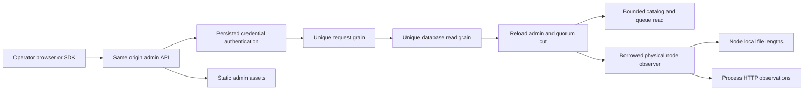

# AdminDashboard

The owner-requested shared favicon export and noindex continuation is specified
by [SiteMetadata](BenchmarkComparisons/SiteMetadata.md), REQ-SEO-001/005 and
AC-SEO-001/006 under ADR053. It adds only finite public icon GET/HEAD assets;
all operational authorization and existing console contracts remain required.

Status: source delivered; exact-SHA dashboard unit, RF3 API and native Chrome cases pass, and retained desktop/mobile screenshots are visually reviewed. Complete recovery/comparison and numeric coverage gates remain open; ADR-051 remains Accepted. Owner: KeyLoad lead. User request: attractive runtime administration with sizes, throughput, tables/collections, queues and files.

This is the durable requirements and acceptance contract. Architecture and the ordered agent implementation contract are in [ADR-051](../ADR/ADR-051-admin-dashboard.md). Root-level brainstorm, acceptance and plan files are local task scaffolding under the repository ignore policy; delivery evidence belongs here and in `docs/implementation/status.json`.

| Requirement | Acceptance | Intended automated proof |
|---|---|---|
| REQ-AD-001 persisted administrator authorization and grain isolation | AC-AD-001 | AdminCatalogTests, AdminDashboardRf3Tests |
| REQ-AD-002 honest bounded physical storage observation | AC-AD-002 | AdminStorageObservationTests, AdminDashboardRf3Tests |
| REQ-AD-003 actual process HTTP throughput/duration counters | AC-AD-003 | AdminHttpMetricsTests, AdminDashboardBrowserTests |
| REQ-AD-004 bounded metadata/catalog and authorized document/blob browsing | AC-AD-004 | AdminCatalogTests, AdminDashboardRf3Tests, browser |
| REQ-AD-005 non-consuming queue counters/metadata | AC-AD-005 | AdminQueueTests, AdminDashboardRf3Tests |
| REQ-AD-006 accessible responsive usable administration console | AC-AD-006 | AdminDashboardBrowserTests and explicit subjective screenshot review |
| REQ-AD-007 integrated .NET/official MCP callers and honest qualification | AC-AD-007 | MCP inventory and RF3 tests; canonical GitHub gates |
| REQ-AD-008 bounded failed-request log for operators | AC-AD-008 | AdminHttpMetricsTests, AdminHttpMetricsMiddlewareTests, AdminDashboardRf3Tests |
| REQ-AD-009 configured voter membership for the node view | AC-AD-009 | AdminDashboardRf3Tests (SDK and official MCP) |
| REQ-AD-010 light console in the shared KeyLoad identity (ADR-053) | AC-AD-010 | AdminDashboardBrowserTests, SiteBrandParityTests; desktop/mobile review |

## Canonical slice map

- Public DTO/protocol: `src/KeyLoad.Abstractions/Features/AdminDashboard/`.
- Gated catalog/queue behavior: `src/KeyLoad.Core/Features/AdminDashboard/`.
- Grain composition: existing ClusterRouting read enum, unique request/read actors and borrowed INodeAdministration; no new durable grain state or grain-owned filesystem.
- API, observations, exact static hosting and frontend: `src/KeyLoad.Server/Features/AdminDashboard/`, with frontend `Assets/` fully colocated executable artifacts. Existing shared server configuration is composition only.
- .NET SDK: `src/KeyLoad.Client/Features/AdminDashboard/`; official MCP/agent declarations consume these same typed capabilities.
- Tests: `tests/KeyLoad.UnitTests/Features/AdminDashboard/`, `tests/KeyLoad.IntegrationTests/Features/AdminDashboard/`.
- Infrastructure: existing canonical `ci.yml` RF3/unit/recovery gates; public `site/` and Pages publication N/A because operational administration is hosted by the database server, not the public benchmark site.
- Persisted schema/migrations N/A: observation uses existing records and writes no new database state. Benchmark workload N/A: observation does not establish performance superiority. SMID/Orleans Streams N/A to implementation; their priority/qualification remain separately tracked.

Empty/loading/error, stale/disconnected observations, unauthorized/revoked callers, invalid scope/limits, bounded pagination, due-but-unswept queues, changed files, cancellation and reconnect resets are required flows. Physical bytes have separate canonical/replica/backups categories; published blob lengths are logical metadata. No sum across RF3 replicas is labelled unique database size. Runtime values are actual current observations, independent of benchmark GitHub evidence.

## Scope, actors and boundaries

Goal: a polished same-origin database console at `/admin`, showing real RF3 node metrics, database and file sizes, throughput, collections/tables, document rows, blob metadata and non-consuming queue inspection. Canonical feature: `AdminDashboard`.

In scope: read-only runtime administration, authenticated typed HTTP/.NET SDK/official MCP operations, bounded pages and live observation. Out of scope: schema/data edits, queue receive/ack/redrive, backup buttons, public Pages publication, new frontend frameworks/packages, SMID implementation, changes to durability/RF3/routing ownership, and performance supremacy. Existing database operations remain their owning slices.

Actors: an operator with a current persisted administrator principal, an unauthorized/revoked/expired caller, and an unauthenticated visitor loading only the credential-free static shell. Authorization is reloaded inside the quorum-read actor. Credentials exist only in browser memory; requests use same-origin Bearer headers. User enters tenant/database and atomic partition key; a resource supplies its persisted transaction-domain identity. A catalog resource is not a physical partition. Scope defaults are editable conveniences, not claims about all database tenants.

## Criteria and pass/fail

- **AC-AD-001 / REQ-AD-001**: `/admin` and a finite exact static-asset whitelist load without a key; every dashboard data operation requires current persisted administrator authority. Missing credential fails unauthenticated; nonadmin/revoked/expired keys fail with safe errors. No trusted client roles, broad `/admin` authentication exemption, secrets, absolute filesystem paths, localStorage/sessionStorage or credential-bearing URLs. Dashboard APIs use distinct request/read grains and current quorum cuts.
- **AC-AD-002 / REQ-AD-002**: snapshot identifies the actual executing physical node, incarnation, capture time, applied/read generation, voters, leader, configured durability and admission occupancy. File lengths separate canonical database, replica journal, backups and node total; these are physical observations, not unique logical/cluster bytes. Enumeration visits at most 2,048 entries, lasts at most a cooperative 250 ms budget, returns at most 200 file summaries, honors cancellation and never follows symlinks. Missing/changing/unreadable files or exceeded bounds are explicit incomplete/unavailable observations, never a fabricated complete zero. One concurrent filesystem observation per node; saturation fails promptly. These observational reads do not own files or mutate storage.
- **AC-AD-003 / REQ-AD-003**: process-local HTTP counters capture completed public API requests, failed requests and elapsed duration without high-cardinality labels/payloads; dashboard polling, admission/status observations, static, health and internal routes are excluded. UI computes HTTP requests/s and average response duration only from two samples of the same node/process and monotonic counters, retaining at most 120 samples. New process, failed observation and reconnect reset/mark history unavailable. Admission occupancy is not throughput; cluster throughput is not inferred from one node.
- **AC-AD-004 / REQ-AD-004**: catalog uses explicit tenant/database and exclusive resource-name continuation, 1..100 limit (default 50), gated read plus bounded byte/cancellation budget. It returns metadata only (name/kind/domain/schema/index count/paused), no keys or policies. Collection rows use existing authorized query AST/cursor, 25-row pages; blob pages use existing authorized metadata listing and expose actual logical published length. Empty/missing/unsupported kinds and invalid scope/limits produce clear states. Text renders via safe DOM APIs; stored HTML is text, not executable markup.
- **AC-AD-005 / REQ-AD-005**: queue page reads persisted counters and at most 100 metadata records (default 50), with exclusive message-ID continuation; messages expose lifecycle, attempts, versions and times without payload/header/lease-owner tokens. Inspection never receives, sweeps, claims, ACKs or changes ready sequence/counters/commit position. Due scheduled and expired leases remain their persisted states until ordinary queue work transitions them. Stored and in-flight counts are exact persisted counters; page state counts are not presented as total Ready/DLQ counts.
- **AC-AD-006 / REQ-AD-006**: console provides coherent grouped navigation in a floating command bar (overview, collections, queues, files, cluster and the ADR-053 additions), readable metric cards and measured throughput plot, scope controls, manual refresh and bounded automatic refresh, paginated tables, document JSON details, empty/loading/unauthorized/disconnected/error states. Desktop and 390 px mobile layouts fit without page overflow; keyboard navigation, visible focus, labels, status announcements and reduced-motion behavior work. Disconnect clears credential and all sensitive DOM/history; one in-flight refresh per session and abort/epoch handling prevent stale post-disconnect renders. Background tabs suspend polling; overlapping polls cannot accumulate.
- **AC-AD-007 / REQ-AD-007**: all three new reads are available through typed .NET SDK and explicit official MCP catalog/agent gateway with read-only/nondestructive hints and unchanged prior operation semantics. TUnit/Microsoft.Testing.Platform regressions use actual file-backed stores and actual Docker/Aspire RF3 + real .NET/official MCP clients; browser tests use the real server/browser, no mocked API or doubles. Exact-SHA GitHub build/format/analyzer/governance/unit/recovery/RF3/browser receipts and artifacts must exist before qualification is claimed. Required coverage thresholds stay mandatory; absent collector/result is an open gate, not success.

- **AC-AD-008 / REQ-AD-008**: `AdminHttpSnapshot.RecentFailures` keeps the newest 50 failed `/v1` and `/mcp` requests (status ≥ 400, aborted or faulted), newest first. Each entry holds the completion time, normalised method (unknown methods become `OTHER`), matched route template (or `unmatched`), status, aborted flag and duration.
  - It never holds a raw path, query, payload, header or credential.
  - Successful and excluded (dashboard polling, admission, status, static, health) requests are never logged.
  - The log resets with the process. The Errors view filters 4xx/5xx/aborted and clears on disconnect.
- **AC-AD-009 / REQ-AD-009**: the snapshot carries the executing voter identity (`LocalVoter`) and configured membership (`Voters`), comparable with `Node.Leader`.
  - The Nodes view draws the executing node, the leader and the remaining peers, and labels peers as not observed from this node. Membership never implies peer health.
- **AC-AD-010 / REQ-AD-010**: the console uses the shared brand (ADR-053) in a light theme with grouped navigation:
  - Monitoring: overview, performance, errors.
  - Data: catalog, collections, queues, blob storage.
  - Infrastructure: nodes, disk usage.
  - It also has KPI sparklines, stacked request activity with a crosshair tooltip, a storage donut, admission meters, catalog kind chips (page counts, never totals) and a disk category bar with largest files.
  - All AC-AD-006 hooks and behaviours stay intact. No horizontal overflow at 1440 and 390 px. A mobile menu toggle exposes `aria-expanded`.
  - Control-room layout (design overhaul, owner direction 2026-10-03):
    - the `<aside>` is a floating command bar with three segmented clusters; at ≤1320 px only icons show, plus the label of the active view; at ≤760 px `#menu-toggle` opens the clusters as a sheet;
    - an editorial masthead holds `#view-title`, `#refresh` and `#disconnect`;
    - a pulse strip shows the four KPIs;
    - graphite instrument panels hold activity, throughput, events and RF3 voters;
    - a fixed status bar holds `#connection-state`, `#session-node` and `#captured-at`;
    - the connect screen is split, and `#details-dialog` is a right-hand inspector sheet.
  - Every id, `data-view`/`data-goto` hook and pinned count is unchanged.

## Criterion-to-test matrix

| Criteria | Planned test/level | Assertions and verification |
|---|---|---|
| 001 | AdminCatalogTests / unit real store; AdminDashboardRf3Tests / RF3; AdminDashboardBrowserTests / browser | admin vs member/revoked/missing credentials; exact static whitelist; request IDs; no secret or traversal; `ci.yml` TUnit unit + RF3 jobs |
| 002 | AdminStorageObservationTests / real files; AdminDashboardRf3Tests | actual known file lengths, limits, incomplete symlink/error/cancel, node identities, physical accounting; CI unit + RF3 |
| 003 | AdminHttpMetricsTests / real counters; AdminDashboardBrowserTests / real API traffic | monotonic successes/errors/time, exclusion and reset, bounded chart samples; CI unit + RF3 browser |
| 004 | AdminCatalogTests / real store; AdminDashboardRf3Tests; browser | pagination positive/zero/over-limit/cross-tenant scopes, real document/blob flow and hostile text; CI unit + RF3 |
| 005 | AdminQueueTests / real store; AdminDashboardRf3Tests | empty and populated lanes, metadata pagination, state/counter/read-position unchanged; CI unit + RF3 |
| 006 | AdminDashboardBrowserTests / real RF3 + actual headless browser | navigation, credential disconnect, empty/error/loading, document viewing, viewport overflow, keyboard; CI RF3 browser; manual visual inspection adds design evidence only |
| 007 | AdminDashboardRf3Tests with real SDK/official MCP operations | discovered operation metadata, real catalog/nonconsuming-queue agreement and persisted auth failure; all canonical CI gates |
| 008 | AdminHttpMetricsTests, AdminHttpMetricsMiddlewareTests / unit; AdminDashboardRf3Tests / RF3 | bound, order, exact fields, template-not-path, exclusions, real SDK failure appears; CI unit + RF3 |
| 009 | AdminDashboardRf3Tests / RF3 SDK and official MCP | three distinct voters, local voter and leader are members, SDK and MCP agree; CI RF3 |
| 010 | AdminDashboardBrowserTests / real Chrome; SiteBrandParityTests / pages | navigation across all nine views, overflow, reduced motion, brand parity; screenshots reviewed |

Manual exception: subjective visual polish is inspected via desktop/mobile screenshots; it does not replace functional browser or numeric coverage qualification. Current dashboard reads use the existing persisted model and dependencies. Rollback removes this slice's routes/assets/client methods/read enum additions in a coordinated release; existing wire enum numbers remain stable. ADR-051 defines the implementation contract. Unknown SMID mapping and separate Orleans Streams qualification remain visible independent workstreams.

TASK-OWNER-REJECTED-TRIVIAL-PRUNE removes the catalog-array-only case and the
two invalid-retention constructor cases. They perform no dashboard, request or
metric lifecycle operation and cannot contribute functional product coverage.
Preserve AdminHttpMetricsTests' real observation/ordering/bounds flows and the
actual SDK/official-MCP RF3 catalog and nonconsuming queue operation case,
`AcAd007RealSdkAndOfficialMcpAgreeOnCatalogAndNonconsumingQueue`. Root owns the
guarded deletion and full build/normal/scalar owning regressions, followed by a
fresh native coverage census. ADR: N/A, no product or architecture changes.

## Traceability and delivery evidence

REQ/AC-AD-001..007 map to ADR-051 and tasks AD-C (shared integration), AD-B (backend), AD-U (UI), AD-T (tests) and AD-J (lead review/delivery). The requirement table and criterion-to-test matrix identify the automated owning suites. The subjective design exception requires desktop and mobile visual review; no functional or numeric gate is waived.

Verified source: `8f81c7c5bef169bb5709e9695c6662002b96ea69`, [CI run 37039965957](https://github.com/managedcode/KeyLoad/actions/runs/37039965957). The lead inspected downloaded TUnit reports and actual browser images; zero dashboard cases were skipped. Solution Release build, formatter, governance and all 118 source-owned analyzer tests pass on Linux, macOS and Windows.

| Exact-source receipt | Result | Evidence |
|---|---|---|
| Dashboard unit, Linux | 13/13; full unit 805/805 | [verify job 110947385090](https://github.com/managedcode/KeyLoad/actions/runs/37039965957/job/110947385090), artifact 11242626726 |
| Dashboard unit, macOS | 13/13; full unit 805/805 | [verify job 110947384936](https://github.com/managedcode/KeyLoad/actions/runs/37039965957/job/110947384936), artifact 11242846364 |
| Dashboard unit, Windows | 13/13; full unit 801/805 | [verify job 110947384996](https://github.com/managedcode/KeyLoad/actions/runs/37039965957/job/110947384996), artifact 11242507999 |
| Actual Docker/Aspire RF3 | 36/36, including 6 dashboard API cases and the complete native Chrome case | [RF3 job 110947384866](https://github.com/managedcode/KeyLoad/actions/runs/37039965957/job/110947384866), [artifact 11242571382](https://github.com/managedcode/KeyLoad/actions/runs/37039965957/artifacts/11242571382) |
| Subjective desktop/mobile design | Lead visually reviewed genuine connected RF3 images at 1440×900 and 390×900 | Same RF3 artifact, `artifacts/qualification/admin-dashboard/desktop.png` and `mobile.png` |

The RF3 cases prove actual .NET/official MCP agreement, catalog/document/queue browsing, JSON text safety, viewport overflow protection, persisted revocation/expiry, disconnect/reconnect, one concurrent refresh, reduced motion and background suspension. TASK-AD-T3 anchors the existing native screenshot output to the repository root without changing capture, assertions or workflow semantics; both PNGs are now retained and the subjective design exception has its required evidence. Local copies and reports are under ignored `artifacts/qualification/admin-dashboard/37039965957/`.

The complete workflow concludes **failure**. Windows has four independent comparison-host startup timeouts: `AcHost003MissingSettingsReportFirstRequiredEndpoint`, `AcHost003InvalidDimensionsFailBeforeRequiredSettingsOrClients`, `AcHost003CommandLineOverridesInvalidEnvironmentDimension` and `AcHost003FirstEndpointAdvancesToSecondRequiredEndpoint`. Recovery is 119/121 on Linux/macOS and 118/121 on Windows; comparison-smoke also fails. These independently owned gates remain open. Passing RF3 does not establish endurance, power-loss durability or production readiness. Root numeric coverage thresholds remain mandatory, but no MTP/TUnit collector or baseline is configured, so no numeric coverage pass is claimed. No local tests were executed. ADR-051 stays Accepted until all required qualification is complete.

Repair traceability: [run 37032546228](https://github.com/managedcode/KeyLoad/actions/runs/37032546228) exposed slash-equivalent routes and fixture epoch/time defects; [run 37036628601](https://github.com/managedcode/KeyLoad/actions/runs/37036628601) exposed empty query projection; [run 37038422388](https://github.com/managedcode/KeyLoad/actions/runs/37038422388) passed the browser but did not retain its images. The final source qualifies those repairs, native logging lifecycle, the independent 50-tool discovery oracle and canonical EventStreams expectations. Earlier compiler failures and cancelled runs are not passing evidence.

Test correction (2026-10-02, exact run 37063262333): `AcAd007` compared the read-cut positions of an SDK read on node1 and an official MCP read on node3. Those are node-local applied positions of two independent gated reads, and concurrent RF3 writes separated them (92 vs 91). The test now requires both cuts to be real (positive). It keeps exact equality of the queue items, counters and catalog items, which is the caller-visible contract.

KL-015 exported telemetry privacy uses REQ/AC-AUTH-KL015-002 and [ADR-121](../ADR/ADR-121-exported-telemetry-privacy.md). Existing bounded dashboard counters/failure rows remain observable and never become raw log/trace payload. The actual Kestrel administration → denial → healthy catalog case supplements existing RF3 administrator/counter cases; neither source nor old-source reports close the current export privacy gate.
