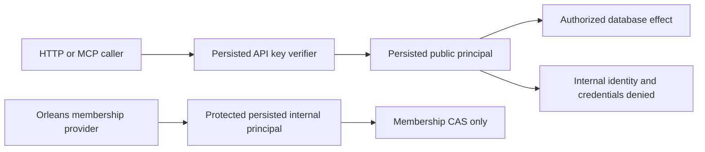

# Authorization

Database-persisted API-key verifiers, principals, grants and policy epochs determine
every public operation. HTTP/MCP callers cannot supply trusted roles. Existing
authorization and field/row projection remain subject to ADR-032's layout debt;
the cluster control boundary is defined by [ADR-036](../ADR/ADR-036-orleans-foundation.md).

| Requirement | Acceptance and evidence |
|---|---|
| REQ-AUTH-001: public identity and grants come from the replicated database after a quorum read | AC-REP-005: real SDK/MCP invalid, expired, revoked and unauthorized calls fail before effects, including after failover |
| REQ-AUTH-002: public credential changes cannot disable or impersonate the cluster's membership authority | AC-AUTH-002: a persisted protected internal principal has no public API key; even an administrator cannot edit it or create a credential for it; revoking a public administrator does not revoke internal membership |
| REQ-AUTH-003: internal authority can perform only its approved membership control operation | AC-AUTH-003: ordinary callers cannot submit Membership; the internal principal cannot submit data/security operations; real store outcomes preserve exact denial and unchanged effects |

### Current unit case-to-acceptance crosswalk

| Native case class | Existing requirement / acceptance | Evidence boundary |
|---|---|---|
| `ClusterPrincipalPolicyTests`, `ClusterPrincipalInitializationIntegrityTests`, `StorageRecovery.PartitionHostRecoveryTests.MissingProtectedPrincipalInVerifiedPendingImageRejectsHostAndSafeRetry`, `ModifiedProtectedPrincipalInVerifiedPendingImageRejectsHostAndSafeRetry`, `ValidProtectedPrincipalInVerifiedPendingImageOpensAtRecoveredCut` | REQ-AUTH-002 / AC-AUTH-002 | Protected internal-principal bootstrap/idempotence, public edit/credential denial, snapshot copy, and missing/modified/corrupt row rejection at an existing apply cut. The three StorageRecovery cases exercise a real verified pending-image install: absent/modified principal state rejects both host-open attempts; valid principal state is present after install/reopen. This is local store/snapshot evidence, not quorum or RF3 proof. |
| `ClusterPrincipalAuthorizationTests` | REQ-AUTH-003 / AC-AUTH-003 | Ordinary/public internal-membership denial, internal data/security denial, and internal membership after public-root revocation. |
| `DocumentRowTenantMutationAuthorizationTests` | REQ-AUTH-005 / AC-AUTH-005, with the owning document boundary REQ-DSTORE-003 / AC-DSTORE-003 | Put/Patch/Delete cannot forge row owner or tenant. It does not cover all row-scoped read/query adapters. |
| `DocumentFieldMutationAuthorizationTests`, `DocumentReplacementFieldAuthorizationTests`, `DocumentDeleteIndexAuthorizationTests` | REQ-AUTH-006 / AC-AUTH-006, with the owning document boundary REQ-DSTORE-003 / AC-DSTORE-003 | Persisted field-write and index-use grants are independently enforced on the tested mutation paths; this is not the complete adapter/lineage matrix. |
| `ResourcePolicyUpdateTests`, `ResourcePolicyUpdateRejectionTests`, `ResourcePolicyUpdateVisibilityTests` | See the exact REQ-RPOL-001..004 mapping in [ResourcePolicyUpdates](Authorization/ResourcePolicyUpdates.md) | The unit cases map to RPOL-001/002/003; RPOL-004 remains the real SDK/MCP RF3 criterion. The blob-quota exclusion case is validator-only, not a store-apply flow. |

`SignedEnvelopeTests` is physically under the Authorization test directory but
is owned by InternalSerialization: map it only to REQ-IS-007 / AC-IS-007 in
[InternalSerialization acceptance](InternalSerialization/Acceptance.md#requirements-and-acceptance).
It is not evidence for public credential verification or persisted principal
authorization.

Slice map: new policy code `src/KeyLoad.Core/Features/Authorization/`; focused
tests mirror `tests/KeyLoad.UnitTests/Features/Authorization/`. HTTP/MCP adapters
remain ClientApi and invoke Orleans request grains. Principals/API keys remain
existing shared public contracts. Frontend: N/A, no independent UI is introduced.

TASK-ROUTE-AUTH owns only new policy and its real ZoneTree regressions; the lead
adds the existing DatabaseEngine integration guards and host bootstrap call.
No test doubles or local execution. TUnit unit gates and Docker RF3 public-key
revocation/membership readiness provide the combined proof. The policy's bootstrap
is process-composition authority, not an HTTP/MCP operation: seed an absent internal
principal only at apply cut zero; a missing or modified protected row at an existing
cut fails closed. Quorum catch-up makes the replicated catalog authoritative before
any public authentication. No secrets are added to the protected principal.

## Повний public authorization contract

Актори: API-key caller, persisted administrator/resource owner та protected internal membership identity. Current source: [principal/key contracts](../../src/KeyLoad.Abstractions/Contracts.cs), [DatabaseEngine](../../src/KeyLoad.Core/DatabaseEngine.cs), [AuthorizationPolicy](../../src/KeyLoad.Security/Features/Authorization/Execution/AuthorizationPolicy.cs), [mutation checks](../../src/KeyLoad.Core/MutationAuthorization.cs), [server binding](../../src/KeyLoad.Server/Program.cs). Persisted public credentials/grants уже існують; новий quorum/bootstrap/internal control ремонт та широка SDK/MCP parity ще потребують qualification.

| Вимога | Acceptance / flows | Test mapping |
|---|---|---|
| REQ-AUTH-004: тільки persisted verifier/principal створює public server identity | AC-AUTH-004: valid stored credential дає exact principal; unknown/expired/revoked/malformed key та client-supplied trusted roles fail closed без effects; restart/failover зберігають каталог | Existing `UnsignedPeerRequestsAndClientSuppliedPrincipalAreRejected` у [ClusterTests](../../tests/KeyLoad.IntegrationTests/Features/ClusterReplication/Cases/ClusterTests.cs); invalid catalog tests у [TransactionTests](../../tests/KeyLoad.UnitTests/TransactionTests.cs); full credential edge/RF3 parity PLANNED |
| REQ-AUTH-005: tenant/database/resource/row capability enforcement спільний для read/write | AC-AUTH-005: wrong scope/owner/project/row grants не відкривають дані чи effects; forged resource identity не авторизує іншу collection; internal membership authority не перетворюється на public admin | Existing `RowScopeAndTenantCannotBeForged` у [SecurityAndQueryTests](../../tests/KeyLoad.UnitTests/SecurityAndQueryTests.cs), `AShadowedMutationResourceCannotAuthorizeWritesToAnotherCollection` у TransactionTests; REQ-AUTH-001–003 збережені |
| REQ-AUTH-006: field read/use/write та omit-default projection застосовуються наскрізно | AC-AUTH-006: nested/aliased protected fields не витікають у payload/headers/metadata; predicate/sort/index/vector use і replace/patch перевіряють окремі grants; різні query adapters мають однакові omissions | Existing `NestedSensitiveFieldsAreOmittedAndAliasedPredicateAndSortAreDenied`, [QueryAdapterTests](../../tests/KeyLoad.UnitTests/QueryAdapterTests.cs) adapter omission cases, [ChangeFeedTests](../../tests/KeyLoad.UnitTests/ChangeFeedTests.cs) PII cases; full lineage matrix PLANNED |
| REQ-AUTH-007: current policy epoch перевіряється на request/page/cache boundary | AC-AUTH-007: revoke/ACL/policy change invalidates відповідний cursor/result без cached payload leakage; invalid token/history/scope дає typed failure, після відмови healthy authorized call works | Existing `RevocationInvalidatesCurrentPageAndNeverReturnsCachedPayload` у SecurityAndQueryTests, feed revocation/scope tests; [ADR-022](../ADR/ADR-022-policy-epoch-revocation.md) RF3 boundary expansion PLANNED |
| REQ-AUTH-008: worker required inputs та protected effects gate перед unsafe delivery/replay | AC-AUTH-008: missing protected-input grants зупиняють claim/replay/checkpoint; changed principal policy блокує стару delivery; inbox replay не обходить current effect authority | Existing `WorkerRequiredProtectedInputFailsBeforeClaim`, [SubscriptionTests](../../tests/KeyLoad.UnitTests/SubscriptionTests.cs) `MissingRequiredWorkerInputStopsDeliveryWithoutAdvancingTheCheckpoint`, `AnotherWorkerReusesTheInboxOnlyAfterCurrentEffectPermissionsAreChecked` |
| REQ-AUTH-009: diagnostics та derived projections зберігають sensitive classification | AC-AUTH-009: PLANNED PII/token canaries не потрапляють у errors/logs/traces/search statistics чи unauthorized derived result; omitted-default lineage зберігається при rebuild/replay/backup | Existing safe projector tests — часткове source evidence; PLANNED full cross-interface diagnostics/lineage matrix KL-067/068/096/103 |

Рішення: [ADR-014 RBAC](../ADR/ADR-014-principals-rbac-row-policy.md), [ADR-015 sensitive lineage](../ADR/ADR-015-sensitive-data-lineage.md), [ADR-022 policy epoch](../ADR/ADR-022-policy-epoch-revocation.md), [ADR-029 event/message privacy](../ADR/ADR-029-event-message-classification.md). Policies/keys persisted server-side; readers і projections користуються нинішнім principal та scope. Stored raw history може містити protected input, але це не дозволяє unsafe replay до consumer.

Canonical map: Security/Core/Abstractions/Server/tests `Features/Authorization/` для policy/behavior; SDK/MCP adapters — ClientApi, business projection — owning slice. UI N/A. Shared identity/epoch/schema/host composition мають одного integration owner. Нові trust boundaries freeze через ADR → реальні adversarial tests → implementation → migration/rollout → GitHub SDK/MCP RF3 failover proof. Source/test names не доказ passing; diagnostics, coverage/complexity та current delivered-source qualification pending.
