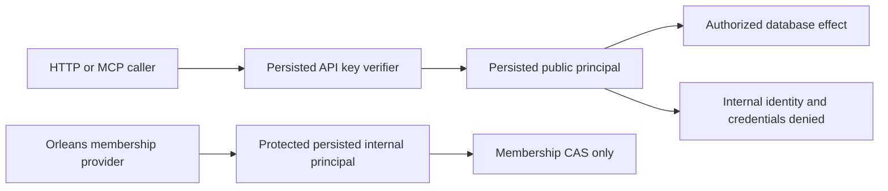
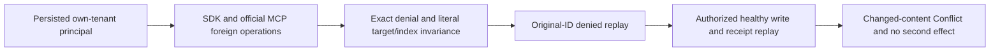

# Authorization

Database-persisted API-key verifiers, principals, grants and policy epochs determine
every public operation. HTTP/MCP callers cannot supply trusted roles. Existing
authorization and field/row projection remain subject to ADR-032's layout debt;
the cluster control boundary is defined by [ADR-036](../ADR/ADR-036-orleans-foundation.md).

| Requirement | Acceptance and evidence |
|---|---|
| REQ-AUTH-001: public identity and grants come from the replicated database after a quorum read | AC-REP-005: real SDK/MCP invalid, expired, revoked and unauthorized calls fail before effects, including after failover |
| REQ-AUTH-002: public credential changes cannot disable or impersonate the cluster's membership authority | AC-AUTH-002: a persisted protected internal principal has no public API key; even an administrator cannot edit it or create a credential for it; revoking a public administrator does not revoke internal membership |
| REQ-AUTH-003: internal authority can perform only its approved membership control operation | AC-AUTH-003: ordinary callers cannot submit Membership; the internal principal cannot submit data/security operations; real store outcomes preserve exact denial and unchanged effects |

### Current unit case-to-acceptance crosswalk

| Native case class | Existing requirement / acceptance | Evidence boundary |
|---|---|---|
| `ClusterPrincipalPolicyTests`, `ClusterPrincipalInitializationIntegrityTests`, `StorageRecovery.PartitionHostRecoveryTests.MissingProtectedPrincipalInVerifiedPendingImageRejectsHostAndSafeRetry`, `ModifiedProtectedPrincipalInVerifiedPendingImageRejectsHostAndSafeRetry`, `ValidProtectedPrincipalInVerifiedPendingImageOpensAtRecoveredCut` | REQ-AUTH-002 / AC-AUTH-002 | Protected internal-principal bootstrap/idempotence, public edit/credential denial, snapshot copy, and missing/modified/corrupt row rejection at an existing apply cut. The three StorageRecovery cases exercise a real verified pending-image install: absent/modified principal state rejects both host-open attempts; valid principal state is present after install/reopen. This is local store/snapshot evidence, not quorum or RF3 proof. |
| `ClusterPrincipalAuthorizationTests` | REQ-AUTH-003 / AC-AUTH-003 | Ordinary/public internal-membership denial, internal data/security denial, and internal membership after public-root revocation. |
| `DocumentRowTenantMutationAuthorizationTests` | REQ-AUTH-005 / AC-AUTH-005, with the owning document boundary REQ-DSTORE-003 / AC-DSTORE-003 | Put/Patch/Delete cannot forge row owner or tenant. It does not cover all row-scoped read/query adapters. |
| `DocumentFieldMutationAuthorizationTests`, `DocumentReplacementFieldAuthorizationTests`, `DocumentDeleteIndexAuthorizationTests` | REQ-AUTH-006 / AC-AUTH-006, with the owning document boundary REQ-DSTORE-003 / AC-DSTORE-003 | Persisted field-write and index-use grants are independently enforced on the tested mutation paths; this is not the complete adapter/lineage matrix. |
| `ResourcePolicyUpdateTests`, `ResourcePolicyUpdateRejectionTests`, `ResourcePolicyUpdateVisibilityTests` | See the exact REQ-RPOL-001..004 mapping in [ResourcePolicyUpdates](Authorization/ResourcePolicyUpdates.md) | The unit cases map to RPOL-001/002/003; RPOL-004 remains the real SDK/MCP RF3 criterion. The blob-quota exclusion case is validator-only, not a store-apply flow. |

`SignedEnvelopeTests` is physically under the Authorization test directory but
is owned by InternalSerialization: map it only to REQ-IS-007 / AC-IS-007 in
[InternalSerialization acceptance](InternalSerialization/Acceptance.md#requirements-and-acceptance).
It is not evidence for public credential verification or persisted principal
authorization.

Slice map: new policy code `src/KeyLoad.Core/Features/Authorization/`; focused
tests mirror `tests/KeyLoad.UnitTests/Features/Authorization/`. HTTP/MCP adapters
remain ClientApi and invoke Orleans request grains. Principals/API keys remain
existing shared public contracts. Frontend: N/A, no independent UI is introduced.

TASK-ROUTE-AUTH owns only new policy and its real ZoneTree regressions; the lead
adds the existing DatabaseEngine integration guards and host bootstrap call.
No test doubles or local execution. TUnit unit gates and Docker RF3 public-key
revocation/membership readiness provide the combined proof. The policy's bootstrap
is process-composition authority, not an HTTP/MCP operation: seed an absent internal
principal only at apply cut zero; a missing or modified protected row at an existing
cut fails closed. Quorum catch-up makes the replicated catalog authoritative before
any public authentication. No secrets are added to the protected principal.

## Повний public authorization contract

Актори: API-key caller, persisted administrator/resource owner та protected internal membership identity. Current source: [principal/key contracts](../../src/KeyLoad.Abstractions/Contracts.cs), [DatabaseEngine](../../src/KeyLoad.Core/DatabaseEngine.cs), [AuthorizationPolicy](../../src/KeyLoad.Security/Features/Authorization/Execution/AuthorizationPolicy.cs), [mutation checks](../../src/KeyLoad.Core/MutationAuthorization.cs), [server binding](../../src/KeyLoad.Server/Program.cs). Persisted public credentials/grants уже існують; новий quorum/bootstrap/internal control ремонт та широка SDK/MCP parity ще потребують qualification.

| Вимога | Acceptance / flows | Test mapping |
|---|---|---|
| REQ-AUTH-004: тільки persisted verifier/principal створює public server identity | AC-AUTH-004: valid stored credential дає exact principal; unknown/expired/revoked/malformed key та client-supplied trusted roles fail closed без effects; restart/failover зберігають каталог | Existing `UnsignedPeerRequestsAndClientSuppliedPrincipalAreRejected` у [ClusterTests](../../tests/KeyLoad.IntegrationTests/Features/ClusterReplication/Cases/ClusterTests.cs); invalid catalog tests у [TransactionTests](../../tests/KeyLoad.UnitTests/TransactionTests.cs); full credential edge/RF3 parity PLANNED |
| REQ-AUTH-005: tenant/database/resource/row capability enforcement спільний для read/write | AC-AUTH-005: wrong scope/owner/project/row grants не відкривають дані чи effects; forged resource identity не авторизує іншу collection; internal membership authority не перетворюється на public admin | Existing `RowScopeAndTenantCannotBeForged` у [SecurityAndQueryTests](../../tests/KeyLoad.UnitTests/SecurityAndQueryTests.cs), `AShadowedMutationResourceCannotAuthorizeWritesToAnotherCollection` у TransactionTests; REQ-AUTH-001–003 збережені |
| REQ-AUTH-006: field read/use/write та omit-default projection застосовуються наскрізно | AC-AUTH-006: nested/aliased protected fields не витікають у payload/headers/metadata; predicate/sort/index/vector use і replace/patch перевіряють окремі grants; різні query adapters мають однакові omissions | Existing `NestedSensitiveFieldsAreOmittedAndAliasedPredicateAndSortAreDenied`, [QueryAdapterTests](../../tests/KeyLoad.UnitTests/QueryAdapterTests.cs) adapter omission cases, [ChangeFeedTests](../../tests/KeyLoad.UnitTests/ChangeFeedTests.cs) PII cases; full lineage matrix PLANNED |
| REQ-AUTH-007: current policy epoch перевіряється на request/page/cache boundary | AC-AUTH-007: revoke/ACL/policy change invalidates відповідний cursor/result без cached payload leakage; invalid token/history/scope дає typed failure, після відмови healthy authorized call works | Existing `RevocationInvalidatesCurrentPageAndNeverReturnsCachedPayload` у SecurityAndQueryTests, feed revocation/scope tests; [ADR-022](../ADR/ADR-022-policy-epoch-revocation.md) RF3 boundary expansion PLANNED |
| REQ-AUTH-008: worker required inputs та protected effects gate перед unsafe delivery/replay | AC-AUTH-008: missing protected-input grants зупиняють claim/replay/checkpoint; changed principal policy блокує стару delivery; inbox replay не обходить current effect authority | Existing `WorkerRequiredProtectedInputFailsBeforeClaim`, [SubscriptionTests](../../tests/KeyLoad.UnitTests/SubscriptionTests.cs) `MissingRequiredWorkerInputStopsDeliveryWithoutAdvancingTheCheckpoint`, `AnotherWorkerReusesTheInboxOnlyAfterCurrentEffectPermissionsAreChecked` |
| REQ-AUTH-009: diagnostics та derived projections зберігають sensitive classification | AC-AUTH-009: PLANNED PII/token canaries не потрапляють у errors/logs/traces/search statistics чи unauthorized derived result; omitted-default lineage зберігається при rebuild/replay/backup | Existing safe projector tests — часткове source evidence; PLANNED full cross-interface diagnostics/lineage matrix KL-067/068/096/103 |

Рішення: [ADR-014 RBAC](../ADR/ADR-014-principals-rbac-row-policy.md), [ADR-015 sensitive lineage](../ADR/ADR-015-sensitive-data-lineage.md), [ADR-022 policy epoch](../ADR/ADR-022-policy-epoch-revocation.md), [ADR-029 event/message privacy](../ADR/ADR-029-event-message-classification.md). Policies/keys persisted server-side; readers і projections користуються нинішнім principal та scope. Stored raw history може містити protected input, але це не дозволяє unsafe replay до consumer.

Canonical map: Security/Core/Abstractions/Server/tests `Features/Authorization/` для policy/behavior; SDK/MCP adapters — ClientApi, business projection — owning slice. UI N/A. Shared identity/epoch/schema/host composition мають одного integration owner. Нові trust boundaries freeze через ADR → реальні adversarial tests → implementation → migration/rollout → GitHub SDK/MCP RF3 failover proof. Source/test names не доказ passing; diagnostics, coverage/complexity та current delivered-source qualification pending.

### TASK-AUTH-DENIED-REPLAY-CLOCK-001

REQ-AUTH-008, original ADR002 same-ID outcome contract and TASK-BACKUP-EVENTING-CUT-001 require current authorization to be checked before outcome reuse, while an unreplicated authorization-denied retry of a retained same command must not append another clock-only native commit. A concrete current source path authorizes before outcome selection; denial retains ForNew/persistOutcome=true, skips overwriting an existing outcome, but stages equal ClockBytes. Native ZoneTree staged writes are real journal changes. Thus repeated denied native calls advance the store position despite unchanged immutable receipt.

Freeze before correction: reuse the existing one outcome-key presence read in PersistCommandOutcome. If a previously stored key exists and replicationIndex is nonpositive, the denial has no staged domain effect; preserve current error/current policy checks and immutable outcome and return before clock staging. New rejected IDs still persist failure outcome/clock exactly once. Supplied positive replicated indexes retain original applied watermark and supplied-time clock staging unchanged, including distinct log entries that share an ID. Do not return old success after revoked permissions or weaken authorization, fingerprints/incarnation, compiled validation or token/placement checks. No storage/public/serializer format changes.

Ownership: shared Core AtomicCommandCommit.PersistCommandOutcome only; new UnitTests Authorization real native denial/replay/replicated-apply metadata/healthy flow, plus BackupRestore eventing administrator-resume denial. Before execution, root reviews exact guards, build/analyzers/format and actual full normal/scalar/recovery/RF3 Linux gates. Literal expected native positions/outcomes and full stored bytes—not implementation getters—prove unchanged embedded replay, positive supplied index advancement and healthy effects. Source review is not runtime proof or consensus qualification. Rollback removes this correction and these task contracts/regressions coherently.

AC-AUTH-REPLAY-001 has two native arguments (same evaluatedAt / later trusted evaluatedAt). CommandFingerprint freezes Id/Kind/PrincipalId/PayloadJson, explicitly excluding evaluatedAt; the tests supply actual typed trusted native operation time without substituting a clock provider or waiting. The original ADR002 permission that physical commit position may advance is retained for positive replica indexes and broader historical work; this owner-authorized task tightens only unreplicated, already-retained, no-effect authorization rejection. The native regression independently asserts current exact PermissionDenied, one failure/clock commit, immutable full-store bytes under both same-ID times, then genuine Apply indexes1/2 with exact applied watermark and supplied clock, unchanged original outcome bytes, already-applied-index idempotence and a new authorized document operation. It is not RF3 consensus proof.

The native removed-grant case also first commits a real writer document, removes its persisted grant with the next exact policy epoch, then repeats the original identity and payload with later trusted time: current PermissionDenied, immutable original success receipt, unchanged complete store bytes/position, and a healthy root revision update are required.

## TASK-KL015-CROSS-TENANT-RF3-001

REQ-AUTH-KL015-001 / AC-AUTH-KL015-001 supplements REQ/AC-AUTH005/009 and REQ/AC-CLIENT005/006 under existing ADR002/022/039. A persisted non-admin principal belongs to one native tenant, with persisted document read/write/query grants on its resource. Actual SDK and official MCP foreign-tenant GET, bounded full scan, indexed predicate and immutable Batch write must return exact PermissionDenied/safe scope detail and disclose no credential or payload canary. Canonical foreign/owned documents and actual indexed membership remain literal and unchanged after rejection/retry. Same-ID denied replay remains PermissionDenied; authorization precedes fingerprint selection, so different payload under that still-unauthorized ID must likewise remain denied. An authorized healthy command proves exact revision/effect, stable same-ID receipt replay and changed-content Conflict with no second effect.

ADR002 definitive failed writes remain logged: first denied command may advance persisted failure/clock/replica watermark without changing target documents/indexes. Same-ID public retry is stable in result/target effect, not a fabricated global storage position promise. Separate public reads do not guarantee equal cluster-wide cuts while metadata changes; positive cut and complete literal state are checked, and query errors expose no partial page. No pre-submit authorization, product lock, timeout or catalog change is introduced. Telemetry privacy has current R785 local native normal/scalar 12/12 export evidence, including the real signed AcOrl012RealSignedOperationsExportBoundedPrivateNativeTelemetry case; the exact scope and original reports are recorded in ADR-121. Original4e18 artifact paths are unavailable in this session, so that historical checkpoint is not authenticated passing evidence or current Linux qualification. This RF3 scenario separately checks actual public failure envelopes; those envelopes alone do not prove every server exporter. Native exact-source execution and original receipts are mandatory before any KL015 closure.

Canonical ownership: IntegrationTests Features/Authorization Cases/Helpers/Assertions. Existing shared ClusterFixture owns Docker/Aspire RF3 endpoints/lifetime; official session is joined with original primary+cleanup errors preserved. Existing standard catalogs/selectors remain unchanged; no LocalImage expansion.

TASK-AUTH-KL015-ORDERED-RECEIPT-001 refines AC-AUTH-KL015-001: compare complete serialized SDK replay, official MCP replay and literal healthy document output by ordered byte content. Byte-array reference identity cannot establish the required receipt contract. Preserve the entire existing persisted authorization, foreign denial, unchanged target/index, changed-content Conflict and healthy continuation flow. The original exact46a4 reference-equality failure stays retained; actual native RF3 execution remains required before closure. Existing ADR-002/022/039 contracts are unchanged.

## KL-015 exported telemetry privacy

REQ-AUTH-KL015-002 / AC-AUTH-KL015-002: actual ASP.NET/HTTP-client spans and OpenTelemetry logs must not export caller payload, raw URL/path/query, credentials, scope state or exception messages. Preserve count/duration, status, fixed normalized operation/category, severity, numeric event identity, timestamps and trace correlation. Unapproved arbitrary attributes do not become telemetry authority. The same real Kestrel request executes actual ZoneTree-backed administration, then a denied request preserves canonical state and an authorized healthy request returns a complete literal catalog. Actual exporters capture immutable span/log snapshots; canary absence alone is insufficient: exported server/client spans and failure/healthy log records must exist and preserve exact safe fields. Existing RF3 SDK/official MCP cross-tenant and admission negatives remain mandatory.

[ADR-121](../ADR/ADR-121-exported-telemetry-privacy.md) freezes this boundary. ServiceDefaults owns validated Authorization privacy options, processors and registration; UnitTests Authorization owns real Kestrel/file-backed operation/exporter lifecycle tests. Root owns integration, architecture/index/status, coherent build/image and delivery. No new package, storage format, trusted role, public endpoint or schema is introduced. Existing native Orleans telemetry policy is unchanged. Startup, primary operation, flush, stop and disposal failures remain original errors and all owned resources settle. Source authoring is not passing execution, numeric coverage, Linux qualification or KL-015 closure.

AC-AUTH-KL015-002 permits only ADR-121's closed native HTTP connection context link shape. Native span IDs and complete safe link fields must match the preprivacy observation; events, tagged/state-bearing/extra links and unsafe ancestry still suppress the original span. Normal and scalar actual HTTP fullflows plus Linux RF3 remain required.

Local REQ/AC-AUTH-KL015-002 export evidence: R785 coherent Release build green, actual native normal and scalar three-class focus each 12/12 PASS with native exit 0 and source/assembly drift zero. [ADR-121](../ADR/ADR-121-exported-telemetry-privacy.md#local-development-verification-2026-10-08) records exact scope and original report lineage. Current Linux run 37821315110 attempt 1 on exact source 3458f611 has authenticated original normal/scalar TRX with all 12 telemetry cases passed in each mode, native source/image receipts retained and after-suite identity verification successful; ADR-121 records artifact/TRX hashes. Complete unit suites each retain 19 other failures. Current exact-source Linux RF3 cross-tenant, bounded-input/query and C1 held-write/guard acceptance remain open; neither export gate marks KL-015 done or establishes full-suite/production/endurance qualification.

TASK-AUTH-KL015-COMPLETE-DENIAL-RESULT-001 refines REQ/AC-AUTH-KL015-001 under unchanged ADR-002/022/039: each actual SDK foreign-tenant GET, full scan, indexed predicate, original write/replay and changed-content denied write must have no result payload, exact PermissionDenied/safe scope detail, and a complete serialized native result containing none of the persisted credential or document/conflict/healthy canaries. Checking only Problem cannot prove that a failed result carries no payload or leaked metadata. The existing official MCP complete-result privacy, literal foreign/owned document and real index invariance, healthy exact receipt replay and Conflict/no second effect remain mandatory in the same RF3 wholeflow.

Ownership is the existing Authorization CrossTenantRf3ErrorAssertions helper and Kl015ForeignWritesScansAndIndexesAreDeniedAndAuthorizedReceiptRemainsStable case; no transport, provider, wire, storage, role, admission or timeout change is introduced. Current API payloads are reference-record DocumentResult, QueryPage and CommitReceipt; the helper's nullable reference constraint also accepts the actual Result<DocumentResult?> returned by GetAsync while requiring every denial value to be null. Root joins guarded source and runs the coherent native checks; exact-source Linux RF3 original TRX, source/image receipts and API artifact digest remain required. This stronger oracle is authored evidence until executed and does not mark KL-015 done.

### TASK-AUTH-KL015-MODEL-VIEW-DENIAL-001

REQ/AC-AUTH-005/006/009 and REQ/AC-SQLVIEW-002/003/005 require a failed event/queue SQL request to carry no partial page or protected payload/header metadata. Freeze before the test extension under unchanged ADR-014/015/022/072. The existing two real persisted model-authority cases check the SDK error code only at field-use denial and have no actual foreign model partition. Extend those same whole flows using a second genuinely administrator-seeded event/queue partition with its own tenant. The original non-admin persisted own-tenant credential must receive exact PermissionDenied/safe scope detail for both foreign SQL model sources through SDK and official MCP. Every failed SDK result must be IsFailed, Value null and contain no credential or any of the four literal event/queue payload/header canaries in complete native serialization; official MCP must retain its exact error envelope and omit those same canaries from the complete native result. Apply the complete privacy/no-page oracle to the original same-tenant denied sensitive predicate too.

Before and after foreign rejections, actual administrator native stream and message inspection plus SQL rows must equal the literal seeded histories and Ready/unclaimed queue state. Compare ordered logical rows and complete original native records, require positive cuts, and never infer equal cluster-wide cuts across separate calls. The original authorized redacted SDK/MCP read follows the denials, then a real persisted field grant exposes the literal selected value, followed by actual revocation. Original transport, topology, grant epoch, deadlines and cleanup stay unchanged. No product fix or new runtime hook is presumed from this coverage gap.

Ownership: existing QueryExecution Cases/SqlModelViewRf3QueueAuthorityTests.cs and SqlModelViewRf3EventAuthorityTests.cs; new feature-local Helpers/SqlModelViewRf3ForeignTenantFlow.cs and Assertions/SqlModelViewRf3DenialAssertions.cs; requirements here and Authorization/QueryExecution with ADR072. Root alone joins/compiles/formats/delivers. Stages: contract, guarded source-only test repair, coherent native build/discovery, both actual Aspire RF3 flows, exact-source original Linux TRX and source/image/artifact receipts. Native discovery, source review and historical weaker passes cannot qualify these stronger flows. Rollback removes these case extensions and private helpers together; wire, provider, public API, persisted format and UI are N/A. KL015 remains open until current repaired C1 and all required acceptance gates are proven.

## KL-096 immutable delivery replay and current classification

REQ/AC-AUTH-006/007/008/009 and REQ/AC-MSG-002 require current persisted field/header policy to protect an original successful queue or subscription receive replay. The original StoredOutcome bytes, original principal-policy fence, group generation/ownership, token and lease fences remain exact. A resource-only policy CAS may change its SchemaVersion without changing principal PolicyEpoch; after successful original lease validation, cached output must therefore be checked against the current projector in the same existing synchronous IKeyValueView. Queue output uses current caller; subscription output uses current persisted data principal followed by current caller, matching genuine acquisition. No nested storage read or await is introduced.

If the common current projector removes an actually retained JSON value, replay refuses PermissionDenied with fixed safe detail and no payload. Complete semantic JSON equality allows formatting changes and hidden paths absent from the retained value; it does not rewrite or redact an original receipt into a different successful receipt. The original outcome, canonical input body, lease and counters stay unchanged. Parsing remains within the existing admitted JSON/receive bounds; no new grant, limit, serializer ID, persisted family, provider, clock, retry or deadline is introduced. Higher-epoch repair never makes an old-epoch result replayable: fresh authorized work produces its own original outcome.

Ordered ownership: specs/ADR first; Core Authorization/Validation owns cached projection validation; CommandOutcomes composes it after real lease validation; native whole Unit plus real SDK/official MCP/both Q1 cases own full body/header, denial/no-effects, persisted revoke/repair, DLQ inheritance and same-root cold continuation. Original native outcome bytes are an independent local authority oracle. Normal/scalar, process and Aspire RF3 Linux source/image/UID/runtime gates remain open until actual qualification. Existing migration/conversion/fallback prohibitions remain exact; this is current-schema authorization, not stored-format compatibility.

TASK-AUTH-KL096-CACHED-DELIVERY-001 source map: existing `src/KeyLoad.Core/CommandOutcomes.cs` calls new `src/KeyLoad.Core/Features/Authorization/Validation/CachedDeliveryPrivacy.cs` strictly after native lease validation. `EventMessageSensitiveReplayTests.CurrentResourceBodyAndHeaderPolicyRefusesOriginalDeliveryThenRepairedNewWorkAndColdPreserveExactAuthority` declares four genuine native operation variants: queue body, queue header, subscription caller body and subscription data-principal header. Each variant includes original complete result/native outcome bytes, resource-only reclassification, no-body/no-effect refusal, required-input refusal, persisted revoke/higher-epoch repair, old-result denial, new-result replay, same-root reopen and final ACK/empty continuation. `AbsentProtectedPathPreservesCompleteUnicodeArrayReceiptAfterCurrentPolicyChangeAndColdThenDeniedProducerAndFreshHealthyWork` is the complete safe-replay control: Unicode, ordered arrays and null values stay semantically unchanged while an absent protected path causes harmless JSON formatting; original complete outcome replays unchanged through cold, denied producer has no effect, and new authorized work completes.

`EventMessageSensitivePublicRf3Tests.CurrentBodyHeaderPoliciesRevokeRepairOriginalRefusalFreshDeliveryDlqAndSameOwnerColdFourRoutes` declares the same four current-policy authority variants with real SDK/official MCP/both Q1 routes, persisted inspector omission, required-input refusal, revoke/repair, immutable old-command refusal, new authorized full result/receipt replay and genuine three-node same-owner cold. Queue variants additionally use actual NACK/max-attempt terminal admission, full policy-inherited DLQ inspection and actual state-version/delivery-generation redrive. Each original producer/completion/redrive receipt is compared completely on all four routes; current read generation/applied cut is acquired fresh and can advance on restart. The fixture chooses existing default policy's admitted lease maximum without changing policy ceilings or the original whole-flow deadline. Native test UIDs/counts are not inferred from these source declarations.

Exact role ownership stays under Authorization Cases/Contracts/Models/Helpers/Assertions in Unit and Integration. The existing fixture and caller owners retain credential validation, real official SDK initialization, connection lifetime, RF3 readiness, original operation cancellation and joined cleanup. Specs/ADR, guarded private source, coherent root join, canonical compiler/analyzers/format, actual discovery, normal/scalar Unit, process recovery and Linux Aspire RF3 are sequential gates. This source stage does not qualify process-kill behavior, power loss, performance, complete event/message export/trace lineage or production readiness. No internal compatibility/migration path exists; rollback removes the composed source stage before delivery and preserves immutable original evidence.
