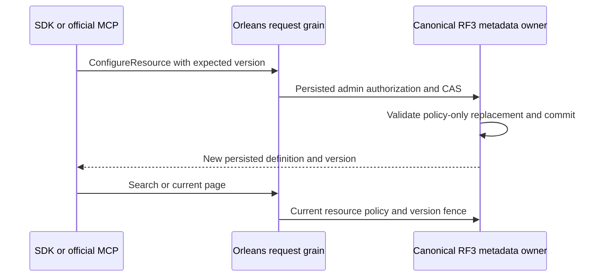

# ResourcePolicyUpdates within Authorization

Accepted source contract: [ADR-093](../../ADR/ADR-093-resource-policy-updates.md).
This closes the public metadata update gap exposed by AC-LINEAGE-004 through
current policy-only metadata replacement. Physical resource, index, authority,
quota and schema shape changes are unsupported.
Canonical feature ownership is Authorization. Existing ConfigureResource
admission, persisted administrative authority, metadata RF3 and native outcomes
remain the sole write path.

`ConfigureResourceRequest` gains nullable `ExpectedSchemaVersion` at generated
Orleans field ID3, omitted from public JSON when null. Null preserves create and
identical-definition behavior and still rejects a changed existing definition.
A non-null value is a compare-and-set on an existing resource. The replacement
must increment SchemaVersion exactly once and may change only FieldPolicies and
HeaderPolicies. All other definition properties must be canonically identical.
No policy change may bypass the existing complete resource/path/budget validation.
No-op version increments are invalid. Current native aliases and IDs0–3 stay
unchanged; every current executor enforces the same policy-only CAS contract.

| Requirement | Acceptance and automated evidence |
|---|---|
| REQ-RPOL-001: authorized policy replacement is one canonical metadata commit | AC-RPOL-001: real ConfigureResource apply changes only policy arrays and advances the resource version; exact native persisted definition and original outcome survive reopen; owner data/vector/event bytes are unchanged. `ResourcePolicyUpdateTests` |
| REQ-RPOL-002: concurrent/retried updates cannot restore stale authority | AC-RPOL-002: stale/missing expected version, missing resource, overflow, unchanged policy/version-only update, changed kind/domain/index/authority/quota/schema/paused state and malformed pointers fail with typed errors and no partial state; same original command retry reuses its receipt. `ResourcePolicyUpdateRejectionTests` |
| REQ-RPOL-003: current reads reauthorize after policy ACK | AC-RPOL-003: projection reclassification, raw-field search denial, graph `/label` denial, and existing change-feed/live-query schema fences use the new persisted definition; old cursors cannot return cached sensitive payload. `EventProjectionPolicyTests`, `ResourcePolicyUpdateVisibilityTests` |
| REQ-RPOL-004: public native clients and RF3 retain the trust boundary | AC-RPOL-004: SDK and official MCP ConfigureResource carry the CAS field through one request grain; current-policy queries on all replicas agree after ACK and fail closed after revocation/restart. `ResourcePolicyUpdateRf3Tests` |

Ordered execution and task graph:

1. Root approves this contract/ADR, owns request field, existing dispatcher join,
   public transport/schema inventory and architectural/status documentation.
2. Luna query_wave owns new Core/Features/Authorization/Commands/
   ResourcePolicyUpdates.cs plus new UnitTests/Features/Authorization/{Cases,Helpers}
   files and the existing EventProjection fixture's policy-update calls. Its
   helper validates the nullable prior/new definition and expected version; it
   owns no storage handles, routing, alternate authorizer or external side effect.
   The root invokes it after reading previous metadata and before any write.
3. The helper distinguishes Validation (invalid/no-op increment), RevisionConflict
   (missing or stale CAS), UnsupportedCapability (changed non-policy shape or
   changed definition without CAS) and ResourceExhausted (version overflow).
   It cannot weaken the existing admin/tenant check or resource validation.
4. Root reviews the complete diff and joins the helper, then builds the solution
   and runs the actual Aspire unit/scalar/recovery and SDK/MCP RF3 entries. Worker
   gates/Git are forbidden; no test run can race a shared binary replacement.
   In parallel, Luna lifecycle_wave owns only new IntegrationTests/Features/
   Authorization/{Cases,Helpers,Assertions}/ResourcePolicyUpdate* files. It uses
   the actual SDK and official MCP client to qualify CAS, current read/use policy,
   old cursor rejection and healthy following requests against Aspire RF3. No
   shared fixture, transport, routing or production edits are delegated to it.
5. Delivered-source Linux artifacts and every AC are required for closure. A
local focused pass is development evidence only.

TASK-AUTH-CURRENT-POLICY-046 removes obsolete terminology and the unsupported
migration-job promise from ResourcePolicyUpdates and its actual operation cases.
Null expected version means current create or identical-definition admission;
policy replacement requires current CAS. Preserve branch behavior, native IDs,
canonical fingerprints, typed failure codes, persisted admin checks, exact
resource/document bytes and original outcome replay. The static unsupported
detail states that the requested definition change is unsupported. Root owns
this contract, exact three-path guards, full review/join and native Aspire
normal/scalar/RF3 qualification; the private worker introduces no new dispatcher,
job, storage format or client schema. Acceptance remains AC-RPOL-001/002/004.

Baseline: full local Aspire Unit36 on unchanged build36 source has3019/3165
passing and146 failures; policy reclassification is a diagnosed real product
gap. No passing policy-update evidence exists yet. No packages or storage format
change is required. SchemaVersion is already in text-generation and change-feed
fences; store position invalidates committed RAM/cache cuts. Rollback disables
new policy admission and retains the committed definition/version; it must never
restore older policies or rewrite user data. Frontend N/A: existing admin API;
SQL N/A for this stage: it does not advertise a new SQL management statement.

Controlled movement reuses the existing pure SameNonPolicyDefinition comparer internally for authenticated A resource snapshots at the actual B document effect. It preserves all non-policy definition fields, including configured vectors/indexes, while existing A resource-policy CAS and outstanding durable command/grant pins remain authoritative. No B policy-table copy or new independent comparator is introduced. The private transaction supplies only exact bounded authenticated resource reads to existing document operations; public ordinary target effects remain fenced until the full A outcome bridge is qualified.
