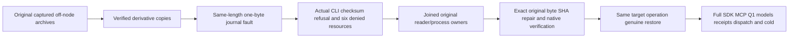
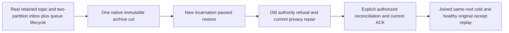

# BackupRestore

TASK-BACKUP-INDEXED-DOCUMENT-DEDUP fills the original KL-005 content gap under
REQ-BACKUP-001/002/003. AC-BACKUP-CONTENT-001 requires a current native backup
seeded through actual DatabaseEngine document/index/command operations to restore
into a fresh target, reopen exact canonical document/reference/revision state,
return independently expected native indexed-query memberships and preserve the
original stored dedup bytes. Replaying a pre-backup ID must return the existing
TokenInvalidated outcome without overwrite or duplicate effects because its
recorded incarnation differs from the new restored identity. A new post-restore
command must then replay its exact current-incarnation persisted outcome once,
with no additional effects or store-position change.
Include insert/replace/delete and a rejected unique-conflict batch with no
partial effects; verify the same content after a further close/reopen and a
healthy new command. Raw key/value seeds or getters alone cannot prove it.

AC-BACKUP-CONTENT-002 retains the original offline store cut: manifest position
and verified source position are exactly the acknowledged backup cut; the target
native store position includes the existing single restore-authority commit.
Assert those exact values and unchanged source archive bytes. The existing
new-incarnation restore intentionally clears replica LastApplied, clock and
membership and keeps dispatch paused; that replica authority reset cannot be
advertised as preserving a usable old RF3 applied index. Cluster-cut restoration,
token/lease reconciliation and release qualification remain separate open gates.
Use existing legitimate offline storage/physical-shard ownership APIs when
opening DatabaseEngine/QueryEngine on the restored data; no fabricated catalog,
authorization bypass, replica-authority replay or replacement query path is
permitted. Report any genuine missing product path before changing its contract.

ADR-046/048 and the current native restore contract own this test-only stage;
there is no new format, migration, compatibility path, dependency or public API.
Canonical ownership is UnitTests BackupRestore Cases/Fixtures/Assertions with
cohesive actual roles; frontend and new transport are N/A to the offline gap.
Root freezes/reviews/joins/runs native normal/scalar and source-bound Linux;
a Luna worker prepares a private guarded packet. No task closure is claimed
until every original criterion is directly supported by actual evidence.

The native staged-restore caller remains in the BackupRestore slice under
REQ-BACKUP-002 / AC-BACKUP-002. `BackupRestoreStagingJoinTests` directly invokes
the native ZoneTree restore; despite its historical `AcSqlc011` method label, it
does not execute a SQL client operation and is not evidence for AC-SQLC-011.
Its absent/empty-target flows support AC-BACKUP-002 clean-target publication and
the identity/paused-dispatch portion of AC-BACKUP-003, with byte/readability and
cleanup assertions. They do not establish every old cursor/lease invalidation or
operator-reconciliation requirement. Delivered NativeBackupCut negatives and
recovery checks remain distinct. No new format or migration is defined;
exact-source GitHub execution is pending.

AC-CQ-018 preserves the complete original ManagedCode file-storage transfer byte
oracle in ArtifactTests through ordered content equivalence under pinned TUnit.
Both real awaited file reads remain; a partial checksum or reference comparison
does not satisfy byte-identical transfer. GitHub execution remains pending.

The preserving ArtifactTransfer name-resolution join retains its original public
return type, Result<ManagedCode.Storage.Core.Models.BlobMetadata>, through an
explicit provider alias. The enclosing KeyLoad.BlobMetadata does not change this
archive transport contract. Existing transfer regression and strict compiler
binding map to AC-CQ-001/007/018; no dependency or metadata mapping changes.

Status: local verified backup/restore and piecewise archive transfer are present in source; unit and process-recovery test cases exist, but their execution against the current delivered source and GitHub qualification are pending. Full cluster-cut backup and complete capability-state restore reconciliation remain planned.

## Purpose, actors, and entry points

BackupRestore creates an offline backup of canonical storage and restores it into a clean location. Actors are a database administrator and an operator controlling an offline process. Current entry points are `ZoneTreeStore.CreateBackup` and `ZoneTreeStore.Restore`, CLI commands `backup` and `restore`, Cartograph `pack-backup` / `inspect-backup` / `unpack-backup`, `POST /v1/admin/backup` for server-side backup, and `ArtifactTransfer.CopyToFileStorageAsync` for archive transfer. The CLI requires an offline database for backup and restore. This scope does not define a new backup route or online restore endpoint.

## Canonical slice map and boundaries

| Surface | Current source | Target owner |
|---|---|---|
| Storage backup/restore | `src/KeyLoad.Storage.ZoneTree/ZoneTreeStore.cs` delegates to `Features/BackupRestore/ZoneTreeBackupRestore.cs` and its file/restore helpers | Private behavior is owned by `src/KeyLoad.Storage.ZoneTree/Features/BackupRestore/`; the public facade remains the shared entry point |
| Archive and transfer | `src/KeyLoad.Artifacts/Features/BackupRestore/Execution/BackupArtifact.cs`, `ArtifactTransfer.cs` and focused helpers | Same canonical slice; legacy declarations removed |
| CLI | `src/KeyLoad.Cli/Features/BackupRestore/Commands/CliBackupRestore.cs` behind the aggregate Program runner | Slice-local offline operations; exact dispatch/text/disposal parity under AC-CQ-010 and ADR-033 |
| HTTP backup entry | `src/KeyLoad.Server/ApiEndpoints.cs` | Shared server boundary; no public restore route is defined |
| Tests | `tests/KeyLoad.UnitTests/Features/BackupRestore/Cases/ArtifactTests.cs`; `tests/KeyLoad.RecoveryTests/Features/StorageRecovery/Cases/RecoveryTests.cs` | Unit source is slice-local; remaining recovery layout debt targets matching `Features/BackupRestore/` |
| Documentation | This spec; detailed storage/cluster design in `../design/architecture-v0.3.uk.md` | One canonical feature acceptance source |
| UI and public blob API | None | N/A: operators use CLI/admin boundaries; archive chunking is not a user-facing blob contract |
| Official MCP | No backup tool surface verified | Required MCP work is tracked in ClientApi; no tool name or route is inferred here |

Layer-first source locations are migration debt under [ADR-032](../ADR/ADR-032-mcaf-governance.md). BackupRestore owns artifact verification and restore safety, not live replication, blob storage, or power-loss qualification.

Accepted TASK-MP-010L in [ADR-033](../ADR/ADR-033-code-quality.md) owns the strict
artifact-source prerequisite and its canonical source/test migration. AC-CQ-001/
005/006 and AC-MP-012 join the existing AC-BACKUP-001/002 real archive round trips,
negative-file/checksum cases and transfer assertions. Public signatures, archive
bytes/chunks, permissions, cancellation and actual system-clock timestamps stay
unchanged. Source/formatter success remains separate from exact-SHA GitHub runtime
qualification and the still-planned cluster restore gates.

[ADR-046](../ADR/ADR-046-storage-private-owners.md) and TASK-MP-010AF-B accept a
cohesive internal ZoneTreeBackupRestore owner under this slice, borrowing the one
node-local runtime and retaining the existing public facade entry points. Exact
source-only migration, file ownership, unchanged two-file manifest/identity/paused
restore recipe and AC-SQ-005/007 joins are in the [StorageRecovery](StorageRecovery.md)
implementation contract. Existing AC-BACKUP-001/002/003 remain mandatory; this decomposition adds no
cluster-cut, power-loss, bounded-manifest-memory or performance claim.

## Current behavior, accepted target, and planned work

- The current store backup records a verified backup manifest and canonical storage files. Restore verifies the manifest/checksums, requires a clean target, creates a new database incarnation, and pauses dispatch.
- `BackupArtifact.Pack` divides backup files into bounded Cartograph pieces; `Inspect` lists entries; `Unpack` verifies catalog layout and writes to a destination. `ArtifactTransfer` copies an archive through the ManagedCode file-storage abstraction. This is backup artifact transport, not chunked public BlobStorage or partial blob reads.
- `RecoveryTests.VerifiedBackupRestoresDataWithNewIdentityAndPausedDispatch` checks restored data, new identity, paused dispatch, private file mode, and rejection after tampering with `commands.wal`; that is native-store corruption coverage, not Cartograph corruption. `ArtifactTests.ChunkedCartographBackupRoundTripsAndManagedCodeStorageTransfersIt` covers multi-piece archive round trip and byte-identical file-storage copy. Real CLI cases now exercise a noncanonical catalog, first/last entry-length mismatch, and missing manifest/identity/journal inputs, with rejected restore attempts and healthy restore/reopen controls. Authored cases remain pending exact-source Linux qualification; they do not measure peak or retained memory.
- A cluster-wide consistent cut needs per-partition cut positions and catalog epoch, coordinated retention pins, and reconciliation of event, outbox, inbox, queue, and group state. That contract is planned; local backup must not be described as satisfying it.
- Restore of an older cut changes incarnation and must not silently resume external dispatch or claim old cursors remain valid. Operator reconciliation and explicit resume remain a planned cluster-level workflow.

## Requirements and acceptance

| Requirement | Measurable acceptance | Existing or planned evidence |
|---|---|---|
| REQ-BACKUP-001: produce and package a verifiable offline backup | AC-BACKUP-001 passes when a backup includes its manifest/checksums, archives in bounded pieces, and round-trips canonical files. Separate planned resource verification must measure bounded streaming/peak-memory behavior before making a memory-bound claim. | Existing test source: `ArtifactTests.ChunkedCartographBackupRoundTripsAndManagedCodeStorageTransfersIt` checks multi-piece round trip and copy. Planned real-file resource-bound verification; current GitHub TUnit qualification pending. |
| REQ-BACKUP-002: restore only verified data to a clean target | AC-BACKUP-002 passes when a valid backup restores canonical data to a clean location; missing/tampered files and nonempty or unsafe destinations fail without publishing a usable partial database. | Authored real-operation source includes `CliBackupRestoreInvalidCatalogTests`, `CliBackupRestoreLengthMismatchTests`, `CliBackupRestoreMissingInputTests`, `CliBackupRestoreFlowTests`, `BackupRestoreStagingJoinTests`, `ArtifactTests`, and `RecoveryTests.VerifiedBackupRestoresDataWithNewIdentityAndPausedDispatch`. StagingJoin directly tests native ZoneTree restore into absent/empty targets and supports this AC's clean-target behavior; its `AcSqlc011` name does not make it an SQL-client test. These cases cover noncanonical catalog rejection, actual rejected output restore, missing required inputs, nonempty destination, original-byte/state preservation, and healthy restore/reopen controls. Exact-source Linux execution remains pending; path-traversal/reparse-specific and resource-bound evidence remains distinct and open. |
| REQ-BACKUP-003: fence old identity and pause delivery after restore | AC-BACKUP-003 passes when restore produces a different incarnation, sets dispatch paused, and invalidates old cursor/lease identities until explicit operator reconciliation. | Existing `VerifiedBackupRestoresDataWithNewIdentityAndPausedDispatch`; planned auth/feed/lease token invalidation and explicit resume integration cases. |
| REQ-BACKUP-004: restore a declared cluster cut with capability invariants | AC-BACKUP-004 passes when a captured per-partition cut restores document/event/outbox/inbox/queue/group state consistently, reports unavailable history explicitly, and performs no automatic external redelivery before resume. | Planned Docker/Aspire RF3 backup/restore and process-recovery scenarios under KL-042/KL-098; no current test or GitHub artifact establishes this acceptance. |
| REQ-BACKUP-005: bound local metadata and parse the verified identity region once | AC-BSM-001..005: inclusive16KiB manifest/4KiB identity limits, same-owned-region outer/inner checksum, preserved error/destination/lock ordering and real allocation/restore proof | [ADR-048](../ADR/ADR-048-bounded-storage-metadata.md), [acceptance](../ADR/ADR-048-bounded-storage-metadata.md) and [task graph](../ADR/ADR-048-bounded-storage-metadata.md); Metadata* real-file test source and exact-SHA GitHub qualification pending |
| REQ-BACKUP-006: publish an unpacked archive only after complete native validation | AC-BACKUP-006 passes when first/last entry length failures leave an initially absent destination absent or an initially empty destination empty, the real CLI cannot restore either failed output, and the unchanged original archive still restores canonical data with a new incarnation and paused dispatch. All handles and owned cleanup settle; primary and cleanup failures are preserved. | Authored complete real CLI flow: `CliBackupRestoreLengthMismatchTests.AcBackup006CliLengthMismatchCannotPublishRestorablePartialBackup`, plus `CliBackupRestoreMissingInputTests.AcBackup002CliMissingRequiredBackupFilesRejectWithoutPublicationAndRestoreAfterRepair`; see TASK-BACKUP-UNPACK-PUBLICATION-001, TASK-BACKUP-CLI-MISSING-INPUT-002 and [ADR-114](../ADR/ADR-114-verified-artifact-publication.md). Source and tests exist; actual execution and all required Linux qualification remain pending. |

### Functional CLI operation coverage

`BackupRestoreStagingJoinTests.AcSqlc011AbsentTargetPublishesNativeCutAndPreservesEveryBackupByte` and `AcSqlc011ExistingEmptyTargetPublishesNativeCheckpointAndPreservesEveryBackupByte` each have two trailing-separator cases. Their bodies directly call the native restore API, reopen the target, verify new identity/incarnation, paused dispatch, restored data and exact archive bytes. Map them to REQ-BACKUP-002 / AC-BACKUP-002 and the identity/pause portion of REQ-BACKUP-003 / AC-BACKUP-003 only. They do not exercise SQL, so the source's AC-SQLC-011 label is not an acceptance mapping. The cases do not close the complete cursor/lease fencing and operator reconciliation parts of AC-BACKUP-003. Their original native report rows remain failed-cohort historical evidence until current-source normal/scalar qualification.

### TASK-STORAGE-MAINTENANCE-SNAPSHOT-003: complete restore execution snapshot

REQ/AC-BACKUP-001/002/003 map to StorageRecovery REQ-STORAGE-MAINTENANCE-JOIN-003 / AC-STORAGE-MAINTENANCE-SNAPSHOT-005 and ADR046. The existing restore owner carries its original centrally bound IOptions into ApplyRestoreAuthorityState and invokes the canonical ResolveExecutionOptions before opening the staging runtime; the scalar helper is insufficient for native maintenance. Validation, canonical data, new authority and paused dispatch remain unchanged. Root joins the single owning restore implementation after the linked frozen contract, then verifies all original failed whole backup/restore/CLI/metadata/blob/recovery classes in normal/scalar and exact Linux complete suites. The source47 original51-per-profile unit and2 recovery failures remain immutable. Current qualification is pending; no local fix or isolated property assertion constitutes restore acceptance.

TASK-GENERAL-OPTIONS-RESTORE-INPUT-001 maps REQ-BACKUP-002 / AC-BACKUP-002 to
`MissingBackupManifestTests`: the real embedded restore normalizes only a missing
manifest or its directory to the existing `FormatUnsupported` Problem and fixed
manifest detail. The other required-file contracts remain intact. Both genuine
missing/empty-directory cases verify unchanged source/valid-backup bytes, original
store identity and data, no published/staged destination, and a healthy following
restore. They passed in the original native Aspire focused118/118 run on2026-10-06;
that focused development result does not qualify full recovery, RF3 or Linux.

TASK-CQ-CLI-BACKUP-FLOW-001 maps REQ-BACKUP-001/002/003 to AC-BACKUP-001/002/003
and AC-CQ-031. It adds genuine Release CLI child-process flows in
tests/KeyLoad.UnitTests/Features/BackupRestore/Cases/CliBackupRestoreFlowTests.cs,
with feature-local Processes/ and Fixtures/ helpers. The actual Aspire-owned
unit and unit-scalar runners own every child, original exit, bounded pipe drain,
temporary file and cleanup. Native validated test execution options supply
operational bounds; no alternate test entry point or fake CLI is permitted.

The positive flow commits and closes real ZoneTree storage, then invokes backup,
pack-backup, inspect-artifact, copy-artifact, unpack-backup and restore through the
actual CLI dispatch. It verifies copied archive bytes, reopened canonical data,
a new incarnation and paused dispatch. Negative flows pass corrupted original
artifacts or nonempty destinations through the same real CLI boundary, observe
the original nonzero exit, preserve existing destination bytes and storage state,
and complete a healthy follow-up operation. CLI dispatch and disposal assertions
remain part of the operation flow; property access alone is not acceptance.

The standalone CLI binds KEYLOAD_STORAGE__ and KEYLOAD_POINTCACHE__ through the
native environment configuration provider. Missing variables preserve the
canonical typed defaults; supplied values are validated before opening storage.
The regression extends TASK-CQ-CLI-BACKUP-FLOW-001 with an actual invalid-budget
backup child, unchanged committed source and absent backup destination, followed
by successful backup and restore. Overrides are confined to that child process;
the test does not mutate the runner environment or compare property accessors.

These cases are functional contributors only after native collection binds
their original executions and assemblies. They do not establish a cluster-wide
cut, old-token fencing, RF3 recovery, power-loss safety, or a measured coverage
percentage. Existing artifact/recovery flows remain mandatory. Existing ADR-033,
ADR-046 and ADR-048 contracts apply unchanged; no new format or public contract
is introduced by this test stage. Root owns the native coverage and source-bound
evidence joins; exact-source Linux qualification remains pending.

TASK-CQ-BACKUP-CATALOG-FLOW-002 and TASK-CQ-BACKUP-LENGTH-FLOW-003 extend
REQ-BACKUP-002 / AC-BACKUP-002 with actual CLI regressions in
`CliBackupRestoreInvalidCatalogTests` and `CliBackupRestoreLengthMismatchTests`.
The first uses Cartograph's native writer with a noncanonical identity entry,
executes rejected unpack, preserves source/archive/backup bytes, and completes
valid unpack/restore with reopened data, new incarnation and paused dispatch.
The second changes only the declared length of the first or last native catalog
entry, executes unpack and then actually tries restoring its output. A failed
unpack must not publish a usable backup, including when the last entry fails
after all payload files were copied. The untouched original must still restore
successfully, and all original CLI children/readers and owned files must settle.
These are complete operation flows under the existing criterion; source presence
does not establish their pass, coverage hits or module closure. A reproduced
production gap requires its failure/publication contract to be frozen in an ADR
before changing archive execution. Existing restore, RF3 and recovery gates stay
mandatory.

TASK-CQ-BACKUP-REJECTED-INPUT-FLOW-004 maps REQ-BACKUP-001/002/003 and
AC-BACKUP-001/002/003 to `ArtifactTransferRejectedInputFlowTests`. It executes the
actual transfer with a directory source and actual pack with a piece size one
byte below the accepted minimum. Both errors must leave source and backup bytes
unchanged and publish no artifact or destination. The same fixture then completes
native pack/inspect, ManagedCode file-storage transfer, unpack and ZoneTree restore,
checks exact archive and backup bytes, and reopens both original seeded and large
records under a new incarnation with dispatch paused. These existing API contracts
need no new ADR; ADR-033 owns functional collection and ADR-046/048 own verified
restore. The case is unqualified until its actual Aspire execution and original
native coverage establish the operation results and source-bound hits.

### Bounded missing-input errors in the offline restore CLI

TASK-BACKUP-CLI-MISSING-INPUT-002 continues REQ-BACKUP-002/006 and
AC-BACKUP-002/006 under [ADR-114](../ADR/ADR-114-verified-artifact-publication.md).
The real rejected-output restore from the interrupted development run failed
its stderr-retention bound before returning the process result. The retained
log proves that overflow, while its actual emitted bytes are unavailable.
Current native restore also exposes expected FileNotFoundException and
DirectoryNotFoundException for missing required backup inputs; the existing
embedded missing-file regression explicitly verifies that native contract.

At the offline CLI restore adapter, translate those two expected missing-input
exception types into the existing KeyLoad Problem JSON with `Corruption`,
detail `The backup is missing a required file.`, and exit code1. Keep the
native embedded storage API and all other exception contracts. Emit no source
path, raw exception, credentials or caller data. Do not add a blanket catch,
prevalidation substitute, fabricated process result or larger output budget.

The shared manifest reader already rejects a missing manifest/directory as
native `FormatUnsupported` with detail `The backup manifest is unsupported.`.
Preserve that existing KeyLoadException without remapping it. Consequently both
failed-unpack restore attempts and the missing-manifest case expect that native
Problem; missing identity/journal inputs exercise the CLI Corruption mapping.

The real first/last length-mismatch workflow must execute both rejected restore
attempts, assert the native FormatUnsupported Problem and actual joined process, retain the
absent/preserved-empty and byte-preservation oracles, then restore the healthy
archive and reopen its exact data/new identity/paused dispatch. A real CLI
missing-input workflow additionally covers each required manifest, identity and
journal file: remove one actual file, execute the rejected restore, verify no
published destination and preserved remaining inputs, replace the original file,
then execute and verify a healthy restore in the same fixture. Exact stderr and
native exits distinguish this intended error contract from the earlier overflow
hypothesis; runtime proof is required before claiming that failure repaired.

Root freezes contracts, reviews the guarded packet and owns integration/tests;
Luna owns only CLI BackupRestore command/message and its complete operation-test
joins. Canonical format/build, Aspire normal/scalar BackupRestore regressions,
functional coverage and required recovery/RF3/Linux gates remain mandatory.

## Negative and boundary flows

### TASK-KL042-CATALOG-001A: atomic first-write roster

REQ-BACKUP-004 / AC-BACKUP-004 first require a durable roster of complete
PartitionRef identities. The supported RF3 topology has one physical shard and
one ordered node-local store/apply cut; a future multiple-physical-shard barrier
is not implemented. Current-format operations register each partition identity
atomically with its first committed effect or explicit placement. No legacy roster backfill or
conversion of an earlier development format is supported. Cluster capture and
restore must observe the complete current roster and continue to reject missing
or corrupt roster state; fresh registration alone is not a cluster-backup
qualification result.

Add a generated native v1 entry with stable alias/IDs for Version, Partition,
FirstSeenStorePosition and FirstSeenAppliedIndex. The key is
KeyCodec.Encode("atomic-partition-catalog", "v1", "partition", the four scope
strings). A positive replicated index is retained separately from local store
position; replicated rows use store position0 so node-local commit offsets cannot
make RF3 canonical rows diverge. Local operations use positive store position and
applied index0. Repeated registration validates
and preserves the original row. Placement remains authoritative in its current
row; the roster must not duplicate physical ownership or invent a second epoch.
The frozen alias is keyload.backup.atomic-partition-catalog-entry.v1; field IDs
are0 Version,1 Partition,2 FirstSeenStorePosition and3 FirstSeenAppliedIndex.

Inside the existing DatabaseEngine atomic command callback, a feature-local
IAtomicTransaction decorator forwards the actual native view/write contract and
records distinct partition identities from staged Put/Delete keys. Reuse
PartitionRecordFamilies.All and the canonical KeyCodec; include destination
partitions of cross-partition graph effects and explicit empty-placement rows.
Recognized malformed/noncanonical scoped keys fail as Corruption. Unknown global
families do not create rows. Outcome-v2 has separate canonical global/unknown
four-component grammars as well as scoped outcomes; match those exact global
keys through the existing KeySpace constructors before interpreting a partition
scope. A tenant literally named global or unknown remains a valid scoped identity.
Reset clears staged candidates. Register candidate
rows with effects and durable outcomes before ValidateCommit, including the
post-reset bounded rejection outcome path. The combined native commit validation
must reject the whole staged image on exhaustion; no acknowledged effect may
omit its roster row. Replays must preserve their original outcome/row identities.
Use the validated DatabaseLimits.MaxBatchMutations and MaxBatchBytes to bound
distinct retained candidate identities/encoded keys, and preserve provider commit
bounds. Do not add arbitrary operational constants or an unbounded collection.
Carry the engine's existing validated OperationLimitsOptions as native
IOptions<DatabaseLimits> into the roster transaction. Do not create a parallel
configuration owner or pass a raw limits policy across this boundary. Tests use
the same explicitly validated options contract. Private helpers whose only actual
caller uses the roster transaction retain that concrete type; all domain indices
and empty-count values have named constants under the unchanged analyzer policy.

Root owns contracts, shared commit integration, policy/source maps and native
gates. Luna may prepare a guarded private packet for Abstractions BackupRestore
Contracts/Serialization, Core BackupRestore Execution/Serialization/Validation,
the exact AtomicCommandCommit join and placement-key identity reuse, plus real
UnitTests BackupRestore cases. No replication/startup/public API/dependency/Git
changes in this stage. Do not add unused Ready flags or capture placeholders.
Current writes atomically register roster rows with effects and durable outcomes;
strictly reject missing or corrupt current roster state. There is no old-format
roster backfill or storage conversion. A cluster backup is available only when
the current roster and all existing capture/restore gates qualify.

Mapped real workflows must commit and reopen several partition/model writes,
verify same-transaction roster/outcome/data, retry without changing first-seen
identity, reject a batch with preserved state, register a durable rejected
outcome, bind an empty placement, exercise a cross-partition destination effect,
and delete data while retaining its monotonic row. Use actual ZoneTree and
authenticated DatabaseEngine operations, not fake transactions or source checks.
Full build/format, Aspire normal/scalar, recovery/RF3 and source-bound Linux
functional coverage remain mandatory. Cluster capture requires a complete,
validated current roster and the existing restore gates. Unsupported format
versions, missing roster state and corrupt roster rows fail closed; no backfill
or conversion of an earlier development format is supported. ADR-008 and the
current-format decisions govern native records and restore behavior.

Reject checksum mismatch, missing canonical files, malformed catalog entries, path traversal/reparse points, nonempty destinations, and a restore whose manifest/version is unsupported. Preserve the last known materialized state when a restore fails. A process-kill or local round trip is not evidence of power-loss durability, a globally consistent multi-partition cut, or recovery of every optional capability.

## ADRs and verification boundary

Related decisions: [ADR-003](../ADR/ADR-003-durability-ack-barrier.md), [ADR-008](../ADR/ADR-008-backup-log-retention.md), [ADR-011](../ADR/ADR-011-current-native-format.md), [ADR-116](../ADR/ADR-116-first-release-current-format.md), and [ADR-030](../ADR/ADR-030-retention-paused-restore.md). Cluster identity and node ownership follow the accepted [ADR-036](../ADR/ADR-036-orleans-foundation.md). The product-level restore sequence is described in [design sections 6, 14, and 44](../design/architecture-v0.3.uk.md).

Unit, process-recovery, and RF3 tests run only in GitHub Actions under the repository CI workflow. Existing test names establish planned traceability only; current delivered-source, cluster restore, endurance, and power-loss gates are distinct and pending. Do not infer user BlobStorage from Cartograph piece sizes or replica snapshot chunk transport.

TASK-CLIENT-ADMIN-SDK-PARITY adds only the observable archive portion of
AC-BACKUP-001 through the ClientApi contract and ADR-039. The actual RF3 case uses
SDK and discovered official MCP backup operations after an SDK seed commit,
locates each distinct archive through complete dashboard inventories and actual
voter bind mounts, verifies its native cut, restores/reopens exact canonical
state and joins disposal/exact-root deletion. Ownership:
Client `Features/BackupRestore/Transport/BackupClient.cs`; IntegrationTests
`Features/BackupRestore/Cases/AdminBackupClientParityTests.cs` and
`Helpers/AdminBackupArchiveVerifier.cs`. Root owns native build/format/RF3 and
original delivered Linux evidence. Bounded archive pieces/peak-memory,
cluster-cut and capability-state reconciliation remain separately required; these
receipts do not close AC-BACKUP-001 in full or AC-BACKUP-004. No archive format,
server endpoint, dependency, automatic retry or migration changes are introduced.

Original KL-005 task acceptance is complete on the source-bound Linux Stage VII
cohort documented in [the canonical task status](../implementation/status.json).
The clean target recovers exact documents, index memberships and persisted dedup.
The source and manifest positions equal the acknowledged backup cut; the target
position equals that cut plus the single restore-authority commit. Old replica
LastApplied, clock and membership reset and dispatch remains paused under
AC-BACKUP-CONTENT-002. Corrupted/incomplete backups reject. The receipt retains
all original full-suite failures;
this task closure does not mark the complete feature or later source qualified.

### TASK-BACKUP-EVENTING-CUT-001 (KL-098 local capability-state proof)

Freeze before code under REQ/AC-BACKUP-001/002/003/004, REQ/AC-EVENT-004/005/006 and REQ/AC-MSG-003/005/006: seed actual native resources, three canonical source events, two independent subscription groups, an out-of-order completion gap, one persisted subscription-processing inbox with document+queue effects, and a real leased queue message. Capture the native backup cut, pack/unpack the genuine current-format artifact, restore into a clean target and reopen real ZoneTree. Independently require stable positions/content/generation, literal group checkpoint/issued/gap state, exact document/message state and byte-identical retained event/subscription/inbox/queue/outbox records. Manifest/source cut and single restore-authority position increment are exact; archive bytes remain unchanged.

Before explicit operator resume, fresh subscription and queue receive must fail exactly DispatchPaused and old source cursor/delivery tokens and pre-restore original command outcomes must fail exactly TokenInvalidated without effects. Persisted narrow principal denial remains enforced. Failed owned Apply outcomes commit exactly once and same-ID failed replay preserves complete result and store position. Old stored outcomes are retained; no old incarnation receipt is fabricated as current success.

Reconcile through existing public native operations only: explicitly seek the restored group from retained beginning to a new subscription generation, clear that group's explicit pause, explicitly set dispatch running as administrator, and obtain genuine new-incarnation claims. Reprocess the already completed source position using the same handler scope/execution generation: the persisted inbox returns AlreadyProcessed with original effects token and no second document/enqueue. Close contiguous gaps with actual acknowledgements. A new bounded producer/claim/ack and final close/reopen prove healthy continuation and all canonical state. Use no sleeps, fake providers, raw system-key resume or implementation-only migration APIs.

This closes only the missing local eventing artifact-state regression. KL-098 consumer/rebuild/transfer retention pins, event/topic purge/receipt horizon, history-loss reconciliation, remote-transfer KL094 and cluster-wide per-partition backup cut remain distinct open criteria. Current public event/topic APIs expose caps, reads and subscription seek, but no event/topic purge/pin implementation; the test must not synthesize history loss by deleting canonical keys or advertise local backup as a cluster cut. Existing outbox purge/pin and remote-transfer suites remain mandatory.

Ownership: UnitTests BackupRestore Cases/Fixtures/Assertions/Helpers; native artifacts and ZoneTree product APIs unchanged. Ordered join: contract, test-only implementation, root format/build and full normal/scalar native execution with exact original source/DLL identities; Linux recovery/RF3/global gates unchanged. No coverage inventory edit or status closure. Failure retains owned source/backup/target root and original primary plus joined disposal errors. No product seam, format/serializer/public contract change. Rollback removes this task and its test-only flow; no old report is rewritten.

Independent R2 review tightens the literal healthy continuation oracle: all new EventData fields, RecordedAt/sequence/source, delivered queue payload/headers/attempt/lease version/generation/deadline, and complete canonical Acked metadata/body absence must match independent literals. The signed delivery token is required nonempty and verified by the actual authorized ACK. The original derived message remains leased with its exact original literal metadata/body; no lease reset, expiry wait or synthetic body is introduced. Reopening the real target repeats the complete final state assertions.

## TASK-KL098-TOPIC-RETENTION-001 contract join

[REQ/AC-EVENT-RETENTION-001–003](EventStreams.md) and [ADR-030](../ADR/ADR-030-retention-paused-restore.md) govern PurgeTopic through existing Batch. SDK CommitAsync, official MCP keyload_documents_commit and SQL CALL keyload_documents_commit use the same typed mutation decoder and fresh authorized request grain; no operation catalog/route/SQL dialect expansion. Canonical mutation schema now includes the explicitly frozen purgeTopic discriminator (26 total) with topic, throughPosition and generation. Current raw backup/snapshot includes bounded native identity tombstones inside existing topic-event-id family without a format migration. Read-cut/restore authority, receipts, paused groups and other models remain unchanged. Existing AcMcp001EveryCanonicalMutationIsRepresentedAndRoundTripsThroughTypedDecoder plus real TopicRetentionRf3Tests and native TopicRetentionOperationTests bind this join; build/runtime/exact-SHA Linux recovery/RF3 qualification remains pending.

## TASK-KL042-ROSTER-RESTORE-ORIGIN-001 — current-format historical coordinate ownership

REQ-BACKUP-ROSTER-RESTORE-001 maps to AC-BACKUP-ROSTER-RESTORE-001: restoring an actual replicated materialization into a new incarnation preserves each complete immutable roster entry and admits its first new scoped write, exact original new receipt replay and cold continuation. Historical firstSeen is never reused as current LastApplied, a minimum token or RF3 authority. Old command receipts/tokens remain incarnation-fenced.

Freeze before code: a generated native per-partition restore-origin record contains version, complete PartitionRef, actual source/new incarnation, admitted historical applied upper bound and SHA256 of the exact retained native roster bytes. The old four-field entry alias/Ids/bytes remain unchanged. Only a byte-identical historical row can use its bound; a new or changed row without its matching origin must satisfy current applied coordinates. The source restore owner validates existing origin against actual source incarnation/digest before carrying it into another restore; malformed/mismatched origin never falls back. FirstSeen local coordinates stay bounded by the verified source physical position. Replicated source coordinates must fit actual source LastApplied or a valid prior per-row origin.

The current staged native restore enumerates one actual roster row at a time and persists one validated historical origin per replicated row using the existing native commit/frame bound, before its original final identity-authority reset/publication. There is no new configured limit or unbounded map. All source/archive bytes stay unchanged; staged failure cannot publish a target. Restored physical position is the original verified cut plus actual historical-origin commits plus the existing reset commit; backups with no replicated roster retain the original single increment. This metadata is historical provenance only, not policy or placement authority. No physical-catalog reconciliation bypass is added.

Ownership: shared generated contracts, canonical keys and pure structural/digest match in Abstractions/BackupRestore; original staged restore in Storage.ZoneTree/BackupRestore; Core roster validation/atomic commit; complete native Unit BackupRestore operation flow. Related ADR008/011/046. Root reviews/joins/builds; native normal/scalar and exact-source Linux remain required. Current-format only, no migration or fallback. New public route/SQL/parser/client behavior N/A. Full KL042 catalog manifest/off-node/clean RF3/outbox/graph/RPO/RTO remains OPEN.

AC-BACKUP-ROSTER-RESTORE-002 requires actual replicated seed→verified backup→clean restore→first new local and early-new-replication command→full literal state and exact receipt replay→cold reopen→second verified restore; complete immutable roster/archive comparison. Corrupt origin version/scope/source/new identity/bound/digest and changed roster bytes must refuse without effect or physical cut change, then exact original repair yields healthy distinct command. Missing origin cannot admit an old firstSeen above current applied. Supporting native Unit flows do not qualify clean RF3 restoration.

This finite native owner regression uses the existing legitimate offline DatabaseEngine composition. Its stored command-outcome incarnation is new, while the archived physical catalog intentionally remains original; it does not prove production RF3 admission or invalidate every old minimum-token placement witness. Physical catalog reconciliation, clean-cluster bootstrap and actual SDK/MCP token fencing remain explicit KL042 gates. Invalid prior origin also rejects a second real restore without target publication or leaked staging; source/archive bytes and cuts stay unchanged, then exact metadata repair and healthy cold operation are required. Generated origin identity/digest metadata is not a MAC, a caller capability, or authority to modify the roster; normal clients cannot write these native families.

Each per-row SourceIncarnation must additionally equal the actual source in the native global restore-identity pair persisted by the final authority commit, whose RestoredIncarnation must equal the actual store identity. Prior pairs are checked against the actual recovered source before carry. Missing, mismatched or orphan identities fail closed; a random nonempty source UUID is insufficient. This pair carries no historical upper bound and cannot admit an unbound row. Empty/local-only backups add no origin metadata or extra commits.

Ordered stages are verify original artifact/source cut → create unpublished new identity → bounded native roster/prior-origin checks → actual per-row historical metadata commits → one final origin-identity/replica-reset/paused-dispatch commit → publish clean target after owner disposal. Any source/metadata/frame/cleanup failure rejects publication and retains primary plus disposal/staging-cleanup failures. Root alone joins, builds, runs native normal/scalar and source-bound Linux; rollback before publication removes only owned staging. This first-release current-format metadata is not a supported upgrade/downgrade migration or compatibility fallback; older source/runtime artifacts do not qualify it.

TASK-KL042-ROSTER-ORIGIN-NATIVE-ANALYZER-002 preserves REQ-BACKUP-ROSTER-RESTORE-001 and AC-BACKUP-ROSTER-RESTORE-001/002 after original source f3d7feb2/run37946644265 failed CA1819 and CA1062. The new unqualified generated-origin digest uses bounded ReadOnlyMemory<byte> at unchanged field Id5; compare its span against exact SHA256 without exposing a mutable array property. Validate actual public reference parameters before native key/identity matching. This is the current new metadata contract, with no format fallback, migration or acceptance claim. Existing genuine restore, first-write/replay, corrupt/missing-origin refusal, exact repair and cold/second-restore flows remain required. Root owns the source repair, coherent integration and fresh original Linux compiler/format/native operation evidence; rollback is confined to this still-unqualified origin contract.

## TASK-KL042-NATIVE-RF3-RESTORE-001

Implements original architecture KL-042, REQ/AC-BACKUP-001 through004 and006, ADR008/030/016/017/035/036/041/048/061/114/116. The sixteen-path historical roster-origin prerequisite remains separate and insufficient. A physical archive, no-configured-owner DatabaseEngine, replica erase/rejoin, or local roundtrip is not cluster restore acceptance.

REQ-BACKUP-CLUSTER-001 / AC-BACKUP-CLUSTER-001: capture a complete validated catalog epoch, complete immutable atomic partition roster, actual physical owner tuple and per-partition cuts from the same native owned snapshot as the archive. Validate every canonical partition-family occurrence against the roster and actual placement. Fail closed on orphan/missing/corrupt roster, unaccounted owner, unresolved movement or unavailable history. Preserve all model schemas, policy/credentials, original outcomes and journals. A declared vector may contain distinct cuts across physical owners; it must not pretend to be one cross-shard atomic cut.

REQ-BACKUP-CLUSTER-002 / AC-BACKUP-CLUSTER-002: verified off-node publication includes versioned generated-native manifest, exact source incarnation/catalog/placement/roster identities, actual store/applied cuts and streamed per-file checksums. Complete source archives stay immutable. Retention is owned by the actual immutable native archive; no advisory pin or restored index replaces canonical state. Failure/cancellation cannot publish an admitted partial manifest. Use existing centrally validated metadata/scan/query/frame/stream limits and failure-joined native owner lifecycle.

REQ-BACKUP-CLUSTER-003 / AC-BACKUP-CLUSTER-003: offline operator CLI verifies the complete declared manifest and all archives before publication to clean owned target roots. Restore all three voters per physical group using one explicitly fresh group incarnation/signing identity tuple, with distinct real local node identities. Persisted credentials/policies are recovered, not bootstrap-replaced. Source/new identity and per-row origin metadata are strictly bound. Reconcile physical catalog and explicit placements ONLY as an explicit validated restore operation inside unpublished staging; do not relax ordinary startup bootstrap/catalog admission. Old command receipts, read/session/minimum tokens, cursor/lease authority and source journal identities remain fenced.

REQ-BACKUP-CLUSTER-004 / AC-BACKUP-CLUSTER-004: actual new Aspire RF3 topology opens through unchanged configured physical-owner/catalog checks and real consensus barriers. All restored logical models are readable at the declared cuts through genuine SDK, official MCP and versioned Q1. Check full literal rows/resources/events/groups/inbox/outbox/queues/graphs/blob ranges, retained operation identities and native cold images. No external dispatch/redelivery occurs automatically. Failed wrong tuple/missing archive/corruption/old credentials authorization cases preserve target nonpublication or charged closed admission, then exact authorized repair has healthy full continuation.

REQ-BACKUP-CLUSTER-005 / AC-BACKUP-CLUSTER-005: explicit fresh persisted administrator operation records reconciliation and resumes global delivery through one unique request grain and native ordered command with stable retry identity. Same-ID body mismatch refuses, original full result replays, old authority remains fenced and real new lease/cursor processing/inbox/outbox effects occur once. No direct raw flag reset or caller-supplied trusted role.

REQ-BACKUP-CLUSTER-006 / AC-BACKUP-CLUSTER-006: genuine drills retain monotonic capture/restore/recovery timings, declared source cut and actually restored cut, known acknowledged operations after capture and exact observed loss relative to the selected backup. These are actual RPO/RTO measurements, not endurance/performance/power-loss claims or invented targets.

## Physical scope and complete admission

The current default topology is one physical RF3 shard with many logical atomic partitions. Its logical cut vector can share one actual physical apply cut; IDs remain distinct. The implementation must inventory actual explicit placement/registered physical owners and refuse a manifest missing any owner. The existing real two-group movement topology is an additional owner cohort, not a license to label one archive as its cluster backup. Full original KL042 acceptance remains open until every supported owner cohort and all declared model/cross-partition predicates are exercised. Missing owner transport/capture support is explicit UnsupportedCapability/RecoveryRequired, never silently omitted.

## Ordered implementation and exact owners

1. Freeze this contract before generated schema or API additions. Session owns private source; root joins all live contracts/source/docs/workflow and compiler/Git. Preserve historical origin R1 immutable; compose it only at an explicit root checkpoint.
2. Abstractions BackupRestore Contracts/Serialization owns stable versioned capture manifest, owner/cut/file records and explicit operator restore plan; no credentials or keys in diagnostic manifests. Core BackupRestore Queries/Validation owns complete same-view current roster/canonical census/placement proof and fresh persisted administrator validation. Storage.ZoneTree BackupRestore owns native write-gated archive capture plus bounded same-view metadata callback and verified unpublished restore/reconciliation. Native serializer and pinned raw ZoneTree APIs remain canonical.
3. Server BackupRestore Execution/Transport and Orleans ClusterRouting native capability reuse own actual request-grain/node-local capture admission/cancellation/join. Existing single physical BackupReceipt API remains truthful; a new complete-cluster capability must not repurpose it. Client BackupRestore and canonical MCP/Q1 catalog expose exact reviewed schemas/effects only after their production owner exists.
4. CLI BackupRestore Commands/Validation owns explicit offline verified restore-plan admission and complete clean-root publication/rollback. It may not fabricate a configured cluster owner, preserve old live authority, copy old replica journals or silently replace runtime bootstrap. New fresh replica journals follow native clean-cluster startup and ordered materialization. Physical tuple reconciliation binds every archived placement to its declared restored owner; unknown foreign owner/history refuses.
5. Existing SetDispatch performs ordered dispatch resume under fresh persisted administrator and its stable durable native outcome. Each restored physical owner is resumed explicitly through SDK/MCP/Q1; original replay and same-ID changed-body conflict remain mandatory. Subscription seek/unpause and lease reconciliation retain their existing authorized operations. No new resume command, parallel dispatcher or direct public storage mutation is introduced.
6. Integration BackupRestore Cases/Helpers/Assertions owns genuine Aspire source and separately clean target cohorts, canonical volume ownership, stopped processes/readers/locks before offline restore and cold reads, discovered endpoints, actual source/admin/policy models and full caller/native state oracles. Recovery CrashHost owns actual process-cut/refusal/publication boundaries. Root owns inventory/task lane binding after actual fresh native census; authored methods are not observed UIDs.

Every commit/apply remains ordered and node-local. Capture/restore callbacks must borrow actual centrally validated options, not recapture/wrap/default them. Source archive and failed target evidence remain available; primary and cleanup failures retain all actual errors. Tokens/receipt identity are never reconstructed to make an oracle pass. Rollback withholds new cluster capability/admission and keeps old APIs, archived source and immutable reports. No legacy format conversion, provider replacement, migration fallback, new timeout or guessed limit.

## Tests and acceptance evidence

Required actual flows: several logical partitions/model families and explicit placement; source credential revoke/restore; same-ID full original receipts; capture while later writes proceed without contaminating chosen archive cut; off-node streamed hash/pack/unpack; clean three-voter restore; old full receipts/tokens/leases/cursors refusal with complete no-effect or genuine ordered failure delta; paused dispatch; fresh SDK/MCP/Q1 literal reads and writes; operator authorized resume/replay/conflict; restored inbox dedup/outbox/group gap/graph repair; all-three joined cold reopen/healthy continuation; malformed/missing/archive/owner negative to exact repair; original source/backup unchanged; measured RPO/RTO. Full unit normal/scalar, genuine process recovery, RF3 normal/scalar, source/PDB/image/discovery/TRX/cleanup and mandatory broader gates remain required. Process kill does not prove power loss. No source-only or selected-scope receipt closes all104 tasks.

## TASK-KL042-CATALOG-CAPTURE-RESTORE-002 implementation refinement

Frozen before private source under REQ/AC-BACKUP-CLUSTER-001–006 above, and the original KL042 product criteria; this is an unqualified implementation proposal, not task closure.

The additive typed `ClusterBackupOwner` capability uses one actual persisted-authorized request grain and the owning node archive gate. Public input carries only version, stable CaptureId and exact expected owner/node conditions. Its server-created credential witness never appears in public schemas and grants no caller role. Revalidate actual credential/principal/policy against the same captured view and again before returning either new capture or immutable replay. Old NoBody AdminBackup keeps its original three-file semantics and non-idempotent effect hints. SDK, official MCP `keyload_admin_cluster_backup` and existing Q1 CALL use one canonical typed operation; this is not full SQL/protocol completion. Public catalog becomes jointly78 only when this operation and separately owned WaitForAnnIndex are composed; initial discovery remains3. Preserve every old76 tuple and computed/enum schema oracle.

Each generated-native PartitionCut appends Id5/6 actual scoped canonical count/digest, preserving Id0..4. The one original bounded native scan computes whole and per-scope SHA256 with exact big-endian length framing, no retained user payload. Empty scopes remain legitimate. Every duplicate complete PartitionRef must agree effective owner ID/incarnation/ordered voters/logical epoch; the actual effective owner's archive must contain that scope. Independent physical positions and directory revisions are retained, never globally equated. Every original-source unpublished transaction recomputes the full native cut/scoped hashes and compares every claimed metadata field before staging reconciliation. A digest cannot grant a role. Real movement split vectors must refuse, and distinct CaptureId coherent recapture must restore independent full literal data/receipts; metadata-only controls do not substitute.

The new native catalog envelope is the fourth file `catalog-backup.native`. Its exact byte SHA256 is the NEW capture receipt ManifestDigest; the envelope retains the original inner manifest digest and native verification checks all three inner files. Thus receipt provenance binds both cut metadata and actual inner files. Original receipts/formats are not renamed. Owning Artifacts PackCatalogBackup/UnpackCatalogBackup reuses native Cartograph segmented writer/extractor with exact four-file names, original piece bounds and reader/staging cleanup. Expected provenance comes from the independently retained original capture receipt; extraction validates before publication. Existing three-file Pack/Unpack behavior remains unchanged, with no fallback.

`restore-cluster` binds explicit offline file-owner configuration via the standard provider: KEYLOAD_CLUSTER_RESTORE__ complete source/target/node/signer/credential vector and KEYLOAD_DATABASELIMITS__ original limits. Keys/credentials are memory-only configuration, never CLI operands, diagnostics or receipt/marker fields. Use mutable configuration scalar/string-array types and construct immutable generated-native owner mappings once; do not invent an immutable collection binder or replace the provider. Native owner/mapping validation remains authoritative. Every supported registered/assigned group has three actual target copies; each actual original archive independently authenticates its separately configured administrator at the operator's current clock. Captured policies are authoritative only at the backup cut, not against later source revocations. Operator explicitly reviews/reapplies missing source policy changes before dispatch resumes. No snapshot role, key fallback or auto-admin is permitted.

Reconciliation writes only the explicit new catalog/default and registered owner/placement tuple, plus original-cut/mapping marker under the genuine recovered original transaction. Preserve roster/FirstSeen/model bytes/policies/old outcomes as history; old authority is fenced by new owner/incarnation/signers and reset apply/membership/clock/paused state. Existing startup/catalog/bootstrap remains strict. Every target has a distinct real NodeId, exact new group incarnation/signer and paused dispatch, verified after joined native restore. Original replicas are not copied. All copies settle before one clean-root publication; the actual original empty directory is moved to a private rollback holder and restored on prepublication failure, with primary+cleanup errors retained. Published valid data is not erased on a subsequent cleanup failure.

The ordered resume stage reuses existing SetDispatch SDK/MCP/Q1 and native durable command identities; it does not add a second dispatcher or raw flag edit. Current target persisted administrator authentication, exact original result replay and changed-body conflict are mandatory. Groups/cursors/leases require their existing explicit reconciliation operations; restore does not silently replay side effects. Old command outcomes/tokens/cursors are retained history and must refuse as current authority, with genuine ordered failure delta distinguished from read-only no effects.

Acceptance remains OPEN: genuine complete multi-owner Aspire restore/cold/model SDK/MCP/Q1 flows, source revoke/key-delete/expiry/refusal→repair, standard-provider binding, fourth-file modification/missing refusal→healthy transfer, split-movement vector denial→coherent recapture, old receipt/token/lease/cursor fences, fresh current-admin explicit resume/replay/conflict, inbox/outbox/group-gap continuation, known acknowledged postcapture loss and actual complete RPO/RTO timing, process recovery and current-source Linux normal/scalar RF3. Source hashes/build/census alone qualify none of these operations. Full-product endurance, power-loss, representative resource/performance and mandatory full suites remain separately mandatory.

## TASK-KL042-WHOLE-RF3-SOURCE-003 exact private ownership and qualification boundary

The source implementation uses ADR-123 stages above and the following exact responsibility paths. Shared enum/catalog files include the exact composed WaitForAnnIndex successor from the separate KL034 owner; their joint78 catalog expectations remain root-owned. The historical sixteen-path roster-origin prerequisite must join first, and the restore callback delta uses its exact proposed base. No source-ready packet changes status/README or claims native qualification.

- `docs/ADR/ADR-123-native-rf3-cluster-restore.md`
- `docs/Features/BackupRestore.md`
- `src/KeyLoad.Abstractions/Features/BackupRestore/Contracts/ClusterBackupOwnerCut.cs`
- `src/KeyLoad.Abstractions/Features/BackupRestore/Contracts/ClusterBackupOwnerReceipt.cs`
- `src/KeyLoad.Abstractions/Features/BackupRestore/Contracts/ClusterBackupOwnerRequest.cs`
- `src/KeyLoad.Abstractions/Features/BackupRestore/Contracts/ClusterBackupPartitionCut.cs`
- `src/KeyLoad.Abstractions/Features/BackupRestore/Contracts/ClusterBackupProtocol.cs`
- `src/KeyLoad.Abstractions/Features/BackupRestore/Contracts/ClusterRestoreMarker.cs`
- `src/KeyLoad.Abstractions/Features/BackupRestore/Contracts/ClusterRestoreOwnerMapping.cs`
- `src/KeyLoad.Abstractions/Features/BackupRestore/Contracts/INativeCatalogBackupStore.cs`
- `src/KeyLoad.Artifacts/Features/BackupRestore/Execution/BackupArtifact.cs`
- `src/KeyLoad.Artifacts/Features/BackupRestore/Execution/CatalogBackupArtifactOperations.cs`
- `src/KeyLoad.Artifacts/Features/BackupRestore/Staging/BackupArtifactExtraction.cs`
- `src/KeyLoad.Artifacts/Features/BackupRestore/Staging/BackupArtifactStaging.cs`
- `src/KeyLoad.Artifacts/KeyLoad.Artifacts.csproj`
- `src/KeyLoad.Cli/Features/BackupRestore/Commands/CliClusterRestore.cs`
- `src/KeyLoad.Cli/Features/BackupRestore/Commands/ClusterRestoreCoordinator.cs`
- `src/KeyLoad.Cli/Features/BackupRestore/Configuration/CliStorageConfiguration.cs`
- `src/KeyLoad.Cli/Features/BackupRestore/Configuration/ClusterRestoreConfigurationBinding.cs`
- `src/KeyLoad.Cli/Features/BackupRestore/Configuration/ClusterRestoreMappingConfiguration.cs`
- `src/KeyLoad.Cli/Features/BackupRestore/Configuration/ClusterRestoreOperatorConfiguration.cs`
- `src/KeyLoad.Cli/Features/BackupRestore/Configuration/ClusterRestorePhysicalOwnerConfiguration.cs`
- `src/KeyLoad.Cli/Features/BackupRestore/Contracts/ClusterRestoreExecutionReceipt.cs`
- `src/KeyLoad.Cli/Features/BackupRestore/Contracts/ClusterRestoreNodeTarget.cs`
- `src/KeyLoad.Cli/Features/BackupRestore/Execution/ClusterRestorePublication.cs`
- `src/KeyLoad.Cli/Features/BackupRestore/Validation/ClusterRestorePathValidation.cs`
- `src/KeyLoad.Cli/Features/ClientApi/CliClientMessages.resx`
- `src/KeyLoad.Cli/Features/ClientApi/Hosting/KeyLoadCliApplication.cs`
- `src/KeyLoad.Cli/KeyLoad.Cli.csproj`
- `src/KeyLoad.Client/Features/BackupRestore/Transport/BackupClient.cs`
- `src/KeyLoad.Core/Features/Authorization/Execution/DatabaseAuthentication.cs`
- `src/KeyLoad.Core/Features/Authorization/Identity/DatabaseCredentialWitness.cs`
- `src/KeyLoad.Core/Features/Authorization/Validation/DatabaseCredentialValidation.cs`
- `src/KeyLoad.Core/Features/BackupRestore/Contracts/ClusterBackupOwnerCapability.cs`
- `src/KeyLoad.Core/Features/BackupRestore/Execution/ClusterBackupOwnerAuthorization.cs`
- `src/KeyLoad.Core/Features/BackupRestore/Execution/ClusterRestoreCatalogReconciliation.cs`
- `src/KeyLoad.Core/Features/BackupRestore/Queries/ClusterBackupCanonicalCensus.cs`
- `src/KeyLoad.Core/Features/BackupRestore/Queries/ClusterBackupOwnerCapture.cs`
- `src/KeyLoad.Core/Features/BackupRestore/Queries/ClusterBackupPlacementRead.cs`
- `src/KeyLoad.Core/Features/BackupRestore/Queries/ClusterBackupRosterCapture.cs`
- `src/KeyLoad.Core/Features/BackupRestore/Validation/ClusterBackupMetadataEquality.cs`
- `src/KeyLoad.Core/Features/BackupRestore/Validation/ClusterBackupNativeCutVerification.cs`
- `src/KeyLoad.Core/Features/BackupRestore/Validation/ClusterBackupOwnerClosureValidation.cs`
- `src/KeyLoad.Core/Features/BackupRestore/Validation/ClusterBackupPartitionVectorValidation.cs`
- `src/KeyLoad.Core/Features/BackupRestore/Validation/ClusterBackupRequestValidation.cs`
- `src/KeyLoad.Core/Features/BackupRestore/Validation/ClusterRestoreMappingValidation.cs`
- `src/KeyLoad.Core/Features/BackupRestore/Validation/ClusterRestoreOperatorValidation.cs`
- `src/KeyLoad.Orleans/Features/BackupRestore/Queries/ClusterBackupOwnerReadExecution.cs`
- `src/KeyLoad.Orleans/Features/ClusterRouting/Contracts/INodeAdministration.cs`
- `src/KeyLoad.Orleans/Features/ClusterRouting/Grains/DatabaseReadGrain.cs`
- `src/KeyLoad.Orleans/Features/ClusterRouting/Models/GrainReadKind.cs`
- `src/KeyLoad.Server/Features/BackupRestore/Authentication/ClusterBackupCredentialCapability.cs`
- `src/KeyLoad.Server/Features/BackupRestore/Execution/ClusterBackupOwnerArchive.cs`
- `src/KeyLoad.Server/Features/BackupRestore/Transport/ClusterBackupApi.cs`
- `src/KeyLoad.Server/Features/ClientApi/Contracts/McpReadCatalog.cs`
- `src/KeyLoad.Server/Features/ClientApi/Contracts/McpToolDescriptions.cs`
- `src/KeyLoad.Server/Features/ClientApi/Contracts/McpToolHints.cs`
- `src/KeyLoad.Server/Features/ClientApi/Execution/CanonicalOperationGateway.cs`
- `src/KeyLoad.Server/Features/ClientApi/Transport/ApiEndpoints.cs`
- `src/KeyLoad.Server/Features/ClusterRouting/Transport/NodeAdministration.cs`
- `src/KeyLoad.Storage.ZoneTree/Features/BackupRestore/Contracts/ZoneTreeCatalogBackupMetadata.cs`
- `src/KeyLoad.Storage.ZoneTree/Features/BackupRestore/Recovery/ZoneTreeBackupRestore.cs`
- `src/KeyLoad.Storage.ZoneTree/Features/BackupRestore/Recovery/ZoneTreeBackupRestoreRestore.cs`
- `src/KeyLoad.Storage.ZoneTree/Features/BackupRestore/Recovery/ZoneTreeCatalogBackupPublication.cs`
- `src/KeyLoad.Storage.ZoneTree/Features/BackupRestore/Recovery/ZoneTreeCatalogRestoreEntry.cs`
- `src/KeyLoad.Storage.ZoneTree/Features/BackupRestore/Recovery/ZoneTreeCatalogRestoreVerification.cs`
- `src/KeyLoad.Storage.ZoneTree/Features/BackupRestore/Serialization/ZoneTreeCatalogBackupMetadataFile.cs`
- `src/KeyLoad.Storage.ZoneTree/ZoneTreeStore.cs`
- `tests/KeyLoad.IntegrationTests/Features/BackupRestore/Assertions/ClusterRestoreRf3EventingReadOracle.cs`
- `tests/KeyLoad.IntegrationTests/Features/BackupRestore/Assertions/ClusterRestoreRf3EventingReceiptOracle.cs`
- `tests/KeyLoad.IntegrationTests/Features/BackupRestore/Assertions/ClusterRestoreRf3EventingReceiveOracle.cs`
- `tests/KeyLoad.IntegrationTests/Features/BackupRestore/Assertions/ClusterRestoreRf3EventingSourceOracle.cs`
- `tests/KeyLoad.IntegrationTests/Features/BackupRestore/Assertions/ClusterRestoreRf3ModelOracle.cs`
- `tests/KeyLoad.IntegrationTests/Features/BackupRestore/Assertions/ClusterRestoreRf3TargetAuthority.cs`
- `tests/KeyLoad.IntegrationTests/Features/BackupRestore/Cases/ClusterRestoreRf3Tests.cs`
- `tests/KeyLoad.IntegrationTests/Features/BackupRestore/Contracts/ClusterRestoreRf3EventingProtocol.cs`
- `tests/KeyLoad.IntegrationTests/Features/BackupRestore/Contracts/ClusterRestoreRf3OperatorReceipt.cs`
- `tests/KeyLoad.IntegrationTests/Features/BackupRestore/Contracts/ClusterRestoreRf3Protocol.cs`
- `tests/KeyLoad.IntegrationTests/Features/BackupRestore/Fixtures/ClusterRestoreRf3Fixture.cs`
- `tests/KeyLoad.IntegrationTests/Features/BackupRestore/Helpers/ClusterRestoreRf3AuthorityTrial.cs`
- `tests/KeyLoad.IntegrationTests/Features/BackupRestore/Helpers/ClusterRestoreRf3AuthorityTrialVector.cs`
- `tests/KeyLoad.IntegrationTests/Features/BackupRestore/Helpers/ClusterRestoreRf3BuilderCleanup.cs`
- `tests/KeyLoad.IntegrationTests/Features/BackupRestore/Helpers/ClusterRestoreRf3CallerOwner.cs`
- `tests/KeyLoad.IntegrationTests/Features/BackupRestore/Helpers/ClusterRestoreRf3Capture.cs`
- `tests/KeyLoad.IntegrationTests/Features/BackupRestore/Helpers/ClusterRestoreRf3CaptureAuthorityTrial.cs`
- `tests/KeyLoad.IntegrationTests/Features/BackupRestore/Helpers/ClusterRestoreRf3CredentialTrial.cs`
- `tests/KeyLoad.IntegrationTests/Features/BackupRestore/Helpers/ClusterRestoreRf3EventingContinuation.cs`
- `tests/KeyLoad.IntegrationTests/Features/BackupRestore/Helpers/ClusterRestoreRf3EventingFences.cs`
- `tests/KeyLoad.IntegrationTests/Features/BackupRestore/Helpers/ClusterRestoreRf3EventingHealthy.cs`
- `tests/KeyLoad.IntegrationTests/Features/BackupRestore/Helpers/ClusterRestoreRf3EventingSeed.cs`
- `tests/KeyLoad.IntegrationTests/Features/BackupRestore/Helpers/ClusterRestoreRf3Graph.cs`
- `tests/KeyLoad.IntegrationTests/Features/BackupRestore/Helpers/ClusterRestoreRf3LogFraming.cs`
- `tests/KeyLoad.IntegrationTests/Features/BackupRestore/Helpers/ClusterRestoreRf3NativeArchive.cs`
- `tests/KeyLoad.IntegrationTests/Features/BackupRestore/Helpers/ClusterRestoreRf3Operator.cs`
- `tests/KeyLoad.IntegrationTests/Features/BackupRestore/Helpers/ClusterRestoreRf3OperatorObservation.cs`
- `tests/KeyLoad.IntegrationTests/Features/BackupRestore/Helpers/ClusterRestoreRf3ResumeConflict.cs`
- `tests/KeyLoad.IntegrationTests/Features/BackupRestore/Helpers/ClusterRestoreRf3RpoOracle.cs`
- `tests/KeyLoad.IntegrationTests/Features/BackupRestore/Helpers/ClusterRestoreRf3Scenario.cs`
- `tests/KeyLoad.IntegrationTests/Features/BackupRestore/Helpers/ClusterRestoreRf3SecondaryPartition.cs`
- `tests/KeyLoad.IntegrationTests/Features/BackupRestore/Helpers/ClusterRestoreRf3TargetRead.cs`
- `tests/KeyLoad.IntegrationTests/Features/BackupRestore/Models/ClusterRestoreRf3EventingState.cs`
- `tests/KeyLoad.IntegrationTests/Features/BackupRestore/Models/ClusterRestoreRf3SecondaryState.cs`
- `tests/KeyLoad.IntegrationTests/Features/ClusterRouting/Helpers/PartitionMovementPublicParentRf3Seed.cs`
- `tests/KeyLoad.IntegrationTests/KeyLoad.IntegrationTests.csproj`

The source-authored cases are `ClusterRestoreRf3Tests.ActualTwoRf3ArchiveRestoresAllRegisteredOwnersAndLinkedModelsWithFencedOriginalReceiptsAndColdContinuation`, `ActualSplitMovementVectorRefusesPublicationThenFreshCaptureRestoresMovedLinkedModelsAndColdContinuation`, and `ActualCapturedRevokedAndExpiredCredentialsRefuseOfflinePublicationAndRestoredRequestsThenValidCredentialContinuesCold`. These names are not native UIDs or observed case counts. All three use the original owned two-RF3 Aspire graph, existing parent/cleanup bounds, exact-source built CLI completion dependencies, native image/profile/membership admission and original resources. Fresh current-source native census, exact normal/scalar runtime evidence and mandatory process/RF3/global gates are pending.

Implementation/evidence residuals remain OPEN: genuine CLI process kill/cancel with unpublished-stage resume/cleanup, byte-original sealed source peer/grain-envelope replay at the new signer, and missing/modified archive-file refusal followed by exact healthy repair. The current negative expected-provenance digest is not represented as missing-file qualification, and fresh signed retry is not represented as the original wire envelope. Original power-loss, endurance, performance and full-product gates remain mandatory.

## TASK-KL042-NATIVE-ENVELOPE-OMISSION-004

REQ/AC-BACKUP-CLUSTER-002/003/004 and original AC-BACKUP-001/002/004. Additive owning Storage catalog-envelope RequireRegular maps only actual FileNotFoundException/DirectoryNotFoundException to the existing closed Corruption/InvalidMetadata; original three-file API/verification behavior remains unchanged. All other original errors propagate and cleanup remains owned.

The actual original native Artifacts extractor creates independent fixture-owned derivative copies of BOTH full off-node archives. Remove ONLY the first derivative catalog-backup.native, never original archives/data/configuration. Actual AppHost-owned original built CLI must emit exact existing Corruption native Problem/exit1, all six dependent resources must be FailedToStart, target publication absent and native log reader/owner shutdown joined. Original archive hashes/cuts remain exact. The SAME fixture then uses its original valid archive configuration and performs complete healthy six-owner SDK/MCP/Q1 models/receipts/dispatch/cold continuation. Existing deadline, native image/profile/membership and full assertions unchanged.

Root must join immutable104 source R2 first, then this exact guarded delta. Authored source only; no compiler/native metadata/runtime qualification. CLI process interruption and original byte-sealed intergrain envelope gates remain OPEN.

## TASK-KL042-CONCURRENT-JOINED-COLD-005

Docs frozen before source. Stable CaptureId first concurrent SDK/officialMCP/Q1 calls require one exact immutable archive/receipt. Owning provider rechecks existing publication INSIDE its ORIGINAL native write gate; current persisted credential/principal/owner checks precede archive existence/read. Exact original native outer-envelope/inner-file checksums and source node/incarnation/physical owner/capture ID/position match are required before return. NEW publication verifies exact request result inside unpublished stage before directory move. No consumer Conflict catch/retry/extra lock and no old CreateBackup/Restore behavior change. Original same-ID replay and final live authorization still required.

Actual four first operations start together through the existing real SDK and official SDK/Q1; all children settle, each retains strict failure/success evidence and requires full original receipt equality. After genuine source AppHost stop/dispose/all locks, reconstitute SAME wave via original retained native parameters/ports/image/options/profile with no capacity selection change; replay same CaptureId across all four routes, unchanged original archive/cut, full public models and source receipts. Stop/readers/locks join again before target restore. Existing parent/cleanup bounds, current ordinary native default50/heavy exclusive1 and scalar semantics unchanged; no new50-overlap evidence claimed.

Existing Archive.Copy correctly disposes the source AppHost; only BackupRestore callers that incorrectly used retained-container Cut.Restart are changed to the shared owning RestartJoined seam. Existing capacity/frame reconfiguration semantics unchanged. Shared TwoRf3 files root explicitly reserved; Movement confirms no active proposals on them.

Source only. Requires whole104R2 then missing-envelope7R2; joint78 and historical16 prerequisites unchanged. All fresh native compiler/census/normal/scalar/process/RF3/full gates remain OPEN.

The node administration owner tracks every accepted concurrent capture producer under its ORIGINAL lifecycle lock, joins all unsettled producers before native storage shutdown, and preserves legacy NoBody backup busy behavior. Each actual capture request independently authenticates inside the existing provider gate and once again before result exposure; no task-result-sharing authorization bypass or consumer retry. Completed producers are removed only as settled ownership, with each original caller retaining its actual task failure/result. No new lock/quota/options wrapper/timer is added. The provider uses its actual already-bound MaintenanceExecution owner for native retained archive verification.

## TASK-BACKUP-CAPTURE-ADMISSION-001 — bounded owner producer successor

REQ/AC-BACKUP-CAPTURE-ADMISSION-001 implementation contract

Docs-first REQ/AC-BACKUP-CAPTURE-ADMISSION-001 / TASK-BACKUP-CAPTURE-ADMISSION-001. Root authorization: centrally validated minimum1/default4/ceiling4; not TUnit50 or PhysicalOwnerExecution proof quota.

`ClusterBackupExecutionOptions` [ConfigurationOptions], section `KeyLoad:ClusterBackupExecution`, named MinimumAdmissions=1/DefaultMaximumAdmissions=4/MaximumAdmissionCeiling=4; `MaximumAdmissions` property, IsValid and startup validation. Central ServerRuntimeOptionsRegistration RegisterHostExecution binds ErrorOnUnknownConfiguration=true, ValidateOnStart. NodeAdministration receives SAME IOptions<ClusterBackupExecutionOptions> owner, no wrapper or default recapture.

Every CaptureClusterBackupOwnerAsync entry (including direct trusted interface/inter-grain call) checks cancellation then original lifecycle lock: shutdown=>OwnershipLost; unfinished ordinary backup=>ResourceExhausted; observe then retire only settled captures; activeCount>=actual validatedMaximumAdmissions=>ResourceExhausted before Task.Run; create/register each real Task before releasing same lock. No new lock/semaphore/retry/timer. Callback actual native provider write gate continues canonical closure/fresh persisted credential/policy validation. Admission does not authorize input.

Ordinary NoBody Backup remains exclusive: unfinished ordinary backup OR any active capture refuses ResourceExhausted. Captures never overlap ordinary backup; captures may overlap each other ONLY within bound, with publication serialized by actual storage write gate. Different CaptureIds never share authority. Same CaptureId concurrent admitted calls recheck original immutable archive inside that gate and return identical receipt after fresh authorization.

Task settlement observation: under lifecycle lock inspect IsCompleted only, consume actual Task.Exception when faulted before removal; original caller still receives original task failure. No throwing completed sibling failure into an unrelated healthy caller, no swallowed unobserved exception. Canceled task remains its caller's genuine cancellation. Shutdown atomically sets non-null shutdown snapshot while holding SAME lock, accepts no subsequent task, joins ALL still registered accepted producers before PartitionHost/store closes. Snapshot Task.WhenAll failures are observed and retained in actual disposal failure ledger; no blanket SuppressThrowing for new capture set. Preserve ordinary legacy backup cleanup behavior separately. If both native capture failure and disposal failure exist, retain both primary originals; no synthetic success.

Automated genuine supporting Unit flows use actual PartitionHost/ZoneTree, persisted admin credential/principal and native capability, not a fake INodeAdministration or delegate dispatcher: hold actual canonical store transaction write gate on a bounded joined test Task, submit exactly limit real capture producers directly to NodeAdministration, next call ResourceExhausted with no archive/position change; ordinary Backup also denies. Release original gate, join all actual receipts, compare complete unchanged actual native raw image; actual ordinary backup verifies the complete original native identity/checksum/cut and healthy cold authentication. The supporting unregistered owner must honestly refuse capture with OwnershipLost; successful sameID capture and complete literal models remain mandatory in genuine RF3 concurrent four-route continuation. A separate native cancellation/invalid persisted credential producer settles failed; its original failure remains, freed permit permits genuine healthy capture. Shutdown while exact admitted producers wait must remain uncompleted, further calls OwnershipLost, releasing actual gate joins every original producer; then native file locks close and true cold reopen verifies complete original images. No renewed deadline or sleep-based permit claim.

RF3 full existing four-route concurrent first CaptureId→same full receipt→source cold→same original receipt/full healthy state remains mandatory, plus entire whole042 restore scope. Supporting Unit admission is not RF3 qualification. Test ownership exact guards attached; existing PartitionHostRecoveryFixture may be borrowed only for actual native owner creation, no fabricated snapshot/principal. Native test counts/UID/pass await root current image. New aliases/state are N/A for this options/lifetime-only contract.

TASK-KL042-NATIVE-SERIALIZER-DECLARATION-003 implements the already frozen REQ/AC-BACKUP-CLUSTER-001/002 native typed contracts: every primary-record parameter attribute resolves its serializer field constant through the owning record type. Existing numeric field IDs, generated serializer aliases, version values and full typed cold/restore/replay flows remain exact. Native compiler finding CS0103 has no Roslynk code fix; the owning declaration must be completed without replacing or deleting any member or attribute. This current unqualified source declaration repair introduces no format reader, migration or runtime compatibility branch. Original native diagnostics remain failure evidence until the complete current compiler and genuine Linux gates pass.

## TASK-KL042-TYPED-BINDING-004 — native generated offline-restore configuration

REQ/AC-BACKUP-CLUSTER-002/003 retain the exact explicit environment configuration, native validation, default values and complete six-owner offline restore flows. CLI selects a concrete `ClusterRestoreOptionsFactory` using the native `ConfigurationBinder.Bind` entry for `ClusterRestoreOperatorConfiguration`; .NET's configuration-binding generator creates its actual nested records and mapping objects. The existing generic factory continues to own all other storage/cache/backup/limits configuration. A shared lifetime entry builds and disposes the original environment configuration once, eagerly evaluates the original OptionsManager and retains the same validation failure. No public visibility widening, dummy allocations, manually duplicated binder, analyzer suppression, compatibility reader or environment-key change.

Enable the native generator only in KeyLoad.Cli and directly pin Microsoft.Extensions.Configuration.Binder to the already resolved Microsoft.Extensions version 10.0.12 through Directory.Packages.props. The current compiler's CA1812 observation on reflection-only nested configuration types has no applicable Roslynk fix; actual generated constructors complete the typed operation instead of deleting declarations. Runtime parity and unsupported-generator diagnostics remain mandatory gates.

Ordered ownership: this specification and ADR-123 precede the CLI Configuration/ClusterRestoreOptionsFactory and shared Bind lifetime overload, CLI project flag and central package reference. Root joins source, then requires the complete native analyzer/build and actual CLI configuration-to-six-owner process/RF3 .NET, official MCP and Q1 restore/negative/cold flows. Existing missing-field, invalid owner/signer/vector, archive corruption, nonempty destination and authorization refusals remain strict. This change adds no getter/setter-only tests and claims no runtime, coverage, acceptance or performance success. Rollback removes the concrete generated binding and returns the original factory selection only; no persisted schema or migration is introduced.
### TASK-KL042-VISIBLE-NATIVE-LIFETIME-005: join the real fixture owners directly

REQ/AC-BACKUP-CLUSTER-001/002/003/004 and the existing native RF3 restore/source contracts require the same original owners and every initiating/cleanup failure to remain joined. Native CA2000/CA2213 code-fix attempts returned NotFound. The three RF3 authority/credential/restore scenarios must directly await their actual ClusterRestoreRf3Fixture.DisposeAsync in finally, retaining the original operation exception and aggregating it with a genuine cleanup exception only when both occur. The bounded credential helper owns one original rejected fixture at a time and retains the following exact-archive and healthy restore flow. The supporting admission fixture directly disposes its original ServiceProvider and PartitionHostRecoveryFixture; native files join even after service disposal fails, and earlier Administration/Host failures remain present.

Root owns the guarded four-path Integration BackupRestore Helpers and Unit BackupRestore Fixtures source join. Existing ADR-123 and native resource-lifetime requirements suffice; no public schema, diagnostics, storage format, provider, topology, scheduling, deadline or limit changes are introduced. Ordered stages: this contract; current-source semantic edits; coherent compiler/analyzers and complete actual operation/negative/cleanup flows; exact-source Linux native source/PDB/image/report qualification. Runtime and whole-task acceptance remain open. Rollback removes only this coherent direct-lifetime source change without suppressing diagnostics or discarding original failures.

## TASK-KL042-NATIVE-RESUME-OPERATOR-UNION-001

# R3 owning plan successor — per-owner persisted operator union

Approved source correction before first plan persistence: existing ClusterRestoreCoordinator.RequireCredentials and RestoreNodes choose exact credential by SourceOwnerId, so singleton principal/epoch would narrow whole042. Plan Id9 is ImmutableArray<ClusterRestoreOperatorSubject>; Id10/11 unused (never persisted, no compatibility promise), original CreatedAt Id12 unchanged. Alias `keyload.cli.cluster-restore.operator-subject.v1`: Id0 Version,1 SourceOwnerId,2 PrincipalId,3 CapturedPolicyEpoch,4 CredentialFingerprint. Exact complete source owner union, no duplicate/missing/foreign subject; each subject comes only from actual verified original native source view and existing persisted credential verifier. Fingerprint is SHA256 of separately supplied original secret; no secret/role persists in plan.

REQ/AC-BACKUP-RESTORE-OPERATOR-UNION-001 maps original resume001/002 and whole captured credentials criteria: changed/wrong-owner credential or principal/epoch/fingerprint under same operation refuses before native mutation/publication; restores exact original valid supplied credential, same operation/plan/slot then healthy all-owner RF3/cold. Natural current captured key/principal expiry/revocation denies on each read/reconcile/reset/publication/replay; no claimed knowledge of revocations after backup.

Source order: native verified-source read gate→persist original plan/union→admit slots→actual same-transaction reconciliation/reset→all handles joined→fresh per-owner auth check→checked publication/terminal original receipt. Unpublished errors retain native slots/state; foreign/corrupt state never adopted/deleted. Old ordinary Restore unchanged. Source requires owning native ReadVerifiedCatalogBackup callback overload using existing actual copy/journal validation/ZoneTreeRuntime gate/disposal, not an Engine with fabricated configuration. This is local native file-owner API, no public network/caller authority or catalog addition.

Join: historical16→104R2→missing7R2→bounded capture21R4→THIS future resume owner packet. Tests: genuine CLI process cuts, actual wrong-owner/changed credential→same-operation healthy flow, whole six-owner SDK/official MCP/Q1 literal restore/paused dispatch/token fencing/cold; native UID/outcomes only after root current image and Linux originals. No source implementation marked accepted.

Native restore slot persistence follows approved CLI resume R4 contract SHA d0afdbf7ccfb0fa325861aeb164af4b3eb11bbb33beb696b6a80792ae061649d. This is current product state, without old-format support, migration or fallback. Plan Id9 binds the complete ordered per-owner subjects; Id10/11 remain unused. All original42 criteria and source/profile/runtime acceptance remain OPEN.

### Frozen original owner/voter/path binding and current native slot framing

Slot Id7 StageName retains the exact configured RelativeDataDirectory; it does not invent a substitute slot-N data path. Sources retain original configuration order; each source mapping retains its original ordered Target.VoterIds. For every ordered voter occurrence, resolve the exact already configured SourceOwnerId/VoterId→RelativeDataDirectory tuple and assign its SlotOrdinal once. Thus target identity and voter/path placement are complete without new Slot field IDs. Resume uses the SAME previously allocated TargetNodeId at that ordinal and compares every supplied owner/voter/path/mapping/signer value with the admitted original plan before native effects. Input arrays are not mutated; configuration source/mapping/voter order remains frozen. The same original signer bytes are supplied anew and checked against the frozen target fingerprint; all real source identity signer fingerprints are compared in fixture/operator memory, never diagnostic output. Wrong voter/path/owner/key denies, then exact original configuration resumes the same operation.

Internal current native framing helper records (no legacy persisted format): source-file.v1 Id0Name/1Length/2Checksum; state-envelope.v1 Id0Version/1Payload/2Checksum. State file begins feature Magic 0x315253434C4B, followed by the owning generated state-envelope whose native length-framed Payload is SHA256 checked. FileInfo/stream length is bounded by the original MaximumBackupManifestBytes BEFORE allocation; exact payload byte hash is retained independently from semantic decoded plan comparison. Valid pending atomic-replacement bytes can be renamed ONLY after original plan/actual native slot/state lineage validation. Invalid/truncated/foreign pending bytes retain refusal, no deletion or rerun. Existing JSON CLI receipt fields remain unchanged; for ONLY the new persisted terminal state, execution-receipt.v1 Id0CaptureId/1Nodes/2ActualElapsed and node-receipt.v1 Id0SourceOwnerId/1TargetOwnerId/2VoterId/3RelativeDataDirectory/4NodeId/5Incarnation/6DispatchPaused use generated native contracts. They are offline observations, not RF3 StoredOutcome receipts.

The Store.Commit callback long argument in RestoreCatalogBackupSlot is its ACTUAL next native commit position. The original source position is already retained in SlotContext.SourcePosition. No predicted position is persisted; the Reconciled/AuthorityReset rows are written inside the callbacks at their actual native positions and independently read after recovery.

### TASK-KL042-NATIVE-RESUME-PROCESS-CUTS-002 — complete original operation continuation

REQ-BACKUP-RESTORE-RESUME-001 requires a bounded nonempty OperationId distinct from CaptureId, an exclusive destination file owner, exact immutable source envelope/files, complete owner/voter/path/subjects, all original validated storage/database policies and original target identities. AC-BACKUP-RESTORE-RESUME-001 requires same-operation continuation after each genuine admitted process cut, with no fresh Restore rerun, stage deletion or identity replacement. Foreign, corrupt, missing completed slot and changed inputs retain closed refusal and the original state; exact restoration of the fixture-owned original bytes/configuration permits the original operation to continue.

REQ-BACKUP-RESTORE-RESUME-002 requires actual Reconciled and AuthorityReset rows in their respective owning native transactions, actual source-prefix validation/fsync, joined native owners before Ready/publication, and fresh persisted per-owner credential validation on every observation/effect/publication/replay. AC-BACKUP-RESTORE-RESUME-002 maps to actual stopped native rows/full source vector, wrong/expired/revoked credential refusal, changed signer and physical-owner mapping refusal, corrupt plan/progress framing and missing completed-slot refusal, followed by same-operation healthy six-resource SDK/official MCP/Q1 continuation and cold reread. Fingerprints remain memory-only comparison inputs; failure assertions never print them.

REQ-BACKUP-RESTORE-RESUME-003 requires exact checked publication and first complete terminal receipt replay only while the actual target remains at its original native terminal cut. AC-BACKUP-RESTORE-RESUME-003 requires unchanged terminal replay before six target servers start, including original ActualElapsed; real later target writes must produce RecoveryRequired with complete stopped target bytes unchanged, followed by genuine ordinary restored database continuation. A historical receipt never authorizes a current changed target, and position greater-than-or-equal is not accepted as proof.

Production observer is null by default. The closed NativeClusterRestoreStage values report only actual post-barrier events: PlanPublished after checked original native plan flush/reread; SourcePrefixPersisted after complete original journal prefix verification/fsync; Reconciled after actual reconciliation Commit; IdentityPublished after the actual original admitted target identity file publication; AuthorityReset after its actual native Commit; ReadyPublished after full-slot cold verification and checked Ready flush/reread; NodesPublished immediately after the single whole-stage rename. Observation does not create a receipt, completion, grant or authority. Retained state reads emit no fabricated missing barrier.

The CrashHost fixture pauses at those seven genuine events with only stage/PID/fixture OperationId. The original AppHost owns the already-built executable and all six RF3 resources. A bounded native resource reader retains original reader failures. The test validates the same running process identity, command and start time before owned tree kill; actual process exit, AppHost disposal, original readers and existing native file locks must settle before continuation. Offline CLI-only runs use native WithExplicitStart on only the six original target resources; NotStarted is asserted separately from the original automatic dependency refusal's FailedToStart. Existing topology/profile/image/parameters/deadlines are unchanged. Afterwards all six original resources start normally on the same roots/identities and complete SDK/official MCP/Q1, paused dispatch/resume, full models/receipts/token fences and true cold checks.

Exact current slot operation schema is generated native Orleans: slot-context IDs0..10; slot-admission IDs0..3; slot-commit IDs0..5; completion IDs0..7; existing ClusterRestoreMarker appends optional Id3 SlotContext. Plan Id9 is the complete ordered per-owner subject union, Id10/11 remain unused, and Id12 is first CreatedAtUtc. These are current product-state contracts, without old-format support/migration/fallback. Native checksums bind original payload bytes; independently decoded CLR reference graphs are not semantic byte-canonical claims. Original JSON CLI receipt fields remain unchanged.

Native test defaults remain owner-selected ordinary50 and heavy/benchmark exclusive1, without a new overlap or performance claim. Source-authored seven Arguments do not establish native count, UID or outcomes. Qualification requires root's coherent build/source/PDB/census and original Linux process/RF3 execution/cleanup. Every original KL042 predicate, multishard mapping, mandatory full suite, power-loss/endurance/resource/performance and broader production gates remain open until their own evidence exists.

## TASK-KL042-NATIVE-RESUME-OWNERSHIP-006 — actual native operation compiler/lifetime repair

REQ/AC-BACKUP-RESTORE-RESUME-001..003 retain the same first plan/slot identity, seven actual process cuts, original source vector and strict exact terminal-cut replay/refusal. The original caller CancellationToken is passed through the typed Runtime/SourceReader/native storage chain; ReadExecutionBudget remains internal and its public API is unchanged. Runtime borrows the original centrally validated IOptions configuration owner; the exclusive destination stream uses its original storage owner StreamBufferBytes. No fresh options/default/lock or task quota is introduced. Enum None=0 is an unissued value and is explicitly rejected by the CrashHost stage selector; all seven observed stage IDs and both native commit IDs are unchanged. Exact lowercase-hex characters use domain constants, and the public ReconcileSlot checks actual nullable inputs before its unchanged native validation.

The direct owning disposal runs in an actual finally; an enclosing catch outside finally preserves/rethrows the initiating exception or both original and replacement cleanup exceptions in order. No fatal exception is turned into a recoverable result, silently removed or flattened. The archive-view runtime is owned until the actual store constructor succeeds; only that success transfers ownership. Deletion occurs only after genuine successful native join. Native scope evaluation, authority, persisted credential checks, callbacks/cuts/publication order, schema aliases/field IDs and all whole-flow assertions remain unchanged. The native compiler/complete current-source process and RF3 results are required after guarded integration; this source repair alone is no acceptance or runtime evidence.

## TASK-KL042-NATIVE-RESUME-MISSING-PROGRESS-007 — retain original progress authority

REQ/AC-BACKUP-RESTORE-RESUME-001..003: first Admitted progress may be created only before the native nodes root exists. Missing progress and pending replacement with an existing original stage or published nodes root is RecoveryRequired before any progress write. Existing checked pending recovery remains unchanged; no slot/result/terminal receipt is reconstructed from absence. The original plan, slots, identities, persisted authorization and terminal exact-cut checks retain their original ordering and limits.

Implementation order: this contract precedes ClusterRestoreProgressOwner's pre-write root check. Existing seven genuine process-cut flows additionally delete only the bounded fixture-owned original progress file after joined stopped staged-node cuts (all except PlanPublished, which precedes nodes creation) and after offline publication, assert exact RecoveryRequired Problem and unchanged complete target/operation cuts, restore the exact original bytes with native Flush(true), then require the original complete terminal receipt replay and all existing SDK/official MCP/Q1/cold continuation. Original bytes are read asynchronously with the original cancellation token. Exact original-byte restoration runs in a real finally even if the operation throws a fatal failure; initiating and restoration failures are retained in original occurrence order by rethrow/aggregation outside finally. Restoration uses checked CreateNew and Flush(true), never overwrites an unexpectedly recreated marker. No schema, aliases, IDs, deadline, retry or new test identity changes. Root joins the guarded source; actual compiler, discovery and current-source Linux process/RF3 results remain mandatory and OPEN.

# TASK-KL042-MODIFIED-INNER-ARCHIVE-008

REQ/AC-BACKUP-001/002/004 and REQ/AC-BACKUP-CLUSTER-002/003/004: the existing complete two-owner cluster restore flow must execute a real modified inner journal denial, exact fixture-owned repair and full same-target healthy continuation. This is test-only current-format coverage under ADR008/030/123; no product/schema/migration/fallback/caller authority change.

Ordered source flow: original real SDK/MCP/Q1 capture and off-node native Artifacts extraction; extract independent derivative copies for every original owner using each actual original ManifestDigest. Change exactly the first byte of ONLY first derivative commands.wal, preserve length and full prior SHA under existing original storage stream/snapshot bounds. Existing native CopyAndVerifyJournal verifies its original manifest SHA before WAL decoding; actual original CLI must fail Corruption with exact owning backup verification detail. All six dependent resources remain FailedToStart, destination unpublished; original source/archive/native cuts stay unchanged. Original CLI reader/process/AppHost must join before any byte restoration. If join fails, keep corrupted derivative/evidence/primary+cleanup failure and do not write underneath a live owner.

Restore only the saved original byte to the same derivative journal, native Flush(true), exact length/full SHA equality; revalidate every repaired derivative with the real ZoneTreeStore.ReadVerifiedCatalogBackup against its original receipt/cut. Then the SAME target fixture/OperationId runs its original actual CLI restore using those repaired derivative paths. Earlier rejected source reads occur before destination lock/first-plan creation, verified from ClusterRestoreCoordinator.Run source order. All subsequent cold restarts reuse the same admitted plan and target identities; no later substitution back to different archive paths. The existing complete .NET/official MCP/Q1 models, old receipt/token/cursor/lease fences, fresh dispatch replay/body-conflict, eventing/inbox/outbox/group continuation, post-capture loss/RPO and actual RTO/cold assertions remain in original order. Count each genuine original CLI exit by identity multiset including the additional refusal, never completion order.

Ownership: Integration BackupRestore existing ArchiveOmissionTrial extraction helper only, existing Fixture typed invocation seam, existing Scenario integration; new Helpers ArchiveMutationTrial and ArchiveJournalMutation; append-only BackupRestore/ADR123. No shared fixture/lifecycle/options/catalog/status/strict UID/selector changes. Central deadline, storage/database limits, signer/mapping/credentials and six-owner topology unchanged. New source parameters are test-owned paths/byte/digest only, never roles or fabricated receipts.

Automated mapping: extend existing ClusterRestoreRf3Tests three whole cases that enter ClusterRestoreRf3Scenario; no new TUnit identity/Arguments. Root-only current native compiler/source-PDB/image/discovery and original Linux normal/scalar Unit/Recovery/RF3 required. Existing strict39+11 native discovery is historical and not current execution. Seven genuine restore process-cut cases remain mandatory. Resource, endurance and power-loss acceptance remains separately OPEN.

Rollback: remove this test-only fault/repair before original healthy restore, preserve every original flow and authentic failed artifact. Private packet only; no live write/build/test/Git.

Fixture expectation selection remains test-only; modified source verification is asserted before any destination operation directory/plan publication.

Quality ownership: extract the existing fixture signer-fingerprint calculation unchanged into new Helpers/ClusterRestoreRf3SignerIdentity.cs; same decoded key, SHA256 and finally ZeroMemory, no new secret snapshot/lifetime. This keeps fixture composition within the existing aggregate type budget.

# TASK-KL042-CANONICAL-LINK-RESTORE-CONTINUATION-009

REQ-BACKUP-002/003 and AC-BACKUP-002/003, existing ADR008/030/048 and ADR123: extend the EXISTING MetadataIntegrityTests.ReparsePointCanonicalFileFailsBeforeDestinationCreation operation identity, without a duplicate test. Its present native refusal checks only Corruption/detail/absent destination; it does not retain and repair the original identity bytes then prove same-backup healthy restore and native cold continuation.

Before the original fixture-owned canonical identity file is replaced with its exact existing relative journal link, retain the complete seeded source and canonical backup bytes and original identity mode. Run unchanged real ZoneTreeStore.Restore; require original Corruption/BackupFileLinkDetail and absent destination. Require every source file and the independent original manifest/journal bytes unchanged. No link target is read as authorization and no canonical record/result is fabricated.

In an actual finally, repair ONLY the same exact fixture-owned relative link after original synchronous Restore has returned/thrown and released its owners. Unexpected absence, wrong link target or non-link replacement is a cleanup failure, never permission to overwrite. Remove that link, create the original file with CreateNew, write its exact original bytes under actual centrally validated StreamBufferBytes and original token, Flush(true), restore original Unix mode where supported, and assert the complete original backup bytes. Retain the original initiating exception and repair failure together; never hide either. Failure/cancellation does not start healthy restore.

On genuine refusal+successful repair, restore to the SAME previously denied destination through original native API. Require original new incarnation/signing identity, paused dispatch and literal stored value. Reopen again after all prior owners close and require the same new identity, paused dispatch and literal value. Recheck all backup bytes and original source cut before/after. This is a supporting native Unit whole flow, NOT six-owner RF3/public-client/path-traversal/memory-bound qualification.

Ownership: existing Unit BackupRestore MetadataIntegrityTests method only; new Helpers/MetadataLinkRestoreContinuation.cs; append-only BackupRestore and ADR123. No product/fixtures/options/schema/aliases/IDs/limits/deadline/status/strict selector/UID/count changes. Rollback removes only this continuation and preserves every original negative assertion. Existing MetadataBoundaryTests and MetadataAllocationTests remain independent resource evidence; no relaxed allocation threshold. Root-only fresh compiler/full normal+scalar Unit, actual Recovery and mandatory Aspire RF3 gates required; no runtime evidence from source.

# TASK-KL042-NATIVE-RESTORE-PATH-ADMISSION-010

REQ/AC-BACKUP-002/003, existing ADR008/030/123: ordinary native ZoneTreeStore.Restore and CLI restore must reject an existing destination leaf or ancestor link before staging/data publication, preserving exact original nonempty conflict precedence. Source-proven chain ZoneTreeStore.Restore → ZoneTreeBackupRestore.Restore → ZoneTreeBackupRestoreRestore currently checks only Directory.Exists/nonempty at initial admission and Publish. A valid empty leaf link can consequently be replaced, while an ancestor link directs sibling staging/publication through its target. This is an owning KeyLoad wrapper defect, not a ZoneTree dependency defect and not runtime-qualified evidence.

Implementation reuses the EXISTING internal ZoneTreeCatalogBackupPublication.RequirePath(directory), immediately AFTER the original nonempty check inside EnsureDestinationIsEmpty. The same original EnsureDestinationIsEmpty already runs before staging and at Publish; both repeat the same existing path guard. Its original Conflict/closed native-catalog-destination detail stays exact; no copied reader/new public API/friend/schema/options/format/default/limit/cancellation/flush/order change. Nonempty still refuses first with its original RestoreDestinationNotEmpty detail. Source archive verification and fresh restore authority remain unchanged. This snapshot validation does not claim concurrent path-swap or dangling-link hardening.

Genuine process tests: CliBackupRestoreUnsafeDestinationTests.AcBackup002CliLeafAndAncestorLinksRefuseBeforePublicationThenSameDestinationRestoresCold(bool ancestor), two original typed bool arguments. Through existing real CliBackupRestoreFixture/process/options, create an actual native backup, retain full original source/archive bytes, then create ONLY a fixture-owned destination leaf link (false) or parent link (true) to a separate original empty fixture-owned directory. Real CLI restore must emit exact failed exit/Problem Conflict/detail with stdout empty and every process/stdout/stderr/disposal joined. Link target and link identity remain unchanged; referenced directory stays empty, original source/archive bytes stay identical, no restore staging is retained anywhere under the fixture-owned root.

After the original CLI is genuinely joined, a real finally removes ONLY that exact original link (ReparsePoint and original LinkTarget must still match); no unexpected replacement or detached process authorizes cleanup. Preserve original failure plus genuine link-cleanup failure. After accepted refusal+cleanup, create an ordinary owned parent only for ancestor variant and invoke actual CLI restore at SAME lexical destination, using SAME original backup and actual central options/token. Full literal value, actual new incarnation/paused dispatch/native receipt are verified, then all owners close and native cold reopen requires stable complete restored identity/cut/value. Original source/archive bytes and previously referenced empty directory remain unchanged. No timeout/retry/fake result/provider/skip; successful old implementation is a test failure.

Ownership: Storage BackupRestore/Recovery/ZoneTreeBackupRestoreRestore.cs one existing call; Unit BackupRestore Cases/CliBackupRestoreUnsafeDestinationTests.cs and Helpers/CliBackupRestoreUnsafeDestinationTrial.cs new; append BackupRestore and ADR030/ADR123. No shared fixture/status/strict selectors/UID/count/source family edits. Root fresh compiled Linux normal/scalar Unit discovery/execution and mandatory Recovery/Aspire RF3 remain required; supporting process scope is not six-owner restore qualification. Rollback removes only new call/tests, retains all original restore API/bytes and immutable historical evidence.

# TASK-KL042-RESTORE-REPAIR-FAILURE-LEDGER-012

Preserve TASK009/010 whole operations and every original source guard/typed argument/authority/byte/cold assertion. The actual adjacent Archive8 native CA1031/CA1849 failures establish the same source-local risk in these still-private Unit helpers. Use existing ServerFailureObserver for the unchanged initiating/fatal and cleanup operation stages, with original link-created guard and exact original repair; ThrowIfAny before healthy continuation. CliBackupRestoreProcess.RunAsync was semantically audited: actual SettleOriginalTasksAsync awaits original joined exit/stdout/stderr tasks before return/throw and disposes the same process; no new owner/timer or speculative cleanup API is added. Its original returned join/disposal assertions remain.

The same original synchronous FileStream.Flush(true) in Metadata repair moves ONLY to a private synchronous helper. No FlushAsync or async work relocation, generic suppression, exception weakening, retry, deadline/default/budget/fixture change. Exact refusal and original+cleanup ledger remain mandatory; fresh native compiler/Linux results are OPEN. Keep immutable coherent R2, link4 and archive8/tiny4 ancestors; docs append union must preserve TASK011 if already live or separately joined by root.

TASK012 supersedes only the earlier literal try/finally syntax: canonical stage observation records original invocation/task/fatal/cancellation failures and returns after genuine stage terminal observation, so original cleanup stages always execute in the same order before ThrowIfAny. No failure branch skips cleanup or starts healthy continuation.

## TASK-KL042-LINK-RESTORE-FIXTURE-PLACEMENT-013 — complete backup oracle

REQ-BACKUP-002 / AC-BACKUP-002, ADR-030 and ADR-123: MetadataIntegrityTests.ReparsePointCanonicalFileFailsBeforeDestinationCreation uses the SAME fixture-owned sibling destination for original corrupt-link refusal, exact identity-byte repair, successful restore and cold reopen. MetadataBackupFixture owns a private root; its actual BackupDirectory parent provides that existing owner boundary without a new fixture API. Preserve MetadataTestContract.LinkRestorePath basename. Resolve the parent before mutation and fail if absent.

The destination must be outside the backup because CliBackupRestoreAssertions.CaptureFilesAsync recursively captures every backup file. Preserve that complete recursive byte oracle, source/backup equality, original corruption detail, exact link verification/repair, synchronous flush, native restored identity/value and cold assertions. No ignored files, product path-validation or overlap-guard changes, API/schema/limits/deadline/UID edits. Rollback is this test destination placement only; R3 remains immutable. Root compiler and exact-source Linux normal/scalar/recovery/RF3 gates remain unqualified.

# TASK-KL042-ARCHIVE-DIAGNOSTIC-OWNERSHIP-011

REQ/AC-BACKUP-002 and CLUSTER-002/003/004, TASK008: root native apply_code_fix(checkOnly:true) returned exact NotFound for the actual ArchiveJournalMutation CA1849 durable Flush(true) sites and ArchiveMutationTrial CA1031/KLD0033 sites. Root already removed its unused Storage namespace. Preserve every actual archive fault/refusal/byte/checksum/operation directory/source/cold assertion and central token/options/deadlines.

Move ONLY existing file.Flush(true) calls to one private synchronous feature helper, invoking the same synchronous native FileStream.Flush(true); never FlushAsync, task relocation or weakened durability. In ArchiveMutationTrial reuse existing canonical ServerFailureObserver to collect original initiating/fatal failures, then await original target.StopAsync and set joined only on actual success; only joined permits exact original-byte RepairAsync. Record all actual cleanup/repair failures in same ordered original ledger and ThrowIfAny before healthy verification. No nested try/finally/if/try or broad catch/suppression. This remains original admitted owner/lifecycle, not a retry or fresh authority.

Root compiler/analyzer/formatter and actual Linux complete whole flow remain OPEN. Existing semantics and immutable source packets retained; private current-guarded diagnostic prerequisite only. Feature+ADR123 append is additive and must preserve any concurrently reviewed TASK009/010 append union.

## TASK-KL042-CANONICAL-OWNER-COLD-ADMISSION-014

REQ-BACKUP-002 / AC-BACKUP-002 and REQ/AC-BACKUP-CAPTURE-ADMISSION-001; ADR123. Original R32 admission flow reaches native cold reopen after quota, four original held producer settlements, exact shutdown failures and complete unchanged image assertions. PartitionHost opens NativeTextHostResourceRoots, which creates the exact native-text-online directory and its native receipt; strict PartitionRootAdmission omits that directory. Successful ClusterBackupOwnerArchive additionally publishes cluster-backups under the same physical root, also omitted.

Admit only the two exact canonical generated directory names via their owning constants. Preserve the reparse-point check before the directory whitelist and every wrong-kind, foreign-entry, file-lock and native current-format identity check. No recursive adoption, deletion, fallback, layout upgrade, schema, limits, deadline or producer changes. Archive leaf/receipt/checksum validation remains its original owner.

Extend existing WrongKnownEntryKindsRejectBeforeMutation whole operation with exact-name file and symlink refusals for both directories, unchanged original content/link target, removal of only fixture-created invalid entry, real healthy native write and same-root cold reopen. Existing two original admission cases retain all full images/receipts/quota/shutdown assertions. Existing paired-identity cases retain native corruption-before-tail and healthy cold proof.

Join docs first, then three source paths. Root owns fresh native build/discovery/normal+scalar executions and RF3 current-source proof. Source-only packet does not close KL042.

### KL098 original RF3 complete canonical cut and cold byte oracle (2026-10-10)

REQ/AC-BACKUP-003/004 and REQ/AC-EVENT-RETENTION-001–005 retain their original public SDK/official MCP/both Q1, six-node Aspire, paused/new-incarnation, current authorization and cold continuation requirements. The original `ClusterRestoreRf3Scenario` additionally compares every actual captured partition and every current `PartitionRecordFamilies.All` family before restored public mutation. `ZoneTreeStore.ReadVerifiedCatalogBackup<T>` supplies the original admitted archive view; no unverified directory, new provider or fabricated records are used. A borrowed synchronous `VisitRange` folds complete key/value bytes with explicit length framing into a SHA-256 digest and native record count. One original centrally validated `DatabaseLimits.MaxScanRecords` bound covers all families in each partition; cancellation, overflow or incomplete traversal refuses instead of sampling. No user bytes, secrets or diagnostic payload are exported. No live view crosses await and no corpus map is retained.

Ordered owning stages: verify repaired archive metadata/identity/position against the original owner cut; join the existing all-six paused target inspection; compare each original partition's complete canonical count and digest to each of its three actual stopped target stores; only then run the original persisted-authorized public resume and complete original event/queue/model/receipt oracles. After the original continuation and existing stopped-owner authority inspection, retain each actual node's final complete canonical images. Run the original all-six same-root cold and four-route reply replay, join the same actual target, then require exact per-node final canonical images. Source and immutable original archives remain unchanged. Existing global target catalog/placement/slot authority changes remain checked by `ClusterRestoreRf3TargetAuthority`; they are distinct from the retained original partition models/outcomes. The current native `ClusterRestoreCatalogReconciliation` changes only global catalog, explicit placement and marker authority, and does not rewrite these partition-family bytes.

Source ownership: `Assertions/ClusterRestoreRf3CanonicalCut.cs` owns bounded archive/target hashes and joined native file handles; `Models/ClusterRestoreRf3CanonicalImage.cs` owns only partition/count/digest values. `Helpers/ClusterRestoreRf3Verification.cs` owns the same complete restore/cold verification with the ordered additional oracle calls; the original Scenario delegates to that cohesive feature-local helper. All original tests, arguments, deadlines, resource ceilings, options, aliases, signed/persisted/public IDs and existing failure ledger remain unchanged. No new case or compiled UID/count is inferred. Original tests are exercised through the canonical TUnit entry and fixture-owned Aspire, ordinary50/heavy1, hardware/scalar and original Linux source/DLL/PDB/image/artifact gates. Root alone joins/builds/runs. This source proposal is not runtime acceptance.

This oracle covers the original actual corpus, including outcomes and any genuinely populated current families. It does not manufacture pending/parked/target-inbox rows in RF3 or claim the separate Unit mixed corpus already ran there. The mixed six-owner public seed/restore-specific continuation remains an explicit subsequent gate, as do process mixed cuts, actual joined Phase2 order/B/C pins, remote reconciliation, receipt horizon/physical erase/endurance/power-loss evidence. No fallback, migration/upcast, retry/poll/sleep, timeout/quota change or new lifetime owner is introduced. Rollback removes only these test oracle calls and restores the exact original method placement; it does not alter database data or receipt authority.

## TASK-EVENT-MIXED-RF3-CURRENT-098 — one actual mixed archive vector and restore continuation

Docs-first test-only contract under original KL-098, REQ/AC-EVENT-RETENTION-001–003 and REQ/AC-BACKUP-CLUSTER-001–006, ADR-030. QueueLifecycleTrial already covers Phase1 backup; this extension supplies the missing coherent public mixed-cut join. It changes no product/public/persisted field, schema, policy, provider, clock, quota or deadline. It preserves the original ClusterRestoreRf3Tests fixture, six real Aspire voters, original scenarios/Args, source capture, CLI denial/repair, paused inspections, all original linked-model/eventing oracles, explicit resume, same-root cold and failure/cleanup joins.

A new feature-local parameterized mixed case uses the four existing SDK, official MCP, Q1 SDK and Q1 MCP route declarations. Those source declarations are not compiled UIDs or a passing census. Its genuinely empty target partition is bound through the persisted administrator API to the second registered physical owner before data; its distinct input partition remains on the first. The actual directory revision and complete placement resolutions are validated. Both partitions contain real retained data and must occur in their respective captured rosters.

The bounded original corpus contains unchanged Phase1 parked/pending queue inputs, full bodies/headers and exact counters; a filtered four-event topic with held first/fourth, filtered second and ACKed third; an independent pinned topic with genuine refusal, explicit seek/pause, purge2 and exact retained third/head/native identity tombstones; and a source input still leased after a target inbox commits document + AppendEvents + output enqueue atomically. Target dedup never supplies source ACK authority. Original native generated outcomes, inbox/capacity and byte-accounted queue counters are read from the verified original archive. Full canonical bytes for every actual current PartitionRecordFamilies.All family are compared by the separate canonical-cut6 predecessor on all six paused targets and after cold. Live Phase2 roster68 is distinct from published6415408 roster67; this Phase1 seed creates no manufactured order or B/C pin/control rows.

Before any policy repair, old mutating commands and original queue/subscription leases refuse TokenInvalidated without protected results or effects. Current paused Receive refuses DispatchPaused. Original outcome bytes remain immutable local history, never a public success claim. Persisted worker and narrow inspector are revoked while their actual previously established SDK/official connections remain owned, then repaired at epoch3. Old epoch1 commands still refuse PermissionDenied. The inspector has only persisted QueueInspect/DeadLettersRead/Query and no private field grant; complete metadata plus both redacted body/header JSON values are independently checked before repair and cold. Public JSON normalization permits only full semantic JSON-value equality at that documented boundary; native stored bytes stay exact against the original archive. Shared Phase1 helper byte/text oracles remain unchanged until actual RF3 proves a defect.

Only new epoch3 commands perform original version/generation-fenced cancel/park/redrive, genuine current receive/ACK and healthy enqueue/ACK; filtered group explicit seek/gen2/unpause then full matching ACK completion; historical inbox duplicate with exact original Effects/result and no source ACK; an inspected current-CAS cancellation of the old held input; genuine fresh source input, new target inbox effects/full independent receipt and a separate current source ACK. All new complete receipts replay on all four routes after the actual same-root six-voter restart; old commands stay denied. Complete bodies, headers, nulls, arrays/order, references, revisions, topic/stream head and event records, group generations/checkpoint/window, queue/inbox accounting and saved outcome bytes are required. Per-request cursors/cuts are observed under fresh authority, never copied as old authority.

Ownership: thirteen new feature-local owners are ClusterRestoreMixedRetentionRf3Tests (Cases), State (Models), Protocol (Contracts), Seed/Queue/FilteredTopic/PurgeTopic/Inbox/Privacy/Restore/Cold (Helpers), Literal/NativeCut (Assertions). Only the existing Scenario and its canonical-cut6 Continuation compose nullable mixed state and fixed stage calls. Original null-state behavior is preserved. Dependencies/join: canonical-cut6 must first be actually joined and its exact two CS postimages verified; the mixed source records those required predecessor hashes separately from current live original guards. Shared docs are append-only root unions with immutable Unit17/cut6. No partial mixed source join or guessed discovery identity is permitted.

Verification remains OPEN: coherent Release/analyzers/formatter, actual fresh Linux normal/scalar native discovery and full case receipts with source/DLL/PDB/image/cleanup binding, genuine RF3 public operations and actual canonical bytes. Existing ordinary slots50/heavy1 and suite deadlines remain unchanged. Mixed process horizons, physical erasure, reviewed Phase2 ordering, undelivered B/C/transfer pins, remote-transfer KL094, endurance and power-loss criteria remain distinct open gates. Rollback removes only this unqualified test extension after root-owned guard review; no original fixture/case, canonical family, stored history or acceptance gate is removed.

## TASK-KL098-MIXED-RETAINED-ARCHIVE-001 — current-format common eventing cut

REQ-BACKUP-MIXED-RETENTION-001 / AC-BACKUP-MIXED-RETENTION-001 refine REQ/AC-BACKUP-003/004 and REQ/AC-EVENT-RETENTION-001–005 under architecture44.2–44.4/KL098 and ADR008/030/123. Existing EventingArtifactStateTests, QueueLifecycleBackupRestore, target-inbox cold/process suites and topic retention/process suites remain unchanged; separate component flows are not absent or relabeled coherent backup proof.

The new actual Unit whole operation RetainedEventsQueueLifecycleAndTargetInboxSharePausedBackupCutThenAuthorizedColdContinuation composes original native event/subscription-gap/subscription-inbox/leased-queue seed, real Phase1 pending/parked/held queue operations and a real target inbox with document/stream/queue effects and distinct source atomic partition in ONE physical-store archive. An independent auxiliary topic first refuses unread purge with unchanged complete protected model state, then its genuine authorized seek leaves a paused checkpoint pin. Actual PurgeTopic through2 leaves head(3,3,1), literal original event3 at sequence6, and full typed original event1/2 digest-position-generation records. This does not change the original seed's event positions1..3 or gap oracle. All creation uses current native commands, original fixture clocks and limits; no fake system rows or provider.

Capture/pack/unpack/current restore compares bounded complete original canonical key/value and retained outcomes/locators across BOTH actual partitions, plus independent full queue metadata/body/counters, subscription checkpoint/generation/windows/inbox/source values and target inbox/capacity. The archive/source cut and complete bytes stay unchanged. Current canonical PartitionRecordFamilies is reused as the scan roster; 67 is neither an oracle nor native acceptance. No family/index edits occur. Restore has a new incarnation and paused dispatch; old source tokens/cursors/original commands refuse as authority while original native outcome bytes remain retained. Fresh stored refusals commit once and immutable replay preserves complete original result; read-only refusals do not acquire effects.

A persisted narrow inspector has no trusted role or private field grant. Complete restored pending/parked metadata and public headers match, while sensitive knowledge body is exactly projected to{}; persisted revocation denies, higher-epoch repair restores that current projection. Existing target-inbox permission flow checks current effect grants, higher-epoch repair and old-epoch cached-command denial. Explicit original authorized SetDispatch/seek/unpause and Cancel/Park/Redrive restore continuation preserve version/generation fences. Original target inbox effects remain deduplicated historical lineage and never authorize source ACK: old source ACK refuses; a genuine operator cancellation and new source input create a fresh target receipt and actual current-token ACK. Full body/headers/lease/generation/metadata and retained capacity are asserted. All original caller/operation failures and physical cleanup remain joined through original fixture ownership.

The composed partition event sequence is shared: three original topic events + three auxiliary events + one genuine target-inbox stream event precede the new healthy original topic event(sequence8). The existing exclusive-corpus healthy test is preserved, while this case independently asserts the complete mixed event. Actual outbox changes from mixed commands are retained in the original full cut and complete native head/consumer value, never forced back to3. After successful continuation, all models/outcomes and physical bytes are captured, all owners genuinely close, the SAME restored root reopens with exact identity/cut/images; current receipt replay, privacy and genuine new healthy document/replay follow. Source/archive stay byte-identical. This is supporting native Unit source, not process-kill or six-owner RF3 evidence.

Ordered ownership: docs contract first → new BackupRestore Cases/Contracts/Models/Helpers/Assertions only → root guarded native join → canonical compiler/format/native normal+scalar discovery/execution → actual source/DLL/PDB/Linux evidence. No public DTO/transport/persisted alias/Id/family/limit/timeout/clock/default changes. Rollback removes this new case/helpers and append only; existing product/source receipts are not rewritten. New paths have actual per-path native NotSupported admission before private creation. The original R57 SetDispatch bool result remains retained and uses its actual typed replay helper.

Remaining KL098 stages remain OPEN: same mixed corpus in genuine six-owner SDK/official MCP/both Q1/process-cut restore; actual queued Phase2 queue-order predecessor + operations; reviewed KL084 B/C source pin/proof; rebuild/transfer pins, receipt-horizon pruning and KL094 trust/durability reconciliation. Physical erasure across WAL/replicas/backups, endurance/resource/performance and power-loss acceptance are separate. No source case/count/schema/array/hash constitutes native UID, runtime PASS or whole task closure.

## TASK-EVENTING-MIXED-NATIVE-OWNER-034 — current-owner mixed retention/backup regression

The existing `RetainedEventsQueueLifecycleAndTargetInboxSharePausedBackupCutThenAuthorizedColdContinuation` case opts into the actual fixture-owned native replica admission. Every accepted source/target command uses its original ordered log/materializer; direct-Core negative controls retain their original layer and full no-effect or failed-outcome postimage.

- Preserve the original missing ordered-reference direct-Core refusal. Separately admit the original full-quota park into the native log, retain its actual `RecoveryRequired` worker failure and absent outcome, join the faulted worker, restore only the exact owned row, then apply the retained entry without append/resend. It must settle as the genuine `ResourceExhausted` failure `The queue dead-letter sublimit is exhausted.` Full original model/reference/counter/private rows remain unchanged. Only the exact native outcome, scoped locator, applied index and original clock records may change, with one settlement commit. Same-ID replay preserves full outcome bytes/log/cut; changed body conflicts.
- Source and target journal directories are guarded siblings under the same fixture-owned Root. First admission refuses existing/foreign/link paths; cold reopening retains the original journal NodeId/configuration/incarnation and every reader/materializer/store joins before cleanup. Other TestDatabase callers retain their original layout.
- Capture/pack/unpack the real four-envelope catalog backup only after settlement. Native restore/reconciliation and CarryOrigins/AuthorityReset produce a fresh configured target owner with paused dispatch. Canonical endpoint literals include their root slash; all native mapping predicates remain unchanged. Physical StorePosition and replication acknowledgement index remain separate and independently verified.
- Original source seed/issued operations, credentials, policy and timestamps remain immutable. Fresh target operations use the target's actual EvaluationClock. Complete expected fresh event RecordedAt/delivery lease values derive from independently checked original issued journal inputs, never from returned payload values. Source retained lease expectations remain at the original seed time.
- Exercise the genuine system-root QueueCancel refusal and persisted original failed outcome, exact replay with unchanged complete raw postimage/log/cut. A distinct new command uses a genuinely configured same-tenant `mixed-inbox-operator`, with only input QueueCancel|QueuePublish and the existing required administrator flag. Root tenant/policy and production authorization remain unchanged.
- Retain all full topic/subscription/queue/inbox/document/privacy/receipt/counter oracles, old-token refusal, policy denial/repair, new-ID healthy operations and true cold complete image/cut/outcome replay. Cold StoreIdentity checks every scalar plus the complete original signing-key digest captured before joined shutdown; no backing-object equality assumption or secret diagnostic is used.

The canonical Aspire-owned normal/scalar Unit entry selects that complete case with the existing native50 scheduling policy and physical TMPDIR. This development fixture does not establish Linux task acceptance, actual RF3 membership, process/power-loss durability or production readiness; existing mandatory global gates remain required.
