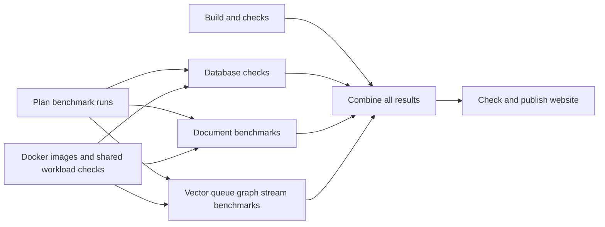
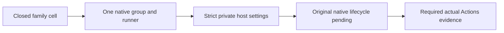
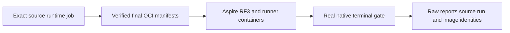
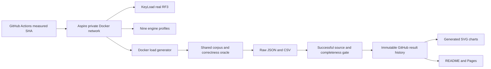
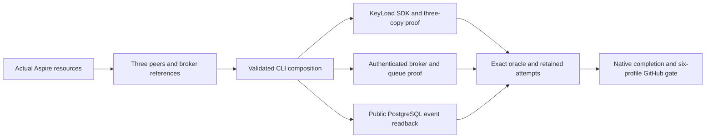
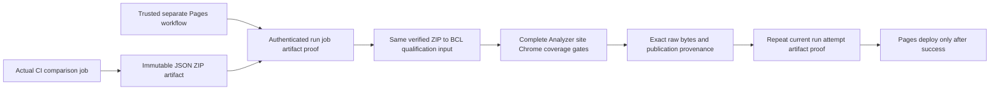
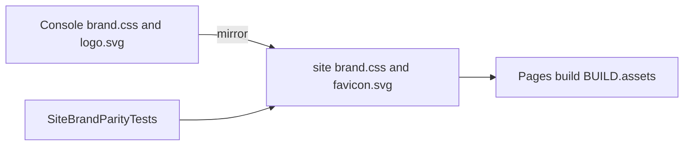
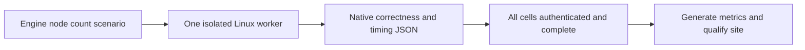
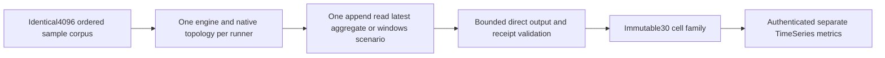

# BenchmarkComparisons

[Native gate repair](BenchmarkComparisons/NativeGateRepair.md) / [ADR-068](../ADR/ADR-068-native-benchmark-gate-repair.md)
preserves full isolated scope while repairing actual stale startup job proof and
investigating Kurrent metadata/leader failures from dbd01269 original artifacts.
The bounded same-ID current-job refresh and exact canonical fixture metadata
contracts are frozen; native leader routing and complete cohort qualification remain open.

## Shared parallel performance pipeline

REQ-PIPE-005/006 and AC-UB-001..006 in
[shared workflow acceptance](../implementation/unified-benchmarks-workflow.md#acceptance) under
[ADR-064](../ADR/ADR-064-three-pipeline-release-delivery.md) repair orchestration:
common image preparation includes pinned TimeSeries checks; independent build,
plan and images start in parallel; preflight, CRUD and specialized matrices share
only required plan/image inputs and run in parallel without an arbitrary cap.
Every authored job/step has a concrete readable name. Exact-source display-name
validators and independent test oracles change together, preserving internal job
IDs, artifact/schema/permission contracts and historical report bytes.

The current270-cell matrix contains ten document/vector/queue/graph/stream
scenarios. Intensive TimeSeries6/30-cell host dispatch, emitted wire, collection,
aggregation and site joins remain pending under ADR-059. Image/model checks are
not TimeSeries performance measurements. Source graph regressions and real
exact-SHA GitHub jobs/artifacts qualify this repair; local source checks do not.

## Isolated TimeSeries input source join

REQ-BC059/061/064 and AC-TH009-001..004 under ADR-059 now have additive strict
private Host settings and one-selected-family Aspire composition source. The
[source receipt](../implementation/isolated-timeseries-input-source-041.json)
binds10 files and126 authored unit/model parameterizations; scoped development
builds/formatter pass. Exact-source GitHub reports, dispatch/original lifecycle,
physical copies/ACK, native6/30 and complete cohort/site remain pending. Existing
source/provenance fixtures are input checks and never observed native evidence.

The additive TimeSeries family has a strict embedded6/30-cell contract and a
settled-run JSON writer under ADR059. The writer retains every planned slot and
original observed ACK/count/failure; unstarted attempts carry no invented timing.
Its workloadSucceeded field preserves the original DTO predicate and cannot
certify native copies or publication. Source review/development evidence is in
[repair039](../implementation/isolated-source-repairs-039.json); exact-source
TUnit/native host/envelope/copy/coverage/30-cell/site joins remain required.

The [035 source-only repair receipt](../implementation/isolated-source-repairs-035.json)
records reviewed HTTP deadline ownership, observed Kurrent fatal precedence,
closed TimeSeries selection/physical-resource models and17 separate original
TUnit report destinations. Development source checks pass in a scoped projection;
full delivered-source/native/fault/cohort/coverage/site gates remain open.

## Digest-backed Docker execution continuation

TASK-KLEVENT-001..003 (REQ/AC-BC-005, AC-PERF-004, AC-KLEVENT-001..003)
repairs KeyLoad's missing public session event readback seen in exact b21 JSON.
Two source files delegate to existing SDK reads, return null for absence and
preserve strict cardinality. A fresh actual RF3 target proves seeded/new/conflict/
cancel/following flows; root owns the hook/docs/gates and bounded worker owns only
those source/new helper files. Full schema3 nine-engine35+31 scope stays required.

REQ-BC-001/003/005/009/019/021 and AC-PERF-006/009 now map to
AC-IMAGE-001..007 under the Accepted [ADR-034 image stage](../ADR/ADR-034-cluster-comparisons.md).
The sole normal/TimeSeries runner and all RF3 hosts consume real digest-backed
images prepared once per GitHub runtime job, with actual manifest-byte/source
label proof, owned output mount/user and native terminal exit0. Required internal
AppHost config is `KeyLoad:ContainerImages:Server` and
`Benchmarks:ContainerImages:LoadGenerator`; missing/invalid refs fail safely and
cannot select a host-process fallback. Root owns shared contracts, AppHost/CI/docs
and final source/evidence review; bounded image tooling/runner Dockerfile worker
scope is frozen in [acceptance](../../docker-comparison-images.acceptance.md) and
[task graph](../../docker-comparison-images.plan.md). TUnit resource/metadata
assertions and actual registry/Aspire execution prove the criteria in GitHub only.
No public engine API/schema/ACK change, external registry publication, local runtime,
tool installation, secret logging or test/bound weakening. Full nine-engine,
native Single/Replicated and six-profile scope remains required and unqualified.

TASK-ISO-030H under [ADR-056](../ADR/ADR-056-isolated-linux-comparison-cells.md)
preserves REQ-BC-001/003/009/050/055/056 and AC-IMAGE-006 while repairing the
native image importer's HTTP lifetime. Supplemental acceptance is explicit:

| Criterion | Pass/fail and evidence |
|---|---|
| AC-IMAGE-LIFE-001 | One real referenced AbortController deadline owns and awaits the original operation through terminal body work, clears in finally, and rejects invalid bounds before submission; no detached race or global keepalive. |
| AC-IMAGE-LIFE-002 | Readiness attempt and poll fit the remaining overall30s; manifest fetch/headers/bounded body/cancel share the existing30s owner. Every existing image/source/digest/status/output oracle remains. Source review plus actual native import is required. |
| AC-IMAGE-LIFE-003 | New ImageHttpDeadlineTests real Node child/native controller tests assert abort settlement/exit0, prompt success/fault exit, original error identity, no late abort, and invalid-bound rejection. No HTTP double; lifecycle evidence stays distinct from HTTP proof. |
| AC-IMAGE-LIFE-004 | Exact-SHA existing ImageBundleRealTests and native import/preflight retain original image bytes/config/source/manifests/outputs/owned cleanup. Failed/skipped/missing cells fail complete270/publication. |

Root owns same-slice image-manifest and its internal helper, shared docs and integration; Luna
owns only NEW ImageHttpDeadline* unit tests/program after the frozen contract.
Public API/data/SQL/SDK/cache topology changes are N/A: this is an internal
tooling lifetime repair. Original d45 MongoDB n2 import failed before tests;
the exact pending inner HTTP await is unretained. New native proof is pending.

The site candidate's observed analyzer dependency failure loop is traced under
REQ/AC-BC-027 in [site acceptance](../../site-design.acceptance.md) and its working
plan. TASK014/015/016 preserve all diagnostics/tests/native thresholds while
repairing genuine decimal display parsing, independent token-start location
oracles, cohesive test classes and uncovered real diagnostic flows. The exact
ownership, staged join and rollback contract is in
[ADR-033](../ADR/ADR-033-code-quality.md); no source-only repair qualifies site
runtime, native coverage or the full database.

Status: in progress. Owner: lead benchmark integrator. Product scope and authoritative boundaries remain in the root policy and product specification. [ADR-034](../ADR/ADR-034-cluster-comparisons.md) defines engine/deployment/evidence contracts.

[ADR-021](../ADR/ADR-021-comparable-postgres-baseline.md) owns PostgreSQL as the primary general-purpose baseline and the equivalent workload/guarantee contract; specialized engines remain separate workload arms. Neither decision establishes a performance winner without successful matched GitHub evidence.

| Requirement | Type / priority | Behavior and rationale | Acceptance |
|---|---|---|---|
| REQ-BC-001 | Correctness / P0 | Use one deterministic dataset and exact caller-visible correctness oracle for every supported equivalent workload. | AC-BC-001; stable hash and verified documents/vectors/graph/events. |
| REQ-BC-002 | Topology / P0 | Run all servers and the load generator in Docker under Aspire, preserving real KeyLoad RF3 and SDK calls. | AC-BC-002; container model and runtime evidence. |
| REQ-BC-003 | Replication / P0 | Add native replicated engine groups with observed membership/copy/acknowledgement state. | AC-BC-003; real connected cluster proof before timing. |
| REQ-BC-004 | Engine coverage / P0 | Add MongoDB, OpenSearch and KurrentDB to the existing six engines using free community scope. | AC-BC-004; nine honest profiles/support matrix. |
| REQ-BC-005 | Event streams / P0 | Add expected-no-stream single-event append and bounded single-event read with identity/revision/cardinality/payload validation. | AC-BC-005; four supported engine implementations and readback. |
| REQ-BC-006 | Provenance / P0 | Use exclusively successful GitHub Actions JSON as public benchmark data and automatically derive graphs. | AC-BC-006; immutable evidence, successful-source gate and no hand-coded measured values. |
| REQ-BC-007 | Product presentation / P0 | Explain KeyLoad clearly in README and present qualified profiles/charts with raw data and guarantee differences. | AC-BC-007; generated SVGs, public links and real first-render proof. |
| REQ-BC-008 | Performance / P1 | Optimize measured bottlenecks without changing contracts and report matching before/after evidence. | AC-BC-008; comparable CI reports and focused correctness/security proof. |
| REQ-BC-009 | Qualification / P0 | Keep all required gates and unsupported readiness/durability boundaries honest. | AC-BC-009; exact delivered-source GitHub results and status docs. |
| REQ-BC-010 | Resource bounds / P0 | Stream JSON and raw CSV reports without creating a complete second copy of sample data as text; preserve every attempt and the report schema. | AC-MP-010; real-file roundtrip/quoting/cancellation regressions and CI resource evidence under ADR-035. |
| REQ-BC-022 | Tooling / P0 | Keep embedded microbenchmarks externally consumable by BenchmarkDotNet's generated child while all source quality rules and real fixture lifetime apply. | AC-EM-001..004; real metadata/store/TUnit process Dry proof under Accepted ADR-047, never comparative/RF3 evidence. |
| REQ-BC-023 | Correctness and ownership / P0 | Replace fake harness verification with genuine pinned Neo4j public runner/native response/data checks and limit cleanup to acknowledged acquired resources. | AC-GH-001..007 under [ADR-049](../ADR/ADR-049-genuine-neo4j-harness.md), [acceptance](../../genuine-comparison-harness.acceptance.md) and [ordered graph](../../genuine-comparison-harness.plan.md); implementation and exact-SHA GitHub proof pending. |
| REQ-BC-026 | Time-series comparison / P0 | Compare persisted KeyLoad and Timescale paths over one deterministic UTC sample set, and exercise ManagedCode.TimeSeries as an in-memory aggregation library with separate guarantee metadata. | AC-BC-026 / AC-TSC-001..006 under [ADR-050](../ADR/ADR-050-timeseries-timescale-comparison.md) and [acceptance](../../timeseries-comparison.acceptance.md); source implementation and full Release build are complete, exact-SHA GitHub proof is pending. |

## Slice map

- Harness/adapters: benchmarks/KeyLoad.Comparisons/Features/BenchmarkComparisons/; existing flat files are migration debt tracked by ADR-032.
- Embedded scenario library: benchmarks/KeyLoad.BenchmarkScenarios/Features/BenchmarkComparisons/; existing KeyLoad.Benchmarks retains only its typed executable runner under ADR-047. New boundary implementation/qualification is pending; exact accepted contract is embedded-benchmark.acceptance.md and its ordered working plan.
- Aspire engine resources: src/KeyLoad.AppHost/Features/BenchmarkComparisons/; shared Program.cs composition has one integration owner.
- Tests: tests/KeyLoad.ComparisonTests/Features/BenchmarkComparisons/ and tests/KeyLoad.UnitTests/Features/BenchmarkComparisons/; existing fixtures are shared.
- Evidence/chart tooling: scripts/Features/BenchmarkComparisons/.
- Site: site/Features/BenchmarkComparisons/; existing root assets are migration debt and updated only under serialized integration ownership.
- Docs: this spec, ADR-034, implementation/comparative-benchmarks.md and the README presentation.
- Time-series profile: root-owned Aspire resource in `src/KeyLoad.AppHost/Features/BenchmarkComparisons/`; profile/targets under `benchmarks/KeyLoad.Comparisons/Features/BenchmarkComparisons/TimeSeries/`; isolated composition in `benchmarks/KeyLoad.ComparisonHost/Features/BenchmarkComparisons/`; real tests under `tests/KeyLoad.ComparisonTests/Features/BenchmarkComparisons/TimeSeries/`; [ADR-050](../ADR/ADR-050-timeseries-timescale-comparison.md).
- Product persisted schema/public API changes: N/A; engines use isolated per-run benchmark databases/collections/streams. Core optimizations require their own business-slice contract and serialized ownership.

## Immutable harness collection and naming repair

REQ-BC-020 maps to AC-BCT-001..006 in
[benchmark-contracts.acceptance.md](../../benchmark-contracts.acceptance.md),
the explicit task graph in its working plan and
[ADR-044](../ADR/ADR-044-benchmark-immutable-contracts.md). This accepted stage owns
the nine diagnosed mutable collection properties/cached oracles and solution-only
CLR naming migration. Valid schema3 JSON and Single configuration spelling, corpus,
scalar vector arithmetic and engine/wire semantics stay stable. Required malformed
array rejection is intentional hardening. Real JSON/configuration/corpus/file
fixtures are authored first; exact-source GitHub engine/full suites remain pending.

## PostgreSQL schema lifecycle and constant SQL

REQ-BC-021 maps to AC-PG-001..006 in
[postgres-schema.acceptance.md](../../postgres-schema.acceptance.md),
[task graph](../../postgres-schema.plan.md) and Accepted
[ADR-045](../ADR/ADR-045-postgres-schema-ownership.md). A duplicate run-ID target
must never delete another target's schema after failed initialization. Constant
client commands bind native values; a transaction-local server context, namespace
lock and durable private owner marker preserve exact workload tables and measured
operations while guarding cleanup. First-authored real PostgreSQL helpers reuse the
existing pinned Aspire container after measurement; no local qualification or
extra RF3 startup. All real tests, exact-SHA evidence and the documented commit-
response fault qualification gap remain pending. Product persistence/API N/A: only
transient benchmark lifecycle metadata changes; no database product contract.

## Preliminary execution graph

The highest-capability architecture review is complete. The frozen constructors, schema3, 35/31 support counts, Kurrent26.1.2 free-cluster boundary and six-profile publication contract are in ADR-034. Root owns shared contracts, target registration, runner, central config, workflows, README and docs. Adapter workers own separate engine files; tooling worker owns separate chart/evidence modules. External-resource helper ownership must avoid the concurrent Orleans/AppHost migration.

| Task | Requirements / acceptance | Write ownership | Dependencies / join evidence |
|---|---|---|---|
| TASK-BC-ARCH-001 | All REQ-BC / AC-BC | None; highest-capability architecture review | Read current contracts/policies; returns exact engine topology and feasible bounded ownership. |
| TASK-BC-ADAPTERS-002 | REQ-BC-001/004/005; AC-BC-001/004/005 | New MongoTarget and KurrentTarget files under the harness feature | Root contract packet ready; native SDK semantics and official sources; reviewed code and GitHub checks required. |
| TASK-BC-OPENSEARCH-003 | REQ-BC-001/003/004; AC-BC-001/003/004 | New OpenSearchTarget files under the harness feature | Root contract packet ready; exact-vector oracle and actual shard/cluster state; reviewed GitHub proof. |
| TASK-BC-EVIDENCE-004 | REQ-BC-006/007; AC-BC-006/007 | New scripts/Features/BenchmarkComparisons chart/data modules | Schema/provenance contract ready; no measured constants; validates actual downloaded successful CI JSON; GitHub publication verifies output. |
| TASK-BC-REPLICAS-006 | REQ-BC-001/003; AC-BC-001/003 | Existing Qdrant/Rabbit/Redis target files and new matching native-receipt helpers in the harness slice | Lead freezes endpoints/client ownership and native receipts; root owns Aspire groups and registration; source review plus real GitHub profiles required. |
| TASK-BC-CURRENT-REPAIR-009 | REQ-BC-001/003/004/005; AC-BC-001/003/004/005 | Only Kurrent-prefixed harness feature files | REVIEW-008 primary-source findings: native settings parser, distinct observed local members and after-corpus probe/checkpoint cut; root reviews every repair and GitHub qualification remains required. |
| TASK-BC-PUBLISH-SYMBOLS-011 | REQ-BC-006/009; AC-BC-006/009 | Only the seven existing scripts/Features/BenchmarkComparisons modules | REVIEW-010 requires named boundary symbols for CLI flags, paths, encoding, statuses and schema fields; preserve all parsing, validation, immutable-history and chart behavior, then join full diff and actual successful-CI JSON byte evidence. |
| TASK-BC-REVIEW-010 | All REQ-BC / AC-BC | None; highest-capability read-only reviewer | Starts on complete source packets; waits for Kurrent-009 and Symbols-011, inspects every final diff and reports source approval separately from pending GitHub integration. |
| TASK-BC-INTEGRATE-005 | All REQ-BC / AC-BC | Root-owned shared surfaces only | Join every reviewed complete worker and concurrent required AppHost/API migration; run complete GitHub qualification, publication and live UI verification. |
| TASK-MP-008B | REQ-BC-010; AC-MP-010 | ReportWriter.cs plus new reporting helpers and real-file tests under Features/BenchmarkComparisons/ | ADR-035 accepted; no runner/contracts/adapters edits; lead reviews schema, all-attempt retention, quoting and cancellation; execution in GitHub only. |

Least expensive capable coding tiers must be chosen per SDK/protocol risk; ambiguous replication/security decisions escalate to the high-capability planner. Workers cannot change shared/public contracts, add packages/config, install skills, run local tests/benchmarks, commit or push. Terminal states: complete, blocked, failed or cancelled. Partial or unverified results do not satisfy a join. Every acceptance maps to the same-numbered requirement, ADR-034, the task row above and planned GitHub evidence; no pending result is a verified feature.

## Current source evidence

[Joined review record](../implementation/benchmark-source-review.json) records COMPLETE source packets for Redis-006, Kurrent-009 and Symbols-011, the highest-capability REVIEW-010, exact source manifests and the lead's integrated static/data checks. All 29 generated files match the original historical output and all three successful GitHub raw JSON files are preserved byte-for-byte. This closes the listed source findings only. Every required real-engine, Docker, delivered-source CI, publication, UI and performance acceptance gate remains explicit and pending in that record.

## Actual caller composition repair (2026-10-02)

REQ-BC-001/002/003/005/009/019/021 map to AC-PERF-001–009 in
[performance acceptance](../../performance-composition.acceptance.md) and its
[ordered task graph](../../performance-composition.plan.md). ADR-034's Accepted
repair continuation freezes the three actual RF3 endpoint bindings, authenticated
Rabbit management client ownership and PostgreSQL public event readback. This
repairs located caller failures; it does not close the existing nine-engine,
native replicated, Docker load-generator or six-profile contracts.

The exact f627 run37057708780 raw smoke files contain no KeyLoad measurements:
setup fails `KeyLoadThreeRealEndpointsRequired`. Rabbit QueueCycle fails
`RabbitManagementClientRequired`; PostgreSQL append readback reaches the default
interface `NotSupportedException`. Separately, native test completion fails the
Aspire terminal predicate. One failure is not evidence for the cause of another.
The retained 48-sample TimeSeries arm has one attempt per timed operation and a
different external topology; its raw timings are diagnostic, not a qualified
throughput, tail-latency or winner claim.

| Task / acceptance | Owning paths | Caller-visible verification |
|---|---|---|
| TASK-PERF-002 / AC-PERF-004 | Harness PostgresComparisonSession; ComparisonTests PostgresStreamPublicRegression and existing PostgresSchemaPublicFlow join | Existing real Aspire PG target: seeded, absent, append, conflicting duplicate/no corruption, cancelled and healthy following event reads; no new SQL or doubles. |
| TASK-PERF-003 / AC-PERF-002/003 | ComparisonHost settings/constants/owner and host-only validation; UnitTests real-child startup/bindings/cleanup cases | Exactly three distinct HTTP(S) peer origins with index0 matching primary; safe early invalid config; actual Basic-auth management client; all existing precedence/cleanup/secret checks retained. |
| TASK-PERF-004 / AC-PERF-002/003 | AppHost Features/BenchmarkComparisons/BenchmarkCallerBindings and existing composition call | Actual node endpoints and broker management/user/password references; native three-copy and queue-member proofs remain mandatory. |
| TASK-PERF-005 / AC-PERF-001/009 | Private GitHub native evidence; root-owned durable receipt/status | Exact c486 full relevant main baseline run37060131271, byte hashes/counts/failing cases; source-only builds cannot qualify tests. |
| TASK-PERF-006/007 / AC-PERF-005–007 | Lead-owned native resource graph/registration, Docker load generator, bounded six-profile CI | Full accepted nine-engine graph and six profiles; no interim six-engine checkpoint qualifies completion. |
| TASK-PERF-008 / AC-PERF-008 | Future owning Search/ResourceExecution/StorageRecovery/ClusterRouting contracts | Owner confirmed SIMD/.NET intrinsics first, Rust only after profiling; correct native ZoneTree APIs and bounded Orleans parallelism preserve atomic apply/read cuts/faults. |

Implementation is staged: first-author real regressions, repair located bindings
and public delegate, review each disjoint worker packet, build/format/governance,
deliver all eligible current-main changes, then retain exact GitHub gates. No
local tests/runtime/benchmarks, timeout increase, terminal-gate substitution,
unpublished package, paid clustering or secret output. Numeric product coverage
and all existing endurance/fault gates remain open until actual evidence exists.
Product persisted schema/API N/A for this composition repair. Website delivery is
owned separately under BC028 and retains its distinct source/evidence boundary.

## Product website and conceptual RF3 presentation

The owner requested a proper product design and Three.js. [ADR-040](../ADR/ADR-040-static-site-threejs-evidence.md), [site acceptance](../../site-design.acceptance.md) and [ordered plan](../../site-design.plan.md) own this bounded extension. The existing BC001–010 and all product/evidence criteria remain mandatory. Reader, keyboard/screen-reader user, constrained browser and evidence publisher are the actors; generated index is the entry, with independent graphics and report mounts. Backend/public API/persistence N/A: no database behavior changes.

| Requirement | Measurable acceptance | Test or review mapping |
|---|---|---|
| REQ-BC-011: product-first responsive design | AC-BC-011: purpose/status/navigation visible at1440/768/390/320px, no page overflow or clipped controls; labelled table scroll only | Qualified H: SiteBuildTests plus explicit real-browser desktop/mobile visual review |
| REQ-BC-012: bounded conceptual Three RF3 | AC-BC-012: Three0.186.1 native backend recorded; one renderer/canvas, correct cancellation/disposal/resize/pause; DPR≤1.5,≤1M pixels,≤30 calls,≤5K triangles, no idle loop | Qualified H: vendor/build TUnit contracts; explicit real-browser graphics lifecycle/device evidence exception |
| REQ-BC-013: accessible independent content | AC-BC-013: semantic labels/focus/tabs and no-JS/reduced/coarse/unavailable-graphics retain text/poster/evidence access | Qualified H: SiteBuildTests plus required keyboard/no-JS/reduced-motion browser review |
| REQ-BC-014: unchanged historical arithmetic and controls | AC-BC-014: all6 scenarios/11 metrics/profile/repetition/log/whiskers/table/downloads match independent oracle over authentic successful-CI reports | Qualified H: SiteMeasurementTests/SiteMeasurementOracle using actual JS child process; real browser control review |
| REQ-BC-015: atomic validated report state | AC-BC-015: invalid/path/hash/rapid/error loads never mix data/provenance/downloads; abort and stale generation fencing | Qualified H: SiteEvidenceValidationTests over real production validators and controlled corrupt inputs; required rapid/error browser review |
| REQ-BC-016: canonical complete asset/build migration | AC-BC-016: feature-owned assets, exact verified vendor/raw bytes and clean isolated output; authored JS≤40KiB gzip/CSS≤20KiB gzip; vendor lazy and separately recorded | Qualified H: SiteBuildTests and source/static/vendor/size/raw-byte checks |
| REQ-BC-017: GitHub TUnit site qualification | AC-BC-017: independent centrally pinned TUnit/MTP/net10 suite, real bounded Node probe, preserved old edge intentions; only exact GitHub run qualifies | Qualified H: KeyLoad.SiteTests full suite in GitHub; explicit visual/lifecycle review exception; numeric coverage is recorded in the scoped website closure below |
| REQ-BC-018: honest source/evidence/delivery | AC-BC-018: site/measured revisions, successful run and hashes distinct; no historical→current/schema3/publication/CLI-model inference | Qualified H: SiteEvidenceValidationTests and strongest complete source/evidence review |

Canonical site files, mounts, TUnit project, limits, task ownership and terminal joins are frozen in ADR-040 and the site plan before coding. Positive flow: read product→inspect actual report→download raw data. Negative/error: corrupt/unavailable report clears all dependent state; GPU failure stops decoration only. Edge: rapid profile changes cannot reintroduce stale data; reduced motion and narrow/no-JS views remain readable. No source/module name is a passing test or public publication result.

## Site coverage and real-browser qualification extension

| Requirement | Measurable acceptance | Test or review mapping |
|---|---|---|
| REQ-BC-024: measure mandatory authored-site coverage | AC-BC-024: exact-source GitHub execution reports at least80% authored JavaScript line coverage, at least70% available V8 block-branch coverage and at least90% line coverage for critical measurement/validation/build/provenance modules; missing required files fail. Raw ranges, source hashes, runtimes, conversion semantics and first baseline are retained. | TASK-SITE-COVERAGE-008: strict native V8 range/report regressions and after-session threshold gate; unchanged vendor/tests/assets excluded, no source ignore directives. |
| REQ-BC-025: exercise the generated site in a real CI browser | AC-BC-025: TUnit uses an already available real Chrome process and BCL CDP/WebSocket against real isolated emitted files/HTTP; controls, numeric correspondence, rapid/error/retry/provenance/download/focus and renderer lifecycle paths have assertions and precise coverage. Missing browser, incomplete source coverage or unexpected console failures fail; no installation, fake DOM/fetch, alternate runner or substituted measurements. | TASK-SITE-BROWSER-009: actual browser suite, retained version/coverage/source packet. Visual judgment and physically unexercised GPU loss retain the narrower manual evidence boundary. |

The strongest coverage review found that manual design proof does not waive numeric root rules. These additions close that qualification gap; pending coverage is never a completed acceptance criterion. Their exact source inventory, converter semantics, task ownership and terminal joins are frozen in ADR-040 and the site working plan before write-capable workers start.

The actual SiteTests run36994330874 exposed a shared vendor-gzip portability
failure before browser launch. REQ/AC-BC-016/017/024/025 retain their existing
requirements; the strict byte-identity/current-runtime compression receipt and
bounded persistent builder diagnostics are frozen in [site acceptance](../../site-design.acceptance.md),
[ADR-040](../ADR/ADR-040-static-site-threejs-evidence.md) and TASK019/020 in the
[site plan](../../site-design.plan.md). Real isolated-builder success/corruption
regressions and specific intended negative errors map to those criteria. Every
source/worker/strongest join and full GitHub Analyzer/native/site/Chrome/coverage
gate is required; the failed baseline and missing hosted gzip length stay honest.

## Fresh GitHub evidence and separate website deployment

REQ-BC-028 maps to AC-BC-028 in [publication acceptance](../../site-publication.acceptance.md),
[ordered plan](../../site-publication.plan.md) and [ADR-040](../ADR/ADR-040-static-site-threejs-evidence.md).
The owner's subsequent request adds a separate post-test publication workflow;
earlier design/DNS exclusions and all BC001–027 requirements remain recorded.
Every number is read from actual comparison-job JSON. Select the highest successful
comparison job by own-main-push run number and descending attempt history; unrelated
database jobs or whole-workflow failure do not block website-only delivery. Exact
comparison-step/artifact/ZIP proof and full current-main website qualification
precede deployment. Separate sibling website/measured/control checkouts retain
accurate revisions. Invalid selected evidence fails without fallback. Existing
verified public data remains until a successful update. Main site/** changes and
benchmark workflow completion trigger the separate action; workflow_run arrives
after the enclosing workflow, not immediately at individual-job completion.

Canonical surfaces: scripts/Features/BenchmarkComparisons/github-evidence-*.mjs
and github-evidence.mjs; SiteGitHub-prefixed tests/input helpers under
tests/KeyLoad.SiteTests/Features/BenchmarkComparisons/; shared pages.yml; durable
spec here. Backend/contracts/database persistence N/A: no runtime/data API changes.
Actors, public receipt schema, positive/negative/edge/error flows, tests, exact
worker ownership and terminal joins are frozen in acceptance/ADR/plan before
writes. Pure controlled metadata/ZIP tests are not fake API transport evidence.
Real workflow/provider/live evidence remains mandatory and is fulfilled for exact
H by the scoped website closure below.

AC-BC-024/025 additionally retains actual CDP blank/no-script empty deltas with
their raw hashes and zero line/branch contribution. Each session must independently
map authored functions; empty-only/unmapped-only sessions and malformed/Node-empty
receipts fail. TASK036/037's tests-first reader/protocol contract and actual G
red baseline are in publication acceptance/plan and ADR-040. Every earlier source
inventory, numeric threshold and complete real-browser assertion remains required.

## Required analyzer dependency for the website candidate

REQ-BC-027 maps to AC-BC-027 in [site acceptance](../../site-design.acceptance.md),
TASK-SITE-ANALYZER-COVERAGE-011 in the [site plan](../../site-design.plan.md), and
[ADR-033](../ADR/ADR-033-code-quality.md). The bounded website candidate must
qualify its actual KeyLoad.Analyzers dependency using the complete real TUnit
suite and native MTP18.11.2 Cobertura counts at the same candidate SHA. Freeze
all30 source files and configuration; include all25 executable sources. Enforce
module80% line/70% branch and each of12 critical diagnostic pipelines90% line
coverage from integer counts. Missing, malformed, ambiguous, changed or empty
evidence fails. Retain raw XML, exact source/runtime hashes, derived report and
pure gate boundary/error regressions. This establishes only the first analyzer
module baseline; broader AC-CQ-009, RF3 and broader repository no-decrease
qualification stay pending. Mandatory website no-decrease coverage is retained in
the scoped closure below.

Concurrent TimeSeries already owns stable REQ/AC-BC-026. The analyzer substage's
initial draft collision was corrected to BC-027 before candidate delivery;
TimeSeries requirements and their scope were preserved.

## Preserving library and CLI prerequisite

REQ-BC-019 maps to AC-HOST-001..007 in [host acceptance](../../comparison-host.acceptance.md)
and Accepted [ADR-043](../ADR/ADR-043-comparison-library-host.md). The existing
KeyLoad.Comparisons assembly/public API becomes a library; the new host owns sole
CLI composition/lifecycle. Aspire retains its comparisons resource and existing
configuration/topology. Public collections/enum/report/workload changes are outside
this stage. Host tests use actual child processes; success/cleanup/cancellation
qualification uses the real GitHub comparison suite. Private construction ownership
requires explicit source review plus runtime evidence as stated in acceptance.
Frontend/persistence/auth surfaces are N/A because this prerequisite changes only
build/CLI ownership. [Host task graph](../../comparison-host.plan.md) records exact
disjoint scopes and lead-only join; existing nine-engine criteria remain mandatory.

Current website delivery consumes authenticated successful schema2 evidence and
rejects unsupported versions without selecting older data after a successful
comparison is chosen. Source inspection of main355's schema3 emitter is not
successful producer or website qualification; failed/incomplete comparison
artifacts cannot refresh the site. Its three profile folders and measurement-step
names still match the publication transport contract. The current schema2 queue
phase→PointRead control regression is TASK032 under REQ/AC-BC-014/025; complete
real Chrome evidence is required, with every existing oracle and numeric gate.

## Qualified website delivery, 2026-10-02

**Website scope only: REQ/AC-BC-011–018/024/025/027/028.** Exact H `6a82c86d0113270335368bbfbff0080ea1c1800a` passed complete GitHub validation37011817610 and both separate automatic Pages publications: site-path push37013009381 and producer-completion workflow_run37014111869. Full118 analyzer and70 site tests pass without skips, together with all required native/JavaScript thresholds and source inventories. [Canonical immutable evidence](../implementation/site-design.json), [design closure](../../site-design.plan.md) and [publication closure](../../site-publication.plan.md) map criteria, tasks, exact artifacts and actual provider/live proof; strongest TASK-SITE-REVIEW-007 documentation/evidence review is COMPLETE.

The live responsive product page includes the bounded independent Three.js scene, accessible charts/tables, workload/metric/repetition controls and exact JSON/CSV/Markdown downloads. Current published measurements are the authentic successful comparison36926803549 at9c570f8c33a7a9667507a8e1c0ca68860de3be45; failed current producer37013008931 supplies no new results. Website/control/measured revisions and run/job/artifact hashes remain distinct. Every performance number is derived from these raw reports; unsupported values stay unavailable.

Pages at https://www.keyload.cloud/ uses enforced HTTPS; live apex redirects301 to www. Both automatic triggers, current-main/evidence freshness, immutable Pages35-file output and all9 raw-report bytes were verified. Manual mobile/desktop/WebGPU review complements real Chrome qualification; physical GPU-loss qualification remains explicitly unexercised. The feature's global status, BC001–010/019–023/026, schema3/advanced profiles and database/endurance/readiness qualification remain unchanged.

## REQ-BC-029: shared KeyLoad visual identity

### AC-BC-029 owner revision, 2026-10-03 (design overhaul)

- **Concept.** The landing is an editorial product page that reads like a spec sheet, in the shared identity from [ADR-053](../ADR/ADR-053-unified-visual-identity.md):
  - paper surfaces, oversized black display type and mono chapter eyebrows (`01 — …`);
  - graphite instrument panels;
  - Managed Code's iridescent marker as the only accent. There is no green or lime.
- **Order.** The page presents KeyLoad as the database for AI agents on .NET 10 and Orleans, keeps the early-development wording, and runs in this order:
  1. a hero with the live scene;
  2. a fact strip;
  3. the anatomy of one agent call;
  4. a data-shape bento;
  5. an engine cross-section;
  6. the evidence instrument, with a perforated provenance receipt;
  7. a ledger of claims that are not made yet;
  8. the method;
  9. reproduce;
  10. the footer.
- **Agent call anatomy.** A numbered timeline beside a graphite terminal shows the real MCP tool `keyload_query_execute` and the real .NET SDK atomic command. It describes the path, not live data.
- **3D scene motion contract (changed by owner direction).**
  - The carousel of data-shape cards around the KeyLoad mark starts moving as soon as it is ready. It spins while visible and follows a fine pointer.
  - It pauses offscreen, on hidden pages and when the visitor pauses it. It never moves under `prefers-reduced-motion`.
  - `AssertMotionPlaysThenSettles` proves that render calls advance while playing and are identical after pause. Budgets are unchanged: 19 draw calls and 37 triangles.
  - The poster is a pre-rendered frame of the same scene on the stage gradient. The canvas is transparent, so the scene sits on the glass stage.
- **Comparable engines only.** The chart and table omit engines that do not implement the selected workload, and KeyLoad is highlighted. Their DOM rows, downloads and the engine count stay intact.
- **Attribution.** The footer reads "Developed by Managed Code" and links to https://www.managed-code.com/ with a normal followed link (no `nofollow`).

- **AC-BC-029:** the public site uses the shared light identity from [ADR-053](../ADR/ADR-053-unified-visual-identity.md):
  - the same logo, tokens and sans display type, plus cards, buttons, tabs, bars and tables;
  - brand-palette engine colours and scene colours.
- `site/Features/BenchmarkComparisons/brand.css` and `site/favicon.svg` are byte-identical mirrors of the console's canonical `brand.css` and `logo.svg`. The test is `SiteBrandParityTests.AC_VI_001_SiteAndConsoleShareByteIdenticalBrandSources` in pages.yml.
- Every existing site hook, the size budgets, no-overflow widths, poster/scene lifecycle, zero console errors and the JS inventory remain unchanged. Copy keeps the early-development and no-winner wording.
- Subjective visual quality is a desktop/mobile screenshot review. It is not a numeric gate.

## Owner-directed isolated Linux performance matrix, 2026-10-03

The additive owner-requested favicon/search/social-preview presentation contract
is [SiteMetadata](BenchmarkComparisons/SiteMetadata.md), REQ-SEO-001..006 /
AC-SEO-001..007 under ADR053. It preserves every benchmark/evidence gate.

[ADR-056](../ADR/ADR-056-isolated-linux-comparison-cells.md) and the canonical
[acceptance](../../isolated-comparisons.acceptance.md)/[plan](../../isolated-comparisons.plan.md)
replace the three-OS and all-engine-on-one-runner producer for new qualification.
Historical evidence retains its original topology/source/format; it is not
qualification of the new matrix. Source and full GitHub/publication gates are pending.

| Stable requirement | Acceptance | Owner and automated evidence |
|---|---|---|
| REQ-BC-050 Linux-only complete qualification | AC-ISO-001 | TASK-ISO-007/010/012; workflow inventory + actual fullLinux CI |
| REQ-BC-051 one isolated agent per engine/node/scenario | AC-ISO-002 | TASK-ISO-007/009/010; closed270-cell plan and native resource inventory |
| REQ-BC-052 actual native1/2/3 and honest unsupported topology | AC-ISO-003 | TASK-ISO-005/009/010; independent membership/copies/ACK proof |
| REQ-BC-053 explicit benchmark fixed-voter safety | AC-ISO-004 | TASK-ISO-005/010; negative configuration, SDK/MCP restart/quorum loss andRF3 |
| REQ-BC-054 intensive shared CRUD correctness and raw failures | AC-ISO-005 | TASK-ISO-008/009/010; deterministic plan/oracle + real native full body/cardinality/absence |
| REQ-BC-055 exact per-worker versioned JSON/provenance | AC-ISO-006 | TASK-ISO-008/010; strict single-target/scenario report and actual job identity |
| REQ-BC-056 complete authenticated aggregation | AC-ISO-007 | TASK-ISO-006/010; real Node/files/TUnit corruption checks + GitHub job/artifact manifest |
| REQ-BC-057 site metrics derived from isolated raw JSON | AC-ISO-008 | TASK-ISO-011; full site validators/oracles/browser/native coverage |
| REQ-BC-058 publish only fresh complete successful cohort | AC-ISO-009 | TASK-ISO-011/012; authenticated aggregate/worker/archive freshness + provider/live proof |

Canonical slice map: BenchmarkComparisons in Comparisons library, ComparisonHost,
AppHost/Features, UnitTests/ComparisonTests/SiteTests/Features, scripts/Features,
site/Features and this durable feature doc; shared workflow/architecture remain
root-owned infrastructure. Benchmark voter validation remains ClusterReplication
with ADR-007. Other public SQL/MCP contracts areN/A changed because existing native
operations/authorization remain. No duplicate feature behavior belongs in a layer.

The reviewed TASK-ISO-012P/012PB/012PJ source join is under Accepted ADR056,
REQ-BC-056/057/058 and AC-ISO-007/008/009. Mandatory SiteCoverageGate prepares
two authenticated immutable isolated ZIPs through BCL before source capture and
rechecks the private original receipt bytes plus277 inputs after the full suite.
SiteIsolatedCoverageInventoryTests exercises actual Node/V8 and rejects omitted
legacy/new publisher sources. All39 production and31 critical sources retain
native80/70/90 gates;49 executed dependencies and the final composite are compared
against trusted control source. Historical12-file evidence remains independent.
Both evidence identities and current website SHA must still match before Pages.
Source readiness is not native coverage,270-cell, publication or live proof;
actual partial failures are in the source qualification record under implementation.

## Separate intensive TimeSeries family

[ADR-059](../ADR/ADR-059-isolated-intensive-timeseries.md) and the canonical
[acceptance](../../isolated-timeseries.acceptance.md)/[plan](../../isolated-timeseries.plan.md)
specify30 additional isolated cells: KeyLoad/TimescaleDB × native1/2/3 nodes ×
Append/RawRangeRead/Latest/Aggregate/Windows, preceded by six private preflights.
REQ-BC-059..064 map to AC-TSI-001..008 and TASK-ISO-TS005..011. Their exact corpus,
direct timestamp/sequence ordering, native SQL ownership, real public negatives,
ACK versus all-copy proof and bounded response validation are normative in the
acceptance; the new family does not change the270-cell or historical48-sample wire.
Native image feasibility and exact internal/SQL/provider contracts precede their
implementation scopes. The frozen16-client/five-repetition/10000-operation profile
records latency through complete decode and wall throughput including synchronous
per-attempt validation. All30 raw results, authentic jobs/images and a separate
complete family projection are required before new TimeSeries metrics publish.

Canonical technical ownership is BenchmarkComparisons/TimeSeries/Intensive in
Comparisons, mirrored by new Unit/ComparisonTests files and new AppHost/host
feature helpers; root owns existing selectors, workflows, JSON, site and docs.
Product API/data migration isN/A: existing authorized SDK/MCP operations remain.
Library-only memory aggregation isN/A in this native-node matrix; its historical
semantic regressions remain. Requirements and all native/publication/coverage
evidence are pending, with no qualified intensive TimeSeries result.

Native baseline repair traceability is frozen in ADR056 TASK-ISO-026K/R/PG/M:
REQ-BC-052/053/055 map to AC-ISO-002/003/004/005/006, original failing GitHub
jobs and new genuine per-engine SDK/Redis-copy/PostgreSQL-slot/Mongo-auth
regressions. Root joins these only in each selected engine's isolated topology
job. The [exact2f source/native receipt](../implementation/isolated-source-qualification-37093197474.json)
distinguishes passing source gates from11 failed native jobs and skipped270.
Repairs are source implementation until same-SHA real native reruns pass; no
site metrics or performance verdict follow from incomplete measurements.
Current-main original baseline is separately retained in
[run37093992229 receipt](../implementation/isolated-current-main-baseline-37093992229.json).
Exact2ec normal units have17 failures and RF3 has one queue-receive
UnknownWriteOutcome; scalar and native comparisons are skipped. This does not
erase the successful exact2f source gate or qualify the new repairs. Fixture
identity/typed-assertion and queue fault work require their own causal repairs
and final delivered-source GitHub proof.

REQ-BC-060..064 / AC-TSI-002..008: ADR059 TS008K-S accepts the additive
real SDK adapter and pure actual-input tests before implementation. Native
SDK/MCP/cancellation/membership/fault proof remains a separate6/30 family gate.
The026/TS007B-D source checkpoint is main397a89c; actual run37097831105
fails17 normal fixture cases. Its RF363/recovery164/analyzer118 and pure runner36
pass; scalar/native comparisons are skipped. The original receipt is
[retained separately](../implementation/isolated-current-main-baseline-37097831105.json).
A source checkpoint or development build does not establish measured performance.

TASK-ISO-030K maps REQ-BC-054/055 and AC-ISO-005/006 to AC-KC-030-001/002/003 in the root acceptance and ADR-056 accepted canonical teardown contract. The native1/2/3 full-volume fixture independently derives55378 real acknowledged streams, retains a foreign native event, applies120s/180s untimed production cleanup at concurrency16 and reads every actual tombstone. Root owns shared selector/evidence/workflow joins. Source/budget approval does not qualify the existing failed/deferred drain branch; genuine026KF process-boundary/fault proof remains pending. Exact delivered-source GitHub tests and authenticated complete workload artifacts are required.

TASK-ISO-031M traces REQ-BC-052/055 and AC-ISO-002/003/006/007 to AC-MR-031-001..005 in ADR056/root acceptance: exact same-image BSON integral fields, intended first writable primary and two fresh valid500ms rounds in existing120s; genuine20s lower-priority native election and observed automatic return under300s parent. Native1/2/3 plus persisted authentication regressions and immutable failed-source evidence remain mandatory. Four AppHost files plus NEW Mongo-prefixed tests have one implementation owner; root owns every selector/workflow/doc/evidence join. Source discovery or stable admission does not establish measured failover tolerance.
The accepted ADR059 TS009S/TS007R packet adds a closed internal preflight/intensive TimeSeries selection, dedicated node-local composition context and real Timescale primary/physical-standby model for1/2/3. Matching selection and resource-model TUnit cases map AC-TSI-001/003/008; configuration and model assertions are source checks, not native role, copy or ACK proof. Root owns actual SDK/official MCP/Npgsql native6 host, separate raw family/protocol/workflow/collector/site joins before the30 measured cells can qualify. Old270 reports and productionRF3 stay under their existing contracts.

ADR056 TASK-ISO-032H/AC-HT-032-001..003 retains one referenced original HTTP lifetime timer until the original promise settles after abort. The real Node regression uses an unreferenced completion timer and preserves original result/reason plus process-exit assertions. Source code/build is separate from exact-SHA actual registry import and full27/270 provenance.

REQ-BC059/061/063/064 and AC-TSI001/003/006/007/008 now map staged
AC-TB009-001/AC-TH009-001..004 to ADR059 TASK-ISO-TS009B/H-A/H-S/H-I. The
[TS009B source receipt](../implementation/isolated-timeseries-identity-source-040.json)
records the actual incarnation parameter and canonical voter bindings, all three
original model cases, development build/formatter and explicit native limitations.
H-A owns one selected native composition and original family hash/cell identity;
H-S owns closed private settings using shared actual source/image provenance.
Neither dispatches the incomplete native lifecycle. Caller-visible positive,
negative/edge/mixed/secret-safe input assertions are in the canonical acceptance;
exact-source GitHub model/normal/scalar and later real6/30 checks are required.
No new product public CLR, persistence, credential authority or defaultRF3 change.
Frontend publication is N/A for these input stages because no new measured family
is qualified; the complete native family site stage remains mandatory.

## Shared comparison pipeline

The owner's Garnet evaluation is specified in
[GarnetStorageEvaluation](BenchmarkComparisons/GarnetStorageEvaluation.md) and
[ADR-066](../ADR/ADR-066-garnet-storage-evaluation.md). Its first diagnostic stage
compares actual public raw Tsavorite2.2.0 and raw ZoneTree1.9.8 resident cache
operations in isolated Linux jobs. It remains separate from the270 service
cells and product RF3; no measured engine winner or storage migration is
established. Full Garnet RESP/AOF/recovery and representative concurrency/
multi-host stages remain required.

The latest owner correction2026-10-03 uses exactly three workflows under
[ADR-064](../ADR/ADR-064-three-pipeline-release-delivery.md): `ci.yml` combines
ordinary build/test/rule gates; `benchmarks.yml` (`Benchmarks`) owns every load/
comparison/TimeSeries check, complete JSON aggregation and the full website
qualification/publication chain; `release.yml` builds and publishes real dated
database delivery. REQ/AC-PIPE-001..004 and REL-001..003 are defined by
[ReleaseDelivery](ReleaseDelivery.md) and its acceptance matrix. Website publication
must authenticate the exact current benchmark run/attempt/source without historical
fallback; recheck that tuple and current website source before deployment. Native isolated
job/step/artifact identities, complete workloads and topology remain required;
authentic historical legacy CI archives are not relabelled.

The accepted TS009W stage in [ADR-059](../ADR/ADR-059-isolated-intensive-timeseries.md)
retains all1280 real warmup attempt/ACK/sequence slots for REQ-BC060/061/062 and
AC-TW009001..003; pure source tests and exact-source normal/scalar qualification
remain separate from the still-undelivered30 native-cell warmup/copy oracle.

The additive [native serialization diagnostics](BenchmarkComparisons/NativeSerialization.md)
map REQ-IS-PERF-001..004 to AC-IS-PERF-001..004 under ADR060/ADR047. They retain
the complete native topology/workload aggregate and publish separate codec
diagnostics; they never masquerade as cluster throughput or website evidence.
