# BenchmarkComparisons

The owner-directed [native vector qualification](BenchmarkComparisons/VectorQualification.md)
under [ADR-109](../ADR/ADR-109-native-vector-comparisons.md) adds SurrealDB/HelixDB
and scaled exact/HNSW/IVFFlat, filtered and concurrent-update evidence to the
website-producing pipeline. Implementation and genuine qualification are pending.

[Live progress repair](BenchmarkComparisons/LiveProgress.md) under ADR-085 owns
bounded Actions visibility and cancellation diagnostics for native workloads.

## Current complete-cohort publication

Owner-directed immediate legacy removal is governed by
[ADR-076](../ADR/ADR-076-current-cohort-publication.md). Its live path supersedes
the historical comparison-smoke/comparison-suite and three-profile publication
contracts below; immutable historical evidence keeps its original provenance.
Source implementation and genuine runtime/publication qualification are distinct.

| Requirement | Measurable acceptance | Tests and evidence |
|---|---|---|
| REQ-BC-CURRENT-001: the complete current native cohort is the sole live producer | AC-BC-CURRENT-001: exact current Benchmarks run/attempt/source, all 270 required cells and 277 original inputs pass existing correctness/fairness/provenance checks; missing, expired, mixed, skipped or failed inputs reject | SiteIsolatedGitHub selection/proof/archive/input/authority tests; actual aggregate and original GitHub archives |
| REQ-BC-CURRENT-002: retire superseded collector, archives and current-profile assets together | AC-BC-CURRENT-002: no active comparison-smoke/comparison-suite collector, twelve-file precondition or three-profile current renderer remains; replacement retains all applicable safety, accessibility, vendor, arithmetic and browser criteria | scoped dependency inventory, workflow source tests and standalone isolated site/browser tests |
| REQ-BC-CURRENT-003: preserve unchanged qualified authority around final build | AC-BC-CURRENT-003: bounded immutable receipt, original archive and all 277 input hashes match before/after builder; emitted aggregate bytes match; every remaining native coverage/no-skip/source-closure gate passes | SiteIsolatedGitHub integrity/build/coverage tests, original TRX/Cobertura/Node/browser artifacts and schema-v2 publication receipt |
| REQ-BC-CURRENT-004: deploy only fresh exact-source evidence | AC-BC-CURRENT-004: current main and exact original producer tuple match immediately before needs-gated least-privilege Pages delivery; altered source/attempt/artifact rejects and actual provider receipt records outcome | SiteIsolatedGitHubFreshnessTests, workflow source tests, genuine same-run qualification and Pages provider receipt |

Canonical ownership remains BenchmarkComparisons under site/scripts/workflows and
SiteTests; the precise disjoint tasks and integration points are in ADR-076.

## Canonical engine decision and candidate cleanup

[ADR-071](../ADR/ADR-071-canonical-zonetree-providers.md) records the owner's
ZoneTree/ZoneTree.FullTextSearch choice and immediate Garnet/Tsavorite removal.

| Requirement | Acceptance | Mapping |
|---|---|---|
| REQ-ZT-001: active storage experiments use the selected canonical engine | AC-ZT-001: no Garnet package or Tsavorite implementation/dispatch remains; real ZoneTree raw/scaled correctness, full loaded-record counts, bounds and cleanup still hold; removed labels fail explicitly | existing RawStorage and ScaledRawStorage TUnit cases, dependency/source inspection |
| REQ-ZT-002: delete discarded plans and unused pipeline paths immediately | AC-ZT-002: active docs have no dead candidate-plan links; Benchmarks has no raw/internal-codec job or diagnostic-only bypass, and preserves every native comparison/image/aggregate/site gate | workflow contract TUnit cases, governance and root diff review |

Immutable prior result files remain truthful historical evidence. This cleanup
does not establish performance, RF3 durability or production readiness. Root
owns package/workflow/docs joins; the bounded worker owns candidate fixture and
matching report/test removal under ADR-071. UI N/A: internal diagnostics do not
produce the public comparison website.

[Native gate repair](BenchmarkComparisons/NativeGateRepair.md) / [ADR-068](../ADR/ADR-068-native-benchmark-gate-repair.md)
preserves full isolated scope while repairing actual stale startup job proof and
investigating Kurrent metadata/leader failures from dbd01269 original artifacts.
The bounded same-ID current-job refresh and exact canonical fixture metadata
contracts are frozen; native leader routing and complete cohort qualification remain open.

## Shared parallel performance pipeline

REQ-PIPE-005/006 and AC-UB-001..006 in
[shared workflow acceptance](../implementation/unified-benchmarks-workflow.md#acceptance) under
[ADR-064](../ADR/ADR-064-three-pipeline-release-delivery.md) repair orchestration:
common image preparation includes pinned TimeSeries checks; independent build,
plan and images start in parallel; preflight, CRUD and specialized matrices share
only required plan/image inputs and run in parallel without an arbitrary cap.
Every authored job/step has a concrete readable name. Exact-source display-name
validators and independent test oracles change together, preserving internal job
IDs, artifact/schema/permission contracts and historical report bytes.

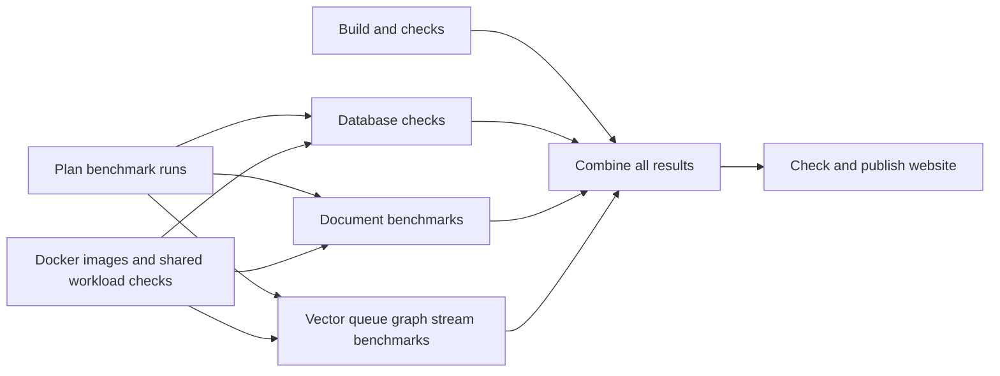

The current270-cell matrix contains ten document/vector/queue/graph/stream
scenarios. Intensive TimeSeries6/30-cell host dispatch, emitted wire, collection,
aggregation and site joins remain pending under ADR-059. Image/model checks are
not TimeSeries performance measurements. Source graph regressions and real
exact-SHA GitHub jobs/artifacts qualify this repair; local source checks do not.

## Isolated TimeSeries input source join

REQ-BC059/061/064 and AC-TH009-001..004 under ADR-059 now have additive strict
private Host settings and one-selected-family Aspire composition source. The
[source receipt](../implementation/isolated-timeseries-input-source-041.json)
binds10 files and126 authored unit/model parameterizations; scoped development
builds/formatter pass. Exact-source GitHub reports, dispatch/original lifecycle,
physical copies/ACK, native6/30 and complete cohort/site remain pending. Existing
source/provenance fixtures are input checks and never observed native evidence.

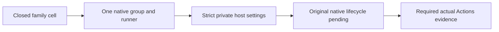

The additive TimeSeries family has a strict embedded6/30-cell contract and a
settled-run JSON writer under ADR059. The writer retains every planned slot and
original observed ACK/count/failure; unstarted attempts carry no invented timing.
Its workloadSucceeded field preserves the original DTO predicate and cannot
certify native copies or publication. Source review/development evidence is in
[repair039](../implementation/isolated-source-repairs-039.json); exact-source
TUnit/native host/envelope/copy/coverage/30-cell/site joins remain required.

The [035 source-only repair receipt](../implementation/isolated-source-repairs-035.json)
records reviewed HTTP deadline ownership, observed Kurrent fatal precedence,
closed TimeSeries selection/physical-resource models and17 separate original
TUnit report destinations. Development source checks pass in a scoped projection;
full delivered-source/native/fault/cohort/coverage/site gates remain open.

## Digest-backed Docker execution continuation

TASK-KLEVENT-001..003 (REQ/AC-BC-005, AC-PERF-004, AC-KLEVENT-001..003)
repairs KeyLoad's missing public session event readback seen in exact b21 JSON.
Two source files delegate to existing SDK reads, return null for absence and
preserve strict cardinality. A fresh actual RF3 target proves seeded/new/conflict/
cancel/following flows; root owns the hook/docs/gates and bounded worker owns only
those source/new helper files. Full schema3 nine-engine35+31 scope stays required.

REQ-BC-001/003/005/009/019/021 and AC-PERF-006/009 now map to
AC-IMAGE-001..007 under the Accepted [ADR-034 image stage](../ADR/ADR-034-cluster-comparisons.md).
The sole normal/TimeSeries runner and all RF3 hosts consume real digest-backed
images prepared once per GitHub runtime job, with actual manifest-byte/source
label proof, owned output mount/user and native terminal exit0. Required internal
AppHost config is `KeyLoad:ContainerImages:Server` and
`Benchmarks:ContainerImages:LoadGenerator`; missing/invalid refs fail safely and
cannot select a host-process fallback. Root owns shared contracts, AppHost/CI/docs
and final source/evidence review; bounded image tooling/runner Dockerfile worker
scope is frozen in [acceptance](BenchmarkComparisons.md) and
[task graph](BenchmarkComparisons.md). TUnit resource/metadata
assertions and actual registry/Aspire execution prove the criteria in GitHub only.
No public engine API/schema/ACK change, external registry publication, local runtime,
tool installation, secret logging or test/bound weakening. Full nine-engine,
native Single/Replicated and six-profile scope remains required and unqualified.

TASK-ISO-030H under [ADR-056](../ADR/ADR-056-isolated-linux-comparison-cells.md)
preserves REQ-BC-001/003/009/050/055/056 and AC-IMAGE-006 while repairing the
native image importer's HTTP lifetime. Supplemental acceptance is explicit:

| Criterion | Pass/fail and evidence |
|---|---|
| AC-IMAGE-LIFE-001 | One real referenced AbortController deadline owns and awaits the original operation through terminal body work, clears in finally, and rejects invalid bounds before submission; no detached race or global keepalive. |
| AC-IMAGE-LIFE-002 | Readiness attempt and poll fit the remaining overall30s; manifest fetch/headers/bounded body/cancel share the existing30s owner. Every existing image/source/digest/status/output oracle remains. Source review plus actual native import is required. |
| AC-IMAGE-LIFE-003 | New ImageHttpDeadlineTests real Node child/native controller tests assert abort settlement/exit0, prompt success/fault exit, original error identity, no late abort, and invalid-bound rejection. No HTTP double; lifecycle evidence stays distinct from HTTP proof. |
| AC-IMAGE-LIFE-004 | Exact-SHA existing ImageBundleRealTests and native import/preflight retain original image bytes/config/source/manifests/outputs/owned cleanup. Failed/skipped/missing cells fail complete270/publication. |

Root owns same-slice image-manifest and its internal helper, shared docs and integration; Luna
owns only NEW ImageHttpDeadline* unit tests/program after the frozen contract.
Public API/data/SQL/SDK/cache topology changes are N/A: this is an internal
tooling lifetime repair. Original d45 MongoDB n2 import failed before tests;
the exact pending inner HTTP await is unretained. New native proof is pending.

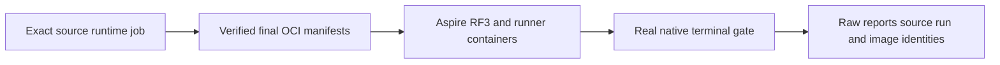

The site candidate's observed analyzer dependency failure loop is traced under
REQ/AC-BC-027 in [site acceptance](../ADR/ADR-040-static-site-threejs-evidence.md) and its working
plan. TASK014/015/016 preserve all diagnostics/tests/native thresholds while
repairing genuine decimal display parsing, independent token-start location
oracles, cohesive test classes and uncovered real diagnostic flows. The exact
ownership, staged join and rollback contract is in
[ADR-033](../ADR/ADR-033-code-quality.md); no source-only repair qualifies site
runtime, native coverage or the full database.

Status: in progress. Owner: lead benchmark integrator. Product scope and authoritative boundaries remain in the root policy and product specification. [ADR-034](../ADR/ADR-034-cluster-comparisons.md) defines engine/deployment/evidence contracts.

[ADR-021](../ADR/ADR-021-comparable-postgres-baseline.md) owns PostgreSQL as the primary general-purpose baseline and the equivalent workload/guarantee contract; specialized engines remain separate workload arms. Neither decision establishes a performance winner without successful matched GitHub evidence.

| Requirement | Type / priority | Behavior and rationale | Acceptance |
|---|---|---|---|
| REQ-BC-001 | Correctness / P0 | Use one deterministic dataset and exact caller-visible correctness oracle for every supported equivalent workload. | AC-BC-001; stable hash and verified documents/vectors/graph/events. |
| REQ-BC-002 | Topology / P0 | Run all servers and the load generator in Docker under Aspire, preserving real KeyLoad RF3 and SDK calls. | AC-BC-002; container model and runtime evidence. |
| REQ-BC-003 | Replication / P0 | Add native replicated engine groups with observed membership/copy/acknowledgement state. | AC-BC-003; real connected cluster proof before timing. |
| REQ-BC-004 | Engine coverage / P0 | Add MongoDB, OpenSearch and KurrentDB to the existing six engines using free community scope. | AC-BC-004; nine honest profiles/support matrix. |
| REQ-BC-005 | Event streams / P0 | Add expected-no-stream single-event append and bounded single-event read with identity/revision/cardinality/payload validation. | AC-BC-005; four supported engine implementations and readback. |
| REQ-BC-006 | Provenance / P0 | Use exclusively successful GitHub Actions JSON as public benchmark data and automatically derive graphs. | AC-BC-006; immutable evidence, successful-source gate and no hand-coded measured values. |
| REQ-BC-007 | Product presentation / P0 | Explain KeyLoad clearly in README and present qualified profiles/charts with raw data and guarantee differences. | AC-BC-007; generated SVGs, public links and real first-render proof. |
| REQ-BC-008 | Performance / P1 | Optimize measured bottlenecks without changing contracts and report matching before/after evidence. | AC-BC-008; comparable CI reports and focused correctness/security proof. |
| REQ-BC-009 | Qualification / P0 | Keep all required gates and unsupported readiness/durability boundaries honest. | AC-BC-009; exact delivered-source GitHub results and status docs. |
| REQ-BC-010 | Resource bounds / P0 | Stream JSON and raw CSV reports without creating a complete second copy of sample data as text; preserve every attempt and the report schema. | AC-MP-010; real-file roundtrip/quoting/cancellation regressions and CI resource evidence under ADR-035. |
| REQ-BC-022 | Tooling / P0 | Keep embedded microbenchmarks externally consumable by BenchmarkDotNet's generated child while all source quality rules and real fixture lifetime apply. | AC-EM-001..004; real metadata/store/TUnit process Dry proof under Accepted ADR-047, never comparative/RF3 evidence. |
| REQ-BC-023 | Correctness and ownership / P0 | Replace fake harness verification with genuine pinned Neo4j public runner/native response/data checks and limit cleanup to acknowledged acquired resources. | AC-GH-001..007 under [ADR-049](../ADR/ADR-049-genuine-neo4j-harness.md), [acceptance](../ADR/ADR-049-genuine-neo4j-harness.md) and [ordered graph](../ADR/ADR-049-genuine-neo4j-harness.md); implementation and exact-SHA GitHub proof pending. |
| REQ-BC-026 | Time-series comparison / P0 | Compare persisted KeyLoad and Timescale paths over one deterministic UTC sample set, and exercise ManagedCode.TimeSeries as an in-memory aggregation library with separate guarantee metadata. | AC-BC-026 / AC-TSC-001..006 under [ADR-050](../ADR/ADR-050-timeseries-timescale-comparison.md) and [acceptance](../ADR/ADR-050-timeseries-timescale-comparison.md); source implementation and full Release build are complete, exact-SHA GitHub proof is pending. |

## Slice map

- Harness/adapters: benchmarks/KeyLoad.Comparisons/Features/BenchmarkComparisons/; existing flat files are migration debt tracked by ADR-032.
- Embedded scenario library: benchmarks/KeyLoad.BenchmarkScenarios/Features/BenchmarkComparisons/; existing KeyLoad.Benchmarks retains only its typed executable runner under ADR-047. New boundary implementation/qualification is pending; exact accepted contract is ../ADR/ADR-047-embedded-benchmark-host.md and its ordered working plan.
- Aspire engine resources: src/KeyLoad.AppHost/Features/BenchmarkComparisons/; shared Program.cs composition has one integration owner.
- Tests: tests/KeyLoad.ComparisonTests/Features/BenchmarkComparisons/ and tests/KeyLoad.UnitTests/Features/BenchmarkComparisons/; existing fixtures are shared.
- Evidence/chart tooling: scripts/Features/BenchmarkComparisons/.
- Site: site/Features/BenchmarkComparisons/; existing root assets are migration debt and updated only under serialized integration ownership.
- Docs: this spec, ADR-034, implementation/comparative-benchmarks.md and the README presentation.
- Time-series profile: root-owned Aspire resource in `src/KeyLoad.AppHost/Features/BenchmarkComparisons/`; profile/targets under `benchmarks/KeyLoad.Comparisons/Features/BenchmarkComparisons/TimeSeries/`; isolated composition in `benchmarks/KeyLoad.ComparisonHost/Features/BenchmarkComparisons/`; real tests under `tests/KeyLoad.ComparisonTests/Features/BenchmarkComparisons/TimeSeries/`; [ADR-050](../ADR/ADR-050-timeseries-timescale-comparison.md).
- Product persisted schema/public API changes: N/A; engines use isolated per-run benchmark databases/collections/streams. Core optimizations require their own business-slice contract and serialized ownership.

## Immutable harness collection and naming repair

REQ-BC-020 maps to AC-BCT-001..006 in
[../ADR/ADR-044-benchmark-immutable-contracts.md](../ADR/ADR-044-benchmark-immutable-contracts.md),
the explicit task graph in its working plan and
[ADR-044](../ADR/ADR-044-benchmark-immutable-contracts.md). This accepted stage owns
the nine diagnosed mutable collection properties/cached oracles and solution-only
CLR naming migration. Valid schema3 JSON and Single configuration spelling, corpus,
scalar vector arithmetic and engine/wire semantics stay stable. Required malformed
array rejection is intentional hardening. Real JSON/configuration/corpus/file
fixtures are authored first; exact-source GitHub engine/full suites remain pending.

## PostgreSQL schema lifecycle and constant SQL

REQ-BC-021 maps to AC-PG-001..006 in
[../ADR/ADR-045-postgres-schema-ownership.md](../ADR/ADR-045-postgres-schema-ownership.md),
[task graph](../ADR/ADR-045-postgres-schema-ownership.md) and Accepted
[ADR-045](../ADR/ADR-045-postgres-schema-ownership.md). A duplicate run-ID target
must never delete another target's schema after failed initialization. Constant
client commands bind native values; a transaction-local server context, namespace
lock and durable private owner marker preserve exact workload tables and measured
operations while guarding cleanup. First-authored real PostgreSQL helpers reuse the
existing pinned Aspire container after measurement; no local qualification or
extra RF3 startup. All real tests, exact-SHA evidence and the documented commit-
response fault qualification gap remain pending. Product persistence/API N/A: only
transient benchmark lifecycle metadata changes; no database product contract.

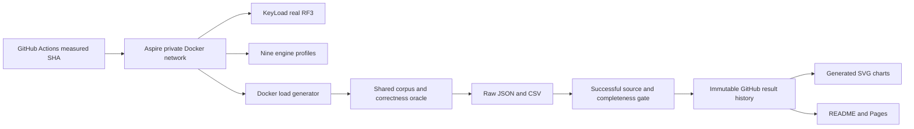

## Preliminary execution graph

The highest-capability architecture review is complete. The frozen constructors, schema3, 35/31 support counts, Kurrent26.1.2 free-cluster boundary and six-profile publication contract are in ADR-034. Root owns shared contracts, target registration, runner, central config, workflows, README and docs. Adapter workers own separate engine files; tooling worker owns separate chart/evidence modules. External-resource helper ownership must avoid the concurrent Orleans/AppHost migration.

| Task | Requirements / acceptance | Write ownership | Dependencies / join evidence |
|---|---|---|---|
| TASK-BC-ARCH-001 | All REQ-BC / AC-BC | None; highest-capability architecture review | Read current contracts/policies; returns exact engine topology and feasible bounded ownership. |
| TASK-BC-ADAPTERS-002 | REQ-BC-001/004/005; AC-BC-001/004/005 | New MongoTarget and KurrentTarget files under the harness feature | Root contract packet ready; native SDK semantics and official sources; reviewed code and GitHub checks required. |
| TASK-BC-OPENSEARCH-003 | REQ-BC-001/003/004; AC-BC-001/003/004 | New OpenSearchTarget files under the harness feature | Root contract packet ready; exact-vector oracle and actual shard/cluster state; reviewed GitHub proof. |
| TASK-BC-EVIDENCE-004 | REQ-BC-006/007; AC-BC-006/007 | New scripts/Features/BenchmarkComparisons chart/data modules | Schema/provenance contract ready; no measured constants; validates actual downloaded successful CI JSON; GitHub publication verifies output. |
| TASK-BC-REPLICAS-006 | REQ-BC-001/003; AC-BC-001/003 | Existing Qdrant/Rabbit/Redis target files and new matching native-receipt helpers in the harness slice | Lead freezes endpoints/client ownership and native receipts; root owns Aspire groups and registration; source review plus real GitHub profiles required. |
| TASK-BC-CURRENT-REPAIR-009 | REQ-BC-001/003/004/005; AC-BC-001/003/004/005 | Only Kurrent-prefixed harness feature files | REVIEW-008 primary-source findings: native settings parser, distinct observed local members and after-corpus probe/checkpoint cut; root reviews every repair and GitHub qualification remains required. |
| TASK-BC-PUBLISH-SYMBOLS-011 | REQ-BC-006/009; AC-BC-006/009 | Only the seven existing scripts/Features/BenchmarkComparisons modules | REVIEW-010 requires named boundary symbols for CLI flags, paths, encoding, statuses and schema fields; preserve all parsing, validation, immutable-history and chart behavior, then join full diff and actual successful-CI JSON byte evidence. |
| TASK-BC-REVIEW-010 | All REQ-BC / AC-BC | None; highest-capability read-only reviewer | Starts on complete source packets; waits for Kurrent-009 and Symbols-011, inspects every final diff and reports source approval separately from pending GitHub integration. |
| TASK-BC-INTEGRATE-005 | All REQ-BC / AC-BC | Root-owned shared surfaces only | Join every reviewed complete worker and concurrent required AppHost/API migration; run complete GitHub qualification, publication and live UI verification. |
| TASK-MP-008B | REQ-BC-010; AC-MP-010 | ReportWriter.cs plus new reporting helpers and real-file tests under Features/BenchmarkComparisons/ | ADR-035 accepted; no runner/contracts/adapters edits; lead reviews schema, all-attempt retention, quoting and cancellation; execution in GitHub only. |

Least expensive capable coding tiers must be chosen per SDK/protocol risk; ambiguous replication/security decisions escalate to the high-capability planner. Workers cannot change shared/public contracts, add packages/config, install skills, run local tests/benchmarks, commit or push. Terminal states: complete, blocked, failed or cancelled. Partial or unverified results do not satisfy a join. Every acceptance maps to the same-numbered requirement, ADR-034, the task row above and planned GitHub evidence; no pending result is a verified feature.

## Current source evidence

[Joined review record](../implementation/benchmark-source-review.json) records COMPLETE source packets for Redis-006, Kurrent-009 and Symbols-011, the highest-capability REVIEW-010, exact source manifests and the lead's integrated static/data checks. All 29 generated files match the original historical output and all three successful GitHub raw JSON files are preserved byte-for-byte. This closes the listed source findings only. Every required real-engine, Docker, delivered-source CI, publication, UI and performance acceptance gate remains explicit and pending in that record.

## Actual caller composition repair (2026-10-02)

REQ-BC-001/002/003/005/009/019/021 map to AC-PERF-001–009 in
[performance acceptance](../ADR/ADR-034-cluster-comparisons.md) and its
[ordered task graph](../ADR/ADR-034-cluster-comparisons.md). ADR-034's Accepted
repair continuation freezes the three actual RF3 endpoint bindings, authenticated
Rabbit management client ownership and PostgreSQL public event readback. This
repairs located caller failures; it does not close the existing nine-engine,
native replicated, Docker load-generator or six-profile contracts.

The exact f627 run37057708780 raw smoke files contain no KeyLoad measurements:
setup fails `KeyLoadThreeRealEndpointsRequired`. Rabbit QueueCycle fails
`RabbitManagementClientRequired`; PostgreSQL append readback reaches the default
interface `NotSupportedException`. Separately, native test completion fails the
Aspire terminal predicate. One failure is not evidence for the cause of another.
The retained 48-sample TimeSeries arm has one attempt per timed operation and a
different external topology; its raw timings are diagnostic, not a qualified
throughput, tail-latency or winner claim.

| Task / acceptance | Owning paths | Caller-visible verification |
|---|---|---|
| TASK-PERF-002 / AC-PERF-004 | Harness PostgresComparisonSession; ComparisonTests PostgresStreamPublicRegression and existing PostgresSchemaPublicFlow join | Existing real Aspire PG target: seeded, absent, append, conflicting duplicate/no corruption, cancelled and healthy following event reads; no new SQL or doubles. |
| TASK-PERF-003 / AC-PERF-002/003 | ComparisonHost settings/constants/owner and host-only validation; UnitTests real-child startup/bindings/cleanup cases | Exactly three distinct HTTP(S) peer origins with index0 matching primary; safe early invalid config; actual Basic-auth management client; all existing precedence/cleanup/secret checks retained. |
| TASK-PERF-004 / AC-PERF-002/003 | AppHost Features/BenchmarkComparisons/BenchmarkCallerBindings and existing composition call | Actual node endpoints and broker management/user/password references; native three-copy and queue-member proofs remain mandatory. |
| TASK-PERF-005 / AC-PERF-001/009 | Private GitHub native evidence; root-owned durable receipt/status | Exact c486 full relevant main baseline run37060131271, byte hashes/counts/failing cases; source-only builds cannot qualify tests. |
| TASK-PERF-006/007 / AC-PERF-005–007 | Lead-owned native resource graph/registration, Docker load generator, bounded six-profile CI | Full accepted nine-engine graph and six profiles; no interim six-engine checkpoint qualifies completion. |
| TASK-PERF-008 / AC-PERF-008 | Future owning Search/ResourceExecution/StorageRecovery/ClusterRouting contracts | Owner confirmed SIMD/.NET intrinsics first, Rust only after profiling; correct native ZoneTree APIs and bounded Orleans parallelism preserve atomic apply/read cuts/faults. |

Implementation is staged: first-author real regressions, repair located bindings
and public delegate, review each disjoint worker packet, build/format/governance,
deliver all eligible current-main changes, then retain exact GitHub gates. No
local tests/runtime/benchmarks, timeout increase, terminal-gate substitution,
unpublished package, paid clustering or secret output. Numeric product coverage
and all existing endurance/fault gates remain open until actual evidence exists.
Product persisted schema/API N/A for this composition repair. Website delivery is
owned separately under BC028 and retains its distinct source/evidence boundary.

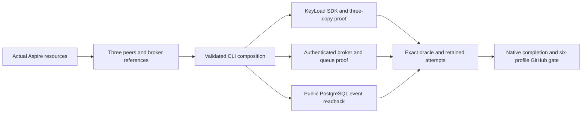

## Product website and conceptual RF3 presentation

The owner requested a proper product design and Three.js. [ADR-040](../ADR/ADR-040-static-site-threejs-evidence.md), [site acceptance](../ADR/ADR-040-static-site-threejs-evidence.md) and [ordered plan](../ADR/ADR-040-static-site-threejs-evidence.md) own this bounded extension. The existing BC001–010 and all product/evidence criteria remain mandatory. Reader, keyboard/screen-reader user, constrained browser and evidence publisher are the actors; generated index is the entry, with independent graphics and report mounts. Backend/public API/persistence N/A: no database behavior changes.

| Requirement | Measurable acceptance | Test or review mapping |
|---|---|---|
| REQ-BC-011: product-first responsive design | AC-BC-011: purpose/status/navigation visible at1440/768/390/320px in a single-row header; at ≤760px the same links open from a visible menu control and close after a selection without losing the section scroll. No page overflow, wrapped header or clipped controls; select text fades before its chevron key; labelled table scroll only | Qualified H: SiteBuildTests plus explicit real-browser desktop/mobile visual review |
| REQ-BC-012: bounded conceptual Three RF3 | AC-BC-012: Three0.186.1 native backend recorded; one renderer/canvas, correct cancellation/disposal/resize/pause; DPR≤1.5,≤1M pixels,≤30 calls,≤5K triangles, no idle loop | Qualified H: vendor/build TUnit contracts; explicit real-browser graphics lifecycle/device evidence exception |
| REQ-BC-013: accessible independent content | AC-BC-013: semantic labels/focus/tabs and no-JS/reduced/coarse/unavailable-graphics retain text/poster/evidence access | Qualified H: SiteBuildTests plus required keyboard/no-JS/reduced-motion browser review |
| REQ-BC-014: unchanged historical arithmetic and controls | AC-BC-014: all6 scenarios/11 metrics/profile/repetition/log/whiskers/table/downloads match independent oracle over authentic successful-CI reports | Qualified H: SiteMeasurementTests/SiteMeasurementOracle using actual JS child process; real browser control review |
| REQ-BC-015: atomic validated report state | AC-BC-015: invalid/path/hash/rapid/error loads never mix data/provenance/downloads; abort and stale generation fencing | Qualified H: SiteEvidenceValidationTests over real production validators and controlled corrupt inputs; required rapid/error browser review |
| REQ-BC-016: canonical complete asset/build migration | AC-BC-016: feature-owned assets, exact verified vendor/raw bytes and clean isolated output; authored JS≤40KiB gzip/CSS≤20KiB gzip; vendor lazy and separately recorded | Qualified H: SiteBuildTests and source/static/vendor/size/raw-byte checks |
| REQ-BC-017: GitHub TUnit site qualification | AC-BC-017: independent centrally pinned TUnit/MTP/net10 suite, real bounded Node probe, preserved old edge intentions; only exact GitHub run qualifies | Qualified H: KeyLoad.SiteTests full suite in GitHub; explicit visual/lifecycle review exception; numeric coverage is recorded in the scoped website closure below |
| REQ-BC-018: honest source/evidence/delivery | AC-BC-018: site/measured revisions, successful run and hashes distinct; no historical→current/schema3/publication/CLI-model inference | Qualified H: SiteEvidenceValidationTests and strongest complete source/evidence review |

Canonical site files, mounts, TUnit project, limits, task ownership and terminal joins are frozen in ADR-040 and the site plan before coding. Positive flow: read product→inspect actual report→download raw data. Negative/error: corrupt/unavailable report clears all dependent state; GPU failure stops decoration only. Edge: rapid profile changes cannot reintroduce stale data; reduced motion and narrow/no-JS views remain readable. No source/module name is a passing test or public publication result.

## Site coverage and real-browser qualification extension

| Requirement | Measurable acceptance | Test or review mapping |
|---|---|---|
| REQ-BC-024: measure mandatory authored-site coverage | AC-BC-024: exact-source GitHub execution reports at least80% authored JavaScript line coverage, at least70% available V8 block-branch coverage and at least90% line coverage for critical measurement/validation/build/provenance modules; missing required files fail. Raw ranges, source hashes, runtimes, conversion semantics and first baseline are retained. | TASK-SITE-COVERAGE-008: strict native V8 range/report regressions and after-session threshold gate; unchanged vendor/tests/assets excluded, no source ignore directives. |
| REQ-BC-025: exercise the generated site in a real CI browser | AC-BC-025: TUnit uses an already available real Chrome process and BCL CDP/WebSocket against real isolated emitted files/HTTP; controls, numeric correspondence, rapid/error/retry/provenance/download/focus and renderer lifecycle paths have assertions and precise coverage. Missing browser, incomplete source coverage or unexpected console failures fail; no installation, fake DOM/fetch, alternate runner or substituted measurements. | TASK-SITE-BROWSER-009: actual browser suite, retained version/coverage/source packet. Visual judgment and physically unexercised GPU loss retain the narrower manual evidence boundary. |

The strongest coverage review found that manual design proof does not waive numeric root rules. These additions close that qualification gap; pending coverage is never a completed acceptance criterion. Their exact source inventory, converter semantics, task ownership and terminal joins are frozen in ADR-040 and the site working plan before write-capable workers start.

The actual SiteTests run36994330874 exposed a shared vendor-gzip portability
failure before browser launch. REQ/AC-BC-016/017/024/025 retain their existing
requirements; the strict byte-identity/current-runtime compression receipt and
bounded persistent builder diagnostics are frozen in [site acceptance](../ADR/ADR-040-static-site-threejs-evidence.md),
[ADR-040](../ADR/ADR-040-static-site-threejs-evidence.md) and TASK019/020 in the
[site plan](../ADR/ADR-040-static-site-threejs-evidence.md). Real isolated-builder success/corruption
regressions and specific intended negative errors map to those criteria. Every
source/worker/strongest join and full GitHub Analyzer/native/site/Chrome/coverage
gate is required; the failed baseline and missing hosted gzip length stay honest.

## Fresh GitHub evidence and separate website deployment

REQ-BC-028 maps to AC-BC-028 in [publication acceptance](../ADR/ADR-040-static-site-threejs-evidence.md),
[ordered plan](../ADR/ADR-040-static-site-threejs-evidence.md) and [ADR-040](../ADR/ADR-040-static-site-threejs-evidence.md).
The owner's subsequent request adds a separate post-test publication workflow;
earlier design/DNS exclusions and all BC001–027 requirements remain recorded.
Every number is read from actual comparison-job JSON. Select the highest successful
comparison job by own-main-push run number and descending attempt history; unrelated
database jobs or whole-workflow failure do not block website-only delivery. Exact
comparison-step/artifact/ZIP proof and full current-main website qualification
precede deployment. Separate sibling website/measured/control checkouts retain
accurate revisions. Invalid selected evidence fails without fallback. Existing
verified public data remains until a successful update. Main site/** changes and
benchmark workflow completion trigger the separate action; workflow_run arrives
after the enclosing workflow, not immediately at individual-job completion.

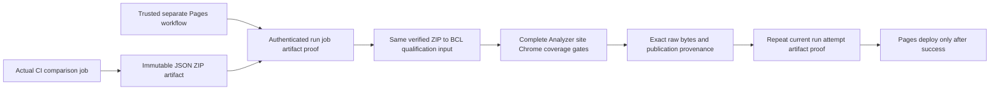

Canonical surfaces: scripts/Features/BenchmarkComparisons/github-evidence-*.mjs
and github-evidence.mjs; SiteGitHub-prefixed tests/input helpers under
tests/KeyLoad.SiteTests/Features/BenchmarkComparisons/; shared pages.yml; durable
spec here. Backend/contracts/database persistence N/A: no runtime/data API changes.
Actors, public receipt schema, positive/negative/edge/error flows, tests, exact
worker ownership and terminal joins are frozen in acceptance/ADR/plan before
writes. Pure controlled metadata/ZIP tests are not fake API transport evidence.
Real workflow/provider/live evidence remains mandatory and is fulfilled for exact
H by the scoped website closure below.

AC-BC-024/025 additionally retains actual CDP blank/no-script empty deltas with
their raw hashes and zero line/branch contribution. Each session must independently
map authored functions; empty-only/unmapped-only sessions and malformed/Node-empty
receipts fail. TASK036/037's tests-first reader/protocol contract and actual G
red baseline are in publication acceptance/plan and ADR-040. Every earlier source
inventory, numeric threshold and complete real-browser assertion remains required.

## Required analyzer dependency for the website candidate

REQ-BC-027 maps to AC-BC-027 in [site acceptance](../ADR/ADR-040-static-site-threejs-evidence.md),
TASK-SITE-ANALYZER-COVERAGE-011 in the [site plan](../ADR/ADR-040-static-site-threejs-evidence.md), and
[ADR-033](../ADR/ADR-033-code-quality.md). The bounded website candidate must
qualify its actual KeyLoad.Analyzers dependency using the complete real TUnit
suite and native MTP18.11.2 Cobertura counts at the same candidate SHA. Freeze
all30 source files and configuration; include all25 executable sources. Enforce
module80% line/70% branch and each of12 critical diagnostic pipelines90% line
coverage from integer counts. Missing, malformed, ambiguous, changed or empty
evidence fails. Retain raw XML, exact source/runtime hashes, derived report and
pure gate boundary/error regressions. This establishes only the first analyzer
module baseline; broader AC-CQ-009, RF3 and broader repository no-decrease
qualification stay pending. Mandatory website no-decrease coverage is retained in
the scoped closure below.

Concurrent TimeSeries already owns stable REQ/AC-BC-026. The analyzer substage's
initial draft collision was corrected to BC-027 before candidate delivery;
TimeSeries requirements and their scope were preserved.

## Preserving library and CLI prerequisite

REQ-BC-019 maps to AC-HOST-001..007 in [host acceptance](../ADR/ADR-043-comparison-library-host.md)
and Accepted [ADR-043](../ADR/ADR-043-comparison-library-host.md). The existing
KeyLoad.Comparisons assembly/public API becomes a library; the new host owns sole
CLI composition/lifecycle. Aspire retains its comparisons resource and existing
configuration/topology. Public collections/enum/report/workload changes are outside
this stage. Host tests use actual child processes; success/cleanup/cancellation
qualification uses the real GitHub comparison suite. Private construction ownership
requires explicit source review plus runtime evidence as stated in acceptance.
Frontend/persistence/auth surfaces are N/A because this prerequisite changes only
build/CLI ownership. [Host task graph](../ADR/ADR-043-comparison-library-host.md) records exact
disjoint scopes and lead-only join; existing nine-engine criteria remain mandatory.

Current website delivery consumes authenticated successful schema2 evidence and
rejects unsupported versions without selecting older data after a successful
comparison is chosen. Source inspection of main355's schema3 emitter is not
successful producer or website qualification; failed/incomplete comparison
artifacts cannot refresh the site. Its three profile folders and measurement-step
names still match the publication transport contract. The current schema2 queue
phase→PointRead control regression is TASK032 under REQ/AC-BC-014/025; complete
real Chrome evidence is required, with every existing oracle and numeric gate.

## Qualified website delivery, 2026-10-02

**Website scope only: REQ/AC-BC-011–018/024/025/027/028.** Exact H `6a82c86d0113270335368bbfbff0080ea1c1800a` passed complete GitHub validation37011817610 and both separate automatic Pages publications: site-path push37013009381 and producer-completion workflow_run37014111869. Full118 analyzer and70 site tests pass without skips, together with all required native/JavaScript thresholds and source inventories. [Canonical immutable evidence](../implementation/site-design.json), [design closure](../ADR/ADR-040-static-site-threejs-evidence.md) and [publication closure](../ADR/ADR-040-static-site-threejs-evidence.md) map criteria, tasks, exact artifacts and actual provider/live proof; strongest TASK-SITE-REVIEW-007 documentation/evidence review is COMPLETE.

The live responsive product page includes the bounded independent Three.js scene, accessible charts/tables, workload/metric/repetition controls and exact JSON/CSV/Markdown downloads. Current published measurements are the authentic successful comparison36926803549 at9c570f8c33a7a9667507a8e1c0ca68860de3be45; failed current producer37013008931 supplies no new results. Website/control/measured revisions and run/job/artifact hashes remain distinct. Every performance number is derived from these raw reports; unsupported values stay unavailable.

Pages at https://www.keyload.cloud/ uses enforced HTTPS; live apex redirects301 to www. Both automatic triggers, current-main/evidence freshness, immutable Pages35-file output and all9 raw-report bytes were verified. Manual mobile/desktop/WebGPU review complements real Chrome qualification; physical GPU-loss qualification remains explicitly unexercised. The feature's global status, BC001–010/019–023/026, schema3/advanced profiles and database/endurance/readiness qualification remain unchanged.

## REQ-BC-029: shared KeyLoad visual identity

### AC-BC-029 owner revision, 2026-10-03 (design overhaul)

- **Concept.** The landing is an editorial product page that reads like a spec sheet, in the shared identity from [ADR-053](../ADR/ADR-053-unified-visual-identity.md):
  - paper surfaces, oversized black display type and mono chapter eyebrows (`01 — …`);
  - graphite instrument panels;
  - Managed Code's iridescent marker as the only accent. There is no green or lime.
- **Order.** The page presents KeyLoad as the AI-native database for AI agents on .NET 10 and Orleans, keeps the early-development wording, and runs in this order:
  1. a hero with the live scene;
  2. a fact strip;
  3. why an AI-native database: the stitched stack against one database, and why we think one database is the future (AC-COMP-009);
  4. connected data in one request ([DatabaseComposition](DatabaseComposition.md));
  5. the anatomy of one agent call;
  6. a data-shape bento;
  7. an engine cross-section;
  8. why .NET, Orleans and ZoneTree (AC-COMP-009);
  9. the evidence instrument, with a perforated provenance receipt;
  10. a ledger of claims that are not made yet;
  11. the method;
  12. reproduce;
  13. the footer.
- **Search metadata.** The title is "KeyLoad — the AI-native database for AI agents". Description, Open Graph, Twitter and JSON-LD copy use the same AI-native positioning within the AC-SEO-002 contract; JSON-LD stays a two-node WebSite/SoftwareSourceCode graph without offers, ratings, reviews or actions.
- **Agent call anatomy.** A numbered timeline beside a graphite terminal shows the real MCP tool `keyload_query_execute` and the real .NET SDK atomic command. It describes the path, not live data.
- **3D scene motion contract (changed by owner direction).**
  - The carousel of data-shape cards around the KeyLoad mark starts moving as soon as it is ready. It spins while visible and follows a fine pointer.
  - It pauses offscreen, on hidden pages and when the visitor pauses it. It never moves under `prefers-reduced-motion`.
  - `AssertMotionPlaysThenSettles` proves that render calls advance while playing and are identical after pause. Budgets are unchanged: 19 draw calls and 37 triangles.
  - The poster is a pre-rendered frame of the same scene on the stage gradient. The canvas is transparent, so the scene sits on the glass stage.
- **Comparable engines only.** The chart and table omit engines that do not implement the selected workload, and KeyLoad is highlighted. Their DOM rows, downloads and the engine count stay intact.
- **Attribution.** The footer reads "Developed by Managed Code" and links to https://www.managed-code.com/ with a normal followed link (no `nofollow`).

- **AC-BC-029:** the public site uses the shared light identity from [ADR-053](../ADR/ADR-053-unified-visual-identity.md):
  - the same logo, tokens and sans display type, plus cards, buttons, tabs, bars and tables;
  - brand-palette engine colours and scene colours.
- `site/Features/BenchmarkComparisons/brand.css` and `site/favicon.svg` are byte-identical mirrors of the console's canonical `brand.css` and `logo.svg`. The test is `SiteBrandParityTests.AC_VI_001_SiteAndConsoleShareByteIdenticalBrandSources` in pages.yml.
- Every existing site hook, the size budgets, no-overflow widths, poster/scene lifecycle, zero console errors and the JS inventory remain unchanged. Copy keeps the early-development and no-winner wording.
- Subjective visual quality is a desktop/mobile screenshot review. It is not a numeric gate.

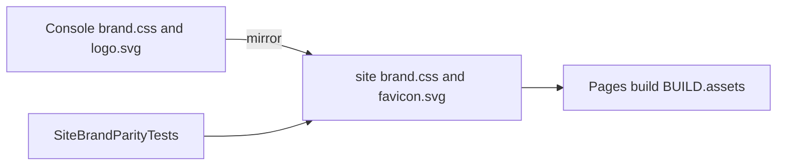

## Owner-directed isolated Linux performance matrix, 2026-10-03

The additive owner-requested favicon/search/social-preview presentation contract
is [SiteMetadata](BenchmarkComparisons/SiteMetadata.md), REQ-SEO-001..006 /
AC-SEO-001..007 under ADR053. It preserves every benchmark/evidence gate.

[ADR-056](../ADR/ADR-056-isolated-linux-comparison-cells.md) and the canonical
[acceptance](../ADR/ADR-056-isolated-linux-comparison-cells.md)/[plan](../ADR/ADR-056-isolated-linux-comparison-cells.md)
replace the three-OS and all-engine-on-one-runner producer for new qualification.
Historical evidence retains its original topology/source/format; it is not
qualification of the new matrix. Source and full GitHub/publication gates are pending.

| Stable requirement | Acceptance | Owner and automated evidence |
|---|---|---|
| REQ-BC-050 Linux-only complete qualification | AC-ISO-001 | TASK-ISO-007/010/012; workflow inventory + actual fullLinux CI |
| REQ-BC-051 one isolated agent per engine/node/scenario | AC-ISO-002 | TASK-ISO-007/009/010; closed270-cell plan and native resource inventory |
| REQ-BC-052 actual native1/2/3 and honest unsupported topology | AC-ISO-003 | TASK-ISO-005/009/010; independent membership/copies/ACK proof |
| REQ-BC-053 explicit benchmark fixed-voter safety | AC-ISO-004 | TASK-ISO-005/010; negative configuration, SDK/MCP restart/quorum loss andRF3 |
| REQ-BC-054 intensive shared CRUD correctness and raw failures | AC-ISO-005 | TASK-ISO-008/009/010; deterministic plan/oracle + real native full body/cardinality/absence |
| REQ-BC-055 exact per-worker versioned JSON/provenance | AC-ISO-006 | TASK-ISO-008/010; strict single-target/scenario report and actual job identity |
| REQ-BC-056 complete authenticated aggregation | AC-ISO-007 | TASK-ISO-006/010; real Node/files/TUnit corruption checks + GitHub job/artifact manifest |
| REQ-BC-057 site metrics derived from isolated raw JSON | AC-ISO-008 | TASK-ISO-011; full site validators/oracles/browser/native coverage |
| REQ-BC-058 publish only fresh complete successful cohort | AC-ISO-009 | TASK-ISO-011/012; authenticated aggregate/worker/archive freshness + provider/live proof |

AC-ISO-006 admits worker envelopes using the supplied verified contract's
`workerSchemaVersion`: current workers use5, immutable historical workers use4,
and aggregate schema4 remains independent. Failed-worker output and active parser
inputs use the actual current contract. Current/historical wrong-version rejection,
original raw hashes, null unsupported reports and complete provenance remain
mandatory under ADR-056's canonical worker-version admission repair.

Canonical slice map: BenchmarkComparisons in Comparisons library, ComparisonHost,
AppHost/Features, UnitTests/ComparisonTests/SiteTests/Features, scripts/Features,
site/Features and this durable feature doc; shared workflow/architecture remain
root-owned infrastructure. Benchmark voter validation remains ClusterReplication
with ADR-007. Other public SQL/MCP contracts areN/A changed because existing native
operations/authorization remain. No duplicate feature behavior belongs in a layer.

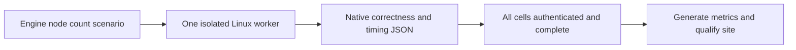

The reviewed TASK-ISO-012P/012PB/012PJ source join is under Accepted ADR056,
REQ-BC-056/057/058 and AC-ISO-007/008/009. Mandatory SiteCoverageGate prepares
two authenticated immutable isolated ZIPs through BCL before source capture and
rechecks the private original receipt bytes plus277 inputs after the full suite.
SiteIsolatedCoverageInventoryTests exercises actual Node/V8 and rejects omitted
current publisher sources. Every remaining production and critical source retains
native80/70/90 gates. ADR-076 retires the obsolete historical collector and profile
renderer; the source closure includes current producer tools and every actual
builder/browser consumer, compared against trusted control source. The exact
current original authority and website SHA must still match before Pages.
Source readiness is not native coverage,270-cell, publication or live proof;
actual partial failures are in the source qualification record under implementation.

## Separate intensive TimeSeries family

[ADR-059](../ADR/ADR-059-isolated-intensive-timeseries.md) and the canonical
[acceptance](../ADR/ADR-059-isolated-intensive-timeseries.md)/[plan](../ADR/ADR-059-isolated-intensive-timeseries.md)
specify30 additional isolated cells: KeyLoad/TimescaleDB × native1/2/3 nodes ×
Append/RawRangeRead/Latest/Aggregate/Windows, preceded by six private preflights.
REQ-BC-059..064 map to AC-TSI-001..008 and TASK-ISO-TS005..011. Their exact corpus,
direct timestamp/sequence ordering, native SQL ownership, real public negatives,
ACK versus all-copy proof and bounded response validation are normative in the
acceptance; the new family does not change the270-cell or historical48-sample wire.
Native image feasibility and exact internal/SQL/provider contracts precede their
implementation scopes. The frozen16-client/five-repetition/10000-operation profile
records latency through complete decode and wall throughput including synchronous
per-attempt validation. All30 raw results, authentic jobs/images and a separate
complete family projection are required before new TimeSeries metrics publish.

Canonical technical ownership is BenchmarkComparisons/TimeSeries/Intensive in
Comparisons, mirrored by new Unit/ComparisonTests files and new AppHost/host
feature helpers; root owns existing selectors, workflows, JSON, site and docs.
Product API/data migration isN/A: existing authorized SDK/MCP operations remain.
Library-only memory aggregation isN/A in this native-node matrix; its historical
semantic regressions remain. Requirements and all native/publication/coverage
evidence are pending, with no qualified intensive TimeSeries result.

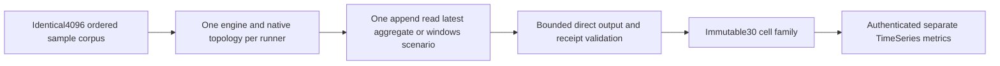

Native baseline repair traceability is frozen in ADR056 TASK-ISO-026K/R/PG/M:
REQ-BC-052/053/055 map to AC-ISO-002/003/004/005/006, original failing GitHub
jobs and new genuine per-engine SDK/Redis-copy/PostgreSQL-slot/Mongo-auth
regressions. Root joins these only in each selected engine's isolated topology
job. The [exact2f source/native receipt](../implementation/isolated-source-qualification-37093197474.json)
distinguishes passing source gates from11 failed native jobs and skipped270.
Repairs are source implementation until same-SHA real native reruns pass; no
site metrics or performance verdict follow from incomplete measurements.
Current-main original baseline is separately retained in
[run37093992229 receipt](../implementation/isolated-current-main-baseline-37093992229.json).
Exact2ec normal units have17 failures and RF3 has one queue-receive
UnknownWriteOutcome; scalar and native comparisons are skipped. This does not
erase the successful exact2f source gate or qualify the new repairs. Fixture
identity/typed-assertion and queue fault work require their own causal repairs
and final delivered-source GitHub proof.

REQ-BC-060..064 / AC-TSI-002..008: ADR059 TS008K-S accepts the additive
real SDK adapter and pure actual-input tests before implementation. Native
SDK/MCP/cancellation/membership/fault proof remains a separate6/30 family gate.
The026/TS007B-D source checkpoint is main397a89c; actual run37097831105
fails17 normal fixture cases. Its RF363/recovery164/analyzer118 and pure runner36
pass; scalar/native comparisons are skipped. The original receipt is
[retained separately](../implementation/isolated-current-main-baseline-37097831105.json).
A source checkpoint or development build does not establish measured performance.

TASK-ISO-030K maps REQ-BC-054/055 and AC-ISO-005/006 to AC-KC-030-001/002/003 in the root acceptance and ADR-056 accepted canonical teardown contract. The native1/2/3 full-volume fixture independently derives55378 real acknowledged streams, retains a foreign native event, applies120s/180s untimed production cleanup at concurrency16 and reads every actual tombstone. Root owns shared selector/evidence/workflow joins. Source/budget approval does not qualify the existing failed/deferred drain branch; genuine026KF process-boundary/fault proof remains pending. Exact delivered-source GitHub tests and authenticated complete workload artifacts are required.

TASK-ISO-031M traces REQ-BC-052/055 and AC-ISO-002/003/006/007 to AC-MR-031-001..005 in ADR056/root acceptance: exact same-image BSON integral fields, intended first writable primary and two fresh valid500ms rounds in existing120s; genuine20s lower-priority native election and observed automatic return under300s parent. Native1/2/3 plus persisted authentication regressions and immutable failed-source evidence remain mandatory. Four AppHost files plus NEW Mongo-prefixed tests have one implementation owner; root owns every selector/workflow/doc/evidence join. Source discovery or stable admission does not establish measured failover tolerance.
The accepted ADR059 TS009S/TS007R packet adds a closed internal preflight/intensive TimeSeries selection, dedicated node-local composition context and real Timescale primary/physical-standby model for1/2/3. Matching selection and resource-model TUnit cases map AC-TSI-001/003/008; configuration and model assertions are source checks, not native role, copy or ACK proof. Root owns actual SDK/official MCP/Npgsql native6 host, separate raw family/protocol/workflow/collector/site joins before the30 measured cells can qualify. Old270 reports and productionRF3 stay under their existing contracts.

ADR056 TASK-ISO-032H/AC-HT-032-001..003 retains one referenced original HTTP lifetime timer until the original promise settles after abort. The real Node regression uses an unreferenced completion timer and preserves original result/reason plus process-exit assertions. Source code/build is separate from exact-SHA actual registry import and full27/270 provenance.

REQ-BC059/061/063/064 and AC-TSI001/003/006/007/008 now map staged
AC-TB009-001/AC-TH009-001..004 to ADR059 TASK-ISO-TS009B/H-A/H-S/H-I. The
[TS009B source receipt](../implementation/isolated-timeseries-identity-source-040.json)
records the actual incarnation parameter and canonical voter bindings, all three
original model cases, development build/formatter and explicit native limitations.
H-A owns one selected native composition and original family hash/cell identity;
H-S owns closed private settings using shared actual source/image provenance.
Neither dispatches the incomplete native lifecycle. Caller-visible positive,
negative/edge/mixed/secret-safe input assertions are in the canonical acceptance;
exact-source GitHub model/normal/scalar and later real6/30 checks are required.
No new product public CLR, persistence, credential authority or defaultRF3 change.
Frontend publication is N/A for these input stages because no new measured family
is qualified; the complete native family site stage remains mandatory.

## Shared comparison pipeline

The latest owner correction2026-10-03 uses exactly three workflows under
[ADR-064](../ADR/ADR-064-three-pipeline-release-delivery.md): `ci.yml` combines
ordinary build/test/rule gates; `benchmarks.yml` (`Benchmarks`) owns every load/
comparison/TimeSeries check, complete JSON aggregation and the full website
qualification/publication chain; `release.yml` builds and publishes real dated
database delivery. REQ/AC-PIPE-001..004 and REL-001..003 are defined by
[ReleaseDelivery](ReleaseDelivery.md) and its acceptance matrix. Website publication
must authenticate the exact current benchmark run/attempt/source without historical
fallback; recheck that tuple and current website source before deployment. Native isolated
job/step/artifact identities, complete workloads and topology remain required;
authentic historical legacy CI archives are not relabelled.

The accepted TS009W stage in [ADR-059](../ADR/ADR-059-isolated-intensive-timeseries.md)
retains all1280 real warmup attempt/ACK/sequence slots for REQ-BC060/061/062 and
AC-TW009001..003; pure source tests and exact-source normal/scalar qualification
remain separate from the still-undelivered30 native-cell warmup/copy oracle.

The additive [native serialization diagnostics](BenchmarkComparisons/NativeSerialization.md)
map REQ-IS-PERF-001..004 to AC-IS-PERF-001..004 under ADR060/ADR047. They are
local development profiling; internal codec jobs and dispatch modes are removed
from Benchmarks. Public figures require the complete native database cohort.

## Lossless series-codec development controls

REQ-BC-CHUNK-001 maps to AC-CHUNK-006 in [TimeSeries](TimeSeries.md),
[ADR-079](../ADR/ADR-079-lossless-series-chunk-codecs.md), TASK-CHUNK-MEASURE and
TASK-CHUNK-JOIN. The shared microbenchmark feature owns public generated-consumer
SampleChunk codec fixtures in `KeyLoad.BenchmarkScenarios/Features/BenchmarkComparisons/`;
the existing typed KeyLoad.Benchmarks switcher remains their CLI. The compared
code paths are current per-record native SampleRecord encoding/decoding and the
bounded candidate chunk codec. Retain exact actual bytes/sample, source, corpus,
settings, machine, cost and allocations. Fixed small batches are explicitly
microbenchmark controls, never the required100k/1m/5m database datasets,
RF3/durability evidence, public website comparisons or an acceleration claim.
Actual canonical rewrite cost and correction recovery remain pending KL-078.
`UnitTests/Features/BenchmarkComparisons/SampleChunkBenchmarkConsumerTests.cs`
verifies all36 matched cases through the real external generated consumer;
its Dry execution proves interoperability rather than performance.
`scripts/Features/BenchmarkComparisons/sample-chunk-development*.mjs` binds the
actual child execution, all36 original BDN cases and9 corpus manifests to unchanged
source and Release dependency inventories. Its development receipt retains the
original settings and explicitly rejects public or database-scale qualification.
The [codec development receipt](../implementation/sample-chunk-codec-development-2026-10-03.json)
retains the actual normal/scalar Aspire reports, two Dry consumers with copied
negative cases and the ordinary36-cell matched codec control. Canonical storage,
rewrite/recovery, representative database scale and Linux/RF3 gates remain open.

## Failed-cell publication repair, 2026-10-04

The owner separates database measurement from browser/site qualification. A
separate static-site build action may follow the generated JSON or run through
CI; the latest clarification permits an end-of-Benchmarks static build. The
selected implementation uses independent CI website jobs on own-main push/manual
and completed Benchmarks events. Every build selects the newest completed
own-main push/manual benchmark with a successful authenticated aggregate, across
both producer event kinds. Invalid latest evidence fails without older fallback;
a workflow_run trigger is authenticated separately from the selected producer.
Website failures do not block metrics. Exactly CI, Benchmarks and Release remain.
ADR-080 owns this workflow/trust-boundary change.

Owner direction explicitly supersedes the all-success restriction of REQ-BC-058,
AC-ISO-007/009 and ADR-076 for benchmark publication. Every planned cell remains
accounted for in the same authenticated run/attempt/source. Successful independent
cells remain measured; terminal failed workloads have `disposition: failed`,
`reason: Benchmark failed; no measurement data is available.`, `report: null`,
and the original failed job/step conclusions. No metric, winner or zero is inferred.
KeyLoad engine repair and concurrent series-codec work are outside this task.

| Requirement | Acceptance | Verification |
|---|---|---|
| REQ-BC-FAIL-001 independent workloads finish | AC-BC-FAIL-001 failed matrices do not skip aggregate; no fail-fast or arbitrary parallel cap | actual GitHub job outcomes and complete aggregate accounting; source presence checks are not acceptance evidence |
| REQ-BC-FAIL-002 explicit unavailable cells | AC-BC-FAIL-002 workload failure produces a bounded null-report envelope before artifact upload; original job failure remains visible | real Node/files TUnit tests, actual failed-job artifact |
| REQ-BC-FAIL-003 authenticated partial results | AC-BC-FAIL-003 failed job accepted only with failed workload, successful result upload and matching failed envelope; missing/malformed/expired/mixed evidence rejected | producer/aggregate/site negative and positive TUnit regressions |
| REQ-BC-FAIL-004 honest site | AC-BC-FAIL-004 successful competitors retain values; failed cells have no numeric values and expose actual job link | independent numeric oracle, projection validation and real Chrome |
| REQ-BC-FAIL-005 repair shared preparation | AC-BC-FAIL-005 diagnose exact failed logs, repair benchmark setup/build invocation, retain native isolated topology and Aspire ownership | exact failed-source log, focused regression, delivered-source GitHub rerun |
| REQ-BC-FAIL-006 bounded registry readiness | AC-BC-FAIL-006 each native HTTP probe has at most2s within the unchanged30s total; only settled non-aborted HTTP200 succeeds; private no-follow diagnostics remain at most121 records/64KiB and evidence-write failures propagate. Actual fixture listeners use kernel-assigned loopback ports; optional numeric port accepts only integers1..65535 before HTTP/evidence, while both production callers keep the default5000 | `ImageRegistryReadinessTests`:10 actual loopback HTTP/error/bounds cases, including rejected port inputs before I/O, plus genuine pinned Docker image export/import in GitHub |
| REQ-BC-FAIL-007 Kurrent writer starts after membership | AC-BC-FAIL-007 verify all native1/2/3-member views before constructing the SDK writer; retain native DNS seeds, TLS verification, leader preference, NoStream semantics, acknowledgements, replica-copy oracle and cleanup | `IsolatedKurrentDiscoverySettingsTests`:3 actual SDK/resource-model cases; genuine Aspire-owned StreamAppend preflights for1/2/3 nodes |
| REQ-BC-FAIL-008 explicit cancellation stops owned work | AC-BC-FAIL-008 workload, finalization and result upload use `!cancelled()` so ordinary failure still finalizes while cancellation stops execution/publication; `always()` cleanup retains bounded diagnostics and safely removes owned registries whose setup was cancelled | canceled-job/producer rejection operation regressions and actual GitHub lifecycle; no source-text substitute |
| REQ-BC-FAIL-009 align native Redis transport | AC-BC-FAIL-009 each isolated Redis resource uses the documented native certificate opt-out for its existing authenticated RESP/TCP bootstrap; after actual Aspire startup, primary/replica endpoints retain scheme `redis` and native target port6379 with TLS disabled. Discovered mapped host ports remain dynamic; native client settings retain a password without `ssl=true`. Preserve health checks, wait dependencies, AOF `always`, native membership, direct-copy/cancellation checks and WAIT/WAITAOF acknowledgements | actual pinned resource-model regressions plus genuine Aspire-owned native Redis 1/2/3-node preflights; complete matrix and site qualification remain mandatory |
| REQ-BC-FAIL-010 preserve exact OpenSearch vector ordering | AC-BC-FAIL-010 the native query preserves the unchanged shared float32-input/double-accumulated cosine oracle and ordinal ID tie order. Use native `scripted_metric` map/combine/reduce over actual vector doc values; round parsed query values back to float32 before double arithmetic, retain at most TopK candidates per shard, merge only bounded shard TopK states, validate finite native double scores and retain projected content from the existing native source only for admitted candidates. Do not sort through float `_score`, weaken recall/tolerances, rerank/fetch in the client, duplicate stored vectors, use ANN or change the corpus/native topology/ACK contracts | independent deterministic precision witness for query d000000170 (documents2289/1272), positive/negative native query/response TUnit checks, and genuine Aspire-owned OpenSearch VectorExact1/2/3 jobs with every five10000-operation repetition passing the unchanged oracle; complete same-run aggregate/site/Pages still required |
| REQ-BC-FAIL-011 create the qualification evidence parent | AC-BC-FAIL-011 initialization creates the real workspace artifacts/site-evidence parent before any capture redirection, preserves existing directories/files, rejects file or symlink collisions at artifacts or site-evidence before output, and leaves isolated-capture absent for its exclusive producer. Never skip/rebind source/archive/270/277/test/coverage/browser/freshness gates | SiteQualificationStartupTests executes the actual initialization Bash block in fresh owned filesystems (new/existing parent, file/base-link/parent-link collisions), checks actual envelope redirection and unchanged targets, and runs as a mandatory Aspire-owned unit preparation gate; genuine new-source website qualification/Pages remains required |
| REQ-BC-FAIL-012 execute the actual native probe contract | AC-BC-FAIL-012 C# probe requests serialize the existing lowercase operation/values contract; median arithmetic and odd/even/empty assertions remain unchanged. Native error probes preserve string error codes and use the actual native error name for numeric DOMException codes; real AbortController cancellation must still assert AbortError | Existing SiteMeasurementArithmeticTests and SiteIsolatedHttpTests, original failed TRX and focused genuine-input development checks |
| REQ-BC-FAIL-013 complete disposable builder source | AC-BC-FAIL-013 SEO/vendor scratch repositories copy the exact canonical isolated-contract.json bytes from the actual source repository before invoking the actual builder. Vendor-only mutations use the accepted fixture's unchanged full original aggregate and270-worker inventory; they must not substitute an aggregate-only directory or duplicate the2GB raw inventory for each metadata mutation. Existing missing/link/corrupt-asset negatives must reach their intended checks before output; the valid vendor compression case must succeed. No fabricated contract, provider input, replacement builder or weaker assertion | Existing four SiteMetadataRejectionTests and three SiteVendorBuildTests, with actual source-byte copying and unchanged input authority |
| REQ-BC-FAIL-014 bound heavy qualification children | AC-BC-FAIL-014 expensive full-cohort builder/archive-verification children share bounded admission before their existing300s active execution deadline starts. Retain complete277 inputs/270 workers, stdout/stderr bounds, caller cancellation and original-byte verification. Hold ownership until actual child exit and readers settle; cancelled queued requests start no child. Select limits from original timings and bounded source-exact development measurements, then require every complete site test and native coverage gate in genuine Linux GitHub | Real-process admission/cancellation/failure regressions, original-input single-versus-parallel phase/CPU/RSS development receipts, complete unfiltered Aspire-owned GitHub site/TRX/Node+Chrome coverage and Pages |
| REQ-BC-FAIL-015 emit a confined browser catalog URL | AC-BC-FAIL-015 the actual built HTML uses `data/isolated-catalog.json`, which the existing strict `confinedUrl` accepts. Retain rejection of dot segments, traversal, foreign origins, credentials, redirects, mismatched hashes and unavailable evidence. Real Chrome must reach the existing Ready predicate and preserve every numeric/null, provenance, responsive and lifecycle assertion | Existing SiteIsolatedBuildTests, SiteIsolatedBrowserTests, SiteIsolatedFailedCellBrowserTests, SiteIsolatedStandaloneBrowserTests and SiteBrowserBehaviorTests; genuine Linux full site and coverage |
| REQ-BC-FAIL-016 validate the actual PNG-backed ICO structure | AC-BC-FAIL-016 distinguish the ICO file header type1 from each directory entry's color-count0 and reserved0. The canonical PNG-backed entries retain planes0, bits32, bounded16/32/48 frames and actual8-bit RGBA PNG payloads. Preserve exact console/site/output bytes, frame bounds, dimensions and missing/corrupt asset checks | Existing SiteMetadataTests.AC_SEO_001_IconsAreValidSharedBytesAndEmittedFromTheRealBuild; genuine Linux full site and coverage |
| REQ-BC-FAIL-017 database-only benchmark graph | AC-BC-FAIL-017 Benchmarks has only native preparation, database comparisons, authenticated result validation and JSON aggregation. No browser/site qualification/coverage/Pages dependency; a separate static build may follow ready JSON; every independent cell still finishes and failure still yields null data | actual completed planned cells/aggregate JSON and original GitHub job graph; source-only workflow tests retired |
| REQ-BC-FAIL-018 independent automatic JSON consumer | AC-BC-FAIL-018 CI website jobs run on own-main push/manual and actual completed Benchmarks events, independently of ordinary CI/RF3 and producer workload failures. Consume only a successful aggregate and its exact original suite/provider archives. Chrome/site/build/deploy remain exclusively CI website work and cannot affect the producer | Updated workflow/source/producer-selection TUnit tests, genuine workflow_run CI and published JSON/browser join |
| REQ-BC-FAIL-019 authenticate the cross-workflow producer | AC-BC-FAIL-019 native Linux CI qualify/deploy context validates the real GitHub workflow_run payload: repository477801965, own-main head repository/branch, Benchmarks path/name, completed status, allowed producer event, immutable source, positive exact run/attempt and success/failure conclusion. Reject cancellation, fork, other workflow, changed tuple, missing/malformed/nonregular/oversized event file and historical publication overrides before capture. Authenticate that trigger separately from the latest selected producer and current CI executor/control/website; reselect latest and reauthenticate before deploy | Actual native context/selection rejection tests and CI AcPipe003; original archive receipts,270/277 identity and existing freshness coverage |

| REQ-BC-FAIL-020 latest metrics for every website build | AC-BC-FAIL-020 select the highest run-number completed own-main Benchmarks run with success/failure conclusion across push/workflow_dispatch producers; pending, skipped and canceled runs have no finished comparison cohort and are not candidates. Require success/failure producer conclusion, successful aggregate and all original270/277 proofs. Reject missing/corrupt/latest failed aggregation without older fallback. Own-main CI push/manual and workflow_run all use this selection; changed latest tuple before deploy prevents stale refresh | Real producer-selection positive/negative TUnit cases, native CI capture and freshness/provider join |

| REQ-BC-FAIL-021 independent website queue | AC-BC-FAIL-021 own-main CI push/manual uses run-specific workflow concurrency so an unrelated older ordinary CI/RF3 run cannot queue the website consumer. PR retains ref cancellation; website qualify/deploy use distinct job-level serialization with cancel-in-progress=false. All tests, source/latest JSON and freshness gates remain unchanged | actual CI job start while older ordinary source tests run; original run/job timestamps are required manual evidence |

TASK-FAIL-SEPARATE-001 (root) records policy/requirements/ADR before edits.
TASK-FAIL-SEPARATE-002 (root) removes site generation and qualify/deploy from
Benchmarks, adds independent CI own-main push/manual and workflow_run website jobs, and prevents ordinary CI suites
from running again for that event. Keep native database matrices untouched.
TASK-FAIL-SEPARATE-003 (producer worker) adapts only the site GitHub context,
capture/aggregate-step contracts and their native SiteTests to the real CI event and strict latest completed producer selection.
Original historical receipts retain their actual legacy aggregate-step inventory;
new producers bind the five database-only aggregate steps. Never rewrite archives.
TASK-FAIL-SEPARATE-004 (workflow worker) updates only workflow TUnit regressions.
TASK-FAIL-SEPARATE-005 (root) joins exact-source build/format/governance/Aspire
checks, scoped commit/push, genuine benchmark JSON and independent CI publication.
Root owns action policies, dependency/source inventory and shared docs. No worker
may alter engines, raw measurements, authorization, topology or numerical gates.

The independent source-stage [development receipt](../implementation/benchmark-json-ci-development-2026-10-04.json) binds the full0-warning/0-error build, format/governance and34/34 real Aspire/TUnit workflow/startup regressions to the actual source candidate. The six native context modules pass syntax checks; delivered-source native CI, full site coverage and publication remain pending. The genuine73 cohort independently completed all270 cells and authenticated JSON aggregation despite16 failed/null KeyLoad workloads; successful-job counts include explicitly unsupported cells and are not measurement counts.

[ADR-080](../ADR/ADR-080-benchmark-failure-isolation.md) owns the boundary change.
The site follow-up is FAIL-SITE-PROBES (native worker, four test-helper files and
the obsolete SiteVendorTokens.cs scratch-aggregate token),
FAIL-SITE-ADMISSION (producer worker, exact heavy-child lifecycle helpers and
regressions after the root contract), then FAIL-SITE-JOIN/DELIVERY (root).
Native worker owns SiteNodeProbe.cs, SiteIsolatedNodeProgram.cs,
SiteMetadataRejectionTests.cs and SiteVendorTestScope.cs. The producer first
profiles the unchanged actual source/original input before admission changes.
The original TRX contains25 builder cases and12 produce-rejection cases, plus
five native inputs/verify-inputs cases matched by the heavy classification.
These42 cases permit40 pending requests with two active children; cases with
multiple invocations issue them sequentially. This is an inventory bound,
not an observed concurrent queue. The approved admission policy is
two active children, a FIFO queue of at most64 waiters and a20-minute cancellable
admission deadline before the unchanged300-second active deadline. Local
source6e/original AA270 profiling with native V8 coverage measured44.014s for one
builder and53.448/53.444s for two; full277-input verification measured48.428s
single and59.707/75.799s concurrent. Peak RSS stayed below483MB per child in
these bounded macOS development sessions; this does not measure GitHub resource
saturation or qualify website performance. Heavy classification includes actual
builders, produce requests and inputs/verify-inputs probes; light probes and
native network capture retain their existing paths and deadlines. An unsettled
child or reader poisons admission and rejects pending requests, rather than
releasing unsafe capacity. Producer owns SiteHeavyChildAdmission.cs,
SiteHeavyChildLease.cs, SiteHeavyChildTokens.cs, SiteHeavyChildClassification.cs,
SiteHeavyChildProcessFixture.cs, SiteHeavyChildAdmissionTests.cs and
SiteHeavyChildCleanupTests.cs; its existing-file edits are limited to
SiteIsolatedNodeProcess.cs, SiteIsolatedBuilderProcess.cs,
SiteIsolatedGitHubNodeProcess.cs and SiteIsolatedGitHubNativeProcess.cs, all in
the existing SiteTests feature. The real-process regressions cover FIFO/capacity,
queued cancellation, queue-full/deadline rejection before start, native start
failure, active cancellation, output bounds and unsafe ownership fail-closed.
Root owns requirements, workflow/source closure, integration, full checks and delivery.
An original source-exact verification copy with an explicitly recorded candidate
test patch can provide filtered local development evidence. Never relabel the
immutable receipt, current HEAD, CI/GitHub executor or local results. Filtering
does not satisfy the full site/coverage qualification; production gates stay intact.
The final16-file harness candidate passed all26 selected genuine-input Aspire
case assertions (16 existing,10 new lifecycle cases), without skips or cancellation.
The filtered run retained its actual exit10 and one synthetic after-session
coverage failure; it does not qualify the full site or publication. A separate
actual main73 candidate passed the full Release build, formatter and governance.
Exact source, native-input, runner and TRX identities are recorded in
[the development receipt](../implementation/benchmark-site-harness-development-2026-10-04.json).
Ordered task graph: FAIL-CONTRACT (root, complete) -> FAIL-SITE (site worker),
FAIL-PRODUCER (tooling worker), FAIL-PREP (root/diagnostic worker) -> FAIL-JOIN
(root review/build/format/governance/Aspire tests) -> FAIL-DELIVERY (scoped commit,
push, genuine complete GitHub benchmark run and Pages receipt). FAIL-CANCEL is a
root-owned follow-up before FAIL-JOIN: preserve ordinary-failure finalization,
stop explicitly cancelled work, extend owned-registry cleanup and test all three
matrix branches. Registry deadline regressions accept a final bounded aborted
probe as well as a settled HTTP503; total/probe bounds and no-ready assertions
remain unchanged. The C# bridge reports original Node stderr before exit status.
All workers have
disjoint write scopes; root owns contracts, workflows, receipts, inventories and
docs. Local verification is development evidence; publication requires authentic
GitHub artifacts and full existing site qualification. Interrupted jobs without
authentic result artifacts remain a publication blocker rather than fabricated
worker evidence. Baseline run37154664616 has failures in container preparation,
missing result artifacts and KeyLoad workloads. Original Redis job111299652762
retained an HTTP503 response in comparison-preflight-qualification-redis-n1-point-read
artifact11286445994; the retry policy accepted only403/429 and rejected503.
Bounded transient GET retries and null-report finalization repair this shared
setup path. Local macOS development evidence: full Release solution build passed
with zero warnings/errors; Aspire-owned producer/finalizer tests 2/2, GitHub
evidence tests 84/84 and workflow tests 23/23 passed. Original successful PostgreSQL job111299653748/artifact
11285823608 and RabbitMQ preflight job111299652838/artifact11285807871 are retained
as compact immutable test-only fixtures with original hashes, source and provenance;
48 original measured-report positive/negative probes passed. These fixtures never
substitute for current publication input. Final formatting is recorded separately; unrelated concurrent SampleChunk
formatting is outside this repair. Delivered-source workload/site publication proof remains pending.

The first repair run37158699545/source65e8bf59 passed the clean Linux solution
build, formatter and pinned Docker image preparation/roundtrip. Actual website
cell `keyload-n1-document-update` job111309324270/artifact11286559225 failed its
workload, uploaded successfully and passed unchanged production job/artifact/ZIP/
envelope/agreement/site validators with its original null report. This is genuine
failed-cell runtime proof; complete270 aggregation and Pages remain pending.

That run exposed two native preparation defects. Kurrent n3 job111309323415
started a listening registry but its first HTTP request consumed the entire30s
probe budget; the underlying transport cause was not logged. FAIL-PREP-REGISTRY
uses2s attempts inside the same30s total and records bounded safe probe facts.
Kurrent n2 job111309323419/artifact11286971852 began writer construction while
native election was still `PreLeader`. Actual pinned SDK1.4.0 constructor/selector
inspection proves eager discovery can choose a live follower at that stage;
the exact cached endpoint was not logged. FAIL-PREP-KURRENT moves construction
after awaited complete membership verification. These are benchmark fixture
repairs; neither changes a database engine, URI, retry/ACK contract or topology.
Root records this contract before integration, then runs the focused Aspire
unit/comparison cases, full build/formatter/governance and an exact-source Linux
rerun before claiming the two repairs or publication qualified.

FAIL-PREP-OPENSEARCH is a follow-up under ADR-080. Sourcefabff69193f41c784f0b36b85c1f34d82fa9903d,
run37166698745, OpenSearch n1 VectorExact job111334162158 failed exactly two
`ExactRecallOrProjectionMismatch` operations (2489/6585) in every repetition;
both select corpus query d000000170. Native startup, membership, copy checks and
cleanup succeeded. Original failed public artifact11291956733 has SHA256
1823f7fc876ad3b3a385056a8f75ab6bcd1de2cdb53bbef977a9e2d4313f5088 and
`report:null`; original qualification11291373059 has SHA256
070fd453c92cf373666c3e993990f9e06bac07d111eac0795ebcdc03ed86d4d2 and retains
the rejected raw result. Returned neighbor IDs were not captured in this original
failure, so its precise native rank is not inferred. An independent offline
mathematical witness shows the shared double oracle places document2289
(0.27605485016755293) before1272 (0.2760548285997265), while both collapse to
1.276054859161377 under float32 translated-score ordering. That witness is
development proof, not a native query result or publication input. The follow-up
must use the native exact bounded aggregation API and qualify actual returned IDs through
the unchanged complete workload. The current failed-cell run continues independently;
any repair requires its own authentic source/run/attempt qualification.
Pinned OpenSearch3.6.0/k-NN3.6.0.0 registers vector doc-values access for
scripted-metric contexts but not `NumberSortScript`; generic vector `get(int)`
throws. Numeric `_script` sorting cannot use that vector accessor in this pinned
version. The selected native map/combine/reduce path avoids that unsupported API
and float `_score` ordering. Source/response helpers remain benchmark-owned;
unchanged native VectorExact jobs must prove the strategy and resource bounds.

FAIL-SITE-STARTUP follows the successful original270 aggregate in run37166698745.
Actual Check website job111348160002 failed before tests at02:55:05.5179465Z:
its first shell redirection could not open artifacts/site-evidence/isolated-capture-envelope.json.
QualifySite initialization exported paths but never created their parent. The
selected website source was e97bf30af7ecff5aff467385832ed89a70fe6ee7; control/measured
source remainedfabff69193f41c784f0b36b85c1f34d82fa9903d. Pages was skipped; the successful
aggregate is not publication evidence. Root owns the minimal action initialization
and its mandatory startup test gate. Producer worker owns only the two dedicated
unit fixture/test files. Filesystem-only development tests use disposable workspace
variables and no provider, run IDs, source rebinding or measurement inputs.

Native-stage local development checks: initial full Release build and formatter
passed; Aspire registry10/10 and actual SDK/resource settings3/3 passed. The new
mandatory preparation workflow regression passed. The full24-case workflow filter
had23 passes and exposed its old22-comparison-filter inventory expectation; source
now enumerates the added23rd filter explicitly. Genuine source6ec9233 run37161833119
passed clean Linux build, formatter and common pinned-image export/import. Original
artifact11288810076 contains registry10/10 and SDK/resource settings3/3 with no
failures/skips. Kurrent native1/2/3-node StreamAppend preflights all passed; their
original artifacts11288133701/11288840411/11288083670 retain actual distinct native
members and five10000-operation successful repetitions per cell. This4096-record
profile proves preparation/preflight only; required scale/cohort/site gates remain.

CI37161833095 passed normal2863/2863 units but failed scalar status-deadline:
the fixture incorrectly required every final probe to settle as HTTP503, even
though its remaining budget can legitimately expire. Original Node stderr was not
retained by the assertion ordering, so that particular assertion remains an
inference until the focused rerun. The test accepts only settled503 or aborted
timeout(null/503), retains all bounds and forbids ready facts. Production readiness
is unchanged. The bridge checks stderr first. Thirteen prior-epoch recovery tests
lacked the executable skipped after that scalar failure;18 RF3 product failures
remain outside benchmark scope.

Run37158699545 also exposed workflow cancellation being delayed by `always()`
workload steps. FAIL-CANCEL changes only nine matrix execution/finalization/upload
conditions to `!cancelled()`; ordinary failure still runs the same failed-envelope
path. All owned cleanup remains `always()` with cancelled partial image setup
accepted through unchanged ownership validation. Source review passed. Current JS
registry fixtures passed10/10 normal and10/10 scalar through the existing
Aspire-owned TUnit bridge; the new C# follow-up runner was not built successfully.
Full Release, scoped Unit build and formatter were blocked by concurrent
KeyCodec/CRUD source/test diagnostics. New workflow C# tests and actual complete
publication remain pending; none of that engine work is staged in this repair.

The clean88e2cec snapshot passed full Release build, formatter and governance.
Its actual full unit report has2821/2867 passes,46 failures, no skips/cancellation:
workflow cancellation3/3 and all selected workflow-layout groups passed. One
registry case failed with original `EADDRINUSE`; concurrent local tests and an
observed system ControlCenter listener share port5000. FAIL-PREP-REGISTRY therefore
uses an OS-owned ephemeral port for each actual HTTP fixture. Only a numeric port
on the fixed loopback URL is configurable in the readiness helper; preparation,
bundle publication, Docker mapping, manifest fetch and cleanup keep their existing
default5000. The evidence-bounds case verifies invalid numbers/types produce no
requests or evidence directory. Other full-unit failures include temp-path link
rejection and a native allocation assertion; those are not repaired here. Reruns
use an owned canonical temporary directory and retain the original failed report.
Clean-snapshot failed-envelope producer/finalizer2/2 passed through Aspire. The
chunk development child failed because that archive has no Git metadata; its
original stderr proves the failed `git check-ignore`, rather than a codec defect.

The subsequent benchmark-only port-isolation candidate (archive of88e2cec plus
its scoped patch) passed full Release build with0warnings/errors, formatter and
governance. Its freshly built actual Aspire/TUnit registry scenarios passed10/10
normal and10/10 scalar, no skips/cancellation/timeouts, using an owned canonical
temporary directory. The production callers still omit the optional port.
Source/module/fixture/runner and original report hashes are retained in the local
development receipt and status. Complete delivered-source GitHub publication is
pending; these development results do not qualify a full cohort or website.

The original source6ec Redis preflights now prove a separate preparation defect:
jobs111319875391/111319875411 started native Redis8.4.0 on plain TCP, but the
Aspire13.6 healthcheck attempted TLS and blocked `app.StartAsync` until the60-minute
case deadline. Both failed jobs finalized and uploaded null-report availability
envelopes, then completed owned cleanup successfully. No workload measurements
started. FAIL-PREP-REDIS uses the documented resource-local native
`WithoutHttpsCertificate()` API to preserve the existing authenticated RESP/TCP
contract; it does not alter a connection string by hand or disable certificate
validation. Its experimental compiler opt-in is limited to that API and direct
annotation verification. Root integrates the bounded benchmark-only change after
the native source review, runs focused regressions and full build/format checks,
then verifies genuine new-source preflights and complete publication. No Redis
measurement repair or full-cohort publication is claimed before that evidence.

The Redis transport candidate (archive of3aeb8cb plus its scoped benchmark patch)
passed full Release build with0warnings/errors, formatter and governance. Its
freshly built actual pinned resource-model regressions passed3/3 through the
Aspire/TUnit comparison entry point, without skips/cancellation/timeouts. The
experimental opt-in is confined to the resource API and actual annotation checks.
These model results do not prove Docker startup or workload execution; new-source
native1/2/3 preflights and complete aggregate/site/Pages acceptance were pending
at that checkpoint.

Delivered fabff691 source run37166698745 subsequently passed all Redis native
1/2/3 preflights and12 main CRUD cells, including600000 measured successful
operations. All240 competitor originals were verified;96 numeric cells contain
4800000 successful samples. The full270 aggregate job111347065594 passed and
preserved its15 failed/null-report cells (12 KeyLoad,3 OpenSearch VectorExact).
Website job111348160002 failed before capture/tests because its evidence parent
did not exist; Pages was skipped. This proves complete aggregation with failed
cells, but does not establish publication or the required large-dataset gates.

The exact OpenSearch and evidence-startup follow-up uses committed e97bf30 source
plus20 scoped benchmark paths, excluding concurrent engine changes. Full Release
build passed with0 warnings/errors; formatter and governance passed. Fresh
Aspire-owned TUnit checks passed query10/10, response25/25, actual Bash/filesystem
startup6/6 and workflow gates7/7, with no skips, cancellations or timeouts.
These are local development results on macOS27.0.1/.NET10.0.12; a fresh genuine
Linux270 cohort, native precision/edge cases and complete website/Pages acceptance
remain mandatory before claiming this follow-up delivered.

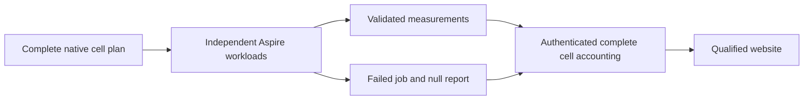

## Database job groups, 2026-10-04

REQ-BC-GROUP-001 maps to AC-BC-GROUP-001: Benchmarks exposes nine separately
named database job matrices. Each contains only its own target, three preflight
checks and all 30 canonical node/scenario workloads. Every cell retains its own
Linux runner. Database groups run concurrently with only plan/image dependencies;
steps inside each cell run in order. No shared cross-database matrix or parallelism
cap. Aggregate waits for every group and retains failed/null results.

REQ-BC-GROUP-002 maps to AC-BC-GROUP-002: readable database/node/scenario job names
must agree with authenticated job discovery, finalization, aggregation and website
receipt validation. Canonical plan schema, cell IDs, workload counts, artifacts,
measurements and topology remain unchanged. Frozen historical names remain valid
only as exact cell-name contracts in original authenticated receipts; no result
bytes are rewritten. ADR-080 owns the implementation contract.

TASK-BC-GROUP-001: root owns workflow, planner/name validators and documentation;
worker owns disjoint real planner CLI TUnit assertions. Source-only WorkflowLayout,
WorkflowBenchmarkFailure and NativeSerializationWorkflow assertions were retired
by the owner's2026-10-06 correction; retain IsolatedPlanCli operation assertions
and original GitHub execution evidence. Owner explicitly requests no tests or benchmarks for
this Actions layout task: verify YAML, JavaScript syntax, matrix inventory and diff
statically; do not dispatch workflows. Runtime/native qualification is unverified.
Backend/API/storage/transport and database tests are outside this change.

## TASK-IMAGE-LIFE-PROCESS-IDENTITY-RACE

Root freezes this narrow unit-process oracle correction on2026-10-05 after the
original full Aspire unit75g report:3247/3248 passed, with an actual Win32Exception
while reading StartTime after HasExited in AcImageLife003CancellationKillsAndReapsRealNodeProcessTree.
REQ-BC-PROCESS-IDENTITY-001 / AC-BC-PROCESS-IDENTITY-001 refine AC-IMAGE-LIFE-003:
the original PID and captured UTC start identity stay mandatory. CaptureIdentity
remains strict. A later identity observation may treat a Win32 failure as exited
only when a subsequent HasExited on that same actual Process confirms exit.
An unconfirmed/live observation preserves the original failure; a failed
confirmation retains both original errors and fatal-runtime priority. No broad
Win32-to-success handling, PID-only replacement or synthetic process is allowed.

Use one cohesive new IsolatedAggregateNodeIdentityObservation helper for the
existing support and reaper probes. Luna query_wave privately owns only those two
probe joins and that new helper. Preserve all original cancellation, process-tree
kill/reap, stdout/stderr joins, exact streams,5s cleanup and test deadlines.
The cancellation aggregate from the failed original run stays evidence; do not
remove it as presumed expected cancellation. Existing five real Node lifetime
cases provide the runtime regression. Root reviews, integrates and runs their
actual Aspire unit caller, then full normal/scalar gates as required. ADR-056
records the implementation contract. No benchmark runner, native database,
website, public contract or persisted data is changed; rollback restores the two
original probes and removes the helper. Local tests remain development evidence.

The original stage86e full-unit report retains the later genuine unconfirmed
StartTime race. Before its test-oracle repair, root freezes a readonly retry:
AssertExitedAsync may retain that original Win32Exception and observe the same
captured PID/start identity again at the existing10ms cadence until the unchanged
test deadline. An unknown observation remains pending, never false/success and
never authority to kill. Only confirmed native absence/exit or a verified
different start identity establishes that the old process exited. If no proof
arrives, rethrow the retained original failure; dual/fatal confirmation failures
remain immediate. CaptureIdentity, the kill/reaper identity checks, original
process/cancellation ownership and5s cleanup are unchanged. Root owns only the
readonly support loop; the actual five native Node cases and full suites remain
the proof, with no synthetic process or broader Win32-to-success handling.

## Accepted native Chrome session admission (2026-10-05)

The following root-reviewed contract is accepted before source integration; runtime qualification remains pending.

# Private candidate: bounded native Chrome session admission

This is an implementation contract proposal for root review. It is not joined
to the KeyLoad checkout and does not qualify or explain the original keyboard
failure.

## Feature requirement

`REQ-BC-CHROME-001`: Real Chrome work performed by one `KeyLoad.SiteTests`
process is admitted through a bounded native-session owner. At most one real
Chrome process may be active in that process. Admission is acquired before
the Chrome version probe or original browser launch and remains owned until
the real CDP socket and browser instrumentation/coverage are closed and the
same original process is observed exited. A caller cancellation while queued
withdraws that waiter with the original token. Incomplete or failed native
cleanup poisons this browser-only admission pool; it cannot free capacity for a
new launch.

## Measurable acceptance

`AC-BC-CHROME-001`: A genuine TUnit case using the workflow-provided Chrome and
BCL CDP starts one native session, starts a second session while the first
holds admission, observes that the second remains queued without launching,
cancels it and verifies cancellation retains the exact caller token and removes
that waiter. A successor session starts only after the first session's actual
coverage completion/stop, CDP socket disposal and original process exit; the
case verifies the distinct process identity and native exit observation. The
pool has capacity one, at most 64 queued sessions, and the existing 20-minute
cancellable admission bound. Existing browser assertions, page content,
coverage inventory/thresholds, commands and startup/active deadlines remain
unchanged. An unsafe/unjoined original process or teardown failure poisons the
pool and rejects queued/future sessions.

The existing keyboard-selection acceptance continues to require real ArrowUp
and Enter actions, selected value `2`, and the independent rendered-row oracle.
On a failed selection only, bounded evidence may report each actual CDP
keyDown/keyUp acknowledgement plus a post-action snapshot containing only the
active-control boolean, bounded select value and selected index. The record is
fixed-size, truncated before formatting, and MUST NOT include result rows,
projection/report bytes, query text or benchmark payload. This evidence records
the observed interaction; it does not presume the cause of CI failure.

Mapping: `REQ-BC-025` and `AC-BC-025` (real browser criteria), plus this focused
admission acceptance. New TUnit source belongs to
`tests/KeyLoad.SiteTests/Features/BenchmarkComparisons/`; no site runtime,
workflow, publication or measurement behavior changes.

# Proposed r2 amendment — identify the original queued Chrome waiter

This is a delta to the immutable private r1 candidate at
`/private/tmp/keyload-site-chrome-admission-20261005`. The r1 files and hashes
remain unchanged. The prior acceptance text requires waiter withdrawal but its
`PendingCount >= baseline` assertion cannot identify which waiter remains when
other work is queued.

## REQ-BC-CHROME-001 clarification

The admission implementation retains each actual queued waiter's original
`CancellationToken` in the existing bounded waiter node. Add a read-only,
internal membership observation over the existing pending list, performed
under its existing lock, that reports whether the exact token has a currently
queued waiter. The list is already capped at 64 waiters, so this observation is
bounded O(64), retains no additional state, does not invoke callbacks, and does
not alter admission, cancellation, FIFO, deadline, or cleanup behavior. Expose
it only through `SiteBrowserSessionAdmission`; do not expose new product/API or
log token values.

## AC-BC-CHROME-001 clarification

The genuine Chrome lifecycle case creates its unique linked cancellation token,
starts the real second Chrome session while the first native session holds its
lease, and asserts that the exact token is present in the actual admission
waiter list before cancellation. It cancels that same token, awaits the
original `OperationCanceledException`, verifies the exact original token on
that exception, then asserts that this exact token is absent from the pending
list. Preserve the existing aggregate queue-count assertions, no-start
assertion, successor queueing, and all real coverage/CDP/process lifetime
observations. This is a direct identity/removal oracle against the native
bounded queue, not a mock queue, synthetic provider, timer, or inferred count.

All existing capacity, queue, admission-deadline, Chrome process/CDP/coverage
ownership, failure behavior, keyboard assertions, evidence limits, and other
AC-BC-CHROME-001 checks remain unchanged. The test remains subject to existing
TUnit scheduling and does not serialize unrelated tests globally.

## Exact ownership and ordered stage

1. Freeze this amendment against the immutable r1 source packet before source
   edits.
2. Modify `tests/KeyLoad.SiteTests/Features/BenchmarkComparisons/Helpers/
   SiteHeavyChildAdmission.cs` only to add the bounded locked membership read
   over its original-token waiter nodes. No Node admission behavior changes.
3. Modify `.../Helpers/SiteBrowserSessionAdmission.cs` only to expose that
   observation from its browser-only pool.
4. Modify `.../Cases/SiteBrowserSessionAdmissionTests.cs` only to assert exact
   token presence before cancellation and exact absence after awaiting the
   original cancellation; retain every existing lifecycle and assertion.
5. Root reviews the cumulative r1+r2 packet and exact hashes, joins it, and owns
   the actual Aspire Site suite and native Chrome evidence. Worker performs no
   build/test/browser/Git execution.

Rollback removes the membership observer/wrapper/assertions and returns to the
r1 code. Persistence, public product behavior, workflow, Node processes and
website publication are N/A.

### Browser lease transfer at factory return

The reviewed browser session factory admits one actual browser lease before the version child, endpoint/Chrome startup and CDP/coverage setup. Its lexical `using` owns all failure paths. Immediately before a successful return it marks that same lease transferred to the returned native process owner; only the factory's scope disposal consumes this transfer marker, leaving the actual lease held until the returned owner settles its original process, CDP and HTTP resources. Existing non-browser callers never set this marker. This is an ownership-transfer marker, not a readiness, exit or coverage proof. Failed setup follows the existing resource joins and bounded pool poison rule. AC-ISO-009's real cancellation/successor/native PID regression remains the evidence; the keyboard assertion retains its exact predicate and prints only bounded observed failure diagnostics through native TUnit output.

## Independent website with optional benchmarks, 2026-10-06

Owner correction supersedes REQ/AC-BC-FAIL-020's newest failed aggregate blocking
website source publication. Website changes publish independently; ready native
metrics enrich the website, and newly ready metrics trigger another Website build.
Unavailable metrics produce no figures, catalogs, raw aggregates or invented
provenance. Existing measurement qualification remains mandatory for measured
publication. ADR-112 owns the conditional artifact and qualification boundary.

| Requirement | Acceptance | Tests / evidence |
|---|---|---|
| REQ-BC-WEB-001 independent source publication | AC-BC-WEB-001 own-main source push/manual runs website jobs without a benchmark dependency; no ready cohort yields a content-only website | static workflow graph/lint, native executor TUnit operations, genuine Website/Pages |
| REQ-BC-WEB-002 optional authenticated metrics | AC-BC-WEB-002 select newest completed own-main producer with a successful aggregate; absence is an explicit bounded `unavailable` state; corrupt selected evidence, duplicate aggregate jobs, API failures and expired/missing selected artifacts fail without silent fallback | real retained GitHub metadata selection positive/negative TUnit cases; authenticated capture |
| REQ-BC-WEB-003 accurate empty publication | AC-BC-WEB-003 explicit `--benchmarks=none` emits product/scene/SEO/vendor assets, no numeric data/catalog or measurement requests, plain empty state, source-bound publication receipt with benchmarks null | new SiteContent build/assets/browser/error cases using real Node, files and Chrome |
| REQ-BC-WEB-004 automatic refresh | AC-BC-WEB-004 completed own-main Benchmarks event authenticates actual producer and rebuilds with newest ready data; predeploy reselects and rejects changed available tuple or newly available data after a no-data qualification | workflow and native selection/freshness TUnit cases; genuine workflow_run/Pages |
| REQ-BC-WEB-005 scoped complete qualification | AC-BC-WEB-005 no-data artifact runs complete closed SiteContent tests through the same Aspire `site` entry, original TRX/no-skip checks, source/asset/vendor/Chrome and scoped native coverage thresholds; measured artifact retains full existing site/archive/numeric/browser/coverage tests | original TRX/coverage/source inventories and final build; content is never labeled full metric qualification |

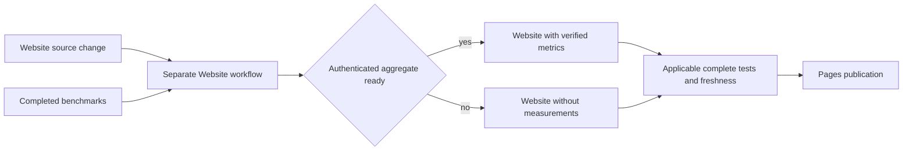

Execution graph: TASK-WEB-001 root records policy/criteria/ADR; TASK-WEB-002
selection worker owns site-isolated GitHub capture/runs selection modules and
bounded absence/freshness state; TASK-WEB-003 builder worker owns explicit
no-metrics native builder and emitted HTML; TASK-WEB-004 qualification worker
owns closed SiteContent TUnit tests and source/coverage hook scoping. Root owns
workflow/composites, shared environment/source inventory joins, final integration,
canonical Release build, format/governance, Aspire development tests and scoped
commit/push/provider verification. Workers read local policy, preserve concurrent
producer/engine work, never commit/push, and stop on contract ambiguity. Join only
after each owned artifact is reviewed. No new database topology, measurement,
dependency, DNS or release work.

TASK-WEB-002's selection regression recognizes the exact successful historical
aggregate step sequence on an unsupported source as unavailable for optional
publication. It authenticates the original run/job and every required step;
malformed inventories, failed required steps and invalid repository identities
remain errors. It never admits that source's metrics or adds its revision to the
historical allowlist. SiteUnsupportedProducerSelectionTests maps this real Node
selection/rejection/healthy follow-up flow and the actual GitHub optional-capture
child to AC-BC-WEB-002. Source review is not native site or publication evidence.

The observed native producer generation at
`c16a1d928d7d6941db74403e47f3dbcea206d86a` has five ordered owned steps:
`Verify benchmark plan`, `Download benchmark results`,
`Check all 270 benchmark results`, `Save combined benchmark results`, and
`Save GitHub result verification`. Its completed successful native wrappers are
exactly `Set up job`, `Download source code` before those steps, then
`Post Download source code`, `Complete job`. Authenticate the original run,
attempt, repository, branch, source, URL and successful aggregate job before
classifying this exact generation as unavailable. Original run37371251640
has a failed whole workflow and successful aggregate job112020779863; it
supplies no admitted archives or metrics. This source is not a historical
measurement allowlist entry. Unknown sources, failed or malformed owned/native
steps, changed order, duplicate aggregate jobs and authentication/provider errors
remain errors. The operation regressions must preserve the rejected input bytes,
restore their owned controlled copies, and prove a healthy selection of the exact
current run after each negative input. Unknown-source controls must change all
three original summary/run/job identities consistently before the real Node
operation; a mismatched identity rejection does not prove unknown-generation
classification. Root maps these cases to REQ/AC-BC-WEB-002 before integration.

Baseline: Pages settings are valid; original run37349838172 has217/270 worker
artifacts and failed aggregation. Existing website capture fails before checkout
on this unavailable producer; this cannot be converted to authenticated metrics.
Current checkout includes concurrent active implementation and unverified build
changes, preserved outside this repair. Verify static syntax/governance and
source/diff first, then final canonical build/format and Aspire-owned relevant
TUnit suites. Genuine Linux full applicable qualification and successful provider
deployment remain required before claiming publication restored.

### Standalone Website acceptance, owner correction 2026-10-06

REQ-BC-WEB-006 / AC-BC-WEB-006: expose Build and Tests, Benchmarks, Website and
Release. Build and Tests runs the complete solution build and every existing
ordinary/analyzer/scalar/recovery/Aspire RF3 test gate with no website jobs or
Benchmarks completion trigger. Website alone runs the existing qualified site
build/deployment on trusted main push/manual, including the final Benchmarks
dispatch, with no dependency on Build and Tests or successful benchmarks.
Optional metrics, rejection of invalid selected evidence and the no-data path
remain AC-BC-WEB-001..005. Native executor authentication must accept only Website
at `.github/workflows/website.yml` and reject the former CI executor.

Tests: actual TUnit native Node context operations assert accepted/rejected
executor identity and preserved context; static actionlint and parsed YAML graph
review validate delivery infrastructure without treating source-text tests as
runtime behaviour. Genuine standalone GitHub run and Pages deployment are the
required provider evidence. TASK-WEB-SEPARATE-001..005 and exact file ownership,
ordered joins, rollout/rollback and checks are in ADR-112. Out of scope: engine,
benchmark workloads, packages, product Release and DNS. Baseline: screenshot run
37464086450 failed website qualification in the combined CI graph; current shared
checkout contains unrelated uncommitted implementation. Preserve it and report
its build failures separately. Quality skills retain dotnet format, unchanged
SDK/owned analyzers and thresholds; CSharpier/third-party additions are N/A,
CRAP is unmeasured without current functional coverage.

TASK-WEB-SEPARATE-002 also repairs the observed optional selector blocker from
original Website baseline run37464086450. Authenticated Benchmarks run37328642737
(source `ce2eace916b3660a4c7fe2976a012637600c3b28`) has successful aggregate
job111915038450 with the same exact five owned steps and four successful native
wrappers frozen above for the unsupported c16 generation. Add this exact source
to that unavailable-generation contract; it supplies no admitted metrics and is
not a historical measurement allowlist entry. Keep unknown sources, changed
steps/wrappers, malformed identity and invalid selected archives rejected.
REQ/AC-BC-WEB-002 maps to real retained-metadata selection/rejection and healthy
follow-up TUnit cases, plus native optional capture in the standalone Website run.

Authenticated API review found the same complete old-format generation at these
additional source-bound producer/job identities. They share the exact frozen
five owned steps and four completed-success native wrappers; each is unavailable
for the current website rather than a newly admitted measurement source.

| Producer | Aggregate job | Original source |
|---|---|---|
| 37261761162/1 | 111661187694 | fb586bfcf05c18e79f892c5ecaf5c1092811aaf8 |
| 37303831415/1 | 111789704230 | 55fb4e3704bd30b5e57b8173953e6e017c0f8333 |
| 37292025104/1 | 111747139519 | 1e8833c027cf232e35fe012cd3eed41c61a17f89 |
| 37257873745/1 | 111632167471 | a3136fb90f7cbaaad8935fdc04984372167e6d4c |
| 37249197758/1 | 111604106769 | f8b3ba68da2f28660da1a36db396882ba2f72b7d |
| 37242346637/1 | 111579241125 | 5fa61f27a34b5c573579fca3a84b8e5201dbd82e |
| 37232926362/1 | 111546308960 | 3985008b0d360dd7e1bd9d26aae572e5e6368128 |
| 37224468826/1 | 111525368980 | 37a9da0394b7219b4fa05edd21ee41ec614e604f |
| 37215426617/1 | 111499247110 | bb16152827b38dc4533a1d7830e664b4ecd11267 |
| 37206566979/1 | 111478923031 | 377886f35928866f083806062b446056d64539e3 |
| 37192832037/1 | 111425227628 | 873cd1a36ad14ab966065c924c71a292ea681083 |

Supported immutable producer formats remain subject to all existing archive and
provenance gates when selected automatically as newest ready own-main JSON.
Explicit historical run pins and legacy incomplete-run overrides remain
validation-only. An older compatible measured revision is distinct from current
website/database source and is never proof of current database qualification.

Local Aspire content-only execution exposed an existing before-session failure:
`The authored production JavaScript inventory differs from the frozen site and
evidence-tool sets.` No content test executed; the resulting 13 failures are
startup failures, not behavioural test results. TASK-WEB-SEPARATE-005 must repair
the mode-aware inventory validation without excluding authored sources or lowering
coverage thresholds, then repeat the complete content-only entry. This maps to
AC-BC-WEB-005 and precedes any deployment claim.

The inventory root cause is the `scaled-cohort-` prefix including the producer-only
`scaled-cohort-aggregate-cli.mjs` entry. That standalone Benchmarks CLI is absent
from the actual 84-file Website executed dependency closure and never executes
in Website. Exclude only that exact entry from website evidence-module discovery;
retain its producer ownership, all actual website imports, the complete closed
feature/evidence inventories and existing 80/70/90 thresholds. Both measured and
content-only source inventory validation use this corrected ownership boundary.
Full content-suite startup and actual manifest/coverage receipts are the regression
proof for this existing setup failure; source review alone is not a pass.

AC-BC-WEB-003/005's complete no-data browser flow also verifies real native menu
opening, link/viewport-change closure and denied clipboard-write fallback. It
does not substitute clipboard APIs or write the user's clipboard. Explicit
desktop/mobile viewports keep poster assertions independent of Chrome defaults;
the lazy scene request is required after hero navigation rather than before it.
The unsafe-output case targets the actual protected `site/` source directory.
The content browser checks the complete manifest for the current session mode so
the same cases can participate in both content-only and full measured suites.
SiteWebsiteExecutorAdmissionTests and SiteUnavailableProducerGenerationTests are
pipeline metadata cases in the full measured qualification group, alongside the
existing native provenance cases and their complete source/critical90 inventory.
They do not belong to the closed `SiteContent*` artifact/browser group, which
retains its original eight executed sources and all five original cases. No native
receipt is ignored and no threshold is reduced. Both groups remain in the full
measured suite. Extend the mandatory Aspire-owned SiteOptionalBenchmarkSelectionTests
with actual native Website admission and CI/wrong-path rejection cases, including
unchanged inputs and a healthy follow-up. These run on every Website, with or
without metrics, alongside optional ready/absent selection. Genuine provider
admission and freshness remain mandatory in both modes.

Development verification of the joined standalone source: final canonical Release
solution build passed with zero warnings/errors; the actual Aspire-owned unit
selection/admission gate passed21/21 and closed content artifact/browser gate
passed5/5 with native line93/branch78, builder critical96 and bootstrap critical92.
No skips or reduced thresholds. Scoped SiteTests/unit-change format, workflow
syntax/graph, governance and diff checks passed. The shared canonical format check
still reports unrelated BackupRestore `AtomicPartitionRosterFixture.cs:134`
whitespace. Linux delivered-source qualification and Pages remain pending; these
local development receipts are not provider or current database qualification.

First standalone source `6c20cf4f` run37480759611 confirmed the independent
Website graph but failed optional capture at another original old-generation
successful aggregate: run37261761162/1 (#82), job111661187694, sourcefb586bfc.
Its original retained steps/wrappers match the same exact unsupported contract.
Extend only the source-bound generation inventory and preserve the original
metadata as a native selection regression. Audit the remaining original producer
inventory before the next publication attempt; no provider pass is claimed.

The authenticated audit is complete through the first compatible legacy cohort
run37184989107/1 (#53), source73aebfd3f72695357834599e813aba77b9e274ad.
The thirteen exact unavailable source generations above and in the earlier c16/ce2
contracts retain identical successful owned/native steps. Skipped jobs without
steps and cancelled runs do not become unavailable-generation pins. The compatible
cohort remains subject to original archive, source, provenance and freshness
qualification; API artifact availability alone does not qualify publication.

Standalone sourcef2dd44e5 run37482351429 successfully captured the compatible
original cohort and its archives. Its source/tool gate then rejected the unchanged
84-entry dependency closure because the composite still required83 entries.
Align that exact frozen count with the existing complete manifest, retaining byte
comparison, sorted uniqueness, regular-path and per-file hash checks. This is a
static workflow contract repair under AC-BC-WEB-004/005; no file or coverage source
is removed and no provider pass is claimed until the next genuine run succeeds.

### Final Benchmarks trigger, owner clarification 2026-10-06

REQ-BC-WEB-007 / AC-BC-WEB-007: the final Benchmarks job only dispatches the
separate Website workflow on main after aggregation dependencies settle. It runs
on trusted own-main push/manual even when benchmark checks or aggregation fail,
and never builds/tests/deploys the website. Scope `actions: write` to that job;
retain read-only database jobs and unchanged workloads. Website uses only push
and workflow_dispatch events, with its independent source publication intact.

Dispatch supplies only an optional `benchmark_run_id` for completion waiting.
Website authenticates the actual original run's repository, branch, workflow
name/path, event and source through GitHub; bounded waiting resolves the race
between dispatch and producer completion before newest-ready selection. Reject
invalid/foreign metadata and timeout, preserve failure/absence handling and
source/tuple freshness. The input never selects metric authority or replaces
archive provenance. Empty manual input needs no producer wait. Existing native
TUnit executor operations cover manual admission and retired executor-event
rejection, unchanged inputs and a healthy follow-up. Static actionlint and YAML
graph review verify infrastructure; a genuine final dispatch and separate
workflow_dispatch Website/Pages run supply provider evidence. Ordered tasks and
ownership are in ADR-112 TASK-WEB-TRIGGER-001..003.
