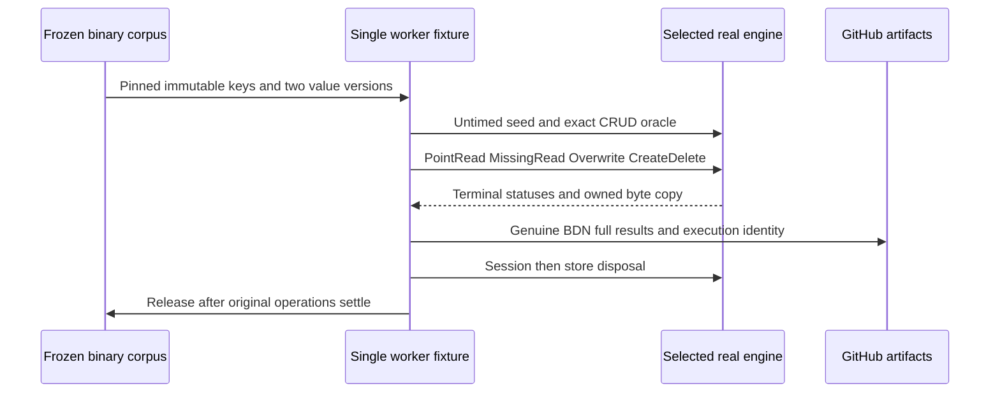

# Garnet storage evaluation

Canonical slice: BenchmarkComparisons. ADR: [ADR-066](../../ADR/ADR-066-garnet-storage-evaluation.md). Owner instruction2026-10-03 asks genuine Garnet versus ZoneTree performance tests and measured selection or composition. Native qualification is pending; no winner or product storage change is established.

The subsequent owner clarification permits local development tests and BenchmarkDotNet runs. Earlier no-local execution wording is superseded for those checks; local evidence must identify its actual machine/source/settings and separate engine processes/sessions. Public website/global measurements retain the authenticated GitHub-only provenance gate. Local results cannot establish global service/RF3/fault qualification.

## Requirements and acceptance

| Requirement | Acceptance | Observable contract and evidence |
| --- | --- | --- |
| REQ-GE-001 | AC-GE-001 | Published pinned public engines only; preserve authoritative product ZoneTree/RF3 and current270 service cells. Package/source/diff review exception plus enabled build. |
| REQ-GE-002 | AC-GE-002 | Both real engines exact32/1024-byte binary seed/hit/miss/overwrite/delete/redelete/recreate at first/last records. TUnit normal/scalar. |
| REQ-GE-003 | AC-GE-003 | Invalid inputs fail before acquisition; immutable actually pinned keys, bounded retained corpus/output,65536-write cap including seed, disposed operations fail and close repeats safely. TUnit boundaries plus vendor lifetime review; unobserved fault/pending paths remain open. |
| REQ-GE-004 | AC-GE-004 | Genuine public unsealed generated BDN fixture and four methods; metadata and real fixture TUnit; native generated runner. Dry means execution only. |
| REQ-GE-005 | AC-GE-005 | Two isolated Linux jobs, one engine per process, identical inputs/iterations, actual settings/runtime/source/package/run identity and complete raw BDN JSON/CSV/stdout. Missing/failed cells fail. No local execution. |
| REQ-GE-006 | AC-GE-006 | Explicit raw cache/service/durability/cluster distinction, open later experiments and no universal winner or migration from source/Dry alone. Review exception requires authentic matched artifacts before any selection. |

## Frozen GE001 API and resource contract

Internal enum RawStorageEngineKind has ZoneTree and Tsavorite. RawStorageCorpus(recordCount,valueBytes) retains RecordCount, ValueBytes and immutable Memory<byte> Key(index)/Value(index,alternate) data. Fixed16-byte keys are genuinely pinned managed arrays and include deterministic seed1729 plus index; no mutable input buffer reuse. Record count1..4096; payload32 or1024 bytes; count/count+1 are reserved missing/transient indices. Two versions contain deterministic binary NUL/high-byte data.

The16-byte key stores little-endian UInt64 seed1729 at offset0 and UInt64 index at offset8. Value byte0 is unchecked byte(1729+index+(alternate?13:0)), byte1 is0x5A/0xA5 for original/alternate, byte2 is0, byte3 is255; remaining offset j is unchecked byte(1729+index*31+j*17+(alternate?13:0)). Independent corpus assertions and pre-mutation snapshots are the byte oracle.

RawStorageFixture(kind,recordCount,valueBytes,maximumWrites=65536) owns Corpus, nullable Directory, bool TryRead(index,out ReadOnlyMemory<byte>), Upsert(index,alternate=false), bool Delete(index), Dispose. Each instance is single-worker/non-concurrent, with one genuine Tsavorite session where applicable. Returned read view is owned scratch, valid until its next read. Both engines copy once. All attempted writes, including initial seed, consume a non-resettable bounded quota1..65536; reject quota below seed count. Invalid kind/corpus/quota/index and disposed operations fail explicitly, never silently reinterpret input.

ZoneTree1.9.8 raw factory uses native WAL None and real byte comparer/serializer/tombstone semantics; no KeyLoad journal or product wrapper. It may create untimed metadata in its own directory and must close before deleting that directory. Tsavorite uses published Microsoft.Garnet2.2.0, public StoreFunctions/SpanByteAllocator/FixedSpanByteKey/PinnedSpanByte/SpanByteAndMemory/SpanByteFunctions<long>, KVSettings(baseDir:null), no checkpoint/read cache/recovery/AOF, explicit4MiB index/1MiB page/128MiB log and segment/0.9 mutable fraction. No private Garnet factory/reflection/copied bridge, permanent epoch or fabricated long-key generic API.

Reads/writes must be terminal, non-fault/non-cancelled and byte-correct. Unexpected pending/eviction fails the diagnostic; original owners remain until actual settlement/close. Session close precedes output owner; store close precedes settings/device. The vendor synchronous session-close API has no proven finite cancellation contract. Native job/process timeout is a final bound, and unobserved constructor/pending/close faults remain explicit gaps.

Both fixtures retain one genuinely pinned GC.AllocateArray<byte>(valueBytes,pinned:true) scratch array. Returned memory slices that array, with exactly one native read copy and no ToArray allocation. Tsavorite's retained SpanByteAndMemory.FromPinnedSpan points to that already-pinned array; owner/corpus stay alive through original native call and close, and unexpected heap output/pending state fails without releasing live owners. Raw ZoneTree represents deletion as empty Memory<byte>; binary values are always nonempty, so a first-byte tombstone marker is forbidden.

RawStorageBenchmarks is public/unsealed with XML solely for BDN's real generated consumer. One selected KEYLOAD_RAW_STORAGE_ENGINE (zonetree/tsavorite) per process; unset defaults zonetree for metadata compatibility, unsupported values fail. Params payload32/1024,4096 records; MemoryDiagnoser; .NET10 one launch/3warmups/5iterations,1024invocations/unroll1. PointRead, MissingRead, Overwrite alternating immutable versions and CreateDelete transient pair (OperationsPerInvoke2) preserve caller-visible result oracles. No per-call input allocations or hidden reseeding. BDN iteration statistics are not request percentiles.

Public parameter properties are Engine string (exact ordinal lowercase label), PayloadBytes int and RecordCount int; Engines is the one-label ParamsSource. Setup/Cleanup/Dispose are public. PointRead returns the actual first output byte and fails on an unexpected miss; MissingRead returns the actual found flag (false on its expected miss); Overwrite is void; CreateDelete returns the actual successful deletion flag. Selection tests use explicit fixture properties without changing process environment.

PointRead/Overwrite use hot seeded record0; this first diagnostic is explicitly not a random/full-keyspace workload. All timed methods reject actual disposal with ObjectDisposedException. Metadata conversion adds no second Dry job to the declared native job; an invalid upper index is count+2, beyond both valid reserved keys.

CRUD uses64records so index63's original first byte is zero. Both reserved indices are valid, unseeded and have immutable values. No-op deletes consume the same monotonic write quota.

## Native pipeline selection and report gate

Benchmarks has optional boolean workflow_dispatch input raw_storage_only defaultfalse. Normal push/default dispatch preserves the270 service jobs. True uses a separate concurrency suffix and bypasses service image/plan dependencies, so no service/site result is published; skipped service jobs are not qualified. Full source build and a separate normal/scalar TUnit raw-correctness job precede the two engine jobs. The NEW RawStorageEvaluation composite action checks closed correctness/benchmark modes, retains source/package/settings/runtime/job evidence and original generated-runner stdout/JSON/CSV. One selected engine occupies each measured runner/process.

Require exactly one canonical BDN full JSON with8unique4method×2payload cells, exact engine/count, actual Memory/allocation data and five finite positive Workload/Actual rows and exactly Statistics.N Workload/Result rows per cell. Missing/null/error/extra/duplicate cells fail. Statistics.N may be reduced by native outlier filtering; it must be positive and match its retained original values, while actual raw rows establish completeness. No invented request percentiles or synthetic measurement publishes. TUnit source contract tests exercise the actual workflow isolation/selection/retention/strict-gate structure; actual native reports exercise its acceptance gate. Root authenticates provider run/jobs/artifacts before using any values.

NEW raw-storage-report.mjs exports pure validateReport(report,engine), with no I/O or result fabrication. It enforces exactly8closed parameter/method/type tuples, BDN0.15.8/.NET10, nonnull positive finite Statistics N1..5 and original values/Mean/Median, actual nonnegative Memory allocation with positive operation count, and5Workload/Actual rows plus exactly Statistics.N Workload/Result rows, each with unique iterations and a common launch/positive finite timing and operations. Typed TUnit tests invoke the real module in a bounded Node process against controlled parser inputs for success and missing/extra/duplicate/identity/statistics/memory/raw-row failures. These are schema vectors, never engine measurements or producer receipts. The action declares a V8 output directory, but the shared isolated Node process clears inherited environment except PATH; native V8 collection is therefore not connected yet. Numeric coverage thresholds remain open until a real collector and original coverage evidence are qualified. Root-owned raw-storage-evidence.mjs separately binds original files to actual GitHub executor and published package bytes in prepare/verify modes, without rewriting data.

## Slice ownership, tests and implementation stages

Backend/contracts: N/A because production storage/operations are unchanged. Frontend: N/A until independently qualified measurements have their own presentation contract; raw data is not merged into current270/site. Infrastructure: additive two-engine matrix inside benchmarks.yml. Helpers/fixture: NEW RawStorage-prefixed files under benchmarks/KeyLoad.BenchmarkScenarios/Features/BenchmarkComparisons/. Tests: matching NEW RawStorage-prefixed real TUnit files under tests/KeyLoad.UnitTests/Features/BenchmarkComparisons/. Root owns central pin/reference/friend, workflow/docs/status/Git/native evidence. Existing EmbeddedBenchmarks is preserved.

TASK-GE001-P freezes contracts/source pins/task graph; TASK-GE001-T test-first authoring is disjoint; TASK-GE001-E starts after root reviews tests; TASK-GE001-R independently reviews exact combined source; TASK-GE001-I joins source/shared refs/jobs, full source gates and all-scope main delivery; TASK-GE001-N qualifies exact-source Actions and records raw artifacts. Root approval applies to GE001 diagnostic scope. Detailed task graph and traceability are in the root working acceptance/plan; workers cannot invent architecture/API or weaken policy.

Full normal/scalar UnitTests exercise all criteria's real engine flows; actual Benchmarks jobs exercise generated consumers. Exact command: dotnet test --project tests/KeyLoad.UnitTests --no-build --no-restore --configuration Release in CI (and DOTNET_EnableHWIntrinsic=0 scalar). Build and formatter/governance are source gates. Actual workflow run/job/SHA/artifacts are required, no skipped suite or missing raw cell passes. Coverage thresholds remain required and unqualified until actual collector evidence exists. Package/source audit, fault limitations and final architectural selection are explicit review/manual evidence, not fabricated automated performance assertions.

## Required subsequent stages

Evaluate full Garnet RESP and public service commands separately with actual AOF commit/ACK/restart tests. Compare ordered scans, transaction/fault boundaries and native replica behavior against matching product contracts. Run representative multi-worker sessions,1/2/3 real nodes and later multi-host tests with actual CPU/RSS/allocations/latency/backlog. A disposable Garnet/Tsavorite cache above authoritative ZoneTree requires its own authorization/read-cut/invalidation/movement/bound/fault ADR. No source result proves universal performance leadership, production readiness or power-loss durability.

Observed native exporter correction2026-10-03: the real local BDN0.15.8 full report contains five Workload/Actual rows but only four Workload/Result rows when one outlier is removed. AC-GE-005 now validates five actual iterations and N retained result iterations separately; it must reject incomplete actual iterations, inconsistent retained counts and invalid stage identity. This corrects report semantics without changing measured values or publishing local evidence.

AC-GE-004 configuration correction before implementation: keep the default genuine job at one launch/3warmups/5iterations/1024invocations/unroll1, but set invocationCount in SimpleJob rather than an InvocationCount mutator attribute. The latter overrode the genuine CLI read-only duration override in the observed generated consumer. Metadata tests must assert unchanged default invocation/unroll settings; a real local read-only generated runner must show its requested1048576operations in actual job/rows before describing a long measurement. The frozen write quota and eight-cell GitHub lane remain unchanged. CLI-modified read-only reports are separate development diagnostics.

Local read duration refinement: the supported unroll-only ManualConfig and SimpleJob invocation default now produce genuine1048576-operation rows. Point-read iterations satisfy the100ms guidance, but missing-read iterations still warn at27ms. Root will compare both engines sequentially at4194304invocations/8warmups/10iterations, preserving4closed read-only cells and every original report separately. This is bounded development measurement, not the frozen8-cell/5iteration GitHub evidence contract or fault qualification.

Coverage join finding: NODE_V8_COVERAGE declared on the action does not reach the shared isolated Node child because its environment whitelist retains only PATH. Do not describe this as collected coverage or a passing numeric gate. Collector ownership and actual threshold evidence remain required/open.
