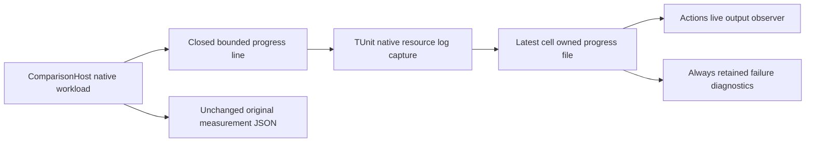

# Live benchmark progress

Status: Accepted repair contract; runtime verification pending.
Parent: [BenchmarkComparisons](../BenchmarkComparisons.md).
Decision: [ADR-085](../../ADR/ADR-085-live-benchmark-progress.md).

The original [Benchmarks run 37202347845](https://github.com/managedcode/KeyLoad/actions/runs/37202347845)
measured source `15ea5030`. Its KeyLoad VectorExact steps ran 39–54 minutes before cancellation without workload progress
in Actions. ComparisonHost stdout was retained only at TUnit teardown, and the
Aspire CLI did not relay AppHost stdout into the job. Cancellation artifacts did
not retain the workload phase. This repair owns benchmark observability, not the
concurrent database execution implementation.

| Requirement | Acceptance | Automated proof |
|---|---|---|
| REQ-BC-LIVE-001 visible real progress | AC-BC-LIVE-001 report oracle, initialization, warmup, mutation preparation, measurement and validation transitions; emit a bounded heartbeat at most every 30s while active. Measurement counts represent actually settled attempts, with failures separate; initialization totals may remain unavailable. No fabricated throughput, ETA or success from progress | real ComparisonRunner regression and live child/relay tests |
| REQ-BC-LIVE-002 privacy and resource bounds | AC-BC-LIVE-002 emit only a fixed marker, closed phase, nonnegative repetition/count/elapsed values; lines at most 512 characters, no credentials, document content, endpoint, error text or arbitrary target names. Capture removes only the pinned native Aspire UTC timestamp prefix before validating the entire marker. Keep one latest snapshot, not an unbounded queue; logging exceptions cannot replace the original workload outcome | positive/negative parser and real file/process tests |
| REQ-BC-LIVE-003 cancellation evidence | AC-BC-LIVE-003 persist the latest accepted snapshot under the cell-owned failures directory while the test is running. Actions relays that file independently of TUnit/CLI buffering; always-upload teardown retains it after cancellation. Stop and join every progress observer, preserve native AppHost exit and signal cancellation to owned process group | genuine process exit/cancellation regressions; delivered Linux cancellation artifact |
| REQ-BC-LIVE-004 unchanged measurement | AC-BC-LIVE-004 retain exact vector semantics, corpus, repetitions, concurrency, per-operation deadlines, real clients, Docker/Aspire topology and report/provenance contracts. Oracle preparation checks caller cancellation before each bounded operation. Progress must not become website performance evidence | existing corpus/selection/report checks, real runner cancellation test and source review |

Slice map: Comparisons owns the observer/phase accounting; ComparisonTests owns
native log capture and durable latest snapshot; scripts/BenchmarkComparisons owns
the real process/output relay; benchmarks.yml is the root-owned workload join,
and ci.yml independently runs focused native logger/parser/file regressions.
Database API, SDK/MCP, stored state, GUI and website metrics: N/A, unchanged.

Task graph: TASK-BC-LIVE-CONTRACT(root) -> TASK-BC-LIVE-RUNNER(workerA) and
TASK-BC-LIVE-CAPTURE(workerB) -> TASK-BC-LIVE-ENTRY(root) ->
TASK-BC-LIVE-VERIFY(root). Workers have disjoint source/test ownership. Root alone
owns shared docs, policy, workflow, build, integration, commit and delivery.
Baseline failures remain ResourceExhausted at 100000 unconsumed outbox records,
and multi-node OwnershipLost/internal replica RPC timeouts. Engine repair belongs
to its existing owning task; progress changes do not make these failures pass.

Verification: Release solution build, Aspire-owned focused unit/comparison
regressions, formatter/governance, then delivered-source CI and native Benchmarks.
Real Docker/RF3/recovery and mandatory endurance/scale gates stay pending until
their genuine runs complete. The existing profile of 4096 documents and 50000 attempts is a
control workload, not 100k/1m/5m dataset qualification. Original-job times are not
request latency metrics.

Development checkpoint, 2026-10-04: repository governance, Node source parsing,
scoped formatter and diff whitespace checks pass. Comparisons and ComparisonHost compiled in the
Release solution build; the complete build and complete formatter are blocked by
concurrent Orleans/CQRS changes in the shared checkout. Focused Aspire/TUnit
runtime evidence remains pending. A source checkpoint is not a passing build,
runtime, RF3 or performance qualification.

Delivered checkpoint: source `31dd7ea` passed Linux build, complete formatter,
governance and analyzers. Its original unit artifact from [run 37210941065](https://github.com/managedcode/KeyLoad/actions/runs/37210941065)
has 2992/2999 passed: seven phase/observer regressions passed; five Node entry
fixtures lacked explicit module mode, the workflow filter inventory missed the
new capture filter, and an existing cache receipt acceptance regression failed.
The [run 37212016437](https://github.com/managedcode/KeyLoad/actions/runs/37212016437)
capture artifact has 28/29 passed: native logger capture rejected Aspire's UTC
timestamp prefix. These failures are retained as evidence; the timestamp, module
mode and filter inventory corrections require another genuine Linux run. An
evaluated Node import must not trigger the script's production entry merely
because its first argument contains the module path; the real child regressions
also verify this boundary. Full
unit/scalar, recovery, RF3 and complete native workload gates are not qualified.
