# Comparable native database benchmark methodology

Status: accepted implementation contract, 2026-10-09. Canonical slice: BenchmarkComparisons. [ADR-122](../../ADR/ADR-122-native-benchmark-methodology.md) owns execution and topology changes. This specification supersedes every active two-node comparison inventory; immutable original measurements keep their historical identity.

## Sources and interpretation

[BenchmarkDotNet execution](https://benchmarkdotnet.org/articles/guides/how-it-works.html) separates setup, warmup and measurement; [good practices](https://benchmarkdotnet.org/articles/guides/good-practices.html) require Release execution and avoidance of competing work. Record count is independent of iteration count. BDN remains the tool for isolated SIMD, serialization and allocation controls; distributed database measurements use the existing native TUnit client runner and Aspire-owned topology.

The original [YCSB paper](https://doi.org/10.1145/1807128.1807152) and [canonical workloads](https://github.com/brianfrankcooper/YCSB/wiki/Core-Workloads) motivate read/update ratios 50/50 and 95/5. Our deterministic CRUD/delete schedule is a KeyLoad workload, not a claim of YCSB conformance. [Redis benchmarking](https://redis.io/docs/latest/operate/oss_and_stack/management/optimization/benchmarks/) explains why independent client connections and pipelining must be declared separately.

[PostgreSQL pgbench](https://www.postgresql.org/docs/current/pgbench.html) motivates independent repetitions, sufficiently long runs, explicit client bottleneck checks and scheduled-arrival latency. [HdrHistogram](https://github.com/HdrHistogram/HdrHistogram) documents coordinated omission: closed-loop throughput cannot establish offered-load tail behavior. [PostgreSQL WAL settings](https://www.postgresql.org/docs/current/runtime-config-wal.html) distinguish local commit, remote durable flush and remote apply. Equal node count alone does not establish equal durability.

[BDN diagnosers](https://benchmarkdotnet.org/articles/configs/diagnosers.html) explain separate diagnostic runs; managed client allocations cannot stand in for server RAM. [GitHub artifact API](https://docs.github.com/en/rest/actions/artifacts?apiVersion=2022-11-28) supplies original artifact digests and workflow/source identity. The policy choices below (three repetitions, exact schedules and bounds) are KeyLoad decisions informed by these sources, not guarantees attributed to the sources.

## One cell and its ownership

```mermaid
flowchart LR
    plan[Canonical workload and native 1 or 3 nodes] --> ready[Aspire readiness and observed membership]
    ready --> warmup[Excluded warmup in its owned namespace]
    warmup --> setup[Fresh measured namespace, deterministic corpus and full verification]
    setup --> measure[One scenario, bounded real clients and exact accounting]
    measure --> verify[Complete native readback and expected-state digest]
    verify --> cleanup[Join original calls and dispose all owned resources]
    cleanup --> original[Original source/run/job-bound JSON]
    original --> aggregate[Authenticate complete cohort before comparison]
```

Every database/scenario/profile/native-node-count cell owns one Linux runner, genuine native topology, storage volumes and load generator. Only one native TUnit test executes in that runner. Native selection uses the documented [TUnit tree filters](https://tunit.dev/docs/execution/test-filters/) and explicitly excludes the HeavyLoad category from the ordinary RF3 suite. Independent jobs may overlap. Ordinary functional concurrency remains 20, up to 50 only with evidence. Heavy functional ingestion plus concurrent reads runs exclusively and contributes neither published timings nor coverage totals. The document cohort waits for that case and validates its authenticated job, original artifact/archive, native TRX result and source-bound image receipts before qualification; a failed, missing, skipped or changed result fails the new cohort. Existing historical/control publication contracts remain separately explicit.

Heavy-load admission requires the explicit enabled setting, the exact native class filter and one-test parallelism, with coverage disabled. An ordinary explicit broad filter which includes the heavy class must fail before its RF3 resources are acquired. Preserve supplied filter identities for task acceptance; a caller marker alone cannot authorize the native heavy test. Negative admission controls cover missing/false enabled settings, broad or duplicate filters, parallel execution and coverage.

Only native one-node and three-node configurations are accepted before acquisition. RF3 remains the KeyLoad production topology; the benchmark one-node arm is explicitly RF1. Unsupported community topology or native operation remains an explicit unavailable cell with null numeric output. A shared list of scenarios is dispatched to every database; adapters do not substitute cheaper operations. Specialized vector, graph, queue, stream, time-series, range/index and complex-query families retain their independent capability and accuracy contracts. Missing native equivalents stay unavailable, never counted as zero latency.

## Document family and deterministic schedules

The new `document-v1` family extends the existing native adapters and execution owner. Its sole machine inventory is `benchmarks/KeyLoad.Comparisons/Features/BenchmarkComparisons/Documents/document-contract.json`, embedded in C# and consumed by CI. The website's exact 84-path source closure includes this inventory; QualifySite admits that exact regular path alongside the existing isolated contract while retaining all source comparisons, realpath checks and hashes. Active initial datasets are exactly 100,000 and 1,000,000 records; each ordinary scenario performs exactly 100,000 measured operations and three complete repetitions with fresh isolated logical namespaces on the cell's native servers. Server journals and maintenance history may persist across repetitions; this is not a physical-storage reset or a cold-cache claim. Records are lazily regenerated from seed 1729 with the existing 1,024-byte corpus contract. Work is closed-loop, one outstanding original request per actual independently owned client, no pipelining or batching. Ordinary cells use 16 clients; ingestion cells use 1, 10 or 500 clients.

| Scenario | Exact measured schedule | Expected state |
|---|---|---|
| SequentialRead | 100,000 reads in identity order, wrapping only after N | unchanged exact corpus |
| RandomRead | deterministic seed-bound permutation reads | unchanged exact corpus |
| Create | 100,000 distinct identities above initial N | initial N plus 100,000 |
| Update | replace first 100,000 initial identities once | N, exact replacement content |
| Delete | delete first 100,000 initial identities once | N minus 100,000 |
| ReadUpdate50 | exact 50% reads, 50% unique updates | N; reads and updates use disjoint identity lanes |
| ReadUpdate95 | exact 95% reads, 5% unique updates | N; reads and updates use disjoint identity lanes |
| MixedCrud | exact 25% each read/create/update/delete | N; four disjoint lanes, each mutation identity used once |
| Ingest | empty configured document namespace; exactly 1,000,000 distinct creates | exactly 1,000,000 stored records |

Mutation warmup uses disjoint identities and restores/removes them before initial-state verification; it cannot consume measured IDs or leak extra rows. No selected operation verifies itself by issuing extra hidden reads inside the measured duration: write success is the actual native acknowledgement, reads validate the returned content, and final mutation verification is excluded from timings. Existing adapter ACK validation stays required. Per-operation latency describes the stated end-to-end public operation; any retained verification read is explicitly declared and cannot compare to a single-operation cell.

For ingestion each client owns a disjoint range: 1,000,000 / 100,000 / 2,000 records respectively at 1 / 10 / 500 clients. A common start barrier follows actual native-client admission; the report records requested and opened clients, peak original in-flight requests, attempts, acknowledged, failed, canceled and unfinished counts. It must not infer connections from wrapper count. Exact full readback independently enumerates actual stored IDs, detects extras/missing/duplicate records, checks every canonical body and computes the expected and actual digest. No retained million-element payload/task table is permitted.

For mixed workloads the initial corpus, added records, deleted records and final live cardinality are separate fields. Reads use stable identities so mutations cannot introduce schedule-dependent expected content. This revision-1 contract does not claim hot-key read-modify-write or transactional conflict behavior.

## Timing, statistics and resource bounds

Record setup/readiness, corpus load, index-build/settlement, warmup, measured duration, final verification and cleanup independently. Preserve all three repetitions; never pick a best run. Aggregate throughput with run counts and variation, not by averaging percentile values. Report p50/p95/p99/max and a bounded full-count histogram with its resolution and overflow policy; a bounded diagnostic sample alone does not establish exact tails. Original operation outcomes form the denominator, including errors. A failed correctness/readback, admission, timeout, unfinished call or cleanup makes that repetition unqualified.

Load and explicit native index creation/settlement are timed within excluded setup. When a document adapter has no separate index-build operation, `indexBuildApplicable=false` and the known N/A duration is zero; intrinsic index maintenance during insertion remains part of native load/write cost. Missing instrumentation is null and blocks qualification. Final replica settlement occurs after the complete primary oracle and is excluded from measured time. Client resources are recorded for each repetition; the source-bound server sidecar retains per-node and aggregate observations for the entire cell.

Document deployment explicitly admits 500 clients with bounded native PostgreSQL connections and KeyLoad HTTP admission of 512. The PostgreSQL source pool reserves one additional connection for excluded final WAL/replica verification, so 500 held workload connections cannot block the proof. KeyLoad full readback permits 1,100,000 records and 2 GiB of query reads, with snapshot threshold 2,000,000 declared for this document family. Effective CPU/RAM and native ACK contracts retain their existing source-bound resource evidence. KeyLoad's public API has no namespace-drop operation: excluded cleanup uses bounded acknowledged delete batches with a 20-minute deadline, then Aspire removes the owned servers and volumes at cell shutdown. Cleanup timeout remains a failed qualification; retained journal history cannot be presented as reclaimed physical storage.

The existing fixed-rate open-loop family records scheduled time, actual start and completion, admission rejections and unfinished calls under its frozen drain horizon. The new document family does not claim open-loop qualification from a closed-loop run. Sustained multi-minute/endurance and fault results remain distinct gates; 100,000 operations alone does not prove long-run stability.

Declare server and client CPU/RAM limits, actual machine and Linux image, disk/filesystem, network, native image/version, caches, background maintenance, index settings, read consistency and effective ACK/durability. Observe actual membership and data copies. Record per-node and aggregate server resource use separately from client CPU, allocation and working set. Unequal ACK or resource settings prohibit a winner comparison even if each cell succeeds. Three-node majority remains two acknowledgements; removing two-node topology does not change quorum arithmetic.

Cancellation stops admission, cancels original operations, joins their completion and only then disposes native clients/target resources. Preserve the first failure and any cleanup failure. After workload settlement the host uses a fresh bounded evidence-write token to retain the failed original; it does not resume canceled work. A timeout wrapper may not abandon actual operations. All machine bounds are named and operational values use the existing typed options.

## Requirements, acceptance and task traceability

| Requirement | Acceptance and automated evidence | Task |
|---|---|---|
| REQ-METH-001: primary-source methodology, common native 1/3 inventory | AC-METH-001: C#/JS selectors reject 2 before resource acquisition; all pure/mixed scenarios are dispatched unchanged to all targets; exact planner/cohort tests verify completeness and unsupported dispositions | TASK-METH-TOPOLOGY |
| REQ-METH-002: pure and mixed actual-scale execution | AC-METH-002: native runner performs the exact schedules above, real calls and three fresh repetitions; literal oracle, native mutation/readback and cancellation tests reject wrong content, missing/extra IDs and incorrect ratios | TASK-METH-DOCUMENTS |
| REQ-METH-003: one million real creates at 1/10/500 clients | AC-METH-003: configure-only native admission, independent client ownership, common start and joined shutdown; actual native load asserts exactly one million acknowledged and stored records per repetition; no upfront seeding is counted | TASK-METH-INGESTION |
| REQ-METH-004: honest original statistics and qualification | AC-METH-004: full-count bounded histogram, phase/count/client evidence and complete readback in original JSON; validation rejects failed or unjoined runs; source/run/attempt/job identity and all outputs retained by CI; qualification also requires the successful same-source exclusive RF3 load job, its original native passed-test TRX and matching authenticated image receipts | TASK-METH-EVIDENCE |
| REQ-METH-005: exclusive functional load while operating | AC-METH-005: `HeavyDocumentLoadAdmissionTests` checks 14 missing/disabled/broad/parallel/covered and healthy native admissions before resource acquisition; `HeavyDocumentLoadRf3Tests` runs Aspire RF3 native SDK plus official MCP ingestion alongside reads/queries, verifies acknowledged final state, joins originals and shuts down every resource; separate exclusive CI case has no publication/coverage attribution | TASK-METH-STRESS |

Public product API and persisted storage format: N/A, existing public operations unchanged. SDK/MCP product schemas and native RF3 durability are unchanged. Frontend: current authenticated families retain their gates; new document-family measurements need exact admission before rendering. Dependencies: N/A, no package changes. Native unsupported operation/topology is an explicit automatic test disposition, not a skip in a required qualification suite.

Owner correction on 2026-10-09 requires all further benchmark-stage builds, checks, tests and workloads in GitHub Actions. Earlier local development failures remain history; they cannot qualify the delivered source. Authentic exact-source Linux workflow outputs close database qualification. This document is not execution evidence. Implementation and delivery status live in `docs/implementation/status.json` and README; no measured performance winner, power-loss or production-readiness claim follows from authored tests.
