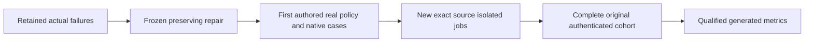

# BenchmarkComparisons native gate repair

Status: Accepted AC001 and AC002 stage A contracts; reviewed source implemented,
exact-source GitHub qualification pending.
[ADR-068](../../ADR/ADR-068-native-benchmark-gate-repair.md) owns stages, exact paths,
root/worker permissions, bounds, rollback and join conditions. All parent
BenchmarkComparisons guarantees,1/2/3node cells and270scenario scope remain.

|Requirement|Acceptance and test trace|
|---|---|
|REQ-NGR-001 fresh executing-job authority|AC-NGR-001 / TASK-NGR-G1: exact same-ID authenticated metadata, up to3captures/1000ms, all identity/running checks preserved. First-author real-provider-data policy regressions plus actual GitHub startup. Stale queued/exhausted/mismatched/terminal/error authority rejects before any database/timing.|
|REQ-NGR-002 exact Kurrent event preservation|AC-NGR-002 / TASK-NGR-R2/K1: source-contract freeze then genuine SDK original/custom/system metadata equality and unchanged55,378owned-stream/foreign/cleanup proof on1/2/3. Implementation pending; hard-coded empty assumption is not a valid completeness oracle.|
|REQ-NGR-003 actual native leader routing|AC-NGR-003 / TASK-NGR-R2/K1: pinned SDK/advertised-endpoint source freeze, actual leader/follower/native setup proof and observed members/copies/ACK. Implementation pending; no guessed leader, independent nodes or measured write retry.|
|REQ-NGR-004 genuine complete publication|AC-NGR-004 / TASK-NGR-Q1: full source/normal/scalar/recovery/RF3/native preflight270/cohort/site original source/run/attempt/upload/digest/report evidence. Failed/cancelled/skipped/unavailable data remains honest.|

Canonical slice map: scripts Features/BenchmarkComparisons current-job helper/API/
job; UnitTests Features/BenchmarkComparisons new IsolatedCurrentJob files;
ComparisonTests Features/BenchmarkComparisons genuine Kurrent fixtures; benchmark
native Kurrent adapter only after its separate contract freeze. Root owns docs,
workflow/configuration/source joins/Git; coding workers own disjoint frozen files.
Abstractions/backend/frontend changes are N/A for AC001: private startup proof
keeps public schemas, engine operations and site values. Kurrent stage's precise
paths are pending root freeze. Native transport is real and bounded; no doubles.

Baseline is actual dbd01269 Bench37120639751 attempt1: RabbitMQ startup fails
before native work, Kurrent1/3 post-run metadata fails and Kurrent2 setup fails.
Original reports remain immutable. Pending/cancelled runs and development checks
are not qualified results. Local tests/runtime are not used for this repair;
canonical GitHub invocations follow root policy. Numeric coverage collector,
full faults/endurance and complete TimeSeries family remain open.

AC-NGR-002 stageA is frozen in ADR068: strengthen the existing genuine full-volume
preflight oracle to exact original custom-metadata byte equality, using nonempty
caller owner metadata and valid explicit tracing fields which pinnedSDK1.4.0
preserves. Only the two canonical-volume fixture/helper files change; measured
target data and every existing ownership/foreign/cleanup assertion remain. Empty
caller tracing characterization and n2 routing stay pending. New source is not
native qualification; all1/2/3 originals must join before this stage is proven.

The [source-stage receipt](../../implementation/native-benchmark-gates-source-stage-001.json)
binds the integrated d500 prerequisite and reviewed files to the full Release,
formatter and static governance checks. All nineteen policy cases and native
metadata/readback/current-job transport behavior remain GitHub-unqualified.
