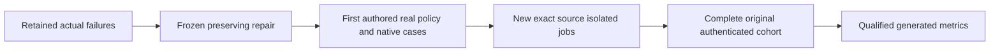

# BenchmarkComparisons native gate repair

Status: Accepted staged contracts; reviewed source is delivered through bfb.
Selected ca22 policy and f403 native preflight originals are qualified below;
complete comparison and failure-path qualification remain pending.
[ADR-068](../../ADR/ADR-068-native-benchmark-gate-repair.md) owns stages, exact paths,
root/worker permissions, bounds, rollback and join conditions. All parent
BenchmarkComparisons guarantees,1/2/3node cells and270scenario scope remain.

|Requirement|Acceptance and test trace|
|---|---|
|REQ-NGR-001 fresh executing-job authority|AC-NGR-001 / TASK-NGR-G1: exact same-ID authenticated metadata, up to3captures/1000ms, all identity/running checks preserved. First-author real-provider-data policy regressions plus actual GitHub startup. Stale queued/exhausted/mismatched/terminal/error authority rejects before any database/timing.|
|REQ-NGR-002 exact Kurrent event preservation|AC-NGR-002 / TASK-NGR-R2/K1: source-contract freeze then genuine SDK original/custom/system metadata equality and unchanged55,378owned-stream/foreign/cleanup proof on1/2/3. StageA source delivered; selected f403 native1/2/3 originals pass. Empty tracing characterization remains open; a hard-coded empty assumption is not a valid completeness oracle.|
|REQ-NGR-003 actual native leader routing|AC-NGR-003 / TASK-NGR-R2/K1: pinned SDK/advertised-endpoint source freeze, actual leader/follower/native setup proof and observed members/copies/ACK. Selected f403 native1/2/3 preflight proof exists; D1 diagnostic source is delivered. Original routing cause and diagnostic failure-path qualification remain open; no guessed leader, independent nodes or measured write retry.|
|REQ-NGR-004 genuine complete publication|AC-NGR-004 / TASK-NGR-Q1: full source/normal/scalar/recovery/RF3/native preflight270/cohort/site original source/run/attempt/upload/digest/report evidence. Failed/cancelled/skipped/unavailable data remains honest.|
|REQ-NGR-005 settled resource-failure observation|AC-NGR-005 / TASK-NGR-E1: Authored OutboxFailureDiagnosticClassifierTests and OutboxFailureDiagnosticFormatterTests map exact eligibility and typed privacy/bounds; execution is pending. Existing real isolated1/2/3 failed-case runner/worker originals must prove the one authenticated SDK read outside timing, cancellation/settlement and original-result preservation. No quotas, purge or retry changes.|

Canonical slice map: scripts Features/BenchmarkComparisons current-job helper/API/
job; UnitTests Features/BenchmarkComparisons new IsolatedCurrentJob files;
ComparisonTests Features/BenchmarkComparisons genuine Kurrent fixtures; benchmark
native Kurrent adapter only after its separate contract freeze. Root owns docs,
workflow/configuration/source joins/Git; coding workers own disjoint frozen files.
Abstractions/backend/frontend changes are N/A for AC001: private startup proof
keeps public schemas, engine operations and site values. Kurrent stage's precise
paths are pending root freeze. Native transport is real and bounded; no doubles.

Baseline is actual dbd01269 Bench37120639751 attempt1: RabbitMQ startup fails
before native work, Kurrent1/3 post-run metadata fails and Kurrent2 setup fails.
Original reports remain immutable. Pending/cancelled runs and development checks
are not qualified results. Local tests/runtime are not used for this repair;
canonical GitHub invocations follow root policy. Numeric coverage collector,
full faults/endurance and complete TimeSeries family remain open.

AC-NGR-002 stageA is frozen in ADR068: strengthen the existing genuine full-volume
preflight oracle to exact original custom-metadata byte equality, using nonempty
caller owner metadata and valid explicit tracing fields which pinnedSDK1.4.0
preserves. Only the two canonical-volume fixture/helper files change; measured
target data and every existing ownership/foreign/cleanup assertion remain. Empty
caller tracing characterization and n2 routing stay pending. New source is not
native qualification; all1/2/3 originals must join before this stage is proven.

The [source-stage receipt](../../implementation/native-benchmark-gates-source-stage-001.json)
binds the integrated d500 prerequisite and reviewed files to the full Release,
formatter and static governance checks. At source-stage delivery all nineteen policy cases and native
metadata/readback/current-job transport behavior were GitHub-unqualified.

REQ-NGR-003 / AC-NGR-003D is the accepted bounded setup diagnostic stage in
ADR068. Only a target-owned closed phase and at most4096-byte failure-only
type/method stderr line are added before rethrowing the same caught exception.
Pure genuine-thrown formatter tests map privacy/depth/chain/cancellation/bounds;
the existing real1/2/3 preflight remains the native proof. No native errors are
fabricated and no routing/retry/public result changes occur. Original setup
callsite and full leader-routing qualification remain pending; an earlier
verifier cleanup may still mask the original primary exception.

Original ca22 CI now proves nineteen policy-record cases passed, while its full
CI gate failed; [the exact receipt](../../implementation/sql-client-qualification-ca22.json)
keeps normal/recovery/RF3 failures and skipped scalar explicit. Original f403
Kurrent1/2/3 native preflights each passed one selected TUnit flow, with full
metadata volume assertions on the existing path and observed native copies;
[the preflight receipt](../../implementation/native-kurrent-preflight-f403.json)
binds provider uploads, original ZIP/report/worker/teardown hashes. This does not
qualify the new setup diagnostic, refresh exhaustion, routing cause, full270
cohort, website publication or all fault/resource gates.

REQ-NGR-005 / AC-NGR-005 / TASK-NGR-E1 is the approved stageE private failure
observation in ADR068: one bounded authenticated outbox-status read after an
exact resource-failed case settles, only numeric redacted context, original
case/timing/sample preservation. Pure classifier/typed formatter tests and
actual native1/2/3 original runner/worker JSON form its trace. Source accounting
is a hypothesis until real counters exist; no quota or retention policy change.

The [f403 failure receipt](../../implementation/native-benchmark-failures-f403.json)
retains seven genuine failed jobs and the terminal cancellation after originals
were preserved. The cohort never aggregated or published. OwnershipLost,
UnknownWriteOutcome and ResourceExhausted remain failures with all original
samples; outbox accounting and membership diagnostics are hypotheses until
actual cause evidence joins.

The [ca7 CI receipt](../../implementation/sql-client-qualification-ca7.json)
proves the two genuine same-instance native writer cases, five D1 formatter
cases, and all67 RF3 cases, with194/194 recovery and118/118 unique analyzer
cases. Normal is2573/2576 and scalar is skipped, so the whole CI fails. These
selected successes do not qualify stageE observation or its native failure
path, full SQL/protocol, FullTextSearch, complete comparison or publication.

StageE [source-stage receipt](../../implementation/native-benchmark-gates-source-stage-003.json)
binds all seven source/test files to complete26-project Release/format/static
checks and final independent review. At that delivery, thirteen new pure cases
awaited GitHub execution; no native failure counters or acceleration were qualified. Initial
270cell reports do not satisfy the additional mandatory100k/1m/5m dataset and
at least100k measured-operation scale gates; those remain open.

The [ca7 failure receipt](../../implementation/native-benchmark-failures-ca7.json)
retains all eight actual failed KeyLoad cells across1/2/3nodes, with16 original
ZIPs independently bound to source/run/attempt/job/upload/digest and exact reports,
worker JSON and teardown. The126success/8failure/169cancelled/3skipped terminal
job statuses do not qualify measurements. All270scenario jobs are96provider
success/8failure/166cancelled; aggregation and site are cancelled. The n1 update/
delete final preparation ResourceExhausted has no invented samples/timing; multi-
node OwnershipLost/UnknownWriteOutcome retain every actual failed sample. Cause
and numeric quota counters remain unproven. This source predates stageE observation.

The [3ae original CI receipt](../../implementation/sql-client-qualification-3ae.json)
now binds2637/2637 normal and2637/2637 scalar,194/194 process recovery,67/67 RF3
and118/118 unique analyzer cases, with no nonpass cases. All thirteen stageE
classifier/formatter cases pass in each mode. Root independently rehashed the
provider ZIP digests, upload/job/source bindings and actual report/case bytes.
This qualifies those pure diagnostic cases; native failed-case observation,
numeric budget cause and the complete isolated cohort remain open. Automatic
Benchmarks37129421599 cancelled all27 preflight and270 scenario jobs without
steps, so it supplies no native measurement or website refresh. Later source
changes and working-tree SQL BETWEEN are outside this exact3ae qualification.
