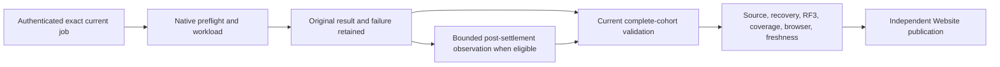

# BenchmarkComparisons native gate repair

Status: Accepted. Source repairs are present; exact-source Linux qualification of
the current cohort, complete native failure paths, and provider publication remain
pending. [ADR-068](../../ADR/ADR-068-native-benchmark-gate-repair.md) owns the
native gate contracts. The current publication contract is defined by
[ADR-076](../../ADR/ADR-076-current-cohort-publication.md),
[ADR-080](../../ADR/ADR-080-benchmark-failure-isolation.md),
[ADR-112](../../ADR/ADR-112-independent-website-publication.md), and the
[BenchmarkComparisons feature](../BenchmarkComparisons.md).

| Requirement | Acceptance contract and evidence |
|---|---|
| REQ-NGR-001: authenticate the exact executing job | AC-NGR-001 requires bounded authenticated discovery and revalidation of the same own-repository workflow, source, attempt, and job. Only strict `in_progress` with a null result admits native setup; queued, terminal, unknown, mismatched, exhausted, cancelled, transport-failed, or malformed state rejects before allocation or timing. The initial request is bounded to 120,000 ms. Only after an exact queued response may one 60,000 ms stale-response window run at a cancellation-aware 1,000 ms cadence, with no more than 61 total captures. Preserve exact request, body, and header behavior, including the current-job-only `Cache-Control: no-cache, max-age=0` refresh. No reselection, stale fallback, or workload retry. Real current-job authority cases and exact-source GitHub execution are required. |
| REQ-NGR-002: preserve native Kurrent events | AC-NGR-002 requires exact original/custom/system metadata equality, a complete 55,378-item owned-stream oracle, foreign-resource noninterference, and owned cleanup across genuine one-, two-, and three-node cases. Empty tracing remains uncharacterized; tests must not assume an empty result. Genuine pinned-SDK and native Aspire evidence is required. |
| REQ-NGR-003: prove native leader routing | AC-NGR-003 requires pinned SDK and advertised-endpoint validation, genuine leader/follower routing, and observed membership, copies, and acknowledgements. No guessed leader, standalone substitute, or measured write retry is allowed. Native preflight and complete workload results are separate evidence. |
| REQ-NGR-003D: retain bounded private setup diagnostics | AC-NGR-003D preserves and rethrows the original failure. Emit at most one failure-only line of 4,096 bytes, with at most three causes, eight frames per cause, and 64-character identifiers. Include only a closed phase, exception type, and bounded type/method metadata. Exclude messages, stacks, paths, endpoints, credentials, and payloads. Diagnostics do not establish workload success. |
| REQ-NGR-004: qualify the complete current publication | AC-NGR-004 requires exact source/run/attempt/job and archive provenance for the current plan: 1,386 workers (330 controls, 264 scaled CRUD, 792 vector) and 2,530 unique regular-file inputs (2,470 suite files and 60 provider files). Validate exact paths, sizes, hashes, original archive bytes, and source identities. Each slot is a measured result, an authenticated unsupported-topology disposition, or an authenticated terminal workload failure with its fixed safe reason and null report. Failed, cancelled, skipped, missing, mixed, or unavailable evidence is never numeric success. Full source, normal, scalar, recovery, RF3, native preflight, coverage, browser, freshness, and provider gates remain separate required predicates. The intensive TimeSeries family has its own ADR-050/059 plan and is not folded into this cohort. |
| REQ-NGR-005: observe settled resource failures without changing results | AC-NGR-005 preserves the original case, timing, and samples. Only after an eligible exact `ResourceExhausted` case and its session settle may one authenticated outbox-status read inspect at most 64 consumer heads, outside the measured clock. Unknown or unavailable observations remain unavailable. No quota, purge, retention, or retry change follows from the observation. Native one-, two-, and three-node failure-path and cancellation/settlement proof remains required. |

## Verification and ownership

The owning slice is `BenchmarkComparisons`: current-job and diagnostic tooling in
`scripts/Features/BenchmarkComparisons/`, real Node and unit regressions in
`tests/KeyLoad.UnitTests/Features/BenchmarkComparisons/`, native Kurrent cases in
`tests/KeyLoad.ComparisonTests/Features/BenchmarkComparisons/`, and the existing
benchmark adapter/host and AppHost-owned topology. Root owns the workflow, shared
source and evidence inventories, schema, documentation, final integration, and
qualification joins. Tests must exercise production context and real native
fixtures; source-name checks and fake executor or target behavior are not evidence.

Qualification requires the canonical Release build, formatter and governance
checks, the complete ordinary and scalar suites, process recovery, RF3, all native
preflights and workloads, source/input immutability, current coverage/browser
thresholds, final freshness checks, and actual provider receipts on the exact
Linux source. A previously successful partial run, local development result,
source review, or bounded diagnostic does not satisfy these gates. Keep ADR-068
Accepted until its exact-source criteria pass.

## Original evidence references

These references identify retained original records. They describe their own
source/run only; they do not establish qualification of the current source or
current cohort.

| Original reference | Evidence retained |
|---|---|
| Source `dbd01269`, Benchmarks run `37120639751`, attempt 1 | Original RabbitMQ startup and Kurrent setup/post-run metadata failures. |
| Original `ca22` CI and `f403` Kurrent preflight receipts | Policy-record and selected native one/two/three-node preflight records; the selected passes do not qualify later refresh, routing, full-cohort, or publication criteria. |
| Original `ca7` CI/failure receipts and `3ae` CI receipt | Retained normal/scalar/recovery/RF3 outcomes and original failed/null workload evidence. Benchmarks run `37129421599` was cancelled before execution and supplies no measurements. |
| Benchmarks run `37130907091`, attempt 1, job `111227060126`, source `7d9852` | Original Kurrent three-node setup failure; sealed source/run/upload/report/worker evidence SHA-256 `c50787a2279f9a8525df8794aaafa786e5a2cb2f7dd37bac623e36f524dd0a54`; verification receipt SHA-256 `f12f7c4f4e4fd068e6b78fb4c6d13aa77d0f12976f7c6fedc525a157a2d6f1cb`. |
| Read-only K2R source analysis | Review SHA-256 `da2be25c51d66e5b242554ced508c58715732a94fc7ae74888b4439c8ed741de`; it found no proven routing cause or justified repair. |
| Original `7d1196` Kurrent preflight and KeyLoad failures | Retained successor setup failure and native resource/ownership/fault observations. The KeyLoad source is `fabff69193f41c784f0b36b85c1f34d82fa9903d`; Benchmarks run `37166698745`; the OpenSearch VectorExact job is `111334162158`, with failed artifact `11291956733` (SHA-256 `1823f7fc876ad3b3a385056a8f75ab6bcd1de2cdb53bbef977a9e2d4313f5088`) and original qualification `11291373059` (SHA-256 `070fd453c92cf373666c3e993990f9e06bac07d111eac0795ebcdc03ed86d4d2`). The n1 delete observation retained 100,000 outbox entries and 192,581,709 bytes. These original observations do not prove a new passing cohort or website refresh. |
| Original analysis records | [Pinned SDK source review](../../implementation/kurrent-sdk-routing-source-review.md); [exact delete source accounting](../../implementation/keyload-outbox-benchmark-source-review.md). These are explanatory source reviews, not workload or qualification evidence. |

The external job artifacts and sealed originals remain the source of truth for
these records. Do not rewrite their bytes or treat their historical plan labels as
current acceptance criteria.
