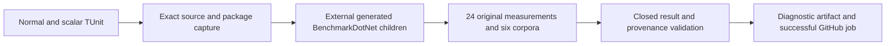

# Native serialization diagnostic acceptance

Goal: obtain authentic GitHub CPU/latency/allocation evidence for common native
serialization paths before selecting bounded optimization across all operations.
Actors: trusted GitHub executor and generated BenchmarkDotNet child. No new
database/API capability, persisted format or authorization policy. Frontend N/A:
artifacts are diagnostics; published metrics retain their complete matrix gates.

| ID | Measurable contract | Test/evidence |
|---|---|---|
| AC-IS-PERF-001 | Three genuine public/unsealed fixtures use DocumentResult, CommandRequest and StorageMutation[]; two sizes1024/16384; four actual typed NativeEncode/NativeDecode/JsonEncode/JsonDecode methods produce24 distinct cases. Exact Unicode JSON, polymorphic mutation fields, vectors, raw bytes/empty/tombstone and optionals roundtrip identically. No fabricated engine, JSON fallback or ignored native fields in comparator. | TUnit metadata and all six corpus/size roundtrips, decoded byte ownership; actual full BDN JSON/corpus hashes. |
| AC-IS-PERF-002 | Existing embedded generated-Dry test still exercises exactly PointRead/CompositeKey/ExactCosine. Separate native generated-Dry evidence proves external consumer execution; Dry never counts as measurement. | Preserve original assertions, narrow only its fixture filter; separate real-child TUnit case and raw logs. |
| AC-IS-PERF-003 | One isolated Ubuntu job in canonical benchmarks.yml runs actual external BDN children, MemoryDiagnoser,2 launches,3 warmups,6 result iterations at200ms target. Original JSON/CSV/logs, generated build files, environment, exact SHA/run/attempt/job, corpus and assembly/package/source hashes retained. Every one of24 cases has positive genuine Workload/Result operations/time, finite positive statistics, finite nonnegative allocation data and expected settings. Missing/failing/skipped/mixed results reject evidence. | Source workflow/validator regressions plus real GitHub job/raw artifacts; local development experiments remain separately labelled. |
| AC-IS-PERF-004 | Diagnostic-only manual input defaultsfalse. When another diagnostic mode is declared, conflicting selections fail before measurement and each lane excludes the other. Preserve independently owned working-tree changes without publishing them. Default preserves every competitor/native1/2/3/RF3/image and six aggregate needs; diagnostic mode cannot publish website/release evidence. BDN rows never enter database cluster aggregate. | Workflow source TUnit guards and existing aggregate/native identity tests; actual executor provenance. |

REQ-IS-PERF-001..004 map one-to-one above; REQ-IS-010/AC-IS-010 in
InternalSerialization links this complete diagnostic contract. ADR060 extends
ADR047 public generated-consumer ownership. The owner correction on2026-10-03 permits actual local development TUnit/BDN experiments with explicit source/machine/settings; required Linux GitHub qualification and website provenance stay mandatory.
JSON is a historical typed codec diagnostic, with different native envelope and
validation contracts; no general engine/security/RF3 equivalence is claimed.
Warm metadata and steady-state results remain distinct from cold initialization.
The genuine Dry child has a15-minute execution deadline. Cleanup kills its process
tree, cancels and closes owned pipes when their15-second observation threshold
expires, and observes both capture tasks and every failure before releasing files.
Kernel file-I/O settlement has no BCL hard completion guarantee; the final owned
join is explicit, and the GitHub job timeout is the executor's final bound.
No numeric speed claim or regression threshold is invented before baseline;
further optimization requires that evidence and all normal/scalar/recovery/RF3
guards. Unsupported/legacy formats, cancellation, byte budgets and trust boundaries
remain exactly the native contract. Removing the additive fixture/job rolls back
this diagnostic without touching user data.

## Ordered delivery and ownership

# Native serialization performance task graph

Accepted scope is diagnostic baseline first, preserving every native correctness
guard and complete database comparison pipeline. Root owns shared workflow, docs,
acceptance and all final joins; no optimized runtime code before measurements.

| Task | AC | Owner/model | Scope/permission | Dependencies/start | Artifact/verification/state/join |
|---|---|---|---|---|---|
| NSP001 | all | root high capability | contracts/workflow/docs integration writes | owner steering, accepted ADR060 extension now | accepted criterion map and ordered plan; ready |
| NSP002 |001/002 | wire worker capable high | exclusively Native*SerializationBenchmarks and NativeSerializationBenchmark* helpers/tests; one existing filter constant | NSP001 accepted | fixtures and TUnit source reviewed; explicit file/pump/process ownership and final joins repaired; combined development build passed; runtime qualification pending |
| NSP003 |003 | format reviewer high; independent codec review | exclusively new scripts/Features/BenchmarkComparisons/native-serialization-* report/capture helpers plus new validator tests | NSP001 accepted | source complete and independently reviewed; expected24/settings checked against pinned exporter; GitHub execution pending |
| NSP004 |004 | root | benchmarks.yml joins and new workflow test | NSP002/003 agreed CLI/files; preserve concurrent diagnostic lanes in worktree and deliver only the native-owned snapshot | isolated diagnostic job/input and unchanged full aggregate reviewed in scoped delivery image; exact-source GitHub qualification pending |
| NSP005 |all | root | scoped commit/push/GitHub test+measure/artifact read | all workers complete, diff/static checks | exact-source CI then actual diagnostic measurements and full comparison tracking; pending |
| NSP006 | future | root+bounded workers | no runtime writes yet | measured baseline and numeric accepted improvement/regression budgets | typed scalar/type descriptor/provider optimizations selected from evidence; blocked on baseline intentionally |

## Actual baseline attempt and visibility join

[Run37124532025](https://github.com/managedcode/KeyLoad/actions/runs/37124532025)
at sourcef403bf61e completed24 original external measurements and both normal/
scalar diagnostic contract suites. The strict preceding-step API check failed,
so this job is not qualified performance evidence. R15 in ADR060 retains
completed-success requirements, saves each actual snapshot before checking,
and only retries uniquely identified pending/null-conclusion preceding steps
within120 seconds at10-second intervals. Terminal failure, missing/duplicate
steps or changed run/source/job identity reject immediately. One cancellation
reaches actual API subprocesses and waits. Pure step/deadline regression data
never authenticates GitHub or qualifies results. A new exact-source job must
complete all original report/corpus/generated/provenance/artifact checks.

REQ/AC-IS-PERF005..007 now have the accepted exact terminal-allocation/admission and prospective quantitative/variance contract in ADR060 (NSP006). Test matrix: new NativeWireSupportedScalarTests/Fixtures prove frozen allowed terminals and generic-owner/open closures; ScalarAllocationTests prove measured0B auxiliary delta, nullable Normalize equality; ScalarDepthTests prove264/265 boundaries. Retain all existing native roundtrip/fault/resource tests. AC007 manual evidence exception: actual authenticated before/after originals, corpus/cohort checks, exact interval/ratio/launch arithmetic and independent review. The protected R18 baseline gate is admitted by the complete original artifact from run37129441460 at3ae408fe; see the current delivery record below.

## Current delivery and workflow contract, 2026-10-03

The later explicit owner workflow correction supersedes the historical
AC-IS-PERF-003/004 placement and dispatch requirements above: benchmarks.yml is
reserved for end-to-end database comparisons. Internal native/raw/codec
microbenchmarks cannot be its jobs, modes or dependencies. Do not repeat the old
native-only dispatch. The former job and its unchanged original artifacts remain
historical evidence; removing its pipeline surface must preserve the actual
fixture, correctness tests and database comparison gates. Local complete paired
BDN runs use these same fixtures, six corpora,24 cells and2/3/6/200ms profile,
with actual source/host/children/exporters and explicit development-only status.
They do not refresh website performance evidence.

NSP005 baseline admission is complete: exact3ae408fe CI run37129421675 passed
normal/scalar2637 each, recovery194, RF3 SDK/MCP67 and analyzers118 with no
skips. Protected run37129441460 retained24 cells, six corpora,48 distinct real
children and matching127-case normal/scalar diagnostic suites. Artifact11276836758
has verified SHA256 b3353fa730b664cb70c84dfb49ad9d4f0827849b9e15684998c37f7ce783ec83;
independent source joins and credential review passed. These results qualify
only the authentic3ae baseline, never a later candidate.

NSP006 writes are accepted under ADR060 AC-IS-PERF005/006/007. The sole runtime
change fast-returns existing closed nongeneric terminal types after one unchanged
Normalize call; the complete fallback and persisted/native corpus bytes remain
unchanged. Root integrates only the production change and four scalar regressions;
the owner cancelled the unrelated process-helper branch. The complete local24cell
pair passed all12native allocation budgets, with Command NativeDecode64.62%/79.11%
lower allocations at1024/16384. Only3of12JSONmean controls passed; AC007 latency
qualification remains open. These per-operation allocations do not establish total
RAM usage or global maximum speed. Final five-source normal/scalar/recovery and
delivered-source Linux RF3 CI remain distinct from historical image evidence.
Current original receipts, failures and scope limitations live in
stage004 (report removed from repository).
