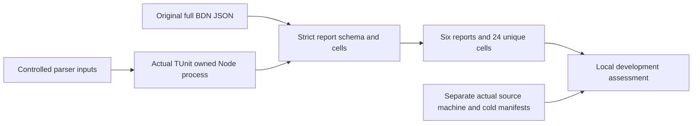

# Local scaled report validation

Canonical slice: BenchmarkComparisons. This is the pure-report stage of
[ScaledWorkloads](ScaledWorkloads.md), AC-SCALE-005/006, under
[Accepted ADR-069](../../ADR/ADR-069-representative-scaled-workloads.md).
The parent feature owns the binary inputs, native resources, BDN job and complete
24-cell profile. This document owns only the strict local full-JSON validator.
It does not authenticate a provider or produce measurements.

## Scope and decision

Use a separate Node built-in-only pure module instead of relaxing the original
4096-record raw-control validator. Inputs are parsed original BDN JSON or clearly
identified controlled parser-test data. Source/machine/cold-manifest production,
file hashing, process ownership and actual measurements remain the parent
feature's separate gates. Do not implement them by synthesizing report fields.
Backend, public API, frontend, persisted data and workflow surfaces are N/A:
this stage changes local diagnostic validation and its real TUnit/Node tests.
No new package, tool, public website figure or internal Benchmarks job is added.

## Requirements and measurable acceptance

|Requirement|Acceptance|Pass and fail contract|
|---|---|---|
|REQ-SCALE-RPT-001|AC-SCALE-RPT-001|Accept one complete four-cell selected-engine/selected-count report with the parent's exact job, operation, duration and retained-sample contract; reject a tiny, mixed, incomplete or failed report|
|REQ-SCALE-RPT-002|AC-SCALE-RPT-002|Accept exactly six complete engine/count reports forming the parent's 24-cell matrix; reject missing, duplicate, extra or mismatched entries and host metadata|
|REQ-SCALE-RPT-003|AC-SCALE-RPT-003|Validate without mutation, I/O, child launch or network; errors name fixed schema fields and do not echo supplied values|
|REQ-SCALE-RPT-004|AC-SCALE-RPT-004|Exercise the real module in bounded actual Node processes through TUnit; controlled vectors never become native or provider proof|

The exact module is
`scripts/Features/BenchmarkComparisons/scaled-storage-report.mjs`, exporting:

- `validateScaledReport(report, engine, recordCount)` returns `undefined` only
  after validation; otherwise throws an `Error` with a fixed field diagnostic.
- `validateScaledCohort(entries)` accepts an array of `{ engine, recordCount,
  report }`, returns `undefined` only after the complete validation, otherwise
  throws the same kind of bounded diagnostic. Neither function mutates inputs.

### AC-SCALE-RPT-001: exact original report shape

`HostEnvironmentInfo` must be an object with pinned BDN0.15.8 (optional normal
build metadata), a syntactically valid .NET10 runtime version, RELEASE
configuration, no attached debugger, nonempty OS/processor/architecture/CLI
metadata and positive integer physical-processor/core/logical-core counts.
Hardware descriptors are observations, not proof of identical physical machines.

`Benchmarks` contains exactly the parent's two methods by two payload sizes.
Namespace and type are exactly
`KeyLoad.BenchmarkScenarios.Features.BenchmarkComparisons` and
`ScaledStorageReadBenchmarks`. Parameters contain exactly three unique names,
`Engine`, `RecordCount`, `PayloadBytes`, in any order; compare canonical decimal
counts/sizes and exact lowercase engine values. Reject duplicates, extra names,
aliases, unsupported selectors and partial or null rows. Caller selectors are
the same exact two engines and three qualification counts in the parent feature.

Require the human `DisplayInfo` job tuple to corroborate the parent's .NET10,
launch, invocation, unroll, warmup and iteration settings without duplicate or
conflicting tuple fields. Do not mistake this text for a typed job/source receipt.

For Workload measurements require eight Warmup rows, ten Actual rows and the
statistics' retained Result row count. All relevant rows use original launch
index1, unique positive iteration indices, exactly5M operations and positive
finite total nanoseconds. Warmup indices are1..8; Actual indices are1..10;
Result indices are unique within1..10. Every Actual row must last at least100ms.
Overhead/Jitting metadata does not count toward any of these workload totals.
Raw Actual rows and retained results remain separate; never demand ten retained
samples when BDN legitimately removes outliers.

Statistics require N8..10, exactly N positive finite OriginalValues, and positive
finite Mean/Median. The ordered OriginalValues must equal each corresponding
Workload/Result row's nanoseconds divided by operations within four machine
epsilons times max(1, absolute expected value). This checks normalized units;
it does not invent or replace statistics. Memory must contain nonnegative finite
bytes allocated per operation, nonnegative integer Gen0/1/2 collections and
TotalOperations exactly5M. Managed allocation metadata is not native heap/RSS.
Missing, failed, short, old-control, duplicate or extra cells fail the report.

### AC-SCALE-RPT-002: complete cohort

Validate exactly six entries, one for each engine/count pair, using the same
report validator and all three sizes. Reject duplicate, missing or extra pairs.
All reports must agree on the original host's OS, processor, architecture,
physical/logical/core counts, runtime, CLI, BDN version and configuration. This
only detects metadata drift in the local development cohort; actual hardware,
resource, durability, topology and original-file provenance gates remain open
until separately retained observations establish them. A report array does not
authenticate GitHub, select a database winner or authorize publication.

### AC-SCALE-RPT-003/004: bounded pure behavior and actual tests

Invalid objects, selectors, report rows, statistics, memory, workload operations,
durations, stages, launches, iteration identities and cohort entries throw a
fixed `Invalid scaled-storage report: <field>.` message of at most128 ASCII
characters. No supplied sentinel/string/value appears in errors. Preserve the
full input on success and rejection, including nonfinite controlled Node values.
Do not open files, use a clock, launch children or fetch network data inside the
module. TUnit owns the actual Node child through existing bounded
IsolatedAggregateNodeProcess; test requests are capped at1MiB before launch.
Check the serialized UTF8 byte length before creating a child. Transport these
bytes through redirected standard input, close the original input pipe after
the write, and parse its bounded bytes once in the real child. Arguments contain
only the bounded probe program and module path; no request bytes, base64 chunks,
temporary input file or second process owner. A valid controlled request over
256KiB must execute through the actual child; a request over1MiB must reject
before launch. Root extends the existing lifetime owner with one optional input
task, sharing its run/cancellation deadline. That original task participates in
success, failure, cleanup and deferred release with the exit/output/error tasks;
do not dispose its process or pipe before all originals settle.
The child's real exit/stdout/stderr, input preservation and every case assertion
must be checked. No fake HTTP/native provider, fake process or skipped case.

## Test mapping and ordered execution

|Acceptance|Automated scenarios and assertions|Exception and required evidence|
|---|---|---|
|001|Both engines/all sizes, N8/N10, both runtime forms; wrong selectors/job/shape; missing/duplicate/extra cells; wrong or missing rows/operations/durations/launches/statistics/memory; normalized-unit mismatch|Actual generated BDN originals and cold native values/resources remain parent gates|
|002|Complete six-entry matrix; missing/extra/duplicate/unsupported pairs; mixed host/runtime; nested invalid report|Equality of supplied host descriptors alone is not actual hardware/provenance proof|
|003|Success and every rejection preserve input; nonfinite values; sentinel diagnostics stay bounded and safe|Pure parsing cannot authenticate a provider or measured source|
|004|Real TUnit launches owned Node, verifies exit/stdout/stderr/exact case set; bounded stdin request over256KiB succeeds and oversize request rejects before launch; cancellation/input failure uses the same original-task owner|Coverage collector/baseline is unavailable; no numeric coverage claim|

Source boundaries and task graph are fixed before delegated implementation:

|Task|Owner and exact scope|Dependencies and join|
|---|---|---|
|SCALE-Q0|Luna read-only original-schema research; private receipt only|Complete source-bound discovery; no measurement claim|
|SCALE-QT3|Luna writes only NEW ScaledRawStorageReport* TUnit sources|Root-approved contract; independent of QI; acceptance-derived tests, no execution before coherent implementation and review|
|SCALE-QI|Luna writes only NEW scaled-storage-report.mjs and cohesive same-prefix helpers|Root-approved contract; independent of QT3; no workflow/control/schema/contract edits; complete source/hashes|
|SCALE-QS|Root owns existing IsolatedAggregateNodeProcess/Lifetime/Cleanup optional stdin extension and NEW input helper|Existing no-input behavior preserved; every original writer/exit/reader settles or remains charged in deferred release|
|SCALE-QR|Strongest read-only full parser/test review|Complete QT/QI, actual original schema, source limits and privacy; no runtime claims|
|SCALE-QG|Root sole join/verification/Git owner|Approved QR; build first, focused real Node TUnit, broader normal/scalar, format/governance, honest status|

The actual pre-source full relevant baseline is recorded once in ScaledWorkloads;
new parser tests are additional and unexecuted until the module is joined. Track
each actual failure here with its original result, cause and preserving fix.
Use TUnit/Microsoft.Testing.Platform and .NET10, never VSTest filters. Root runs
the real focused `/*/*/*ScaledRawStorageReport*/*` filter after a fresh Release
build, then required related/full gates and formatter. Local results are
development evidence; delivered-source CI remains mandatory. Preserve originals.

Root owns this contract/ADR/integration. Workers cannot invent fields, alter
native workload/profile/settings, change controls or publish values. Stop on
schema, process-owner, same-file or acceptance ambiguity. No skill installation.
Rollback removes only this new parser and tests together; no product/persisted
migration. Status: accepted implementation contract; tests/module/execution OPEN.

Owner execution order2026-10-03: implement the complete source/test block first,
self-review, then execute validation. QT3/QI/QS may implement concurrently in
disjoint files; their joined result is reviewed together. Earlier stopped QT/QT2
candidates remain unapproved and are not a source or qualification baseline.
