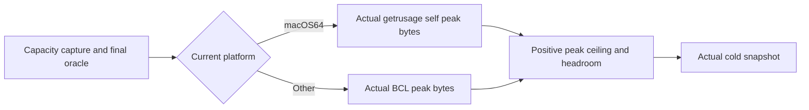

# Scaled fixture runtime repairs

Canonical slice: BenchmarkComparisons. Related REQ/AC-SCALE-003,
[ScaledWorkloads](ScaledWorkloads.md) and [ADR-069](../../ADR/ADR-069-representative-scaled-workloads.md).
Scope: legal native diagnostic settings and truthful cold process-memory observations.
Production ZoneTree/WAL/RF3, public APIs, persistence formats, native tiers and public
comparison pipelines are unchanged. Frontend/public contracts: N/A, diagnostic only.
The macOS-specific peak reader supports local diagnostics; required qualification remains Linux-only and this path adds no macOS gate.

The first actual local normal TUnit run executed51 cases:35passed,16failed,0skipped.
Original TRX SHA25649b165539a13fe5d5dd5fd61fb2dfd87b1fb9b46c92506a7de71e96e9686b395.
Seven failures were ZoneTree's rejected6-item mutable limit; nine asserted a positive
process peak but observed0 on macOS. Full Release before that run passed0warnings/errors.
These are failed original gates, not waived assertions or provider defects.

|Requirement|Acceptance|Pass/fail and proof|
|---|---|---|
|REQ-SCALE-RT-001|AC-SCALE-RT-001|Use native mutable max(1000,N+2); existing genuine mini/100K tests must seed/read/close normally, full qualification counts retainN+2 and actualN mutable/no frozen/disk records|
|REQ-SCALE-RT-002|AC-SCALE-RT-002|Every capacity/capture/final-oracle path reads genuine positive lifetime peak bytes; macOS64 reads successful RUSAGE_SELF ru_maxrss, other platforms use native BCL peak; unavailable/nonpositive/error data fails closed|
|REQ-SCALE-RT-003|AC-SCALE-RT-003|Cold native read has no timed-path I/O, samples are current-process only; real local normal/scalar tests and exact-source Linux CI remain separate from performance/publication/fault proof|

macOS .NET10 ProcessManager populates resident WorkingSet but leaves PeakWorkingSet
unset. Apple's current getrusage manpage defines ru_maxrss in bytes; its Darwin64
header has two16-byte timevals, then14eight-byte longs: size144, peak offset32.
Use source-generated LibraryImport only for macOS64, the absolute system library
/usr/lib/libSystem.B.dylib, explicit SafeDirectories import policy,
getrusage(RUSAGE_SELF=0), SetLastError=true, and a blittable explicit144-byte buffer.
Refresh the supplied current-process observation before reading BCL data.
On native failure retain the actual errno through Win32Exception. No current-RSS,
managed-heap, configured log-size or sampled maximum may be substituted for lifetime
peak. Nonpositive/unavailable measurements throw InvalidDataException in both
reader and observation guard; genuine ceiling/headroom failures retain the existing
InvalidOperationException. Linux keeps BCL semantics.
AllowUnsafeBlocks is scoped only to the diagnostic library for generated interop;
no handwritten unsafe pointer code, new package, vendored dependency or global opt-in.

All three existing peak readers (capacity, Capture, final oracle) share this reader;
full-oracle success metadata is published only after its memory guard succeeds.
Keep the12GiB process ceiling,2GiB headroom, actual GC capacity, once-only final
oracle, original exceptions and retained owner/resource order. No source/public
profile count, quota, WAL mode or timed method change is authorized by this repair.

Task graph: root owns contracts, existing3reader joins, memory guard/project flag,
ZoneTree minimum, integration and actual gates. SCALE-MT Luna owns exactly two NEW
private candidates: ScaledRawStorageProcessMemory.cs and
ScaledRawStorageProcessMemoryTests.cs; tests first, no repo/runtime/Git writes.
Strongest SCALE-MR reviews every stopped byte/diff and ABI/error/cold-path ownership.
Root guarded-joins exact files only after review and executes the combined gates.

Testing methodology: existing seven failing real-ZoneTree flows are regression proof
for AC-RT-001; all nine positive-peak failures and new real current-process positive,
byte-scale and monotonic observations cover AC-RT-002/003. New tests also reject
zero/negative guard input as invalid data, without replacing an actual OS provider.
No injected native failure or fake peak is permitted. Native getrusage errno and
unsupported64-bit fault occurrence remain unobserved manual limits, never simulated
qualification. Native ABI size/offset is checked against the installed SDK header.
Full formatter/build/governance, focused normal/scalar, broader unit regressions,
then sequential actual100K/1M BDN original output are ordered root gates.
Delivered-source Linux CI/recovery/RF3, coverage, endurance, powerloss and full
database comparisons remain separately required. No skipped suite counts as passing.

Rollback removes the reader/test/project opt-in and its three joins together;
an unavailable macOS peak remains a diagnostic limitation rather than a qualification gate. Production formats/data
are unaffected. ADR remains Accepted until actual required evidence exists.

Primary sources: [dotnet10 ProcessManager.OSX](https://github.com/dotnet/runtime/blob/v10.0.0/src/libraries/System.Diagnostics.Process/src/System/Diagnostics/ProcessManager.OSX.cs#L60-L67),
[Darwin resource header](https://github.com/apple-oss-distributions/xnu/blob/main/bsd/sys/resource.h#L150-L178),
[Darwin getrusage units](https://github.com/apple/darwin-xnu/blob/main/bsd/man/man2/getrusage.2).

Historical local verification snapshot (2026-10-03): the repaired full Release build passed with zero warnings/errors;
actual local normal54/54 and scalar54/54 passed with no skips, unchanged source
hashes and settled owned process groups. historical report (removed from repository)
retains the earlier51-case failure. Required qualification remains Linux-only;
macOS peak readings are local diagnostics. Broader tests, exact-source Linux delivery,
native errno/platform faults and all-scale measurement qualification remain open.
