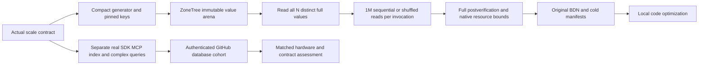

# Representative scaled workloads

Owner correction 2026-10-05 limits active benchmark datasets to exactly100k and1m
for every database. The active native fixture bound is1m, and each checked raw
read invocation consumes1m operations. Older retained-source observations and
immutable results below remain historical; they are not active scale requirements.
Canonical slice: BenchmarkComparisons. ADR: [ADR-069](../../ADR/ADR-069-representative-scaled-workloads.md).
Owner correction2026-10-03 requires actual100K/1M records and at least100K
measured operations per applicable workload cell, sequential/random/ordered/range,
indexing and complex queries. All stages remain unqualified until native originals.
The old4096-record raw control and270-cell database control stay separate.
Actual first-run failures and preserving native/minimum/peak repairs are tracked in
[ScaledRuntimeRepairs](ScaledRuntimeRepairs.md), REQ/AC-SCALE-RT-001..003.

|Requirement|Acceptance|Caller-visible behavior and proof|
|---|---|---|
|REQ-SCALE-001|AC-SCALE-001|Compact deterministic full-index binary inputs, sorted BE keys and full shuffled permutation; independent literal TUnit goldens|
|REQ-SCALE-002|AC-SCALE-002|ExactlyN terminal seed writes and full distinct payload verification, real native copy/borrow and scratch lifetime; normal/scalar genuine engines|
|REQ-SCALE-003|AC-SCALE-003|Bounded native residency/page/index/process/preparation/cancel/close owners; actual100K/1M generated qualification|
|REQ-SCALE-004|AC-SCALE-004|Every read invocation really performs1M operations over allN keys and consumes exact record identities/checksum; real BDNmetadata and nativeprocess|
|REQ-SCALE-005|AC-SCALE-005|Separate records/calls/iterations, load/oracle/resources/digest, complete12cell/profile/duration gates and original failures|
|REQ-SCALE-006|AC-SCALE-006|Local internal scale originals bound to source/machine; full-database GitHub comparisons use isolated runners and authenticated comparable originals; local evidence never publishes|
|REQ-SCALE-007|AC-SCALE-007|Mandatory subsequent genuine SDK/officialMCP/RF3 ordered/index/complex-query supported-peer cohort, exact results/ACK/resources; currently OPEN|
|REQ-SCALE-008|AC-SCALE-008|All current source preserved/periodic main delivery, full real quality/fault/coverage/endurance gates, no fake/skipped/invented success|

The exact binary, permutation, immutable arena, tier settings, deadlines, native
observations,12GiB ceiling/headroom, body/close preservation and BDNjob contract
are frozen in ADR069 and root ScaledWorkloads.md before
coding. Data/code/testing workers have disjoint new prefixes; root alone owns
shared workflow/executor/strict parser/docs/Git integration. Tests precede their
reviewed implementation, followed by independent fullsource review and actual
normal/scalar+native gates. No new dependency or product API is introduced.
PhaseA internal raw measurements run locally for optimization. Ordinary genuine
correctness checks belong in CI; internal benchmark jobs, modes and dependencies
are prohibited in benchmarks.yml. Only full-database comparisons and their
preparation/aggregation/website stages use that pipeline. No additional workflow
or internal GitHub performance context is authorized here.

Backend/public contracts N/A for PhaseA because production APIs/storage remain.
Frontend N/A until complete genuine scale metrics have an accepted separate
projection; current270/site schema cannot accept these diagnostics. Library and
tests use Features/BenchmarkComparisons; workflow/helper tooling use the same
slice. PhaseB covers actual backend/public-client/query/storage/index behavior
and requires its exact contract before implementation. No surface is silently omitted.

Q1 supports bounded
read-only predicates/equality-prefix indexes, not unrestricted SQL or joins.
Explain must prove real index use; actual results must be independently verified.
Keep authorization, public bounds, RF3 ACK, cancellation and original fault rules.

Native all-record validation and actual residency/peak-memory decide each size's
eligibility. Source capacities are planning arithmetic, not measured fit/RSS.
The previous full-materialized corpus would retain>10.32GB before the5M/1KiB
engine; this profile eliminates its duplicate value corpus. Process-kill/cache/
localBDN evidence never proves powerloss durability, full database leadership or
production readiness. Numeric coverage collection is still unavailable and open.

## Native profile contracts

- Reuse internal RawStorageEngineKind only. ScaledRawStorageCorpus(count,payload)
  accepts1..1,000,000 and32/1024B; qualification datasets are EXACT100K/1M.
  RecordCount/ValueBytes/Key(index)/WriteValue(index,Span<byte>) expose stable
  input metadata, indexed pinned Memory keys and cold deterministic value fill.
  Valid index0..count inclusive; count is unseeded reserved miss. Invalid bounds
  fail before acquisition/allocation. One pinned16*(count+1) key slab; no
  per-record object/Memory tables or retained full/alternate value corpus.
  Corpus, ReadOrder and ValueArena constructors additionally accept an optional
  original CancellationToken. Validate arguments then reject pre-cancellation
  before allocation and check at least every256 fill/shuffle operations. The
  fixture passes one owned linked token and original preparation deadline across
  all stages; never reset that deadline.
- Key format scale-v1: BE64(seed1729) then BE64(index). Value first32 bytes:
  BE64(index), BE64(seed1729), BE32(version1), BE32(payloadBytes), BE64(~index).
  Extra offset j>=32: unchecked byte(1729+index*31L+j*17L+(index>>8)+(index>>16)).
  Exact target span length is required. Full-index identity prevents256-aliasing.
  Literal independent header goldens include0,1,255,256,65535,65536,N-1.
- ScaledRawStorageReadOrder(count) keeps one int[count] shuffled permutation;
  initialize0..N-1, descend i=N-1..1, SplitMix64 state initially1729, add
  0x9e3779b97f4a7c15; xor>>30/multiply0xbf58476d1ce4e5b9; xor>>27/multiply
  0x94d049bb133111eb; xor>>31; j=next%(i+1), swap. Version
  splitmix64-fisher-yates-mod-v1. Golden10-order [3,5,0,1,2,4,8,9,7,6].
  NextSequential/NextRandom separate cursors start0/wrapN. Retain exact digest
  of LE32 permutation bytes; no timed shuffle/RNG/full-corpus allocation.
- Exact helper join API: Corpus.RetainedKeyBytes long; ReadOrder.NextSequential()
  and NextRandom() int, RetainedOrderBytes long and PermutationDigest string;
  ScaledRawStorageValueArena(corpus).Value(index) Memory<byte> for seeded0..N-1
  and RetainedValueBytes long. Arena constructor fills each immutable chunk once;
  all bytes remain unchanged through owner close. New headers/order are separate
  from old control types and never expand their bounds.
- ScaledRawStorageFixture(engine,count,payload,cancellationToken=default) owns
  descriptor/order/native engine, one pinned seed/output scratch and one separate
  expected-value scratch. ExactlyN charged terminal successful seed writes;
  further writes are forbidden. The constructor then performs one actual full
  native VerifyAll before returning: VerifiedRecords=N, VerificationPasses=1,
  NativeReadCalls=N+1 and FullValueDigest is the lowercase SHA256 of complete
  actually read values in ascending record-index order. It never substitutes
  the expected generator digest. Explicit VerifyAll adds a complete N+1-read
  pass; initial load and verification use separate actual untimed durations.
  Read(index) returns the actual BE64 record ID
  after exact size/terminal/found/output-copy checks and equality to requested ID.
  VerifyAll() cold reads all distinctN/full payload bytes plus reserved miss.
  SuccessfulSeedWrites/VerifiedRecords/RetainedInputBytes and actual native
  residence/resource snapshot are truthful separate counts. ReadNextSequential/
  ReadNextRandom use the corresponding real order. No per-call allocation,
  copied vendor implementation, arbitrary retry, hidden reseed or unsafe epoch.
- Exact fixture join API additionally has Corpus/ReadOrder, TryRead(index,out
  ReadOnlyMemory<byte>) bool including reserved miss, Read(index) ulong and
  ReadNextSequential()/ReadNextRandom() ulong. Capture() returns an immutable
  ScaledRawStorageSnapshot with RecordCount, PayloadBytes, SeedAttempts,
  SuccessfulSeedWrites, VerifiedRecords, VerificationPasses, NativeReadCalls,
  RetainedKeyBytes, RetainedValueBytes, RetainedOrderBytes, FullValueDigest,
  PermutationDigest, ProcessPeakBytes and nullable genuine NativeResidentRecords,
  Actual native resident counts are observed values; no removed candidate log
  counters or invented unavailable measurements remain. Write/load and full validation duration are
  actual untimed stopwatch observations. ScaledRawStorageSettings validates
  the actual ZoneTree input and process-memory capacity. Root authorizes no public product API. Additional immutable cold
  snapshot fields: SeedElapsedTicks, VerificationElapsedTicks, StopwatchFrequency,
  EffectiveMemoryCapacityBytes, ProcessMemoryCeilingBytes, ProcessWorkingSetBytes
  Effective capacity
  is the actual BCL GC-reported available memory limit, explicitly not free RAM.
- ZoneTree owns immutable value slices in4096-record chunks (max4MiB/chunk),
  kept through tree close. Never retain the reusable generator scratch as a value.
  RetainedValueBytes=N*payload for this owned arena.
  WALNone/compressionNone, mutable boundmax(1000,N+2), no maintainer or timed disk
  path. Require actual mutable/in-memory countN and no frozen/disk records through
  measurement.1000 is the native minimum for mini fixtures; qualification usesN+2.
  Full native point/value oracle is mandatory even with count.
- Whole child process peak ceiling12GiB; minimum total/cgroup memory eligibility
  ceiling+2GiB headroom. Report real total availability separately from actual
  free/RSS; never call total memory free memory. Smaller direct-unit fixtures
  use a computed bounded projection plus headroom, not mandatory12GiB allocation.
  Their bound adds the actual process baseline peak, keys/order/ZoneTree arena,
  native log/index projection and 2GiB headroom, capped at12GiB. Capture and
  compare actual complete-process peak outside timing; the planning projection
  is not measured native usage or additional permission to allocate that amount.
  Observe actual peak/RSS outside timing and during bounded cold validation,
  fail capacity/retention mismatch; no automatic quota/profile/count adjustment.
  Preparation20minute monotonic deadline and incoming cancellation checked in
  chunks<=256 operations; do not detach or preempt an original synchronous call.
  Body+independent close errors remain visible; dispose native session/output/
  store/settings before arenas/pins/directory. Repeat close retries unreleased owners.

## Acceptance and testing methodology

- AC-SCALE-001 / REQ-SCALE-001: compact exact binary corpus, independent goldens,
  BE ordering, i versus i+256 distinction, bounded invalid spans/indices/counts,
  deterministic full unique shuffle and wrap/digest. Real TUnit corpus/order tests;
  inspect no full-value retention. Wrong goldens/aliases/omissions fail.
- AC-SCALE-002 / REQ-SCALE-002: real native engine loads exactlyN, full distinct
  value oracle before/after, missing key, owned scratch and disposal; copied seed
  immutable borrowed ZoneTree values survive every read. Real mini+100K fixtures for both payloads, normal/scalar.
  Any nonterminal/lost/swapped/corrupt result, reset seed quota or released owner fails.
- AC-SCALE-003 / REQ-SCALE-003: frozen tier settings, actual no-eviction/resident
  records/process-memory/resource capture, capacity/cancellation/deadline failure
  before invalid acquisition, finite outer120minute job and owned cleanup. Real
  counter/pre-cancel/disposed tests plus manual vendor close limitation; native
 100K/1M generated runners prove actual fit. Authored source is not proof.
- AC-SCALE-004 / REQ-SCALE-004: public unsealed ScaledStorageReadBenchmarks,
  separate class name from old RawStorageBenchmarks wildcard, one selected engine/
  count per process. Each SequentialRead/RandomRead invocation executes EXACT1M
  actual reads; every call checks returned full record ID and consumed sum equals
  (1M/N)*N*(N-1)/2. OperationsPerInvoke1M, invocation1/unroll1, .NET10,
  launch1/warmup8/Actual10, retainedResults8..10. Params payload32/1024 and
  selected exact100K/1M (env KEYLOAD_SCALED_STORAGE_RECORD_COUNT, default100K).
  Engine ParamsSource uses KEYLOAD_RAW_STORAGE_ENGINE, exact lowercase zonetree
  or tsavorite, with unset default zonetree and other labels rejected. Both
  selectors are validated before native acquisition and the configured parameter
  identity is retained exactly; never silently select another engine or count.
  Real metadata and native batch/checksum tests, real generated full JSON.
  INTERNAL benchmark Capture() forwards the active genuine fixture snapshot for
  cold correctness tests. Each method must increase actual NativeReadCalls by
  exactly1M; checksum/attributes alone are not proof. Generated runtime is.NET10.
  Public Setup validates the selected engine/exact qualification count before
  acquisition; GlobalCleanup performs actual full postverification then owned
  close. Both a verification/body failure and independent close failure remain
  visible. Direct benchmark configuration rejects any other count.
- AC-SCALE-005 / REQ-SCALE-005: report requested, charged seed, distinct verified,
  actual measured operations, warmup/sample/retained counts separately; retain
  untimed load/validation duration/digest/resources/residence. Every actual row
  must have1M operations and>=100ms. Exactly24 two-engine×three-size×two-payload×
  two-method cells across the completed scaled cohort; no write rows, mixed/tiny
  profiles, missing/failed/short/default/duplicate cells. Real strict Node parser
  schema vectors are test data, never producer measurements; actual originals are
  the runtime proof. Native failures stay visible and invalidate that cell/cohort.
- AC-SCALE-006 / REQ-SCALE-006: local PhaseA originals bind the actual source,
  engine/count/payload, machine/runtime/settings, full JSON/CSV/stdout/cold
  manifests and original-file hashes. Sequential owned local processes stage
  100K->1M per engine only after preceding resource/value stage passes.
  Reconcile the full24-cell local profile without publishing it. PhaseB full
  database comparisons require same-source/run/attempt authenticated GitHub
  executor/job/artifact/ZIP/file hashes and matched actual hardware/resources,
  native topology, durability and workloads on isolated runners. Existing270/site
  contracts stay unchanged; no raw/internal jobs or modes in benchmarks.yml and
  no local measurements in site figures.
- AC-SCALE-007 / REQ-SCALE-007: actual product/full-service ordered/range, index
  preparation/index lookup verified by Explain and bounded complex Q1 queries
  through authorized SDK/officialMCP; exact ordered result/count/digest;100K+
  measured calls per supported cell at all3scales. Real RF3 process/container and
  native peer tests, authorization/negative/cancel/error/recovery cases, equivalent
  index/schema/ACK/topology/resource settings. Unsupported APIs are explicit,
  source limitations are never relabelled successes. This PhaseB criterion is OPEN.
- AC-SCALE-008 / REQ-SCALE-008: entire current eligible source preserved and
  periodically main-committed/pushed; full relevant build/unit/scalar/format/
  governance, actual recovery/RF3 and required numeric coverage qualified without
  skip/fake/invented evidence. Baseline actual failures tracked one-by-one. Raw
  cache success does not close full database endurance/powerloss/performance goal.

## Automated acceptance mapping

|AC|Automated evidence and verification|Explicit exception/remaining gate|
|---|---|---|
|001|NEW ScaledRawStorageCorpusTests/ReadOrderTests literal vectors, full uniqueness and actual buffer/span errors, normal/scalar TUnit|Managed/native/RSS model is only planning arithmetic|
|002/003|NEW ScaledRawStorageFixtureTests/SettingsTests real mini+100K engines/copy/pins/resources/owner/cancel; actual generated all3sizes|Unobserved vendor constructor/pending/finite close faults remain manual limitation, not invented injected failures|
|004|NEW ScaledRawStorageBenchmarkTests real metadata and1M checksum methods plus genuine BDN subprocess originals|Per-operation bounds/oracle overhead remains included and labelled|
|005|NEW ScaledRawStorageReportTests real bounded Node pure parser success/error vectors; genuine generated reports|Parser fixture values never publish or authenticate a provider|
|006|Root local original24cell scale receipt; PhaseB authenticated full-database provider originals in Benchmarks|Manual source/machine/config/statistical and hardware reconciliation; no local website substitution or internal Benchmarks jobs|
|007|Future frozen PhaseB real SDK/MCP/public query/container tests and supported native-peer cohorts|Not yet implemented/qualified; no raw point scan surrogate|
|008|Full solution Release; real TUnit normal/scalar/recovery/RF3; dotnet format verify; node governance; exact-source Actions originals|Coverage collector/baseline still unavailable, no numeric pass claim|

Rollback removes only new scale fixtures/profile/helpers/tests/docs coherently;
no persisted data/public API migration. Original4096/270/provider receipts remain
immutable. Every delegated writer stops at an unavailable pinned API, lifetime/
ownership ambiguity, same-file conflict or contract drift and returns complete
private files/diffs/hashes. Root alone integrates, reviews, delivers and owns gates.

## AC-SCALE-003 construction and close ownership correction

The stopped native candidate loses retryable owned resources if a constructor
throws and native close also fails. Missing vendor-fault evidence is not an
exception to keeping our successfully acquired handles, pins and arenas alive.
Before joining, construct managed owners without acquiring native resources;
assign the core to the fixture and each engine to the core before invoking its
one-shot Initialize. Assign each successfully returned vendor handle before the
next acquisition. A vendor constructor's own inaccessible partial internals
remain an explicit unobserved vendor limitation; our returned handles do not.

Each scaled diagnostic process admits exactly one active fixture. A bounded
static ownership slot roots that exact fixture before acquisition and remains
charged until actual dependency-ordered close succeeds. Admission rejects a
second fixture before its native acquisition. Constructor failure performs one
owned close attempt, preserves the primary and every independent close failure,
and retains the charged fixture if close fails. An explicit repeat-close entry
may retry only that failed owner; it never closes a healthy active fixture,
reseeds, retries a measured operation or silently admits a replacement. The
outer120minute process owner remains mandatory for an unreturned vendor call.
Retained native ownership must be observable as actual state, not an invented
recovery success. No unbounded retired-owner list or fire-and-forget cleanup.
The exact friend-only retry API is ScaledRawStorageFixture.HasRetainedFailedOwner
and ScaledRawStorageFixture.RetryFailedOwnerClose(): bool. The property reports
only an actually retained failed-construction owner. Retry returns false and does
no close when there is no such owner, when the current owner is healthy, or while
an original close attempt is already running; it returns true only after one
eligible original close returns successfully. Actual close exceptions propagate
and retain the owner for a later explicit attempt. A bounded synchronized slot
selects/charges the attempt, then releases its lock before the native close; it
never admits concurrent closes or holds a global lock across a vendor call.
Healthy-owner tests assert both APIs leave the real active store readable and
preserve its operation counters. This does not fabricate a vendor-failure flow.

Core construction only prepares managed buffers. The seed scratch is pinned.
Initialize covers original seeding, the initial full native oracle and residence
checks in the existing20minute scope. Successful cleanup performs the full
postoracle once before closing native owners; repeated close does not read a
partially closed engine. Failed initialization closes without inventing a full
postoracle. Release the linked lifetime and ownership slot only after core close.
All actual timed methods verify their returned checksum after the complete1M
calls. Native read counts increase only for a valid admitted point call.

Root owns this lifecycle contract and integration. The bounded test writer adds
ScaledRawStorageOwnerTests before the native worker's preserving revision:
genuine live owner remains readable after rejected second acquisition, original
seed/read counts remain truthful, actual close admits one new native owner, and
repeat close remains safe for both engines. Existing invalid/pre-cancel/metadata/
full-value tests remain. Real vendor close-failure proof is still unavailable;
no injected failure or fabricated native fault closes that exception. Strong
independent source review checks every new ownership path before integration.

Complete initial, explicit and final full-value verification also captures the
actual engine's residence/address/page/index bounds before successful oracle
metadata is published. Nonfatal oracle and independent close errors remain
visible. Test cleanup runs after a completed body or caught nonfatal failure;
excluded fatal unwind does not allocate an aggregate or call owned cleanup.
Actual fatal termination and vendor close failures remain manual, unobserved
evidence gaps; a throwing test double is not acceptable proof.

The independent pure parser contract is
[ScaledReportQualification](ScaledReportQualification.md): REQ/AC-SCALE-RPT-001..004
map the strict four-cell report and six-report cohort to actual bounded Node
tests. Parser vectors are controlled data. This stage does not authenticate cold
native manifests, process ownership, machine identity or measured observations.

## Execution ownership and join conditions

Root owns shared contracts, final integration, local report parsing and Git.
Workers cannot change existing controls, product APIs, packages, production quotas,
workflows or website contracts. Stop on pinned API, ownership/lifetime/same-file
ambiguity. A private candidate requires complete bytes, hashes, acceptance mapping
and source-only limitations. Review and integrate only completed worker results.

|Stage|Acceptance|Owner/tier and disjoint scope|Start, verification and completion|
|---|---|---|---|
|SCALE-P|001..008|Root high-capability; canonical feature/ADR/contracts|Freeze native API/workload contracts and observe full relevant baseline|
|SCALE-T|001..004|Luna test writer; only new ScaledRawStorage*Tests|Root and independent strongest source review before implementation|
|SCALE-D|001|Luna data writer; only new corpus/read-order/value-arena|ReviewedT; full private exact data sources/hashes; independent ofE|
|SCALE-E|002..004|Luna native writer; only new settings/engine/fixture/snapshot/BDN|ReviewedT and frozenDAPI; genuine calls/owners/bounds; complete private packet|
|SCALE-T2|003|Luna test writer; NEW ScaledRawStorageOwnerTests only|Frozen construction/close correction; genuine live-owner/rejection/close/replacement cases; root review before E2|
|SCALE-E2|002..004|Luna native writer; preserving stopped E revision in private v2 mirror|Approved T2; staged acquisition, charged owner and safe repeat-close; complete revised source/hash packet|
|SCALE-T3|003|Luna test writer; NEW ScaledRawStorageBoundsTests only|Genuine mini/100K bounds, reserved miss and counters; strongest source review before native join|
|SCALE-E3|002..004|Luna native writer; five preserving private native revisions|Actual final residence capture, token ordering, digest and XML corrections; root and completed strongest R3 review|
|SCALE-R|001..004|Strongest read-only reviewer|StoppedD/E; full exact source/test/lifetime/resource review before integration|
|SCALE-I|001..008|Root sole repository join/Git owner|Complete reviewedD/E/R; fresh Release/focused normal+scalar/full/format/governance; preserve eligible current main scope|
|SCALE-N|003..006|Root actual local runtime owner|Genuine100K then1M then5M perengine after previous value/resource gate; full24cell machine/source-bound originals, never site figures|
|SCALE-H|002..004/006|Luna read-only native hot-path research; private source report only|Independent of runningN; rank source-backed profile targets without executing load or changing contracts; root joins with actual original measurements before any optimization contract|
|SCALE-PV|002..004/006|Luna read-only pinned upstream native source research; private report only|StoppedH package pins; verify native defaults/read internals through primary source without code/runtime mutation; root joins with originalN before changing any setting|
|SCALE-B|007/008|Root contracts/integration then disjoint workers|Freeze real public SDK/MCP/index/range/complex-query and native-peer contracts; exact-source GitHub hardware/cohort/fault gates|

Full relevant pre-source baseline: actual full26-project Release0warnings/errors;
TUnit2641/2641passed/0failed/0skipped. Original local TRX
artifacts/local/full-unit-scale-baseline/KeyLoad.UnitTests_net10.0_arm64.trx
SHA2567dda1e7702acc17182f92e454d576feb1beb2e8c0d2dc9cc83ae6b12d035a6ea.
Later shared-source changes require fresh integrated checks. The prior native
unknown-header null guard, pending-status oracle, stored corruption-error oracle
and pre-cancelled membership cases all passed this baseline. Real intensive update
ResourceExhausted after approximately40K successes remains unattributed; retain
actual counters and never raise quotas without diagnosis. Short raw control rows
remain unqualified speed evidence.

Ordered final gates: independent source review; Release solution build with real
analyzers and numeric limits; focused normal/scalar then full relevant regressions;
formatter; original governance validator; reviewed eligible-current main commit,
fetch/ordinary merge/push and remote confirmation. Actual process recovery and
Docker/Aspire RF3 via .NET/officialMCP, genuine database comparison, numeric coverage,
endurance/fault qualification remain required. No skill/tool installation. The
installed Orleans skill applies if PhaseB changes routing/authority and produces
a concrete boundary/failure-contract review.

Current state: the reviewed source is joined. Fresh full Release r7 passed with
zero warnings/errors; genuine local normal54/54 and scalar54/54 passed without
skips, source drift or unsettled owned process groups. [Original evidence](../../implementation/scaled-native-local-2026-10-03.json)
records the exact source/assembly hashes and original TRX. Actual100K BDN is
running; broader tests, formatter, delivered-source Linux CI and all24 scale
cells remain open. Strict report tests remain stopped private candidates; the
parser and genuine cold manifest producer are unfinished. PhaseB, numeric
coverage, powerloss and whole-product comparative qualification remain OPEN.

Historical r2 failed8 analyzer checks: IDE0031, CA2213 tree/session/store/settings,
CA1816, IDE0059 and IDE0005. Preserving direct close/clear-after-success, public
SuppressFinalize, definite assignment and import repairs now compile in r7.
The first focused run failed16/51 (seven invalid ZoneTree mini limits, nine
macOS zero peaks); [runtime repairs](ScaledRuntimeRepairs.md) subsequently pass
54/54 in both modes. Original failed outcomes remain retained as failed snapshots.
