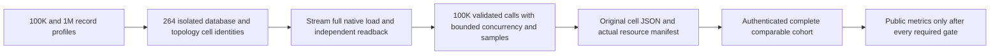
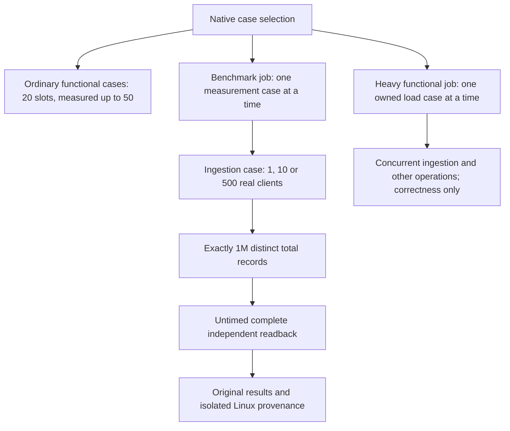

# Scaling qualification and fair deployment arms

Owner correction 2026-10-05 supersedes the earlier three-scale inventory: only
100k and 1m remain active for every database and workload. SurrealDB/HelixDB
increase the active inventory to 11 engines; the closed-loop CRUD family has
264 identities. Historical original artifacts retain their initial settings.
[ADR-109](../../ADR/ADR-109-native-vector-comparisons.md) governs the vector/site
extension.
Status: accepted new scaling implementation contract; current intensive comparison remains a separate control. Canonical slice: BenchmarkComparisons. Requirements: REQ-SCALE-009..015. Acceptance: AC-SCALE-009..015. Implementation contract: ADR-103.

## Purpose and bounded first stage

The existing `intensive-1k-c16` matrix is preserved byte-for-byte as a control. This feature adds a distinct actual-scale steady-state cohort through the existing `ComparisonRunner`, target adapters, isolated per-database GitHub job groups and native topology resources. It does not add a parallel harness or allow local measurements into website publication.

Two exact profiles are admitted:

| Profile | Actual corpus records | Measured operations per cell | Payload | Warmup / repetitions / concurrency |
|---|---:|---:|---:|---|
| `scaled-100k-c16` | 100,000 | 100,000 | 1,024 bytes | 256 / 1 / 16 |
| `scaled-1m-c16` | 1,000,000 | 100,000 | 1,024 bytes | 256 / 1 / 16 |

Seed is fixed at 1729. Applicable common scenarios are exactly `PointRead`, `DocumentWrite`, `DocumentUpdate`, and `DocumentDelete`. `PointRead` is reported as the existing public point lookup operation; this stage does not claim SQL range-query or complex-query scale where an equivalent adapter is absent. All new cells are steady-state closed-loop. Existing actual topology counts `[1,2,3]` and target native adapters are reused. KeyLoad uses a genuinely configured native RF1/RF2/RF3 member count for each cell, with independent native endpoint/status and ACK validation. An external target is eligible only when that exact native member count and write ACK mode are supported; unsupported cells remain explicit. A single PostgreSQL process is never described as distributed.

The complete planned cohort identity is target × actual node count × profile × applicable scenario (11 × 3 × 2 × 4 = 264 cells, preserving explicit unsupported topology dispositions). Every eligible cell is one isolated Linux GitHub runner/job, uses exact source/run/attempt/job and target image receipts, seeds and verifies all N records, then performs exactly100,000 caller operations. A missing, failed, unsupported-but-required, duplicated, timed-out or mismatched cell invalidates cohort completeness; no partial result is publishable.

## Bounded dataset and runner behavior

Do not substitute the old materialized corpus for the lazy scaled corpus. The existing `BenchmarkDataset` builds per-record JSON and float vectors, and the current measurer builds arrays of all operation inputs, outputs and samples; this would retain multiple gigabytes in the client before target storage.

The scaled runner path uses the existing profile/target/topology/report ownership but generates deterministic records by integer identity on demand. It retains no per-record JSON/vector object table and no duplicate payload corpus. Full target initialization writes all N actual records from the generator and independently verifies all N identities, exact payloads and a full native readback digest before measurement. Operation inputs are generated on demand by a fixed deterministic sequence. Update/delete preparation also streams through the generator.

During the measured stage the runner caps concurrent calls at 16, validates each caller result against the independently regenerated expected identity/content, and discards output immediately. It maintains exact total attempts, successful useful operations, failures, deadline timeouts, explicit rejections and unfinished calls, plus a fixed-size deterministic latency reservoir/sample with its algorithm and size recorded. It does not keep all inputs, output documents or operation tasks in memory. Every run uses an original caller cancellation token and finite per-operation deadline; shutdown joins actual in-flight operations. A later failure cannot be hidden by reducing the declared operation count.

## Fairness and provenance admission

The exact public library corpus/settings/readback/report seam and deterministic digest and latency-sample rules are frozen in [ADR-103](../../ADR/ADR-103-scaled-fair-comparisons.md#accepted-bounded-corpus-and-report-seam). The old materialized `ComparisonOptions` cap stays unchanged; only the closed typed scale profile represents the independently bounded lazy corpus. A scale report carries that exact profile and null control options, and is never eligible for the original control-only publication admission. Actual native ordered readback is a bounded `IAsyncEnumerable<FoundDocument>` setup operation, independent of generated expectations.

Every report binds exact profile/scenario, N, payload/schema/seed, corpus digest, requested and completed operations, operation-mix identity, target/version/image, requested and observed native node count, target read contract and ACK/durability, source SHA, workflow/run/attempt/job/artifact identity, Linux runner image, an ephemeral runner-instance identifier for provenance, and a stable actual hardware-class fingerprint.

It records actual host CPU model/family/count and memory, effective cgroup CPU quota and memory limit, every database resource's configured and observed CPU/memory envelope, persistent-storage class/capacity, and total per-cell process/container CPU/RSS peaks. Cells must match on stable hardware-class fingerprint and effective resource limits, not ephemeral runner-instance ID or observed peak values. Observed peaks remain measurements and must be finite and within their declared effective envelopes; providers need not consume identical CPU or memory to be compared. The S1 shard-key distribution is fixed `uniform-v1`; query fanout is explicitly `not-applicable` to this point-read/CRUD matrix; recovery and movement are `not-run/unsupported`. Missing or changed required equality fields fail closed; no unknown field is treated as a match. The full 264-cell cohort must have a complete independently verified artifact set before provider comparison or website aggregation. Root-owned workflow/AppHost/resource/provenance/aggregation joins are part of acceptance; authored source and parser fixtures are not measurement evidence.

Existing matrix grouping stays one named GitHub job group per database and each database/scenario/topology/scale cell stays isolated on its own runner. RF3 never shares a runner or native stores with a comparison database. Single-node PostgreSQL is not a distributed comparator. Community-only unsupported clustering is retained as an exact explicit disposition and is excluded from unsupported comparative claims, not converted to a fallback.

## Requirements and acceptance

| Requirement | Acceptance and test evidence |
|---|---|
| REQ-SCALE-009: exact real-scale profiles | AC-SCALE-009: strict profile reader accepts only the two exact profile/count pairs, fixed seed/payload and 100K operation count; profile count mismatch, unsupported scenario, extra profile, wrong node count and non-Linux execution reject before native acquisition. Literal vectors in `ScaledComparisonProfileTests`; actual acquisition proof in isolated provider jobs. |
| REQ-SCALE-010: bounded deterministic data and measurement | AC-SCALE-010: lazy generator matches independent literal values/IDs/digest at boundary and random positions without retaining all records; real measured path writes/verifies exact N, performs exact100K calls, caps concurrency, retains only declared sample and exact counters, validates results, and settles all calls on cancellation. `ScaledComparisonDatasetTests`, `ScaledComparisonRunnerTests`; real native corpus required for each profile. |
| REQ-SCALE-011: actual topology and equivalent provider contract | AC-SCALE-011: each provider proves exact native1/2/3 membership, node-local stores and ACK/durability per cell; target reports are rejected for unexpected membership, target mismatch, single-node mislabeled distributed, or unsupported topology fallback. `ScaledTopologyAssertions` plus existing genuine target/container qualification. |
| REQ-SCALE-012: complete hardware/resource/workload manifest | AC-SCALE-012: independent validator rejects every missing or changed hardware-class/cgroup/resource/storage/durability/corpus/operation-mix/distribution/fanout-applicability field; equality applies to stable hardware class and effective limits, not ephemeral runner IDs or requested YAML alone. Observed peaks are finite and within limit, and remain actual per-cell output values. Exact cohort test proves all264 identities required and preserves failure/unsupported/missing states. `ScaledFairnessManifestTests` and real GitHub originals. |
| REQ-SCALE-013: publication and downstream scope | AC-SCALE-013: current control workload remains unchanged; ADR-109 extends inventory and projection; scaled cohort cannot publish until authenticated complete originals and root-owned aggregation verify exact source/run/attempt/job/artifact hashes and equality. Report explicitly marks closed-loop S1, with open-loop, shard-skew, fanout-stress, recovery/movement, endurance and power-loss qualification open/unsupported. `ScaledPublicationEligibilityTests`; actual aggregation source/CI provenance required. |

| REQ-SCALE-014: exact isolated scale routing | AC-SCALE-014: `Benchmarks:ScaleProfile` admits only `scaled-100k-c16` or `scaled-1m-c16` when `Enabled=true`, the existing isolated target/node/scenario tuple is complete, and `EvidenceProfile` equals the exact scale ID. Reject unknown/case-mismatched/mixed/test-suite/control-override combinations before any scale resource starts. Without the selector, the current control route, 330 cell identities, reports and artifacts remain unchanged. Existing AppHost selector and ComparisonHost profile tests plus the literal profile parser tests. |
| REQ-SCALE-015: complete exact-source scale accounting | AC-SCALE-015: one workflow run/attempt accounts for the existing 330 control cells plus 264 scale identities (2 profiles × 11 targets × 3 actual node counts × 4 CRUD scenarios), in the existing eleven database job groups and one aggregator invocation after all eleven settle. Each row is validated against its exact profile and native target/topology contract. Only an exact declared unsupported topology/family disposition counts as identity coverage, never as measured success. A complete authenticated set with declared failed scale rows preserves the canonical failed/null rows and emits a receipt with `qualified=false` plus sorted safe failed IDs; it cannot claim successful full scale qualification. This does not gate, weaken, or change the existing ADR-080 control aggregate/publication behavior: a complete authenticated scale set with failures leaves the 330 control output and current publication semantics unchanged. Missing, duplicate, corrupt, or provenance/identity-mismatched scale artifacts fail active composite accounting without older fallback. The existing control workload retains its meaning; ADR-109 extends the live catalog and scale/vector site projection with authenticated source-bound evidence. Independent plan/matrix/proof/receipt TUnit cases and exact-source GitHub originals. |

Scale cell IDs append `-<profileId>` to the existing target/node/scenario base ID. Control cell IDs and job/artifact names remain exact. Scale job/artifact names include the full profile-qualified ID; every worker/proof/report is independently admitted against its matching exact profile. The scale receipt preserves qualification and failed/null evidence; ADR-109 adds its authenticated site projection.

## Explicit limits and later stages

This first stage is closed-loop, steady-state, CRUD plus the current point-read query only. It does not prove offered-load behavior or overload recovery. A later open-loop stage needs an exact arrival schedule, drain horizon, queue/rejection/unfinished denominators and tail-latency treatment. Shard-skew/fanout, replica recovery and physical movement require actual native workloads/fault harnesses and their own measured phases. They cannot be marked passed using descriptive metadata. Full SQL query comparisons and all cross-model Q1 workloads require a separate semantically equivalent target matrix. None of these omissions changes the existing benchmark or website claims.

Backend product API: N/A. Frontend: the owner-approved scale/vector projection is governed by ADR-109 and VectorQualification; only authenticated evidence can populate it. Internal scale worker credentials remain external; no new package or database dependency is introduced.

## Accepted scale resource evidence and Aspire forwarding, 2026-10-05

REQ/AC-SCALE-016 (new) and ADR-103 stage 10 (new). This accepted contract precedes private code; durable docs join before its live source. Only the two exact scaled profiles use the new sidecar. The historical 270 controls and website aggregate schema remain unchanged.

One AppHost-owned collector observes the exact selected native target ContainerResources and lifecycle, never the load generator. It writes server-resource-evidence.v1 in a separate server-resource-evidence.json beside the original worker.json only after runner settlement; it binds exact source/run/attempt/job/target/nodeCount/scenario/profile and SHA256 of original worker bytes. AppHost/test teardown must await this original collector before reports are copied and app ownership is released. Failed/unavailable observation never changes workload timing/results or invents successful qualification.

Observe actual Linux kernel/architecture, CPU vendor/family/model/stepping and physical/logical CPU membership, memory, AppHost effective cgroup envelope, actual target container full IDs/image IDs/start identity/state and cgroup CPU/memory limits/counters, and actual writable data mount filesystem type/capacity. Never substitute requested limits, client sampler counters, host processor count alone, unknown VM class or Docker cache-adjusted working set for server RSS. For exact sampled aggregate process RSS, read bounded cgroup.procs plus /proc/<pid>/status and start identity, verify each PID belongs to the exact current container/cgroup, and reject PID reuse/identity ambiguity. Name measurements maxObservedRssBytes and observedCpuUsage, not an unsampled true peak. Missing permissions/remote daemon/unavailable cgroup or storage is explicit unqualified evidence.

Bounds: one collector, at most three native server containers, five-second cadence, at most 1,680 samples per resource and 140 minutes admitted observation work; retain online aggregates only. Per sample metadata at most 256 KiB, each regular proc/cgroup read at most 4 KiB except explicit hardware enumeration aggregate bounded 256 KiB; at most 128 admitted native PIDs and eight data mounts per container. Sidecar at most 64 KiB. Native Docker commands use closed argv, byte bounds, authenticated owned model identities, application stopping cancellation, TERM then one-second KILL and original exit/readers join. Thirty-second cleanup is an escalation/failure threshold, not detached settlement. Caps, truncation or absent samples force unqualified with existing safe missingEvidence categories; never fabricate zero/default counters.

Consumers retain the exact sidecar and authenticate its original artifact/provider/source binding and worker hash separately. No sidecar is manufactured for controls. Compare hardware identity, effective server CPU/memory envelope and storage class/capacity across each profile/nodeCount/scenario cohort, verifying each target's own image manifest separately. Container/PID identities and measured counters are provenance/output, not hardware-equivalence values. Reject mixed cohorts, mismatched actual envelopes, missing/corrupt/duplicate artifacts; no older fallback. Unsupported native cells retain their original explicit capability disposition and do not claim server samples.

Worker owns feature-local AppHost Contracts/Observation/Processes roles, minimal composition/lifecycle joins, bounded parser/identity/native regressions and scale-only script consumers. Root owns durable feature/ADR freeze, source integration, actual Aspire native Linux/Docker qualification, CI/publication, receipts and commits. Private implementation may rely on the existing 45 engine + 10 Aspire + 25 CI packets as explicit predecessor source, never silently overwrite their bases. A reviewable patch and base/post manifests are required. No checkout edits, gates or Git by the worker.

REQ/AC-SCALE-016's native cgroup-v2 walk must honor the actual hierarchy root:
the kernel defines `cpu.max` and `memory.max` only on non-root cgroups. Walk
every admitted non-root ancestor and retain its minimum effective limits; stop
at the verified real hierarchy root without inventing missing root limit files.
Observe the actual effective cpuset and supported hierarchy/controller identity.
An unreadable, malformed or missing required non-root observation still makes
evidence unqualified; it is never silently replaced by `max`. The independent
native Linux oracle must use the same documented root semantics without copying
the production parser. A supported Linux envelope test must assert its actual
value instead of conditionally omitting a null result. This source correction
changes no sidecar schema, workload, bounds or qualification requirements.

### Native probe cancellation regression repair

TASK-SCALE-NATIVE-CANCELLATION-024 implements the existing REQ/AC-SCALE-016
settlement contract. The original Linux normal/scalar CI sidecars for run
37420525126, attempt 1, record an exact-type assertion failure: the original
native operation produced `TaskCanceledException`, a valid derived
`OperationCanceledException`. Cancelling immediately after launch also supplies
no observable evidence that the owned child started or was joined.

Replace that test with a complete real native probe flow. Observe a bounded
operation-owned readiness marker and actual child PID before cancelling the
original token; await the original probe and its redirected readers, assert a
cancellation with the original token, and independently verify that child has
exited. Then execute a healthy native follow-up through the same production
process contract and verify its output and settled state. Use existing validated
execution options and owned fixture cleanup, without mocks, source-text checks,
new production APIs, raised limits or detached cleanup. Linux delivered-source
qualification remains mandatory; a development platform result does not replace
it.

One Luna worker owns only the existing cancellation case and cohesive populated
BenchmarkComparisons fixture/helper roles in a private guarded packet. Root
reviews the operation, failure and cleanup oracles before joining, then runs
the actual Aspire unit/scalar cases and complete required suites. This repairs
test evidence, not an established production process defect; full CI, recovery,
RF3, source-bound coverage and scaled cohort qualification remain open.

## Accepted prerequisite: Aspire scale forwarding (REQ/AC-SCALE-014)

Introduce only the separate KeyLoadTests:ScaleProfile test-harness selector. TestSuiteSettings accepts one exact canonical scaled ID only for Suite=comparison, the exact /*/*/IsolatedNativeComparisonTests/* filter, present native Benchmarks:Target, matching Benchmarks:EvidenceProfile, disabled Benchmarks:Enabled, no direct Benchmarks:ScaleProfile and no workload overrides. Reject missing suite, other suites, unknown/blank/case-mismatched IDs or mixed modes before any resource creation. Existing direct Benchmarks:ScaleProfile plus a suite remains rejected.

run-workload passes --KeyLoadTests:ScaleProfile=<id> to the outer AppHost. Its owned runner alone receives Benchmarks__ScaleProfile=<id>; clear KeyLoadTests__ScaleProfile alongside KeyLoadTests__Suite so the harness selector does not leak into the nested native AppHost. IsolatedNativeCase reads the exact ordinary ComparisonWorkerSelection from the runner environment and passes --Benchmarks:ScaleProfile=<id> to its own nested resource-owning AppHost. Preserve exact evidence/source/native topology and all control behavior. IsolatedNativeCase uses exactly 140 minutes for the closed scale profile and its existing 60 minutes for controls; all original tasks/resources are still joined.

Worker owns the narrow TestSuiteSettings/TestSuiteResources/IsolatedNativeCase/run-workload joins and real Aspire model plus independent argument/environment regressions. This is a prerequisite repair to the accepted SCALE-014 path, not a new alternate test caller. Durable docs join before live implementation.

## Accepted original teardown settlement (REQ/AC-SCALE-017)

REQ-SCALE-017 requires the actual isolated AppHost owner to settle every original
collector, capture, report-write, application-stop and disposal operation before
releasing its dependencies or deleting its owned data. This applies to controls
and scaled runs; successful workload results and control report schemas are
unchanged. The existing 30-second teardown limit is a recorded failure threshold,
not permission to detach the task with a continuation. After that threshold,
request cancellation or escalation through the original owner's supported API
where available, retain the threshold failure, and ultimately await that same
original task. Do not start a replacement operation, use an uncancellable shadow
task, or dispose an owner while its observation/writer still uses it.
The resource collector memoizes one original completion task. Concurrent or
repeated completion calls await that same task, including its failure; a boolean
set before cancellation/join is not completed settlement. Retain any native stop
cancellation-callback failure and still join the original observation before
disposing the CTS or writing/copying evidence. A failed evidence write remains
the same failed completion on a later teardown call.

AC-SCALE-017 requires genuine native lifecycle regressions to prove that cleanup
does not pass an unfinished original operation, and that cancellation and failure
paths settle the original process/readers/capture before directory deletion.
Retain the actual workload primary exception and each actual cleanup exception
object, including nested aggregates and original cancellation tokens; do not
flatten, replace them with a category string, or suppress them when a primary
failure exists. Cleanup continues through all safely reachable stages. At final
propagation, one original failure retains its stack, multiple failures retain
ordered primary then cleanup objects, and native ManagedCode fatal classification
remains visible and takes priority. The receipt contains only the existing safe
stage categories and primary-presence flag, never exception text or payloads.

The synthetic out-of-memory regression and its oversized allocation helper were
removed during the 2026-10-06 lifecycle repair. The genuine cancellation plus
native copy-conflict flow remains required. Fatal-priority propagation is still
part of this contract; source review of that path does not qualify a native
runtime-fatal regression, and that evidence remains open.

TASK-SCALE-ORIGINAL-TEARDOWN is owned by ComparisonTests BenchmarkComparisons
Helpers (`IsolatedNativeCase`, `IsolatedNativeTeardown` and populated settlement
helpers), with Cases/Helpers for real native regressions. The resource collector
joins from SCALE-016 participate in this same lifetime. Root owns the pre-code
contract, review, Aspire execution, original evidence and commits; partition_pages
owns the private guarded implementation packet. No change to provider topology,
measurement timing, ACK/durability, source provenance or publication eligibility
is authorized. Rollback may revert the repair but cannot claim successful
settlement or qualification for a detached original task.

## Accepted next stage: fixed-rate open-loop S1

REQ-SCALE-018 requires an independent fixed-arrival measurement over the same
real native targets and lazy 100K/1M corpora. TASK-SCALE-OPEN-LOOP owns
AC-SCALE-018..021 below. It does not close the separately specified two-RF3
six-silo physical-owner movement stages in ADR-106, shard-skew, cross-owner fanout
or recovery requirements. The current330 control and264 closed-loop scale
identities and their native report and website projection contracts remain unchanged. Open-loop results are a separate internal cohort.

- AC-SCALE-018: each cell binds target, actual1/2/3-node topology, exact dataset,
  scenario and offered rate250/1000/4000 per second. Offer exactly100000 planned
  positions at monotonic due offset `floor(i * 1000000000 / rate)` nanoseconds,
  using overflow-checked arithmetic. One producer admits without waiting into a
  channel of at most64 items; at most16 native sessions/calls execute concurrently.
  A full channel increments harness rejection; it never shifts subsequent due
  times. When an entire subsequent arrival interval has already elapsed, record
  missed positions without a catch-up burst. Any missed position invalidates a
  successful workload. Record actual scheduler lag rather than pretending due
  timestamps are actual start timestamps. Real monotonic/native admission tests
  and the actual Linux workload exercise the schedule and bounds.
- AC-SCALE-019: retain disjoint terminal counts and verify the exact equations
  `planned = notOffered + harnessRejected + timedOutBeforeStart + succeeded + failed
  + targetRejected + timedOutAfterStart + unfinishedQueued + unfinishedStarted`,
  `started = succeeded + failed + targetRejected + timedOutAfterStart
  + unfinishedStarted`, and
  `completed = succeeded + failed + targetRejected + timedOutAfterStart`.
  The actual KeyLoad typed ResourceExhausted response can produce a bounded typed
  adapter rejection; ordinary errors, transport failures, correctness mismatch,
  cancellation and fatal errors cannot. Every other native rejection mapping
  needs its exact provider response contract and complete native regression
  before classification; unknown responses remain failures. Overflow, double
  completion or inconsistent counters reject the cell. Tests execute actual
  target operations/admission responses and verify the resulting accounting.
- AC-SCALE-020: an accepted operation has30 seconds from its scheduled arrival,
  including queue time. A queued expired item never invokes the native operation.
  The drain horizon is30 seconds after the last due position. At drain expiry or
  caller cancellation, freeze unfinished queued/started dispositions, cancel
  through the actual owner, and join every original native call and disposal
  before teardown. Later settlement cannot count that operation twice or convert
  its unfinished disposition into success. SCALE-017 original failure/object/
  token/fatal ordering also applies to ComparisonSessionCleanup; WaitAsync
  expiry never authorizes abandonment of the original DisposeAsync task. Preserve
  deterministic lazy inputs, exact native result/receipt checks and post-mutation
  readback. Native cancellation/failure/full-drain flows prove original settlement
  and preserved state; no fake provider, replacement task or deadline relaxation.
- AC-SCALE-021: retain at most4096 deterministically selected samples, each with
  index, session, due/offer/start/terminal offsets, bounded payload size and closed
  outcome. Report scheduled-to-terminal latency, scheduler lag, queue delay and
  service time separately, with P50/P95/P99, useful successful throughput and
  explicit denominators/missing samples. Keep per-cell worker bytes/hash and a
  bounded versioned `open-loop-evidence.v1.json` tied to the exact source/run/
  attempt/job/target/topology/dataset/scenario/rate. The independent792-cell
  inventory rejects missing/duplicate/corrupt/mixed-source originals and compares
  actual hardware, effective resource/storage limits, native membership and ACK
  contracts within each matched workload tuple. Unsupported native topology is
  explicit. Existing control/closed-loop files are unchanged; open-loop evidence
  cannot refresh the website. Independent native plan/receipt flows and original
  authenticated Linux artifacts establish this acceptance.

Root freezes contracts, shared AppHost/workflow joins, source-bound evidence and
Git stages. The dedicated KL-075 Luna agent implements private guarded library
Contracts/Execution/Validation/Reporting files, the narrow native adapter and
session-cleanup joins, and ComparisonTests Cases/Helpers/Assertions. Reuse the
existing corpus, setup, target sessions, correctness checks and resource collector.
Scripts own new feature-local open-loop plan/receipt tooling. No test-owned
database or load/comparison run contributes to functional coverage. Rollout adds
new internal selectors and artifacts; rollback removes them without rewriting
old results or weakening mandatory closed-loop and original KL-075 gates.

### Exact open-loop worker join

The optional native selector is `Benchmarks:OpenLoopRate`, exposed as nullable
`ComparisonWorkerSelection.OpenLoopRate`. It requires the exact scaled profile,
existing complete target/node/scenario/provenance selection and one exact decimal
rate 250, 1000 or 4000, rejecting blank, leading-zero, unknown and mixed control
values before resource acquisition. Absence preserves the existing native path.
The test-owned selector is `KeyLoadTests:OpenLoopRate` alongside the existing
`KeyLoadTests:ScaleProfile`, only for Suite=comparison and exact
`/*/*/IsolatedNativeOpenLoopComparisonTests/*`. The runner receives the native
selector and clears both outer harness selectors before its nested AppHost.

The shared isolated host branches only at native measurement/report dispatch.
Reuse its target owner, lazy corpus, native resources, readiness, original
settlement and collector; do not create another resource harness. A separate
`OpenLoopComparisonRunner(profile, rate, executionOptions, progress)` accepts the actual existing
`IsolatedComparisonWorker` and validates its SourceRevision/RunId/Attempt/JobId/
Target/NodeCount/Scenario/Profile before acquisition, with actual membership
validation after native initialization. The existing worker's Repository/Ref/
Workflow remain its exact provenance. Missing identity is rejected, never invented.
Write only the separately versioned open-loop evidence in its own cell output;
its collector binds those actual worker bytes/hash. Root freezes any collector,
writer and script consumer join before implementing that integration. Existing
330 controls, 264 closed-loop cells and their reports remain unchanged.

### Native completion observation for cancellation evidence

REQ-SCALE-018 and AC-SCALE-020 also require cancellation during actual measured
native work, after setup. The runner constructor may append the optional
`Action<OpenLoopProgressV1>? nativeProgress` argument after its existing string
progress callback. `OpenLoopProgressV1` carries only nonnegative bounded `long`
Completed/Planned/Started counters, the exact `int` OfferedRatePerSecond and the
existing closed scenario identity. Planned is the fixed 100,000 arrival count;
Completed counts observed terminal native calls, including native failures, and
never synthetic queued or unfinished dispositions. Completed <= Started <=
Planned. No entity, request, credential or user payload enters this event.

Emit at most one snapshot for each 1,024 observed terminal native calls, after
committing the actual accounting and outside its state lock. Do not retain an
event queue or invoke the callback during seeding. A callback failure is a
harness-primary failure: cancel the original work owner, join the original
producer, workers and disposals, and preserve SCALE-017 failure objects and fatal
ordering. The callback does not turn unfinished calls into completed work.

The live Aspire case cancels its parent-owned caller CTS at the first actual
Completed >= 1,024 milestone. It proves the original calls and sessions settled,
the exact completed/unfinished accounting remains consistent, and a healthy
persisted point read still succeeds. Pre-cancellation proves only pre-admission
behavior; timers, fake targets, replacement tasks and invented completion events
cannot establish this acceptance. This observation seam adds no SQL/SDK/MCP wire
contract and does not change the report or existing control route.

### Aspire child-process cancellation proof

The runner executes inside the existing Aspire-owned `comparisons` child.
TASK-SCALE-OPENLOOP-CANCEL-001 therefore carries the parent cancellation across
that actual process boundary. A separate
`IsolatedNativeOpenLoopCancellationTests` class reuses `IsolatedNativeCase` with
an explicit cancellation-proof intent. Its exact test filter is
`/*/*/IsolatedNativeOpenLoopCancellationTests/*`; it requires KeyLoad, three
native members, PointRead and the existing exact scale/rate selection. The normal
open-loop class remains the only measured-cell route. No fault-proof case may
produce a successful performance cell or enter the 792-cell cohort.

Root forwards the closed boolean `Benchmarks:OpenLoopCancellationProof=true`
only for this proof. The child derives the fixed `open-loop-cancel.v1.request`
path from its already-owned fresh output directory; callers cannot supply another
control path. Reject an existing control/pending file, links, another workload,
missing scale/rate or conflicting selectors before native acquisition. A parent
CTS callback creates `.open-loop-cancel.v1.pending` with FileMode.CreateNew,
writes exactly the ten UTF-8 bytes `cancel-v1` plus LF, flushes and closes the
original stream, then performs a same-directory no-overwrite atomic move to the
request filename. The child reads at most eleven bytes and admits exactly those
ten; malformed, oversized or linked controls are harness failures, never normal
cancellation. This file is test-owned and carries no credential or user payload.

Only after the 1,024th actual terminal native call, the child emits a closed
`OpenLoopNativeCompletionV1` marker with the bounded typed snapshot and exact
profile/scenario/rate from the accepted progress seam. TUnit waits for that marker
from the owned comparisons resource and cancels its original parent CTS; its
bounded synchronous callback publishes the control file. A child-owned watcher
checks at 100ms cadence and cancels the exact original caller CTS passed to the
runner. It owns a separate stop token, is cancelled and its original task joined
before child exit, and cannot outlive the AppHost. No timer establishes a native
completion, no database is stopped, and no replacement measurement task is used.

After all producer/native-call/session-disposal originals settle, the child uses
the still-live target and an uncancelled host-lifetime token for one genuine SDK
point read and verifies the literal corpus identity/content; its follow-up
session also settles. Write a separate bounded
`open-loop-cancellation-proof.v1.json` containing the actual accounting, native
milestone, original settlement and healthy-read oracle, without raw payload.
Use the host token for proof export, never the cancelled runner token. The parent
checks original proof identity, callerCancelled, exact accounting and closure,
then the existing collector, app and owned-file teardown settle as usual. Failure
objects, cleanup failures and fatal precedence retain SCALE-017. Root owns shared
settings/host/collector joins; private feature-local lifetime, case and assertion
helpers may be authored against this frozen contract before those joins.

### Exact cancellation-proof evidence fields

TASK-SCALE-OPENLOOP-CANCEL-001 freezes the separate JSON version1 proof below.
Use the existing comparison JSON naming/enum conventions, strict typed decoding,
a maximum4 MiB file, create-only atomic publication, and the original worker
identity. No field may be set true before its original operation settles.

| Field | Exact meaning and oracle |
| --- | --- |
| Version | Integer1; reject other versions. |
| Worker | Actual existing IsolatedComparisonWorker, including source/run/attempt/job/repository/ref/workflow, KeyLoad/3/PointRead and the selected profile. |
| ProfileId, Rate, Scenario | Exact selected immutable100k/1m profile,250/1000/4000 rate and PointRead, equal to Worker and Milestone. |
| DatasetRecords, DatasetSha256 | Actual loaded profile cardinality and canonical generated-corpus digest, validated by native initialization. |
| Milestone | Actual first OpenLoopProgressV1 snapshot, Completed=1024 and Completed <= Started <= Planned=100000, observed after setup and before caller cancellation; profile/scenario/rate/Completed/Started/Planned exactly match the typed marker retained by the parent that published the request. |
| Accounting | Original runner's disjoint frozen counters satisfying AC-SCALE-019, including actual completed and unfinished dispositions; never fabricated cancellation totals. |
| CallerCancelled | Exact runner caller CTS was cancelled by the validated parent control. |
| ProducerSettled, NativeCallsSettled, SessionsClosed | Original producer, original native-call tasks and every acquired runner session disposal completed before follow-up; failures remain failures. |
| HealthyReadVerified, HealthyReadRevision, HealthyReadSha256 | Genuine SDK GetAsync succeeds on the still-live target; its actual DocumentResult.Reference, Revision and literal corpus JSON match the seeded record. Record actual positive revision and SHA-256 of actual UTF-8 JSON, never raw document or credentials. |
| HealthyReadSessionClosed | Original follow-up SDK session disposal completed; runner SessionsClosed alone does not establish it. |

The exact bounded ASCII completion marker is
`OpenLoopNativeCompletionV1|ProfileId|Scenario|Rate|Completed|Started|Planned`.
Use invariant unsigned decimal text for counters/rate and the exact closed
profile/scenario identifiers, at most192 bytes. The parent accepts only seven
fields, the fixed marker, its own selected profile/scenario/rate and the bounded
counter relations above from its owned comparisons resource. Only the first
accepted native milestone at Completed=1024 triggers cancellation. Retain its
typed identity and all counters through proof verification; a later milestone or
different Started/Planned counters cannot replace the triggering marker. A
cancellation callback failure must not skip joining an original owned task;
every concurrent disposal caller awaits the same retained settlement task.
Malformed marker/control/proof,
original task failure, unsuccessful follow-up or unclosed session fails the case.

The child cannot attest to parent collector/AppHost teardown before it exits.
Parent-owned original child completion, collector settlement, node cleanup and
proof-file hash are verified separately by IsolatedNativeCase and its retained
evidence. This proof does not publish a performance cell or establish AC-SCALE-021
latency percentiles.

TASK-SCALE-OPENLOOP-SELECT-001 permits a dedicated Luna worker to prepare a
guarded private AppHost test-selector packet; root still owns live joins,
composition, collector/host dispatch and every native gate. The only new outer
selector is `KeyLoadTests:OpenLoopRate`, requiring an exact scaled profile and
either the measured-cell filter or the separate cancellation-proof filter above.
The proof filter additionally requires KeyLoad/3/PointRead. Blank, leading-zero,
unsupported rate, absent suite/profile, direct native rate in outer test mode,
vector/control/local-RF3/override mixtures and mismatched filter fail before
resource acquisition. Forward the validated rate as `Benchmarks__OpenLoopRate`,
clear `KeyLoadTests__OpenLoopRate` in the test child alongside the existing suite
and scale selectors, and preserve all current vector/closed-loop behavior.
No new outer proof boolean or user-selected signal path is introduced.

The worker owns only new feature-local selection helpers and guarded minimal
TestSuiteSettings/TestSuiteResources/VectorTestSuiteSelection hunks, plus actual
configuration-to-resource-plan success/rejection flows. Tests construct and
dispose the real owned Aspire resource plan, assert the resulting native child
arguments/environment or rejection with unchanged resources, and never substitute
property-construction checks for that operation. Existing tests and complete suites
remain mandatory; source preparation does not establish native RF3 completion.

### Central native options join for open-loop execution

TASK-SCALE-OPENLOOP-OPTIONS-001 applies the owner correction in
[ADR-113](../../ADR/ADR-113-centralized-runtime-options.md) before the private
open-loop packet enters live execution. A dedicated worker owns new
`KeyLoad.Comparisons/Features/BenchmarkComparisons/Configuration/` option and
native-validator files, the feature-local execution consumers and typed evidence
snapshot; root owns the ComparisonHost composition registration and shared joins.
Use native `IOptions<OpenLoopExecutionOptions>` and `IValidateOptions<T>`; capture
one validated snapshot, never read configuration in the runner or construct a
fallback options object. Mark the actual options shape with the existing
`ConfigurationOptions` metadata. Root binds the options section
`Benchmarks:OpenLoopExecution` in the owned host composition and disposes its
native service provider. No new package or parallel configuration framework is
needed. Positive and rejected configuration flows remain real owned-plan tests.

The canonical option definition owns defaults for queue capacity64, concurrent
sessions16, admitted nodes3, per-arrival deadline30 seconds, final drain30
seconds, control polling100 milliseconds and timeline spin window200
microseconds. Execution classes cannot retain their own defaults or policy
constants. Validate before target/session acquisition. These exact effective
values are required by the current v1 measurement/proof cohort; a differing or
invalid configured value fails admission rather than being silently replaced.
Changes require an explicit profile/qualification contract update. Record the
actual consumed values in mandatory `ExecutionPolicy` fields on both separate
version1 artifacts: `QueueCapacity`, `ConcurrentSessions`, `MaximumNodes`,
`OperationDeadlineMilliseconds`, `DrainMilliseconds`,
`ControlPollMilliseconds`, and `SpinWindowMicroseconds`. Native validators check
the snapshot against the selected cohort. This is an execution-policy receipt,
not authority for production database configuration.

Keep the planned100000 positions, closed rates,4096 samples,1024-completion
milestones and supported three-node proof identity as immutable measurement
contracts. The fixed10/11-byte control framing,192-byte marker ceiling and4MiB
artifact ceiling are versioned protocol/format limits and stay named constants.
Every operational wait, queue, session limit and deadline consumes the options
snapshot while preserving original cancellation/failure ordering and joined
cleanup. Root verifies all runtime entry points pass the centrally resolved
options; ordinary control/vector/closed-loop selection and their schemas remain
unchanged. Acceptance maps to AC-SCALE-018/019/021 and AC-CQ-034/038. The worker
returns a guarded source packet; required native Aspire cells, cancellation proof
and exact-source Linux qualification remain open until actually executed.

TASK-SCALE-OPENLOOP-HOST-001 freezes the host composition join. Resolve and
validate native `IOptions<OpenLoopExecutionOptions>` before creating any selected
target, including before publishing an unsupported native disposition. The
marked binding helper owns the configuration access and disposes its native
service provider. The isolated dispatch consumes a typed selection plus those
resolved options. Absence of the rate preserves the existing control/vector and
closed-loop routes; presence selects only the separate measured artifact or the
closed native cancellation-proof boolean derived by the owning test case.
Reject a proof without a rate and any proof outside KeyLoad/3/PointRead before
target creation. Preserve the original worker provenance, target owner, fatal
exceptions, exact foreign cancellation, original-task settlement and output
ownership. Unsupported topologies retain their existing explicit unsupported
worker envelope and do not acquire sessions or fabricate an open-loop result.

The owning UnitTests operation flow uses the actual native comparison host with
an unsupported community topology: a valid selected rate/policy publishes the
immutable unsupported worker envelope, a differing policy/proof mixture leaves
no envelope, and a corrected configuration then publishes its genuine follow-up.
No property-only options test substitutes for this configuration-to-output flow.
Actual measured/proof SDK runs still require Aspire's native owned topology.

TASK-SCALE-OPENLOOP-NATIVE-001 freezes the remaining Aspire join for
AC-SCALE-018/019/021. Root owns `IsolatedNativeCase` and the shared AppHost;
workers may prepare guarded ComparisonTests Cases/Assertions/Helpers packets.
Use an explicit typed case intent for closed-loop, measured open-loop and
open-loop cancellation proof. Require intent/rate/proof/profile agreement before
creating resources. Only the proof case derives the child proof boolean. Bind
the selected scale profile and rate explicitly into the sole owned runner;
ordinary cells must not inherit a proof request or publish measured proof data.

The parent observes only the selected comparisons resource's bounded protocol
marker. After matching source/cell/proof intent, publish the fixed control request
by create-new, flushed, atomic file publication in that case's owned report
directory. Cancel the original child lifetime and join the original runner,
marker observer, resource observation and disposal tasks. Native assertions
derive from actual artifact contents, SDK read-after-cancellation and original
process exit; option construction and synthetic reports cannot qualify a case.

Preserve the closed-loop `worker.json` and resource-evidence v2 contracts. For
open-loop, write a distinct resource sidecar with schema
`open-loop-server-resource-evidence.v1`, exact source/run/attempt/job/target/
node/scenario/profile/rate and artifact kind/name/SHA256. Reuse the actual native
hardware, cgroup, container/storage observations and consumed observation policy.
Never put an open-loop hash into `WorkerSha256`. Proof and measured artifacts
remain separate and are copied only after original observation settlement. An
unsupported topology remains explicitly unavailable; it cannot count as a
measured member of the792-cell cohort. Frozen control and closed-loop projection
and genuine isolated Linux qualification remain unchanged and mandatory.

Rollout adds the typed dispatch and evidence join before adding the independent
792-cell workflow inventory and consumers. Rollback removes only this new route;
original artifacts remain immutable. Required tests are actual native positive,
rejection, cancellation and post-cancellation health flows through Aspire.
Coverage excludes these load/proof cells; their test execution never substitutes
for functional coverage or full product acceptance.

TASK-SCALE-OPENLOOP-NATIVE-OPTIONS-001 applies ADR-113 to that native join.
The case composition captures the original environment provenance once through
the existing `BenchmarkProvenanceRegistration` and passes its native
`IOptions<BenchmarkProvenanceOptions>` to measured, proof and resource assertions.
Assertions compare the original artifact's worker and selected cell with that
bound provenance; they must not reread raw environment or accept caller-supplied
run identities. Preserve full source/run/attempt/job/repository/ref/workflow
checks and the exact independent accounting, sample and cancellation-marker
oracles. Fixed values asserted by those oracles are named immutable qualification
contracts, not alternative runtime configuration. Execution durations and
resource limits still come only from their canonical validated options. Root
owns the case integration and live join; a Luna worker may prepare disjoint
guarded assertion/configuration postimages. The existing six actual native
measured/proof cases remain the proof; source checks do not qualify them.

TASK-SCALE-OPENLOOP-RESOURCE-001 implements that sidecar as new AppHost-local
Contracts/Observations/Serialization files. A typed `OpenLoopResourceSelection`
holds the selected rate and proof intent. `ScaleServerObservationSnapshot`
holds the already observed hardware, AppHost envelope, native container records,
missing evidence, resource-only qualification and consumed observation policy.
The original collector captures this snapshot after joining its observation;
it remains the only owner of resource sampling and cleanup.

`OpenLoopResourceEvidenceWriter.WriteAsync` accepts the existing worker
selection, typed open-loop selection, owned output, observation snapshot,
native `IOptions<ScaleServerResourceOptions>` and
`IOptions<BenchmarkProvenanceOptions>`, and cancellation. It reads the matching
actual typed measurement or proof artifact with the fixed4MiB format limit,
validates its identity against the selected source/run/attempt/job and cell,
retains its exact SHA256, and publishes the distinct sidecar with create-new,
flush/close and atomic no-overwrite move. Every observation-policy bound comes
from the canonical native options. No synthetic observation, new sampler,
parallel resource owner or `WorkerSha256` reuse is allowed. Root owns the
existing collector/composition join; a worker owns only guarded new files.

TASK-SCALE-OPENLOOP-INVENTORY-001 owns the independent canonical plan before
workflow and artifact admission. Add only
`scripts/Features/BenchmarkComparisons/open-loop-isolated-plan.mjs` and mapped
real Node-process TUnit flows under UnitTests' BenchmarkComparisons slice.
Root owns the existing plan CLI, database matrices, workload dispatch, workflow
and later finalizer/collector/aggregate joins. The canonical plan is a closed
object with exactly `schemaVersion:1`, `kind:"open-loop-isolated-plan.v1"`,
`measurementCells` and `cancellationProofCells`; no measurement value or
qualification claim belongs in that plan. Each cell has exactly `id`, `target`,
`nodeCount`, `scenario`, `profile`, `family`, `offeredRatePerSecond` and
`cancellationProof`. Measurements use family `open-loop`; proofs use
`open-loop-proof`. The selected rate is one of250/1000/4000. Derive targets,
native node counts, CRUD scenarios and unsupported topology from the unchanged
canonical isolated contract and use the existing two scaled profiles.

For a measurement, append `-openloop-r<rate>` to the existing canonical
scaled-cell ID. For a proof, append `-openloop-proof-r<rate>` to KeyLoad's
three-node PointRead scaled-cell ID. Preserve target/scenario slug rules and
the existing120-character limit. Order measurements by target, node count,
scenario, scaled profile, then rate; order proofs by profile then rate.
Require exactly792 unique measurements and6 unique proofs, disjoint IDs,
72 measurements per target, exactly144 explicit unsupported measurement
identities and no unsupported proof. Validation recomputes the entire canonical
plan and rejects any omitted, duplicated, added, reordered or changed row/field.

The native flow tests execute the real Node module, publish a canonical plan to
an owned create-only output and verify its full independently enumerated
identity partition. Negative flows submit a changed plan to the actual validator,
verify rejection and preservation of the original output. These are functional
tooling flows, never database measurements. Keep the existing control/scaled/
vector composite and all original artifacts unchanged; later matrix integration
appends72 rows per target and6 KeyLoad proofs, producing201/207 rows in the same
eleven database groups. Rollback removes only the new independent route. Full
native runs, artifact admission and the792-cell authenticated Linux receipt are
still mandatory before AC-SCALE-018/019/021 can close.

The native case also retains its original runner-completion task and linked
runner lifetime. If the proof observer fails, cancel and join that original
runner before tearing down its resources; an abandoned runner task cannot
produce a settlement receipt. The sole `TestExecutionOptions` definition owns
the existing native control/scaled/vector timeouts of60/140/145 minutes as
`NativeControlTimeout`, `NativeScaledTimeout` and `NativeVectorTimeout`. Bind,
validate and consume native `IOptions<TestExecutionOptions>` at case startup;
execution helpers must not retain parallel operational defaults.

The child selector's exact empty outer rate environment is an explicit clear
when no suite is selected, as with the existing cleared suite/scale selectors.
It must not re-enter test dispatch in the inner benchmark AppHost. Empty CLI
assignments and empty rates under an active suite remain rejected. The native
vector selector is absent for open-loop; verify the cleared outer vector key
instead of inventing an empty native vector profile that its parser rejects.

TASK-SCALE-OPENLOOP-RESOURCE-OPTIONS-091F repairs the native shared-sampler join
under REQ-CQ-013/AC-CQ-034/038 and AC-SCALE-018..021. The open-loop runner now
requires a fourth argument, native `IOptions<NativeComparisonExecutionOptions>`,
before its optional textual/native progress observers. This extends the earlier
source constructor contract while preserving the v1 measurement/proof schemas.
The existing client sampler receives that original centrally validated options
instance; open-loop scheduling still receives only OpenLoopExecutionOptions.
Do not duplicate the resource sampling policy, cast unrelated options or create
a replacement sampler. The cancellation-proof entry threads the same additional
required dependency before its final cancellation token. Root joins both actual
host callers through IsolatedHostTargetOwner.ExecutionOptions, already captured
by the canonical native registration. A Luna worker owns guarded private runner
and proof-entry repairs; root owns the two host-call joins, existing real host
and native operation flows, current-source build and Aspire qualification.

The inventory's Node-process test helper obeys the same native operational
configuration contract (REQ-CQ-013/AC-CQ-034/038). Its deadline, input/output
bounds and stream-buffer size belong to one validated feature-local test options
definition and centralized native IOptions binding, captured once by each case
and passed to the actual process owner. Keep mathematical inventory/expected-data
constants separate. No raw configuration reads or parallel deadline/cap defaults
remain in the execution helper. Preserve original process/stdout/stderr joins and
create-only output. Add a complete owned-child cancellation/deadline failure
flow that proves no output publication and joined child settlement, followed by
a successful corrected native Node planning operation. That flow qualifies only
tooling behavior, not a database measurement or published comparison evidence.

TASK-SCALE-OPENLOOP-PLAN-JOINS-001 connects the canonical inventory to the
existing CLI and per-database matrix module. The optional closed CLI flag is
`--open-loop-output=<owned path>`; it creates the separate canonical plan with
the existing create-only, bounded-path and plain-parent rules. Ownership refers
to the caller-selected fixture/CI artifact; absolute paths and normalized parent
segments retain the existing output semantics. Linked parents are rejected,
including links outside a test's owned fixture, without changing their targets.
Without that flag,
all original output bytes, composite/control/scaled/vector shapes and129 rows per
database remain unchanged. With it, the matrix receives a separately validated
fourth plan argument: preserve each original129 rows, then append that target's
72 measurements, then the six KeyLoad proofs. Counts are201 per comparator and
207 for KeyLoad, within the existing256 bound and same11 readable job groups.
Every new row carries its canonical ID/family/rate/proof selection, scale profile,
unique readable rate/proof job label and distinct open-loop worker/proof artifact
and qualification prefixes. A proof is never a measurement row. No new nullable
members are added to original rows. Root owns these two existing module joins;
mapped real CLI/matrix process flows prove exact identities, unchanged original
rows/output and rejection/create-only preservation. The CI workflow does not
select the new flag until workload routing and separate artifact/fairness/admission
contracts are implemented together. Planning metadata alone does not qualify any
performance cell or refresh published evidence.

### Bounded GitHub matrix transport

REQ-SCALE-023 / AC-SCALE-023 / TASK-SCALE-MATRIX-TRANSPORT-001 require the
planning operation to retain all five original canonical plan files and all
2217 rows across the same eleven database groups, while its combined GitHub job
outputs fit the provider's 1048576-byte UTF-16 output limit. Each transported row
contains exactly `id`, `jobName`, `target` and `kind`. This projection changes
only the matrix transport serialization; the full canonical rows, plan-file
bytes, workload settings, artifact identities and 201/207 group counts retain
their meaning. Earlier unchanged-row statements refer to those full canonical
rows and artifacts, rather than requiring their complete payload in job outputs.

Before any native resource preparation, the worker downloads the same run's
original plan artifact. The feature-local `isolated-matrix-entry.mjs` resolver
validates its closed five-file inventory and canonical plans, then resolves
exactly one full row using the existing `KEYLOAD_COMPARISON_CELL_ID`,
`KEYLOAD_COMPARISON_JOB_NAME` and `Benchmarks__Target` selectors plus the admitted
`KEYLOAD_MATRIX_KIND`. Missing, altered, mixed or ambiguous selectors fail before
writing worker environment or starting resources. Workload and archive prefixes
come from that canonical row; transported fields cannot supply trusted settings.

Acceptance uses the actual plan CLI and resolver in `IsolatedPlanCliTests` and
`OpenLoopPlanCliJoinTests`: publish create-only plan files, verify the complete
projected identity set and output byte bound, resolve every row back to its full
canonical payload, and preserve the existing independent row oracles. Rejected
resolution preserves original environment bytes; a corrected follow-up resolves
the intended row. Root owns workflow/CLI integration and delivered-source Linux
verification; a Luna worker prepares guarded source and whole-flow regressions.
This transport repair does not qualify a database measurement or reduce a cohort.

### Original open-loop terminal and cohort delivery

REQ-SCALE-022 / AC-SCALE-022 / TASK-SCALE-OPENLOOP-DELIVERY-001 require original
native open-loop artifacts to travel through the same eleven named isolated
Linux database jobs to a separate authenticated cohort receipt. Acceptance
requires exact workload selection, original terminal publication, hash-bound
archive admission, complete identity accounting and fairness validation. A plan
is never a result. ADR-103 stage13 owns ordered implementation and agent joins.

The per-cell file is `open-loop-cell-terminal.v1.json`. Its closed JSON keys are
schemaVersion (1), kind (`open-loop-cell-terminal.v1`), cell, worker, disposition,
reason and artifacts. Cell is exactly the canonical plan's eight-field row.
Worker has exactly the existing eleven isolated-worker keys: target, nodeCount,
scenario, profile, sourceRevision, runId, attempt, repository, ref, workflow and
jobId. Require agreement with the selected row and actual own-main Benchmarks
source/run/attempt/current job. Artifact IDs and ZIP digests are authenticated
after upload by GitHub intake; the producer cannot invent future upload metadata.

Each descriptor has exactly name, sizeInBytes and sha256, with positive bounded
size and lowercase SHA-256 of the original regular file. Descriptors and ZIP
entries are filename-sorted, unique and closed to these exact sets:

| Disposition | Original files beside the terminal | Reason and eligibility |
| --- | --- | --- |
| measured | open-loop-evidence.v1.json, open-loop-server-resource-evidence.v1.json | null reason; original native report and sidecar bound to its exact bytes |
| cancellationProof | open-loop-cancellation-proof.v1.json, open-loop-server-resource-evidence.v1.json | null reason; only the six canonical KeyLoad RF3 PointRead proof cells |
| unsupportedTopology | worker.json, server-resource-evidence.json | existing canonical native unsupported reason; validate the original generic pair using its own schema, with no open-loop metrics |
| failed | no success-input files | existing fixed safe failed-cell reason, empty descriptors; original partial files remain in the independent owned failures artifact |

Do not put an open-loop hash in WorkerSha256 or change generic/control/scaled/
vector/site/resource-v2 schemas. Successful workloads require their exact
original artifact pair and qualified resource evidence. Missing, ambiguous or
mismatched output fails the job. Failed workloads retain a cell-bound failed
terminal and cleanup evidence on always(), plus their actual failed conclusion;
they are never converted to unsupported or a successful measurement.

Bound terminals to64KiB, native measured/proof files to their existing4MiB limit
and sidecars to the existing64KiB admission limit. Reuse existing original ZIP/
file readers, total-cohort limits, plain-parent and atomic create-only output
primitives. Reject links, duplicate/unexpected entries, expiry and byte/size/
identity mismatch before admission. Original server/native-client resources,
execution policy, images and membership cannot be reconstructed from logs/YAML.
Tooling parser fixtures cannot authenticate GitHub or become measurements.

The workflow archives open-loop-isolated-plan.v1.json beside existing plans and
supplies the optional fourth plan to the same eleven matrices only after all
delivery joins exist. Each new row carries canonical ID, rate, proof boolean and
existing scaled profile. run-workload.mjs recomputes and admits the exact row
before Aspire starts: measured rows use
`/*/*/IsolatedNativeOpenLoopComparisonTests/*`, proofs use
`/*/*/IsolatedNativeOpenLoopCancellationTests/*`; both pass the admitted rate
via KeyLoadTests:OpenLoopRate and the existing ScaleProfile. Reject mixed vector/
control/rate/proof selectors before resource acquisition. The outer
Benchmarks__OpenLoopRate key is not a substitute for the test entry. Absent-plan
arguments and original129 matrix rows stay unchanged.

The matrix supplies KEYLOAD_OPEN_LOOP_RATE and
KEYLOAD_OPEN_LOOP_CANCELLATION_PROOF as explicit row selectors. Both must be
absent/empty for an original row, or exactly match the canonical open-loop cell,
its ID, target, node count, scenario and scale profile. Unknown/missing/mixed
selectors reject before spawning the Aspire caller. The existing outer native
rate/proof configuration keys remain forbidden at this dispatch boundary.

Keep comparison-open-loop-worker- / comparison-open-loop-proof- archive prefixes
and their separate comparison-open-loop-case-qualification- /
comparison-open-loop-proof-qualification- prefixes. Authenticate actual job
name/ID/URL/conclusion/workload/upload steps independently from original GitHub
artifact name/ID/digest/size/expiry; both identities must match the plan/run/attempt.

The separate open-loop-cohort-receipt.v1.json has exactly schemaVersion (1),
kind (`open-loop-cohort-receipt.v1`), cohort, planSha256, cells, counts,
failedCellIds and qualified. Cohort has exactly sourceRevision, runId, attempt,
repository, ref and workflow; each actual profile belongs to its cell. Cells
follow canonical measurement order then proof order. Each has exactly cell,
disposition, reason, job, artifact, terminalSha256 and artifacts. Job/artifact use
the existing authenticated metadata schemas. Counts have exactly
plannedMeasurements, plannedProofs, measured, cancellationProof,
unsupportedTopology and failed. failedCellIds is sorted/unique. Retain original
archives/raw files; publish atomically only after complete validation settles.

Account for exactly792 measurement identities and six proofs. A fully successful
qualified receipt contains648 measured,144 canonical unsupported and six accepted
proof cells. A complete authenticated cohort with actual failed workloads may
retain their terminal identities and emit qualified=false plus sorted failed IDs;
it cannot qualify open-loop performance. Missing, duplicate, unplanned, corrupt,
expired, skipped, canceled or mixed-run/attempt evidence rejects the cohort with
no synthetic filling or historical fallback. Preserve the owner's failed-cell
publication contract and original control/scaled/vector outputs.

Fairness groups compare the same nodeCount/scenario/rate/profile/dataset and
equivalent acknowledgement/durability/authorization/read, arrival/deadline/drain/
accounting, effective CPU/memory/storage, hardware-class and native-client
policies. Bind actual target images/membership per target; different engines
need not share image digests. Never average rates or count proofs as measured
operations. Require qualified resources, complete denominators and original
policy snapshots. Proofs separately verify the actual1024-completion milestone,
original producer/calls/session/cancellation settlement and persisted healthy SDK
read. Six-node/physical-owner movement/endurance/power-loss gates remain open.

New terminal/validation/receipt modules and a separate aggregate command belong
to scripts/Features/BenchmarkComparisons. Root owns existing workflow/dispatch/
finalizer/authenticated collector and eleven matrix joins. A Luna worker owns
guarded new modules and complete Node-process tooling flows: publish actual
tooling output and independently verify it; reject invalid operations while
preserving original output, then perform a corrected successful follow-up.
Native positive measured/proof evidence requires genuine Aspire-owned workloads;
tooling fixtures are not database or GitHub qualification or product functional
coverage. Retain full unit/scalar/recovery/RF3/comparison and exact-source Linux
logs/TRX/archives/job URLs before closing AC-SCALE-022. This contract enables no
new website open-loop metric projection.

## Functional scheduling and ingestion clarification, 2026-10-09

Status: accepted implementation contract. The native scheduling repair is scoped
by [NativeTUnitEntry](../TestInfrastructure/NativeTUnitEntry.md) and [ADR-117](../../ADR/ADR-117-native-tunit-ci-entry.md).
The ingestion and heavy mixed-load cases below are **not implemented or qualified**.
This clarification launches no new cohort and changes no existing c16 profile,
cell identity, workload count, matrix, artifact schema or publication eligibility.
[ADR-056](../../ADR/ADR-056-isolated-linux-comparison-cells.md#measurement-scheduling-and-ingestion-contract-2026-10-09)
owns the isolation and ordered implementation joins.

Native TUnit scheduling and workload client concurrency are independent settings.
Ordinary independent functional cases start with 20 native slots; a measured,
resource-supported increase to 50 follows the existing functional policy.
Benchmark measurements execute exactly one TUnit case/scenario at a time per job.
Parallel benchmark jobs require separate Linux runners and separate native
servers, clients, containers, volumes and cleanup. The existing c16 workload
still has 16 concurrent operation sessions inside its one measurement case.

| Requirement | Acceptance and automated evidence required before closure |
| --- | --- |
| REQ-SCALE-024: separate test scheduling from measured client concurrency | AC-SCALE-024: native selection starts comparison execution with exactly one slot and rejects explicit conflicting overrides before resource startup; inherited state cannot override the admitted native command. Ordinary cases retain the functional default. Original native reports demonstrate no overlapping measurement cases in a job; actual client/session observations separately identify workload concurrency. Selector regressions execute the real native selection operation; authenticated Linux reports establish runtime isolation. |
| REQ-SCALE-025: million-record ingestion baseline and concurrent clients | AC-SCALE-025: three separately selected cases use exactly 1, 10 and 500 actual clients. Each inserts exactly 1,000,000 distinct total records, divided deterministically across those clients, rather than one million per client. Preserve native RF3 membership, persisted authorization, separate request grains and genuine .NET SDK operations; official MCP SDK interoperability remains required. A start barrier admits the selected clients together, with at most one original in-flight write per client and no unbounded task/record materialization. Record planned, admitted, peak observed and completed client concurrency separately from TUnit slots; reject unknown counts, duplicate identities and inconsistent accounting. Real Aspire-owned Linux ingestion cases are required; c16 steady-state reports do not satisfy this criterion. |
| REQ-SCALE-026: complete correctness outside ingestion timing | AC-SCALE-026: every acknowledged write has its genuine native receipt validated. Timing excludes setup, warmup and full readback. After writes settle, an independent real-client readback validates every expected identity and complete value plus actual stored cardinality, rejects extras/missing/duplicate records and mismatched acknowledgements, and compares a deterministic full-content digest. Sampled reads or generated expected counts alone cannot establish a million stored records. Retain real SDK and official MCP success/negative flows; a failed write or readback stays failed. |
| REQ-SCALE-027: bounded ingestion admission and original settlement | AC-SCALE-027: validate centrally owned typed operational limits before acquiring clients; bound startup, admission, per-call cancellation and drain. On cancellation or failure, stop admitting work, cancel through the original owners, await all original started calls, dispose each original client, settle collector/AppHost shutdown, then remove only owned resources. Preserve original failure objects, native exit codes and unacknowledged/unfinished accounting. A cancellation during actual writes followed by a healthy persisted read and disposal-failure flows must prove settlement; detached continuations, retries or timeout-only success are forbidden. This extends REQ/AC-TUNIT-ENTRY-013/014 in [NativeTUnitEntry](../TestInfrastructure/NativeTUnitEntry.md) without changing their completion and cleanup guarantees. |
| REQ-SCALE-028: exclusive heavy functional mixed load | AC-SCALE-028: separately selected KeyLoad functional cases concurrently ingest distinct records while other real SDK/official MCP database operations run under bounded load on their own Aspire-owned RF3 resources. Verify acknowledged writes, exact final stored data, operation-specific read-cut/result oracles and healthy follow-up. These cases overlap neither ordinary cases nor another heavy case on the same runner; independent isolated jobs may run concurrently. Original native discovery/reports must prove selection completeness and cleanup. These correctness cases contribute neither performance measurements nor functional coverage totals. Existing six-transition read-cut coverage does not establish sustained mixed load. |
| REQ-SCALE-029: one canonical scenario set for every comparison database | AC-SCALE-029: every native target adapter executes the same versioned scenario inventory, including the new 1/10/500-client ingestion cases, with identical actual record counts, corpus/seed/payload, operation schedule/count, concurrency, timing boundaries and correctness oracles, plus equivalent effective resource/acknowledgement/durability contracts. The planner and aggregate validate each target against that common inventory and reject missing, substituted or incomparable cells before publishing measurements. Native unsupported capability/topology is an explicit unavailable cell with no invented result. Real isolated Linux execution of the complete shared inventory is required; a target-specific easier workload cannot qualify performance comparison. |

### Ordered task map and current limits

| Task | Requirements / acceptance | Canonical source ownership and integration point | Current status |
| --- | --- | --- | --- |
| TASK-SCALE-MEASUREMENT-SCHEDULING-001 | REQ/AC-SCALE-024; NativeTUnitEntry REQ/AC-TUNIT-ENTRY-013/014 | `scripts/Features/TestInfrastructure/run-tests.mjs`, `src/KeyLoad.AppHost/Features/TestInfrastructure/{Configuration,Hosting,Validation}/`, and real selection cases under `tests/KeyLoad.ComparisonTests/Features/TestInfrastructure/Cases/`; root owns workflow joins. | Scheduling repair in this checkpoint; runtime qualification must be reported from actual results. |
| TASK-SCALE-INGESTION-001 | REQ/AC-SCALE-025..027/029 | New feature-local `Contracts/`, `Configuration/`, `Execution/`, `Validation/` and `Reporting/` under `benchmarks/KeyLoad.Comparisons/Features/BenchmarkComparisons/`; real ingestion `Cases/`, `Helpers/` and `Assertions/` under `tests/KeyLoad.ComparisonTests/Features/BenchmarkComparisons/`. Reuse native target/session and existing isolated Aspire owner; root owns the shared inventory, AppHost, selection, workflow, complete target matrix and provenance joins. | Not implemented or qualified; exact shared selector/report/inventory contract must be frozen before code or dispatch. |
| TASK-SCALE-MIXED-LOAD-001 | REQ/AC-SCALE-028; NativeTUnitEntry REQ/AC-TUNIT-ENTRY-013/014 | New `Cases/`, `Helpers/` and `Assertions/` under `tests/KeyLoad.IntegrationTests/Features/DocumentStorage/` with operation assertions in their existing owning slices; root joins native heavy-case selection, exclusive job ownership and coverage exclusion. Reuse `ClusterFixture`, SDK and official MCP client owners. | Not implemented or qualified; exact bounded operation mix, case inventory and final oracles must be specified before code. |

First repair scheduling and retain its actual selection regressions. Next freeze
the new typed ingestion selectors, bounded execution policy, independent report
and three-case inventory; then implement full positive, negative and actual-write
cancellation flows. Specify and implement heavy mixed-load correctness separately.
Finally qualify each complete mapped scope on exact-source isolated Linux jobs,
retaining original native reports and resource receipts. Only then may a reviewed
new cohort/provenance contract join benchmark dispatch and aggregation.

The active dataset inventory remains exactly 100,000 and 1,000,000 records;
`scaled-100k-c16` and `scaled-1m-c16` retain every existing setting and identity.
The new ingestion requirement is three cases at the 1,000,000-record size, not a
replacement for the existing full comparison matrix. No new published figure,
performance claim or qualification result follows from this document.
