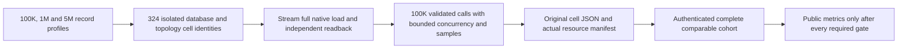

# Scaling qualification and fair deployment arms

Status: accepted new scaling implementation contract; current intensive comparison remains a separate control. Canonical slice: BenchmarkComparisons. Requirements: REQ-SCALE-009..015. Acceptance: AC-SCALE-009..015. Implementation contract: ADR-103.

## Purpose and bounded first stage

The existing `intensive-1k-c16` matrix is preserved byte-for-byte as a control. This feature adds a distinct actual-scale steady-state cohort through the existing `ComparisonRunner`, target adapters, isolated per-database GitHub job groups and native topology resources. It does not add a parallel harness or allow local measurements into website publication.

Three exact profiles are introduced:

| Profile | Actual corpus records | Measured operations per cell | Payload | Warmup / repetitions / concurrency |
|---|---:|---:|---:|---|
| `scaled-100k-c16` | 100,000 | 100,000 | 1,024 bytes | 256 / 1 / 16 |
| `scaled-1m-c16` | 1,000,000 | 100,000 | 1,024 bytes | 256 / 1 / 16 |
| `scaled-5m-c16` | 5,000,000 | 100,000 | 1,024 bytes | 256 / 1 / 16 |

Seed is fixed at 1729. Applicable common scenarios are exactly `PointRead`, `DocumentWrite`, `DocumentUpdate`, and `DocumentDelete`. `PointRead` is reported as the existing public point lookup operation; this stage does not claim SQL range-query or complex-query scale where an equivalent adapter is absent. All new cells are steady-state closed-loop. Existing actual topology counts `[1,2,3]` and target native adapters are reused. KeyLoad uses a genuinely configured native RF1/RF2/RF3 member count for each cell, with independent native endpoint/status and ACK validation. An external target is eligible only when that exact native member count and write ACK mode are supported; unsupported cells remain explicit. A single PostgreSQL process is never described as distributed.

The complete planned cohort identity is target × actual node count × profile × applicable scenario (9 × 3 × 3 × 4 = 324 cells, preserving explicit unsupported topology dispositions). Every eligible cell is one isolated Linux GitHub runner/job, uses exact source/run/attempt/job and target image receipts, seeds and verifies all N records, then performs exactly100,000 caller operations. A missing, failed, unsupported-but-required, duplicated, timed-out or mismatched cell invalidates cohort completeness; no partial result is publishable.

## Bounded dataset and runner behavior

Do not set the old materialized corpus count to five million. The existing `BenchmarkDataset` builds per-record JSON and float vectors, and the current measurer builds arrays of all operation inputs, outputs and samples; this would retain multiple gigabytes in the client before target storage.

The scaled runner path uses the existing profile/target/topology/report ownership but generates deterministic records by integer identity on demand. It retains no per-record JSON/vector object table and no duplicate payload corpus. Full target initialization writes all N actual records from the generator and independently verifies all N identities, exact payloads and a full native readback digest before measurement. Operation inputs are generated on demand by a fixed deterministic sequence. Update/delete preparation also streams through the generator.

During the measured stage the runner caps concurrent calls at 16, validates each caller result against the independently regenerated expected identity/content, and discards output immediately. It maintains exact total attempts, successful useful operations, failures, deadline timeouts, explicit rejections and unfinished calls, plus a fixed-size deterministic latency reservoir/sample with its algorithm and size recorded. It does not keep all inputs, output documents or operation tasks in memory. Every run uses an original caller cancellation token and finite per-operation deadline; shutdown joins actual in-flight operations. A later failure cannot be hidden by reducing the declared operation count.

## Fairness and provenance admission

The exact public library corpus/settings/readback/report seam and deterministic digest and latency-sample rules are frozen in [ADR-103](../../ADR/ADR-103-scaled-fair-comparisons.md#accepted-bounded-corpus-and-report-seam). The old materialized `ComparisonOptions` cap stays unchanged; only the closed typed scale profile represents five million records. A scale report carries that exact profile and null control options, and is never eligible for the original control-only publication admission. Actual native ordered readback is a bounded `IAsyncEnumerable<FoundDocument>` setup operation, independent of generated expectations.

Every report binds exact profile/scenario, N, payload/schema/seed, corpus digest, requested and completed operations, operation-mix identity, target/version/image, requested and observed native node count, target read contract and ACK/durability, source SHA, workflow/run/attempt/job/artifact identity, Linux runner image, an ephemeral runner-instance identifier for provenance, and a stable actual hardware-class fingerprint.

It records actual host CPU model/family/count and memory, effective cgroup CPU quota and memory limit, every database resource's configured and observed CPU/memory envelope, persistent-storage class/capacity, and total per-cell process/container CPU/RSS peaks. Cells must match on stable hardware-class fingerprint and effective resource limits, not ephemeral runner-instance ID or observed peak values. Observed peaks remain measurements and must be finite and within their declared effective envelopes; providers need not consume identical CPU or memory to be compared. The S1 shard-key distribution is fixed `uniform-v1`; query fanout is explicitly `not-applicable` to this point-read/CRUD matrix; recovery and movement are `not-run/unsupported`. Missing or changed required equality fields fail closed; no unknown field is treated as a match. The full 324-cell cohort must have a complete independently verified artifact set before provider comparison or website aggregation. Root-owned workflow/AppHost/resource/provenance/aggregation joins are part of acceptance; authored source and parser fixtures are not measurement evidence.

Existing matrix grouping stays one named GitHub job group per database and each database/scenario/topology/scale cell stays isolated on its own runner. RF3 never shares a runner or native stores with a comparison database. Single-node PostgreSQL is not a distributed comparator. Community-only unsupported clustering is retained as an exact explicit disposition and is excluded from unsupported comparative claims, not converted to a fallback.

## Requirements and acceptance

| Requirement | Acceptance and test evidence |
|---|---|
| REQ-SCALE-009: exact real-scale profiles | AC-SCALE-009: strict profile reader accepts only the three exact profile/count pairs, fixed seed/payload and 100K operation count; profile count mismatch, unsupported scenario, extra profile, wrong node count and non-Linux execution reject before native acquisition. Literal vectors in `ScaledComparisonProfileTests`; actual acquisition proof in isolated provider jobs. |
| REQ-SCALE-010: bounded deterministic data and measurement | AC-SCALE-010: lazy generator matches independent literal values/IDs/digest at boundary and random positions without retaining all records; real measured path writes/verifies exact N, performs exact100K calls, caps concurrency, retains only declared sample and exact counters, validates results, and settles all calls on cancellation. `ScaledComparisonDatasetTests`, `ScaledComparisonRunnerTests`; real native corpus required for each profile. |
| REQ-SCALE-011: actual topology and equivalent provider contract | AC-SCALE-011: each provider proves exact native1/2/3 membership, node-local stores and ACK/durability per cell; target reports are rejected for unexpected membership, target mismatch, single-node mislabeled distributed, or unsupported topology fallback. `ScaledTopologyAssertions` plus existing genuine target/container qualification. |
| REQ-SCALE-012: complete hardware/resource/workload manifest | AC-SCALE-012: independent validator rejects every missing or changed hardware-class/cgroup/resource/storage/durability/corpus/operation-mix/distribution/fanout-applicability field; equality applies to stable hardware class and effective limits, not ephemeral runner IDs or requested YAML alone. Observed peaks are finite and within limit, and remain actual per-cell output values. Exact cohort test proves all324 identities required and preserves failure/unsupported/missing states. `ScaledFairnessManifestTests` and real GitHub originals. |
| REQ-SCALE-013: publication and downstream scope | AC-SCALE-013: current 270 control schema and website remain unchanged; scaled cohort cannot publish until authenticated complete originals and root-owned aggregation verify exact source/run/attempt/job/artifact hashes and equality. Report explicitly marks closed-loop S1, with open-loop, shard-skew, fanout-stress, recovery/movement, endurance and power-loss qualification open/unsupported. `ScaledPublicationEligibilityTests`; actual aggregation source/CI provenance required. |

| REQ-SCALE-014: exact isolated scale routing | AC-SCALE-014: `Benchmarks:ScaleProfile` admits only `scaled-100k-c16`, `scaled-1m-c16`, or `scaled-5m-c16` when `Enabled=true`, the existing isolated target/node/scenario tuple is complete, and `EvidenceProfile` equals the exact scale ID. Reject unknown/case-mismatched/mixed/test-suite/control-override combinations before any scale resource starts. Without the selector, the current control route, 270 cell identities, reports and artifacts remain unchanged. Existing AppHost selector and ComparisonHost profile tests plus the literal profile parser tests. |
| REQ-SCALE-015: complete exact-source scale accounting | AC-SCALE-015: one workflow run/attempt accounts for the existing 270 control cells plus 324 scale identities (3 profiles × 9 targets × 3 actual node counts × 4 CRUD scenarios), in the existing nine database job groups and one aggregator invocation after all nine settle. Each row is validated against its exact profile and native target/topology contract. Only an exact declared unsupported topology/family disposition counts as identity coverage, never as measured success. A complete authenticated set with declared failed scale rows preserves the canonical failed/null rows and emits a receipt with `qualified=false` plus sorted safe failed IDs; it cannot claim successful full scale qualification. This does not gate, weaken, or change the existing ADR-080 control aggregate/publication behavior: a complete authenticated scale set with failures leaves the 270 control output and current publication semantics unchanged. Missing, duplicate, corrupt, or provenance/identity-mismatched scale artifacts fail active composite accounting without older fallback. The control `aggregate.json`/report/site JSON remains byte and meaning unchanged; scale submanifests/receipt are internal and no new site projection is emitted. Independent plan/matrix/proof/receipt TUnit cases and exact-source GitHub originals. |

Scale cell IDs append `-<profileId>` to the existing target/node/scenario base ID. Control cell IDs and job/artifact names remain exact. Scale job/artifact names include the full profile-qualified ID; every worker/proof/report is independently admitted against its matching exact profile. The scale receipt is internal qualification evidence and does not change ADR-080 control failed/null publication or add a site projection.

## Explicit limits and later stages

This first stage is closed-loop, steady-state, CRUD plus the current point-read query only. It does not prove offered-load behavior or overload recovery. A later open-loop stage needs an exact arrival schedule, drain horizon, queue/rejection/unfinished denominators and tail-latency treatment. Shard-skew/fanout, replica recovery and physical movement require actual native workloads/fault harnesses and their own measured phases. They cannot be marked passed using descriptive metadata. Full SQL query comparisons and all cross-model Q1 workloads require a separate semantically equivalent target matrix. None of these omissions changes the existing benchmark or website claims.

Backend product API: N/A. Frontend: N/A until authenticated complete comparison evidence has a separately approved projection. Internal scale worker credentials remain external; no new package or database dependency is introduced.

## Accepted scale resource evidence and Aspire forwarding, 2026-10-05

REQ/AC-SCALE-016 (new) and ADR-103 stage 10 (new). This accepted contract precedes private code; durable docs join before its live source. Only the three exact scaled profiles use the new sidecar. The original 270 controls and website aggregate schema remain unchanged.

One AppHost-owned collector observes the exact selected native target ContainerResources and lifecycle, never the load generator. It writes server-resource-evidence.v1 in a separate server-resource-evidence.json beside the original worker.json only after runner settlement; it binds exact source/run/attempt/job/target/nodeCount/scenario/profile and SHA256 of original worker bytes. AppHost/test teardown must await this original collector before reports are copied and app ownership is released. Failed/unavailable observation never changes workload timing/results or invents successful qualification.

Observe actual Linux kernel/architecture, CPU vendor/family/model/stepping and physical/logical CPU membership, memory, AppHost effective cgroup envelope, actual target container full IDs/image IDs/start identity/state and cgroup CPU/memory limits/counters, and actual writable data mount filesystem type/capacity. Never substitute requested limits, client sampler counters, host processor count alone, unknown VM class or Docker cache-adjusted working set for server RSS. For exact sampled aggregate process RSS, read bounded cgroup.procs plus /proc/<pid>/status and start identity, verify each PID belongs to the exact current container/cgroup, and reject PID reuse/identity ambiguity. Name measurements maxObservedRssBytes and observedCpuUsage, not an unsampled true peak. Missing permissions/remote daemon/unavailable cgroup or storage is explicit unqualified evidence.

Bounds: one collector, at most three native server containers, five-second cadence, at most 1,680 samples per resource and 140 minutes admitted observation work; retain online aggregates only. Per sample metadata at most 256 KiB, each regular proc/cgroup read at most 4 KiB except explicit hardware enumeration aggregate bounded 256 KiB; at most 128 admitted native PIDs and eight data mounts per container. Sidecar at most 64 KiB. Native Docker commands use closed argv, byte bounds, authenticated owned model identities, application stopping cancellation, TERM then one-second KILL and original exit/readers join. Thirty-second cleanup is an escalation/failure threshold, not detached settlement. Caps, truncation or absent samples force unqualified with existing safe missingEvidence categories; never fabricate zero/default counters.

Consumers retain the exact sidecar and authenticate its original artifact/provider/source binding and worker hash separately. No sidecar is manufactured for controls. Compare hardware identity, effective server CPU/memory envelope and storage class/capacity across each profile/nodeCount/scenario cohort, verifying each target's own image manifest separately. Container/PID identities and measured counters are provenance/output, not hardware-equivalence values. Reject mixed cohorts, mismatched actual envelopes, missing/corrupt/duplicate artifacts; no older fallback. Unsupported native cells retain their original explicit capability disposition and do not claim server samples.

Worker owns feature-local AppHost Contracts/Observation/Processes roles, minimal composition/lifecycle joins, bounded parser/identity/native regressions and scale-only script consumers. Root owns durable feature/ADR freeze, source integration, actual Aspire native Linux/Docker qualification, CI/publication, receipts and commits. Private implementation may rely on the existing 45 engine + 10 Aspire + 25 CI packets as explicit predecessor source, never silently overwrite their bases. A reviewable patch and base/post manifests are required. No checkout edits, gates or Git by the worker.

REQ/AC-SCALE-016's native cgroup-v2 walk must honor the actual hierarchy root:
the kernel defines `cpu.max` and `memory.max` only on non-root cgroups. Walk
every admitted non-root ancestor and retain its minimum effective limits; stop
at the verified real hierarchy root without inventing missing root limit files.
Observe the actual effective cpuset and supported hierarchy/controller identity.
An unreadable, malformed or missing required non-root observation still makes
evidence unqualified; it is never silently replaced by `max`. The independent
native Linux oracle must use the same documented root semantics without copying
the production parser. A supported Linux envelope test must assert its actual
value instead of conditionally omitting a null result. This source correction
changes no sidecar schema, workload, bounds or qualification requirements.

## Accepted prerequisite: Aspire scale forwarding (REQ/AC-SCALE-014)

Introduce only the separate KeyLoadTests:ScaleProfile test-harness selector. TestSuiteSettings accepts one exact canonical scaled ID only for Suite=comparison, the exact /*/*/IsolatedNativeComparisonTests/* filter, present native Benchmarks:Target, matching Benchmarks:EvidenceProfile, disabled Benchmarks:Enabled, no direct Benchmarks:ScaleProfile and no workload overrides. Reject missing suite, other suites, unknown/blank/case-mismatched IDs or mixed modes before any resource creation. Existing direct Benchmarks:ScaleProfile plus a suite remains rejected.

run-workload passes --KeyLoadTests:ScaleProfile=<id> to the outer AppHost. Its owned runner alone receives Benchmarks__ScaleProfile=<id>; clear KeyLoadTests__ScaleProfile alongside KeyLoadTests__Suite so the harness selector does not leak into the nested native AppHost. IsolatedNativeCase reads the exact ordinary ComparisonWorkerSelection from the runner environment and passes --Benchmarks:ScaleProfile=<id> to its own nested resource-owning AppHost. Preserve exact evidence/source/native topology and all control behavior. IsolatedNativeCase uses exactly 140 minutes for the closed scale profile and its existing 60 minutes for controls; all original tasks/resources are still joined.

Worker owns the narrow TestSuiteSettings/TestSuiteResources/IsolatedNativeCase/run-workload joins and real Aspire model plus independent argument/environment regressions. This is a prerequisite repair to the accepted SCALE-014 path, not a new alternate test caller. Durable docs join before live implementation.

## Accepted original teardown settlement (REQ/AC-SCALE-017)

REQ-SCALE-017 requires the actual isolated AppHost owner to settle every original
collector, capture, report-write, application-stop and disposal operation before
releasing its dependencies or deleting its owned data. This applies to controls
and scaled runs; successful workload results and control report schemas are
unchanged. The existing 30-second teardown limit is a recorded failure threshold,
not permission to detach the task with a continuation. After that threshold,
request cancellation or escalation through the original owner's supported API
where available, retain the threshold failure, and ultimately await that same
original task. Do not start a replacement operation, use an uncancellable shadow
task, or dispose an owner while its observation/writer still uses it.

AC-SCALE-017 requires genuine native lifecycle regressions to prove that cleanup
does not pass an unfinished original operation, and that cancellation and failure
paths settle the original process/readers/capture before directory deletion.
Retain the actual workload primary exception and each actual cleanup exception
object, including nested aggregates and original cancellation tokens; do not
flatten, replace them with a category string, or suppress them when a primary
failure exists. Cleanup continues through all safely reachable stages. At final
propagation, one original failure retains its stack, multiple failures retain
ordered primary then cleanup objects, and native ManagedCode fatal classification
remains visible and takes priority. The receipt contains only the existing safe
stage categories and primary-presence flag, never exception text or payloads.

TASK-SCALE-ORIGINAL-TEARDOWN is owned by ComparisonTests BenchmarkComparisons
Helpers (`IsolatedNativeCase`, `IsolatedNativeTeardown` and populated settlement
helpers), with Cases/Helpers for real native regressions. The resource collector
joins from SCALE-016 participate in this same lifetime. Root owns the pre-code
contract, review, Aspire execution, original evidence and commits; partition_pages
owns the private guarded implementation packet. No change to provider topology,
measurement timing, ACK/durability, source provenance or publication eligibility
is authorized. Rollback may revert the repair but cannot claim successful
settlement or qualification for a detached original task.
