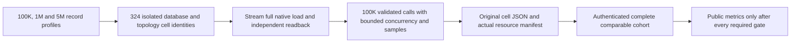

# Scaling qualification and fair deployment arms

Status: accepted new scaling implementation contract; current intensive comparison remains a separate control. Canonical slice: BenchmarkComparisons. Requirements: REQ-SCALE-009..013. Acceptance: AC-SCALE-009..013. Implementation contract: ADR-103.

## Purpose and bounded first stage

The existing `intensive-1k-c16` matrix is preserved byte-for-byte as a control. This feature adds a distinct actual-scale steady-state cohort through the existing `ComparisonRunner`, target adapters, isolated per-database GitHub job groups and native topology resources. It does not add a parallel harness or allow local measurements into website publication.

Three exact profiles are introduced:

| Profile | Actual corpus records | Measured operations per cell | Payload | Warmup / repetitions / concurrency |
|---|---:|---:|---:|---|
| `scaled-100k-c16` | 100,000 | 100,000 | 1,024 bytes | 256 / 1 / 16 |
| `scaled-1m-c16` | 1,000,000 | 100,000 | 1,024 bytes | 256 / 1 / 16 |
| `scaled-5m-c16` | 5,000,000 | 100,000 | 1,024 bytes | 256 / 1 / 16 |

Seed is fixed at 1729. Applicable common scenarios are exactly `PointRead`, `DocumentWrite`, `DocumentUpdate`, and `DocumentDelete`. `PointRead` is reported as the existing public point lookup operation; this stage does not claim SQL range-query or complex-query scale where an equivalent adapter is absent. All new cells are steady-state closed-loop. Existing actual topology counts `[1,2,3]` and target native adapters are reused. KeyLoad uses a genuinely configured native RF1/RF2/RF3 member count for each cell, with independent native endpoint/status and ACK validation. An external target is eligible only when that exact native member count and write ACK mode are supported; unsupported cells remain explicit. A single PostgreSQL process is never described as distributed.

The complete planned cohort identity is target × actual node count × profile × applicable scenario (9 × 3 × 3 × 4 = 324 cells, preserving explicit unsupported topology dispositions). Every eligible cell is one isolated Linux GitHub runner/job, uses exact source/run/attempt/job and target image receipts, seeds and verifies all N records, then performs exactly100,000 caller operations. A missing, failed, unsupported-but-required, duplicated, timed-out or mismatched cell invalidates cohort completeness; no partial result is publishable.

## Bounded dataset and runner behavior

Do not set the old materialized corpus count to five million. The existing `BenchmarkDataset` builds per-record JSON and float vectors, and the current measurer builds arrays of all operation inputs, outputs and samples; this would retain multiple gigabytes in the client before target storage.

The scaled runner path uses the existing profile/target/topology/report ownership but generates deterministic records by integer identity on demand. It retains no per-record JSON/vector object table and no duplicate payload corpus. Full target initialization writes all N actual records from the generator and independently verifies all N identities, exact payloads and a full native readback digest before measurement. Operation inputs are generated on demand by a fixed deterministic sequence. Update/delete preparation also streams through the generator.

During the measured stage the runner caps concurrent calls at 16, validates each caller result against the independently regenerated expected identity/content, and discards output immediately. It maintains exact total attempts, successful useful operations, failures, deadline timeouts, explicit rejections and unfinished calls, plus a fixed-size deterministic latency reservoir/sample with its algorithm and size recorded. It does not keep all inputs, output documents or operation tasks in memory. Every run uses an original caller cancellation token and finite per-operation deadline; shutdown joins actual in-flight operations. A later failure cannot be hidden by reducing the declared operation count.

## Fairness and provenance admission

The exact public library corpus/settings/readback/report seam and deterministic digest and latency-sample rules are frozen in [ADR-103](../../ADR/ADR-103-scaled-fair-comparisons.md#accepted-bounded-corpus-and-report-seam). The old materialized `ComparisonOptions` cap stays unchanged; only the closed typed scale profile represents five million records. A scale report carries that exact profile and null control options, and is never eligible for the original control-only publication admission. Actual native ordered readback is a bounded `IAsyncEnumerable<FoundDocument>` setup operation, independent of generated expectations.

Every report binds exact profile/scenario, N, payload/schema/seed, corpus digest, requested and completed operations, operation-mix identity, target/version/image, requested and observed native node count, target read contract and ACK/durability, source SHA, workflow/run/attempt/job/artifact identity, Linux runner image, an ephemeral runner-instance identifier for provenance, and a stable actual hardware-class fingerprint.

It records actual host CPU model/family/count and memory, effective cgroup CPU quota and memory limit, every database resource's configured and observed CPU/memory envelope, persistent-storage class/capacity, and total per-cell process/container CPU/RSS peaks. Cells must match on stable hardware-class fingerprint and effective resource limits, not ephemeral runner-instance ID or observed peak values. Observed peaks remain measurements and must be finite and within their declared effective envelopes; providers need not consume identical CPU or memory to be compared. The S1 shard-key distribution is fixed `uniform-v1`; query fanout is explicitly `not-applicable` to this point-read/CRUD matrix; recovery and movement are `not-run/unsupported`. Missing or changed required equality fields fail closed; no unknown field is treated as a match. The full 324-cell cohort must have a complete independently verified artifact set before provider comparison or website aggregation. Root-owned workflow/AppHost/resource/provenance/aggregation joins are part of acceptance; authored source and parser fixtures are not measurement evidence.

Existing matrix grouping stays one named GitHub job group per database and each database/scenario/topology/scale cell stays isolated on its own runner. RF3 never shares a runner or native stores with a comparison database. Single-node PostgreSQL is not a distributed comparator. Community-only unsupported clustering is retained as an exact explicit disposition and is excluded from unsupported comparative claims, not converted to a fallback.

## Requirements and acceptance

| Requirement | Acceptance and test evidence |
|---|---|
| REQ-SCALE-009: exact real-scale profiles | AC-SCALE-009: strict profile reader accepts only the three exact profile/count pairs, fixed seed/payload and 100K operation count; profile count mismatch, unsupported scenario, extra profile, wrong node count and non-Linux execution reject before native acquisition. Literal vectors in `ScaledComparisonProfileTests`; actual acquisition proof in isolated provider jobs. |
| REQ-SCALE-010: bounded deterministic data and measurement | AC-SCALE-010: lazy generator matches independent literal values/IDs/digest at boundary and random positions without retaining all records; real measured path writes/verifies exact N, performs exact100K calls, caps concurrency, retains only declared sample and exact counters, validates results, and settles all calls on cancellation. `ScaledComparisonDatasetTests`, `ScaledComparisonRunnerTests`; real native corpus required for each profile. |
| REQ-SCALE-011: actual topology and equivalent provider contract | AC-SCALE-011: each provider proves exact native1/2/3 membership, node-local stores and ACK/durability per cell; target reports are rejected for unexpected membership, target mismatch, single-node mislabeled distributed, or unsupported topology fallback. `ScaledTopologyAssertions` plus existing genuine target/container qualification. |
| REQ-SCALE-012: complete hardware/resource/workload manifest | AC-SCALE-012: independent validator rejects every missing or changed hardware-class/cgroup/resource/storage/durability/corpus/operation-mix/distribution/fanout-applicability field; equality applies to stable hardware class and effective limits, not ephemeral runner IDs or requested YAML alone. Observed peaks are finite and within limit, and remain actual per-cell output values. Exact cohort test proves all324 identities required and preserves failure/unsupported/missing states. `ScaledFairnessManifestTests` and real GitHub originals. |
| REQ-SCALE-013: publication and downstream scope | AC-SCALE-013: current 270 control schema and website remain unchanged; scaled cohort cannot publish until authenticated complete originals and root-owned aggregation verify exact source/run/attempt/job/artifact hashes and equality. Report explicitly marks closed-loop S1, with open-loop, shard-skew, fanout-stress, recovery/movement, endurance and power-loss qualification open/unsupported. `ScaledPublicationEligibilityTests`; actual aggregation source/CI provenance required. |

## Explicit limits and later stages

This first stage is closed-loop, steady-state, CRUD plus the current point-read query only. It does not prove offered-load behavior or overload recovery. A later open-loop stage needs an exact arrival schedule, drain horizon, queue/rejection/unfinished denominators and tail-latency treatment. Shard-skew/fanout, replica recovery and physical movement require actual native workloads/fault harnesses and their own measured phases. They cannot be marked passed using descriptive metadata. Full SQL query comparisons and all cross-model Q1 workloads require a separate semantically equivalent target matrix. None of these omissions changes the existing benchmark or website claims.

Backend product API: N/A. Frontend: N/A until authenticated complete comparison evidence has a separately approved projection. Internal scale worker credentials remain external; no new package or database dependency is introduced.
