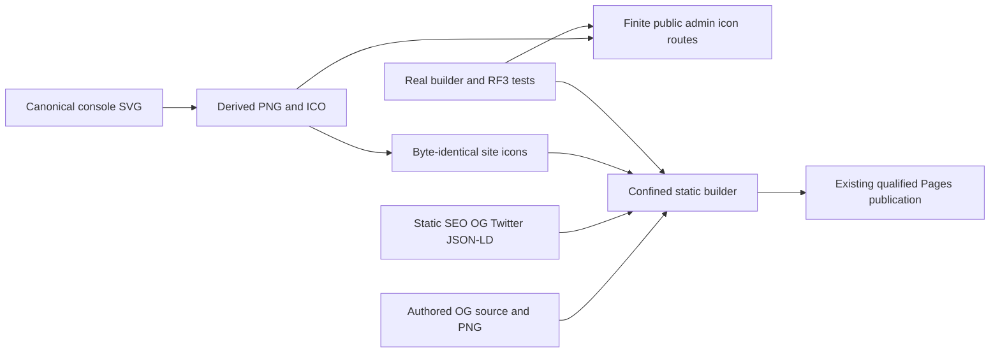

# BenchmarkComparisons — website discovery and shared icons

Owner request 2026-10-03. ADR040/051/053 retain the site build, finite console asset shell and one canonical visual source. The additive ADR053 implementation contract covers this presentation standard. The task acceptance/plan are local scaffolding; this document retains the durable requirements, acceptance and verification contract.

Scope: recognizable shared icons for the public landing and operational console, accurate static search/social metadata, and a readable link-preview card. The existing canonical is `https://www.keyload.cloud/`; copy remains English. No logo redesign, dependency, DNS, service worker, analytics, persisted data, public database API or topology change.

| Requirement | Acceptance | Owning surface and proof |
| --- | --- | --- |
| REQ-SEO-001 shared compatible favicon/touch set | 001 | canonical AdminDashboard Assets, byte-identical site root mirrors; SiteMetadata icon assertions |
| REQ-SEO-002 accurate static search/social discovery | 002–003 | BenchmarkComparisons index.html, assets/site.webmanifest and existing builder robots/sitemap; emitted HTML/JSON-LD TUnit |
| REQ-SEO-003 readable factual share card | 004 | BenchmarkComparisons assets/og-image.svg/png; PNG output assertions and manual artwork review |
| REQ-SEO-004 safe complete static output | 005 | BenchmarkComparisons build-site.mjs; real clean/rejection builds |
| REQ-SEO-005 operational console icon/indexing boundary | 006 | AdminDashboard index/AdminStaticAssets and real RF3 AdminFaviconAssertions |
| REQ-SEO-006 honest qualification/publication | 007 | exact-SHA site/runtime GitHub receipts, lead review |

## Acceptance and test matrix

| Criterion | Pass condition; negative/edge behavior | Verification |
| --- | --- | --- |
| AC-SEO-001 | Canonical console `logo.svg` and site `favicon.svg` remain unchanged and byte-identical. Six derived binary files are identical across surfaces and emitted output: ICO with bounded 16/32/48 frames; square PNG32/96/180/192/512. Both heads reference SVG, ICO, PNG32/96 and touch180. Landing manifest references local192/512 with scope/start URL `./` and display `browser`. Missing, conflicting or incorrectly sized assets fail. | `SiteMetadataTests` validates actual source/build bytes, formats, dimensions and head references. |
| AC-SEO-002 | Real built initial HTML has exactly one nonempty title/description, www HTTPS canonical, index/large-preview robots and canonical theme color. Complete OG website/title/description/site_name/url/locale/image/type/1200×630/alt and Twitter large-card/title/description/image/alt agree. Image URL is `https://www.keyload.cloud/og-image.png`. No localhost, conflicting fields, credentials or unsupported readiness/performance claims. Existing H1/navigation/body hooks remain. | `SiteMetadataTests` parses the actual builder head; native browser/manual review retains readable output. |
| AC-SEO-003 | Valid schema.org JSON-LD describes WebSite and SoftwareSourceCode with stable IDs, actual name/URL/GitHub/C#/MIT. Invented offers, ratings, reviews and search actions are absent. Generated robots/sitemap use the same canonical, allow icon/card fetches, and exclude admin. | Real-output HTML/JSON-LD/robots/sitemap assertions in `SiteMetadataTests`. |
| AC-SEO-004 | Editable `assets/og-image.svg` and real PNG1200×630 under300KiB use the existing K/palette and readable product message. No measurements or screenshot artifacts. Root `og-image.png` is the exact source PNG. Every manifest/head asset exists. | Signature/IHDR/size/exact-byte assertions; subjective full-size and reduced composition is a manual ADR040/053 exception. |
| AC-SEO-005 | Builder checks every added source as a regular confined asset before output. Missing/symlink icon or card is rejected without partial output. Existing immutable report/vendor hashes, output confinement and JS/CSS budgets remain mandatory. | `SiteMetadataRejectionTests` mutates isolated source copies and invokes the real builder with authentic reports; existing SiteBuildTests remain. |
| AC-SEO-006 | Console uses shared icons/theme and `noindex,nofollow`. Only six exact additional embedded public GET/HEAD routes exist, with PNG/ICO MIME, no-store/nosniff and unchanged CSP/referrer policy. Credential-free GET returns valid bytes; HEAD is empty. Unknown assets, POST and database routes gain no public access. Console has no marketing canonical/schema/OG claims. | `AdminFaviconAssertions` joins the existing genuine RF3 `AdminDashboardRf3Tests` shell flow; prior authentication/method/unknown-path assertions remain. |
| AC-SEO-007 | Preserve unrelated changes, normal current-branch delivery and exact-SHA GitHub run/job/artifact receipts. Source push, local rendering, failed/pending cohorts and skipped suites do not establish publication/indexing/coverage. | Lead review plus real Website/Tests provider results and live asset confirmation after successful deployment. |

## Implementation and delivery contract

The lead freezes scope/criteria before three disjoint scopes:

- Exports: six icon files under `src/KeyLoad.Server/Features/AdminDashboard/Assets/`
  and exact site-root mirrors; `site/Features/BenchmarkComparisons/assets/og-image.svg/png`
  and `site.webmanifest`.
- Production: only `site/Features/BenchmarkComparisons/index.html` head and
  `build-site.mjs`, plus console `Assets/index.html` head and `AdminStaticAssets.cs`.
- Regressions: new `SiteMetadata*` files under the existing SiteTests slice,
  new `AdminFaviconAssertions` helpers in IntegrationTests/AdminDashboard, and one
  invocation in `AdminShellAssertions`.

The lead owns shared docs, reviews every result and joins all three
before development/static/manual checks, normal scoped main commit/push, and
exact-SHA GitHub qualification. A blocked worker does not unblock integration.
The sequence and boundaries extend ADR053 rather than introducing another
identity or crawl-file owner. No migration is needed; rollback coherently reverts
the head, exports, builder copies and finite route additions.

Public DTOs, SDK/MCP, persistence, schema migrations, RAM/SIMD and measured operation performance: N/A; static presentation writes none of them. Canonical names remain BenchmarkComparisons for the public site and AdminDashboard for the console, sharing existing identity assets under ADR053. No analytics or service worker is introduced.

Acceptance explicitly covers missing/symlink files, invalid dimensions, metadata conflicts, long-text preview readability and unauthorized/unknown routes. Qualification remains GitHub-only. Local development builds and visual inspection are manual/design evidence and do not prove provider cache refresh, indexing, full tests, coverage or publication. The full relevant baseline is recorded in the plan; isolated cohort absence remains a publication blocker.
